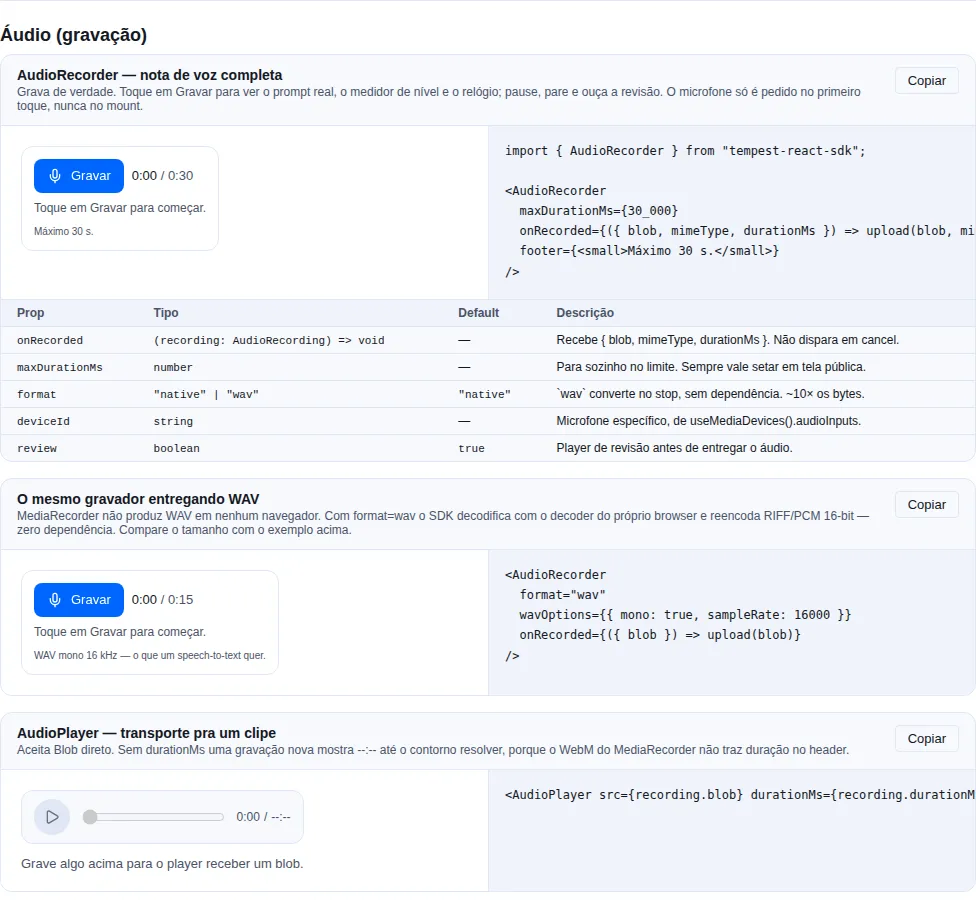
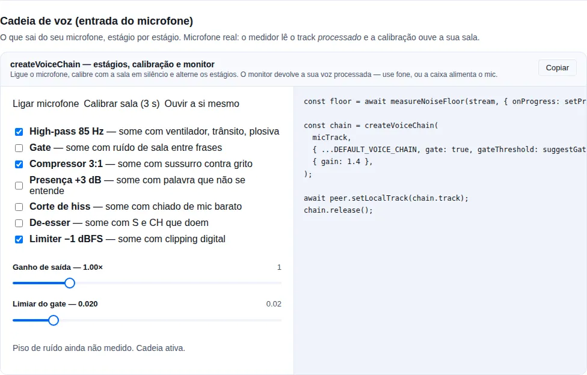

# Audio

Audio in the browser, both directions.

**Playback** — sound notifications (message chime, payment confirmation) with `playAudio`, `useAudio` and `createAudioPlayer`, plus the `AudioPlayer` component when you need a transport (play/pause, bar, times).

**Capture** — `AudioRecorder` for a one-line voice note, and underneath it `useMediaPermission`, `useMediaDevices`, `useMicrophone`, `useAudioRecorder`, `createLevelMeter` and `blobToWav`. No new dependency: the whole slice measures **5.50 KB brotli**.

!!! tip "If you just want to record a voice note, skip to [Recording](#recording-start-with-the-component)"
    The rest of the page is the layer underneath, for when the component does not fit.

!!! info "Why a wrapper around `new Audio()`?"
    Playing sound in the browser runs into the _autoplay policy_ and leaking `Audio` elements. The SDK encapsulates it: it tracks the current clip (so you can `stop` it), normalizes volume, handles the autoplay block by returning `null` instead of throwing, and cleans up on unmount when you use the hook.

<!-- gallery:audio-capture -->
[](gallery.md)

*Section `audio-capture` of the [gallery](gallery.md) — run it locally to interact.*
<!-- /gallery -->

<!-- gallery:voice-chain -->
[](gallery.md)

*Section `voice-chain` of the [gallery](gallery.md) — run it locally to interact.*
<!-- /gallery -->

## `playAudio` — one-off on the shared player

Ideal for a sound fired by an event, with no UI state:

```tsx
import { playAudio, useEventStream } from "tempest-react-sdk";

interface StreamEvent {
  type: "NOTIFY" | "PAYMENT-SUCCESS";
}

export function PaymentSounds() {
  useEventStream<StreamEvent>(`${import.meta.env.VITE_API_URL}/notifications`, {
    onMessage: ({ data }) => {
      if (data.type === "PAYMENT-SUCCESS") {
        void playAudio("/audio/money.mp3", { volume: 0.5 });
      }
    },
  });

  return null;
}
```

`playAudio(src, options)` returns `Promise<HTMLAudioElement | null>` — `null` when the browser blocked autoplay. Options: `volume` (0–1, default 1), `loop`, `autoplay`, `stopPrevious`, `onEnded`, `onError`. To stop whatever the shared player is playing, use `stopAudio()`.

## `useAudio` — private per-component player

Each hook instance gets its own player, so unmounting stops audio automatically:

```tsx
import { useAudio } from "tempest-react-sdk";

export function NotificationBell() {
  const audio = useAudio();

  return (
    <button onClick={() => audio.play("/audio/plim.wav", { volume: 0.8 })}>
      🔔 {audio.unlocked ? "" : "(tap to enable sound)"}
    </button>
  );
}
```

- `audio.play(src, options)` — plays on the private player (same options as `playAudio`).
- `audio.stop()` — stops the current clip.
- `audio.unlocked` — becomes `true` after the first successful `play()`. Useful to hide UI asking for the initial interaction.
- Automatic cleanup on unmount.

!!! tip "Use `unlocked` to guide the user"
    Before the first click, the browser blocks audio. Show a hint ("tap to enable sound") while `unlocked === false` and hide it as soon as it flips to `true`.

## `createAudioPlayer` — isolated channels

`createAudioPlayer()` creates a tracker independent from the default. Use it when you need to play two sounds simultaneously without one cutting off the other (e.g. background music + a sound effect):

```ts
import { createAudioPlayer } from "tempest-react-sdk";

const music = createAudioPlayer();
const sfx = createAudioPlayer();

await music.play("/audio/loop.mp3", { loop: true, volume: 0.3 });
await sfx.play("/audio/coin.wav", { volume: 1 }); // does not cut the music

music.stop(); // stops only the music
console.log(sfx.current()); // HTMLAudioElement | null
```

Each player tracks **one** current clip. `stopPrevious: true` in `play()` stops that same player's previous clip before playing the new one.

## `createSfxPool` / `useSfxPool` — short sound effects

`new Audio(src)` on every play allocates an element and re-enters the network stack for a file the browser already has. For a sound that fires dozens of times a minute — a menu blip, a hit, a pickup — that is the wrong shape. The pool allocates once per source and replays.

```ts
import { useSfxPool } from "tempest-react-sdk";

function Menu({ sfxVolume }: { sfxVolume: number }) {
  const sfx = useSfxPool({ volume: sfxVolume / 100, baseUrl: import.meta.env.BASE_URL });

  useEffect(() => {
    sfx.preload(["sfx/move.mp3", "sfx/select.mp3", "sfx/back.mp3"]);
  }, [sfx]);

  return <button onClick={() => sfx.play("sfx/select.mp3")}>Confirm</button>;
}
```

- `play(src, { volume })` — the per-play volume is multiplied by the pool's master.
- `preload(src | src[])` — fetch ahead of the first play, so it is not silent while the file downloads.
- `setVolume(v)` — also applies to whatever is already sounding, **rescaled by each clip's own gain**: one that started at half volume is not yanked up.
- `stop(src?)` — stop one source, or all of them.
- `dispose()` — release everything. `useSfxPool` calls it on unmount.

!!! note "`voices`: restart or overlap"
    The default (`voices: 1`) **restarts** the clip on every play, which is what a menu blip wants. Raise it to let the sound overlap itself — a hit landing while the previous one still rings:

    ```ts
    const hits = createSfxPool({ voices: 3 });
    ```

!!! tip "Not the same as `createAudioPlayer`"
    `createAudioPlayer` tracks **one** current clip, with loop, output routing and lifecycle callbacks — what background music needs. Effects are the opposite case: many sources, all short, fire-and-forget, and the only thing that matters is that firing one is cheap.

Changing `volume` on `useSfxPool` calls `setVolume` on the existing pool rather than rebuilding it — rebuilding would throw away every element the user has already downloaded, which is exactly the cost the pool exists to avoid. `baseUrl`, `voices` and `maxSources` are read once, at creation.

## `AudioPlayer` — visible transport

**When to use it:** when the user needs to **control** playback, not just hear
it — a voice message, a recorded take, an attachment. `playAudio` is
fire-and-forget; `AudioPlayer` gives play/pause, a draggable bar and the times.

```tsx
import { AudioPlayer, Button } from "tempest-react-sdk";
import { Trash } from "lucide-react";

export function Recording({ blob, remove }: { blob: Blob; remove: () => void }) {
    return (
        <AudioPlayer
            src={blob}
            durationMs={12_400}
            actions={
                <Button variant="ghost" iconOnly aria-label="Delete" onClick={remove}>
                    <Trash size={16} />
                </Button>
            }
        />
    );
}
```

!!! tip "Pass `durationMs` when you already know the length"
    A `Blob` recorded in the browser usually arrives with no duration header, and
    `<audio>` reports `Infinity` until it has played to the end. The bar is stuck
    for that whole stretch. If your recorder already told you the length, pass it
    — the component uses that value until the real metadata lands.

## Autoplay policy

Browsers block playback before the user's first interaction. `playAudio` / `play()` return `null` when blocked (and call `onError` if provided) — instead of throwing.

!!! warning "Unlock audio on the first click"
    You can't play sound before any interaction. Design the app to fire a `play()` (even of a short silent clip) on the first click of any button; from then on the browser allows the rest.

## Assets

The SDK does **not** bundle audio files. Serve them at `/audio/*` (or a CDN) and pass the URL. Sound-palette inspiration (alofans):

```ts
export const AUDIOS = {
  plim: "/audio/plim.wav",
  money: "/audio/money.mp3",
  notification: "/audio/bell_sound.wav",
};
```

## Recording: start with the component

If all you want is a voice note, it is one line. `AudioRecorder` handles the permission, the level meter, the clock and the review before you ever see the audio:

```tsx
import { AudioRecorder } from "tempest-react-sdk";

export function VoiceNote({ ticketId }: { ticketId: string }) {
  return (
    <AudioRecorder
      maxDurationMs={120_000}
      onRecorded={({ blob, mimeType, durationMs }) => {
        const form = new FormData();
        form.append("audio", blob, `note.${mimeType.includes("mp4") ? "m4a" : "webm"}`);
        form.append("duration", String(durationMs));
        void fetch(`/api/tickets/${ticketId}/audio`, { method: "POST", body: form });
      }}
      footer={<small>Two minutes maximum.</small>}
    />
  );
}
```

What you get without writing any of it:

| You did | The component does |
| --- | --- |
| nothing | Does **not** ask for the microphone on mount — only on the first press of Record |
| nothing | When the permission is already `denied`, says so and how to fix it, instead of offering a button that cannot work |
| nothing | Live level meter, a clock that **subtracts paused time**, pause/resume |
| `maxDurationMs` | Stops itself at the cap, and shows the cap next to the clock |
| nothing | Review player with a transport, and "Record again" reusing the same stream |
| `format="wav"` | Converts before handing over, so `onRecorded` **always** gives you the format you asked for |

!!! danger "The permission prompt does not fire on mount, and that is the most important decision on this page"
    A prompt the user did not provoke is the most reliable way to earn a permanent **Block** — after which `getUserMedia` rejects **without ever prompting again**. So the microphone opens on the first press of Record, and the press survives the round-trip: the component arms the recording and starts when the stream lands. Waiting for a second click would make the first one look broken.

### Props

| Prop | Type | Default | What it does |
| --- | --- | --- | --- |
| `onRecorded` | `(recording: AudioRecording) => void` | — | Receives the finished audio. Never fires on cancel. |
| `maxDurationMs` | `number` | — | Stops itself. **Always worth setting** on a public screen. |
| `deviceId` | `string` | — | Specific microphone, from `useMediaDevices().audioInputs`. |
| `format` | `"native" \| "wav"` | `"native"` | `"wav"` converts on stop. See the cost below. |
| `wavOptions` | `WavOptions` | — | `{ mono: true, sampleRate: 16000 }` suits speech. |
| `audioBitsPerSecond` | `number` | — | 32000–64000 is plenty for voice in Opus. |
| `review` | `boolean` | `true` | Review player before handing over. |
| `locale` | `"pt-BR" \| "en"` | `"pt-BR"` | Labels. |
| `footer` | `ReactNode` | — | A hint, a count, a legal notice. |
| `onError` | `(error: unknown) => void` | — | Recorder failure, or a WAV conversion that did not work. |

`AudioRecording = { blob, mimeType, durationMs }`.

## `AudioPlayer` — a transport for one clip

Takes a `Blob` directly, because the thing an app most often plays is the recording it just made:

```tsx
<AudioPlayer src={recording.blob} durationMs={recording.durationMs} />
<AudioPlayer src="/audio/briefing.mp3" sinkId={chosenOutput} />
```

!!! warning "Pass `durationMs` whenever you have it — `<audio>` lies about a fresh recording"
    `MediaRecorder` writes WebM **with no duration in the header**, so `<audio>.duration` on a fresh recording is `Infinity`. That is why the recorder keeps its own clock and you should pass it along. Without it the component applies the only workaround there is — seeking past the end to force the browser to demux to the last frame — and the bar stays stuck until that resolves.

| Prop | Type | Default | What it does |
| --- | --- | --- | --- |
| `src` | `string \| Blob \| null` | — | URL or blob. A blob becomes an object URL that is revoked for you. |
| `durationMs` | `number` | — | Known length. Wins over the element's. |
| `sinkId` | `string` | — | Chosen output. Chromium only. |
| `autoPlay` · `loop` | `boolean` | `false` | As on the native element. |
| `actions` | `ReactNode` | — | Right of the times — download, delete. |
| `onEnded` · `onError` | `() => void` | — | End, and decode/network failure. |

## Permission without firing the prompt

`useMediaPermission` reads the state **without** asking for the device. It is what makes a decent flow possible at all:

```tsx
import { useMediaPermission } from "tempest-react-sdk";

export function RecordButton({ onStart }: { onStart: () => void }) {
  const { state, supported } = useMediaPermission("microphone");

  if (state === "denied") {
    return <p>Microphone blocked. Allow it in site settings and reload.</p>;
  }
  return (
    <button onClick={onStart}>
      {state === "prompt" || !supported ? "Allow microphone and record" : "Record"}
    </button>
  );
}
```

| State | Means | What the UI should do |
| --- | --- | --- |
| `"prompt"` | never asked | a button; asking shows the prompt |
| `"granted"` | allowed | a normal button |
| `"denied"` | **sticky** — asking again rejects immediately, with no prompt | instructions for site settings, not a button |
| `"unknown"` | the Permissions API did not answer (Safari does not expose `microphone`) | treat as "you will have to ask to find out" |

The state is **live**: if the user changes the permission in site settings, the hook updates.

## Devices: microphone and output

```tsx
import { useMediaDevices, isAudioOutputSelectionSupported } from "tempest-react-sdk";

const { audioInputs, audioOutputs, labelsAvailable } = useMediaDevices();
```

!!! warning "The names only appear after permission"
    Before the user allows a capture, **every** `label` is `""` — the ids and the count are real, the names are not. A picker rendered there is a column of blanks. Use `labelsAvailable` to decide when to show it. Ask for the microphone first, then offer the choice.

!!! info "The list changes while the page is open"
    Plugging in a headset mid-recording is the normal case, not an edge case. The hook subscribes to `devicechange` instead of enumerating once on mount.

`audioOutputs` comes back **empty** where the browser has no output routing — Safari and Firefox do not implement `setSinkId`. Empty there means "you cannot offer this choice", not "there are no speakers". Check `isAudioOutputSelectionSupported()` before rendering the picker, or the control is a lie on two of three engines.

```tsx
import { setAudioOutput } from "tempest-react-sdk";

const ok = await setAudioOutput(audioRef.current, chosenDevice);
if (!ok) toast("This browser cannot choose the sound output.");
```

`playAudio` takes `sinkId` too, which is useful for a chime that must land on a headset while the call audio stays on the speakers.

## Gain above 100%: `createAudioBus`

**When to use:** you need to turn a source **up**, mix several of them, and send the result to a chosen device. A call with per-participant volume is the typical case.

`element.volume` is clamped at `1`. A participant who speaks too quietly can only ever be turned **down** — the one correction nobody needs. Going above 100% takes a Web Audio graph, and building one correctly runs into three non-obvious things, which is what this bus packages.

```tsx
import { createAudioBus } from "tempest-react-sdk";

const bus = createAudioBus({ maxGain: 3 });

const handle = bus.attach(remoteStream, { gain: 1 });
handle.setGain(2.4); // above 1 — the point of the whole thing
handle.stop();

bus.setMasterGain(1.2);
await bus.setOutputDevice(headsetId); // "" = system default
bus.close();
```

In React, `useAudioBus` does the same and closes the context on unmount:

```tsx
import { useAudioBus } from "tempest-react-sdk";
import { useEffect } from "react";

function Participant({ stream, volume }: { stream: MediaStream; volume: number }) {
  const bus = useAudioBus({ maxGain: 3 });

  useEffect(() => {
    const handle = bus.attach(stream);
    return () => handle.stop();
  }, [bus, stream]);

  return <Slider value={volume} onChange={(v) => bus.setMasterGain(v)} aria-label="Volume" />;
}
```

### The three traps the bus handles

!!! danger "The Chrome bug that leaves the graph silent"
    A `MediaStreamAudioSourceNode` built over a **remote** WebRTC stream produces no samples in Chrome unless that same stream is also attached to a media element ([crbug.com/687574](https://crbug.com/687574)). The graph looks correct and is **completely silent** — without knowing the bug, that is a day of debugging. `attach()` creates a `<audio muted autoplay>` anchor for you. It looks like dead code and is **not**: deleting it mutes the entire call in Chrome.

!!! warning "The limiter goes after the sum, never per source"
    Clipping is a property of the **mix**, not of the participant: three people boosted to 200% each stay clean alone and distort the moment they talk over each other. A per-source limiter cannot see that; the master one can. Tune it with `limiter: { threshold: -3 }`, or turn it off with `limiter: false`.

!!! info "`setSinkId` lives on the element, not on the context"
    Sending the call to a headset while the rest of the system keeps the speakers is only reachable by leaving through `MediaStreamAudioDestinationNode` → `<audio>` → `setSinkId`. `AudioContext.setSinkId` has far thinner support, so the mix leaves through a real element. `bus.canSelectOutput` says whether the engine allows it: on Safari and on **every** iOS browser the output follows the system route, and the picker should be **hidden**, not offered and then ignored.

### Details that avoid surprises

- **The ceiling is yours.** `maxGain` (default `DEFAULT_MAX_GAIN`, which is `3`) caps both a source and the master. Past about 3, speech distorts before it gets louder.
- **Gain is clamped, and `NaN` becomes `1`.** `NaN` arrives from an empty number field or a failed parse, and assigning it to an `AudioParam` **throws** — losing the audio to a typo in an input is a steep price.
- **A context is expensive.** Browsers cap how many `AudioContext`s may live at once (Chrome allows ~6). Pass `context` to reuse the one the page already has, and call `close()` (or use the hook) when you are done.
- **`resume()` for the autoplay policy.** A context created outside a user gesture starts suspended — and suspended is silent with no error anywhere. Call `resume()` from the click that starts playback.
- **After `close()` the bus stays callable.** `attach()` returns an inert handle instead of throwing — not politeness: creating a node on a closed `AudioContext` throws `InvalidStateError`, and the stream that arrives late is the **normal** case (a WebRTC `ontrack` firing after the component that owned the bus left the screen).
- **With no Web Audio the bus is inert, not broken.** `supported: false`, every method stays callable. A page without sound beats a page that throws.

!!! warning "`Progress` is not an audio meter"
    The `Progress` fill has `transition: width`, so the bar reports where the level **was** — the one thing a meter cannot do. For a live level use `createLevelMeter` and write to the DOM inside a `requestAnimationFrame`.

    Two traps if you draw your own: the scale has to be in **dB** (on a linear one, normal speech is squeezed into the first fifth), and the color gradient has to live on the **track** with a mask on top — on an element that grows, the gradient is rescaled with it and paints red at the tip of a weak signal, reporting clipping to someone who is nearly inaudible.

## Who is talking: `monitorVoiceActivity`

A speaking indicator is information **every client derives for free** from the track it already receives. Signalling it through a server is the wrong path: the state changes several times per second and floods the room with messages.

```ts
import { monitorVoiceActivity } from "tempest-react-sdk";

const vad = monitorVoiceActivity(remoteStream, (speaking) => setSpeaking(speaking));
// later
vad.stop();
```

Two things separate this from an `if (level > x)`:

- **The release.** RMS drops to nothing in the gaps between words, so a bare comparison strobes on every syllable. The state only falls after `releaseMs` (default 350 ms) of quiet.
- **`onChange` fires on the flip, not on the sample.** A callback per reading would re-render the participant list ten times a second to say the same thing.

The meter underneath runs with smoothing **off** (`decay: 0`): its eased decay plus this release would hold the indicator open long after the speech stopped.

!!! warning "One context per participant hits the browser's cap"
    Chrome allows around six live `AudioContext`s, and a five-person call with a monitor each gets there. Open **one** and pass it as `context` to every monitor — `stop()` closes only a context it created itself.

## Input: `createVoiceChain`

`createAudioBus` handles what reaches **your ears**. `createVoiceChain` handles what leaves **your microphone** — and what the browser hands over, even with `echoCancellation` and `noiseSuppression` on, is still fan rumble under the speech, 20 dB between a whisper and a shout, and consonants that do not read.

```ts
import {
  createVoiceChain,
  DEFAULT_VOICE_CHAIN,
  measureNoiseFloor,
  suggestGateThreshold,
} from "tempest-react-sdk";

const floor = await measureNoiseFloor(stream, { onProgress: setProgress });

const chain = createVoiceChain(
  micTrack,
  { ...DEFAULT_VOICE_CHAIN, gate: true, gateThreshold: suggestGateThreshold(floor) },
  { gain: 1.4 },
);

await peer.setLocalTrack(chain.track);
// later
chain.release();
```

### Every stage exists because of a symptom

| Stage | Removes | Default |
| --- | --- | --- |
| `highPass` (85 Hz) | fans, traffic rumble, desk knocks, plosives | **on** |
| `gate` (220 ms hold) | room noise between phrases | off |
| `compressor` (3:1) | the distance between a whisper and a shout | **on** |
| `presence` (+3 dB @ 3 kHz) | words that arrive but are not understood | off |
| `hissCut` (9 kHz) | the hiss of a cheap microphone | off |
| `deEsser` (@ 7 kHz) | S and CH sounds that hurt on headphones | off |
| `limiter` (−1 dBFS) | digital clipping, which the other end **cannot** recover | **on** |

The four that are off by default each cost something audible when they are not needed: a gate at the wrong threshold clips words, presence on an already bright microphone is harsh, and a de-esser on a voice that does not hiss just dulls it.

!!! warning "The order is not cosmetic"
    Gating **before** the high-pass lets a rumble hold the gate open. Compressing **before** the gate lifts the noise floor up to meet the threshold. A limiter **before** the output gain is a ceiling the gain walks straight through. The chain is built the way a console is: cut what is not speech, silence the rest, level it, shape it, set how loud it goes out, and only then hold a ceiling.

!!! info "This comes after the browser's processing, not instead of it"
    `echoCancellation` and `noiseSuppression` stay on: the two solve different problems. The browser's is trained on stationary noise inside the capture pipeline; this cuts what it leaves behind and decides when the line should be silent at all.

### Nobody sets a gate threshold by eye

Setting a gate by ear means switching it on and hearing what disappeared, which only works if you already know what **should** have disappeared. `measureNoiseFloor` listens to the room at rest for 3 s and returns the **peak** RMS; `suggestGateThreshold` puts the threshold above it by a margin, because a gate sitting exactly at the noise level chatters, opening and closing on the room's own variation.

The result is clamped at both ends: a room measured as perfectly silent would give a threshold of zero (a gate that never closes) and one measured while somebody talked would give a threshold nothing opens.

!!! tip "The threshold is read on every tick"
    Moving `gateThreshold` on the settings object changes the **live** chain — a slider does not need to rebuild the graph.

### Hearing yourself before joining

```tsx
const monitor = monitorVoiceChain(previewTrack, settings, { gain });
// when the button is released
monitor.stop();
```

!!! danger "Feedback"
    Without headphones the speakers feed the microphone that feeds the speakers. That is why this is a **held, explicit** action rather than a preference — and the warning belongs in your UI, not only here.

### An idle chain builds nothing

`isVoiceChainIdle(settings, gain)` answers whether anything would change the signal. With every stage off and gain `1`, `createVoiceChain` hands the source track back untouched and **does not even open an `AudioContext`** — browsers cap how many can be live, and one opened for a pass-through chain counts the same. `supported` is `false` in that case and on an engine without Web Audio.

## Building it yourself: the hooks

```tsx
import { useMicrophone, useAudioRecorder } from "tempest-react-sdk";

export function OwnRecorder() {
  const mic = useMicrophone({ noiseSuppression: true });
  const rec = useAudioRecorder(mic.stream, { maxDurationMs: 60_000 });

  return (
    <>
      <button onClick={mic.start} disabled={mic.status === "ready"}>
        Allow microphone
      </button>
      <button onClick={rec.start} disabled={!rec.ready}>
        Record
      </button>
      <button onClick={() => void rec.stop()}>Stop</button>
      <meter min={0} max={1} value={rec.level} />
      <span>{rec.durationMs} ms</span>
      {mic.error && <p role="alert">{mic.error.message}</p>}
    </>
  );
}
```

!!! danger "`stop()` on the microphone is not optional"
    Dropping the last reference to a `MediaStream` does **not** turn off the microphone. Every track has to be stopped by hand — otherwise the browser keeps showing its recording indicator, the OS keeps the device busy, and the **next** `getUserMedia` (in another tab of the same app, typically) fails with `NotReadableError`. `useMicrophone` stops tracks on `stop()`, on unmount, and before re-opening.

!!! info "The recorder does **not** own the stream"
    `rec.stop()` deliberately leaves the microphone open, so a second take does not need another permission round-trip. Closing belongs to `mic.stop()`.

### Classified errors

`useMicrophone().error` arrives already translated from `DOMException` into something you can branch on:

| `kind` | Cause | Action |
| --- | --- | --- |
| `insecure` | page on plain HTTP | the fix is a **URL**, not a setting |
| `unsupported` | engine with no capture | another browser |
| `permission-denied` | denied | site settings |
| `not-found` | no device, or none matching the constraints | relax `deviceId` |
| `in-use` | hardware busy | close the other app/tab |
| `unknown` | everything else | shows the original message |

The order matters: a missing `mediaDevices` is almost never "this browser cannot do audio" — it is a page on HTTP, where the whole API simply does not exist. Reporting `unsupported` there sends the developer looking for a polyfill for a problem an `https://` URL fixes.

## Recording level

`useAudioRecorder` already publishes `level` (0–1) at 10 Hz. For a per-frame bar, use `createLevelMeter` directly and write to the DOM:

```tsx
const meter = createLevelMeter(stream);
const tick = () => {
  bar.style.transform = `scaleX(${meter.level()})`;
  raf = requestAnimationFrame(tick);
};
// ...and always meter.stop() in cleanup
```

!!! warning "A meter is not decoration"
    A muted OS input, or a headset with its mic arm folded up, produces a **perfectly successful recording of silence** — and with no visible level the user only finds out after they finish talking.

The value is RMS, not peak: peak reacts to a single sample and flickers, RMS tracks perceived loudness. Attack is instant and release is eased, which is how every hardware meter behaves — one that lags on the way up reads as "not recording".

!!! info "Close the `AudioContext`"
    The meter creates an `AudioContext` and `stop()` closes it. Browsers cap live contexts (Chrome allows around six), so a meter left running on unmount breaks every later one on the page. The hooks and the components close it for you; with a raw `createLevelMeter`, `stop()` is yours.

## Format: what you can and cannot have

!!! danger "`MediaRecorder` produces neither MP3 nor WAV — in any browser"
    Chromium and Firefox produce **Opus** (in WebM or Ogg); Safari produces **AAC** (in MP4). No engine implements an MP3 or WAV encoder for it. The SDK default negotiates in that order and reports what actually came out — `AudioRecording.mimeType` is what the browser said, not what you asked for.

If the backend only takes **WAV**, `blobToWav` converts client-side with **zero dependency**: it decodes with the browser's own decoder (`decodeAudioData`) and re-encodes RIFF/PCM 16-bit.

```tsx
import { blobToWav } from "tempest-react-sdk";

const wav = await blobToWav(recording.blob, { mono: true, sampleRate: 16000 });
```

!!! warning "WAV costs about 10× the bytes"
    The same voice note that is 40 KB in Opus lands around 500 KB as WAV at 48 kHz stereo. `{ mono: true, sampleRate: 16000 }` takes that to roughly 80 KB — and 16 kHz mono is what a speech-to-text endpoint wants anyway. The resampler is `OfflineAudioContext`, i.e. the browser's own, not a hand-rolled one.

If the backend only takes **MP3**: transcode on the server. An MP3 encoder in the client means a WASM build of the order of 150 KB in **every** SDK consumer's bundle to serve one format — the trade this SDK does not make.

## Outside React: the primitives

`useAudioRecorder` is a thin shell over a recorder that knows nothing about
React. When recording happens away from a component — in a store, a worker, a
state machine — reach for the primitive directly:

```ts
import { createAudioRecorder, isAudioRecordingSupported } from "tempest-react-sdk";

if (!isAudioRecordingSupported()) throw new Error("This browser cannot record audio");

const rec = createAudioRecorder(stream, { audioBitsPerSecond: 48_000 });
rec.start();
// ...
const recording = await rec.stop(); // { blob, mimeType, durationMs }
```

The handle exposes `start`, `pause`, `resume`, `stop`, `cancel`, plus the
readers `status()` and `durationMs()` (both discounting paused time) and the
negotiated `mimeType`.

| Symbol                               | What it is                                                                  |
| ------------------------------------ | --------------------------------------------------------------------------- |
| `createAudioRecorder(stream, opts)`  | The recorder behind the hook. It does not own the stream — stop the mic yourself. |
| `isAudioRecordingSupported()`        | `MediaRecorder` exists **and** some container is producible.                 |
| `isMediaCaptureSupported()`          | The same question for capture as a whole (`getUserMedia` + `MediaRecorder`) — use it before offering a record button of any kind. |
| `pickAudioMimeType(preferred?)`      | First container in the list the browser actually produces, or `null`.        |
| `AUDIO_MIME_CANDIDATES`              | The order the SDK negotiates: Opus (WebM/Ogg) → AAC (MP4).                   |
| `encodeWav({ channels, sampleRate })`| RIFF/PCM 16-bit from Float32 channels — the engine behind `blobToWav`.       |

!!! tip "`isAudioRecordingSupported()` asks the right question"
    Checking only `typeof MediaRecorder !== "undefined"` lets through the engine
    that has the API and produces none of the containers — the failure then
    surfaces at `start()`, with the user already waiting. This function checks
    both.

## Long uploads: chunks

```tsx
const rec = useAudioRecorder(mic.stream, {
  timesliceMs: 5_000,
  onChunk: (chunk) => void upload(chunk),
});
```

Without `timesliceMs` the whole recording sits in memory until `stop()` — fine for a voice note, not fine for an hour-long meeting. **Chunks are not independently playable**: only the set forms a valid file.

## Recap

- `playAudio(src, options)` — one-off sound on the shared player; returns `null` if autoplay was blocked. `stopAudio()` stops that player.
- `useAudio()` — private per-component player with `play`/`stop`/`unlocked` and unmount cleanup.
- `createAudioPlayer()` — isolated channel to play simultaneous sounds without one cutting off the other.
- The autoplay policy is handled by returning `null`; unlock audio on the first interaction.
- The SDK ships no audio files — you serve them and pass the URL.
- `AudioRecorder` — a complete voice note: permission, level, clock, review, retake.
- `AudioPlayer` — a transport for one clip; takes a `Blob` and **needs** `durationMs` for a fresh recording.
- `useMediaPermission` — permission state **without** firing the prompt; separates "never asked" from "denied" (which is sticky).
- `useMediaDevices` — mics and outputs, reacts to `devicechange`; `labelsAvailable` says when a picker is worth showing.
- `useMicrophone` — stream plus classified error; `stop()` **must** be called or the recording indicator never clears.
- `useAudioRecorder` — status, a clock that subtracts pauses, level, `maxDurationMs`, chunks.
- `blobToWav` — WAV with no dependency, about 10× the bytes; MP3 stays on the server.
- `setAudioOutput` / `isAudioOutputSelectionSupported` — output routing, Chromium only.
- `createAudioBus` / `useAudioBus` — gain **above 100%**, a limiter after the sum and `setSinkId`; `attach()` brings the crbug.687574 anchor that keeps the graph from going silent in Chrome.

## See also

- [SSE](./sse.md) / [Push](./push.md) — typical audio triggers
