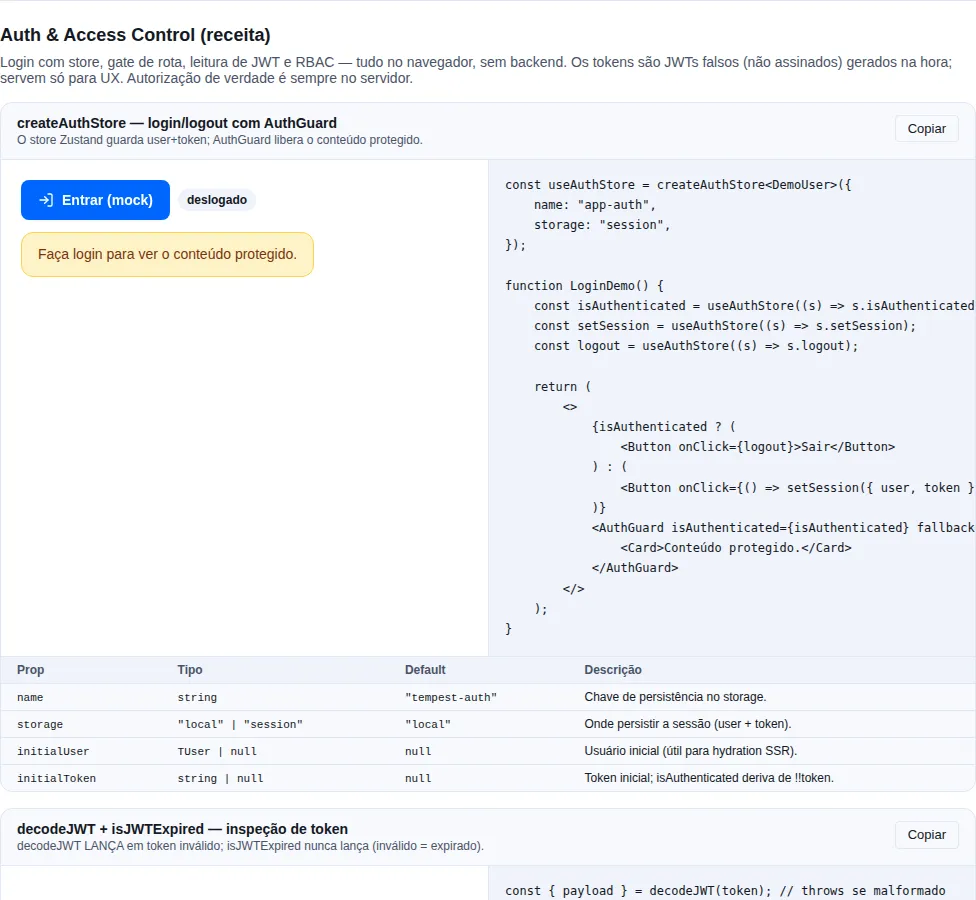

# Auth

Front-end authentication is always the same handful of problems: where to keep the session, how to protect a route, how to read what's inside the token, and what to do when it expires mid-deploy. The `auth` module of `tempest-react-sdk` solves each one with a small, independent piece — you take only what you need, without inheriting a whole auth framework.

Five pieces, all decoupled from one another:

1. `createAuthStore` — builds a Zustand store typed by the app's `TUser`.
2. `AuthGuard` — router-agnostic route gate.
3. `decodeJWT` / `isJWTExpired` — defensive JWT reading (no cryptographic validation).
4. `lazyWithRetry` — `React.lazy` with chunk retry + reload on final failure.
5. `createRefreshQueue` — coalesces concurrent refresh calls.

!!! info "Why loose pieces instead of one monolithic `<AuthProvider>`"
    Every Tempest app has a different user model, a different login flow, and a
    different backend. A monolithic provider would force everyone into a single
    shape. Five primitives compose freely: you can use the store without the
    guard, the guard without the JWT decoder, and so on.

<!-- gallery:recipe-auth -->
[](gallery.md)

*Section `recipe-auth` of the [gallery](gallery.md) — run it locally to interact.*
<!-- /gallery -->

## Store — `createAuthStore<TUser>`

The SDK **does not own your user model**. You pass the `TUser` and get a typed Zustand store, already wired with `persist`.

```tsx
import { createAuthStore } from "tempest-react-sdk";

type SessionUser = { id: string; name: string; is_admin: boolean };

export const useAuthStore = createAuthStore<SessionUser>({
  name: "tempest-app-auth",
  storage: "local",
});

// inside a component: read state (re-renders on change)
function Header() {
  const { user, isAuthenticated, logout } = useAuthStore();
  return isAuthenticated ? <button onClick={logout}>Sign out {user?.name}</button> : null;
}

// outside React: write through getState()
useAuthStore.getState().setSession({
  user: { id: "u1", name: "Ana", is_admin: false },
  token: "eyJhbGciOi…",
});
useAuthStore.getState().logout();
```

Persists to `localStorage` (default) or `sessionStorage` (`storage: "session"`). Only `user` and `token` are persisted (`partialize`); after hydration, `isAuthenticated` is re-derived from `!!token` in `onRehydrateStorage`.

Extra options: `initialUser`, `initialToken` (useful for SSR hydration).

!!! tip "Select only what you need"
    `const isAuth = useAuthStore((s) => s.isAuthenticated)` re-renders only when
    `isAuthenticated` changes. Destructuring the whole store
    (`const { ... } = useAuthStore()`) subscribes to **every** slice and
    re-renders on any change — prefer the selector in hot components.

## Guard — `AuthGuard`

Router-agnostic: it's a pure if/else. You decide what to render in each branch — typically `<Outlet />` when authenticated and `<Navigate />` for the redirect.

```tsx
import { Navigate, Outlet } from "react-router";
import { AuthGuard } from "tempest-react-sdk";

export function ProtectedLayout() {
  const isAuthenticated = useAuthStore((s) => s.isAuthenticated);
  return (
    <AuthGuard isAuthenticated={isAuthenticated} fallback={<Navigate to="/login" replace />}>
      <Outlet />
    </AuthGuard>
  );
}
```

`AuthGuard` takes `isAuthenticated`, `children`, and `fallback` — no opinion about the router. Compose with custom role guards by nesting a second guard inside `children`.

!!! note "Relationship with the routing module's `<RouteGuard>`"
    If you use the SDK's routing module, the declarative
    [`<RouteGuard>`](./routing.en.md) already covers the common case
    (`when` + `redirectTo`) right in the route tree. Use `AuthGuard` when you
    need imperative control over what renders in each branch, or when you're not
    using `<AppRouter>`.

## JWT — `decodeJWT` / `isJWTExpired`

A **payload-only** decoder — it does **not** validate the signature. Use it on the client for inspection/UX (show a name, hide an admin button, decide when to refresh). Real authorization always happens on the backend.

```ts
import { decodeJWT, isJWTExpired } from "tempest-react-sdk";

// decodeJWT THROWS when the token is malformed — wrap it in try/catch
try {
  const { header, payload, signature } = decodeJWT(token);
  console.log(payload.sub, payload.exp);
} catch {
  // token without 3 segments, or non-JSON header/payload
}

// isJWTExpired never throws — an invalid token counts as expired
const expired = isJWTExpired(token, 30); // 30s leeway → treated as expired 30s early
```

!!! warning "`decodeJWT` throws; it does not return `null`"
    On a malformed token, `decodeJWT` **throws** an `Error` — always wrap it in
    `try/catch`. `isJWTExpired`, on the other hand, is defensive: any decode
    error is treated as "expired" (`true`), so it's safe to call directly. The
    signature is `isJWTExpired(token, leewaySeconds = 0)`.

!!! danger "Never authorize on the client"
    A JWT payload is base64 — anyone can read and forge it. Use `decodeJWT` for
    UX only. Every real permission decision happens on the server, which
    validates the signature.

## Code-splitting — `lazyWithRetry`

`React.lazy` with chunk retry + a `window.location.reload()` fallback on final failure.

**Why it exists**: after a deploy, users with an open tab try to load chunks that have already been deleted (404). The retry with backoff usually picks up the new version; the reload resolves the case where the cached `index.html` is also stale.

```tsx
import { Suspense } from "react";
import { lazyWithRetry } from "tempest-react-sdk";
import { Spinner } from "tempest-react-sdk";

const Settings = lazyWithRetry(() => import("./Settings"), {
  retries: 3, // default
  initialDelay: 400, // default — exponential backoff: 400, 800, 1600ms
  reloadOnFinalFailure: true, // default
});

export function SettingsRoute() {
  return (
    <Suspense fallback={<Spinner />}>
      <Settings />
    </Suspense>
  );
}
```

### Pages that take props

The component does not lose its typing on the way through the wrapper. Its type is **inferred** from the module the factory resolves to, so a page with a required prop, one with an optional prop and one with no props at all all pass through — and the rendered element is still checked against the real props.

```tsx
import { Suspense } from "react";
import { lazyWithRetry } from "tempest-react-sdk";
import { Spinner } from "tempest-react-sdk";

interface EditorProps {
  mode: "edit" | "view";
}

function Editor({ mode }: EditorProps) {
  return <p>mode: {mode}</p>;
}

const LazyEditor = lazyWithRetry(() => Promise.resolve({ default: Editor }));

export function EditorRoute() {
  return (
    <Suspense fallback={<Spinner />}>
      <LazyEditor mode="edit" />
    </Suspense>
  );
}
```

!!! note "Prop checking still applies"
    Swapping `mode="edit"` for `mode="bogus"`, dropping the required prop or
    passing a prop that does not exist are all compile errors, exactly as on the
    component itself. The wrapper relaxes only the generic **constraint** —
    which used to demand a component with no props — never the inference.

!!! tip "Same for a route's `lazy`"
    A `TempestRouteObject`'s `lazy` field accepts the same set of components, so
    a route tree of typed pages goes through `defineRoutes` without a cast. See
    [Routing](./routing.en.md).

### Warming the chunk — `preload()`

The returned component carries a `preload()`. Call it when the route becomes **likely**, not when it is needed — hovering the link, opening the menu that holds it, finishing the step before it — and the chunk arrives before the user commits. The `Suspense` fallback simply never shows.

```tsx
<a href="/settings" onMouseEnter={() => void Settings.preload()}>
  Settings
</a>
```

The work is shared with the render path: whichever fires first performs the single fetch and the other awaits the same promise. Calling it repeatedly is safe.

!!! tip "Warming several routes at once"
    `preload()` returns the promise, so you can await a set of them:

    ```ts
    await Promise.all([Settings.preload(), Profile.preload()]);
    ```

    Or fire and forget — the rejection is already handled internally, so a speculative preload nobody awaits never becomes an `unhandledrejection`.

## Refresh queue — `createRefreshQueue`

Coalesces N concurrent refresh calls into **1** request. While one refresh is in flight, every extra call gets the **same** promise; when it resolves, they all resume together.

```ts
import { createRefreshQueue } from "tempest-react-sdk";

const refresh = createRefreshQueue(
  async () => {
    const { token } = await api.post<{ token: string }>("/auth/refresh");
    useAuthStore.getState().setToken(token);
  },
  { getToken: () => useAuthStore.getState().token },
);

// 5 simultaneous 401 requests → 1 single refresh, all resume:
await Promise.all([refresh(), refresh(), refresh(), refresh(), refresh()]);
```

!!! warning "Sharing the promise alone does not collapse a burst — pass `getToken`"
    A page that fires several requests at once gets several 401s back, but they **do not land inside one window**: the stragglers resolve after the first refresh already finished, find no promise to join, and each starts another one — rotating a token that is already fresh. Measured against a mock backend, five concurrent expired requests took **two** refreshes, not one.

    `getToken` closes that gap: the queue remembers the token its last refresh installed, and a call that finds that same token still in place returns immediately, because the refresh it was about to perform has already happened. The same five requests then take exactly one refresh, and so do twenty.

!!! tip "Plug it straight into `createApiClient`"
    Pass the queue as `refresh` on the HTTP client — it calls it on every 401 and the coalescing happens for free, avoiding a storm of parallel refreshes hammering your auth endpoint.

Use it together with `createApiClient`:

```ts
const refresh = createRefreshQueue(async () => {
  await AuthService.refresh();
});

const api = createApiClient({
  baseURL: "...",
  refresh, // called on 401 — coalesces concurrent calls
  onUnauthorized: () => useAuthStore.getState().logout(),
});
```

## Complete example — login, guard, and refresh together

A real app stitches all five pieces together. This is the complete, copy-pasteable skeleton:

```ts
// auth-store.ts
import { createAuthStore } from "tempest-react-sdk";

export type SessionUser = { id: string; name: string; email: string };

export const useAuthStore = createAuthStore<SessionUser>({
  name: "tempest-app-auth",
  storage: "local",
});
```

```ts
// api.ts
import { createApiClient, createRefreshQueue } from "tempest-react-sdk";
import { useAuthStore } from "./auth-store";

const refresh = createRefreshQueue(async () => {
  const res = await fetch("/api/auth/refresh", { method: "POST", credentials: "include" });
  const { token } = (await res.json()) as { token: string };
  useAuthStore.getState().setToken(token);
});

export const api = createApiClient({
  baseURL: "/api",
  getToken: () => useAuthStore.getState().token,
  refresh, // called on 401 → coalesce → retry the original request
  onUnauthorized: () => useAuthStore.getState().logout(),
});
```

```tsx
// LoginPage.tsx
import { useNavigate } from "react-router";
import { useAuthStore, type SessionUser } from "./auth-store";
import { api } from "./api";

export function LoginPage() {
  const navigate = useNavigate();
  const setSession = useAuthStore((s) => s.setSession);

  async function handleSubmit(email: string, password: string) {
    const { user, token } = await api.post<{ user: SessionUser; token: string }>("/auth/login", {
      body: { email, password },
    });
    setSession({ user, token });
    navigate("/", { replace: true });
  }

  return <form onSubmit={(e) => e.preventDefault()}>{/* ...fields... */}</form>;
}
```

```tsx
// ProtectedLayout.tsx
import { Navigate, Outlet } from "react-router";
import { AuthGuard } from "tempest-react-sdk";
import { useAuthStore } from "./auth-store";

export function ProtectedLayout() {
  const isAuthenticated = useAuthStore((s) => s.isAuthenticated);
  return (
    <AuthGuard isAuthenticated={isAuthenticated} fallback={<Navigate to="/login" replace />}>
      <Outlet />
    </AuthGuard>
  );
}
```

The flow: login calls `setSession`, persisting `user` + `token`. `ProtectedLayout` reads `isAuthenticated` from the store. Every request injects the token via `getToken`; on a 401, `createApiClient` calls the (coalesced) refresh queue and retries the request. If the refresh fails, `onUnauthorized` fires `logout()` and the guard redirects to `/login`.

## Recap

- **`createAuthStore<TUser>`** — typed, persisted Zustand store; you own the `TUser`.
- **`AuthGuard`** — router-agnostic if/else; you choose `children` and `fallback`.
- **`decodeJWT`** throws on an invalid token; **`isJWTExpired`** is defensive and never throws. For UX only, never for authorization.
- **`lazyWithRetry`** — survives stale post-deploy chunks with backoff + reload.
- **`createRefreshQueue`** — N concurrent refreshes become 1.

### See also

- [Routing](./routing.en.md) — declarative `<RouteGuard>`, an alternative to `AuthGuard` in the route tree
- [HTTP](./http.en.md) — `getToken: () => useAuthStore.getState().token` + `refresh: queue`
- [Error Boundary](./error-boundary.en.md) — `lazyWithRetry`'s final failure becomes a `ChunkLoadError` that the boundary catches
