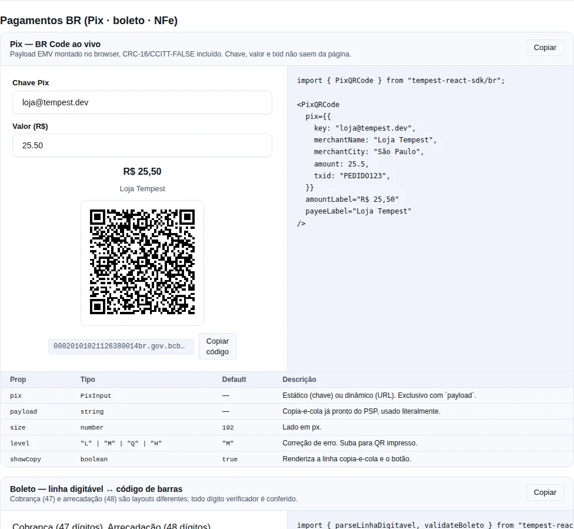

# BR payments & fiscal

The four rails every Brazilian product ends up needing: **Pix**, **boleto**, the **NFe access key** and **holidays / business days**. Pure TypeScript, **no new dependency** — the whole slice measures **9.22 KB brotli**, and Pix alone (payload + CRC + QR component) measures **6.1 KB**.

!!! info "Import from the `tempest-react-sdk/br` subpath"
    Like the rest of the BR module, these helpers live in `tempest-react-sdk/br`, not on the root entry. If you don't import it, you don't pay for it.

    ```ts
    import { pixPayload, parseLinhaDigitavel, parseChaveNFe, isBusinessDay } from "tempest-react-sdk/br";
    ```

!!! warning "The SDK talks to no bank"
    Nothing here calls the Brazilian Central Bank, a state tax authority, or a PSP API. These are **local encoders and validators**: they assemble the right string, verify the check digits and read the fields. Whether a boleto exists, is registered or has already been paid — only a bank can answer. Whether an invoice was authorised — only SEFAZ can.

---

<!-- gallery:br-payments -->
[](gallery.md)

*Section `br-payments` of the [gallery](gallery.md) — run it locally to interact.*
<!-- /gallery -->

## Part 1 — Pix

### The problem

A Pix QR is not a "link QR". It is an **EMV MPM** payload (the EMVCo standard the Central Bank adopted in its "Manual de Padrões para Iniciação do Pix"): a list of `ID + 2-digit length + value` triples, closed by a CRC-16.

Writing that by hand fails in the same place every time — the checksum. It is CRC-16/CCITT-FALSE (polynomial `0x1021`, initial value `0xFFFF`) computed over **everything before it plus the literal `6304`**, that is, including the header of tag 63 itself. Get that wrong and you ship a QR that opens in the app and fails to scan.

### The short path: `<PixQRCode>`

```tsx
import { PixQRCode } from "tempest-react-sdk/br";

export function CheckoutPix() {
  return (
    <PixQRCode
      pix={{
        key: "loja@tempest.dev",
        merchantName: "Loja Tempest",
        merchantCity: "São Paulo",
        amount: 25.5,
        txid: "PEDIDO123",
      }}
      amountLabel="R$ 25,50"
      payeeLabel="Loja Tempest"
    />
  );
}
```

That renders the symbol **and** the copy-and-paste line with a copy button. The two together are not decoration:

!!! tip "Never render the QR alone"
    In a mobile checkout the QR appears **on the same device** that would scan it. Without the copyable string the user is stuck. It is the single most common mistake in a Pix screen.

The payload is built in the browser and the symbol is drawn by the SDK's own encoder (the same one behind [`QRCode`](./components/utility.md#qrcode)). Key, amount and txid **never leave the page** — a QR-image service would receive all three.

When the payload comes ready from your PSP (a signed dynamic charge), pass it straight through:

```tsx
<PixQRCode payload={charge.brcode} level="Q" size={220} />
```

!!! warning "`pix` and `payload` are mutually exclusive"
    Passing both throws `PixError`. Prefer `payload` for a dynamic charge: the PSP issued that string, and rebuilding it here only adds a way to get it wrong.

### `pixPayload` — the string, no UI

```ts
import { pixPayload } from "tempest-react-sdk/br";

const payload = pixPayload({
  key: "12345678909",
  merchantName: "Loja Tempest",
  merchantCity: "Sao Paulo",
  amount: 25.5,
  txid: "PEDIDO123",
});

// 00020101021126330014br.gov.bcb.pix0111123456789095204000053039865405
// 25.505802BR5912Loja Tempest6009Sao Paulo62130509PEDIDO1236304D68C
```

Accepted fields:

| Field | Tag | Required | Note |
| --- | --- | --- | --- |
| `key` | 26 / 01 | ✅ | CPF, CNPJ, e-mail, phone or EVP. Validated and normalised. |
| `merchantName` | 59 | ✅ | Max **25** characters. Longer throws. |
| `merchantCity` | 60 | ✅ | Max **15** characters. |
| `amount` | 54 | — | BRL. Omit to let the payer type the value. |
| `txid` | 62 / 05 | — | `[A-Za-z0-9]{1,25}`. Defaults to `***`. |
| `description` | 26 / 02 | — | Free text some wallets show. |
| `postalCode` | 61 | — | CEP, digits only. |
| `oneTime` | 01 | — | `true` → tag `12` (single use) instead of `11`. |

### Static vs dynamic

The distinction **changes what settles**, so it is not cosmetic:

=== "Static"

    Tag 26 carries the **key**. The QR is self-contained, printable and reusable. With `amount` omitted it settles against whatever the payer typed.

    ```ts
    pixPayload({
      key: "loja@tempest.dev",
      merchantName: "Tempest",
      merchantCity: "Belo Horizonte",
    });
    ```

=== "Dynamic"

    Tag 26 carries a **URL** (`payloadLocation`), and the wallet fetches amount and payee from the PSP. It settles against what the PSP served. Defaults to single use.

    ```ts
    pixPayload({
      kind: "dynamic",
      url: "pix.example.com/qr/v2/abc123",
      merchantName: "Tempest",
      merchantCity: "Recife",
    });
    ```

!!! tip "A charge that must reconcile to the cent needs the dynamic form"
    A static QR with no amount settles against what the payer typed — including R$ 1.00 on a R$ 100.00 invoice.

### Keys: validation, and the eleven-digit trap

```ts
import { normalizePixKey, pixKeyType } from "tempest-react-sdk/br";

pixKeyType("123.456.789-09"); // "cpf"
pixKeyType("11.222.333/0001-81"); // "cnpj"
pixKeyType("loja@tempest.dev"); // "email"
pixKeyType("+5511987654321"); // "phone"
pixKeyType("123e4567-e89b-12d3-a456-426614174000"); // "evp"
pixKeyType("not a key"); // null

normalizePixKey("(11) 98765-4321"); // { type: "phone", value: "+5511987654321" }
```

CPF and CNPJ go through `validateCPF` / `validateCNPJ` (the same ones as [BR Forms](./forms-br.md)) — a key whose check digits fail is rejected with `PixError`.

!!! danger "A CPF and a national mobile number are both eleven digits"
    `"11987654321"` is a valid mobile **and** could be a CPF. The check digits break the tie: eleven digits with a valid DV become `"cpf"`, anything else becomes `"phone"`. Pass phone keys as `+5511987654321` and the ambiguity is gone.

### Accents

The BR Code character set has no room for accents. The SDK **strips diacritics** and rejects whatever is left outside printable ASCII:

```ts
pixPayload({ key: "…", merchantName: "Padaria Açúcar", merchantCity: "São Paulo" });
// → "5914Padaria Acucar" … "6009Sao Paulo"

pixPayload({ key: "…", merchantName: "Loja ✅", merchantCity: "Recife" });
// → PixError: merchantName has characters the BR Code cannot carry
```

!!! note "Why strip instead of throw"
    "São Paulo" is the city's real name and the payload cannot carry it. A QR that does not scan is worse than a name without its tilde. An emoji, on the other hand, is a caller mistake, and that one surfaces.

### Reading a payload back

```ts
import { parsePixPayload } from "tempest-react-sdk/br";

const data = parsePixPayload(pasted);
data.key; // "12345678909"
data.amount; // 25.5
data.txid; // "PEDIDO123"
data.crcValid; // true
data.fields; // every TLV, in order, unknown ones included
```

It is **tolerant of unknown tags** — PSPs do add their own templates, and a reader that rejects them is useless in production. What is **not** tolerated: a broken frame (a length that runs past the end, a missing `6304`) and a **CRC mismatch**, which throws. To inspect a payload you already know is corrupt:

```ts
parsePixPayload(pasted, { requireCrc: false }); // crcValid: false, no throw
```

!!! danger "A CRC mismatch is not a warning"
    A BR Code whose checksum fails was corrupted in transit, and the account it now points at is **not** the account the payee published. That is why the default throws.

### `pixCrc16`, if you need the checksum alone

```ts
import { pixCrc16 } from "tempest-react-sdk/br";

pixCrc16("123456789"); // "29B1" — the published CRC-16/CCITT-FALSE check value
pixCrc16(payload.slice(0, -4)); // the four hex characters that close the payload
```

---

## Part 2 — Boleto

### Two layouts, the same length

The barcode is 44 digits in both cases, and that is where the bug lives:

| | First digit | Typed line | Used for |
| --- | --- | --- | --- |
| **Cobrança** (`"banco"`) | ≠ 8 | 47 digits | A bank boleto against an invoice |
| **Arrecadação** (`"arrecadacao"`) | `8` | 48 digits | Utility, tax, traffic fine |

They are not variants of one format: **every field moves position and meaning**. The SDK detects the layout from the first digit and returns a discriminated union — narrow on `kind` before reading it.

### Reading what the scanner handed you

```ts
import { parseCodigoBarras, parseLinhaDigitavel } from "tempest-react-sdk/br";

const boleto = parseCodigoBarras("34191157000001234560000123456789012345678901");

if (boleto.kind === "banco") {
  boleto.banco; // "341"
  boleto.valor; // 1234.56
  boleto.vencimento; // Date — 2026-09-15
  boleto.linhaDigitavel; // 47 digits, check digits included
} else {
  boleto.segmentoLabel; // "Órgãos governamentais"
  boleto.valor; // BRL, or null when the field is a reference
  boleto.empresa; // FEBRABAN code, or a CNPJ prefix on segmento 6
}
```

`parseLinhaDigitavel` goes the other way and accepts both lines (47 or 48). Both parsers **verify every check digit the layout allows checking**: the 3 (bank) or 4 (arrecadação) block digits, plus the general one. Any of them wrong throws `BoletoError` naming which.

Explicit conversion, when you only want the other representation:

```ts
import { codigoBarrasToLinhaDigitavel, linhaDigitavelToCodigoBarras } from "tempest-react-sdk/br";

linhaDigitavelToCodigoBarras("34190000172345678901723456789017115700000123456");
// "34191157000001234560000123456789012345678901"
```

### Validating typed input

```ts
import { formatLinhaDigitavel, validateBoleto } from "tempest-react-sdk/br";

validateBoleto(input); // true / false, never throws
formatLinhaDigitavel(input);
// "34190.00017 23456.789017 23456.789017 1 15700000123456"
```

`formatLinhaDigitavel` is a **display** helper: input that is neither 47 nor 48 digits comes back untouched.

### Layout only, without parsing: `boletoKind`

To branch the UI before validating (show the right field, pick the icon),
`boletoKind` reports the layout from the length and the first digit, and returns
`null` for input that is not a slip — without throwing:

```ts
import { boletoKind } from "tempest-react-sdk/br";

boletoKind("34191157000001234560000123456789012345678901"); // "banco"
boletoKind("848900000017..."); // "arrecadacao"
boletoKind("123"); // null
```

And `boletoDueDate(fator, options?)` resolves the due-date factor on its own —
useful when the factor arrived from another system and you do not hold the whole
barcode. It returns `{ date, epoch }` (telling you **which** base was used) or
`null` when the factor is `0`, which is the "no due date" value:

```ts
import { boletoDueDate } from "tempest-react-sdk/br";

boletoDueDate(1000, { epoch: "legacy" }); // { date: 2000-07-03, epoch: "legacy" }
boletoDueDate(1000, { epoch: "current" }); // { date: 2025-02-22, epoch: "current" }
boletoDueDate(0); // null
```

The returned `epoch` matters: it says which of the two ambiguous readings
(below) came out, which is the difference between showing the date and showing
the **right** date.

### The February 2025 due-date rollover

The due date is not stored as a date. It is a **fator de vencimento**: four digits counting days from a base date. And that base date **changed**:

- Original base **1997-10-07**. The field saturated at `9999` on **2025-02-21**.
- From **2025-02-22** the counter restarted at `1000` against a new base of **2022-05-29** (FEBRABAN communication FB-009/2023).

!!! danger "The two readings are genuinely ambiguous"
    Every fator from 1000 to 9999 has a reading under each base — the old one lands in `2000-07-03 … 2025-02-21`, the new one in `2025-02-22 … 2049-10-14`. **Nothing in the barcode says which.**

    The `"auto"` default picks whichever falls nearer `reference` (today, by default). That is right for the case that matters — a slip being paid now — and wrong for an archive sweep. When you know, say so:

    ```ts
    parseCodigoBarras(barcode, { epoch: "current" }); // base 2022-05-29
    parseCodigoBarras(barcode, { epoch: "legacy" }); // base 1997-10-07
    parseCodigoBarras(barcode, { reference: new Date(2025, 5, 1) });
    ```

The resolved field comes with the base it was read under, so the UI can warn:

```ts
const boleto = parseCodigoBarras(barcode);
if (boleto.kind === "banco") {
  boleto.fatorVencimento; // 1570
  boleto.vencimentoEpoch; // "current"
  boleto.vencimento; // Date, or null when the fator is 0 (no due date)
}
```

To issue one, the inverse:

```ts
import { fatorVencimento } from "tempest-react-sdk/br";

fatorVencimento(new Date(2025, 1, 22)); // 1000 — current base
fatorVencimento(new Date(2025, 1, 21), "legacy"); // 9999
fatorVencimento(new Date(2020, 0, 1)); // BoletoError — no fator represents it
```

### Arrecadação: what is read and what is not

Position 3 says two things at once — whether the value is money, and which modulo computes the general check digit:

| Position 3 | Value | General DV |
| --- | --- | --- |
| `6` | BRL | módulo 10 |
| `7` | Currency quantity / reference | módulo 10 |
| `8` | BRL | módulo 11 |
| `9` | Currency quantity / reference | módulo 11 |

With `7` or `9`, `valor` comes back `null` and the raw field stays in `valorRaw` — the SDK does **not** pretend a reference is money. A position 3 outside `6-9` is rejected rather than mis-read.

!!! warning "`vencimentoCampoLivre` is a hint, not a settlement date"
    The layout says a due date, **if present**, occupies the first eight digits of the campo livre as `AAAAMMDD`. But the field is optional and nothing marks its presence, so a campo livre that merely *looks* like a date lands there too. Use it in a UI; never to settle.

### The three check digits, exported

They show up in any FEBRABAN integration, so they are on the barrel:

```ts
import { mod10Dac, mod11DacArrecadacao, mod11DacCobranca } from "tempest-react-sdk/br";

mod10Dac("01230067896"); // 3 — the worked example in the FEBRABAN v7 layout
```

!!! danger "Cobrança módulo 11 ≠ arrecadação módulo 11"
    Same weights, same subtraction — and **different** rules for the degenerate remainders. Cobrança resolves remainders `0`, `1` and `10` to **`1`**; arrecadação resolves `0` and `1` to **`0`**. Using one on the other's layout produces a wrong digit exactly 3 times in 11, which passes a small-sample test. That is why they are separate functions.

---

## Part 3 — NFe access key

The 44 digits that identify any Brazilian electronic fiscal document:

```text
35 2601 12345678000195 55 001 000000123 1 12345678 5
cUF AAMM CNPJ           mod série nNF    tp cNF     cDV
```

```ts
import { formatChaveNFe, parseChaveNFe, validateChaveNFe } from "tempest-react-sdk/br";

validateChaveNFe(input); // true / false

const chave = parseChaveNFe("35260112345678000195550010000001231123456785");
chave.uf; // "SP" — the br module's own UF type
chave.ano; // 2026
chave.mes; // 1
chave.cnpj; // "12345678000195"
chave.modeloLabel; // "NF-e"
chave.serie; // "001"
chave.numero; // "000000123"
chave.tipoEmissaoLabel; // "Normal"
chave.dv; // "5"

formatChaveNFe("35260112345678000195550010000001231123456785");
// "3526 0112 3456 7800 0195 5500 1000 0001 2311 2345 6785"
```

`validateChaveNFe` checks three things: 44 digits, a `cUF` that is a real federative unit, and a check digit that recomputes (módulo 11, weights 2–9 right to left, remainder `0` or `1` → digit `0`).

!!! note "The layout is shared — `modelo` is what tells you which document you hold"
    NF-e (`55`), NFC-e (`65`), CT-e (`57`), MDF-e (`58`), BP-e (`63`), NF3e (`66`)… all use the same 44-digit key. A model outside the table comes back with `modeloLabel: null` rather than a guess.

!!! tip "The `cUF` resolves into the `UF` type"
    `chave.uf` is the same `UF` union that `citiesByUf`, `getState` and `BrazilMap` use, so it chains straight into the rest of the BR module.

### Issuing: computing the check digit and handling the error

Code that **builds** a key (rather than reading a finished one) needs the check
digit over the first 43 digits. `chaveNFeCheckDigit` does that calculation on
its own, and throws `ChaveNFeError` when the body is not exactly 43 digits:

```ts
import { ChaveNFeError, chaveNFeCheckDigit } from "tempest-react-sdk/br";

const body = "3526011234567800019555001000000123112345678"; // 43 digits

try {
  const dv = chaveNFeCheckDigit(body); // 5
  const chave = `${body}${dv}`;
} catch (err) {
  if (err instanceof ChaveNFeError) console.error(err.message);
}
```

`ChaveNFeError` is the NFe group's only exception — `validateChaveNFe` still
returns `false` instead of throwing, because validating user input is not an
exceptional case.

---

## Part 4 — Holidays and business days

### What is in the table

```ts
import { holidaysFor } from "tempest-react-sdk/br";

holidaysFor(2026);
// 13 entries: 9 national holidays + 4 movable days the financial system observes
```

Each entry carries `date` (`YYYY-MM-DD`), `name`, `movable` and a `kind`:

- **`"national"`** — a feriado nacional in federal law. Nine fixed dates (Lei 662/1949 as amended by Lei 10.607/2002, Lei 6.802/1980 for 12 October, Lei 14.759/2023 for 20 November).
- **`"banking"`** — not a statutory holiday, but a day the financial system does not operate: **Carnaval (Monday and Tuesday)**, **Good Friday** and **Corpus Christi**. Branches shut, compensation stopped — a boleto or a wire dated there settles later.

!!! info "Why both kinds exist"
    Carnaval and Corpus Christi **are not national holidays by law** — yet CMN Resolução 4.880/2020 closes the banks on all four days. If you compute a payment deadline, both count; if you compute a labour obligation, only `"national"` does. The default is the banking calendar, because that is the one that breaks money:

    ```ts
    isBusinessDay("2026-04-03"); // false — Good Friday
    isBusinessDay("2026-04-03", { kinds: ["national"] }); // true
    ```

### What is **not** in it, and will not be

!!! danger "State and municipal holidays are not covered"
    The data magna varies by state and each of the 5,570 municipalities may declare its own, including up to four religious days. No table stays both complete and current. Pass them through `extra`:

    ```ts
    const SAO_PAULO = ["2026-01-25", "2026-07-09", "2026-11-20"];
    isBusinessDay("2026-07-09", { extra: SAO_PAULO }); // false
    ```

Also deliberately out:

- **Ponto facultativo.** A federal decree letting public servants off is not a holiday and moves nobody's deadline.
- **Pre-2002 history.** The table encodes the law as it stands today. Asking for 1998 returns today's set shifted to 1998, not what was in force then. The one exception modelled is 20 November, which only appears **from 2024**.

### Business-day arithmetic

```ts
import { addBusinessDays, isBusinessDay, isHoliday, nextBusinessDay } from "tempest-react-sdk/br";

isHoliday("2026-11-20"); // true
isBusinessDay("2026-08-03"); // true — an ordinary Monday

nextBusinessDay("2026-12-24"); // 2026-12-28 — skips Christmas and the weekend
addBusinessDays("2026-04-01", 2); // 2026-04-06 — skips Good Friday and the weekend
addBusinessDays("2026-04-06", -2); // 2026-04-01 — a negative count walks back
```

They accept a `Date` or `"YYYY-MM-DD"` and return a `Date` at **local midnight**.

!!! warning "Everything is the local calendar, never UTC"
    "Is today a holiday?" is a question about the calendar of whoever is looking. The helpers use `getFullYear/getMonth/getDate` and build with `new Date(y, m, d)`; going through `toISOString()` would shift the day for every viewer east of Greenwich.

!!! note "`addBusinessDays(date, 0)` returns the day untouched"
    Even when it is not a business day. Snapping silently would hide exactly the case you need to see.

### Where Easter comes in

The four movable days are derived from Easter Sunday, not listed:

```ts
import { easterSunday } from "tempest-react-sdk/br";

easterSunday(2026); // 2026-04-05
```

It is the anonymous Gregorian *computus* (Meeus/Jones/Butcher): integer arithmetic over the year, no table and no dependency — exact for every Gregorian year.

---

## Recap

- **Pix** — `pixPayload` assembles the EMV BR Code with the right CRC-16/CCITT-FALSE (the literal `6304` included); `parsePixPayload` reads it back, tolerant of unknown tags and intolerant of a bad checksum; `<PixQRCode>` draws the symbol **and** the copy-and-paste line, because on a phone the QR alone is useless.
- **Boleto** — `parseLinhaDigitavel` / `parseCodigoBarras` convert 47↔44 and 48↔44 while verifying every check digit; cobrança and arrecadação are different layouts and the SDK never conflates them; the fator de vencimento has **two** bases since February 2025 and the choice is explicit.
- **NFe** — `parseChaveNFe` opens the 44 digits and resolves `cUF` into the module's `UF` type; `validateChaveNFe` checks length, UF and check digit.
- **Holidays** — `holidaysFor` returns the 9 national holidays plus the 4 movable banking days, labelled; state and municipal days come in through `extra`; `isBusinessDay` / `nextBusinessDay` / `addBusinessDays` do the arithmetic in the local calendar.

None of this talks to a bank. For the server side (registering a boleto, creating a Pix charge, authorising an invoice), see [FastAPI integration](./integration-fastapi.md).
