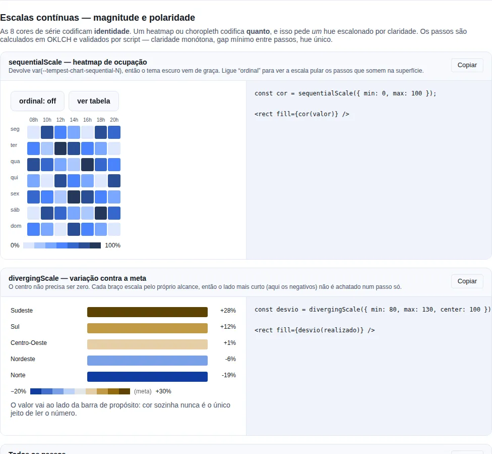

# Charts (recharts)

Charts turn numbers into shape: a trend that climbs, a slice that dominates, an
axis where one series crosses another. The SDK wraps
[recharts](https://recharts.org) in five themed components — `AreaChart`,
`BarChart`, `LineChart`, `PieChart`, and `RadarChart` — that take **plain tabular
data** (an array of objects) and handle axes, grid, legend, tooltip, and colors
for you.

You don't assemble `<XAxis>`/`<YAxis>`/`<Tooltip>` by hand: you pass `data`, say
which key is the axis (`index`) and which keys become series (`categories`), and
the component does the rest.

<!-- gallery:dataviz-scales -->
[](gallery.md)

*Section `dataviz-scales` of the [gallery](gallery.md) — run it locally to interact.*
<!-- /gallery -->

## Why a separate subpath

The charts don't come from the main barrel. You import them from
`tempest-react-sdk/charts`:

```tsx
import { BarChart, LineChart, AreaChart } from "tempest-react-sdk/charts";
```

!!! info "Why isolate the charts in a subpath?"
    `recharts` is a **heavy** dependency (D3 under the hood). Most Tempest apps
    draw no charts at all — and it would be unfair to charge that weight to
    everyone. So the charts live in a dedicated subpath and `recharts` is
    **externalized** out of the SDK bundle. Apps that never import from
    `tempest-react-sdk/charts` **pay nothing**: the app bundler's tree-shaking
    strips it all.

!!! tip "Only want the shape of the series? You don't need a chart"
    An inline mini-chart — a trend in a table cell, next to a KPI — is
    [`Sparkline`](./components/data.en.md#sparkline), which lives on the **root
    entry** and is plain SVG. No `recharts` involved. Use the charts on this page
    when the reader needs to **read values off an axis**.

This is the same **caller injects the heavy dependency** pattern the SDK already
uses in its telemetry adapters (Sentry/PostHog) and feature-flags adapters
(GrowthBook/LaunchDarkly): the SDK describes the integration, but the real
library is the app's responsibility. The difference here is that `recharts` is an
**optional peer dependency** — you install it once and all five components reuse
it.

### Install

```bash
npm i recharts
```

!!! warning "Without `recharts`, the charts won't render"
    Because `recharts` is an **optional** peer dep, `npm install
    tempest-react-sdk` does not pull it in. If you import from
    `tempest-react-sdk/charts` without having run `npm i recharts`, the build
    breaks with `Cannot find module 'recharts'`. Install it in the app that
    actually uses charts.

## The cartesian family: Area, Bar, Line

`AreaChart`, `BarChart`, and `LineChart` share the **same** props interface,
`CartesianChartProps`. Learn one and you know all three — you only swap the
component name.

The mental model is always the same:

- `data` — your rows (array of objects).
- `index` — the key that becomes the **X axis** (labels: months, days, names…).
- `categories` — the keys that become **series** (one area/bar/line each).

### BarChart

```tsx
import { BarChart } from "tempest-react-sdk/charts";

const revenue = [
  { month: "Jan", income: 12000, cost: 8000 },
  { month: "Feb", income: 15000, cost: 9000 },
  { month: "Mar", income: 18000, cost: 9500 },
  { month: "Apr", income: 21000, cost: 11000 },
];

export function MonthlyRevenue() {
  return (
    <BarChart
      data={revenue}
      index="month"
      categories={["income", "cost"]}
      valueFormatter={(v) => `$${v.toLocaleString("en-US")}`}
      height={320}
    />
  );
}
```

Two series (`income`, `cost`), grouped side by side per month. The
`valueFormatter` formats the numbers in the tooltip **and** on the Y axis.

### LineChart

Same data shape, same `index` and `categories` — only the component changes:

```tsx
import { LineChart } from "tempest-react-sdk/charts";

const visits = [
  { day: "Mon", organic: 320, paid: 120 },
  { day: "Tue", organic: 410, paid: 150 },
  { day: "Wed", organic: 380, paid: 90 },
  { day: "Thu", organic: 520, paid: 200 },
  { day: "Fri", organic: 610, paid: 240 },
];

export function WeeklyVisits() {
  return (
    <LineChart
      data={visits}
      index="day"
      categories={["organic", "paid"]}
      valueFormatter={(v) => v.toLocaleString("en-US")}
    />
  );
}
```

!!! note "`stack` does not stack lines"
    `CartesianChartProps` carries the `stack` prop for uniformity, but
    `LineChart` **ignores** it — stacked lines rarely make sense. Use `stack` on
    `AreaChart` or `BarChart`, where it actually stacks the series on a shared
    `stackId`.

### AreaChart (with `stack`)

```tsx
import { AreaChart } from "tempest-react-sdk/charts";

const traffic = [
  { hour: "08h", desktop: 120, mobile: 80, tablet: 20 },
  { hour: "12h", desktop: 200, mobile: 160, tablet: 30 },
  { hour: "18h", desktop: 90, mobile: 240, tablet: 25 },
  { hour: "22h", desktop: 60, mobile: 300, tablet: 40 },
];

export function TrafficByDevice() {
  return (
    <AreaChart
      data={traffic}
      index="hour"
      categories={["desktop", "mobile", "tablet"]}
      stack
      valueFormatter={(v) => `${v} sessions`}
    />
  );
}
```

With `stack`, the three areas stack and the top shows the total per hour.

### `CartesianChartProps` — reference

| Prop             | Type                        | Default                | What it does                                                                  |
| ---------------- | --------------------------- | ---------------------- | ---------------------------------------------------------------------------- |
| `data`           | `ChartData`                 | —                      | Rows to plot (array of objects `key → string \| number`).                    |
| `index`          | `string`                    | —                      | Row key used for the X axis (cartesian) or angle axis (radar).               |
| `categories`     | `string[]`                  | —                      | Row keys to plot, one series each.                                           |
| `colors`         | `string[]`                  | `--tempest-chart-*` tokens | Series colors, cycled per category.                                          |
| `height`         | `number`                    | `300`                  | Chart height in pixels.                                                      |
| `width`          | `number`                    | —                      | Fixed width in px. When set, bypasses the `ResponsiveContainer`.            |
| `stack`          | `boolean`                   | `false`                | Stacks the series on a shared `stackId` (ignored by `LineChart`).            |
| `showLegend`     | `boolean`                   | `true`                 | Renders the legend.                                                          |
| `showGrid`       | `boolean`                   | `true`                 | Renders the cartesian grid.                                                  |
| `showTooltip`    | `boolean`                   | `true`                 | Renders the tooltip.                                                         |
| `valueFormatter` | `(value: number) => string` | —                      | Formats numeric values in the tooltip and on the Y axis.                     |
| `className`      | `string`                    | —                      | Extra class name applied to the chart wrapper.                              |

`ChartData = Array<Record<string, string | number>>` — each row maps a column key
to a label (string) or value (number).

!!! tip "One series, or many"
    `categories` is an array, so you decide how many series you want. Just one
    (`categories={["income"]}`) draws a simple chart; several draw comparative
    series, each picking the next color in the palette.

## PieChart

`PieChart` has a different data shape: **one row per slice**. Instead of
`categories`, you say which key holds the **value** (`category`) and which holds
the **label** (`index`).

```tsx
import { PieChart } from "tempest-react-sdk/charts";

const plans = [
  { plan: "Free", users: 4200 },
  { plan: "Pro", users: 1800 },
  { plan: "Business", users: 600 },
  { plan: "Enterprise", users: 120 },
];

export function PlanDistribution() {
  return (
    <PieChart
      data={plans}
      category="users"
      index="plan"
      donut
      valueFormatter={(v) => `${v.toLocaleString("en-US")} users`}
    />
  );
}
```

Each row becomes a slice colored by the next palette color. With `donut`, the
center is hollow (60% inner radius) — great for putting a total in the middle.

### `PieChartProps` — reference

| Prop             | Type                        | Default                | What it does                                                       |
| ---------------- | --------------------------- | ---------------------- | ----------------------------------------------------------------- |
| `data`           | `ChartData`                 | —                      | Rows to plot, one slice each.                                     |
| `category`       | `string`                    | —                      | Row key holding the slice's numeric **value**.                   |
| `index`          | `string`                    | —                      | Row key holding the slice's **name/label**.                      |
| `colors`         | `string[]`                  | `--tempest-chart-*` tokens | Slice colors, cycled per slice.                                  |
| `height`         | `number`                    | `300`                  | Chart height in pixels.                                          |
| `width`          | `number`                    | —                      | Fixed width in px. When set, bypasses the `ResponsiveContainer`. |
| `donut`          | `boolean`                   | `false`                | Renders as a donut (non-zero inner radius) instead of a full pie.|
| `showLegend`     | `boolean`                   | `true`                 | Renders the legend.                                              |
| `showTooltip`    | `boolean`                   | `true`                 | Renders the tooltip.                                             |
| `valueFormatter` | `(value: number) => string` | —                      | Formats numeric values in the tooltip.                          |
| `className`      | `string`                    | —                      | Extra class name applied to the wrapper.                        |

!!! note "`PieChart` has no `showGrid` or `stack`"
    A pie has no cartesian grid and no stacking — those cartesian-family props
    simply don't exist here.

## RadarChart

`RadarChart` reuses `CartesianChartProps` (same signature as Area/Bar/Line), but
plots polygons on a radial axis: `index` becomes the **angle axis** (the
vertices) and each `categories` entry becomes one polygon.

```tsx
import { RadarChart } from "tempest-react-sdk/charts";

const skills = [
  { attribute: "Speed", team_a: 80, team_b: 65 },
  { attribute: "Defense", team_a: 70, team_b: 90 },
  { attribute: "Attack", team_a: 95, team_b: 75 },
  { attribute: "Stamina", team_a: 60, team_b: 85 },
  { attribute: "Technique", team_a: 88, team_b: 80 },
];

export function TeamComparison() {
  return (
    <RadarChart
      data={skills}
      index="attribute"
      categories={["team_a", "team_b"]}
      valueFormatter={(v) => `${v} pts`}
    />
  );
}
```

Two overlaid polygons compare `team_a` and `team_b` on each attribute — perfect
for comparing multi-dimensional profiles.

!!! note "`RadarChart` ignores `showGrid` and `stack`"
    The radar always draws its own `PolarGrid` (there's no `showGrid`), and it
    doesn't stack series (`stack` is ignored). `showLegend`/`showTooltip`/
    `colors`/`valueFormatter` work as usual.

## Colors and theming

**You do not have to do anything:** series colors come from the theme tokens
`--tempest-chart-1` … `--tempest-chart-8` by default. Rebranding with
`createTheme({ chart: [...] })` moves the charts along, and flipping to dark swaps
in the lightened palette — with no prop on the chart at all.

```css
/* what the SDK already defines (colors.css) */
:root {
  --tempest-chart-1: #2563eb; /* blue   */
  --tempest-chart-2: #16a34a; /* green  */
  --tempest-chart-3: #f59e0b; /* amber  */
  --tempest-chart-4: #7c3aed; /* violet */
  --tempest-chart-5: #ec4899; /* pink   */
  --tempest-chart-6: #06b6d4; /* cyan   */
  --tempest-chart-7: #ea580c;
  --tempest-chart-8: #0f766e;
}
```

!!! warning "A 6-color palette must not become 8"
    If you define only `chart-1..6`, the reader would keep walking into the SDK's
    built-in `--tempest-chart-7`/`-8` and a 7-series chart would come out with a
    mixed palette — 6 brand colors plus 2 leftovers. That is what
    `--tempest-chart-count` is for: `createTheme` writes how many colors the theme
    owns and `resolveChartColors` stops there. Setting tokens by hand, declare it:

    ```css
    :root {
      --tempest-chart-1: #0f766e;
      --tempest-chart-2: #f97316;
      --tempest-chart-count: 2;
    }
    ```

Override them in your own CSS, or generate them with the theme factory:

```tsx
import { applyTheme, createTheme } from "tempest-react-sdk";

applyTheme(createTheme({
  primary: "#0f766e",
  chart: ["#0f766e", "#f97316", "#9333ea"],
}));
```

!!! danger "`colors={["var(--my-token)"]}` does **not** work"
    Recharts applies color as an SVG **presentation attribute** (`fill="…"`), and
    no browser substitutes `var()` there — a custom property is only resolved in a
    CSS **declaration**. A `var()` passed through `colors` renders as an invalid
    color (invisible series).

    That is why the SDK **reads the tokens** via `getComputedStyle` and hands
    literal colors to recharts. If you need one of your own tokens in JS, take the
    same route:

    ```tsx
    import { readThemeToken } from "tempest-react-sdk";

    const brand = readThemeToken("--my-brand"); // "#0f766e"
    ```

For one specific chart, `colors` still wins over everything — it is the escape
hatch, cycled by series (or slice) index:

```tsx
import { BarChart, DEFAULT_CHART_COLORS } from "tempest-react-sdk/charts";

export function SalesWithBrandColors() {
  return (
    <BarChart
      data={sales}
      index="month"
      categories={["store_a", "store_b", "store_c"]}
      colors={["#0f766e", "#f97316", "#9333ea"]}
    />
  );
}

// Tweak just the first color and keep the rest of the fallback:
const myPalette = ["#e11d48", ...DEFAULT_CHART_COLORS.slice(1)];
```

`DEFAULT_CHART_COLORS` is the **fallback**, used when the tokens are not
readable: no `styles.css` imported, outside a browser (tests, a build script), or
a page that dropped the tokens.

### Resolving tokens yourself

```tsx
import { resolveChartColors, useChartColors } from "tempest-react-sdk/charts";

// inside a component — re-resolves when the theme flips
const colors = useChartColors();

// outside React (canvas, image export, custom tooltip)
const palette = resolveChartColors();
```

`useChartColors` observes the `data-tempest-theme` attribute and re-resolves on a
theme switch; passing an explicit array short-circuits the hook (no observer is
created). Need the grid/axis color? `resolveChartChrome("grid" | "axis")`.

!!! tip "Theming one section"
    Both accept an element: `useChartColors(undefined, sectionRef.current)`
    resolves the tokens of **that** subtree, so a section carrying its own theme
    paints its charts with its own palette.

## Continuous scales: magnitude and polarity

The 8 series colors encode **identity** — which series is which. A heatmap or a
choropleth encodes **how much**, and that is a different job: it needs *one* hue
stepped by lightness, not eight hues.

```tsx
import { sequentialScale, divergingScale, scaleSteps } from "tempest-react-sdk";

const color = sequentialScale({ min: 0, max: 250 });
<rect fill={color(value)} />;

// Polarity: variance against a target
const variance = divergingScale({ min: 80, max: 130, center: 100 });
<rect fill={variance(actual)} />;
```

| Export                  | What it does                                              |
| ----------------------- | --------------------------------------------------------- |
| `sequentialScale`       | `{ min, max, ordinal? }` → `(value) => color`             |
| `divergingScale`        | `{ min, max, center? }` → `(value) => color`               |
| `scaleSteps`            | Every step in order, for building the legend               |
| `SEQUENTIAL_STEP_COUNT` | `7`                                                       |
| `DIVERGING_STEP_COUNT`  | `9` (1–4 cool · 5 neutral · 6–9 warm)                     |
| `ORDINAL_START_STEP`    | `3` — first step that clears 2:1 on the surface            |

!!! info "They ship on the root entry, not behind `/charts`"
    They are pure token math with **no recharts dependency**. The things that need
    them most — a `/br` choropleth, a hand-rolled heatmap — have no reason to install
    recharts. Measured cost: **365 B brotli** importing from the root. `/charts`
    re-exports them only for discoverability.

!!! tip "They return a token, not a hex"
    The result is `var(--tempest-chart-sequential-4)`. A heatmap painted once follows
    the theme — including dark mode, whose steps are **selected** for the dark surface
    rather than flipped from the light ones.

!!! warning "Sequential lets zero recede; ordinal must not"
    On a **sequential** scale the lightest step disappears into the surface on
    purpose: that is what "almost nothing" should look like on a heatmap. On an
    **ordinal** one — funnel stages, tiers, bands — every step is a mark someone has
    to see, and an invisible step is lost data. Pass `ordinal: true` and the scale
    starts at step 3.

    ```tsx
    sequentialScale({ min: 0, max: 4, ordinal: true }); // uses 3..7
    ```

!!! check "Each diverging arm scales against its own range"
    On an asymmetric domain (−5 to +80) the negatives still use the whole cool arm.
    Scaling both arms by the wider one — the easy mistake — would collapse every
    negative into the step next to the midpoint and hide the sign entirely.

!!! danger "The diverging midpoint is grey, never a hue"
    A coloured midpoint reads as a **third category** instead of "no deviation", which
    is the one thing a diverging scale exists to show. That is why token 5 is neutral
    in both modes.

!!! note "A continuous scale needs a legend"
    Without a ramp labelled at its ends, nobody can turn a colour back into a number.
    That is what `scaleSteps` is for:

    ```tsx
    <div style={{ display: "flex" }}>
      {scaleSteps("sequential").map((color) => (
        <span key={color} style={{ background: color, width: 20, height: 10 }} />
      ))}
    </div>
    <span>0</span> … <span>250</span>
    ```

### How the ramps were built

They were not picked by eye. The steps are **computed** in OKLCH with evenly spaced
lightness, so an equal step of data looks like an equal step of colour — which does
not happen when you space in RGB. Chroma follows a dome: the ends stay believable and
the middle carries the hue.

Each ramp was validated by script in both modes: monotone lightness, adjacent gaps
≥ 0.06, a single hue, and the end nearest the surface clearing 2:1 in the ordinal
slice. `createTheme` rebuilds both scales from the brand hue (using the theme's
`danger` as the warm pole, so "warm" and "bad" do not disagree on screen), so
rebranding moves the heatmap too instead of leaving it in the SDK's blue.

## Responsive by default, fixed when needed

By default, each chart **stretches to its parent's width** via a recharts
`ResponsiveContainer` — you only control the `height`. That's what you want in
almost any dashboard: the width follows the column.

```tsx
// Fluid width (fills the container), fixed 300px height (default).
<LineChart data={data} index="day" categories={["value"]} />
```

But there are cases where you need a **fixed, deterministic** width: snapshot
tests, server-side rendering (SSR), exporting an exact-size PNG. Then you pass
`width`:

```tsx
// Fixed 600px width — no ResponsiveContainer.
<LineChart data={data} index="day" categories={["value"]} width={600} height={300} />
```

!!! warning "`width` turns off the `ResponsiveContainer`"
    When you set `width`, the chart renders at **that exact width** and is **not**
    wrapped in a `ResponsiveContainer`. This is intentional: the
    `ResponsiveContainer` measures the parent on the client and doesn't work well
    in SSR/jsdom, where there's no computed layout. For a normal page in the
    browser, **omit** `width` and let it fill the parent.

## Recap

- Import the charts from **`tempest-react-sdk/charts`** — a dedicated subpath.
  `recharts` is an **optional** peer dep: run `npm i recharts` in the app that
  uses charts. Apps that don't import from there pay no weight (same "caller
  injects the heavy dep" pattern as the telemetry/flags adapters).
- `AreaChart`, `BarChart`, and `LineChart` share `CartesianChartProps`: `data` +
  `index` (X axis) + `categories` (series). `stack` stacks in Area/Bar;
  `LineChart` ignores it.
- `PieChart` uses `category` (value) + `index` (label), one row per slice, with
  optional `donut`.
- `RadarChart` reuses `CartesianChartProps` (`index` = angle axis); ignores
  `showGrid`/`stack`.
- `DEFAULT_CHART_COLORS` is the default palette (6 colors); override it via the
  `colors` prop, cycled per series/slice.
- Without `width`, the chart is **responsive** (stretches to the parent via
  `ResponsiveContainer`, you control `height`). With `width`, it renders at a
  **fixed** size without a `ResponsiveContainer` — handy for tests/SSR.
