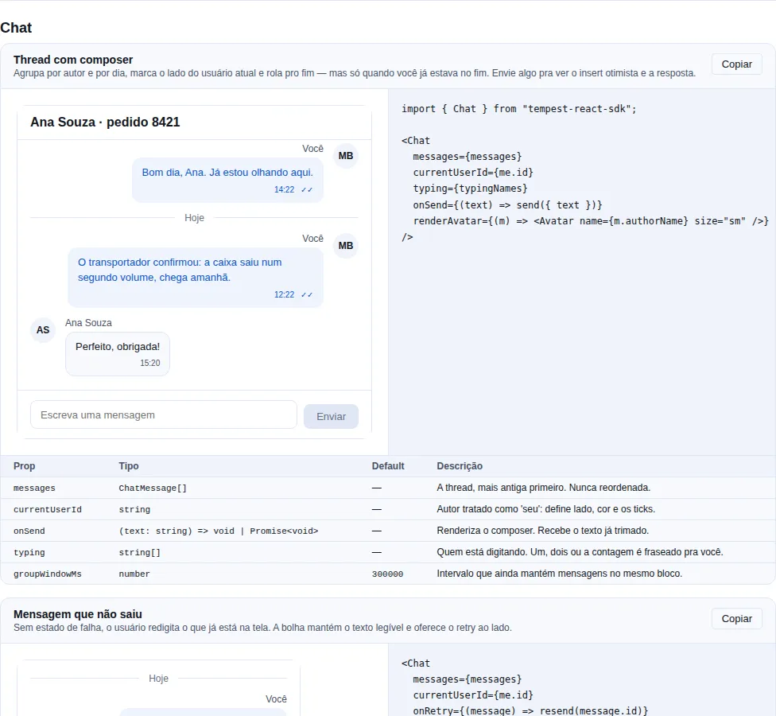
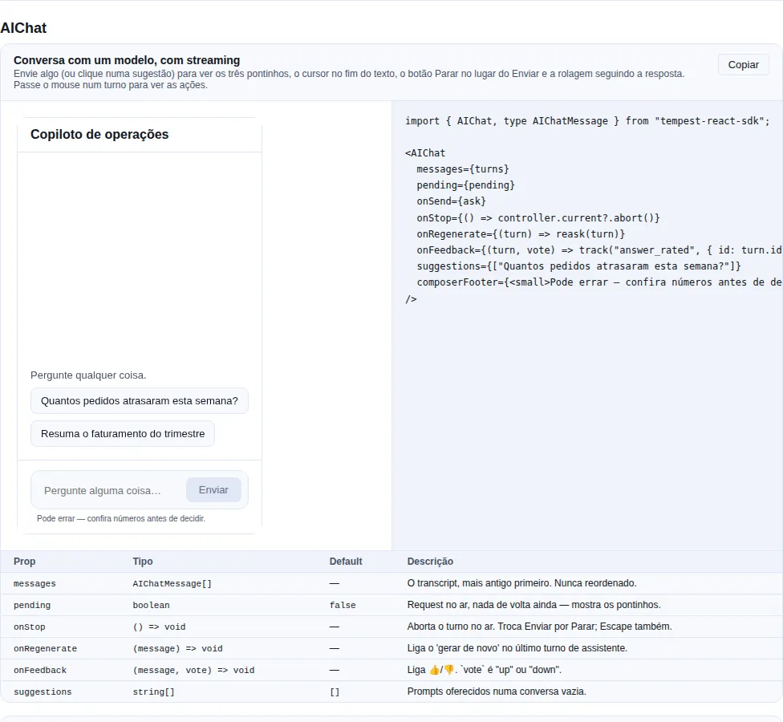

# Avançados: conversa

`Chat` para thread entre pessoas e `AIChat` para conversa com um modelo. São componentes diferentes, não variantes — e é por isso que têm página própria.

## `Chat`

<!-- gallery:chat -->
[](../gallery.md)

*Seção `chat` da [gallery](../gallery.md) — rode localmente para interagir.*
<!-- /gallery -->

> **Quando usar**: uma thread de mensagens — suporte, chat interno, comentário de documento, histórico de atendimento.

Agrupa por autor e por dia, marca o lado do usuário atual, mostra estado de entrega, quem está digitando, e traz o composer quando você passa `onSend`.

```tsx
import { Chat, Avatar, type ChatMessage } from "tempest-react-sdk";
import { useState } from "react";

export function Suporte({ me }: { me: { id: string } }) {
  const [mensagens, setMensagens] = useState<ChatMessage[]>([]);

  /** Insert otimista: a mensagem aparece antes do servidor confirmar. */
  const enviar = async (texto: string) => {
    const id = crypto.randomUUID();
    setMensagens((atual) => [
      ...atual,
      { id, body: texto, authorId: me.id, sentAt: Date.now(), status: "sending" },
    ]);
    await api.post("/mensagens", { body: { id, texto } });
    setMensagens((atual) =>
      atual.map((m) => (m.id === id ? { ...m, status: "sent" } : m)),
    );
  };

  return (
    <Chat
      messages={mensagens}
      currentUserId={me.id}
      onSend={enviar}
      onRetry={(m) => reenviar(m.id)}
      renderAvatar={(m) => <Avatar name={m.authorName ?? m.authorId} size="sm" />}
    />
  );
}
```

| Prop | Tipo | Default | O que faz |
| --- | --- | --- | --- |
| `messages` | `ChatMessage[]` | — | A thread, **mais antiga primeiro**. Nunca reordenada. |
| `currentUserId` | `string` | — | Autor tratado como "seu": lado, cor e ticks de entrega. |
| `onSend` | `(text: string) => void \| Promise<void>` | — | Renderiza o composer. Recebe o texto já trimado. |
| `onRetry` | `(message: ChatMessage) => void` | — | Liga o botão de retry numa mensagem `"failed"`. |
| `onSendError` | `(error: unknown) => void` | — | Chamado quando `onSend` rejeita. O rascunho fica no campo. |
| `typing` | `string[]` | `[]` | Quem está digitando. Um, dois ou a contagem é fraseado pra você. |
| `renderAvatar` | `(message) => ReactNode` | — | Avatar da **primeira** mensagem de cada bloco. |
| `header` | `ReactNode` | — | Barra acima da thread, dentro do painel. |
| `groupWindowMs` | `number` | `300000` | Intervalo que ainda mantém mensagens no mesmo bloco. |
| `locale` | `"pt-BR" \| "en"` | `"pt-BR"` | Rótulos ("Hoje", "Você", "Enviando"…). |
| `emptyState` | `ReactNode` | `<EmptyState/>` | Thread vazia. |
| `composerDisabled` | `boolean` | `false` | Sem permissão, thread arquivada, offline. |

`ChatMessage = { id, body, authorId, authorName?, sentAt, status?, data? }` · `status` ∈ `"sending" | "sent" | "read" | "failed"`.

O componente é **apresentacional e controlado**, como o resto do SDK: recebe a lista e emite intenção. De onde vêm as mensagens (REST, o `createWebSocket` do SDK, um stream SSE) e como o insert otimista é feito ficam com o app, porque isso muda por backend.

!!! tip "A rolagem só pula pro fim se você já estava no fim"
    Uma thread que sempre rola pra mensagem nova arranca quem está lendo o histórico, toda vez que qualquer pessoa digita. Então o pulo acontece só quando o leitor já estava embaixo (com 48px de folga pra última linha parcialmente visível) — a regra pra qual todo app de chat converge. Verificado no browser: lendo o histórico no topo, três mensagens chegaram e a posição não se moveu.

!!! info "Bloco quebra por autor, por dia **e** por intervalo"
    Repetir avatar e nome em cada linha de uma rajada de cinco transforma conversa em lista de recibos. Mas uma resposta uma hora depois é um novo momento da conversa mesmo que ninguém tenha falado no meio — juntar ao bloco anterior colocaria um timestamp só em mensagens separadas por uma hora. O `groupWindowMs` é esse limite.

!!! warning "Estado de falha não é enfeite"
    Sem `"failed"` + `onRetry`, o usuário redigita o que já está na tela. A bolha que falhou mantém o **texto legível** (borda e meta em vermelho, não o fundo inteiro) justamente porque reler a mensagem é o que a pessoa faz antes de decidir reenviar.

!!! info "A thread é `role=\"log\"` com `aria-live=\"polite\"` e alcançável por teclado"
    Mensagem nova é anunciada sem roubar o foco. O contêiner tem `tabIndex={0}` porque uma área que rola e não tem nada focável dentro é inacessível pelo teclado — o mesmo problema que a [correção de rolagem](./data.md) resolveu no `Table`. Estado de entrega vai em texto (`VisuallyHidden`), não só no glifo: "✓✓" não é lido.

!!! tip "Serve como thread de comentários"
    É o mesmo componente **sem** `currentUserId` e sem `typing`: todos do mesmo lado, nome por bloco. Foi por isso que "quem sou eu" virou uma prop em vez de um campo `own` em cada mensagem — num comentário de documento ninguém quer marcar 200 mensagens.

#### `ChatComposer`

Exportado à parte pra quem monta o próprio layout (composer fixo no rodapé de uma rota, por exemplo). Textarea que cresce com o conteúdo, `Enter` envia, `Shift+Enter` quebra linha.

| Prop | Tipo | Default | O que faz |
| --- | --- | --- | --- |
| `onSend` | `(text: string) => void \| Promise<void>` | — | Recebe o texto trimado. Limpa o campo só se não rejeitar. |
| `onError` | `(error: unknown) => void` | — | Erro do `onSend`. Rascunho preservado de qualquer forma. |
| `actions` | `ReactNode` | — | Antes do botão de enviar — anexo, emoji. |
| `maxRows` | `number` | `6` | Altura máxima, em linhas. |
| `sendLabel` | `string` | locale | Rótulo do botão. |

!!! warning "Ele é **não controlado**, de propósito"
    Rascunho de chat muda a cada tecla, e subir isso pro estado do app re-renderiza a thread inteira por caractere — o único lugar onde "controlado por default" custa algo visível. Quem precisa do rascunho (composer persistido, menu de slash-command) lê pelo `onChange` ou usa o ref (`focus()`, `setValue()`).

!!! danger "IME: `Enter` durante composição não envia"
    Compondo japonês ou coreano, `Enter` confirma a palavra candidata. Enviar ali publica meia palavra e come a confirmação — daí a checagem de `isComposing`.

## `AIChat`

<!-- gallery:aichat -->
[](../gallery.md)

*Seção `aichat` da [gallery](../gallery.md) — rode localmente para interagir.*
<!-- /gallery -->

> **Quando usar**: conversa com um **modelo** — copiloto do seu app, assistente de suporte, busca conversacional. É a forma que o ChatGPT, o Claude e o DeepSeek convergiram.

Turnos por papel (`user` / `assistant` / `system`), resposta em Markdown com bloco de código, raciocínio em bloco separado, cursor de streaming, ações por turno (copiar, gerar de novo, editar, 👍/👎) e um composer que **vira botão de parar** enquanto a resposta chega.

!!! info "`AIChat` e [`Chat`](#chat) são componentes diferentes, não variantes"
    Uma thread humana é endereçada por **autor** e se preocupa com estado de entrega. Um transcript de modelo é endereçado por **papel**, não tem estado de entrega nenhum, e precisa de três coisas que uma thread humana nunca precisa: saída parcial, raciocínio separado da resposta e re-perguntar. Encaixar os dois num `variant` misturaria dois modelos de dados no mesmo `props` e deixaria `authorId`/ticks mortos no caminho LLM.

Comece com o mínimo — uma lista e um `onSend`:

```tsx
import { AIChat, type AIChatMessage } from "tempest-react-sdk";
import { useState } from "react";

export function Copiloto() {
  const [turnos, setTurnos] = useState<AIChatMessage[]>([]);

  const perguntar = async (texto: string) => {
    setTurnos((atual) => [
      ...atual,
      { id: crypto.randomUUID(), role: "user", content: texto },
    ]);
    const resposta = await fetch("/api/ask", {
      method: "POST",
      body: JSON.stringify({ prompt: texto }),
    }).then((r) => r.json());
    setTurnos((atual) => [
      ...atual,
      { id: crypto.randomUUID(), role: "assistant", content: resposta.text },
    ]);
  };

  return <AIChat messages={turnos} onSend={perguntar} />;
}
```

Isso já te dá o transcript, o Markdown, o composer, o `Enter`/`Shift+Enter`, a rolagem que segue a resposta e a ação de copiar. O que falta é o **streaming** — e é aí que o componente ganha a cara de produto.

#### Streaming, do zero

O SDK **não** faz a chamada por você: "como eu faço streaming do meu backend" tem resposta diferente por provider. O que ele faz é renderizar o estado. O contrato é simples — vá reescrevendo o `content` do **último** turno e mantenha `streaming: true` nele até acabar:

```tsx
import { AIChat, type AIChatMessage } from "tempest-react-sdk";
import { useRef, useState } from "react";

export function CopilotoStreaming() {
  const [turnos, setTurnos] = useState<AIChatMessage[]>([]);
  const [pendente, setPendente] = useState(false);
  const abortar = useRef<AbortController | null>(null);

  /** Reescreve o último turno a cada chunk — o componente segue o texto sozinho. */
  const escrever = (id: string, texto: string) =>
    setTurnos((atual) =>
      atual.map((t) => (t.id === id ? { ...t, content: texto } : t)),
    );

  const perguntar = async (prompt: string) => {
    const idResposta = crypto.randomUUID();
    setTurnos((atual) => [
      ...atual,
      { id: crypto.randomUUID(), role: "user", content: prompt },
    ]);
    setPendente(true);

    abortar.current = new AbortController();
    const resposta = await fetch("/api/stream", {
      method: "POST",
      body: JSON.stringify({ prompt }),
      signal: abortar.current.signal,
    });

    setPendente(false);
    setTurnos((atual) => [
      ...atual,
      { id: idResposta, role: "assistant", content: "", streaming: true },
    ]);

    const leitor = resposta.body!.pipeThrough(new TextDecoderStream()).getReader();
    let acumulado = "";
    try {
      while (true) {
        const { value, done } = await leitor.read();
        if (done) break;
        acumulado += value;
        escrever(idResposta, acumulado);
      }
    } catch (erro) {
      if ((erro as Error).name !== "AbortError") throw erro;
    } finally {
      setTurnos((atual) =>
        atual.map((t) =>
          t.id === idResposta ? { ...t, streaming: false } : t,
        ),
      );
    }
  };

  return (
    <AIChat
      messages={turnos}
      pending={pendente}
      onSend={perguntar}
      onStop={() => abortar.current?.abort()}
      composerFooter={<small>Pode errar — confira números antes de decidir.</small>}
    />
  );
}
```

O que você ganha de graça nesse trecho:

| Você fez | O componente faz |
| --- | --- |
| `pending` enquanto a request está no ar | Mostra os três pontinhos e já troca **Enviar** por **Parar** |
| `streaming: true` no último turno | Desenha o cursor `▍` no fim do texto e esconde as ações daquele turno |
| Reescreve `content` a cada chunk | Rola pra acompanhar — **só se** o leitor já estava embaixo |
| `onStop` | Botão de parar no lugar do enviar, e `Escape` no campo também aborta |
| `streaming: false` no fim | Cursor sai, ações voltam, e o leitor de tela anuncia "Resposta concluída" |

!!! tip "Se seu backend fala SSE, use o `createEventStream` do SDK"
    O laço acima é `fetch` + `ReadableStream` porque é o caminho comum de APIs de LLM. Pra um endpoint `text/event-stream` de verdade, o [`sse`](../sse.md) do SDK já cuida de reconexão e `Last-Event-ID` — o loop de `escrever()` é o mesmo.

#### Raciocínio (extended thinking / R1)

Um turno com `reasoning` ganha um bloco colapsável **acima** da resposta:

```tsx
import { type AIChatMessage } from "tempest-react-sdk";

const turno: AIChatMessage = {
    id: "a1",
    role: "assistant",
    content: "São 12 pedidos.",
    reasoning: "Filtrei por data de entrega vencida e status != entregue…",
};
```

!!! info "Enquanto só o raciocínio chegou, o bloco abre sozinho"
    Se o turno está com `streaming: true` e o `content` ainda está vazio, o bloco de raciocínio monta **aberto** — é o único conteúdo que existe, e escondê-lo deixaria a tela parada com um cursor piscando no vácuo. Terminou, ele continua aberto (quem quiser fecha); usar `defaultReasoningOpen` abre **todos**, o que serve pra uma tela de auditoria.

#### Ações por turno

| Ação | Aparece em | Prop que liga |
| --- | --- | --- |
| Copiar | todo turno | sempre (copia o Markdown **cru**, não o HTML) |
| Gerar de novo | **só** o turno de assistente mais novo | `onRegenerate` |
| 👍 / 👎 | turno de assistente | `onFeedback` |
| Editar | turno de usuário | `onEditSubmit` |
| Tentar de novo | turno com `error` | `onRetry` |

```tsx
import {
    AIChat,
    type AIChatMessage,
    type AIChatVote,
} from "tempest-react-sdk";

export function Conversa({
    turnos,
    votosSalvos,
    reperguntar,
    perguntar,
    truncarAPartirDe,
    track,
}: {
    turnos: AIChatMessage[];
    votosSalvos: Record<string, AIChatVote>;
    reperguntar: (turno: AIChatMessage) => void;
    perguntar: (texto: string) => Promise<void>;
    truncarAPartirDe: (id: string) => void;
    track: (event: string, payload: Record<string, unknown>) => void;
}) {
    return (
        <AIChat
            messages={turnos}
            onRegenerate={reperguntar}
            onFeedback={(turno, voto) => track("answer_rated", { id: turno.id, voto })}
            onEditSubmit={(turno, texto) => {
                truncarAPartirDe(turno.id);
                return perguntar(texto);
            }}
            votes={votosSalvos}
        />
    );
}
```

!!! warning "Gerar de novo aparece só no último turno de assistente — de propósito"
    Re-perguntar um turno do meio joga fora **todo** turno depois dele. Isso é uma operação diferente ("ramificar aqui") e precisa da própria confirmação; oferecer o mesmo botão nos dois casos convida a perder metade da conversa num clique.

!!! info "Editar não decide o que apagar"
    O `onEditSubmit` te entrega o turno e o texto novo. Quem trunca o transcript é o app, porque "apagar tudo depois" e "criar uma ramificação" são produtos diferentes e o SDK não deve escolher por você.

#### Prompts sugeridos e estado vazio

```tsx
import { AIChat } from "tempest-react-sdk";

export function Vazio({ perguntar }: { perguntar: (texto: string) => void }) {
    return (
        <AIChat
            messages={[]}
            onSend={perguntar}
            suggestions={["Resuma o último relatório", "Quais pedidos atrasaram?"]}
        />
    );
}
```

Numa conversa vazia as sugestões aparecem no rodapé da área de transcript; clicar em uma envia direto. Somem no primeiro turno. Sem `onSend` elas não são renderizadas (não haveria pra onde mandar) e cai no `EmptyState` — ou no seu `emptyState`.

#### Props

| Prop | Tipo | Default | O que faz |
| --- | --- | --- | --- |
| `messages` | `AIChatMessage[]` | — | O transcript, **mais antigo primeiro**. Nunca reordenado. |
| `onSend` | `(text: string) => void \| Promise<void>` | — | Renderiza o composer. Recebe o prompt já trimado. |
| `onStop` | `() => void` | — | Aborta o turno no ar. Troca enviar por parar; `Escape` também aborta. |
| `pending` | `boolean` | `false` | Request no ar, nada de volta ainda. |
| `onRegenerate` | `(message) => void` | — | Liga o "gerar de novo" no último turno de assistente. |
| `onEditSubmit` | `(message, text) => void \| Promise<void>` | — | Liga o "editar" nos turnos de usuário. |
| `onFeedback` | `(message, vote) => void` | — | Liga 👍/👎. `vote` ∈ `"up" \| "down"`. |
| `onRetry` | `(message) => void` | — | Liga o retry num turno com `error`. |
| `onSendError` | `(error: unknown) => void` | — | Erro do `onSend` **ou** do `onEditSubmit`. Rascunho preservado. |
| `votes` | `Record<string, AIChatVote>` | — | Votos que o app guarda. Sem isso o estado pressionado é local. |
| `suggestions` | `string[]` | `[]` | Prompts oferecidos numa conversa vazia. |
| `renderAvatar` | `(message) => ReactNode` | — | Avatar por turno. |
| `renderContent` | `(message) => ReactNode` | — | Substitui o corpo — card de tool-call, gráfico, lista de citações. |
| `showSystem` | `boolean` | `false` | Mostra turnos `"system"`. |
| `defaultReasoningOpen` | `boolean` | `false` | Abre todos os blocos de raciocínio. |
| `showLineNumbers` | `boolean` | `false` | Numera linha em bloco de código. |
| `header` | `ReactNode` | — | Barra acima do transcript, dentro do painel. |
| `composerActions` | `ReactNode` | — | Antes do botão de enviar — anexo, seletor de modelo. |
| `composerFooter` | `ReactNode` | — | Abaixo do campo — contagem de token, disclaimer. |
| `composerDisabled` | `boolean` | `false` | Sem crédito, conversa arquivada, offline. |
| `maxRows` | `number` | `8` | Altura máxima do composer, em linhas. |
| `locale` | `"pt-BR" \| "en"` | `"pt-BR"` | Rótulos ("Parar", "Raciocínio", "Você"…). |
| `emptyState` | `ReactNode` | `<EmptyState/>` | Conversa vazia. |

`AIChatMessage = { id, role, content, reasoning?, streaming?, error?, createdAt?, model?, attachments?, data? }` · `role` ∈ `"user" \| "assistant" \| "system"`.

`AIChatAttachment = { id, name, size?, url?, mimeType? }` — com `url` vira miniatura, sem `url` vira chip com nome e tamanho.

#### Decisões que valem saber

!!! info "Resposta é Markdown, prompt é texto puro"
    Um modelo emite Markdown por contrato. Uma pessoa que digitou `calcule 2 * 3 * 4` não quis abrir um span de ênfase — e ver o próprio prompt reescrito é desconcertante. Por isso o turno de usuário é `white-space: pre-wrap` e o de assistente passa pelo [`Markdown`](advanced-data.md#markdown) (que já usa o [`CodeBlock`](utility.md#codeblock) nos blocos cercados). Quer Markdown no prompt também? `renderContent`.

!!! tip "A resposta é o documento, não uma bolha"
    Turno de assistente ocupa a largura toda, sem bolha; turno de usuário é uma bolha estreita encostada no fim da linha. Envolver a resposta numa bolha limitaria a largura dela, brigaria com as tabelas e blocos de código dentro, e faria resposta longa parecer mensagem gritada. O prompt é curto e precisa ser distinguido num relance, o que a bolha faz melhor que qualquer outra coisa.

!!! danger "O transcript **não** é `aria-live` — e isso é acessibilidade, não descuido"
    Uma região viva sobre texto em streaming faz o leitor de tela reler a resposta a cada token: inutilizável. Então o `role="log"` fica sem `aria-live`, e os dois momentos que importam ("Gerando resposta", "Resposta concluída") são anunciados por um `role="status"` separado. O turno em andamento leva `aria-busy`, e a resposta pronta é lida do log no ritmo de quem lê. O `axe` do jsdom não pega esse tipo de erro — foi decisão de projeto, verificada no browser.

!!! tip "A rolagem só segue a resposta se você já estava no fim"
    Mesma regra do [`Chat`](#chat), e aqui ela pesa mais: um transcript que sempre pula pro texto novo arrancaria o leitor **dezenas de vezes por segundo** durante o streaming. Quando você não está no fim, aparece um botão redondo pra voltar — o pulo nunca acontece sem você pedir.

!!! warning "A dependência do efeito de rolagem não é a lista"
    Streaming acrescenta ao **último** turno. Um app que mutasse esse objeto no lugar — ou que re-renderizasse de uma store guardando o mesmo array — manteria a mesma dependência enquanto o texto cresce, e a visão pararia de seguir a resposta. É por isso que existe `tailSignature()` (exportado): tamanho da lista + identidade do último turno + tamanho do texto dele cobrem as duas formas.

!!! info "Só o turno que cresce re-parseia"
    O `Markdown` parseia no próprio render, e o React não re-renderiza um filho cujo elemento é referencialmente o mesmo. Segurar esse elemento entre renders é o que impede um transcript de cinquenta turnos de re-parsear toda resposta já pronta a cada token da mais nova.

!!! tip "Parar ocupa o lugar do enviar, não um botão ao lado"
    O único botão embaixo do dedo é sempre o que você quer a seguir: enviar quando está parado, abortar quando a resposta está vindo. Dois botões lado a lado significariam acertar o certo no meio do stream.

!!! warning "Ação escondida em `:hover` é ação inexistente no touch"
    A linha de ações aparece no hover e no foco de teclado, e fica **sempre** visível onde não existe hover (`@media (hover: none)`). Sem isso, num celular o primeiro toque cairia no que estiver embaixo. Verificado com device de toque emulado: `hover: none` e `pointer: coarse` verdadeiros, linha com `opacity: 1`.

    Os botões medem 28×28 — acima do piso de 24×24 da WCAG 2.5.8, abaixo dos 44×44 da 2.5.5, e são **quatro** lado a lado. Em `pointer: coarse` um hit-slop de `::after` leva o alvo real a **44×44** sem mover um pixel do que se vê, o mesmo truque que o [`Button`](actions.md#button) usa nos tamanhos icon-only. Aumentar o `padding` em vez disso espalharia a linha no desktop, onde o ponteiro é preciso e a linha deve ficar quieta.

#### Responsivo: de celular a TV

Medido no browser em 360×640, 390×844, 740×360 (celular em paisagem), 768×1024, 1440×900, 1920×1080 e 3840×2160. Em **toda** largura: zero overflow horizontal na página e no transcript, composer sempre visível, tabela e bloco de código rolando **na própria caixa**.

O que muda com a largura:

| Faixa | O que acontece |
| --- | --- |
| até 480px | `gap` e `padding` do transcript encurtam, bolha do usuário e editor vão a `max-width: 100%` |
| 480px – 768px | a coluna de leitura acompanha a largura disponível |
| 768px e acima | a coluna trava em `48rem` e **centraliza**; a sobra fica de margem |

!!! tip "A largura da coluna é um knob: `--tempest-ai-chat-width`"
    Coluna limitada é a resposta certa do celular até um desktop 1920 — texto passando de ~90 caracteres por linha é mensuravelmente mais difícil de rastrear de volta ao começo da linha seguinte, e deixar a resposta correr a tela toda de um monitor largo piora, não ajuda.

    De 2560 pra cima a troca se inverte: 768px no meio de uma tela de sala é quase só espaço vazio, e **só o app sabe** a que distância a pessoa está sentada. Por isso é knob e não constante:

    ```css
    :root {
      --tempest-ai-chat-width: 72rem; /* default 48rem */
    }
    ```

    Um valor só move os turnos, o indicador de "pensando", as sugestões **e** o composer juntos.

!!! warning "Tamanho de tipo não é resolvido aqui"
    A fonte é a mesma em 360px e em 4K. Escalar tipo pra TV é decisão de `typography.css` e `density.css` — uma rampa de fonte local ao componente brigaria com os tokens que todo app tematiza. Se você mira TV, suba `--tempest-text-*` no `:root` (ou use `[data-tempest-density="spacious"]`) junto com `--tempest-ai-chat-width`.

#### `AIChatComposer` e `AIChatTurn`

Exportados à parte pra quem monta o próprio layout — um composer fixo no rodapé de uma rota, um diff lado a lado de duas respostas. Mesmas props relevantes do painel, e o `AIChatComposer` é **não controlado** pelo mesmo motivo do [`ChatComposer`](#chatcomposer): rascunho muda a cada tecla, e subir isso pro estado do app re-renderiza o transcript inteiro por caractere — com uma resposta em streaming em cima, isso é visível.

| Helper exportado | Pra que serve |
| --- | --- |
| `visibleTurns({ messages, showSystem })` | A lista que o painel realmente renderiza. |
| `isGenerating(messages)` | Algum turno está em streaming. |
| `lastAssistantId(messages)` | Qual turno recebe o "gerar de novo". |
| `tailSignature(messages)` | Dependência de efeito que muda quando a cauda cresce. |
| `aiChatStrings(locale)` · `roleLabel(role, strings)` · `turnTime(ts, locale)` | Rótulos, pra reusar num layout próprio. |

### `ChatComposer` — a caixa de escrever sozinha

**Quando usar:** quando a lista de mensagens é sua (uma virtualização própria, um
layout que o `Chat` não cobre) mas você quer o composer pronto: textarea que
cresce até `maxRows`, Enter envia, Shift+Enter quebra linha, e `focus()` /
`setValue()` expostos por ref.

```tsx
import { useRef } from "react";
import { ChatComposer, type ChatComposerHandle } from "tempest-react-sdk";

export function Rodape({ enviar }: { enviar: (texto: string) => Promise<void> }) {
    const composer = useRef<ChatComposerHandle>(null);

    return (
        <>
            <button onClick={() => composer.current?.setValue("Bom dia!")}>
                Usar modelo
            </button>
            <ChatComposer ref={composer} onSend={enviar} maxRows={6} sendLabel="Enviar" />
        </>
    );
}
```

!!! warning "`onSend` que rejeita não perde o texto"
    Se a promise rejeitar, o composer chama `onError` e **devolve o texto** para a
    caixa em vez de limpá-la. Uma caixa que esvazia numa falha de rede faz o
    usuário redigitar — e ele não sabe que precisa.

### `AIChatComposer` e `AIChatTurn` — as peças do `AIChat`

**Quando usar:** para montar um layout que o `AIChat` não dá. `AIChatTurn`
renderiza **um** turno (markdown do assistente, texto puro do usuário, bloco de
raciocínio recolhível, ações de copiar/regenerar/votar); `AIChatComposer` é a
caixa com estado de geração e botão de parar.

```tsx
import { AIChatComposer, AIChatTurn, type AIChatMessage } from "tempest-react-sdk";

export function ConversaCustomizada({
    turnos,
    gerando,
    perguntar,
    parar,
}: {
    turnos: AIChatMessage[];
    gerando: boolean;
    perguntar: (texto: string) => Promise<void>;
    parar: () => void;
}) {
    const ultimo = turnos.at(-1);

    return (
        <>
            {turnos.map((turno) => (
                <AIChatTurn
                    key={turno.id}
                    message={turno}
                    canRegenerate={turno.id === ultimo?.id && turno.role === "assistant"}
                />
            ))}
            <AIChatComposer onSend={perguntar} onStop={parar} generating={gerando} />
        </>
    );
}
```

!!! note "`canRegenerate` só no último turno do assistente"
    Regenerar um turno antigo joga fora tudo que veio depois dele — é outra
    operação, e o `AIChat` reserva o controle para o turno mais novo. Ao montar a
    lista você mesmo, essa decisão passa a ser sua.

## Recap

- **Conversa**: `Chat` para thread entre pessoas (autor, entrega, digitando) e `AIChat` para conversa com um modelo (papel, streaming, raciocínio, re-perguntar). São componentes diferentes, não variantes.
- Todos seguem os mesmos padrões controlado/não-controlado, expõem A11y por teclado e importam de `tempest-react-sdk`.
