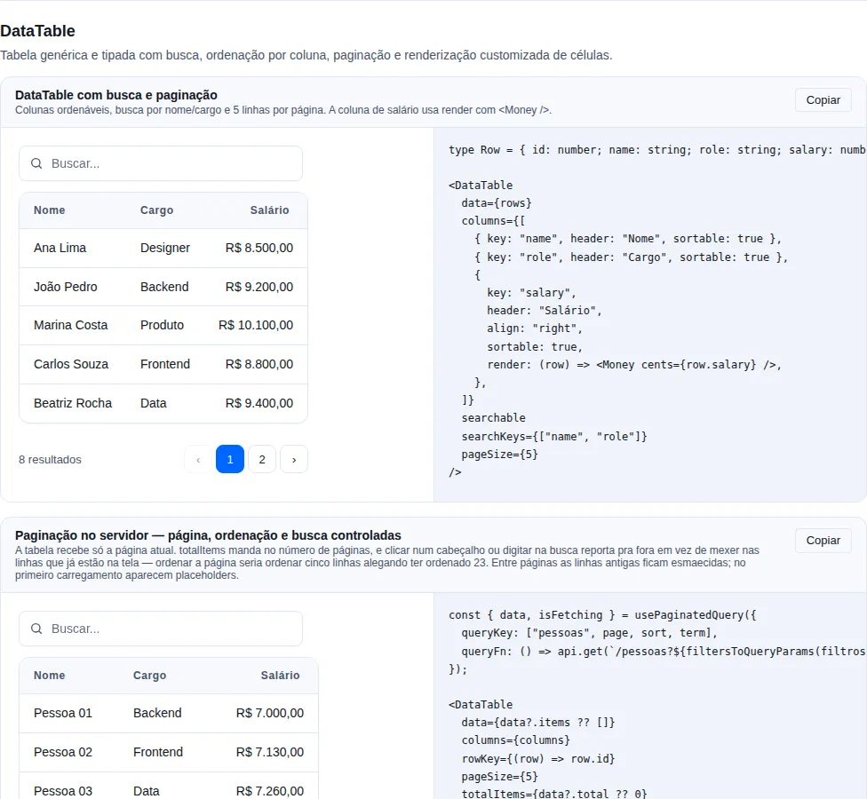
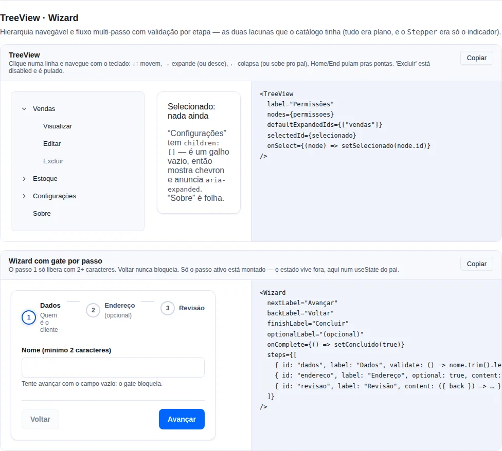
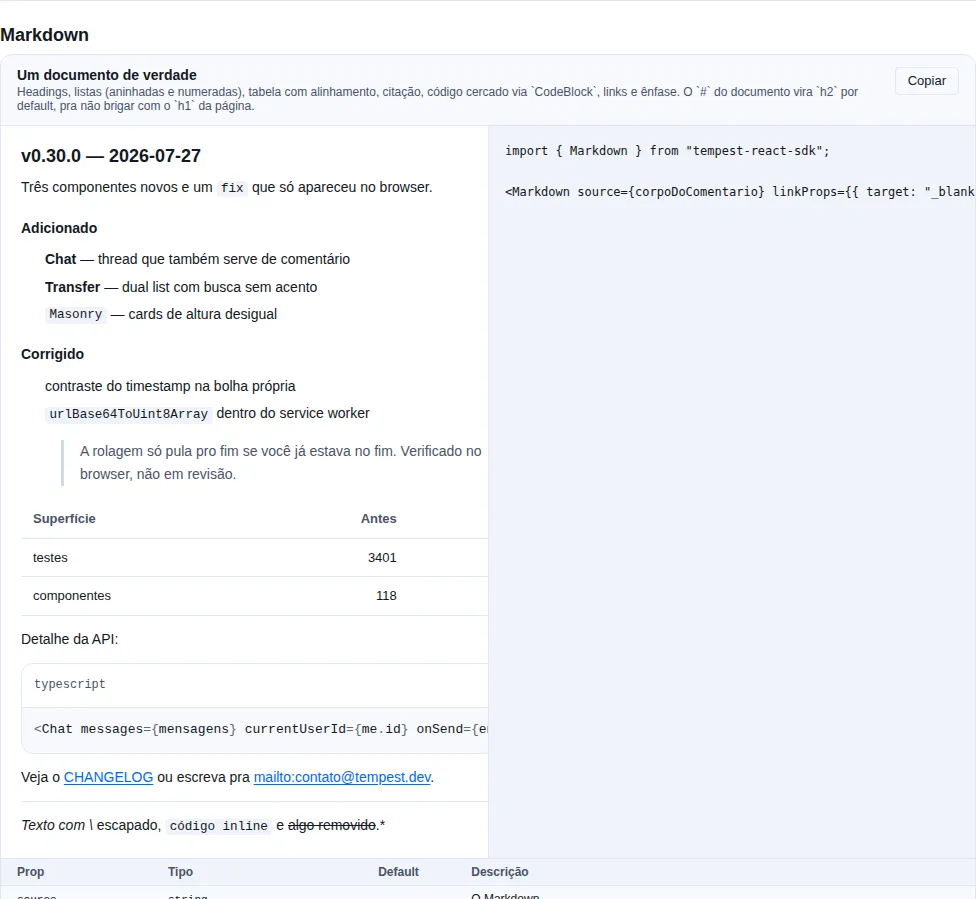
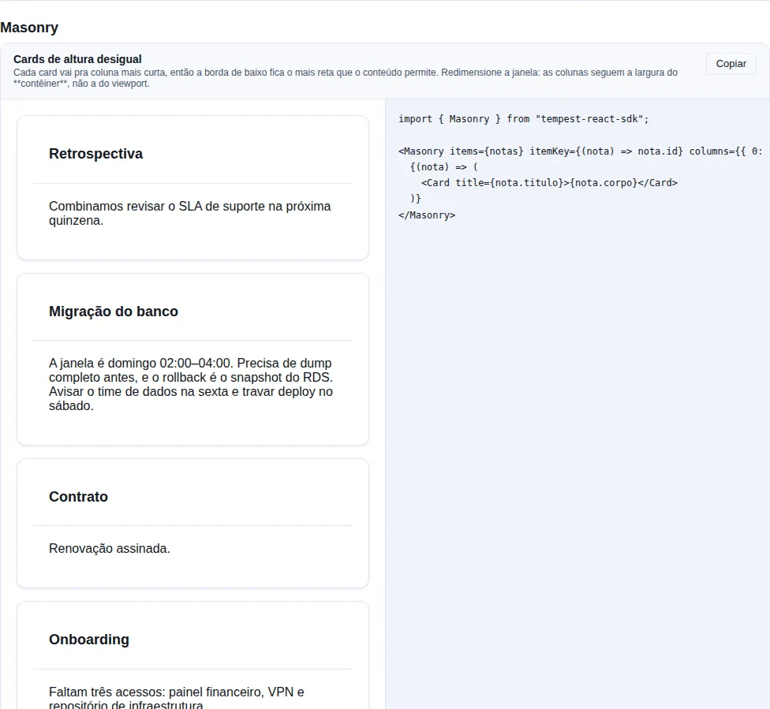
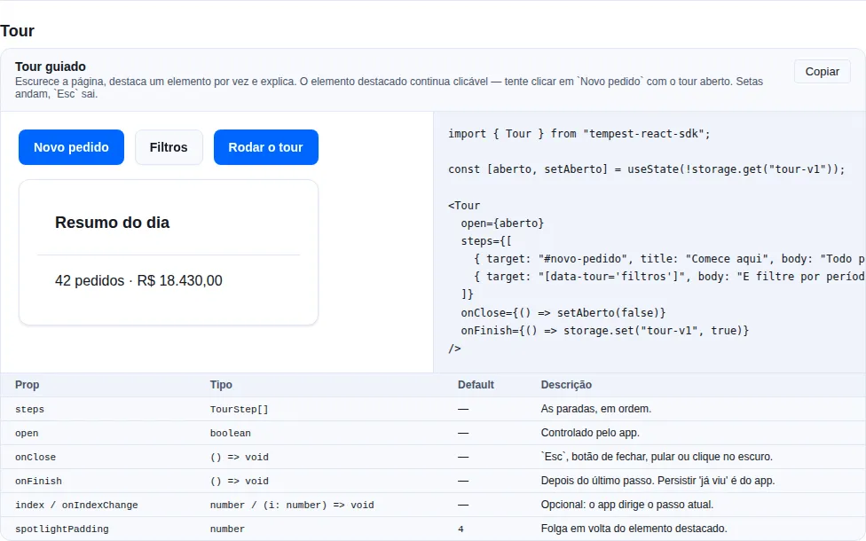
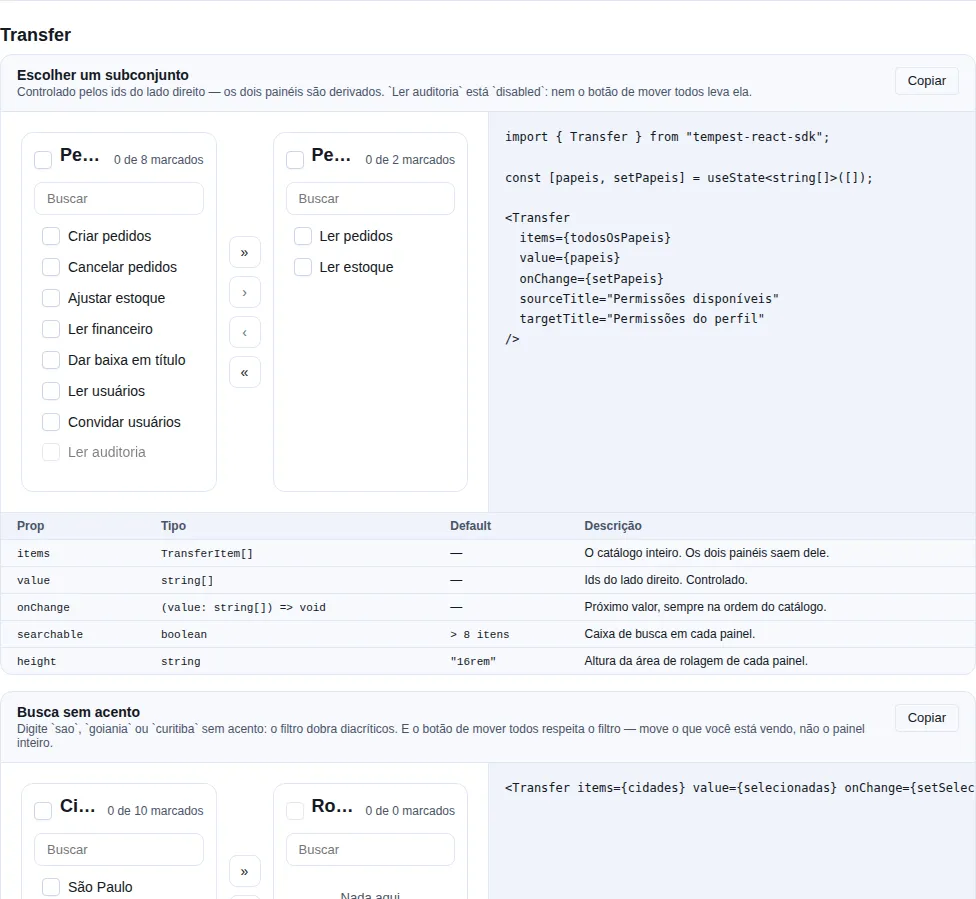
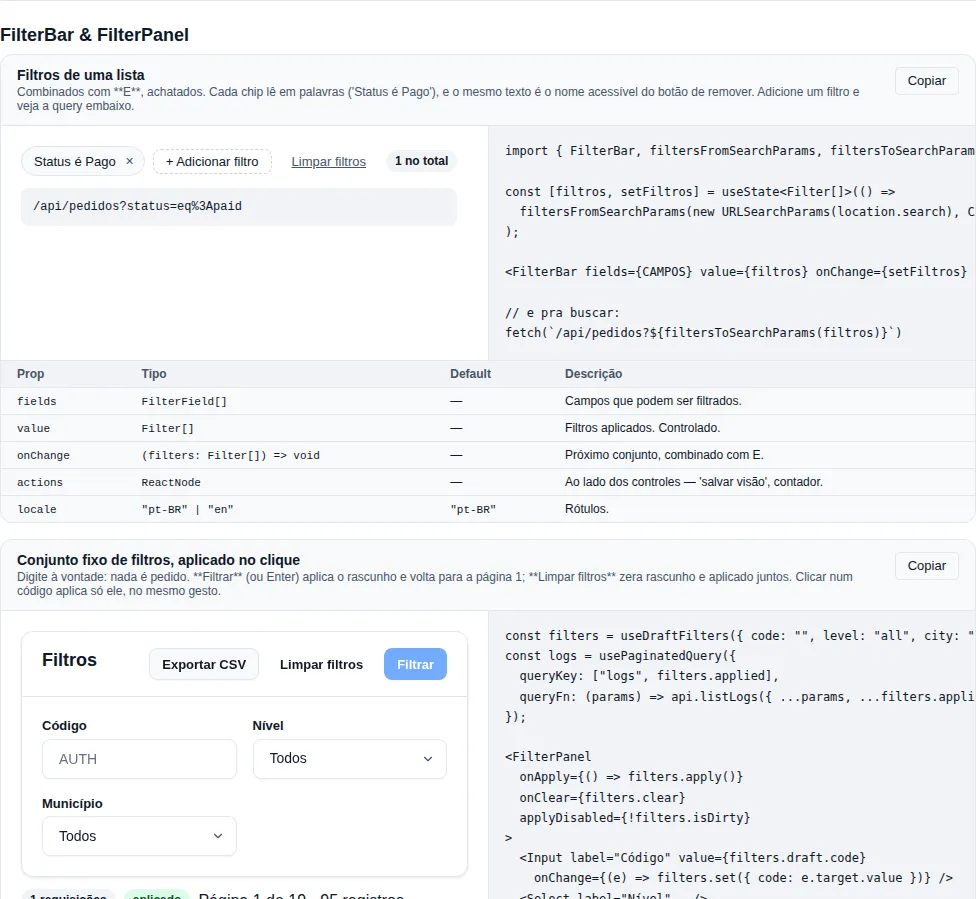

# Advanced: data

A stateful table, a step wizard, markdown, a masonry wall, a guided tour, list-to-list transfer, a filter bar and the kanban. Each one solves a whole screen.

## `DataTable<T>`

<!-- gallery:data-table -->
[](../gallery.md)

*Section `data-table` of the [gallery](../gallery.md) — run it locally to interact.*
<!-- /gallery -->

A stateful data table built on top of the headless `Table`. Adds client-side search, click-to-sort columns, and pagination, delegating all markup to the underlying `Table`.

```tsx
import { DataTable, type DataTableColumn } from "tempest-react-sdk";

interface User {
  id: number;
  name: string;
  email: string;
  role: string;
}

const columns: DataTableColumn<User>[] = [
  { key: "name", header: "Name", sortable: true },
  { key: "email", header: "Email" },
  { key: "role", header: "Role", sortable: true, align: "right" },
];

<DataTable
  data={users}
  columns={columns}
  searchable
  pageSize={10}
  initialSort={{ key: "name", direction: "asc" }}
  rowKey={(row) => row.id}
  emptyMessage="No users found"
/>;
```

| Prop           | Type                                  | Default | Description                                             |
| -------------- | ------------------------------------- | ------- | ------------------------------------------------------- |
| `data`         | `T[]`                                 | —       | Full dataset; sort/filter/pagination happen client-side |
| `columns`      | `DataTableColumn<T>[]`                | —       | Column definitions                                      |
| `pageSize`     | `number`                              | `10`    | Rows per page                                           |
| `searchable`   | `boolean`                             | `false` | Render a search input above the table                   |
| `searchKeys`   | `(keyof T)[]`                         | —       | Keys to search; default = string/number columns         |
| `initialSort`  | `DataTableSort<T>`                    | —       | Initial sort applied before any header interaction      |
| `rowKey`       | `(row: T, index) => string \| number` | index   | Stable key extractor for rows                           |
| `emptyMessage` | `ReactNode`                           | —       | Content shown when no rows match                        |

`DataTableColumn<T>` = `{ key: keyof T; header: ReactNode; render?: (row: T) => ReactNode; sortable?: boolean; align?: TableAlign; priority?: TablePriority; width?: string | number }`. `DataTableSort<T>` = `{ key: keyof T; direction: "asc" | "desc" }`.

!!! info "Behavior"
    Clicking a sortable header cycles asc → desc → unsorted. Search matches a case-insensitive substring across `searchKeys` (or every string/number column when omitted). Pagination is hidden when the result fits on a single page.

## `Wizard`

<!-- gallery:hierarchy-flow -->
[](../gallery.md)

*Section `hierarchy-flow` of the [gallery](../gallery.md) — run it locally to interact.*
<!-- /gallery -->

Multi-step flow: an indicator, one body at a time, and navigation that respects **per-step validation**. `Stepper` draws the indicator; `Wizard` owns the part every app was rewriting — the active index, the async gate before advancing, disabled/pending buttons and the completion call.

```tsx
import { Button, FormField, Input, Wizard, useZodForm } from "tempest-react-sdk";
import { FormProvider } from "react-hook-form";
import { z } from "zod";

const schema = z.object({
  name: z.string().min(2, "Enter a name"),
  email: z.string().email("Invalid email"),
  zip: z.string().min(5, "Incomplete ZIP"),
});

export function SteppedSignup() {
  const form = useZodForm(schema, { defaultValues: { name: "", email: "", zip: "" } });

  return (
    <FormProvider {...form}>
      <Wizard
        onComplete={form.handleSubmit((values) => console.log(values))}
        steps={[
          {
            id: "details",
            label: "Details",
            description: "Who the customer is",
            validate: () => form.trigger(["name", "email"]),
            content: (
              <>
                <FormField name="name" label="Name" required><Input /></FormField>
                <FormField name="email" label="Email" required><Input type="email" /></FormField>
              </>
            ),
          },
          {
            id: "address",
            label: "Address",
            validate: () => form.trigger(["zip"]),
            content: <FormField name="zip" label="ZIP" required><Input /></FormField>,
          },
          {
            id: "review",
            label: "Review",
            content: ({ back }) => (
              <>
                <pre>{JSON.stringify(form.getValues(), null, 2)}</pre>
                <Button variant="ghost" onClick={back}>Fix something</Button>
              </>
            ),
          },
        ]}
      />
    </FormProvider>
  );
}
```

| Prop                 | Type                                          | Default    | Description                                                  |
| -------------------- | --------------------------------------------- | ---------- | ------------------------------------------------------------ |
| `steps`              | `WizardStep[]`                                | —          | The flow's steps.                                            |
| `activeIndex`        | `number`                                      | —          | Controlled index.                                            |
| `defaultActiveIndex` | `number`                                      | `0`        | Initial index (uncontrolled).                                |
| `onStepChange`       | `(index, step) => void`                       | —          | Called on every step change.                                 |
| `onComplete`         | `() => void \| Promise<void>`                 | —          | Called when the last step passes validation.                 |
| `nextLabel`          | `string`                                      | `"Next"`   | Advance button label.                                        |
| `backLabel`          | `string`                                      | `"Back"`   | Back button label.                                           |
| `finishLabel`        | `string`                                      | `"Finish"` | Label on the last step.                                      |
| `optionalLabel`      | `string`                                      | `"(optional)"` | Suffix for an optional step in the indicator — override to localize. |
| `clickableSteps`     | `boolean`                                     | `false`    | Allows jumping by clicking the indicator.                    |
| `renderActions`      | `(controls: WizardControls) => ReactNode`     | —          | Replaces the default button row.                             |

`WizardStep = { id, label, description?, content, validate?, optional? }` — `content` accepts a `ReactNode` **or** a function receiving the controls.

`WizardControls = { activeIndex, step, validating, isFirst, isLast, next, back, goTo }`.

!!! warning "Only the active step is mounted"
    Uncommitted input in a step you leave is **lost** unless the state lives outside (react-hook-form's `FormProvider`, a store, a parent `useState`) — which is where it belongs anyway, since the last step usually submits everything at once.

!!! tip "An async `validate` comes with a pending state"
    While the promise runs, the advance button is in `loading` and Back is disabled. A `validate` that **throws** counts as "not allowed": a gate wired to a network check should not strand the user on a half-advanced flow when the request fails.

!!! note "`clickableSteps` is `false` on purpose"
    A wizard exists because **order matters**. With `clickableSteps`, jumping back is free (going back never blocks), but jumping forward validates **every step crossed** — the first gate that fails stops the jump right there.

## `Markdown`

<!-- gallery:markdown -->
[](../gallery.md)

*Section `markdown` of the [gallery](../gallery.md) — run it locally to interact.*
<!-- /gallery -->

> **When to use**: rendering text that came from people — a comment, a ticket description, release notes, a message body.

A Markdown subset: headings, paragraphs, lists (nested and ordered), blockquote, fenced code (through [`CodeBlock`](utility.md#codeblock)), thematic break, GFM pipe tables with alignment, and the usual inline set (`**strong**`, `*em*`, `` `code` ``, `~~del~~`, links, images, autolinks, hard breaks).

```tsx
import { Markdown } from "tempest-react-sdk";

<Markdown source={comment.body} linkProps={{ target: "_blank", rel: "noreferrer" }} />;
```

| Prop | Type | Default | What it does |
| --- | --- | --- | --- |
| `source` | `string` | — | The Markdown. |
| `headingOffset` | `number` | `2` | Level the document's `#` becomes. |
| `highlightCode` | `boolean` | `true` | Fenced code through `CodeBlock` (copy, line numbers). |
| `showLineNumbers` | `boolean` | `false` | Line numbers in fenced code. |
| `linkProps` | `AnchorHTMLAttributes` | — | Extra props on **every** link. |

!!! danger "The safety is structural, not a promise about escaping"
    `dangerouslySetInnerHTML` **does not exist** in this component. The parser produces a node tree and the renderer turns it into React elements — and a React child can only be text. So `<script>alert(1)</script>` in a comment renders as the characters somebody typed, and so does ``.

    This is not "sanitized HTML": **it is text**. Which is why there is no sanitizer here and no allowed-tags list — there is no path for markup to enter.

!!! danger "URLs go through a scheme allowlist, not a blocklist"
    Links accept `http`, `https`, `mailto`, `tel`, `sms` and relative. Images accept the same plus **raster** `data:image/` (png/jpeg/gif/webp/avif) — `data:image/svg+xml` is deliberately out: an SVG is a document, it carries `<script>` and event handlers.

    `[click](javascript:alert(1))` renders **"click"** as text: the link goes, the words stay. A blocklist would have to enumerate `javascript:`, `JaVaScRiPt:`, `java\tscript:`, `\u0001javascript:` — and would miss the one nobody thought of. An allowlist carries no such debt.

!!! warning "It is a subset, and that is the chosen ceiling"
    No embedded HTML, footnotes, definition lists, reference links (`[a][b]`) or task lists. If your case needs full CommonMark with plugins, reach for `react-markdown` + `remark` directly — that is 40 KB and a plugin chain the whole SDK does not pay for. The scope here is what a user comment uses.

!!! info "`#` becomes `h2` by default"
    A comment rendered inside a page whose `h1` is the page title must not emit a second `h1`. `headingOffset` shifts the whole scale, and the component never goes past `h6`, so the document outline stays valid.

!!! check "A wide table scrolls in its own box, and the box is reachable"
    The tab stop appears **only while** the overflow is real — a scroll area with nothing focusable inside is unreachable by keyboard, and adding the stop unconditionally would pollute the tab order with one entry per table.

## `Masonry`

<!-- gallery:masonry -->
[](../gallery.md)

*Section `masonry` of the [gallery](../gallery.md) — run it locally to interact.*
<!-- /gallery -->

> **When to use**: cards of **uneven height** with no order between them — a notes wall, a photo gallery, dashboard cards.

Measures the cards and deals each one into the shortest column, so the bottom edge is as even as the content allows.

```tsx
import { Masonry, Card } from "tempest-react-sdk";

<Masonry items={notes} itemKey={(note) => note.id} columns={{ 0: 1, 640: 2, 1024: 3 }}>
  {(note) => <Card title={note.title}>{note.body}</Card>}
</Masonry>;
```

| Prop | Type | Default | What it does |
| --- | --- | --- | --- |
| `items` | `T[]` | — | What to lay out. |
| `children` | `(item: T, index: number) => ReactNode` | — | Renders one card. |
| `columns` | `number \| Record<number, number>` | `{ 0: 1, 640: 2, 1024: 3 }` | A fixed number, or a **width → columns** map. |
| `itemKey` | `(item: T, index: number) => string \| number` | index | Stable key per item. |
| `gap` | `string` | `--tempest-space-4` | Space between cards. |

!!! info "Why this is not one line of CSS"
    CSS `columns` **breaks a card** across the column boundary, and `grid-auto-flow: dense` keeps every row at the height of its tallest cell — which is exactly the ragged bottom edge people reach for masonry to avoid. Both are one line of CSS and neither does this job.

!!! warning "Reading order goes down the column, not across the row"
    Card 2 sits **below** card 1, not beside it. Which is why this layout is for **independent** items: a list where item 2 must follow item 1 wants a grid, not this. If order matters to your content, do not use masonry — not here, not in plain CSS.

!!! check "The breakpoint map is about the container, not the viewport"
    A masonry inside a drawer or a two-column page is narrower than the window, and a media query would give it three columns at 300px wide. A `ResizeObserver` is what makes `{ 0: 1, 640: 2 }` mean "of this container", which is the only useful reading.

!!! info "Shortest column, not round-robin"
    `index % columns` is the obvious approach and produces ragged columns the moment items differ in height — which is the only reason to use masonry at all.

!!! tip "An image that loads later is re-measured"
    Every card is observed individually: a height measured at mount is wrong in exactly the case of an image still downloading. The first paint weights every card as 1 (so it is never blank) and the measured pass re-deals.

## `Tour`

<!-- gallery:tour -->
[](../gallery.md)

*Section `tour` of the [gallery](../gallery.md) — run it locally to interact.*
<!-- /gallery -->

> **When to use**: introducing a screen — first-run onboarding, a feature that moved, a flow nobody finds on their own.

Dims the page, highlights one element at a time and explains it. The highlighted element **stays clickable**.

```tsx
import { Tour } from "tempest-react-sdk";
import { useState } from "react";

export function Orders() {
  const [open, setOpen] = useState(!storage.get("tour-orders-v1"));

  return (
    <>
      {/* … the screen … */}
      <Tour
        open={open}
        steps={[
          { target: "#new-order", title: "Start here", body: "Every order begins with this button." },
          { target: "[data-tour='filters']", body: "And filter by period here.", placement: "right" },
        ]}
        onClose={() => setOpen(false)}
        onFinish={() => storage.set("tour-orders-v1", true)}
      />
    </>
  );
}
```

| Prop | Type | Default | What it does |
| --- | --- | --- | --- |
| `steps` | `TourStep[]` | — | The stops, in order. |
| `open` | `boolean` | — | Controlled by the app. |
| `onClose` | `() => void` | — | `Esc`, the close button, "skip", or a click on the dim. |
| `onFinish` | `() => void` | — | After the last step, before `onClose`. |
| `index` / `onIndexChange` | `number` / `(i) => void` | internal | The app drives the current step, if it wants to. |
| `spotlightPadding` | `number` | `4` | Space kept clear around the highlighted element. |
| `locale` | `"pt-BR" \| "en"` | `"pt-BR"` | Labels. |

`TourStep = { target?, title?, body, placement? }` · `placement` ∈ `"top" | "bottom" | "left" | "right" | "center"`.

!!! check "The highlighted element stays clickable — and that is what makes a coachmark useful"
    The dim is **four rectangles** around the target, not one overlay with a `box-shadow` hole. Because a shadow is **not hit-testable**: a hole made that way would block nothing — the rest of the page would stay clickable and the target would not. Four rectangles are the other way round, which is what "press this button" needs.

!!! info "The target is a **selector**, not a ref"
    So a tour can be declared as data — in a config file, from the backend, next to the copy — without every screen threading refs up to whoever renders the tour.

!!! warning "A step whose target is missing shows centred, it does not vanish"
    That is the real case: a feature hidden by permission, a button that only exists with data. Dropping the step would hide its message silently, and skipping to the next could skip the whole tour.

!!! check "Keyboard: arrows walk, `Esc` leaves, focus goes to the card"
    The card is `role="dialog"` + `aria-modal`, named by its title and described by its body, with a focus trap (`useFocusTrap`) and a visible "Step 2 of 5". `Esc` is handled **on the card**, not on `window`: a tour opened over a modal does not close both.

!!! info "The card flips when it does not fit — and centres when nothing fits"
    It tries the preferred side, then the **opposite** one (which keeps the reading relationship with the target; jumping to a side would move the card across the screen for no visible reason), then the others. A card half off-screen is worse than a card in the middle — and that happens for real when the target is taller than the viewport.

!!! tip "Persisting 'already seen' is the app's business"
    The component takes `open` and emits `onClose`/`onFinish`. Writing the flag is one line in the app (`storage.set`) and would be a wrong default here — the key is versioned, scoped per user, and sometimes lives on the backend.

## `Transfer`

<!-- gallery:transfer -->
[](../gallery.md)

*Section `transfer` of the [gallery](../gallery.md) — run it locally to interact.*
<!-- /gallery -->

> **When to use**: picking a **subset** of a catalogue — a profile's permissions, cities on a route, members of a group, columns of a report.

Two panes, four move controls, a search box on each side. Controlled by the **ids on the right**; both panes are derived.

```tsx
import { Transfer, type TransferItem } from "tempest-react-sdk";
import { useState } from "react";

const PERMISSIONS: TransferItem[] = [
  { id: "orders.read", label: "Read orders" },
  { id: "orders.create", label: "Create orders" },
  { id: "audit.read", label: "Read audit log", disabled: true },
];

export function ProfilePermissions() {
  const [permissions, setPermissions] = useState<string[]>([]);

  return (
    <Transfer
      items={PERMISSIONS}
      value={permissions}
      onChange={setPermissions}
      sourceTitle="Available"
      targetTitle="On the profile"
    />
  );
}
```

| Prop | Type | Default | What it does |
| --- | --- | --- | --- |
| `items` | `TransferItem[]` | — | The whole catalogue. Both panes come from it. |
| `value` | `string[]` | — | Ids on the right. **Controlled.** |
| `onChange` | `(value: string[]) => void` | — | Next value, always in catalogue order. |
| `sourceTitle` / `targetTitle` | `ReactNode` | `"Disponíveis"` / `"Selecionados"` | Each pane's heading. |
| `searchable` | `boolean` | `true` past 8 items | A search box on each pane. |
| `renderItem` | `(item, side) => ReactNode` | `item.label` | Custom row body. |
| `height` | `string` | `"16rem"` | Height of each pane's scroll area. |
| `locale` | `"pt-BR" \| "en"` | `"pt-BR"` | Labels and announcements. |
| `disabled` | `boolean` | `false` | Blocks every move. |

`TransferItem = { id, label, searchText?, disabled?, data? }`

!!! info "Only the right-hand ids are state — the panes are derived"
    Storing two lists looks simpler and **drifts** the first time the catalogue changes underneath: a permission removed on the server lingers in whichever pane held it, and an id present on both sides is a bug nobody can see. With a single `value`, `items` is in charge: anything that left the catalogue simply disappears from both panes.

!!! check "The move-all button respects the filter"
    Filtering by `sao` and clicking "move all" moves **what you are looking at**, not the whole pane. Moving the rows the filter hid is the kind of surprise that makes people stop trusting the button — and it was a real bug, caught by a test before the merge.

!!! check "Search folds accents, both ways"
    `sao` finds "São Paulo" and so does `são`. For a PT-BR audience that is not a refinement: a plain `includes` would miss half the searches.

!!! warning "A `disabled` row does not move by any path"
    The check lives in `applyMove`, not in each of the four buttons — it is a mandatory permission, a locked seat. Which is why `»` moves "everything movable", not "everything".

!!! info "Checks are cleared after a move"
    Otherwise the next click on the opposite button sends it all back, and the component looks like it is undoing itself.

!!! info "The controls sit in the middle by grid order, but come last in the DOM"
    A keyboard reaching the buttons before it has seen what they move would have to go back; a screen reader would read "move checked to the right" with no idea what is checked. Each pane is a `region` named by its heading, and each move is announced in a `role="status"`.

## `FilterBar`

<!-- gallery:filterbar -->
[](../gallery.md)

*Section `filterbar` of the [gallery](../gallery.md) — run it locally to interact.*
<!-- /gallery -->

> **When to use**: filtering an admin list — orders by status and period, users by role, invoices by due date.

Chips for the applied filters, plus a small editor to add another. Filters are combined with **AND**, flat.

```tsx
import {
  FilterBar,
  filtersFromSearchParams,
  filtersToSearchParams,
  type Filter,
  type FilterField,
} from "tempest-react-sdk";

const FIELDS: FilterField[] = [
  { name: "title", label: "Title", type: "text" },
  { name: "total", label: "Total", type: "number" },
  { name: "createdAt", label: "Created", type: "date" },
  {
    name: "status",
    label: "Status",
    type: "select",
    options: [
      { value: "paid", label: "Paid" },
      { value: "sent", label: "Sent" },
    ],
  },
];

export function Orders() {
  // The set comes from the URL, so a shared link opens with the same filters.
  const [filters, setFilters] = useState<Filter[]>(() =>
    filtersFromSearchParams(new URLSearchParams(location.search), FIELDS),
  );

  const { data } = useQuery({
    queryKey: ["orders", filters],
    queryFn: () => api.get(`/orders?${filtersToSearchParams(filters)}`),
  });

  return <FilterBar fields={FIELDS} value={filters} onChange={setFilters} />;
}
```

| Prop | Type | Default | What it does |
| --- | --- | --- | --- |
| `fields` | `FilterField[]` | — | Fields that can be filtered. |
| `value` | `Filter[]` | — | Applied filters. **Controlled.** |
| `onChange` | `(filters: Filter[]) => void` | — | Next set, combined with AND. |
| `actions` | `ReactNode` | — | Next to the controls — "save this view", a counter. |
| `locale` | `"pt-BR" \| "en"` | `"pt-BR"` | Labels and descriptions. |

`FilterField = { name, label, type, options?, operators?, placeholder? }` · `type` ∈ `"text" | "number" | "date" | "select" | "boolean"`
`Filter = { field, operator, value? }` · `operator` ∈ `eq · ne · contains · gt · gte · lt · lte · between · in · empty · notEmpty`

**Exported helpers**: `applyFilters`, `filtersToQueryParams`, `filtersToSearchParams`, `filtersFromSearchParams`, `describeFilter`, `operatorsFor`.

#### Applying the filters

`FilterBar` **produces** `Filter[]`; evaluating them is yours. The SDK ships both ends, and you pick one by list size, not by taste.

**Whole list in memory** — `applyFilters` runs the eleven operators:

```tsx
import { FilterBar, applyFilters, type Filter } from "tempest-react-sdk";

export function Orders({ orders }: { orders: Order[] }) {
  const [filters, setFilters] = useState<Filter[]>([]);
  const visible = useMemo(() => applyFilters(orders, filters), [orders, filters]);

  return (
    <>
      <FilterBar fields={FIELDS} value={filters} onChange={setFilters} />
      <DataTable data={visible} columns={COLUMNS} />
    </>
  );
}
```

**Server-paginated listing** — `filtersToQueryParams`, which speaks the `tempest-fastapi-sdk` dialect:

```tsx
const params = filtersToQueryParams(filters);
params.set("page", String(page));
params.set("page_size", "20");

const { data } = useQuery({
  queryKey: ["orders", filters, page],
  queryFn: () => api.get(`/orders?${params}`),
});
```

| Operator | Param sent |
| --- | --- |
| `eq` | `field` (or `field__iexact` on the `name` column) |
| `ne` | `field__ne` |
| `contains` | `field__icontains` |
| `gt` `gte` `lt` `lte` | `field__gt` … `field__lte` |
| `between` | `field__between` twice, low value first |
| `in` | `field__in`, once per value |
| `empty` / `notEmpty` | `field__isnull=true` / `=false` |

!!! tip "The dialect is the **default**, not a law"
    The table above is the `tempest-fastapi-sdk` dialect. A different backend passes
    `options` rather than reimplementing the encoder:

    ```tsx
    // The searchable column is `razao_social`, and `ne` is spelled the Django way.
    const params = filtersToQueryParams(filters, {
      substringColumns: ["razao_social"],
      operatorSuffix: { ne: "__exclude" },
    });
    ```

    - `substringColumns` — the columns whose `eq` is emitted as `column__iexact`.
      Default `["name"]`, which is what `build_filter_condition` special-cases. Pass
      `[]` when your backend treats no column that way and an `eq` should stay bare.
    - `operatorSuffix` — merged **over** the default, so an override names only the
      operators that differ.

    Through v0.44.0 both were closed module constants. A project whose column was
    called `nome` or `titulo` could not get the treatment, and one without the
    special case got an `__iexact` nobody asked for.

!!! danger "The backend must **declare** every key, or the filter fails silently"
    `BasePaginationFilterSchema.get_conditions()` only forwards fields the subclass declares. A `status__ne` the schema never mentions is dropped by FastAPI before the repository sees it — no error, no filtering, and the full list comes back looking like "the filter didn't take". Declare `status__ne: str | None = None` on the filter schema for every operator the screen offers.

!!! warning "`applyFilters` and the backend disagree on two points, deliberately"
    **`ne` matches rows with no value.** In SQL, `column <> 'x'` is `NULL` for a `NULL` column and the row drops out. On the client, "is not paid" also shows the orders with no status at all — which is what the chip promises.
    **`empty` matches blank text.** `__isnull` on the server only matches `NULL`; a column storing `""` instead of `NULL` answers differently on each side.
    If one screen alternates between both modes, pick one per field and stay there.

!!! info "`eq` is case-sensitive; `contains` is not"
    That is the alignment with the server: `eq` becomes `WHERE column = value`, and a case-insensitive client would quietly disagree with it. `contains` becomes `icontains` and is insensitive on both sides — and since it is the **default** operator for text fields, the friendly behaviour is what you get without asking.

!!! tip "Dates compare by **day**, and `between` is inclusive at both ends"
    A row stamped `2026-03-05T13:00:00Z` matches `eq 2026-03-05`, and an inverted `between` (later date first) is **normalised** instead of matching nothing — someone who picked the end date first meant the range, not an empty list.

!!! warning "Flat **AND**, not a tree with OR — and that is the chosen ceiling"
    Nested groups (`(a OR b) AND c`) are a different component: they need a tree UI with a per-node operator and a different serialization. Trying to be both produces a builder that is clumsy at the 95% case — "status is paid, created after March, title contains nota". If you need nested OR, what you want is a real query builder, and it does not fit behind this API.

!!! check "The filter set fits in the URL — and comes back from it"
    `filtersToSearchParams` writes `status=eq:paid&total=between:10|90`; `filtersFromSearchParams` reads it back, and there is a **round-trip** test. A filter set that cannot survive a reload is one people re-enter every time they open a link somebody sent them.

!!! danger "Whatever does not parse is **dropped**, not guessed at"
    A hand-edited URL is the normal way this input arrives. An operator the field does not offer (`total=contains:1`), an unknown field, a `between` with one end — all discarded. Rendering a chip the backend cannot evaluate would show a list that does not match what the chip claims.

!!! check "The chip reads in words, and it is the same text a screen reader hears"
    "Status is Paid" — with the option's **label**, not its key (`paid`). The remove button uses the same sentence in its `aria-label` ("Remove filter: Status is Paid"), because a chip that says one thing to a sighted user and another to a screen reader is two different truths.

!!! info "The input follows the **field**, not the operator"
    A date field gets a date picker even under `between` (two of them). Typing a date into a text box is the fastest way to produce a filter the backend cannot parse.

!!! tip "An incomplete filter only disables Apply"
    It is not an error to shout about — it is a half-filled form. Changing the operator clears the value, because a value carried across operators produces filters nobody meant to write.

## `Kanban`

> **When to use it**: a board of columns whose cards move between stages — backlog, sales pipeline, work orders by status.

Reorders within a column and moves across columns, by pointer **or** keyboard. The drag machine is `useSortable` — the board reimplements none of it.

```tsx
import { applyKanbanMove, Kanban, type KanbanColumn } from "tempest-react-sdk";
import { useState } from "react";

export function BacklogBoard() {
  const [columns, setColumns] = useState<KanbanColumn[]>([
    { id: "todo", title: "To do", cards: [{ id: "1", content: "Fix login" }] },
    { id: "doing", title: "Doing", cards: [] },
    { id: "done", title: "Done", cards: [], locked: true },
  ]);

  return (
    <Kanban
      label="Backlog"
      columns={columns}
      onMove={(move) => setColumns((current) => applyKanbanMove(current, move))}
    />
  );
}
```

| Prop | Type | Default | What it does |
| --- | --- | --- | --- |
| `columns` | `KanbanColumn[]` | — | Columns with their cards, in display order. |
| `onMove` | `(move: KanbanMove) => void` | — | Called **once** per committed move. You apply it. |
| `renderCard` | `(card, column) => ReactNode` | the card content | Customizes the card body. |
| `label` | `string` | `"Quadro"` | Accessible name of the board. |
| `emptyLabel` | `ReactNode` | `"Nenhum card"` | Text for an empty column. |
| `cardRoleDescription` | `string` | keyboard hint | Announced per card — override to localize. |
| `disabled` | `boolean` | `false` | Blocks all dragging. |

`KanbanColumn = { id, title, cards, locked? }` · `KanbanCard = { id, content }` · `KanbanMove = { cardId, fromColumn, toColumn, toIndex }`.

`applyKanbanMove(columns, move)` is the reducer that applies a move returning new arrays — exported because every consumer needs the same one, and it is where the off-by-one lives.

!!! info "A `locked` column refuses drops but still lets cards leave"
    That is a "Done" column which takes no new work, but whose cards can still be pulled back.

!!! warning "A keyboard move can only target a position that holds a card"
    The move walks the index space of existing cards, so **dropping into an empty column works by pointer but not by keyboard**. That is a limitation of the current implementation, not a design choice: until column-switch keys land, the way around is to move into a column that already has a card and then reorder.

!!! info "ARIA: one `listbox` per column, not one per board"
    Each column that has cards is a `listbox` named by its title, containing only `option`s. A single board-wide listbox does not survive the markup a board needs — `listbox` requires `option`/`group` children and the column header in between breaks that ownership. An **empty** column is not marked as a listbox (zero `option`s fails `aria-required-children`), and the header is a `div`, not a `<header>`: outside a sectioning element every `<header>` becomes a `banner` landmark — with three columns, three duplicate banners.

## Recap

- **Data**: `DataTable<T>` wraps the headless `Table` with client-side search, sort, and pagination.
- All share the same controlled/uncontrolled patterns, expose keyboard A11y, and import from `tempest-react-sdk`.
