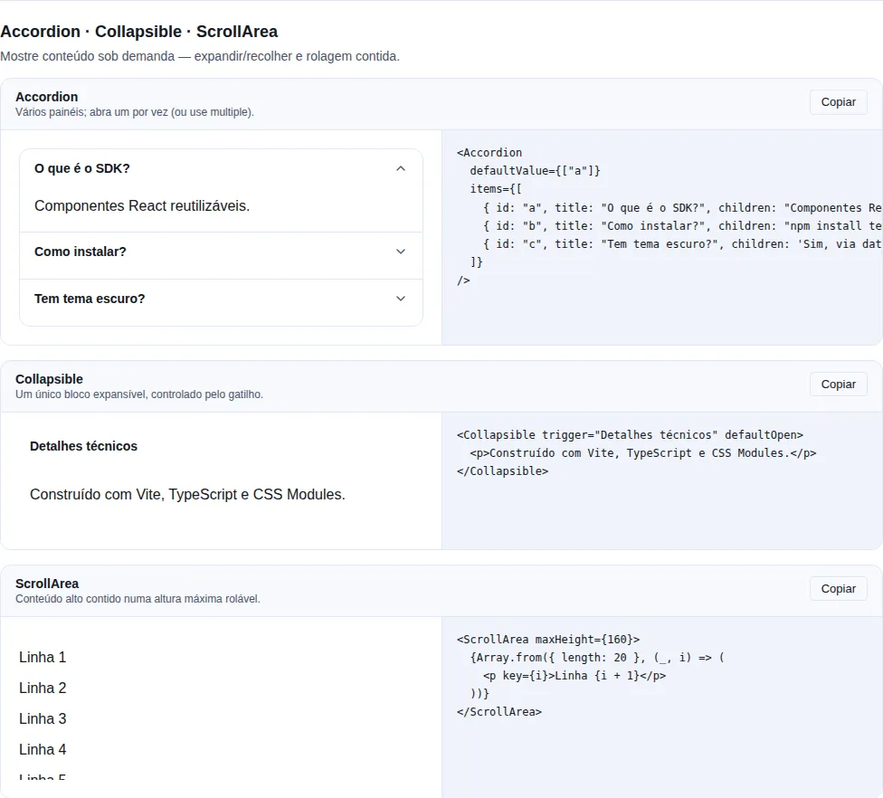
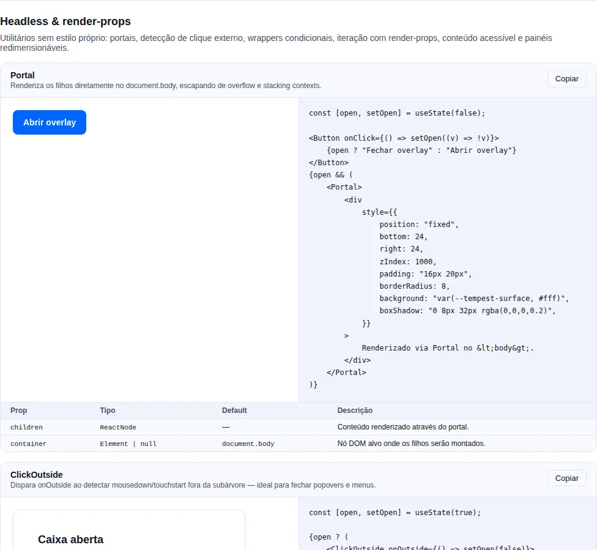
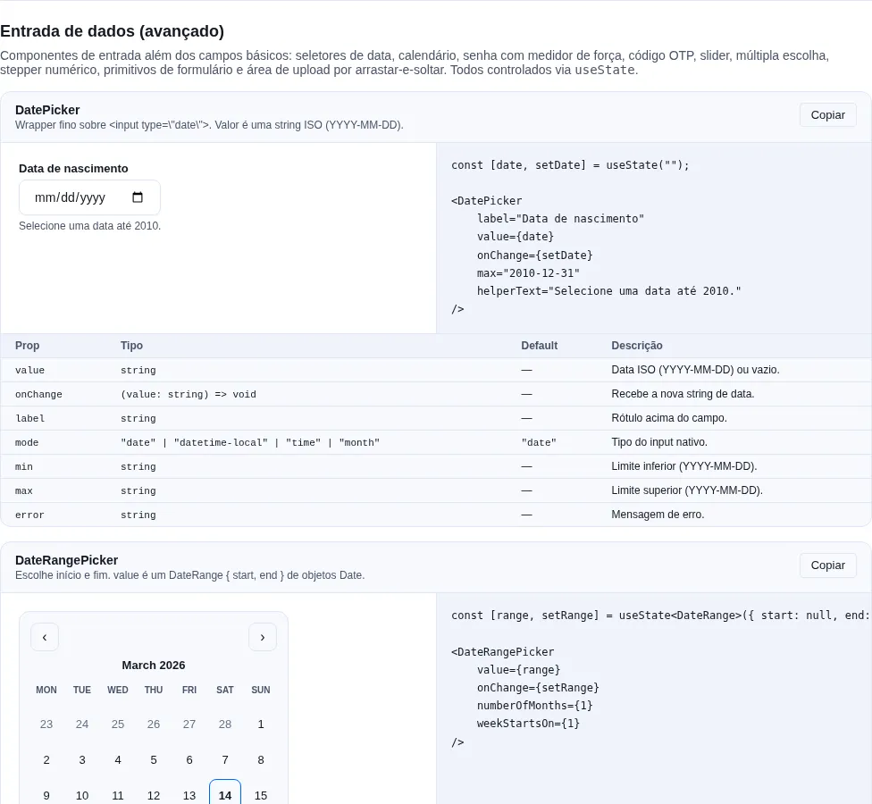
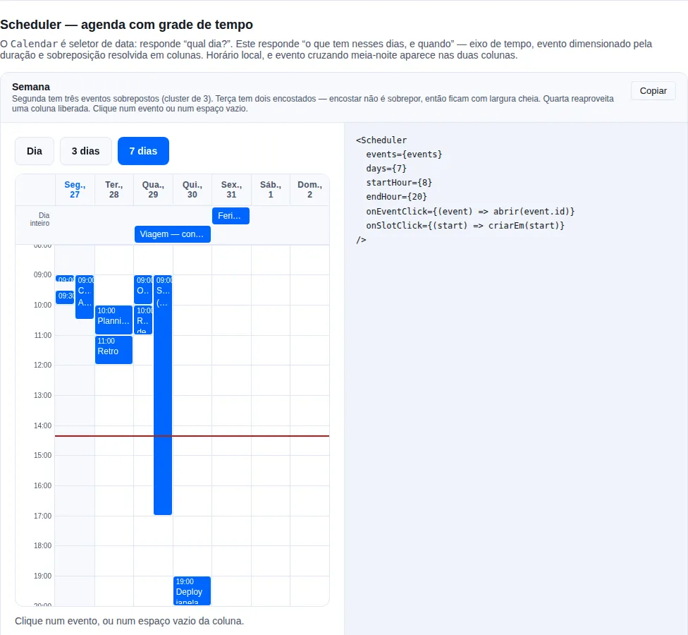

# Advanced: layout & UX

Styled scrolling, resizable panes, calendar and scheduler. They shape the space around the content, with no external dependency.

## `ScrollArea`

<!-- gallery:disclosure -->
[](../gallery.md)

*Section `disclosure` of the [gallery](../gallery.md) — run it locally to interact.*
<!-- /gallery -->

A styled scroll container that overflows on the chosen axis and renders a thin scrollbar (WebKit). Forwards `className`, `style`, and `ref` to the `<div>`.

```tsx
import { ScrollArea } from "tempest-react-sdk";

<ScrollArea maxHeight={240} orientation="vertical">
  <ul>
    {items.map((item) => (
      <li key={item.id}>{item.name}</li>
    ))}
  </ul>
</ScrollArea>;
```

| Prop          | Type                                   | Default      | Description                         |
| ------------- | -------------------------------------- | ------------ | ----------------------------------- |
| `maxHeight`   | `number \| string`                     | —            | Caps the height; numbers are pixels |
| `orientation` | `"vertical" \| "horizontal" \| "both"` | `"vertical"`     | Which axis scrolls                  |
| `scrollLabel` | `string`                               | `"Área rolável"` | Accessible name for the scroll region |

Remaining `<div>` props are forwarded.

!!! info "While it overflows, it becomes a focusable group"
    An area whose content is plain text holds nothing focusable. Without a tab stop of its own, a keyboard user can see the scrollbar and has no way to move it — focus never lands anywhere the arrow keys would scroll. So the area takes `tabIndex={0}` + `role="group"` + `aria-label` **only while the content actually overflows**, and loses it again once it fits. An area that does not scroll never adds a tab stop. A caller-supplied `role` or `tabIndex` still wins.

## `Resizable`

<!-- gallery:headless -->
[](../gallery.md)

*Section `headless` of the [gallery](../gallery.md) — run it locally to interact.*
<!-- /gallery -->

A two-pane split layout with a draggable divider. The first pane is sized via `flex-basis` as a percentage; the second fills the rest. Drag with a pointer, or focus the divider and use the arrow keys (2% steps).

```tsx
import { Resizable } from "tempest-react-sdk";

<Resizable direction="horizontal" defaultSize={40} min={20} max={80}>
  <aside>Side panel</aside>
  <main>Main content</main>
</Resizable>;
```

| Prop          | Type                         | Default        | Description                                     |
| ------------- | ---------------------------- | -------------- | ----------------------------------------------- |
| `direction`   | `"horizontal" \| "vertical"` | `"horizontal"` | `horizontal` places the panes side by side      |
| `defaultSize` | `number` (%)                 | `50`           | Initial size of the first pane, as a percentage |
| `min`         | `number` (%)                 | `10`           | Lower clamp for the first pane                  |
| `max`         | `number` (%)                 | `90`           | Upper clamp for the first pane                  |
| `children`    | `[ReactNode, ReactNode]`     | —              | Exactly two panes — `[paneA, paneB]`            |

!!! warning "Exactly two children"
    `children` is a `[ReactNode, ReactNode]` tuple. The size is always clamped to `[min, max]`.

## `Calendar`

<!-- gallery:inputs-extra -->
[](../gallery.md)

*Section `inputs-extra` of the [gallery](../gallery.md) — run it locally to interact.*
<!-- /gallery -->

A standalone month-grid date picker. Header with month/year + prev/next buttons, a weekday row, and a 6×7 grid of day buttons. Selection and visible month can each be controlled or uncontrolled. Uses plain `Date` math — no external date libraries.

```tsx
import { Calendar } from "tempest-react-sdk";
import { useState } from "react";

const [date, setDate] = useState<Date>();

<Calendar value={date} onChange={setDate} weekStartsOn={1} minDate={new Date(2026, 0, 1)} />;
```

| Prop            | Type                    | Default | Description                                       |
| --------------- | ----------------------- | ------- | ------------------------------------------------- |
| `value`         | `Date`                  | —       | Controlled selected date                          |
| `defaultValue`  | `Date`                  | —       | Initial selected date for the uncontrolled case   |
| `onChange`      | `(date: Date) => void`  | —       | Called with the newly selected date               |
| `month`         | `Date`                  | —       | Controlled visible month (any day within it)      |
| `onMonthChange` | `(month: Date) => void` | —       | Called when the visible month changes (prev/next) |
| `minDate`       | `Date`                  | —       | Earliest selectable date (inclusive)              |
| `maxDate`       | `Date`                  | —       | Latest selectable date (inclusive)                |
| `weekStartsOn`  | `0 \| 1`                | `0`     | First column — `0` Sunday, `1` Monday             |

!!! tip "Keyboard"
    Arrow keys move focus by day (←/→) or week (↑/↓); Enter/Space selects the focused day.

## `Scheduler`

<!-- gallery:scheduler -->
[](../gallery.md)

*Section `scheduler` of the [gallery](../gallery.md) — run it locally to interact.*
<!-- /gallery -->

An agenda: events placed on a time grid across consecutive days. The `Calendar` above is a date *picker* — it answers "which day?". This answers "what is on those days, and when", which needs a different structure: a vertical time axis, events sized by duration, and overlapping events side by side.

```tsx
import { Scheduler, type SchedulerEvent } from "tempest-react-sdk";

const events: SchedulerEvent[] = [
  { id: "1", title: "Daily", start: new Date(2026, 6, 27, 9, 0), end: new Date(2026, 6, 27, 9, 15) },
  { id: "2", title: "Client", start: new Date(2026, 6, 27, 9, 0), end: new Date(2026, 6, 27, 10, 30) },
  { id: "3", title: "Holiday", start: new Date(2026, 6, 29), end: new Date(2026, 6, 30), allDay: true },
];

<Scheduler
  events={events}
  days={7}
  startHour={7}
  endHour={21}
  onEventClick={(event) => open(event.id)}
  onSlotClick={(start) => createAt(start)}
/>;
```

| Prop              | Type                                    | Default   | Description                                        |
| ----------------- | --------------------------------------- | --------- | -------------------------------------------------- |
| `events`          | `SchedulerEvent[]`                      | —         | Events; instants read in local time                |
| `anchor`          | `Date`                                  | today     | Any day within the range to show                   |
| `days`            | `number`                                | `7`       | Consecutive days — `1` is a day view               |
| `startHour`       | `number`                                | `8`       | First visible hour                                 |
| `endHour`         | `number`                                | `20`      | Last visible hour                                  |
| `snapMinutes`     | `number`                                | `30`      | Granularity of a click on empty space              |
| `onEventClick`    | `(event: SchedulerEvent) => void`       | —         | An event was activated                             |
| `onSlotClick`     | `(start: Date) => void`                 | —         | Empty space clicked, already snapped               |
| `renderEvent`     | `(event: SchedulerEvent) => ReactNode`  | —         | Event contents                                     |
| `locale`          | `string`                                | `"pt-BR"` | Day and hour labels                                |
| `showCurrentTime` | `boolean`                               | `true`    | The current-time line                              |
| `now`             | `Date`                                  | clock     | Fixed "now" — use it in tests and demos            |

An event is `{ id, title, start, end, allDay?, data? }`.

!!! info "Overlap is what almost every implementation gets wrong"
    Overlapping events are grouped into **clusters of mutual overlap** — a chain where
    each event overlaps at least one other — and **everyone in a cluster shares one
    column count**. That is what makes the widths line up; assigning columns pairwise
    produces the ragged layout where two events claim half the width each and a third
    silently covers one of them.

    A column is **reused the moment it frees**: `9–10`, `9–10`, `10–11` takes two
    columns, not three. And touching is not overlapping — `9–10` followed by `10–11`
    both stay full width.

    The layout is pure and lives in `scheduler-layout.ts`, with its own tests.

!!! warning "Local time, and DST does not duplicate a day"
    `start`/`end` are instants read in the browser's time zone. The day range is built
    by **incrementing the calendar day**, not by adding 24 h of milliseconds: across a
    DST boundary a day is 23 or 25 hours long, and millisecond arithmetic would produce
    a duplicated or skipped date.

!!! check "An event crossing midnight appears in both columns"
    A 23:00–01:00 booking is split into two segments, each clipped to its own day's
    visible window. Without that it either vanishes or is drawn outside its column.

!!! note "All-day events get their own lane"
    An event with `allDay` renders in a lane above the grid, spanning the days it
    covers — a vertical position would mean nothing for it. The lane is not rendered
    when there are none.

!!! tip "Clicking empty space creates; clicking an event does not"
    `onSlotClick` only fires when the click landed on the column rather than on an
    event inside it. The instant arrives snapped to `snapMinutes` and clamped to the
    window.

!!! warning "It is not `role=\"grid\"`"
    An ARIA grid requires `row` children, and here the events are **siblings** of the
    day columns inside one CSS grid: a `row` wrapper would stop the columns being grid
    items and the layout would collapse. Each day is a labelled `group` instead — a
    screen reader tabs the event buttons and the group name supplies the day. Verified
    with `axe`.

## Recap

- **Layout & UX**: `ScrollArea` for styled scrolling, `Resizable` for split panes, and `Calendar` for date selection with no external dependencies.
- All share the same controlled/uncontrolled patterns, expose keyboard A11y, and import from `tempest-react-sdk`.
