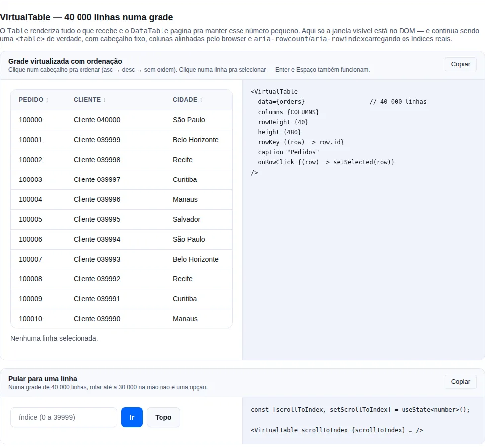
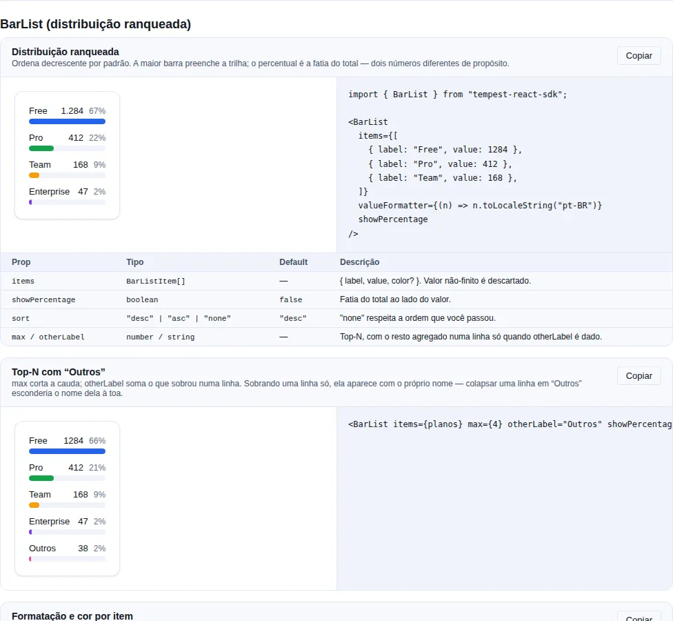
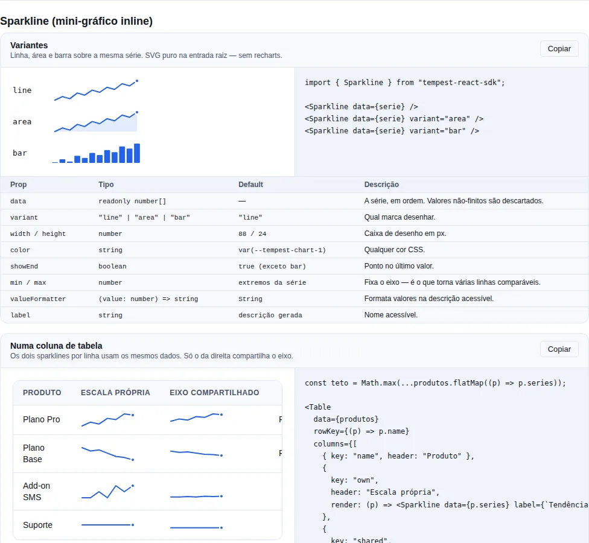

# Dados

Componentes de **dados** apresentam coleções — várias entidades do mesmo tipo — de forma legível e navegável. A escolha depende de _quantos_ itens e de _como_ o usuário os percorre: comparar campos lado a lado (`Table`), rolar milhares de linhas sem travar (`VirtualList`), expandir/colapsar seções de conteúdo (`Accordion`) ou seguir uma sequência de eventos no tempo (`Timeline`).

Use esta página quando precisa **listar/comparar** registros. Para um único registro use um [`Card`](./identity.md); para entrada de dados, [inputs](./inputs.md).

## `Table<T>`

<!-- gallery:table -->
[](../gallery.md)

*Seção `table` da [gallery](../gallery.md) — rode localmente para interagir.*
<!-- /gallery -->

> **Quando usar**: comparar registros estruturados campo a campo em colunas — pedidos, usuários, transações. Tipada por `T`, com prioridade responsiva por coluna e stack opcional em mobile.

```tsx
import { Badge, Button, Table, formatCurrency, formatDate, type TableColumn } from "tempest-react-sdk";

interface Order {
    id: string;
    customer: string;
    total: number;
    created_at: string;
    status: "paid" | "pending" | "failed";
}

const VARIANT = { paid: "success", pending: "warning", failed: "danger" } as const;

export function Orders({
    orders,
    edit,
    navigate,
}: {
    orders: Order[];
    edit: (id: string) => void;
    navigate: (to: string) => void;
}) {
    const columns: TableColumn<Order>[] = [
        { key: "id", header: "ID", align: "right", priority: "always" },
        { key: "customer", header: "Cliente", priority: "always" },
        {
            key: "total",
            header: "Total",
            align: "right",
            render: (row) => formatCurrency(row.total),
            priority: "always",
        },
        {
            key: "created_at",
            header: "Data",
            render: (row) => formatDate(row.created_at),
            priority: "tablet",
        },
        {
            key: "status",
            header: "Status",
            render: (row) => <Badge variant={VARIANT[row.status]}>{row.status}</Badge>,
            priority: "desktop",
        },
        {
            key: "actions",
            header: "",
            render: (row) => (
                <Button size="sm" onClick={() => edit(row.id)}>
                    Editar
                </Button>
            ),
            priority: "desktop",
        },
    ];

    return (
        <Table
            columns={columns}
            data={orders}
            rowKey={(row) => row.id}
            onRowClick={(row) => navigate(`/orders/${row.id}`)}
            stackOnMobile
            emptyMessage="Nenhum pedido encontrado."
        />
    );
}
```

| Prop            | Tipo                                           | Default                         |
| --------------- | ---------------------------------------------- | ------------------------------- |
| `columns`       | `TableColumn<T>[]`                             | —                               |
| `data`          | `T[]`                                          | —                               |
| `rowKey`        | `(row: T, index: number) => string \| number`  | —                               |
| `onRowClick`    | `(row: T) => void`                             | —                               |
| `emptyMessage`  | `ReactNode` (exibido quando `data` está vazio) | `"Nenhum registro encontrado."` |
| `stackOnMobile` | `boolean` (rows viram cards label/value < md)  | `false`                         |

`TableColumn<T>`:

| Campo       | Tipo                                          | Notas                                                      |
| ----------- | --------------------------------------------- | ---------------------------------------------------------- |
| `key`       | `string`                                      | Identificador + key padrão (lê `row[key]`)                 |
| `header`    | `ReactNode`                                   | Cabeçalho da coluna; vira `data-label` no modo stack       |
| `render`    | `(row: T, index: number) => ReactNode`        | Default = `row[key]`                                       |
| `align`     | `"left" \| "right" \| "center"`               | Default `"left"`                                           |
| `priority`  | `"always" \| "tablet" \| "desktop"`           | `tablet`: escondida em < md. `desktop`: escondida em < lg. |
| `width`     | `string \| number`                            | CSS width (`120px`, `20%`, `auto`)                         |
| `className` | `string`                                      | Classe extra aplicada às células daquela coluna            |

!!! warning "Não existe prop `loading`"
    A `Table` não renderiza skeleton rows por conta própria. Para um estado de carregamento, renderize seu próprio skeleton condicionalmente _antes_ da tabela, ou passe linhas placeholder em `data`. O `emptyMessage` cobre apenas o caso "consulta válida, zero resultados".

**Responsive**:

- `priority="tablet"` → colunas escondidas em viewport `< md` (768px).
- `priority="desktop"` → escondidas em `< lg` (1024px).
- `stackOnMobile` → no `< sm` (640px), cada row vira um card label/value.

## `VirtualList`

<!-- gallery:advanced -->
[](../gallery.md)

*Seção `advanced` da [gallery](../gallery.md) — rode localmente para interagir.*
<!-- /gallery -->

> **Quando usar**: rolar listas muito longas (500+ itens) de linhas com **altura fixa** sem inundar o DOM — chats, logs, feeds infinitos.

Renderiza apenas a janela visível + um pequeno buffer de overscan. Cada linha precisa de altura fixa (`itemHeight`); o container precisa de uma altura (`height`).

```tsx
import { VirtualList } from "tempest-react-sdk";

interface Message {
    id: string;
    body: string;
}

export function Historico({ messages }: { messages: Message[] }) {
    return (
        <VirtualList
            items={messages}
            itemHeight={64}
            height={480}
            overscan={5}
            getKey={(message) => message.id}
            renderItem={(message) => <p>{message.body}</p>}
        />
    );
}
```

| Prop         | Tipo                                           | Default |
| ------------ | ---------------------------------------------- | ------- |
| `items`      | `T[]`                                          | —       |
| `itemHeight` | `number` (altura fixa de cada linha, px)       | —       |
| `height`     | `number \| string` (altura do container)       | —       |
| `renderItem` | `(item: T, index: number) => ReactNode`        | —       |
| `overscan`   | `number` (itens acima/abaixo da viewport)      | `4`     |
| `getKey`     | `(item: T, index: number) => string \| number` | `index` |

!!! warning "Altura fixa obrigatória"
    O `VirtualList` assume `itemHeight` constante para calcular a janela. Para linhas de altura variável use `@tanstack/react-virtual` ou `react-window` — resolvem o caso geral ao custo de mais setup.

!!! note "Busca nativa (Ctrl+F) só acha o visível"
    Itens fora da viewport não estão no DOM, então o `Ctrl+F` do navegador não os encontra. Abaixo de ~500 itens, prefira renderização normal: o ganho de perf é negligível e você mantém a busca nativa.

## `VirtualTable<T>`

<!-- gallery:virtual-table -->
[](../gallery.md)

*Seção `virtual-table` da [gallery](../gallery.md) — rode localmente para interagir.*
<!-- /gallery -->

> **Quando usar**: uma tabela de **milhares de linhas** numa única grade rolável — extrato, log de auditoria, exportação bruta. O `Table` renderiza tudo o que recebe e o `DataTable` pagina pra manter esse número pequeno; nenhum dos dois responde "me mostre as 40 000 linhas de uma vez".

Renderiza só a janela visível, como o `VirtualList`, mas continua sendo uma `<table>` de verdade: colunas alinhadas pelo browser, cabeçalho fixo, semântica de grade pra leitor de tela.

```tsx
import { VirtualTable } from "tempest-react-sdk";

interface Row {
    id: number;
    name: string;
    total: string;
}

export function Grande({ rows, open }: { rows: Row[]; open: (id: number) => void }) {
    return (
        <VirtualTable
            data={rows}
            columns={[
                { key: "id", header: "#", width: 80, sortable: true },
                { key: "name", header: "Nome", width: 240, sortable: true },
                { key: "total", header: "Total", width: 120, align: "right", sortable: true },
            ]}
            rowHeight={40}
            height={480}
            rowKey={(row) => row.id}
            onRowClick={(row) => open(row.id)}
        />
    );
}
```

| Prop            | Tipo                                            | Default                            |
| --------------- | ----------------------------------------------- | ---------------------------------- |
| `data`          | `T[]`                                           | —                                  |
| `columns`       | `VirtualTableColumn<T>[]`                       | —                                  |
| `rowHeight`     | `number` (px, **uniforme**)                     | —                                  |
| `height`        | `number \| string` (altura do viewport)         | —                                  |
| `overscan`      | `number`                                        | `4`                                |
| `rowKey`        | `(row: T, index: number) => string \| number`   | `index`                            |
| `initialSort`   | `{ key: keyof T; direction: "asc" \| "desc" }`  | —                                  |
| `onRowClick`    | `(row: T, index: number) => void`               | —                                  |
| `scrollToIndex` | `number`                                        | —                                  |
| `caption`       | `ReactNode` (nome acessível, oculto visualmente) | —                                  |
| `emptyMessage`  | `ReactNode`                                     | `"Nenhum registro encontrado."`    |

Coluna: `{ key, header, render?, sortable?, align?, width? }`.

!!! info "Por que continua uma `<table>`"
    A janela é feita com **duas linhas espaçadoras** — uma acima da fatia visível, outra abaixo — em vez de posicionar linhas com `position: absolute`. Absoluto colapsaria o layout de tabela: cada largura de coluna teria que ser calculada à mão, e o elemento deixaria de ser uma tabela pra tecnologia assistiva. Com espaçadoras, o browser continua fazendo o layout das colunas e o leitor de tela continua anunciando uma grade.

!!! tip "Índice real, não o da janela"
    Como só uma fatia está no DOM, `aria-rowcount` na tabela e `aria-rowindex` em cada linha carregam os números **reais**. Sem isso o leitor de tela anuncia "linha 3 de 20" enquanto o usuário está na linha 5003 de 40 000 — é o detalhe que quase toda tabela virtualizada erra.

!!! warning "`rowHeight` uniforme, e igual ao que o CSS produz"
    É o que mapeia offset de rolagem pra índice de linha. Se o CSS renderizar uma altura diferente da declarada, a janela sai deslocada. Para altura variável use `@tanstack/react-virtual`.

!!! note "Defina `width` em toda coluna"
    Linhas entram e saem do DOM durante a rolagem, então deixar o browser dimensionar as colunas pelo que está renderizado agora faz elas pularem no meio do scroll. O componente usa `table-layout: fixed` justamente pra isso funcionar.

### `VirtualTable` ou `DataTable`?

| Precisa de…                                     | Use            |
| ----------------------------------------------- | -------------- |
| Busca + paginação, dezenas a centenas de linhas | `DataTable`    |
| Uma grade rolável de milhares de linhas         | `VirtualTable` |
| Controle total do markup, poucas linhas         | `Table`        |

Os dois ordenam com o mesmo comparador (`compareValues`), então "ordenado" quer dizer a mesma coisa nos dois — número numericamente, data por timestamp, string com `localeCompare` e `numeric: true`.

## `DataTable<T>` — edição inline

<!-- gallery:data-table -->
[](../gallery.md)

*Seção `data-table` da [gallery](../gallery.md) — rode localmente para interagir.*
<!-- /gallery -->

> **Quando usar**: tela de admin. Você já lista os registros com `DataTable`; agora
> alguém precisa corrigir um nome sem abrir um modal por linha.

Marque a coluna com `editable` e dê um `onCellChange` à tabela. Sem as duas coisas
nada muda — a edição é estritamente opt-in, e um `DataTable` sem coluna editável
renderiza exatamente o que renderizava antes.

```tsx
import { DataTable, type DataTableColumn } from "tempest-react-sdk";
import { api } from "@/lib/api";

interface Colaborador {
  id: number;
  nome: string;
  email: string;
  salario: number;
}

const columns: DataTableColumn<Colaborador>[] = [
  {
    key: "nome",
    header: "Nome",
    editable: true,
    validate: (value) => (String(value).trim().length < 3 ? "Mínimo de 3 letras." : null),
  },
  {
    key: "salario",
    header: "Salário",
    align: "right",
    editable: true,
    editorType: "number",
    validate: (value) => (Number(value) <= 0 ? "Precisa ser positivo." : null),
  },
  { key: "email", header: "E-mail" },
];

export function Equipe({ pessoas }: { pessoas: Colaborador[] }) {
  return (
    <DataTable
      data={pessoas}
      columns={columns}
      rowKey={(row) => row.id}
      onCellChange={({ row, key, value }) =>
        api.patch(`/api/colaboradores/${row.id}`, { body: { [key]: value } })
      }
    />
  );
}
```

Pedaço por pedaço:

- **`editable: true`** transforma a célula num botão com o valor dentro. Clicar (ou
  `Enter`) abre um `<input>`.
- **`editorType`** é o `type` do input (`"text"` por padrão; `"number"`, `"date"`,
  `"email"`, `"tel"`, `"url"`).
- **`validate`** devolve mensagem pra recusar, ou `null` pra aceitar.
- **`onCellChange`** persiste. Devolver uma promessa é o que liga o comportamento
  otimista.

### Teclado

| Tecla | O que faz |
| --- | --- |
| `Enter` | Confirma e fecha; o foco volta pro botão da célula |
| `Escape` | Descarta o rascunho e fecha |
| `Tab` | Confirma e abre a **próxima** célula editável (linha a linha) |
| `Shift+Tab` | Confirma e abre a anterior |
| clique fora | Confirma — perder o que foi digitado é o bug que os usuários reportam como "a tabela comeu minha edição" |

`Tab` é interceptado de propósito: a ordem natural levaria pro botão da linha
seguinte, e numa tabela em edição andar de célula em célula é o que se espera.

### Otimista, com rollback **visível**

Uma edição aceita aparece na hora e o `onCellChange` roda em segundo plano
(`aria-busy` no botão enquanto isso). Se a promessa rejeitar, a célula volta ao valor
antigo **e** mostra o motivo num `role="alert"` amarrado a ela por `aria-describedby`.

```tsx
onCellChange={async ({ row, key, value }) => {
  const res = await fetch(`/api/colaboradores/${row.id}`, { /* … */ });
  if (!res.ok) throw new Error("Este e-mail já está em uso.");
}}
```

A mensagem do `Error` que você lançar é a que aparece na célula. Sem mensagem, entra o
texto padrão (`editLabels.saveFailed`).

!!! danger "Reverter em silêncio é pior do que não ser otimista"
    A pessoa viu a edição aparecer e não tem motivo nenhum pra desconfiar. Se o
    servidor recusou e a célula só voltar ao valor antigo sem dizer nada, ela vai
    embora achando que salvou. É por isso que o erro fica na célula em vez de virar um
    toast que desaparece.

### Acessibilidade

- Fechada, a célula é um `<button>` cujo nome sai do **próprio conteúdo**: um
  `Editar {coluna}:` invisível na frente do que a coluna renderizou. Um `aria-label`
  montado com o valor cru leria "850000" numa célula que mostra `R$ 8.500,00` — isso
  reprova o WCAG 2.5.3 (Label in Name) e deixa controle por voz sem como chamar a
  célula pelo que ela diz. Um `<td>` com `onClick` seria invisível pro teclado e sem
  papel pro leitor de tela.
- Aberta, o `<input>` tem `aria-label` `{coluna}, linha {n}`.
- Erro de validação marca `aria-invalid` e liga a mensagem por `aria-describedby`.
- Um save bem-sucedido é anunciado por [`useAnnounce`](../hooks.md#falar-com-o-leitor-de-tela-useannounce)
  (`"{coluna} salvo"`), porque é o único evento aqui que não tem representação na tela.
  A falha **não** é anunciada duas vezes: o `role="alert"` da célula já faz isso.
- Em ponteiro grosso (toque), a área de toque do botão cresce até cobrir o `<td>`
  inteiro — 44px sem invadir a linha vizinha, que um hit-slop simétrico invadiria.

### Props de edição

| Prop | Tipo | Onde |
| --- | --- | --- |
| `editable` | `boolean` | coluna |
| `editorType` | `"text" \| "number" \| "date" \| "email" \| "tel" \| "url"` | coluna |
| `formatEdit` | `(row: T) => string` | coluna — texto com que o editor abre |
| `parse` | `(raw: string, row: T) => unknown` | coluna — string → valor guardado |
| `validate` | `(value: unknown, row: T) => string \| null` | coluna |
| `onCellChange` | `(change: DataTableCellChange<T>) => void \| Promise<void>` | tabela |
| `editLabels` | `Partial<DataTableEditLabels>` | tabela — a cópia PT-BR |

`DataTableCellChange<T>` traz `{ row, key, value, previous, rowIndex }`, com `rowIndex`
no **dataset completo**, não na página.

!!! tip "Coluna com `render` continua funcionando"
    Uma coluna que renderiza `<Money cents={row.salario} />` recebe a linha com o valor
    otimista já aplicado, então o número novo aparece formatado do jeito certo enquanto
    o save está em voo.

## `DataTable<T>` — paginação no servidor

> **Quando usar**: a listagem normal de admin. O backend pagina, filtra e ordena; o
> navegador recebe uma página por vez e não tem como responder sozinho "quantas
> linhas existem" nem "qual é a primeira em ordem alfabética".

Por padrão o `DataTable` recebe o **dataset inteiro** e faz tudo em memória. Passe
`totalItems` e ele troca de modo: `data` passa a ser a página atual, a contagem de
páginas vem desse número, e ordenação e busca são delegadas a você.

```tsx
import { useState } from "react";
import {
  DataTable,
  usePaginatedQuery,
  type DataTableColumn,
  type DataTableSort,
} from "tempest-react-sdk";

type Pessoa = { id: number; nome: string; cargo: string };

const COLUNAS: DataTableColumn<Pessoa>[] = [
  { key: "nome", header: "Nome", sortable: true },
  { key: "cargo", header: "Cargo", sortable: true },
];

export function Pessoas() {
  const [sort, setSort] = useState<DataTableSort<Pessoa> | null>(null);
  const [termo, setTermo] = useState("");

  const { items, total, pageNumber, setPage, isFetching } = usePaginatedQuery<Pessoa>({
    queryKey: ["pessoas", sort, termo],
    queryFn: ({ page, size }) =>
      fetch(`/api/pessoas?page=${page}&size=${size}&q=${termo}`).then((r) => r.json()),
    pageSize: 20,
  });

  return (
    <DataTable
      data={items}
      columns={COLUNAS}
      rowKey={(row) => row.id}
      pageSize={20}
      totalItems={total}
      page={pageNumber}
      onPageChange={setPage}
      onSortChange={(next) => {
        setSort(next);
        setPage(1);
      }}
      searchable
      onSearchChange={(next) => {
        setTermo(next);
        setPage(1);
      }}
      loading={isFetching}
    />
  );
}
```

!!! check "`usePaginatedQuery` já é a outra metade"
    Ele mantém a página, devolve `items`, `total`, `pageNumber` e `setPage` — exatamente as quatro props que o modo servidor pede. Não precisa de `useState` para a página; o `useState` que sobra é o da ordenação e o do termo, porque eles fazem parte da **query key**.

| Prop | Tipo | O que faz |
| --- | --- | --- |
| `totalItems` | `number` | Liga o modo servidor e manda na contagem de páginas. |
| `page` | `number` | Página controlada, 1-based. |
| `onPageChange` | `(page: number) => void` | Próxima página pedida pelo paginador. |
| `manualSort` | `boolean` | Delega a ordenação. Implícito com `totalItems`. |
| `onSortChange` | `(sort: DataTableSort<T> \| null) => void` | `asc` → `desc` → `null`. |
| `manualSearch` | `boolean` | Delega a busca. Implícito com `totalItems`. |
| `onSearchChange` | `(term: string) => void` | Termo digitado; debounce é seu. |
| `loading` | `boolean` | Requisição em voo. |

!!! check "O compilador agora recusa a combinação inválida"
    As props são uma **união** das formas que funcionam, então três erros que antes
    compilavam viraram erro de build no seu call site:

    | Você escreveu | Por que não compila |
    | --- | --- |
    | `totalItems` sem `page`/`onPageChange` | O paginador andaria a página interna enquanto `data` segue mostrando a página 1 |
    | `page` sem `onPageChange` | Página controlada sem ninguém para trocá-la |
    | `manualSort` sem `onSortChange` | A seta do header gira e mais nada acontece |
    | `manualSearch` sem `onSearchChange` | A caixa de busca não filtra nada e não avisa ninguém |

    Até a v0.44.0 cada prop era opcional por conta própria, então isso só aparecia
    como `console.warn` em dev, no browser, com o componente montado — o `tsc` do
    seu CI nunca via. Os avisos de runtime continuam, para os callers que o tipo não
    alcança (JavaScript puro, ou props chegando por spread tipado `any`).

    Os tipos das metades são exportados quando você precisa deles:
    `DataTableBaseProps`, `DataTablePagingProps`, `DataTableSortProps` e
    `DataTableSearchProps`. `Partial` de união não funciona — para variar só a
    metade compartilhada num helper de teste, use `Partial<DataTableBaseProps<T>>`.

!!! warning "Um caso o tipo **não** pega: busca implícita no modo servidor"
    `totalItems` já **implica** `manualSearch`. Então `searchable` sem
    `onSearchChange` numa tabela em modo servidor é a mesma caixa inerte — sem que
    ninguém escreva `manualSearch`, e portanto sem o eixo de busca ter como ver.

    Fechar isso exigiria o eixo de busca ler o eixo de paginação, cruzando duas
    uniões de três membros em nove e transformando qualquer erro num paredão de
    formas candidatas. Esse caso continua sendo **aviso de dev em runtime** — é o
    único dos quatro em que runtime é de fato a checagem mais barata.

!!! danger "Busca e ordenação **precisam** ir junto — filtrar a página mente"
    `searchable` sozinho filtra `data` em memória, e no modo servidor `data` é só a
    página atual. O usuário digita, some tudo que não está na página 3 e a tabela
    parece dizer "não existe". Por isso `totalItems` já implica `manualSearch` e
    `manualSort`: ordenar cinco linhas alegando ter ordenado 23 é o mesmo tipo de
    mentira.

!!! tip "`manualSort` e `manualSearch` também servem sem paginação de servidor"
    Lista inteira na memória mas ordenada pelo backend (por relevância, por um
    campo calculado) é um caso legítimo: passe `manualSort` sem `totalItems`.

!!! check "Carregando e vazio são telas diferentes"
    Com linhas na tela, `loading` esmaece e marca `aria-busy` — as linhas antigas
    ficam, então a paginação não salta sob o cursor entre páginas. Sem linhas ainda,
    desenha placeholders na altura real em vez do `emptyMessage`, porque "estou
    buscando" e "não há nada" não são a mesma frase.

!!! warning "Combinação incompleta avisa em dev"
    `totalItems` sem `page` controlada, `page` sem `onPageChange`, ordenação
    delegada sem `onSortChange` — cada um renderiza uma tela que parece funcionar e
    não funciona (o cabeçalho ordena e nada se move). Nenhum é erro de tipo, então
    o aviso sai no `console` em desenvolvimento.

!!! info "O modo cliente não mudou uma linha"
    Sem `totalItems`, `manualSort`, `manualSearch` ou `loading`, o markup e o
    comportamento são exatamente os de antes — inclusive o clamp de página quando o
    dataset encolhe, que no modo servidor é desligado de propósito (a página é sua,
    e um clamp contra um `totalItems` que ainda não chegou mandaria o usuário pra
    uma página que ele não pediu, no meio do fetch).

## `BarList`

<!-- gallery:bar-list -->
[](../gallery.md)

*Seção `bar-list` da [gallery](../gallery.md) — rode localmente para interagir.*
<!-- /gallery -->

> **Quando usar**: distribuição ranqueada — usuários por plano, erros por endpoint,
> vendas por categoria. É o gráfico mais comum de painel, e o único que costuma ser
> reescrito quatro vezes no mesmo dashboard, cada vez com seu CSS e seu `.sort()`.

Rótulo, barra proporcional, valor e (opcionalmente) a fatia do total. Sem recharts —
é `div` com largura percentual, igual ao `Sparkline`.

```tsx
import { BarList } from "tempest-react-sdk";

<BarList
  items={[
    { label: "Free", value: 128 },
    { label: "Pro", value: 32 },
    { label: "Team", value: 16 },
  ]}
  valueFormatter={(n) => `${n} ativos`}
  showPercentage
  max={5}
  otherLabel="Outros"
/>;
```

| Prop | Tipo | Default | O que faz |
| --- | --- | --- | --- |
| `items` | `BarListItem[]` | — | `{ label, value, color? }`. Valor não-finito é descartado. |
| `valueFormatter` | `(value: number) => string` | — | Como o número aparece. |
| `showPercentage` | `boolean` | `false` | Mostra a fatia do total ao lado do valor. |
| `sort` | `"desc" \| "asc" \| "none"` | `"desc"` | Ordenação — `"none"` respeita a ordem dada. |
| `max` | `number` | — | Mantém no máximo N linhas. |
| `otherLabel` | `string` | — | Agrega o que `max` cortou numa linha só. |

!!! info "Largura e percentual são números **diferentes**, de propósito"
    A largura é relativa à **maior** linha, então a maior barra preenche a trilha. O
    percentual é a fatia do **total**. Escalar a largura pelo total deixa toda barra
    curta numa lista de muitos valores pequenos — o gráfico para de ser legível
    exatamente quando tem mais linhas.

!!! check "É lista, não figura"
    `<ul>`/`<li>` com o valor escrito como **texto**, e a barra `aria-hidden` atrás.
    O leitor de tela lê "Free, 128, 62%" porque isso está escrito, não porque um
    `aria-label` narra um desenho.

!!! danger "O rótulo nunca fica em cima da barra"
    Texto sobre preenchimento tingido precisa ser reverificado contra aquele
    preenchimento — e a rampa `--tempest-chart-*` é de **marca** (3:1), reprovando
    como texto. O SDK já foi pego por isso duas vezes, e as duas só apareceram em
    browser real, porque o `axe` em jsdom desliga `color-contrast` sem paint. Este
    layout evita a classe inteira do problema.

!!! warning "Valor negativo não desenha barra, mas continua na lista"
    Barra de largura negativa não existe: a largura vira 0 e o percentual vira 0,
    mas o número aparece. Some da lista seria pior do que aparecer estranho. Pela
    mesma razão o total conta só os valores positivos, senão as fatias não fecham.

!!! tip "Soma zero mostra zero, não `NaN%`"
    O percentual passa por `percentOf`, então painel recém-criado exibe `0%` em vez
    do `NaN%` que `(parte / total) * 100` produziria.

!!! note "`otherLabel` só agrega quando sobra mais de uma linha"
    Colapsar uma única linha em "Outros" esconderia o nome dela à toa — nesse caso
    ela aparece com o próprio nome.

!!! tip "A paleta respeita `--tempest-chart-count`"
    A cor de cada linha vem de `useChartColors`, o mesmo resolvedor que todo chart
    do SDK usa, então um tema que declara **menos** de oito séries cicla dentro da
    própria paleta. Um tema de marca com 6 cores repete a 1ª e a 2ª nas linhas 7 e 8,
    em vez de cair no azul e no teal default do SDK.

    Até a v0.44.0 a cor era lida por `var(--tempest-chart-N)` com `N = index % 8`.
    O CSS não consegue usar `--tempest-chart-count` como módulo, então o `8` era
    fixo e a marca perdia as duas últimas linhas. `palette.ts` não importa nada,
    então isso não puxa biblioteca de gráfico pra fatia.

    `color` por item continua ganhando de tudo.

!!! tip "A aritmética é exportada: `buildBarListRows`"
    `buildBarListRows({ items, sort, max, otherLabel })` devolve as linhas já
    ordenadas, cortadas e medidas (`percentage`, `width`, `index`) sem renderizar
    nada. Serve pra quem quer o mesmo cálculo com outro desenho — uma legenda, uma
    tabela, um export. Só `items` é obrigatório; `sort` default é `"desc"`.

    ```typescript
    const rows = buildBarListRows({ items: vendas, max: 5, otherLabel: "Outros" });
    ```

## `ListTile`

<!-- gallery:material -->
[](../gallery.md)

*Seção `material` da [gallery](../gallery.md) — rode localmente para interagir.*
<!-- /gallery -->

> **Quando usar**: a linha canônica de lista do Material — um item com slot à esquerda (ícone/avatar), título com subtítulo opcional e slot à direita (ícone, switch, meta). Ideal para listas de configurações, contatos ou menus.

Renderiza como `<div>` estático por padrão; ao receber `onClick` vira um `<button>` de largura total, acessível por teclado.

```tsx
import { useState } from "react";
import { ListTile, Switch } from "tempest-react-sdk";
import { Bell } from "lucide-react";

function NotificationsRow() {
  const [enabled, setEnabled] = useState(true);

  return (
    <ListTile
      leading={<Bell size={20} />}
      title="Notificações"
      subtitle="Receber alertas por push"
      trailing={
        <Switch checked={enabled} onChange={(e) => setEnabled(e.target.checked)} />
      }
    />
  );
}
```

| Prop       | Tipo                                  | Default |
| ---------- | ------------------------------------- | ------- |
| `title`    | `ReactNode`                           | —       |
| `leading`  | `ReactNode` (slot esquerdo)           | —       |
| `subtitle` | `ReactNode` (linha secundária)        | —       |
| `trailing` | `ReactNode` (slot direito)            | —       |
| `onClick`  | `() => void` (torna a tile um botão)  | —       |
| `selected` | `boolean` (destaca a linha ativa)     | `false` |
| `disabled` | `boolean` (esmaecida, não-interativa) | `false` |

!!! note "Botão só quando há `onClick`"
    Sem `onClick`, a `ListTile` é um `<div>` puramente visual. Com `onClick`, ela vira `<button>` com `aria-pressed` (quando `selected`) e respeita `disabled` — não envolva em outro elemento clicável.

## `Accordion`

<!-- gallery:disclosure -->
[](../gallery.md)

*Seção `disclosure` da [gallery](../gallery.md) — rode localmente para interagir.*
<!-- /gallery -->

> **Quando usar**: condensar conteúdo seccionável que o usuário expande sob demanda — FAQs, formulários longos em etapas, painéis de configurações.

Modo single (default) ou `multiple`. Controlado via `value` + `onChange`, ou não-controlado via `defaultValue`.

```tsx
import { useState } from "react";
import { Accordion } from "tempest-react-sdk";

const FAQ = [
    { id: "1", title: "Como cancelo minha assinatura?", children: <p>Pelo painel, em Conta → Assinatura.</p> },
    { id: "2", title: "Quais formas de pagamento?", children: <p>Cartão, Pix e boleto.</p> },
];

export function Perguntas() {
    const [openIds, setOpenIds] = useState<string[]>([]);

    return (
        <>
            <Accordion items={FAQ} />
            <Accordion
                multiple
                value={openIds}
                onChange={(value) => setOpenIds(value as string[])}
                items={FAQ}
            />
        </>
    );
}
```

| Prop           | Tipo                                 | Default |
| -------------- | ------------------------------------ | ------- |
| `items`        | `AccordionItem[]`                    | —       |
| `multiple`     | `boolean` (permite vários abertos)   | `false` |
| `value`        | `string[]` (ids abertos, controlled) | —       |
| `defaultValue` | `string[]` (ids abertos iniciais)    | `[]`    |
| `onChange`     | `(openIds: string[]) => void`        | —       |

`AccordionItem = { id, title, children, disabled? }`.

!!! note "Acessibilidade já incluída"
    Os cabeçalhos são `<button aria-expanded>` e o conteúdo recebe `aria-hidden` quando fechado. As setas ↑↓ trocam o item focado; Home/End pulam para o primeiro/último.

## `Timeline`

<!-- gallery:feedback-extra -->
[](../gallery.md)

*Seção `feedback-extra` da [gallery](../gallery.md) — rode localmente para interagir.*
<!-- /gallery -->

> **Quando usar**: mostrar uma sequência de eventos no tempo — rastreio de pedido, log de auditoria, feed de atividade. Cada entrada tem marker colorido, título, descrição e meta opcionais.

Feed vertical com markers coloridos. Renderiza como `<ol>` semântica (cada item é `<li>`).

```tsx
import { Timeline } from "tempest-react-sdk";

export function Rastreio() {
    return (
        <Timeline
            items={[
                { id: "1", title: "Pedido criado", meta: "10:24", marker: "primary" },
                { id: "2", title: "Pagamento aprovado", meta: "10:25", marker: "success" },
                {
                    id: "3",
                    title: "Saiu pra entrega",
                    description: "Motorista: João",
                    meta: "11:00",
                    marker: "warning",
                },
                { id: "4", title: "Entregue", meta: "12:30", marker: "success" },
            ]}
        />
    );
}
```

| Prop        | Tipo                            | Default |
| ----------- | ------------------------------- | ------- |
| `items`     | `TimelineItem[]`                | —       |
| `connector` | `boolean` (linha entre markers) | `true`  |

`TimelineItem = { id, title, description?, meta?, icon?, marker?: "primary" \| "success" \| "warning" \| "danger" \| "neutral" }`.

## `TreeView`

<!-- gallery:hierarchy-flow -->
[](../gallery.md)

*Seção `hierarchy-flow` da [gallery](../gallery.md) — rode localmente para interagir.*
<!-- /gallery -->

> **Quando usar**: dados **hierárquicos** — árvore de categorias, permissões por módulo, pastas, organograma. Quando o dado é uma lista plana, `Table` ou `ListTile` servem melhor.

Implementa `role="tree"` com **roving tabindex**: uma única linha é tabulável e as setas movem o foco dentro do widget. É isso que evita uma árvore de 500 nós adicionar 500 paradas na ordem de tabulação da página.

```tsx
import { TreeView, type TreeNode } from "tempest-react-sdk";

const permissoes: TreeNode[] = [
  {
    id: "vendas",
    label: "Vendas",
    children: [
      { id: "vendas.ler", label: "Visualizar" },
      { id: "vendas.editar", label: "Editar" },
      { id: "vendas.excluir", label: "Excluir", disabled: true },
    ],
  },
  { id: "config", label: "Configurações", children: [] },
  { id: "sobre", label: "Sobre" },
];

export function PermissoesDoPapel() {
  const [selecionado, setSelecionado] = useState<string | null>(null);

  return (
    <TreeView
      label="Permissões"
      nodes={permissoes}
      defaultExpandedIds={["vendas"]}
      selectedId={selecionado}
      onSelect={(node) => setSelecionado(node.id)}
    />
  );
}
```

| Prop                 | Tipo                        | Default | O que faz                                                          |
| -------------------- | --------------------------- | ------- | ------------------------------------------------------------------ |
| `nodes`              | `TreeNode[]`                | —       | Nós raiz.                                                          |
| `expandedIds`        | `string[]`                  | —       | Expansão controlada.                                               |
| `defaultExpandedIds` | `string[]`                  | `[]`    | Expansão inicial (não controlada).                                 |
| `onExpandedChange`   | `(ids: string[]) => void`   | —       | Chamado a cada expandir/colapsar.                                  |
| `selectedId`         | `string \| null`            | —       | Seleção controlada.                                                |
| `defaultSelectedId`  | `string \| null`            | `null`  | Seleção inicial.                                                   |
| `onSelect`           | `(node: TreeNode) => void`  | —       | Chamado ao selecionar (clique, `Enter` ou `Espaço`).                |
| `toggleOnSelect`     | `boolean`                   | `true`  | Selecionar um galho também o expande/colapsa.                      |
| `label`              | `string`                    | —       | Nome acessível da árvore.                                          |

`TreeNode = { id, label, children?, icon?, disabled? }`.

**Teclado**: `↓`/`↑` movem · `→` expande (ou desce pro primeiro filho) · `←` colapsa (ou sobe pro pai) · `Home`/`End` primeira/última linha visível · `Enter`/`Espaço` selecionam.

!!! tip "`children: []` é um galho vazio, não uma folha"
    A distinção importa: uma pasta vazia deve mostrar o chevron e anunciar `aria-expanded`. Folha é `children` **ausente**.

!!! note "`toggleOnSelect={false}` quando o galho é uma escolha válida"
    O default (`true`) imita explorador de arquivos: clicar na pasta abre a pasta. Passe `false` quando o galho em si é selecionável — uma categoria que também é destino, por exemplo.

!!! info "O chevron não é um botão"
    Ele é decoração (`aria-hidden`): a linha já carrega `aria-expanded`, então um segundo controle focável ali só adicionaria ruído no leitor de tela, duplicando uma ação que o teclado já tem. Clique nele funciona (com o evento parado, então expande sem selecionar).

## `Sparkline`

<!-- gallery:sparkline -->
[](../gallery.md)

*Seção `sparkline` da [gallery](../gallery.md) — rode localmente para interagir.*
<!-- /gallery -->

> **Quando usar**: mostrar a **forma** de uma série ao lado do número que ela explica — uma célula de tabela, um card de métrica, uma linha de lista. Não é substituto de gráfico: se o leitor precisa ler valores no eixo, use [`LineChart`](../charts.md).

Um sparkline é SVG puro na entrada raiz, **sem recharts**. Uma coluna de tendência numa tabela não deveria obrigar o app a instalar uma biblioteca de gráfico inteira.

```tsx
import { formatCurrency, Sparkline, Table } from "tempest-react-sdk";

const produtos = [
  { nome: "Plano Pro", receita: 48200, serie: [12, 18, 15, 24, 22, 31, 29] },
  { nome: "Plano Base", receita: 19400, serie: [22, 19, 20, 17, 14, 13, 11] },
];

export function TendenciaPorProduto() {
  return (
    <Table
      data={produtos}
      columns={[
        { key: "nome", header: "Produto" },
        {
          key: "serie",
          header: "7 dias",
          render: (linha) => (
            <Sparkline data={linha.serie} label={`Tendência de ${linha.nome}`} />
          ),
        },
        { key: "receita", header: "Receita", render: (l) => formatCurrency(l.receita) },
      ]}
      rowKey={(linha) => linha.nome}
    />
  );
}
```

### Variantes

```tsx
import { Sparkline } from "tempest-react-sdk";

const serie = [4, 6, 5, 9, 12, 10, 14];

export function Variantes() {
    return (
        <>
            <Sparkline data={serie} />
            <Sparkline data={serie} variant="area" />
            <Sparkline data={serie} variant="bar" />
        </>
    );
}
```

| Prop             | Tipo                              | Default                    | O que faz                                                        |
| ---------------- | --------------------------------- | -------------------------- | ---------------------------------------------------------------- |
| `data`           | `readonly number[]`               | —                          | A série, em ordem. Entradas não-finitas são descartadas.          |
| `variant`        | `"line" \| "area" \| "bar"`       | `"line"`                   | Qual marca desenhar.                                              |
| `width`          | `number`                          | `88`                       | Largura de desenho em px.                                         |
| `height`         | `number`                          | `24`                       | Altura de desenho em px.                                          |
| `color`          | `string`                          | `var(--tempest-chart-1)`   | Qualquer cor CSS.                                                 |
| `showEnd`        | `boolean`                         | `true` (exceto em `"bar"`) | Marca o último ponto com um ponto.                                |
| `min` / `max`    | `number`                          | extremos da série          | Fixa o eixo de valor — é o que torna várias linhas comparáveis.   |
| `valueFormatter` | `(value: number) => string`       | `String`                   | Como renderizar um valor na descrição acessível.                  |
| `label`          | `string`                          | descrição gerada           | Nome acessível.                                                   |

### Comparar linhas exige eixo compartilhado

Por padrão cada sparkline se normaliza contra os próprios extremos. Numa coluna de tabela isso é uma armadilha: uma linha que vai de 2 a 4 e outra que vai de 200 a 400 desenham **exatamente a mesma forma**.

```tsx
import { Sparkline } from "tempest-react-sdk";

interface Produto {
    id: string;
    serie: number[];
}

export function MesmaEscala({ produtos }: { produtos: Produto[] }) {
    const teto = Math.max(...produtos.flatMap((produto) => produto.serie));

    return (
        <>
            {produtos.map((produto) => (
                <Sparkline key={produto.id} data={produto.serie} min={0} max={teto} />
            ))}
        </>
    );
}
```

!!! warning "Sem `min`/`max`, a forma é relativa — nunca comparável"
    Passe os dois quando os sparklines aparecem empilhados. É o erro mais comum com esse componente, e ele não gera nenhum aviso: os gráficos ficam bonitos e mentem.

### Acessibilidade

O componente carrega `role="img"` e um `aria-label` que **descreve a série em palavras**: quantidade de pontos, direção, extremos e as pontas.

```text
"7 pontos, subindo. Início 12, fim 29. Mínimo 12, máximo 31."
```

Um sparkline não tem eixo nem legenda para servir de apoio — sem essa frase ele é uma imagem sem nome, e o leitor de tela chega nele e não lê nada. Passe `label` quando o texto ao redor já diz o que está plotado.

!!! tip "A forma é contexto, nunca o único caminho pro valor"
    Sempre coloque o sparkline **ao lado do número** que ele anota. Ele responde "está subindo?", não "quanto?".

!!! info "Séries com buraco não apagam o gráfico"
    Um `NaN` no meio de um atributo `d` anula o path inteiro silenciosamente — o gráfico some sem erro nenhum. Valores não-finitos são filtrados antes de projetar.

!!! note "Série achatada fica centralizada"
    Uma série sem variação é desenhada no meio da caixa, não colada numa borda. É a leitura honesta de "não variou" e evita dividir por um domínio de altura zero.

## Resumo

| Componente    | Use para                                    | Volume típico      |
| ------------- | ------------------------------------------- | ------------------ |
| `Table<T>`    | Comparar registros em colunas               | dezenas a centenas |
| `VirtualList` | Rolar listas longas de altura fixa          | 500+ itens         |
| `VirtualTable<T>` | Grade rolável de linhas em colunas      | milhares de linhas |
| `ListTile`    | Linha de lista (ícone + título + ação)      | qualquer           |
| `Accordion`   | Seções expansíveis sob demanda (FAQ, steps) | poucas seções      |
| `Timeline`    | Sequência de eventos no tempo               | qualquer           |
| `TreeView`    | Hierarquia navegável (categorias, permissões) | dezenas a centenas |
| `Sparkline`   | Forma de uma série ao lado do número que ela explica | 5 a ~100 pontos |

Pontos-chave de acessibilidade:

- `Table` usa `<th scope="col">` (já incluso); `onRowClick` aplica `role="button"` + `tabIndex={0}`.
- `Table` e `VirtualList` ganham **ponto de tabulação próprio enquanto rolam** (`role="group"`/`role="list"` + `tabIndex={0}`), e o perdem quando o conteúdo cabe. Sem isso o contêiner não tem nada focável dentro e quem usa teclado vê a barra de rolagem sem conseguir movê-la. Nomeie com `scrollLabel` (Table) ou `label` (VirtualList) quando a página tiver vários.
- `VirtualList`: itens fora da viewport não são renderizados — `Ctrl+F` só acha o visível.
- `VirtualTable`: continua uma `<table>` real (espaçadoras em vez de posicionamento absoluto), com `aria-rowcount`/`aria-rowindex` carregando os índices reais e não os da janela; cabeçalho ordenável expõe `aria-sort`.
- `Accordion`: ↑↓ trocam o item focado, Home/End pulam pro primeiro/último.
- `Timeline`: ordem semântica via `<ol>`; cada item é `<li>`.
- `Sparkline`: `role="img"` com uma frase descrevendo direção, pontas e extremos — sem eixo nem legenda, é a única leitura possível fora da visão.
- `TreeView`: `role="tree"` + roving tabindex (uma parada de tab só); `aria-level` reporta a profundidade e nós desabilitados são pulados na navegação.

Relacionados: [identity](./identity.md) (`Card flush` para hospedar a `Table`) · [feedback](./feedback.md) (`Badge` dentro de células) · [actions](./actions.md) (botões de linha).
