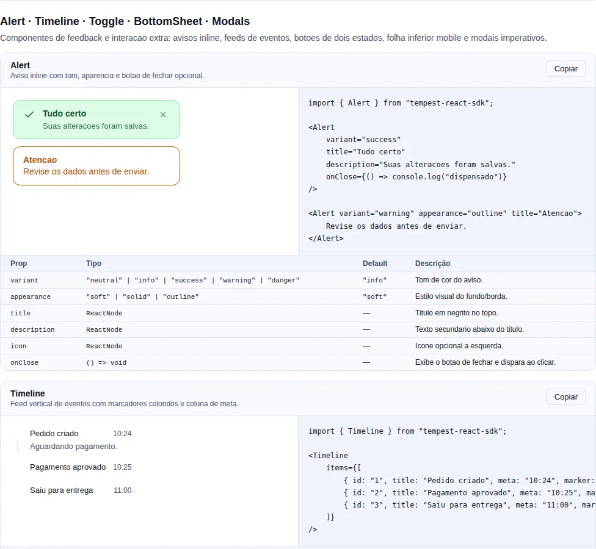
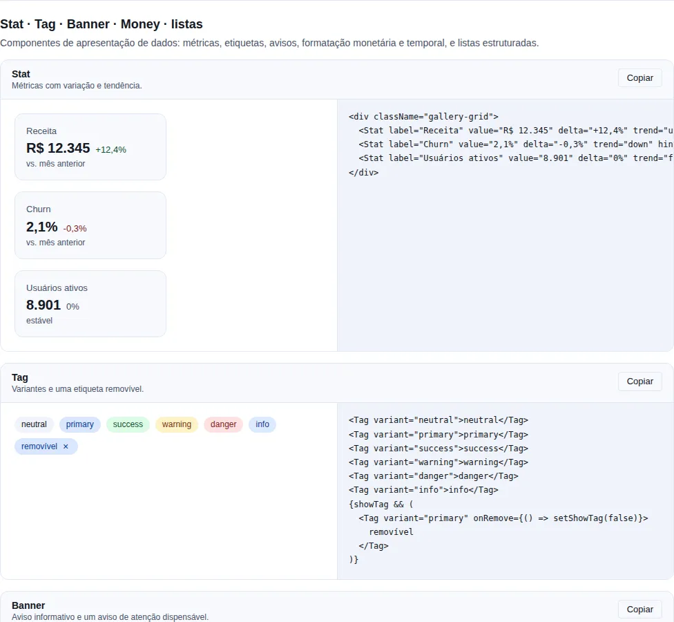
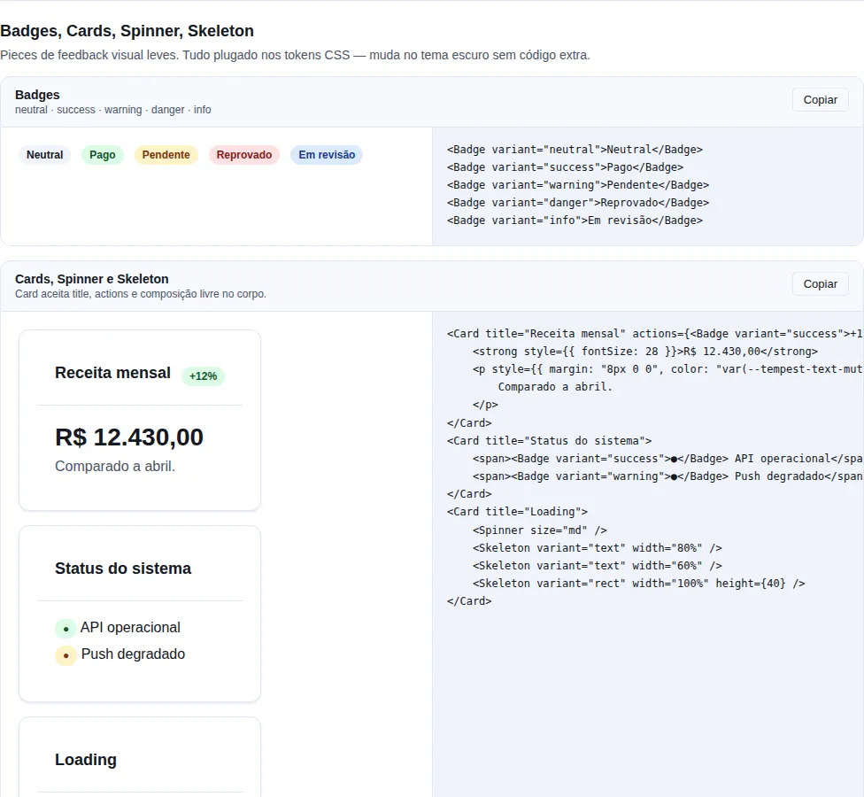
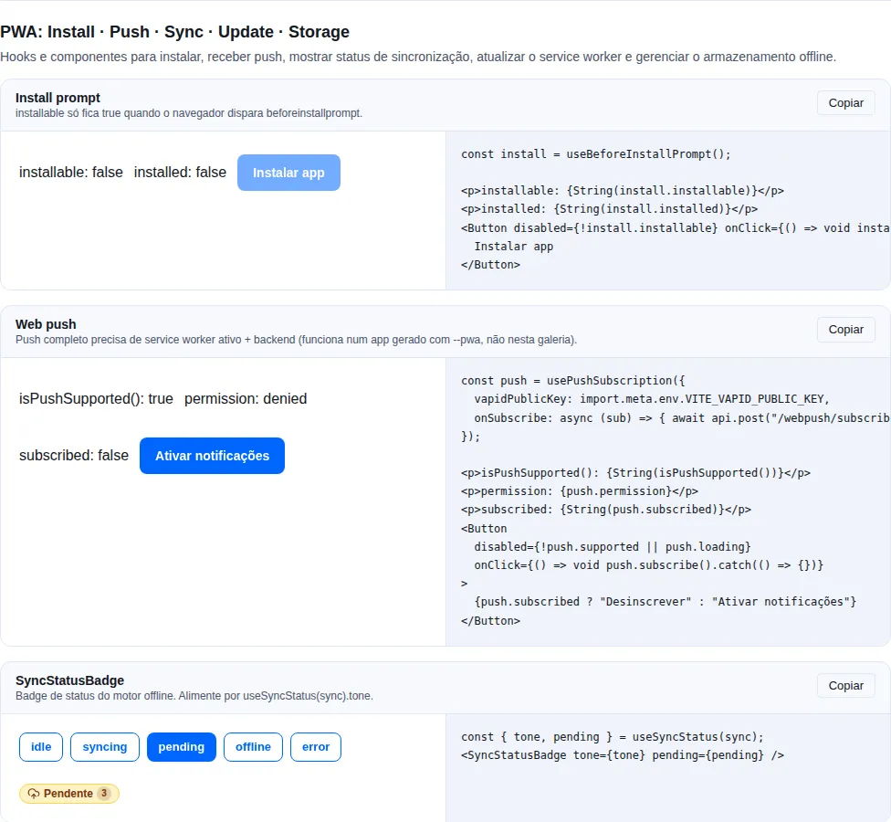

# Status & feedback

Sinalizar estado, sucesso, erro, atividade. Spinners, skeletons, alertas, KPIs.

## O que é esta categoria

Componentes que **comunicam estado** ao usuário — o que aconteceu, o que está acontecendo e o que não tem ali. Agrupam-se por intenção:

- **Mensagens** (sucesso/erro/aviso): `Alert` (inline), `Banner` (topo da página), `Toast` (transiente) — três escopos do mesmo conceito.
- **Rótulos de status**: `Badge` (status fixo), `Tag` (chip removível), `Stat` (KPI).
- **Atividade/carregamento**: `Spinner`, `Progress`, `Skeleton`, `NProgressBar` (barra fixa no topo).
- **Estados vazios/erro de tela**: `EmptyState`, `ErrorState`.

**Quando usar:** sempre que o usuário precisar saber o resultado de uma ação ou o estado de um dado. A regra de ouro: **nunca deixe uma ação assíncrona sem feedback** — mostre `Spinner`/`Skeleton` durante, `Toast`/`Alert` ao terminar.

!!! tip "Alert vs Banner vs Toast — escolha pelo escopo"
    `Alert` é inline e fica até o usuário resolver o contexto. `Banner` é persistente no topo e vale para a página/app inteiro. `Toast` é transiente e some sozinho. Use `Toast` para confirmações rápidas, `Alert` para erros ligados a um campo/seção, `Banner` para avisos globais (manutenção, expiração).

## `Alert`

<!-- gallery:feedback-extra -->
[](../gallery.md)

*Seção `feedback-extra` da [gallery](../gallery.md) — rode localmente para interagir.*
<!-- /gallery -->

**Quando usar:** mensagem ligada a um contexto específico da tela (erro de formulário, resultado de uma operação numa seção). Fica visível até a condição mudar.

Banner inline. Diferente de `Banner` (top-of-page) e `Toast` (transient).

```tsx
import { useState } from "react";
import { Alert } from "tempest-react-sdk";
import { AlertCircle } from "lucide-react";

export function Avisos() {
    const [open, setOpen] = useState(true);

    return (
        <>
            <Alert variant="success" appearance="soft" title="Salvo">
                Suas alterações foram aplicadas com sucesso.
            </Alert>

            {open && (
                <Alert
                    variant="danger"
                    appearance="outline"
                    icon={<AlertCircle size={16} />}
                    onClose={() => setOpen(false)}
                >
                    Falha ao processar pagamento.
                </Alert>
            )}
        </>
    );
}
```

| Prop          | Tipo                                                        | Default  |
| ------------- | ----------------------------------------------------------- | -------- |
| `variant`     | `"neutral" \| "info" \| "success" \| "warning" \| "danger"` | `"info"` |
| `appearance`  | `"soft" \| "solid" \| "outline"`                            | `"soft"` |
| `title`       | `ReactNode`                                                 | —        |
| `icon`        | `ReactNode`                                                 | —        |
| `description` | `ReactNode`                                                 | —        |
| `onClose`     | `() => void` (renderiza o botão de fechar)                  | —        |
| `closeLabel`  | `string`                                                    | —        |

**A11y**: `role="status"` para info/success, `role="alert"` para warning/danger.

## `Banner`

<!-- gallery:data-display -->
[](../gallery.md)

*Seção `data-display` da [gallery](../gallery.md) — rode localmente para interagir.*
<!-- /gallery -->

Persistente, top-of-page. Use para environment indicators, manutenção, expiração.

```tsx
import { useState } from "react";
import { Banner, Button } from "tempest-react-sdk";

export function AvisoDeAssinatura() {
    const [open, setOpen] = useState(true);
    if (!open) return null;

    return (
        <Banner
            variant="warning"
            dismissible
            onDismiss={() => setOpen(false)}
            action={<Button size="sm">Renovar</Button>}
        >
            Sua assinatura expira em 3 dias.
        </Banner>
    );
}
```

Mesmas variants do Alert.

## `Badge`

<!-- gallery:feedback -->
[](../gallery.md)

*Seção `feedback` da [gallery](../gallery.md) — rode localmente para interagir.*
<!-- /gallery -->

**Quando usar:** rótulo de status curto e somente-leitura ao lado de um item (status de pedido, contagem). Para um chip que o usuário remove, use `Tag`.

Status pill — não removível.

```tsx
import { Badge } from "tempest-react-sdk";

export function Selos() {
    return (
        <>
            <Badge>Default</Badge>
            <Badge variant="success">Pago</Badge>
            <Badge variant="danger" appearance="solid">
                Atrasado
            </Badge>
            <Badge variant="warning" appearance="outline" shape="square">
                Pendente
            </Badge>
            <Badge variant="info" dot>
                3
            </Badge>
        </>
    );
}
```

| Prop         | Tipo                                                                     | Default     |
| ------------ | ------------------------------------------------------------------------ | ----------- |
| `variant`    | `"neutral" \| "primary" \| "success" \| "warning" \| "danger" \| "info"` | `"neutral"` |
| `appearance` | `"soft" \| "solid" \| "outline"`                                         | `"soft"`    |
| `shape`      | `"pill" \| "square"`                                                     | `"pill"`    |
| `size`       | `"sm" \| "md" \| "lg"`                                                   | `"md"`      |
| `dot`        | `boolean` (indicador de status + número)                                 | `false`     |

## `Tag`

Chip removível. Use para filter tokens, applied filters, selected entities.

```tsx
import { Tag } from "tempest-react-sdk";

export function Filtros({ removeFilter }: { removeFilter: (key: string) => void }) {
    return (
        <>
            <Tag onRemove={() => removeFilter("sp")} variant="primary">
                São Paulo
            </Tag>
            <Tag size="sm">Em estoque</Tag>
        </>
    );
}
```

| Prop          | Tipo                                                                     | Default     |
| ------------- | ------------------------------------------------------------------------ | ----------- |
| `variant`     | `"neutral" \| "primary" \| "success" \| "warning" \| "danger" \| "info"` | `"neutral"` |
| `size`        | `"sm" \| "md" \| "lg"`                                                   | `"md"`      |
| `onRemove`    | `() => void`                                                             | —           |
| `removeLabel` | `string` (a11y)                                                          | `"Remover"` |

## `Stat`

**Quando usar:** destacar uma métrica única com variação (receita, sessões, NPS) em dashboards. Para vários KPIs lado a lado, combine com `Grid`.

KPI card para dashboards.

```tsx
import { Stat } from "tempest-react-sdk";
import { TrendingUp } from "lucide-react";

export function Metricas() {
    return (
        <>
            <Stat
                label="Receita"
                value="R$ 12.345"
                delta="+12,4%"
                hint="vs. mês anterior"
                icon={<TrendingUp size={16} />}
            />
            <Stat label="Sessões" value="1.2k" delta="-3%" hint="últimos 7 dias" />
            <Stat label="NPS" value="78" delta="0" trend="flat" />
        </>
    );
}
```

| Prop    | Tipo                       | Default                              |
| ------- | -------------------------- | ------------------------------------ |
| `label` | `ReactNode`                | —                                    |
| `value` | `ReactNode`                | —                                    |
| `delta` | `ReactNode`                | —                                    |
| `trend` | `"up" \| "down" \| "flat"` | inferido por `+`/`-` em delta string |
| `hint`  | `ReactNode`                | —                                    |
| `icon`  | `ReactNode`                | —                                    |

## `Progress`

<!-- gallery:advanced -->
[](../gallery.md)

*Seção `advanced` da [gallery](../gallery.md) — rode localmente para interagir.*
<!-- /gallery -->

Barra de progresso.

```tsx
import { Progress } from "tempest-react-sdk";

export function Barras({ uploadProgress }: { uploadProgress: number }) {
    return (
        <>
            <Progress value={uploadProgress} max={100} variant="primary" />
            <Progress value={100} variant="success" />
            <Progress indeterminate variant="primary" />
        </>
    );
}
```

| Prop            | Tipo                                 | Default     |
| --------------- | ------------------------------------ | ----------- |
| `value`         | `number`                             | —           |
| `max`           | `number`                             | `100`       |
| `variant`       | `"primary" \| "success" \| "danger"` | `"primary"` |
| `indeterminate` | `boolean`                            | `false`     |

## `NProgress`

**Quando usar:** barra de carregamento fixa no topo da página para transições que não têm uma posição exata — navegação de rotas, requests em background. Para progresso determinístico de um upload, prefira `Progress`.

Controlador imperativo (`nprogress`) + a barra visual (`<NProgressBar>`). Monte a barra uma vez perto da raiz do app e dirija o controlador de qualquer lugar (transições de rota, interceptors de fetch).

```tsx
import { Button, NProgressBar, nprogress } from "tempest-react-sdk";

async function loadPage(): Promise<void> {
    nprogress.start();
    try {
        await fetch("/api/data");
    } finally {
        nprogress.done();
    }
}

export function Raiz() {
    return (
        <>
            <NProgressBar color="var(--tempest-primary)" height={3} />
            <Button onClick={loadPage}>Carregar</Button>
        </>
    );
}
```

| `nprogress` | Assinatura            | O que faz                                         |
| ----------- | --------------------- | ------------------------------------------------- |
| `start`     | `() => void`          | Mostra a barra e começa a "trickle" até ~0.9.    |
| `done`      | `() => void`          | Completa em `1` e esconde a barra logo depois.   |
| `set`       | `(n: number) => void` | Define o progresso explicitamente (clamp `0..1`). |
| `inc`       | `(amount?: number) => void` | Incrementa o progresso por `amount`.        |

| Prop (`NProgressBar`) | Tipo     | Default                  |
| --------------------- | -------- | ------------------------ |
| `color`               | `string` | `var(--tempest-primary)` |
| `height`              | `number` | `3`                      |
| `className`           | `string` | —                        |

!!! tip "Ótimo com navegação de rotas"
    Chame `nprogress.start()` ao iniciar a transição e `nprogress.done()` quando a rota montar. O `nprogress` é um singleton de módulo — não precisa de provider nem de props drilling.

**A11y**: a barra usa `role="progressbar"` com `aria-valuenow` refletindo o percentual.

## `Spinner`

Loader genérico.

```tsx
import { Spinner } from "tempest-react-sdk";

export function Carregando() {
    return (
        <>
            <Spinner />
            <Spinner size="lg" />
            <Spinner size="lg" caption="Carregando…" />
            <Spinner overlay caption="Carregando…" />
        </>
    );
}
```

| Prop      | Tipo                                   | Default        | Descrição                                                       |
| --------- | -------------------------------------- | -------------- | --------------------------------------------------------------- |
| `size`    | `"xs" \| "sm" \| "md" \| "lg" \| "xl"` | `"md"`         | Tamanho do indicador.                                           |
| `label`   | `string`                               | `"Carregando"` | Rótulo acessível (lido por leitores de tela).                   |
| `caption` | `ReactNode`                            | —              | Texto **visível** abaixo do spinner.                            |
| `overlay` | `boolean`                              | `false`        | Centraliza num container de área cheia (`position: absolute`).  |

!!! note "Back-compat"
    `<Spinner />` sem `caption`/`overlay` continua um único `<span role="status">` — nada muda no uso antigo.

## `Skeleton`

**Quando usar:** carregamento de conteúdo cuja **forma** já é conhecida (cards, linhas de tabela, avatar). Reduz o salto de layout. Para carregamento sem forma definida (um botão processando), use `Spinner`.

Placeholder com shimmer enquanto data carrega.

!!! tip "Skeleton imita o layout final"
    Faça o skeleton ter as mesmas dimensões/proporções do conteúdo real — é isso que elimina o layout shift quando os dados chegam. Skeletons genéricos demais (um bloco só) confundem mais do que ajudam.

```tsx
import { Skeleton, Stack } from "tempest-react-sdk";

export function Esqueleto({ loading }: { loading: boolean }) {
    if (loading) {
        return (
            <Stack gap={2}>
                <Skeleton variant="text" width="60%" />
                <Skeleton variant="text" width="40%" />
                <Skeleton variant="rect" height={120} />
                <Skeleton variant="circle" width={40} height={40} />
            </Stack>
        );
    }
    return <p>Conteúdo carregado</p>;
}
```

| Prop      | Tipo                           | Default  |
| --------- | ------------------------------ | -------- |
| `variant` | `"rect" \| "text" \| "circle"` | `"rect"` |
| `width`   | `number \| string`             | `"100%"` |
| `height`  | `number \| string`             | —        |

## `RefreshIndicator`

<!-- gallery:material -->
[](../gallery.md)

*Seção `material` da [gallery](../gallery.md) — rode localmente para interagir.*
<!-- /gallery -->

**Quando usar:** dar ao usuário um gesto de **pull-to-refresh** em listas/telas roláveis no mobile (touch) — feeds, caixas de entrada, dashboards. Envolve o conteúdo rolável e dispara `onRefresh` quando o usuário puxa além do limite e solta.

É um gesto **de toque** — não há equivalente com mouse. O `Spinner` do SDK aparece enquanto puxa e durante a atualização.

```tsx
import { RefreshIndicator } from "tempest-react-sdk";

interface FeedItem {
    id: string;
    title: string;
}

export function Feed({ items, refetch }: { items: FeedItem[]; refetch: () => Promise<void> }) {
    return (
        <RefreshIndicator onRefresh={refetch}>
            <ul>
                {items.map((item) => (
                    <li key={item.id}>{item.title}</li>
                ))}
            </ul>
        </RefreshIndicator>
    );
}
```

| Prop         | Tipo                          | Default |
| ------------ | ----------------------------- | ------- |
| `onRefresh`  | `() => void \| Promise<void>` | —       |
| `children`   | `ReactNode` (conteúdo rolável)| —       |
| `threshold`  | `number` (px até disparar)    | `80`    |
| `disabled`   | `boolean`                     | `false` |

!!! note "Gesto só de toque"
    O `RefreshIndicator` escuta arrastos de toque que começam com o container no topo do scroll — não responde ao mouse. Em desktop, ofereça um botão de "Atualizar" explícito como alternativa.

## `Toast`

**Quando usar:** confirmação transiente de uma ação que já terminou ("Salvo", "Item removido") — não exige atenção e some sozinho. Para erros que o usuário precisa resolver, prefira `Alert`/`Banner` (que ficam).

Notificações transientes. Setup via `ToastProvider` + uso via `useToast()`.

!!! warning "Toast não é para erros críticos"
    Toasts somem em poucos segundos — se o usuário precisar **agir** sobre a mensagem (corrigir um campo, tentar de novo), ela tem que persistir. Use `Toast` só para feedback descartável; erros acionáveis vão em `Alert`/`ErrorState`.

```tsx
import { ToastProvider, useToast } from "tempest-react-sdk";

function Salvar() {
    const toast = useToast();

    return (
        <button
            onClick={() => {
                toast.success("Salvo");
                toast.error("Falha ao processar pagamento.", { duration: 8000 });
                toast.show({
                    title: "Sincronização",
                    description: "Em andamento…",
                    variant: "info",
                });
            }}
        >
            Salvar
        </button>
    );
}

export function App() {
    return (
        <ToastProvider position="top-right" defaultDuration={4000}>
            <Salvar />
        </ToastProvider>
    );
}
```

| `ToastApi` | Assinatura                                       |
| ---------- | ------------------------------------------------ |
| `show`     | `(options: ToastOptions) => string` (returns id) |
| `success`  | `(description, options?) => string`              |
| `error`    | `(description, options?) => string`              |
| `warning`  | `(description, options?) => string`              |
| `info`     | `(description, options?) => string`              |
| `dismiss`  | `(id: string) => void`                           |

`ToastProvider.position`: `"top-right"` (default), `"top-left"`, `"top-center"`, `"bottom-right"`, `"bottom-left"`, `"bottom-center"`.

**Safe-area aware**.

## `EmptyState`

<!-- gallery:table -->
[](../gallery.md)

*Seção `table` da [gallery](../gallery.md) — rode localmente para interagir.*
<!-- /gallery -->

**Quando usar:** uma lista/coleção retornou **zero itens com sucesso** (sem pedidos ainda, busca sem resultados). Sempre ofereça uma ação de saída (criar o primeiro item, limpar filtros). Não confunda com erro — para falha use `ErrorState`.

"Nada por aqui" centralizado.

```tsx
import { Button, EmptyState } from "tempest-react-sdk";
import { Inbox, Plus } from "lucide-react";

export function SemPedidos() {
    return (
        <EmptyState
            icon={<Inbox size={32} />}
            title="Nenhum pedido"
            description="Quando seus clientes fizerem pedidos, eles aparecem aqui."
            action={<Button leftIcon={<Plus size={16} />}>Novo pedido</Button>}
        />
    );
}
```

## `ErrorState`

**Quando usar:** uma operação **falhou** (request com erro, exceção) e o usuário pode tentar de novo. Diferente de `EmptyState`, que representa sucesso sem dados.

Falha com botão de retry.

```tsx
import { ErrorState } from "tempest-react-sdk";

export function FalhaAoCarregar({
    error,
    refetch,
}: {
    error: unknown;
    refetch: () => void;
}) {
    return (
        <ErrorState
            title="Não foi possível carregar"
            description={String(error)}
            onRetry={refetch}
        />
    );
}
```

## `OfflineIndicator`

**Quando usar:** avisar que o app está offline e confirmar quando a conexão volta. Guiado por `useOnline` — não renderiza nada online, então monte na raiz sem `if`.

```tsx
import { OfflineIndicator } from "tempest-react-sdk";

export function Raiz() {
    return <OfflineIndicator position="top" />;
}
```

`position`: `"top"` | `"bottom"` (default). Passe `children` pra substituir o corpo, ou `onlineFlashMs={0}` pra não piscar a confirmação. Veja [PWA & Offline-First](../pwa.md).

## `SyncStatusBadge`

<!-- gallery:pwa -->
[](../gallery.md)

*Seção `pwa` da [gallery](../gallery.md) — rode localmente para interagir.*
<!-- /gallery -->

**Quando usar:** mostrar o estado do motor offline (sincronizado / sincronizando / pendente / offline / erro). Dois modos: passe `sync` pra conectar direto no motor (zero fiação), ou passe `tone` explícito (apresentacional, testável sem IndexedDB).

```tsx
import { SyncStatusBadge, useSyncStatus, type OfflineSync } from "tempest-react-sdk";

interface Nota {
    id: string;
    body: string;
}

export function Status({ notesSync }: { notesSync: OfflineSync<Nota> }) {
    const { tone, pending } = useSyncStatus(notesSync);

    return (
        <>
            <SyncStatusBadge sync={notesSync} />
            <SyncStatusBadge tone={tone} pending={pending} />
        </>
    );
}
```

`tone`: `"idle"` | `"syncing"` | `"pending"` | `"offline"` | `"error"`. `iconOnly` esconde o label; `labels` sobrescreve os textos por tom.

## `UpdatePrompt`

**Quando usar:** avisar que há uma versão nova do app (service worker) e deixar o usuário recarregar. Par de `useServiceWorkerUpdate`.

```tsx
import { UpdatePrompt, useServiceWorkerUpdate } from "tempest-react-sdk";

export function AvisoDeAtualizacao() {
    const { updateAvailable, applyUpdate } = useServiceWorkerUpdate({ url: "/sw.js" });

    return <UpdatePrompt open={updateAvailable} onUpdate={applyUpdate} />;
}
```

Renderiza nada com `open={false}`. `onDismiss` (opcional) mostra o botão de dispensar; `position` `"top"`/`"bottom"`.

## A11y geral

- `Alert`/`Banner` com variant `warning`/`danger` usam `role="alert"` (anunciado imediatamente).
- `Toast` container é `aria-live="polite"` + `aria-atomic="true"`.
- `Spinner`/`Progress.indeterminate` adicionam `aria-busy="true"`.
- `Skeleton` é decorativo — não anuncia (`aria-hidden`).
- `Stat.value` com tabular-nums alinha valores numéricos em colunas.

## Resumo

- **Nunca deixe uma ação assíncrona sem feedback**: `Spinner`/`Skeleton` durante, `Toast`/`Alert` ao terminar.
- Mensagens por escopo: `Alert` (inline/contextual), `Banner` (global/topo), `Toast` (transiente).
- `EmptyState` = sucesso sem dados; `ErrorState` = falha com retry. Não troque um pelo outro.
- `Toast` só para feedback descartável; erros acionáveis ficam em `Alert`/`ErrorState`.

Páginas relacionadas:

- [Entrada de dados](./inputs.md) — `error` em campos de formulário, complementar a `Alert` de seção.
- [Dados](./data.md) — `Table`/`DataTable` que combinam com `Skeleton` (loading) e `EmptyState`/`ErrorState`.
- [Sobreposições](./overlay.md) — `ConfirmDialog` para ações destrutivas que pedem confirmação antes do `Toast`.
- [Layout](./layout.md) — `Grid` para dispor vários `Stat`; `Center` para `Spinner` em tela cheia.
