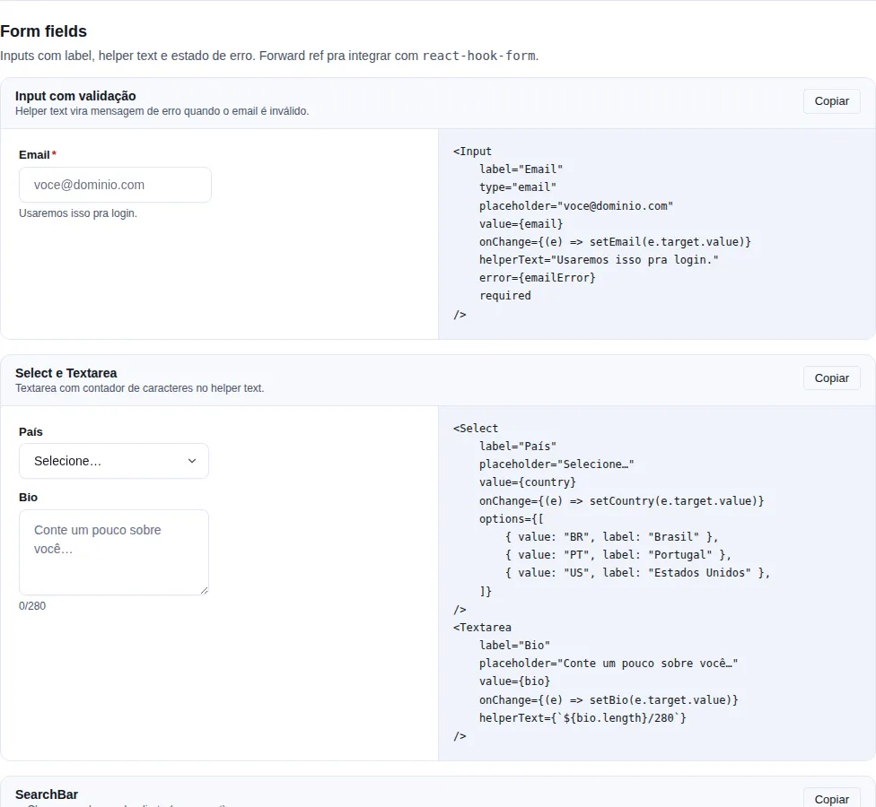
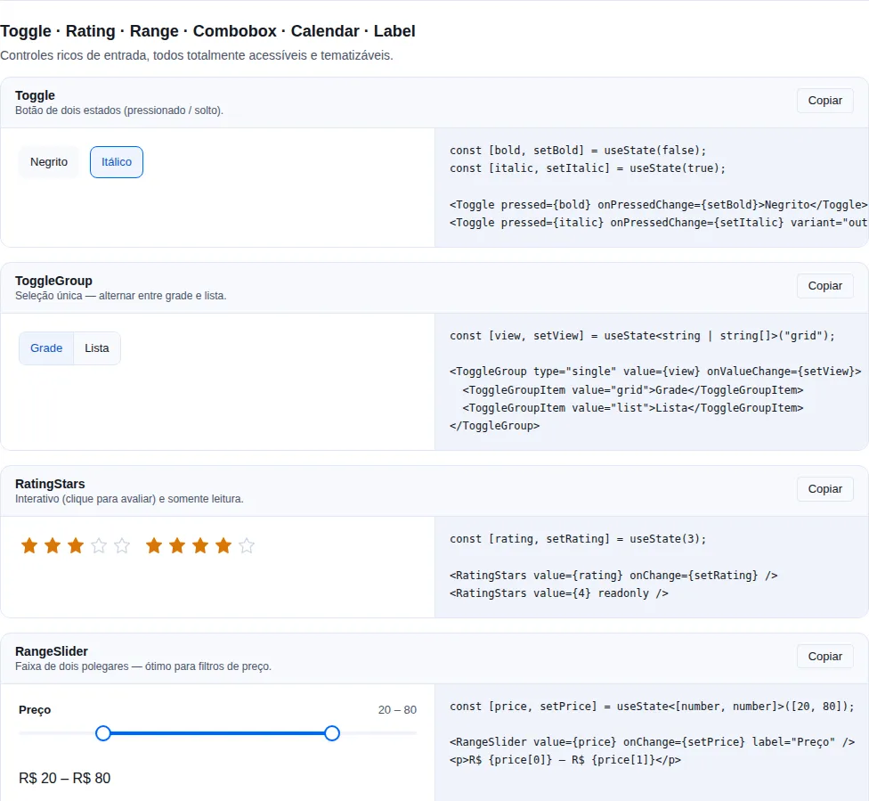
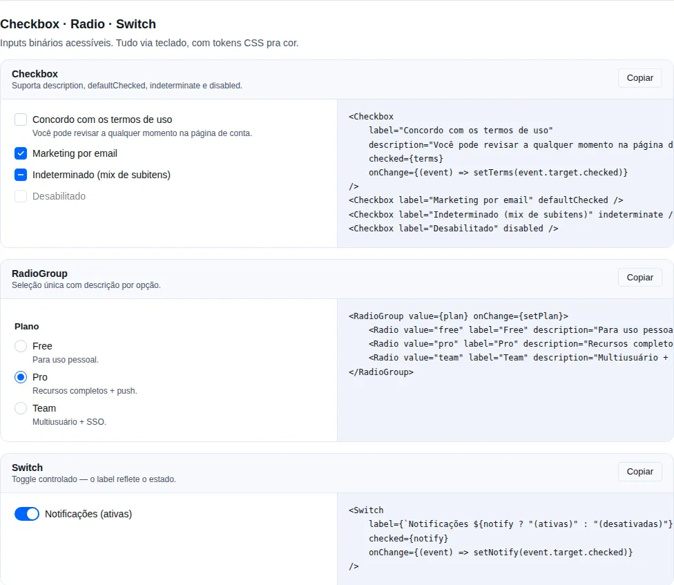
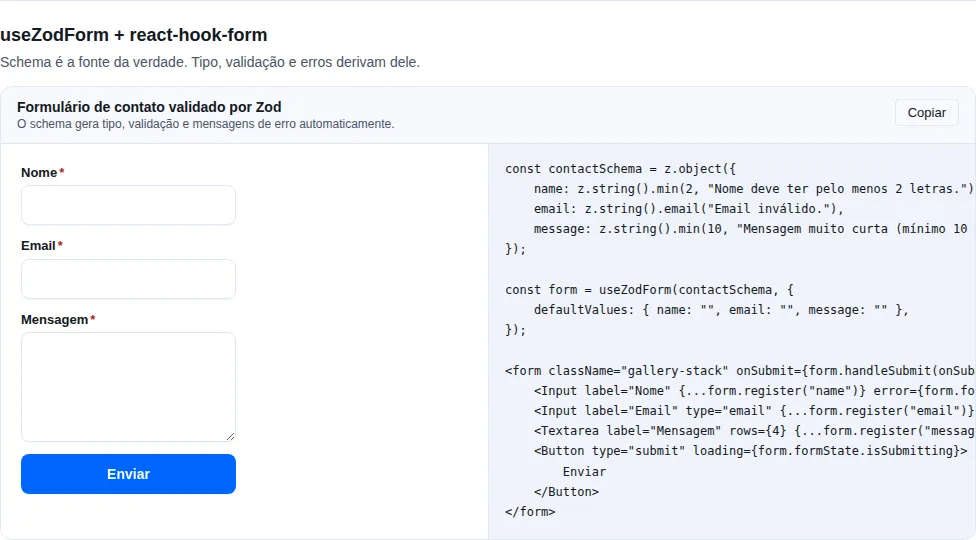
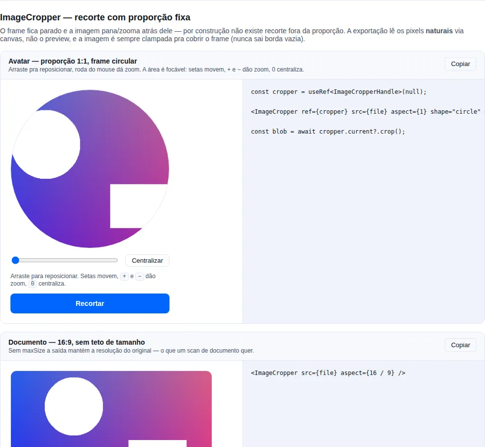

# Entrada de dados

Controles para coleta de dados do usuário. Todos forward refs para o elemento DOM nativo (compatível com `react-hook-form`).

## O que é esta categoria

Esta página reúne todo o conjunto de **controles de formulário** do SDK — desde o `Input` de texto simples até campos especializados como `PinInput` (OTP), `PasswordInput` (com medidor de força), `RangeSlider` (faixa dupla) e `Dropzone` (arrastar-e-soltar arquivos). Todos compartilham a mesma API de rótulo/erro/tamanho (ver a seção Convenções abaixo) e fazem forward de `ref`, então plugam direto em `react-hook-form` sem wrappers extras.

**Quando usar:** sempre que precisar coletar um valor do usuário. Escolha o controle pelo tipo de dado — texto curto (`Input`), texto longo (`Textarea`), uma opção entre poucas (`Radio`/`Select`), uma opção entre muitas com busca (`Combobox`), booleano (`Switch`/`Checkbox`), código de verificação (`PinInput`), número com incremento (`StepperInput`), etc.

!!! tip "Comece pelas Convenções"
    Todos os campos aceitam `label`, `helperText`, `error`, `required` e `size` da mesma forma. Aprenda essas 5 props uma vez e você sabe usar qualquer campo desta página.

## Convenções

- `label` (string ou node) — rótulo acima do campo.
- `helperText` — texto auxiliar abaixo; substituído por `error` quando este é setado.
- `error` (string) — mensagem de erro; adiciona `aria-invalid="true"` + borda vermelha.
- `required` — adiciona `*` no label e propaga `required` no input.
- `size: "sm" | "md" | "lg"` — escala de altura/padding/font via tokens density.

## `Input`

<!-- gallery:form-fields -->
[](../gallery.md)

*Seção `form-fields` da [gallery](../gallery.md) — rode localmente para interagir.*
<!-- /gallery -->

Texto single-line.

```tsx
import { Input } from "tempest-react-sdk";
import { Search } from "lucide-react";

<Input label="Email" type="email" placeholder="user@example.com" required />;
<Input label="Buscar" leftIcon={<Search size={16} />} placeholder="palavra-chave" />;
<Input label="Senha" type="password" error="Mínimo 8 caracteres" />;
```

| Prop               | Tipo                                                   | Default |
| ------------------ | ------------------------------------------------------ | ------- |
| `label`            | `string`                                               | —       |
| `helperText`       | `string`                                               | —       |
| `error`            | `string`                                               | —       |
| `leftIcon`         | `ReactNode`                                            | —       |
| `rightIcon`        | `ReactNode`                                            | —       |
| `size`             | `"sm" \| "md" \| "lg"`                                 | `"md"`  |
| `wrapperClassName` | `string`                                               | —       |
| ...                | Todos os atributos de `HTMLInputElement` exceto `size` | —       |

## `Textarea`

Multi-linha. Mesma API do `Input` (sem `leftIcon`/`rightIcon`).

```tsx
<Textarea label="Mensagem" rows={4} helperText="Máximo 500 caracteres" />
```

## `Select`

Nativo `<select>`. Aceita `options` (lista) ou `<option>` children.

```tsx
<Select
  label="UF"
  options={[
    { value: "SP", label: "São Paulo" },
    { value: "RJ", label: "Rio de Janeiro" },
  ]}
/>
```

| Prop      | Tipo             | Default |
| --------- | ---------------- | ------- |
| `options` | `SelectOption[]` | —       |
| `label`   | `string`         | —       |
| `error`   | `string`         | —       |

## `Combobox`

<!-- gallery:inputs-advanced -->
[](../gallery.md)

*Seção `inputs-advanced` da [gallery](../gallery.md) — rode localmente para interagir.*
<!-- /gallery -->

**Quando usar:** uma opção entre muitas (dezenas+), onde o usuário precisa digitar para filtrar. Para poucas opções use `Select`.

Select com busca + filtro. Keyboard nav (↑↓ Enter Esc).

```tsx
<Combobox
  label="Cidade"
  options={cities}
  value={city}
  onChange={setCity}
  filter={(opt, query) => opt.label.toLowerCase().includes(query.toLowerCase())}
/>
```

## `MultiSelect`

<!-- gallery:inputs-extra -->
[](../gallery.md)

*Seção `inputs-extra` da [gallery](../gallery.md) — rode localmente para interagir.*
<!-- /gallery -->

**Quando usar:** várias opções entre muitas, com busca e chips removíveis. Para uma única opção use `Combobox`; para poucas opções booleanas use `Checkbox`.

Multi-select filtrável com chips removíveis. Keyboard nav (↑↓ navega, Enter alterna, Esc fecha, Backspace com query vazia remove o último chip).

```tsx
import { MultiSelect, type MultiSelectOption } from "tempest-react-sdk";
import { useState } from "react";

function Example() {
  const [sel, setSel] = useState<string[]>([]);
  const options: MultiSelectOption[] = [
    { value: "sp", label: "São Paulo" },
    { value: "rj", label: "Rio de Janeiro" },
  ];

  return <MultiSelect label="Estados" options={options} value={sel} onChange={setSel} />;
}
```

| Prop           | Tipo                                            | Default                       |
| -------------- | ----------------------------------------------- | ----------------------------- |
| `options`      | `MultiSelectOption[]`                           | — (obrigatório)               |
| `value`        | `string[]`                                       | — (obrigatório, controlled)   |
| `onChange`     | `(value: string[]) => void`                      | — (obrigatório)               |
| `label`        | `string`                                         | —                             |
| `placeholder`  | `string`                                         | `"Selecione"`                 |
| `helperText`   | `string`                                         | —                             |
| `error`        | `string`                                         | —                             |
| `disabled`     | `boolean`                                         | `false`                       |
| `maxItems`     | `number`                                          | —                             |
| `filter`       | `(option, query) => boolean`                     | —                             |
| `emptyMessage` | `string`                                          | `"Nenhuma opção encontrada"`  |
| `className`    | `string`                                         | —                             |

`MultiSelectOption` é `{ value: string; label: string; disabled?: boolean }`.

## `Checkbox`

<!-- gallery:form-primitives -->
[](../gallery.md)

*Seção `form-primitives` da [gallery](../gallery.md) — rode localmente para interagir.*
<!-- /gallery -->

Single checkbox. Suporta `indeterminate`.

```tsx
<Checkbox label="Aceito os termos" />;
<Checkbox label="Selecionar todos" indeterminate={someSelected && !allSelected} />;
```

## `Radio` / `RadioGroup`

Radio standalone OU agrupado com value único.

```tsx
<RadioGroup label="Plano" value={plan} onChange={setPlan}>
  <Radio value="free" label="Grátis" />
  <Radio value="pro" label="Pro" />
  <Radio value="team" label="Team" />
</RadioGroup>
```

## `Switch`

**Quando usar:** ligar/desligar uma preferência com efeito imediato (ex.: notificações). Para opt-in que só vale ao submeter o form (ex.: aceitar termos), prefira `Checkbox`.

Toggle on/off.

```tsx
<Switch
  label="Receber emails"
  checked={subscribed}
  onChange={(e) => setSubscribed(e.target.checked)}
/>
```

!!! note "Switch vs Checkbox — não são intercambiáveis"
    `Switch` comunica uma ação que acontece **agora**; `Checkbox` comunica um estado que será aplicado **depois** (no submit). Trocar um pelo outro confunde o usuário sobre quando a mudança tem efeito.

## `ChipInput`

Lista de chips com adição por Enter + dedup automático.

```tsx
<ChipInput label="Tags" value={tags} onChange={setTags} placeholder="adicione e pressione Enter" />
```

## `SearchBar`

Input de busca com clear button + debounce opcional via `useDebounce`.

```tsx
<SearchBar value={q} onChange={setQ} placeholder="O que você procura?" />
```

## `DatePicker`

`<input type="date">` (ou `time`, `datetime-local`, `month`) com label/error.

```tsx
<DatePicker label="Data" value={date} onChange={setDate} mode="date" min="2025-01-01" />;
<DatePicker label="Início" mode="datetime-local" value={start} onChange={setStart} />;
```

## `DateRangePicker`

**Quando usar:** seleção de um intervalo de datas (início + fim) num calendário. Para uma única data use `Calendar`.

Calendário de intervalo: o primeiro clique define `start`, o próximo define `end` (reordenado automaticamente se for anterior), um terceiro clique recomeça; o dia sob o cursor pré-visualiza o intervalo. Matemática de `Date` pura, sem dependências.

```tsx
import { DateRangePicker, type DateRange } from "tempest-react-sdk";
import { useState } from "react";

function Example() {
  const [range, setRange] = useState<DateRange>({ start: null, end: null });

  return <DateRangePicker value={range} onChange={setRange} numberOfMonths={2} />;
}
```

| Prop             | Tipo                              | Default                     |
| ---------------- | --------------------------------- | --------------------------- |
| `value`          | `DateRange`                       | — (obrigatório, controlled) |
| `onChange`       | `(range: DateRange) => void`      | — (obrigatório)             |
| `numberOfMonths` | `number`                          | `2`                         |
| `defaultMonth`   | `Date`                            | —                           |
| `minDate`        | `Date`                            | —                           |
| `maxDate`        | `Date`                            | —                           |
| `weekStartsOn`   | `0 \| 1`                          | `0`                         |
| `className`      | `string`                          | —                           |

`DateRange` é `{ start: Date | null; end: Date | null }`.
## `TimePicker`

<!-- gallery:material -->
[](../gallery.md)

*Seção `material` da [gallery](../gallery.md) — rode localmente para interagir.*
<!-- /gallery -->

**Quando usar:** escolher um horário em colunas roláveis (estilo "spinner" do Material) — agendamentos, lembretes, janelas de atendimento. Para um campo nativo simples, use o `DatePicker` com `mode="time"`.

Sempre emite uma string 24h `"HH:MM"` via `onChange`, mesmo com `use12Hours` ligado. O `minuteStep` controla a granularidade da coluna de minutos.

```tsx
import { useState } from "react";
import { TimePicker } from "tempest-react-sdk";

function ScheduleField() {
  const [t, setT] = useState("09:30");

  return (
    <TimePicker
      label="Horário"
      value={t}
      onChange={setT}
      minuteStep={15}
      helperText="Selecione hora e minuto"
    />
  );
}
```

| Prop         | Tipo                          | Default |
| ------------ | ----------------------------- | ------- |
| `value`      | `string` (24h `"HH:MM"`)      | —       |
| `onChange`   | `(value: string) => void`     | —       |
| `minuteStep` | `number` (granularidade)      | `5`     |
| `use12Hours` | `boolean` (colunas 1–12 + AM/PM) | `false` |
| `label`      | `string`                      | —       |
| `helperText` | `string`                      | —       |
| `disabled`   | `boolean`                     | `false` |

!!! note "Sempre 24h na saída"
    Mesmo com `use12Hours` (colunas 1–12 + AM/PM), o `onChange` continua emitindo `"HH:MM"` em 24h — o display 12h é só visual. Guarde e envie o valor de 24h direto.

## `FileUpload`

<!-- gallery:advanced -->
[](../gallery.md)

*Seção `advanced` da [gallery](../gallery.md) — rode localmente para interagir.*
<!-- /gallery -->

Drag-and-drop + click-to-upload + lista de arquivos.

```tsx
<FileUpload
  label="Anexar"
  accept="image/*"
  multiple
  onFilesChange={(files) => setFiles(files)}
  maxSize={5 * 1024 * 1024}
/>
```

## `Slider`

**Quando usar:** escolher um único valor numa faixa contínua (volume, brilho, etc.). Para uma faixa de dois valores use `RangeSlider`.

Slider de thumb único sobre `<input type="range">` nativo.

```tsx
import { Slider } from "tempest-react-sdk";
import { useState } from "react";

function Example() {
  const [vol, setVol] = useState(30);

  return <Slider value={vol} onChange={setVol} label="Volume" formatValue={(v) => v + "%"} />;
}
```

| Prop          | Tipo                          | Default                     |
| ------------- | ----------------------------- | --------------------------- |
| `value`       | `number`                      | — (obrigatório, controlled) |
| `onChange`    | `(value: number) => void`     | — (obrigatório)             |
| `min`         | `number`                      | `0`                         |
| `max`         | `number`                      | `100`                       |
| `step`        | `number`                      | `1`                         |
| `label`       | `string`                      | —                           |
| `helperText`  | `string`                      | —                           |
| `disabled`    | `boolean`                     | `false`                     |
| `formatValue` | `(value: number) => string`   | —                           |
| `aria-label`  | `string`                      | —                           |
| `className`   | `string`                      | —                           |

!!! tip "Slider compacto: nome acessível sem o label visível"
    Passar `label` renderiza um bloco acima da track (rótulo + valor). Onde esse
    bloco não cabe — rodapé de uma linha, célula de tabela, toolbar — use
    `aria-label` sozinho:

    ```tsx
    <Slider value={gain} onChange={setGain} aria-label={`Volume de ${nome}`} />
    ```

    Sem isso, **todo** slider da página se anuncia como `"Slider"` e o leitor de
    tela não distingue um do outro. A precedência é
    `aria-label` → `label` → `"Slider"`, então quem já passava só `label` não
    muda em nada. Envolver o campo num `<label>` externo **não** resolve: um
    `aria-label` explícito no input vence na ordem de precedência do nome
    acessível.

## `Dropzone`

**Quando usar:** uma área de arrastar-e-soltar enxuta, quando você só precisa
capturar os arquivos (`onDrop`) e renderizar a lista/preview por conta própria.
Para um campo pronto com label, lista de arquivos e estilo de formulário, use
`FileUpload`.

Área drag-and-drop com input de arquivo escondido — clicável e focável por
teclado. Filtra por `maxSize` antes de chamar `onDrop`; rejeitados vão em
`onReject`.

```tsx
import { useState } from "react";
import { Dropzone } from "tempest-react-sdk";

function Uploader() {
  const [files, setFiles] = useState<File[]>([]);
  return (
    <>
      <Dropzone
        accept="image/*"
        multiple
        maxSize={5 * 1024 * 1024}
        onDrop={(accepted) => setFiles(accepted)}
        onReject={(rejected) => alert(`${rejected.length} arquivo(s) acima de 5 MB`)}
      >
        Arraste imagens aqui ou clique para selecionar
      </Dropzone>
      <ul>
        {files.map((file) => (
          <li key={file.name}>{file.name}</li>
        ))}
      </ul>
    </>
  );
}
```

| Prop        | Tipo                       | Default |
| ----------- | -------------------------- | ------- |
| `onDrop`    | `(files: File[]) => void`  | —       |
| `accept`    | `string`                   | —       |
| `multiple`  | `boolean`                  | `true`  |
| `maxSize`   | `number` (bytes)           | —       |
| `onReject`  | `(files: File[]) => void`  | —       |
| `disabled`  | `boolean`                  | `false` |
| `children`  | `ReactNode`                | prompt padrão |
| `className` | `string`                   | —       |

**A11y**: `role="button"` + `tabIndex` (Enter/Espaço abrem o seletor); `aria-disabled` quando `disabled`.

## `RangeSlider`

Dual-thumb slider com clamp `low ≤ high`.

```tsx
<RangeSlider
  label="Faixa de preço"
  min={0}
  max={1000}
  step={10}
  value={range}
  onChange={setRange}
  formatValue={([lo, hi]) => `R$ ${lo} – R$ ${hi}`}
/>
```

Aceita `aria-label` pelo mesmo motivo do `Slider`. Cada thumb continua com nome
próprio — `"Faixa de preço (mínimo)"` e `"Faixa de preço (máximo)"` — porque
quem navega de um para o outro precisa saber em qual ponta está.

## `RatingStars`

Radio group de estrelas.

```tsx
<RatingStars value={rating} onChange={setRating} max={5} size="md" />;
<RatingStars value={4.5} readonly size="lg" />;
```

## `PinInput`

**Quando usar:** códigos de verificação curtos (OTP, 2FA, confirmação por SMS/email). Para senhas use `PasswordInput`.

OTP / one-time-code com N células. Paste, auto-advance, backspace flowback, arrow nav.

!!! tip "Colar o código inteiro funciona"
    O usuário pode colar `123456` em qualquer célula que o `PinInput` distribui os dígitos automaticamente — defina `type="numeric"` para que o teclado mobile abra no modo numérico.

```tsx
<PinInput length={6} type="numeric" onComplete={(otp) => verify(otp)} />;
<PinInput length={4} type="alphanumeric" masked autoFocus />;
```

| Prop           | Tipo                          | Default        |
| -------------- | ----------------------------- | -------------- |
| `length`       | `number`                      | `6`            |
| `type`         | `"numeric" \| "alphanumeric"` | `"numeric"`    |
| `value`        | `string`                      | — (controlled) |
| `defaultValue` | `string`                      | `""`           |
| `onChange`     | `(value: string) => void`     | —              |
| `onComplete`   | `(value: string) => void`     | —              |
| `masked`       | `boolean`                     | `false`        |
| `size`         | `"sm" \| "md" \| "lg"`        | `"md"`         |
| `autoFocus`    | `boolean`                     | `false`        |

## `PasswordInput`

Field tipo `password` com toggle de visibilidade + strength meter opcional (5 níveis).

```tsx
<PasswordInput label="Senha" autoComplete="new-password" showStrength />
```

Helper exposto: `estimatePasswordStrength(value)` retorna `0-4` (length, case mix, digits, symbols).

!!! warning "Use `autoComplete` correto"
    Em telas de cadastro use `autoComplete="new-password"`; em login use `autoComplete="current-password"`. O valor errado faz o gerenciador de senhas do navegador sugerir/salvar a senha de forma incorreta.

| Prop             | Tipo                                      | Default                                                  |
| ---------------- | ----------------------------------------- | -------------------------------------------------------- |
| `showStrength`   | `boolean`                                 | `false`                                                  |
| `strength`       | `0 \| 1 \| 2 \| 3 \| 4` (override manual) | `estimatePasswordStrength(value)`                        |
| `strengthLabels` | `[string,string,string,string,string]`    | `["Muito fraca","Fraca","Razoável","Forte","Excelente"]` |
| `toggleLabels`   | `{ show, hide }`                          | `{ show: "Mostrar senha", hide: "Esconder senha" }`      |

## `StepperInput`

`+ / −` numeric com clamp em `min/max`.

```tsx
<StepperInput value={qty} onChange={setQty} min={1} max={10} />;
<StepperInput value={price} onChange={setPrice} step={5} format={(n) => `R$ ${n}`} />;
```

## `Form` / `FormSection` / `FormRow` / `FormActions` / `FormField`

<!-- gallery:forms -->
[](../gallery.md)

*Seção `forms` da [gallery](../gallery.md) — rode localmente para interagir.*
<!-- /gallery -->

Layout wrappers para forms (`stack`/`inline`/`grid`) + integração RHF.

```tsx
<Form layout="grid" columns={2} gap={4}>
  <Input label="Nome" />
  <Input label="Email" type="email" />
  <FormActions style={{ gridColumn: "1 / -1" }}>
    <Button type="submit">Salvar</Button>
  </FormActions>
</Form>
```

Detalhes completos em [../forms.md](../forms.md).

## `ImageCropper`

<!-- gallery:image-cropper -->
[](../gallery.md)

*Seção `image-cropper` da [gallery](../gallery.md) — rode localmente para interagir.*
<!-- /gallery -->

> **Quando usar**: par natural do [`FileUpload`](#fileupload) — foto de perfil, foto de documento, capa. O app decide a proporção de saída; o usuário só escolhe o que cai dentro dela.

O frame fica **parado** e a imagem pana e dá zoom atrás dele. É o modelo que um fluxo de avatar quer: por construção não existe recorte fora da proporção.

```tsx
import { useRef, useState } from "react";
import { Button, FileUpload, ImageCropper, type ImageCropperHandle } from "tempest-react-sdk";

export function AvatarField({ onSave }: { onSave: (blob: Blob) => void }) {
  const [files, setFiles] = useState<File[]>([]);
  const cropper = useRef<ImageCropperHandle>(null);

  return (
    <>
      <FileUpload value={files} onChange={setFiles} accept="image/*" label="Foto" />
      {files[0] && (
        <>
          <ImageCropper
            ref={cropper}
            src={files[0]}
            aspect={1}
            shape="circle"
            maxSize={512}
            outputType="image/jpeg"
          />
          <Button
            onClick={async () => {
              const blob = await cropper.current?.crop();
              if (blob) onSave(blob);
            }}
          >
            Salvar
          </Button>
        </>
      )}
    </>
  );
}
```

| Prop            | Tipo                                             | Default              |
| --------------- | ------------------------------------------------ | -------------------- |
| `src`           | `File \| Blob \| string`                         | —                    |
| `aspect`        | `number` (`largura / altura`)                    | `1`                  |
| `maxZoom`       | `number`                                         | `4`                  |
| `maxSize`       | `number` (teto da maior aresta exportada, px)    | —                    |
| `outputType`    | `string`                                         | `"image/png"`        |
| `outputQuality` | `number` (`0`–`1`, tipos com perda)              | `0.92`               |
| `shape`         | `"rect" \| "circle"`                             | `"rect"`             |
| `onCropChange`  | `({ zoom, offset }) => void`                     | —                    |
| `label`         | `string` (nome acessível da área)                | `"Área de recorte"`  |
| `ref`           | `Ref<ImageCropperHandle>`                        | —                    |

O `ref` expõe `{ crop, reset }`. O `crop()` devolve `Promise<Blob | null>`.

!!! tip "Exporta os pixels originais, não o preview"
    O recorte é lido do tamanho **natural** da imagem via canvas. Uma foto de 4000 px
    recortada num preview de 320 px sai com a resolução do original, não com a do
    preview — que é o erro mais comum em cropper caseiro.

    Use `maxSize` pra limitar: uma foto de 12 MP recortada pra um avatar de 96 px são
    megabytes de desperdício.

!!! check "Nunca sai borda vazia"
    A imagem é sempre **clampada pra cobrir o frame**, em pan e em zoom. É o outro
    defeito clássico: arrastar ou dar zoom-out até o frame mostrar fundo, e aí a faixa
    transparente (ou preta) fica assada no arquivo exportado. Aqui é impossível por
    construção — inclusive ao dar zoom-out, quando um offset que era legal deixa de
    ser.

!!! info "Teclado de igual peso"
    A área de recorte é focável. **Setas** movem (com `Shift` movem 4×), **`+`/`−`**
    dão zoom, **`0`** centraliza. Roda do mouse também dá zoom. Um cropper que só
    funciona arrastando exclui quem navega por teclado.

!!! warning "`crop()` devolve `null`, não lança"
    Antes da imagem carregar, ou se o navegador recusar o encode, o retorno é `null`.
    Um handler de submit não precisa de `try/catch` — precisa checar o retorno.

!!! note "`File`/`Blob` viram object URL, e ele é revogado"
    Trocar de foto ou desmontar o componente revoga a URL anterior. Sem isso, cada
    re-escolha de foto vazaria a anterior pelo resto da vida do documento.

## `SignaturePad`

<!-- gallery:capture-media -->
[](../gallery.md)

*Seção `capture-media` da [gallery](../gallery.md) — rode localmente para interagir.*
<!-- /gallery -->

> **Quando usar**: coletar assinatura de próprio punho — comprovante de entrega, ordem de serviço, termo de aceite. Em campo, no celular, com o dedo.

Canvas com captura por `pointer` (mouse, dedo e caneta pelo mesmo caminho). Os traços são guardados como **listas de pontos** e o canvas é redesenhado a partir delas — é isso que torna o `undo` possível: canvas guarda pixel, não histórico, então remover o último traço significa repintar o resto.

```tsx
import { Button, SignaturePad, type SignaturePadHandle } from "tempest-react-sdk";
import { useRef, useState } from "react";

export function AssinaturaDaEntrega({ entregaId }: { entregaId: string }) {
  const pad = useRef<SignaturePadHandle>(null);
  const [vazio, setVazio] = useState(true);

  async function enviar() {
    const blob = await pad.current?.toBlob("image/png");
    if (!blob) return;
    const form = new FormData();
    form.append("assinatura", blob, `${entregaId}.png`);
    await api.post(`/entregas/${entregaId}/assinatura`, form);
  }

  return (
    <>
      <SignaturePad
        label="Assinatura do cliente"
        width={360}
        height={180}
        onEmptyChange={setVazio}
      />
      <Button disabled={vazio} onClick={enviar}>Confirmar entrega</Button>
    </>
  );
}
```

| Prop            | Tipo                        | Default       | O que faz                                                     |
| --------------- | --------------------------- | ------------- | ------------------------------------------------------------- |
| `width`         | `number`                    | `400`         | Largura da superfície em px CSS.                              |
| `height`        | `number`                    | `160`         | Altura da superfície em px CSS.                               |
| `penColor`      | `string`                    | cor computada | Cor do traço. O default segue `--tempest-text`.               |
| `penWidth`      | `number`                    | `2`           | Espessura do traço.                                           |
| `disabled`      | `boolean`                   | `false`       | Bloqueia o desenho e esmaece a superfície.                    |
| `label`         | `string`                    | `"Signature"` | Nome acessível do canvas.                                     |
| `onBegin`       | `() => void`                | —             | Chamado no início de cada traço.                              |
| `onEnd`         | `(dataUrl: string) => void` | —             | Chamado ao fim de cada traço, com a imagem atual.             |
| `onEmptyChange` | `(isEmpty: boolean) => void`| —             | Chamado quando a vacuidade muda — ligue no botão de submit.    |
| `showActions`   | `boolean`                   | `true`        | Renderiza os botões Desfazer/Limpar.                          |

**Handle imperativo** (`ref`): `clear()`, `undo()`, `isEmpty()`, `toDataURL(type?, quality?)`, `toBlob(type?, quality?)`.

!!! tip "Suba `toBlob()`, não `toDataURL()`"
    Data URL é base64: ~33% mais bytes, e ainda vira string no meio do seu JSON. `toBlob()` entrega binário pronto pro `FormData`.

!!! info "Nitidez em tela de alta densidade"
    O buffer do canvas é escalado por `devicePixelRatio` e o contexto recebe o `setTransform` correspondente. Sem isso o traço sai borrado no celular — é o defeito clássico de canvas em 1x.

!!! note "A cor do traço segue o tema"
    O default lê a cor **computada** do canvas, que o CSS liga em `--tempest-text`. Assinatura desenhada no tema escuro sai clara; no claro, escura. Passe `penColor` só se precisar de tinta fixa (azul de caneta, por exemplo).

## A11y

- Sempre use `label` — screen readers anunciam o campo.
- `error` adiciona `aria-invalid="true"` + descreve via `aria-describedby`.
- `required` propaga atributo `required` nativo + indicador visual `*`.
- `PinInput` cells expõem `aria-label="Dígito N"` individuais.
- `PasswordInput.toggle` usa `aria-pressed` e label `aria-label` localizada.

## Resumo

- Escolha o controle pelo **tipo de dado** — não force um `Input` onde um `Select`, `Switch` ou `PinInput` comunica melhor a intenção.
- Todos os campos compartilham `label` / `helperText` / `error` / `required` / `size` e fazem forward de `ref` → plugam direto em `react-hook-form`.
- `error` substitui `helperText` e adiciona `aria-invalid` automaticamente — não duplique a mensagem.

Páginas relacionadas:

- [Validação de formulários](../forms.md) — `validateForm`, `useZodForm`, máscaras BR, `useViaCEP` e o wrapper `<FormField>`.
- [Layout](./layout.md) — `Form`/`FormSection`/`FormRow`/`FormActions` para estruturar os campos.
- [Ações](./actions.md) — `Button` para o submit do formulário.
- [Status & feedback](./feedback.md) — `Alert`/`Toast` para confirmar sucesso ou erro do envio.
