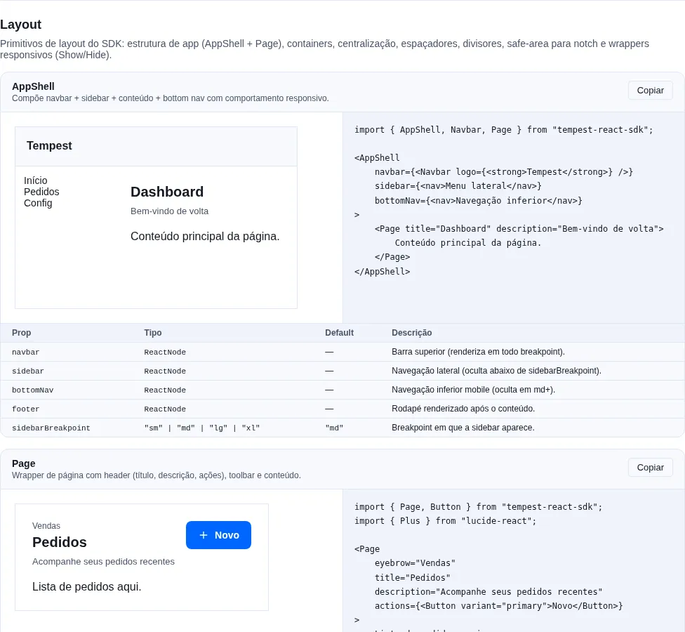
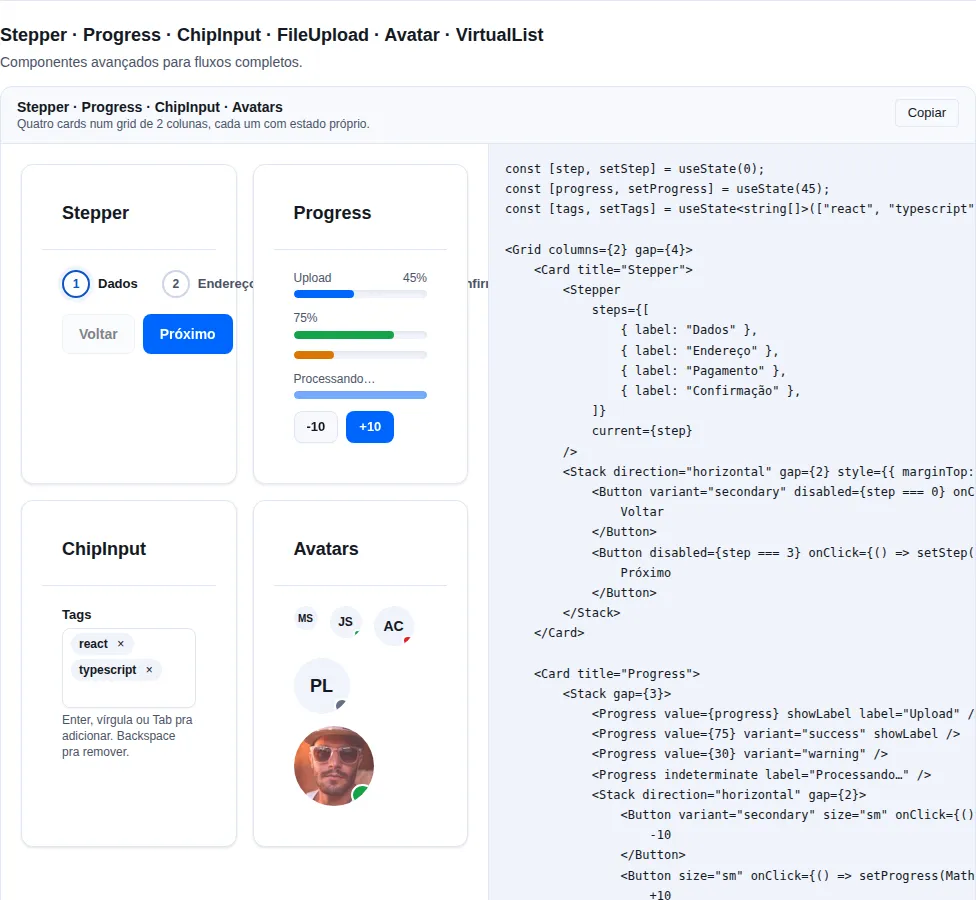
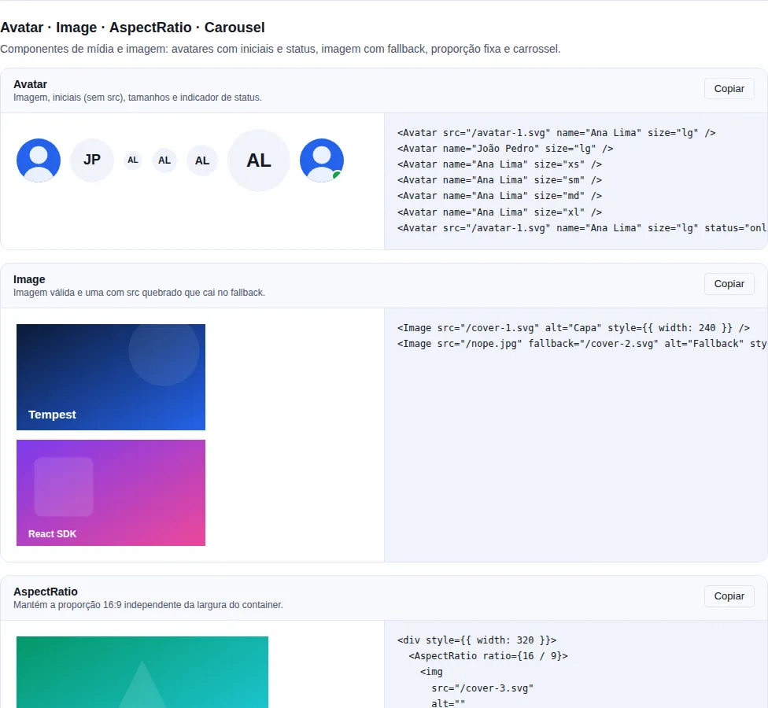

# Layout

Shell completo + primitivos de espaçamento + utilitários responsivos.

## O que é esta categoria

Os componentes de layout não desenham conteúdo — eles **organizam o espaço**. Há três níveis:

1. **Shell de aplicação** (`AppShell` + `Page` + `Container`) — a moldura responsiva que segura navbar, sidebar/bottom-nav, header e conteúdo.
2. **Primitivos de espaçamento** (`Stack`, `Grid`, `Divider`, `Spacer`, `Center`, `AspectRatio`) — flex/grid declarativos sem você escrever CSS.
3. **Utilitários responsivos** (`SafeArea`, `<Show>`/`<Hide>`, `ResponsiveValue`) — adaptam o layout por breakpoint e respeitam notches/barras do sistema.

**Quando usar:** prefira esses primitivos a `<div style={{ display: "flex" }}>` ad-hoc. Eles usam os tokens de spacing do SDK (escala 4px), são responsivos por construção e mantêm o espaçamento consistente entre apps.

!!! tip "Componha de fora pra dentro"
    Pense `AppShell` → `Container` → `Page` → `Stack`/`Grid` → conteúdo. Cada camada tem uma responsabilidade única; empilhá-las dá um layout responsivo completo sem nenhuma media query manual.

## `AppShell`

<!-- gallery:layout -->
[](../gallery.md)

*Seção `layout` da [gallery](../gallery.md) — rode localmente para interagir.*
<!-- /gallery -->

**Quando usar:** como a moldura raiz de um app com navegação persistente (dashboard, painel admin). Para uma landing page simples, um `Container` basta.

Composer: navbar + sidebar (desktop) / bottomNav (mobile) + main + footer responsivo.

```tsx
import { useState } from "react";
import {
    AppShell,
    BottomNavigation,
    Navbar,
    Page,
    Sidebar,
    type SidebarItem,
} from "tempest-react-sdk";

const NAV: SidebarItem[] = [
    { key: "dashboard", label: "Dashboard" },
    { key: "pedidos", label: "Pedidos", badge: 12 },
    { key: "clientes", label: "Clientes" },
];

export function Shell() {
    const [tab, setTab] = useState("dashboard");

    return (
        <AppShell
            navbar={<Navbar logo={<strong>Tempest</strong>} actions={<button>Sair</button>} />}
            sidebar={<Sidebar items={NAV} value={tab} onChange={setTab} />}
            bottomNav={<BottomNavigation items={NAV} value={tab} onChange={setTab} />}
            footer={<small>© 2026 Tempest</small>}
            sidebarBreakpoint="md"
        >
            <Page title="Dashboard">Conteúdo da aba {tab}</Page>
        </AppShell>
    );
}
```

Comportamento responsivo:

- **>= `sidebarBreakpoint`**: navbar + sidebar + main + footer.
- **< `sidebarBreakpoint`**: navbar + main + bottomNav + footer (sidebar ocultado).

| Prop                | Tipo                           | Default |
| ------------------- | ------------------------------ | ------- |
| `navbar`            | `ReactNode`                    | —       |
| `sidebar`           | `ReactNode`                    | —       |
| `bottomNav`         | `ReactNode`                    | —       |
| `footer`            | `ReactNode`                    | —       |
| `sidebarBreakpoint` | `"sm" \| "md" \| "lg" \| "xl"` | `"md"`  |

!!! warning "`sidebar` some abaixo do breakpoint — não é o mesmo que estar lá"
    Abaixo de `sidebarBreakpoint` o `AppShell` **não renderiza** a sidebar; ele
    espera que você passe `bottomNav`. Se a navegação principal só existe na
    sidebar, no mobile o app fica sem navegação nenhuma. Ou passe `bottomNav`,
    ou abra a mesma lista num `<Drawer>` a partir de um botão no `Navbar`.

## `Page`

Page wrapper com header (`eyebrow` + `title` + `description` + `actions`) + `toolbar` + `content` + `footer`.

```tsx
import { Button, Page, Pagination, Table } from "tempest-react-sdk";
import { Download, Plus } from "lucide-react";

const PEDIDOS = [
    { id: "8421", cliente: "Ana Souza", total: "R$ 1.240,00" },
    { id: "8422", cliente: "Bruno Lima", total: "R$ 380,00" },
];

export function PedidosPage() {
    return (
        <Page
            eyebrow="Vendas"
            title="Pedidos"
            description="Acompanhe seus pedidos em tempo real"
            actions={
                <>
                    <Button variant="ghost" leftIcon={<Download size={16} />}>
                        Exportar
                    </Button>
                    <Button leftIcon={<Plus size={16} />}>Novo</Button>
                </>
            }
            footer={
                <Pagination
                    page={1}
                    totalPages={3}
                    totalItems={PEDIDOS.length}
                    onPageChange={() => {}}
                />
            }
        >
            <Table
                data={PEDIDOS}
                rowKey={(pedido) => pedido.id}
                columns={[
                    { key: "id", header: "Pedido" },
                    { key: "cliente", header: "Cliente" },
                    { key: "total", header: "Total" },
                ]}
            />
        </Page>
    );
}
```

| Prop          | Tipo        | Default |
| ------------- | ----------- | ------- |
| `title`       | `ReactNode` | —       |
| `eyebrow`     | `ReactNode` | —       |
| `description` | `ReactNode` | —       |
| `actions`     | `ReactNode` | —       |
| `toolbar`     | `ReactNode` | —       |
| `footer`      | `ReactNode` | —       |
| `padded`      | `boolean`   | `true`  |

## `Container`

Max-width wrapper.

```tsx
import { Container, Page } from "tempest-react-sdk";

export function Settings() {
    return (
        <Container size="lg">
            <Page title="Configurações">Preferências da conta</Page>
        </Container>
    );
}
```

| `size`   | Max-width |
| -------- | --------- |
| `"sm"`   | `640px`   |
| `"md"`   | `768px`   |
| `"lg"`   | `1024px`  |
| `"xl"`   | `1280px`  |
| `"full"` | `100%`    |

## `Stack`

<!-- gallery:advanced -->
[](../gallery.md)

*Seção `advanced` da [gallery](../gallery.md) — rode localmente para interagir.*
<!-- /gallery -->

**Quando usar:** o primitivo padrão para empilhar elementos em uma dimensão (coluna ou linha) com espaçamento uniforme. Para grade 2D use `Grid`.

Flex vertical ou horizontal com `gap`, `align`, `justify`, `wrap`. Aceita `ResponsiveValue` em `direction` e `gap`.

```tsx
import { Card, Stack } from "tempest-react-sdk";

export function Empilhado() {
    return (
        <>
            <Stack direction="vertical" gap={4}>
                <Card>Um</Card>
                <Card>Dois</Card>
            </Stack>

            <Stack
                direction={{ mobile: "vertical", desktop: "horizontal" }}
                gap={{ mobile: 2, desktop: 4 }}
            >
                <Card>No mobile empilha, no desktop fica lado a lado</Card>
            </Stack>
        </>
    );
}
```

| Prop        | Tipo                                                | Default      |
| ----------- | --------------------------------------------------- | ------------ |
| `direction` | `"vertical" \| "horizontal"` (ou `ResponsiveValue`) | `"vertical"` |
| `gap`       | `number \| string` (ou `ResponsiveValue`)           | `2` (8px)    |
| `align`     | `"start" \| "center" \| "end" \| "stretch"`         | —            |
| `justify`   | `"start" \| "center" \| "end" \| "between"`         | —            |
| `wrap`      | `boolean`                                           | `false`      |

`gap` numérico mapeia para escala 4px (`2 → 8px`, `4 → 16px`).

## `Grid`

CSS Grid wrapper.

```tsx
import { Card, Grid, Stat } from "tempest-react-sdk";

const METRICAS = [
    { id: "receita", label: "Receita", value: "R$ 84.200" },
    { id: "pedidos", label: "Pedidos", value: "1.204" },
    { id: "ticket", label: "Ticket médio", value: "R$ 69,93" },
];

export function Painel() {
    return (
        <>
            <Grid columns={3} gap={4}>
                <Card>1</Card>
                <Card>2</Card>
                <Card>3</Card>
            </Grid>

            <Grid columns={{ mobile: 1, tablet: 2, desktop: 4 }} gap={3}>
                {METRICAS.map((metrica) => (
                    <Stat key={metrica.id} label={metrica.label} value={metrica.value} />
                ))}
            </Grid>

            <Grid columns="2fr 1fr" gap={6}>
                <article>Conteúdo</article>
                <aside>Barra lateral</aside>
            </Grid>
        </>
    );
}
```

| Prop      | Tipo                                      | Default |
| --------- | ----------------------------------------- | ------- |
| `columns` | `number \| string` (ou `ResponsiveValue`) | `2`     |
| `gap`     | `number \| string`                        | `4`     |

`columns` numérico → `repeat(N, minmax(0, 1fr))`. String passa direto pra `grid-template-columns`.

!!! tip "Colunas responsivas sem media query"
    `columns={{ mobile: 1, tablet: 2, desktop: 4 }}` é a forma idiomática de uma grade que vira lista no mobile e abre colunas no desktop. As chaves são **`mobile` · `tablet` · `desktop`** — `ResponsiveValue` não usa os nomes de breakpoint (`sm`/`md`/`lg`) que aparecem em `sidebarBreakpoint` e em `<Show above>`. O `minmax(0, 1fr)` evita o overflow clássico de células com conteúdo largo (texto longo, `<pre>`).

## `Divider`

Separador horizontal/vertical com label opcional.

```tsx
import { Divider } from "tempest-react-sdk";

export function Separadores() {
    return (
        <>
            <Divider />
            <Divider variant="dashed" />
            <Divider orientation="vertical" />
            <Divider label="OU" align="center" />
        </>
    );
}
```

| Prop          | Tipo                                   | Default        |
| ------------- | -------------------------------------- | -------------- |
| `orientation` | `"horizontal" \| "vertical"`           | `"horizontal"` |
| `variant`     | `"solid" \| "dashed" \| "dotted"`      | `"solid"`      |
| `label`       | `ReactNode` (só na horizontal)         | —              |
| `align`       | `"start" \| "center" \| "end"` (label) | `"center"`     |

## `Spacer`

Flex push.

```tsx
import { Button, Spacer, Stack } from "tempest-react-sdk";

export function AcoesDoFormulario() {
    return (
        <Stack direction="horizontal">
            <Button variant="ghost">Cancelar</Button>
            <Spacer />
            <Button variant="primary">Salvar</Button>
        </Stack>
    );
}
```

| Prop   | Tipo                   | Default  |
| ------ | ---------------------- | -------- |
| `axis` | `"both" \| "x" \| "y"` | `"both"` |

## `Center`

Centraliza children horizontal/vertical/ambos.

```tsx
import { Center, Spinner } from "tempest-react-sdk";

export function Carregando() {
    return (
        <Center axis="both" minHeight="100vh">
            <Spinner />
        </Center>
    );
}
```

| Prop        | Tipo                                   | Default  |
| ----------- | -------------------------------------- | -------- |
| `axis`      | `"both" \| "horizontal" \| "vertical"` | `"both"` |
| `minHeight` | `number \| string`                     | —        |
| `fullWidth` | `boolean`                              | `true`   |

!!! tip "Centralizar na vertical precisa de altura"
    `axis="both"` centraliza dentro do espaço que o `Center` tem. Num pai sem
    altura definida esse espaço é a altura do próprio conteúdo, e nada parece
    acontecer. Passe `minHeight` (ou dê altura ao pai) sempre que a centralização
    vertical importar.

## `AspectRatio`

<!-- gallery:display-media -->
[](../gallery.md)

*Seção `display-media` da [gallery](../gallery.md) — rode localmente para interagir.*
<!-- /gallery -->

Preserva proporção pra media.

```tsx
import { AspectRatio } from "tempest-react-sdk";

export function Midia() {
    return (
        <>
            <AspectRatio ratio={16 / 9}>
                
            </AspectRatio>

            <AspectRatio ratio={1}>
                <video src="/clip.mp4" autoPlay loop muted />
            </AspectRatio>
        </>
    );
}
```

| Prop    | Tipo     | Default  |
| ------- | -------- | -------- |
| `ratio` | `number` | `16 / 9` |

Usa CSS `aspect-ratio` nativo. Compatível com todos navegadores modernos.

!!! warning "`AspectRatio` reserva o espaço antes da imagem chegar"
    É o que evita o salto de layout: a caixa já tem a proporção final, então o
    texto abaixo não desce quando a imagem carrega. Por isso a criança precisa
    preencher a caixa — uma `` sem `width: 100%; height: 100%` fica no
    tamanho natural dela e a proporção deixa de valer para o que se vê.

## `SafeArea`

Padding por edge usando `env(safe-area-inset-*)`.

```tsx
import { SafeArea } from "tempest-react-sdk";

export function Raiz() {
    return (
        <SafeArea edges={["top", "bottom"]}>
            <main>Conteúdo que não some atrás do notch</main>
        </SafeArea>
    );
}
```

| Prop     | Tipo                                            | Default                           |
| -------- | ----------------------------------------------- | --------------------------------- |
| `edges`  | `("top" \| "right" \| "bottom" \| "left")[]`    | `["top","right","bottom","left"]` |
| `inline` | `boolean` (`display: contents` em vez de block) | `false`                           |

Componentes que já cuidam de safe-area automaticamente: `Navbar` (top), `BottomNavigation`/`BottomSheet` (bottom), `Modal.fullscreen` (todos), `Toast` (top+bottom).

!!! warning "Não empilhe `SafeArea` em quem já trata"
    Se você já usa `Navbar`/`BottomNavigation`/`Toast`, não envolva-os de novo em `SafeArea` — o padding dobra e cria um vão visível. Use `SafeArea` só em superfícies custom (um sheet ou overlay próprio).

## `<Show>` / `<Hide>`

**Quando usar:** trocar de árvore inteira por breakpoint (nav desktop vs. mobile, por exemplo). Para apenas ocultar via CSS sem desmontar, prefira CSS responsivo — `<Show>`/`<Hide>` desmontam o componente do DOM.

Conditional render baseado em breakpoint. SSR-safe — primeiro render usa `xs` (mobile first), re-renderiza ao client.

```tsx
import { Banner, Hide, Show } from "tempest-react-sdk";

export function PorBreakpoint() {
    return (
        <>
            <Show above="md">
                <nav>Navegação de desktop</nav>
            </Show>
            <Hide above="md">
                <nav>Navegação de mobile</nav>
            </Hide>
            <Show below="lg">
                <Banner>Promoção de lançamento</Banner>
            </Show>
            <Show only={["sm", "md"]}>
                <p>Dica que só aparece em tablet</p>
            </Show>
        </>
    );
}
```

| Prop    | Tipo                              |
| ------- | --------------------------------- |
| `above` | `Breakpoint` (xs/sm/md/lg/xl/2xl) |
| `below` | `Breakpoint`                      |
| `only`  | `Breakpoint \| Breakpoint[]`      |

`only` sobrescreve `above`/`below` quando setado.

!!! warning "`Show`/`Hide` desmontam — não escondem com CSS"
    A decisão vem de `useBreakpoint`, que mede `window.innerWidth` em JavaScript,
    então atravessar o breakpoint **desmonta** a subárvore e todo estado local
    dentro dela se perde: input meio preenchido, acordeão aberto, scroll. Para
    esconder mantendo o estado, use CSS (a camada `utilities.css` tem as classes
    de visibilidade). E como a largura inicial é `0` fora do browser, um
    `<Show above="md">` renderiza `null` na primeira passada até o efeito medir —
    o que é correto para um SPA e não é render de servidor.

## Responsive values

`Stack.direction`, `Grid.columns`, `Form.layout` aceitam `ResponsiveValue<T>`:

```ts
type ResponsiveValue<T> = T | { mobile?: T; tablet?: T; desktop?: T };
```

Falls back para o último valor definido por breakpoint cascading.

## A11y geral

- `Page.title` é `<h1>` — apenas um por página para hierarquia correta.
- `AppShell` envolve em `<main>` semântico.
- `<Show>`/`<Hide>` renderizam `null` no servidor + ajustam no client (no SEO impact, primeira tinta pode flickerizar).

## Resumo

- Componha de fora pra dentro: `AppShell` → `Container` → `Page` → `Stack`/`Grid` → conteúdo.
- Use os primitivos (`Stack`/`Grid`/`Spacer`/`Center`) em vez de CSS flex/grid ad-hoc — eles usam os tokens de spacing (escala 4px) e são responsivos por construção.
- `direction`/`columns`/`layout` aceitam `ResponsiveValue` → layout responsivo sem escrever media query.
- `SafeArea` só em superfícies custom; `Navbar`/`BottomNavigation`/`Toast`/`Modal.fullscreen` já tratam o notch.

Páginas relacionadas:

- [Navegação](./navigation.md) — `Navbar`, `Sidebar`, `BottomNavigation` que preenchem os slots do `AppShell`.
- [Entrada de dados](./inputs.md) — `Form`/`FormSection`/`FormRow`/`FormActions` para estruturar campos dentro de um `Page`.
- [Dados](./data.md) — `Table`/`DataTable`/`Pagination` que vivem no conteúdo de um `Page`.
- [App Providers](../app-providers.md) e [Roteamento](../routing.md) — a glue que envolve o `AppShell`.
