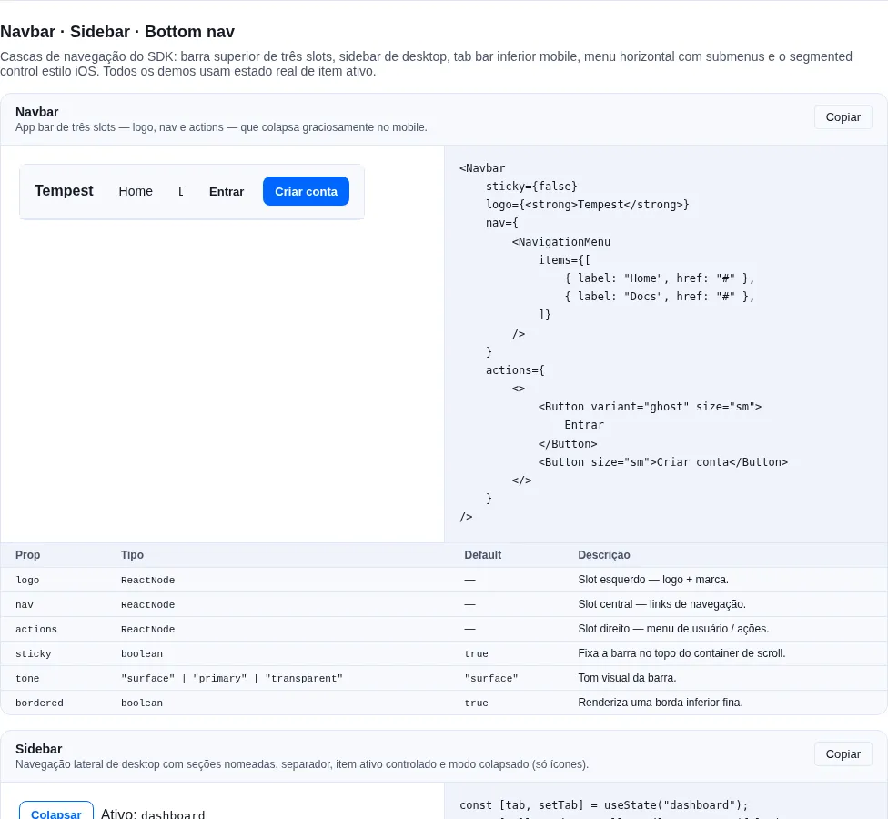
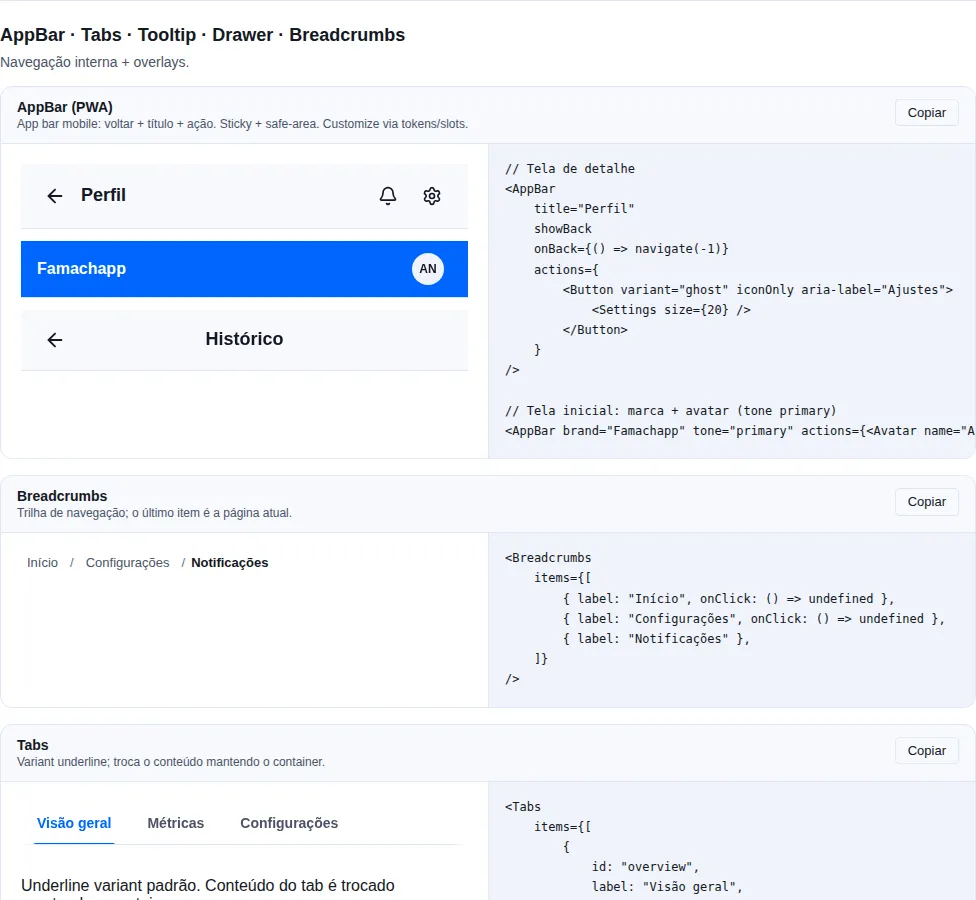
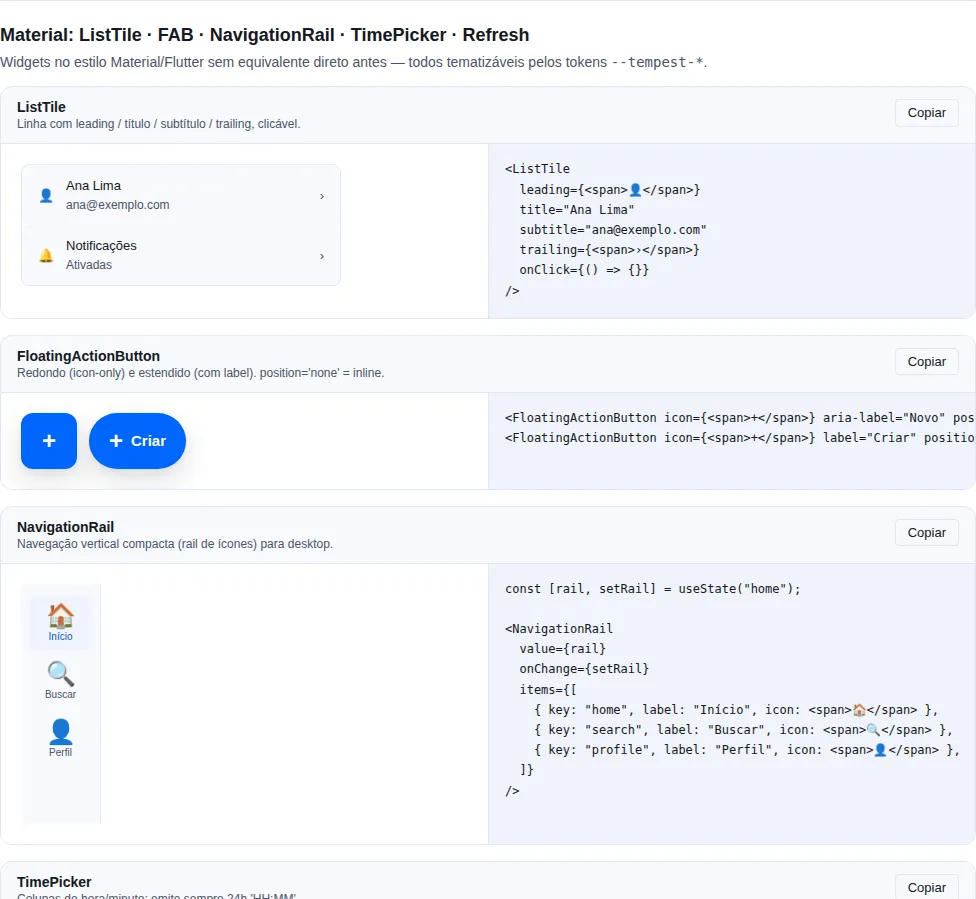
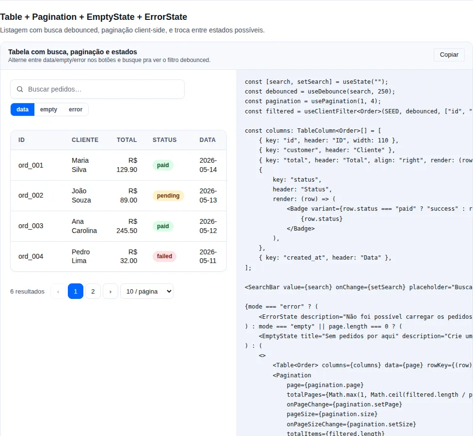

# Navigation

Top bars, side navs, bottom nav, tabs, breadcrumbs, pagination, segmented
control.

## What this category is

Components that help the user **orient and move** through the app. They split by
scope:

- **Primary navigation** (between app sections): `Navbar` (top), `Sidebar`
  (desktop side), `BottomNavigation` (mobile bottom) — typically the three slots
  of an `AppShell`.
- **Local navigation** (within a screen): `Tabs`, `SegmentedControl`, `Stepper`.
- **Orientation and traversal**: `Breadcrumbs` (where am I) and `Pagination`
  (next/previous in lists).

**When to use:** pick by scope — don't use `Tabs` to navigate between top-level
routes (that's `Navbar`/`Sidebar`), nor `Navbar` to switch views of the same
screen (that's `Tabs`/`SegmentedControl`).

!!! tip "Responsive Sidebar + BottomNavigation pattern"
    The idiomatic combo: `Sidebar` inside `<Show above="md">` on desktop and
    `BottomNavigation` inside `<Hide above="md">` on mobile, both sharing the
    same `value`/`onChange`. `AppShell` already does this swap automatically when
    you pass both slots.

## `Navbar`

<!-- gallery:nav-extra -->
[](../gallery.md)

*Section `nav-extra` of the [gallery](../gallery.md) — run it locally to interact.*
<!-- /gallery -->

**When to use:** a persistent top bar with brand + global actions (search,
avatar, notifications). It's the highest-level navigation.

Top app bar. Three slots (`logo` / `nav` / `actions`). Sticky by default.

```tsx
<Navbar
  logo={}
  nav={
    <>
      <NavLink to="/orders">Orders</NavLink>
      <NavLink to="/products">Products</NavLink>
    </>
  }
  actions={
    <>
      <Button variant="ghost" iconOnly aria-label="Search">
        <Search />
      </Button>
      <Avatar src={user.photo} />
    </>
  }
/>
```

| Prop       | Type                                      | Default     |
| ---------- | ----------------------------------------- | ----------- |
| `logo`     | `ReactNode`                               | —           |
| `nav`      | `ReactNode`                               | —           |
| `actions`  | `ReactNode`                               | —           |
| `sticky`   | `boolean`                                 | `true`      |
| `tone`     | `"surface" \| "primary" \| "transparent"` | `"surface"` |
| `bordered` | `boolean`                                 | `true`      |

**Safe-area**: applies `padding-top: max(space-3, env(safe-area-inset-top))`
automatically.

## `AppBar`

<!-- gallery:navigation -->
[](../gallery.md)

*Section `navigation` of the [gallery](../gallery.md) — run it locally to interact.*
<!-- /gallery -->

**When to use:** the **mobile-first PWA app bar** — the "back + title + action"
pattern every detail screen repeats. Use `AppBar` for mobile/PWA apps; use
`Navbar` when you want the desktop horizontal nav (three slots).

Grid layout: a **leading** slot (back button + brand) · the **title** (`<h1>`) ·
**actions** on the right. Sticky + safe-area by default. The back button is
accessible and, without `onBack`, falls back to `window.history.back()` — with a
router, pass `onBack={() => navigate(-1)}`.

```tsx
// Detail screen: back + an action
<AppBar
  title="Profile"
  showBack
  onBack={() => navigate(-1)}
  actions={
    <Button variant="ghost" iconOnly aria-label="Settings" onClick={openSettings}>
      <Settings />
    </Button>
  }
/>

// Home screen: brand on the left, no back
<AppBar brand="Famachapp" actions={<Avatar src={user.photo} />} />

// Centered title (iOS-style)
<AppBar title="History" showBack centered />
```

| Prop        | Type                                      | Default          |
| ----------- | ----------------------------------------- | ---------------- |
| `title`     | `ReactNode`                               | —                |
| `leading`   | `ReactNode` (replaces back + brand)       | —                |
| `showBack`  | `boolean`                                 | `false`          |
| `onBack`    | `() => void`                              | `history.back()` |
| `backLabel` | `string` (button aria-label)              | `"Go back"`      |
| `backIcon`  | `ReactNode`                               | ← arrow          |
| `brand`     | `ReactNode`                               | —                |
| `actions`   | `ReactNode`                               | —                |
| `centered`  | `boolean`                                 | `false`          |
| `sticky`    | `boolean`                                 | `true`           |
| `tone`      | `"surface" \| "primary" \| "transparent"` | `"surface"`      |
| `bordered`  | `boolean`                                 | `true`           |
| `safeArea`  | `boolean`                                 | `true`           |

!!! tip "Visual customization"
    The SDK ships only the layout + behaviour. Color, height and typography come
    from the `--tempest-*` tokens (override them on `:root`). For a custom
    icon/menu on the right, pass any node to `actions`; to replace the whole left
    side (e.g. an avatar instead of the back button), use `leading`.

!!! warning "Bar scrolling away?"
    It is almost never the `AppBar` — it is one line of your app's global CSS:

    ```css
    /* ❌ the horizontal clamp that kills sticky */
    body {
        overflow-x: hidden;
    }

    /* ✅ same clamp, no scroll container */
    html,
    body {
        overflow-x: clip;
    }
    ```

    `overflow-x: hidden` on the body forces the computed `overflow-y` to `auto` — a CSS rule, not a browser bug — which makes the body a **scroll container**. Every sticky element then pins to the body's scrollport instead of the viewport, and that scrollport travels with the document. Measured in Chromium at 390px on a long page: the bar sat at `top: -900px` after scrolling 900px. Off screen.

    On desktop the symptom barely shows, because screens usually fit without scrolling. On Chrome Android the collapsing URL bar turns every screen into a scrolling screen — and then it is gone every time.

    `clip` has to be on **both** elements: with it on only `html`, or only `body`, the document still pans sideways.

    In development the `AppBar` itself warns in the console when it detects this CSS. 💡

## `Sidebar`

Desktop side nav. `items: SidebarEntry[]` (items, sections and separators),
`header`/`footer` slots, a `collapsed` mode (icons only).

```tsx
const [tab, setTab] = useState("home");
const [collapsed, setCollapsed] = useState(false);

<Sidebar
  header={<Brand collapsed={collapsed} />}
  items={[
    { key: "home", label: "Home", icon: <Home /> },
    { key: "orders", label: "Orders", icon: <Package />, badge: 3 },
    { key: "settings", label: "Settings", icon: <Cog /> },
  ]}
  value={tab}
  onChange={setTab}
  footer={<Button onClick={() => setCollapsed(!collapsed)}>Collapse</Button>}
  collapsed={collapsed}
  width={240}
  collapsedWidth={64}
/>;
```

| Prop             | Type                           | Default |
| ---------------- | ------------------------------ | ------- |
| `header`         | `ReactNode`                    | —       |
| `items`          | `SidebarEntry[]`               | —       |
| `value`          | `string`                       | —       |
| `onChange`       | `(key: string) => void`        | —       |
| `footer`         | `ReactNode`                    | —       |
| `collapsed`      | `boolean`                      | `false` |
| `width`          | `number \| string` (px or CSS) | `240`   |
| `collapsedWidth` | `number \| string`             | `64`    |

```ts
type SidebarItem = { key, label, icon?, badge?, disabled?, href? };

type SidebarEntry =
  | ({ type?: "item" } & SidebarItem)
  | { type: "section"; key: string; label: ReactNode }
  | { type: "separator"; key: string };
```

`type` is optional on the item branch, so **a `SidebarItem[]` is still a valid
`SidebarEntry[]`** — no existing call site changes a line.

### Grouping into sections

A flat list works up to about 8 items. Past that it is a wall: 16 screens with no
headings leave "Diagnostics" visually glued to "Campaigns", and the admin loses the
anchor that told them which part of the panel they are in.

A section opens a group, and the items after it belong to it **until the next
section or separator**:

```tsx
import { useState } from "react";
import { Sidebar } from "tempest-react-sdk";
import { Activity, BarChart3, FileText, Settings, Users } from "lucide-react";

function AdminNav() {
  const [tab, setTab] = useState("overview");

  return (
    <Sidebar
      items={[
        { type: "section", key: "monitoring", label: "Monitoring" },
        { key: "overview", label: "Overview", icon: <BarChart3 /> },
        { key: "activity", label: "Activity", icon: <Activity /> },
        { key: "reports", label: "Reports", icon: <FileText /> },

        { type: "section", key: "users", label: "User management" },
        { key: "users", label: "Users", icon: <Users /> },

        { type: "separator", key: "before-admin" },
        { key: "settings", label: "Settings", icon: <Settings /> },
      ]}
      value={tab}
      onChange={setTab}
    />
  );
}
```

What comes out in the HTML:

```html
<nav aria-label="Navegação lateral">
  <div role="group" aria-labelledby="…-monitoring">
    <div id="…-monitoring" role="presentation">Monitoring</div>
    <!-- Overview, Activity, Reports -->
  </div>
  <div role="group" aria-labelledby="…-users">…</div>
  <hr />
  <div><!-- Settings, loose --></div>
</nav>
```

!!! info "Why `role="group"` and not a styled item"
    Using `disabled: true` as a heading renders `<button disabled>`: it passes
    visually with some CSS, but a screen reader announces **"button
    unavailable"** instead of a heading, and the entry stays in the navigation
    tree. With `role="group"` + `aria-labelledby` the announcement is "Monitoring,
    group, 3 items" — without inventing a button that does not exist.

!!! tip "Items before the first section stay loose"
    That is the behaviour you already had. An app that uses no sections sees no
    `role="group"` in the HTML — the list comes out exactly as before.

!!! warning "In `collapsed` mode the label leaves the view, not the tree"
    64px does not fit "User management", so the label becomes
    `clip-path: inset(50%)` and the group gains a divider on top. The
    `aria-labelledby` **still** points at it, so a screen reader does not lose the
    structure when the admin collapses the column.

### An item that is a link

`href` renders an `<a>` instead of a `<button>`, and `onChange` still fires on
click:

```tsx
<Sidebar
  items={[{ key: "overview", label: "Overview", href: "/overview" }]}
  value={tab}
  onChange={setTab}
/>
```

With that, middle-click opens a new tab, ctrl-click works, "copy link address"
shows up in the context menu, and a screen reader announces a link rather than a
button. A `disabled` item ignores `href` and stays a `<button disabled>`: an
anchor has no disabled state, and dropping the `href` to fake one leaves a link
that announces itself as actionable and is not.

**Mobile**: hide it with `<Show above="md">` and expose it via `<Drawer>` in the
hamburger menu.

## `NavigationRail`

<!-- gallery:material -->
[](../gallery.md)

*Section `material` of the [gallery](../gallery.md) — run it locally to interact.*
<!-- /gallery -->

**When to use:** a compact, vertical navigation column for desktop/tablet — a
narrower alternative to `Sidebar` when you only need icons stacked over short
labels. Each item stacks an icon over its label; the active one gets
`aria-current="page"`.

`items: NavigationRailItem[]`, `header`/`footer` slots, and label control via
`labelVisibility`.

```tsx
import { useState } from "react";
import { NavigationRail, FloatingActionButton } from "tempest-react-sdk";
import { Home, Inbox, Settings, Plus } from "lucide-react";

function AppRail() {
  const [tab, setTab] = useState("home");

  return (
    <NavigationRail
      header={<FloatingActionButton icon={<Plus />} aria-label="New" position="none" />}
      items={[
        { key: "home", label: "Home", icon: <Home /> },
        { key: "inbox", label: "Inbox", icon: <Inbox />, badge: 3 },
        { key: "settings", label: "Settings", icon: <Settings /> },
      ]}
      value={tab}
      onChange={setTab}
      labelVisibility="all"
    />
  );
}
```

| Prop              | Type                            | Default |
| ----------------- | ------------------------------- | ------- |
| `items`           | `NavigationRailItem[]`          | —       |
| `value`           | `string` (selected key)         | —       |
| `onChange`        | `(key: string) => void`         | —       |
| `header`          | `ReactNode` (top — e.g. a FAB)  | —       |
| `footer`          | `ReactNode` (bottom)            | —       |
| `labelVisibility` | `"all" \| "selected" \| "none"` | `"all"` |

Type `NavigationRailItem = { key, label, icon?, badge?, disabled? }`.

!!! tip "`labelVisibility` controls the density"
    Use `"selected"` to show only the active item's label (a narrower rail) or
    `"none"` for an icon-only rail. On small screens prefer `BottomNavigation`.

## `BottomNavigation`

A bottom-fixed tab bar for mobile. 3-5 items.

```tsx
<Show below="md">
  <BottomNavigation
    items={[
      { key: "home", label: "Home", icon: <Home /> },
      { key: "search", label: "Search", icon: <Search /> },
      { key: "cart", label: "Cart", icon: <Cart />, badge: cartCount },
      { key: "profile", label: "Profile", icon: <User /> },
    ]}
    value={tab}
    onChange={setTab}
  />
</Show>
```

| Prop         | Type                           | Default |
| ------------ | ------------------------------ | ------- |
| `items`      | `BottomNavigationItem[]` (3–5) | —       |
| `value`      | `string`                       | —       |
| `onChange`   | `(key: string) => void`        | —       |
| `showLabels` | `boolean`                      | `true`  |

Type `BottomNavigationItem = { key, label, icon?, badge?, disabled? }`.

**Safe-area**: applies `padding-bottom: env(safe-area-inset-bottom)`
automatically.

## `Tabs`

**When to use:** switch between content panels **within a single screen**
(overview / details / logs). Don't use it to navigate between routes.

Controlled/uncontrolled tabs. Fade-edge mask on horizontal overflow. Visual
variants via `variant` (`"underline"` default or `"pill"`).

```tsx
<Tabs
  value={tab}
  onChange={setTab}
  items={[
    { key: "overview", label: "Overview", content: <Overview /> },
    { key: "details", label: "Details", content: <Details /> },
    { key: "logs", label: "Logs", content: <Logs /> },
  ]}
/>
```

| Prop           | Type                    | Default |
| -------------- | ----------------------- | ------- |
| `items`        | `TabItem[]`             | —       |
| `value`        | `string` (controlled)   | —       |
| `defaultValue` | `string` (uncontrolled) | —       |
| `onChange`     | `(key: string) => void` | —       |

## `Stepper`

<!-- gallery:advanced -->
[](../gallery.md)

*Section `advanced` of the [gallery](../gallery.md) — run it locally to interact.*
<!-- /gallery -->

**When to use:** show progress through a linear multi-step flow (checkout,
onboarding, wizard). It's a progress indicator, not a selector — drive `current`
from your flow logic.

A linear wizard with numbered steps. `orientation` accepts `"horizontal"`
(default) or `"vertical"`.

```tsx
<Stepper
  current={step}
  steps={[
    { key: "info", label: "Information" },
    { key: "payment", label: "Payment" },
    { key: "review", label: "Review" },
  ]}
/>
```

## `Breadcrumbs`

**When to use:** signal position in a deep hierarchy (Home › Orders › #12345)
and allow jumping back to previous levels. Skippable in 1-2 level apps.

Hierarchical navigation.

```tsx
<Breadcrumbs
  items={[{ label: "Home", href: "/" }, { label: "Orders", href: "/orders" }, { label: "#12345" }]}
/>
```

**A11y**: the last item is marked with `aria-current="page"`.

## `Pagination`

<!-- gallery:table -->
[](../gallery.md)

*Section `table` of the [gallery](../gallery.md) — run it locally to interact.*
<!-- /gallery -->

**When to use:** walk large lists in discrete pages (search results, tables).
For continuous feeds prefer infinite scroll (`VirtualList` + `usePoll`/Query).

Numeric with siblings + an optional page-size selector.

!!! note "`page` is 1-indexed, `total` is the item count"
    `total` is the number **of items** (not pages) — the component derives the
    pages from `pageSize`. Remember to reset `page` to `1` when the filter
    changes, otherwise you may land on a page that no longer exists.

```tsx
<Pagination
  page={page}
  pageSize={size}
  total={data?.total ?? 0}
  onPageChange={setPage}
  onPageSizeChange={setSize}
  siblings={1}
/>
```

| Prop               | Type                     | Default |
| ------------------ | ------------------------ | ------- |
| `page`             | `number` (1-indexed)     | —       |
| `pageSize`         | `number`                 | —       |
| `total`            | `number` (item count)    | —       |
| `onPageChange`     | `(page: number) => void` | —       |
| `onPageSizeChange` | `(size: number) => void` | —       |
| `siblings`         | `number` (neighbors)     | `1`     |

## `SegmentedControl`

**When to use:** toggle between 2-5 mutually exclusive views of the same screen
(list/grid/map). It's more compact than `Tabs` and has no built-in content
panels — you swap the view manually via `value`.

An iOS-style pill bar (2-5 options).

```tsx
<SegmentedControl
  value={view}
  onChange={setView}
  options={[
    { value: "list", label: "List", icon: <List /> },
    { value: "grid", label: "Grid", icon: <Grid /> },
    { value: "map", label: "Map", icon: <Map /> },
  ]}
  size="md"
  fullWidth
/>
```

| Prop        | Type                       | Default |
| ----------- | -------------------------- | ------- |
| `options`   | `SegmentedControlOption[]` | —       |
| `value`     | `string`                   | —       |
| `onChange`  | `(value: string) => void`  | —       |
| `size`      | `"sm" \| "md" \| "lg"`     | `"md"`  |
| `fullWidth` | `boolean`                  | `false` |

**A11y**: `role="radiogroup"` + `role="radio"` with `aria-checked`.

## General A11y

- Navbar: uses `<nav>` (already included); mark active items with `aria-current="page"`.
- Sidebar/BottomNavigation: keyboard accessible — Tab cycles between items.
- Tabs: ←→ arrows switch tabs when focused.
- Breadcrumbs: the separator (`/`) is decorative (aria-hidden).

!!! warning "Mark the active item with `aria-current`"
    Navbar/Sidebar/BottomNavigation need the current-route item to carry
    `aria-current="page"` — without it, screen readers don't announce where the
    user is. `Breadcrumbs` already does this on the last item automatically.

## Recap

- Pick by **scope**: `Navbar`/`Sidebar`/`NavigationRail`/`BottomNavigation` to
  navigate between sections; `Tabs`/`SegmentedControl`/`Stepper` to move within a
  screen.
- The trio `Navbar` + `Sidebar` + `BottomNavigation` are the `AppShell` slots —
  let it orchestrate the desktop/mobile swap.
- `Pagination` for paged lists; `Breadcrumbs` for deep hierarchies.
- Always mark the active item with `aria-current="page"` in primary navigation.

Related pages:

- [Layout](./layout.md) — `AppShell` composing `Navbar`/`Sidebar`/
  `BottomNavigation` + `Page`.
- [Overlays](./overlay.md) — `Drawer` to expose the `Sidebar` in the mobile
  hamburger menu.
- [Data](./data.md) — `Table`/`DataTable` that use `Pagination` in the footer.
- [Routing](../routing.md) — `defineRoutes`/`<AppRouter>`/`<RouteGuard>` that
  wire navigation to routes.
