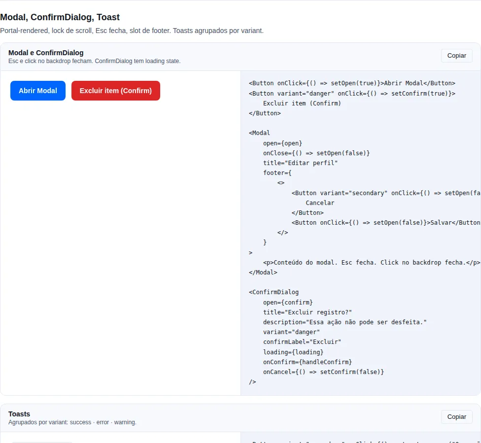
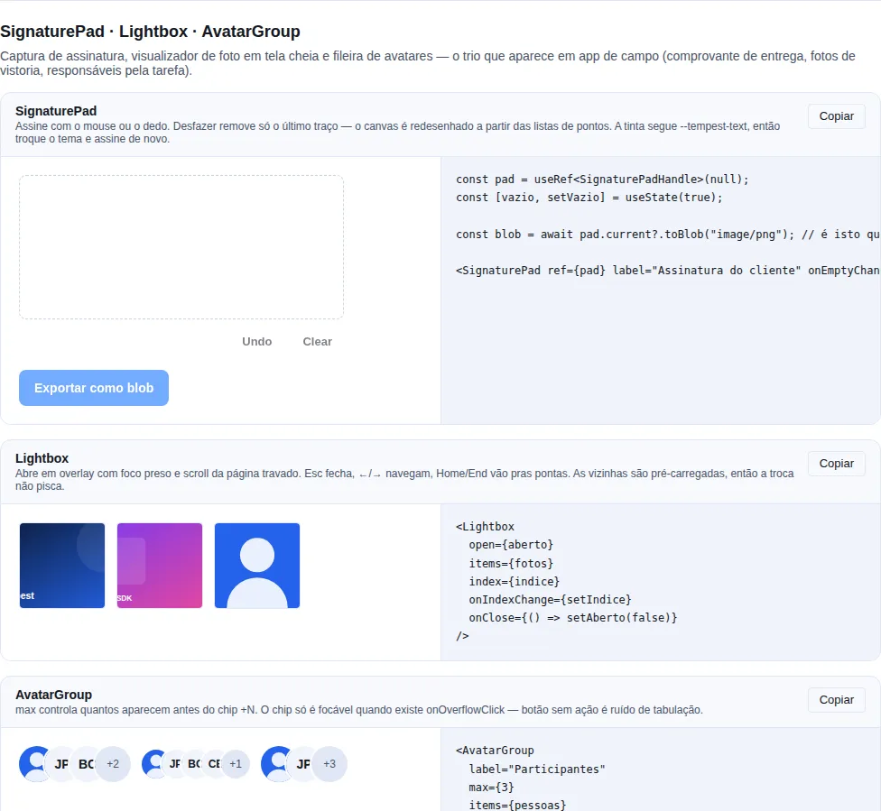

# Overlay

Componentes de **overlay** interrompem o fluxo principal para focar a atenção numa tarefa isolada — eles aparecem _por cima_ da página, com backdrop, e capturam o foco até serem fechados. Use-os quando o usuário precisa lidar com algo (editar um registro, confirmar, escolher uma opção) sem perder o contexto da tela de fundo, mas sem poder ignorá-lo.

Os três compartilham o mesmo motor (portal para `document.body` + backdrop + Esc + focus trap + scroll lock) e diferem só na ancoragem e na vocação:

- `Modal` — centralizado, propósito geral.
- `Drawer` — ancorado a uma borda, painel lateral.
- `BottomSheet` — ancorado embaixo, mobile-first.

!!! info "Tudo é portalado"
    Os três renderizam em `document.body`, fora da árvore do componente que os invoca. Isso evita problemas de `overflow: hidden` / `z-index` de ancestrais, mas significa que estilos com escopo no pai não vazam para dentro do overlay.

## `Modal`

<!-- gallery:modal -->
[](../gallery.md)

*Seção `modal` da [gallery](../gallery.md) — rode localmente para interagir.*
<!-- /gallery -->

> **Quando usar**: um fluxo central que pausa o contexto — criar/editar um registro, um wizard curto, um form que exige atenção total.

Portal + backdrop + Esc + focus trap + scroll lock.

```tsx
import { useState } from "react";
import { Button, FormActions, Modal } from "tempest-react-sdk";

export function EditarPerfil({ save }: { save: () => void }) {
    const [open, setOpen] = useState(false);

    return (
        <Modal
            open={open}
            onClose={() => setOpen(false)}
            title="Editar perfil"
            size="md"
            footer={
                <FormActions>
                    <Button variant="ghost" onClick={() => setOpen(false)}>
                        Cancelar
                    </Button>
                    <Button onClick={save}>Salvar</Button>
                </FormActions>
            }
        >
            <p>O formulário do perfil entra aqui.</p>
        </Modal>
    );
}
```

| Prop                 | Tipo                                             | Default |
| -------------------- | ------------------------------------------------ | ------- |
| `open`               | `boolean`                                        | —       |
| `onClose`            | `() => void`                                     | —       |
| `title`              | `ReactNode`                                      | —       |
| `size`               | `"sm" \| "md" \| "lg" \| "xl" \| "2xl" \| "3xl"` | `"md"`  |
| `footer`             | `ReactNode`                                      | —       |
| `fullscreen`         | `boolean` (ocupa 100dvh independente do size)    | `false` |
| `fullscreenOnMobile` | `boolean` (vira fullscreen abaixo de 640px)      | `false` |
| `dismissOnBackdrop`  | `boolean`                                        | `true`  |
| `dismissOnEsc`       | `boolean`                                        | `true`  |

!!! tip "Safe-area em fullscreen"
    Em `fullscreen` o Modal aplica `env(safe-area-inset-*)` em todos os edges, respeitando notch e barra de gestos. Use `fullscreenOnMobile` para um modal denso virar tela cheia abaixo de 640px em vez de espremer num cartão minúsculo.

**A11y**: `role="dialog"` + `aria-modal="true"` + `aria-labelledby` quando `title` é string. O foco fica preso dentro do dialog e volta ao trigger ao fechar.

## `Drawer`

<!-- gallery:navigation -->
[](../gallery.md)

*Seção `navigation` da [gallery](../gallery.md) — rode localmente para interagir.*
<!-- /gallery -->

> **Quando usar**: um painel lateral persistente que complementa a tela de fundo — filtros, detalhes de um item, navegação secundária. Encosta numa borda em vez de centralizar.

Side drawer. `placement: left/right/top/bottom`. Auto-switch pra bottom-sheet em mobile via `mobilePlacement`.

```tsx
import { useState } from "react";
import { Button, Drawer } from "tempest-react-sdk";

export function GavetaDeFiltros({ apply }: { apply: () => void }) {
    const [open, setOpen] = useState(false);

    return (
        <Drawer
            open={open}
            onClose={() => setOpen(false)}
            placement="right"
            mobilePlacement="bottom"
            title="Filtros"
            showHandle
            footer={<Button onClick={apply}>Aplicar</Button>}
        >
            <p>O formulário do perfil entra aqui.</p>
        </Drawer>
    );
}
```

| Prop              | Tipo                                                          | Default   |
| ----------------- | ------------------------------------------------------------- | --------- |
| `open`            | `boolean`                                                     | —         |
| `onClose`         | `() => void`                                                  | —         |
| `placement`       | `"left" \| "right" \| "top" \| "bottom"`                      | `"right"` |
| `mobilePlacement` | `"left" \| "right" \| "top" \| "bottom"` (override em mobile) | —         |
| `title`           | `ReactNode`                                                   | —         |
| `footer`          | `ReactNode`                                                   | —         |
| `showHandle`      | `boolean` (drag indicator estilo bottom-sheet)                | `false`   |
| `hideCloseButton` | `boolean`                                                     | `false`   |
| `closeOnBackdrop` | `boolean`                                                     | `true`    |
| `closeOnEsc`      | `boolean`                                                     | `true`    |

!!! note "Drawer dimensiona pelo conteúdo, não por `size`"
    Diferente do `Modal`, o `Drawer` não tem prop `size` — a largura/altura segue o conteúdo (e o CSS do placement). Para um painel mobile-first com largura total e altura limitada, prefira `BottomSheet` ou `mobilePlacement="bottom"`.

## `BottomSheet`

<!-- gallery:feedback-extra -->
[](../gallery.md)

*Seção `feedback-extra` da [gallery](../gallery.md) — rode localmente para interagir.*
<!-- /gallery -->

> **Quando usar**: ações ou escolhas mobile-first que sobem do rodapé — menu de compartilhar, opções de um item, seletor curto. É o padrão nativo de iOS/Android.

Modal ancorado na borda inferior — slide-up via animation. Otimizado pra mobile.

```tsx
import { useState } from "react";
import { BottomSheet, Button, Stack } from "tempest-react-sdk";
import { Link, Mail, MessageCircle } from "lucide-react";

export function Compartilhar() {
    const [open, setOpen] = useState(false);

    return (
        <BottomSheet open={open} onClose={() => setOpen(false)} title="Compartilhar">
            <Stack gap={3}>
                <Button leftIcon={<MessageCircle size={16} />}>WhatsApp</Button>
                <Button leftIcon={<Mail size={16} />}>Email</Button>
                <Button leftIcon={<Link size={16} />}>Copiar link</Button>
            </Stack>
        </BottomSheet>
    );
}
```

| Prop                | Tipo         | Default |
| ------------------- | ------------ | ------- |
| `open`              | `boolean`    | —       |
| `onClose`           | `() => void` | —       |
| `title`             | `ReactNode`  | —       |
| `showHandle`        | `boolean`    | `true`  |
| `dismissOnBackdrop` | `boolean`    | `true`  |
| `dismissOnEsc`      | `boolean`    | `true`  |

!!! tip "Safe-area automática"
    O `BottomSheet` adiciona `padding-bottom` respeitando `env(safe-area-inset-bottom)`, então os controles não ficam escondidos atrás da barra de gestos em iPhones/Androids modernos.

**Diferença vs `Drawer`**: BottomSheet é sempre slide-up + max-height 90dvh + drag handle. Use `Drawer` quando precisa de placement variável (lateral/topo) ou de comportamento diferente entre desktop e mobile.

!!! warning "Cuidado ao desligar `closeOnBackdrop`/`dismissOnBackdrop`"
    Desabilitar o dismiss por backdrop ou Esc prende o usuário no overlay até concluir a tarefa. Faça isso só em forms verdadeiramente críticos (perda de dados) — caso contrário sempre ofereça uma saída clara, ou a navegação por teclado vira uma armadilha.

## `ModalsManager`

> **Quando usar**: quando você quer abrir modais e confirmações de forma **imperativa** — direto de um handler, sem montar `<Modal open={...}>` controlado por estado local em cada lugar. Ideal para confirmações de exclusão e diálogos pontuais.

`<ModalsProvider>` monta uma vez perto da raiz e gerencia uma pilha de modais; `useModals()` expõe a API imperativa sobre os componentes `Modal` e `ConfirmDialog` já existentes.

```tsx
import { ModalsProvider, useModals, Button } from "tempest-react-sdk";

// raiz do app
<ModalsProvider>
  <App />
</ModalsProvider>;

// em qualquer componente abaixo do provider
function DeleteButton({ id }: { id: string }) {
  const modals = useModals();
  return (
    <Button
      variant="danger"
      onClick={() =>
        modals.confirm({
          title: "Excluir item",
          message: "Esta ação não pode ser desfeita. Continuar?",
          confirmLabel: "Excluir",
          danger: true,
          onConfirm: async () => {
            await fetch(`/api/items/${id}`, { method: "DELETE" });
          },
        })
      }
    >
      Excluir
    </Button>
  );
}
```

| `useModals()` | Assinatura                                | O que faz                                |
| ------------- | ----------------------------------------- | ---------------------------------------- |
| `open`        | `(options: OpenModalOptions) => string`   | Empilha um modal de conteúdo; retorna o id. |
| `confirm`     | `(options: ConfirmModalOptions) => string` | Empilha um `ConfirmDialog`; retorna o id. |
| `close`       | `(id: string) => void`                    | Remove o modal com aquele id.            |
| `closeAll`    | `() => void`                              | Remove todos os modais da pilha.         |

!!! info "Construído sobre os componentes existentes"
    `open` renderiza um `Modal` e `confirm` renderiza um `ConfirmDialog` — você herda focus trap, scroll lock, Esc e backdrop sem configurar nada. O `onConfirm` pode ser `async`: o dialog mostra `loading` até a promise resolver e fecha sozinho ao terminar.

!!! warning "Precisa do `<ModalsProvider>` acima"
    `useModals()` lança um erro se chamado fora de um `<ModalsProvider>`. Monte o provider uma única vez perto da raiz do app.

## `Lightbox`

<!-- gallery:capture-media -->
[](../gallery.md)

*Seção `capture-media` da [gallery](../gallery.md) — rode localmente para interagir.*
<!-- /gallery -->

> **Quando usar**: visualizar foto em tela cheia com navegação — galeria de imóvel, anexos de uma ocorrência, fotos de vistoria.

Overlay `role="dialog" aria-modal` com foco preso dentro e rolagem da página travada. Só a imagem atual é montada; as vizinhas são **pré-carregadas** via `Image()`, então apertar `→` não pisca um quadro vazio.

```tsx
import { Lightbox } from "tempest-react-sdk";
import { useState } from "react";

export function GaleriaDaVistoria({ fotos }: { fotos: { url: string; descricao: string }[] }) {
  const [aberto, setAberto] = useState(false);
  const [indice, setIndice] = useState(0);

  return (
    <>
      <div className="tempest-grid-auto">
        {fotos.map((foto, i) => (
          <button key={foto.url} type="button" onClick={() => { setIndice(i); setAberto(true); }}>
            
          </button>
        ))}
      </div>

      <Lightbox
        open={aberto}
        items={fotos.map((f) => ({ src: f.url, alt: f.descricao }))}
        index={indice}
        onIndexChange={setIndice}
        onClose={() => setAberto(false)}
      />
    </>
  );
}
```

| Prop             | Tipo                       | Default             | O que faz                                     |
| ---------------- | -------------------------- | ------------------- | --------------------------------------------- |
| `items`          | `LightboxItem[]`           | —                   | Imagens da galeria.                           |
| `open`           | `boolean`                  | —                   | Controla a visibilidade.                      |
| `index`          | `number`                   | `0`                 | Índice exibido.                               |
| `onIndexChange`  | `(index: number) => void`  | —                   | Passar isso torna o índice **controlado**.     |
| `onClose`        | `() => void`               | —                   | Chamado no `Esc` e no botão fechar.            |
| `showThumbnails` | `boolean`                  | `true` se > 1 item  | Faixa de miniaturas.                           |
| `showCounter`    | `boolean`                  | `true`              | Contador `3 / 12`.                             |
| `loop`           | `boolean`                  | `true`              | Circula nas pontas.                            |

`LightboxItem = { src, alt, caption?, thumbnail? }` — `alt` é **obrigatório**: galeria de imagem sem rótulo é inutilizável em leitor de tela.

**Teclado**: `Esc` fecha · `←`/`→` navegam · `Home`/`End` vão pras pontas.

!!! note "`loop` é `true` de propósito"
    Em visualizador de foto, esbarrar num fim morto na última imagem é lido como bug mais vezes do que como limite. Passe `loop={false}` quando a ordem tem significado (um passo-a-passo, por exemplo) — aí os botões de navegação desabilitam nas pontas.

## Tela cheia

Todo overlay do SDK monta por portal, e o alvo do portal segue o elemento em
**tela cheia** quando existe um — `Modal`, `Drawer`, `BottomSheet`,
`ToastProvider`, `Command` e o `<Portal>` genérico.

Isso não é conveniência: é correção. Enquanto a página está em tela cheia, o
browser pinta **apenas a subárvore do elemento em tela cheia**, e `document.body`
está fora dela. Um overlay montado em `body` existe no DOM, tem caixa medida, e
não é visto nem clicado — `elementFromPoint` no centro dele devolve o que está
atrás. Nada lança e nada aparece no console.

```tsx
import { useRef, useState } from "react";
import { Button, Modal } from "tempest-react-sdk";

export function Chamada() {
    const palco = useRef<HTMLDivElement>(null);
    const [aberto, setAberto] = useState(false);

    return (
        <div ref={palco}>
            <Button onClick={() => palco.current?.requestFullscreen()}>Tela cheia</Button>
            <Button onClick={() => setAberto(true)}>Áudio e vídeo</Button>

            <Modal open={aberto} onClose={() => setAberto(false)} title="Áudio e vídeo">
                O diálogo aparece dentro do elemento em tela cheia.
            </Modal>
        </div>
    );
}
```

!!! tip "O alvo acompanha, não é lido uma vez"
    Entrar ou sair de tela cheia com um diálogo já aberto **move** o diálogo: o
    host é estado e escuta `fullscreenchange` (mais o `webkitfullscreenchange`
    que o WebKit ainda emite). O diálogo continua montado e não perde estado.

!!! note "`container` continua mandando"
    `<Portal container={…}>` fixa o alvo e ignora a tela cheia. Use quando você
    precisa de um destino específico — um root de layout, um nó fora de um
    `overflow`.

## A11y geral

- **Focus trap**: Tab circula apenas dentro do dialog. Restaura o foco no trigger ao fechar.
- **Scroll lock**: `body.overflow = "hidden"` enquanto aberto.
- **Esc** fecha (`Modal`/`BottomSheet`: `dismissOnEsc={false}`; `Drawer`: `closeOnEsc={false}`).
- **`aria-modal="true"`** indica para leitores de tela que o resto da página está bloqueado.
- **Backdrop**: clicks fecham (`Modal`/`BottomSheet`: `dismissOnBackdrop={false}`; `Drawer`: `closeOnBackdrop={false}`).

## Resumo

| Componente    | Ancoragem        | Vocação                           | Prop de dismiss                    |
| ------------- | ---------------- | --------------------------------- | ---------------------------------- |
| `Modal`       | centralizado     | fluxos centrais (criar/editar)    | `dismissOnBackdrop`/`dismissOnEsc` |
| `Drawer`      | borda (variável) | painéis laterais persistentes     | `closeOnBackdrop`/`closeOnEsc`     |
| `BottomSheet` | borda inferior   | ações mobile-first (compartilhar) | `dismissOnBackdrop`/`dismissOnEsc` |
| `ModalsManager` | pilha (imperativa) | abrir modais/confirmações via código | `useModals().close`/`closeAll`     |

Para confirmação destrutiva pré-montada, use o `ConfirmDialog` ([actions](./actions.md)), construído sobre o `Modal`. Para abrir modais imperativamente (sem estado local), use `<ModalsProvider>` + `useModals()`.

Relacionados: [actions](./actions.md) (`ConfirmDialog`, botões no `footer`) · [inputs](./inputs.md) (forms dentro do overlay) · [navigation](./navigation.md) (`Drawer` como nav secundária).
