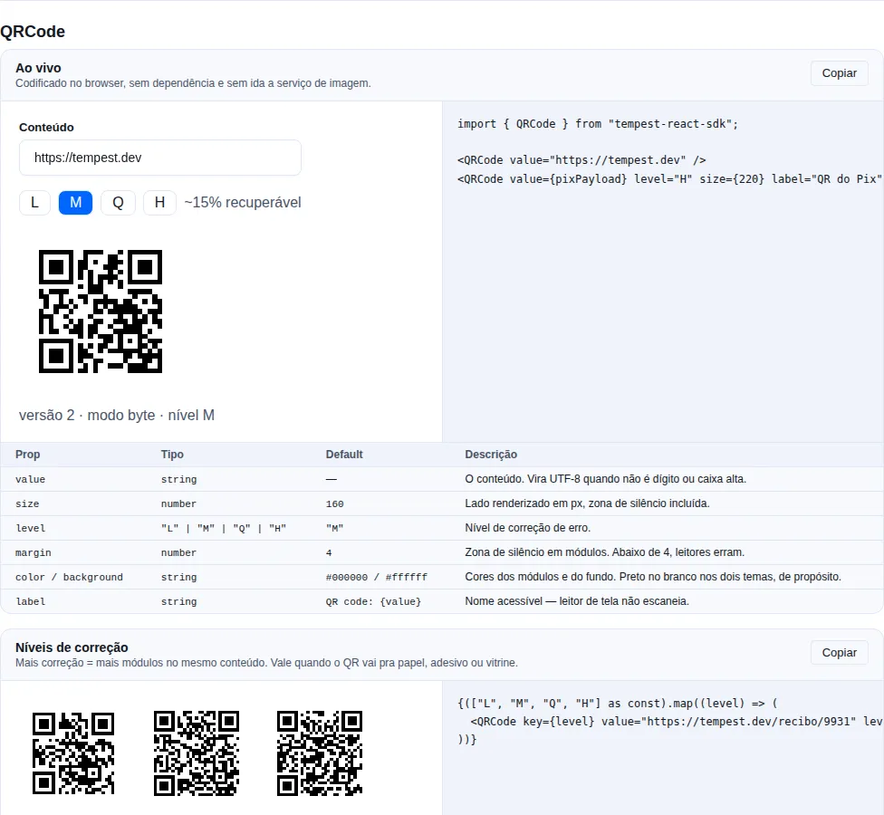

# Utilitários & headless

Componentes pequenos e focados: alguns renderizam pedaços de UI (`Money`, `RelativeTime`, `CopyButton`), outros são **headless** — controlam comportamento/lógica sem opinar sobre o visual (`Portal`, `ClickOutside`, `For`). Todos importados de `tempest-react-sdk`.

## Display

### `CopyButton`

<!-- gallery:data-display -->
[](../gallery.md)

*Seção `data-display` da [gallery](../gallery.md) — rode localmente para interagir.*
<!-- /gallery -->

Botão que copia uma string pra clipboard e mostra um estado transiente de "copiado".

```tsx
import { CopyButton } from "tempest-react-sdk";

<CopyButton value="npm i tempest-react-sdk" />;

<CopyButton value={token} timeout={3000} onCopied={() => toast("Token copiado")}>
  Copiar token
</CopyButton>;
```

| Prop       | Tipo          | Default             | Notas                                                        |
| ---------- | ------------- | ------------------- | ------------------------------------------------------------ |
| `value`    | `string`      | —                   | Texto escrito no clipboard.                                  |
| `timeout`  | `number` (ms) | `2000`              | Quanto tempo o estado "copiado" fica ativo.                  |
| `children` | `ReactNode`   | `"Copy"`/`"Copied"` | Label fixo nos dois estados; sem `children` o texto alterna. |
| `onCopied` | `() => void`  | —                   | Chamado após escrita bem-sucedida.                           |

Estende `ButtonHTMLAttributes`. Falha de clipboard é silenciada; o timer é limpo no unmount.

### `RelativeTime`

Renderiza uma data como string relativa ("5 min atrás") dentro de um `<time>` semântico com `dateTime` legível por máquina.

```tsx
import { RelativeTime } from "tempest-react-sdk";

<RelativeTime date={post.createdAt} />; // pt-BR
<RelativeTime date={post.createdAt} locale="en" />;
```

| Prop     | Tipo                       | Default | Notas                        |
| -------- | -------------------------- | ------- | ---------------------------- |
| `date`   | `Date \| string \| number` | —       | Instante a renderizar.       |
| `locale` | `"pt" \| "en"`             | `"pt"`  | `"pt"` mapeia pra `"pt-BR"`. |

Estende `HTMLAttributes<HTMLTimeElement>`.

### `Money`

Renderiza um valor monetário **em centavos** como string de moeda localizada num `<span>`.

```tsx
import { Money } from "tempest-react-sdk";

<Money cents={1990} />; // "R$ 19,90"
<Money cents={500} currency="USD" locale="en-US" />; // "$5.00"
```

| Prop       | Tipo     | Default   | Notas                              |
| ---------- | -------- | --------- | ---------------------------------- |
| `cents`    | `number` | —         | Valor na menor unidade (centavos). |
| `currency` | `string` | `"BRL"`   | Código ISO 4217.                   |
| `locale`   | `string` | `"pt-BR"` | Locale BCP 47 usado na formatação. |

Estende `HTMLAttributes<HTMLSpanElement>`. Internamente divide `cents` por 100 e usa `Intl.NumberFormat`.

### `TruncateText`

Limita o texto a um número fixo de linhas via CSS line-clamp, com reticências no overflow.

```tsx
import { TruncateText } from "tempest-react-sdk";

<TruncateText lines={2}>{longDescription}</TruncateText>;
```

| Prop       | Tipo        | Default | Notas                                              |
| ---------- | ----------- | ------- | -------------------------------------------------- |
| `lines`    | `number`    | `1`     | Linhas antes de clampar (`--tempest-clamp-lines`). |
| `children` | `ReactNode` | —       | Conteúdo a clampar.                                |

Estende `HTMLAttributes<HTMLDivElement>`.

### `VisuallyHidden`

<!-- gallery:headless -->
[](../gallery.md)

*Seção `headless` da [gallery](../gallery.md) — rode localmente para interagir.*
<!-- /gallery -->

Conteúdo escondido visualmente mas acessível a leitores de tela — o padrão `sr-only`.

```tsx
import { VisuallyHidden } from "tempest-react-sdk";

<button>
  <Icon />
  <VisuallyHidden>Fechar</VisuallyHidden>
</button>;
```

| Prop | Tipo                          | Default  | Notas                             |
| ---- | ----------------------------- | -------- | --------------------------------- |
| `as` | `keyof JSX.IntrinsicElements` | `"span"` | Elemento intrínseco a renderizar. |

Estende `HTMLAttributes<HTMLElement>`.

---

## Headless / lógicos

Sem CSS próprio: encapsulam comportamento e te deixam fornecer a marcação.

### `Portal`

Renderiza os filhos em outra parte da árvore DOM via React portal — ideal pra overlays que precisam escapar de `overflow`/stacking contexts.

```tsx
import { Portal } from "tempest-react-sdk";

<Portal>
  <div className="toast">Salvo!</div>
</Portal>;

<Portal container={drawerRoot}>{menu}</Portal>;
```

| Prop        | Tipo              | Default         | Notas                                   |
| ----------- | ----------------- | --------------- | --------------------------------------- |
| `children`  | `ReactNode`       | —               | Conteúdo renderizado através do portal. |
| `container` | `Element \| null` | `document.body` | Nó DOM alvo.                            |

!!! info "SSR-safe"
    Renderiza `null` no servidor e no primeiro render do cliente; monta o portal só depois da hidratação.

### `ClickOutside`

Embrulha os filhos num `<div>` e dispara `onOutside` quando um `mousedown`/`touchstart` acontece fora da subárvore. Útil pra fechar popovers e menus.

```tsx
import { ClickOutside } from "tempest-react-sdk";

<ClickOutside onOutside={() => setOpen(false)}>
  <Menu />
</ClickOutside>;
```

| Prop        | Tipo                                        | Default | Notas                         |
| ----------- | ------------------------------------------- | ------- | ----------------------------- |
| `onOutside` | `(event: MouseEvent \| TouchEvent) => void` | —       | Chamado em interação externa. |
| `children`  | `ReactNode`                                 | —       | Conteúdo dentro da fronteira. |

Estende `HTMLAttributes<HTMLDivElement>` (passa props pro `<div>` wrapper).

### `ConditionalWrapper`

Embrulha os filhos com `wrapper` só quando `condition` é `true` — evita duplicar a subárvore só pra adicionar um wrapper opcional (link, tooltip, boundary).

```tsx
import { ConditionalWrapper } from "tempest-react-sdk";

<ConditionalWrapper condition={Boolean(href)} wrapper={(children) => <a href={href}>{children}</a>}>
  <CardBody />
</ConditionalWrapper>;
```

| Prop        | Tipo                                 | Default | Notas                              |
| ----------- | ------------------------------------ | ------- | ---------------------------------- |
| `condition` | `boolean`                            | —       | Quando `true`, aplica o `wrapper`. |
| `wrapper`   | `(children: ReactNode) => ReactNode` | —       | Função de embrulho.                |
| `children`  | `ReactNode`                          | —       | Conteúdo que pode ser embrulhado.  |

### `For`

Renderizador de listas tipado e JSX-friendly, com fallback pra coleção vazia. O tipo do item é inferido de `each`.

```tsx
import { For } from "tempest-react-sdk";

<For each={users} fallback={<p>Nenhum usuário</p>}>
  {(user, index) => (
    <li key={user.id}>
      {index + 1}. {user.name}
    </li>
  )}
</For>;
```

| Prop       | Tipo                                    | Default | Notas                                 |
| ---------- | --------------------------------------- | ------- | ------------------------------------- |
| `each`     | `readonly T[]`                          | —       | Coleção a iterar.                     |
| `children` | `(item: T, index: number) => ReactNode` | —       | Render por item.                      |
| `fallback` | `ReactNode`                             | `null`  | Renderizado quando `each` está vazio. |

### `ErrorText`

<!-- gallery:inputs-extra -->
[](../gallery.md)

*Seção `inputs-extra` da [gallery](../gallery.md) — rode localmente para interagir.*
<!-- /gallery -->

Mensagem de erro de campo de formulário como `<p role="alert">`. Renderiza `null` quando não há children — pode ficar fixo abaixo do campo e só aparece quando há erro.

```tsx
import { ErrorText } from "tempest-react-sdk";

<input aria-invalid={Boolean(error)} />
<ErrorText>{error}</ErrorText>;
```

| Prop       | Tipo        | Default | Notas                                               |
| ---------- | ----------- | ------- | --------------------------------------------------- |
| `children` | `ReactNode` | —       | Mensagem; `null`/`""`/`false` → não renderiza nada. |

Estende `HTMLAttributes<HTMLParagraphElement>`. Estilizado com o token `--tempest-danger`.

---

## Mídia / conteúdo

### `Image`

<!-- gallery:display-media -->
[](../gallery.md)

*Seção `display-media` da [gallery](../gallery.md) — rode localmente para interagir.*
<!-- /gallery -->

`` com lazy loading nativo e fallback de uma tentativa.

```tsx
import { Image } from "tempest-react-sdk";

<Image src={user.avatarUrl} fallback="/avatar-placeholder.png" alt={user.name} />;
```

| Prop       | Tipo      | Default | Notas                                       |
| ---------- | --------- | ------- | ------------------------------------------- |
| `src`      | `string`  | —       | Fonte primária.                             |
| `fallback` | `string`  | —       | Fonte trocada uma vez se a primária falhar. |
| `alt`      | `string`  | —       | Texto alternativo (obrigatório).            |
| `lazy`     | `boolean` | `true`  | `true` → `loading="lazy"`; `false` → eager. |

Estende `ImgHTMLAttributes` (sem `src`). O fallback é guardado pra não entrar em loop de `onError`.

### `DataList`

Lista genérica tipada que renderiza um `<ul>` com um `<li>` por item, com slot de vazio.

```tsx
import { DataList } from "tempest-react-sdk";

<DataList
  items={notifications}
  keyExtractor={(n) => n.id}
  renderItem={(n) => <NotificationRow notification={n} />}
  empty={<p>Sem novidades</p>}
/>;
```

| Prop           | Tipo                                           | Default | Notas                                  |
| -------------- | ---------------------------------------------- | ------- | -------------------------------------- |
| `items`        | `readonly T[]`                                 | —       | Coleção a renderizar.                  |
| `renderItem`   | `(item: T, index: number) => ReactNode`        | —       | Conteúdo de cada `<li>`.               |
| `keyExtractor` | `(item: T, index: number) => string \| number` | índice  | Key estável por item.                  |
| `empty`        | `ReactNode`                                    | —       | Renderizado quando `items` está vazio. |

Estende `HTMLAttributes<HTMLUListElement>`.

### `DescriptionList`

`<dl>` semântico de pares termo/descrição, com estilização chave/valor baseada em tokens.

```tsx
import { DescriptionList } from "tempest-react-sdk";

<DescriptionList
  items={[
    { term: "Pedido", description: "#1042" },
    { term: "Status", description: <Badge variant="success">Pago</Badge> },
    { term: "Total", description: <Money cents={1990} /> },
  ]}
/>;
```

| Prop    | Tipo                    | Default | Notas                |
| ------- | ----------------------- | ------- | -------------------- |
| `items` | `DescriptionListItem[]` | —       | Pares `<dt>`/`<dd>`. |

`DescriptionListItem = { term: ReactNode; description: ReactNode }`. Estende `HTMLAttributes<HTMLDListElement>`.

### `CodeBlock`

<!-- gallery:codeblock -->
[](../gallery.md)

*Seção `codeblock` da [gallery](../gallery.md) — rode localmente para interagir.*
<!-- /gallery -->

Amostra de código somente leitura: cores de sintaxe, número de linha opcional, botão de copiar.

```tsx
import { CodeBlock } from "tempest-react-sdk";

<CodeBlock code={snippet} language="ts" filename="src/api.ts" showLineNumbers />
<CodeBlock code={log} language="bash" maxHeight={280} />
```

| Prop              | Tipo                | Default | Notas                                                       |
| ----------------- | ------------------- | ------- | ----------------------------------------------------------- |
| `code`            | `string`            | —       | A fonte. Linhas em branco nas pontas são aparadas.           |
| `language`        | `string`            | —       | Gramática ou apelido. Desconhecido renderiza como texto.     |
| `filename`        | `ReactNode`         | —       | Mostrado no cabeçalho.                                       |
| `showLineNumbers` | `boolean`           | `false` | Numera as linhas.                                            |
| `highlightLines`  | `number[]`          | —       | Linhas 1-based marcadas como o ponto do trecho.              |
| `copyable`        | `boolean`           | `true`  | Botão de copiar no cabeçalho.                                |
| `maxHeight`       | `number \| string`  | —       | Limita a altura; o corpo rola.                               |
| `wrap`            | `boolean`           | `false` | Quebra linha em vez de rolar na horizontal.                  |
| `label`           | `string`            | —       | Nome acessível da região.                                    |

Gramáticas: `typescript` · `javascript` · `tsx` · `jsx` · `json` · `css` · `html` · `bash` · `python` · `sql`, com apelidos (`ts`, `js`, `sh`, `py`, `scss`, `xml`, `shell`, `zsh`, `jsonc`…).

!!! warning "É um scanner, não um parser — e isso é um teto escolhido"
    O realce reconhece comentário, string, número, palavra-chave e pontuação **por padrão de texto**. Ele não sabe nada de escopo, tipo ou gramática. Um parser de verdade por linguagem é uma dependência do tamanho do resto do SDK, e o ganho — acertar os cantos raros de um trecho de documentação — é pequeno. Onde não tem certeza ele emite `plain`, que sai como texto normal em vez de sair **errado**. Linguagem desconhecida vira um bloco sem cor, que é resultado normal e nunca erro.

!!! info "O `<pre>` é sempre focável"
    Um bloco de código rola e não tem nada focável dentro. Sem parada de tabulação, quem navega por teclado vê a barra de rolagem e não tem como movê-la — o foco nunca pousa onde as setas rolariam. É o único contêiner de rolagem do SDK onde a parada é incondicional em vez de medida: um trecho de código existe pra ser alcançado, lido e selecionado por conta própria. Os outros ([`Table`](./data.md), `VirtualList`, `ScrollArea`) só ganham a parada enquanto de fato transbordam.

!!! tip "Número de linha é decoração — e some do clipboard"
    Ele é `aria-hidden` (um leitor anunciando "um const dois import" não ajuda) e `user-select: none`. Selecionar o bloco com o mouse e copiar devolve a fonte, sem os números. Verificado no browser: a seleção do `<code>` inteiro sai idêntica ao original.

!!! note "As cores de sintaxe têm tokens próprios, não a rampa de chart"
    `--tempest-code-*`. A rampa de chart é validada pro piso de **marca** (3:1); isso aqui é texto e precisa de **4,5:1**. Medindo a rampa como texto ela falha nos dois modos — uma palavra-chave deu 3,47:1 na superfície escura, uma string 2,03:1 na clara. Cada token de código foi resolvido em OKLCH contra **os dois fundos** em que pode cair: a superfície do bloco e a linha marcada depois que o realce compõe sobre ela. Ver [tokens de estilo](../styles.md).

### `QRCode`

<!-- gallery:qrcode -->
[](../gallery.md)

*Seção `qrcode` da [gallery](../gallery.md) — rode localmente para interagir.*
<!-- /gallery -->

Um símbolo QR codificado **no browser** e desenhado em SVG. Sem dependência e sem ida a serviço de imagem — um gerador remoto entregaria o conteúdo (link de pagamento, token de sessão, convite) a um terceiro.

```tsx
import { QRCode } from "tempest-react-sdk";

<QRCode value="https://tempest.dev" />
<QRCode value={pixPayload} level="H" size={220} label="QR do Pix — R$ 42,00" />
```

| Prop         | Tipo                        | Default            | Notas                                                     |
| ------------ | --------------------------- | ------------------ | --------------------------------------------------------- |
| `value`      | `string`                    | —                  | O conteúdo. UTF-8 quando não é só dígito ou caixa alta.    |
| `size`       | `number`                    | `160`              | Lado renderizado em px, zona de silêncio incluída.         |
| `level`      | `"L" \| "M" \| "Q" \| "H"`  | `"M"`              | Correção de erro: ~7% · ~15% · ~25% · ~30% recuperável.    |
| `margin`     | `number`                    | `4`                | Zona de silêncio em módulos.                               |
| `color`      | `string`                    | `#000000`          | Cor dos módulos.                                           |
| `background` | `string`                    | `#ffffff`          | Cor do fundo.                                              |
| `label`      | `string`                    | `QR code: {value}` | Nome acessível.                                            |

!!! danger "Preto no branco nos dois temas — de propósito"
    É a única parte do SDK que **ignora os tokens de tema**. Leitor de QR espera escuro sobre claro, e os que lidam com símbolo invertido fazem isso devagar e sem confiança. Ligar os módulos em `--tempest-text` inverteria eles no dark mode e deixaria um símbolo claro sobre o fundo branco — que não lê como nada. Um QR que combina com a página escura e escaneia na terceira tentativa é pior que um que parece colado por cima. Só mexa em `color`/`background` com um leitor na mão pra testar.

!!! tip "O modo muda o tamanho do símbolo, e o tamanho muda a facilidade de leitura"
    O encoder escolhe automaticamente o modo mais denso que o conteúdo permite: **numérico** empacota 3 dígitos em 10 bits, **alfanumérico** 2 caracteres em 11, **byte** gasta 8 bits por byte. Um telefone em dígitos puros cabe num símbolo visivelmente mais grosso que o mesmo número em bytes — e módulo maior é módulo mais fácil de escanear. Se você controla o formato do payload, caixa alta e sem acento vale tamanho de símbolo.

!!! warning "Zona de silêncio abaixo de 4 módulos é onde leitor começa a errar"
    O `margin` default segue a norma. Diminuir pra ganhar espaço na tela é a otimização que mais custa taxa de leitura.

!!! info "Nível de correção não é qualidade — é tolerância a dano"
    `L` basta pra QR de tela, que ninguém amassa. `Q`/`H` valem quando o símbolo vai pra papel, adesivo, vitrine ou crachá: recuperam ~25%/~30% dos codewords, então rasgo, dobra e sujeira ainda leem. O custo é um símbolo maior pro mesmo conteúdo.

!!! note "Leitor de tela não escaneia"
    Por isso o `aria-label` default **nomeia o conteúdo** (`QR code: https://…`) em vez de dizer só "QR code". Quando o payload é opaco — um BR Code do Pix, por exemplo — passe `label` descrevendo o que ele faz, e ofereça o mesmo dado em texto ou botão de copiar ao lado.

#### Conteúdo grande demais

Um payload que não cabe nem numa versão 40 lança `QRCapacityError` em vez de desenhar um símbolo truncado que escaneia errado. É erro de programação, não estado a renderizar — se o conteúdo vem do usuário, valide antes ou embrulhe num [`ErrorBoundary`](../error-boundary.md).

```tsx
import { encodeQR, QRCapacityError } from "tempest-react-sdk";

try {
  encodeQR(payload, { level: "H" });
} catch (error) {
  if (error instanceof QRCapacityError) {
    // error.length (bytes) e error.level
  }
}
```

`encodeQR(value, { level, minVersion })` devolve a matriz crua (`modules`, `size`, `version`, `mode`, `mask`) pra quem precisa desenhar por conta própria — canvas, PDF, etiqueta térmica. `matrixToPath(matrix, margin)` gera o mesmo `d` que o componente usa.

---

## Recap

- **Display**: `CopyButton` (clipboard + estado transiente), `RelativeTime` (`<time>` relativo), `Money` (centavos → moeda), `TruncateText` (line-clamp), `VisuallyHidden` (sr-only).
- **Headless/lógicos**: `Portal` (SSR-safe), `ClickOutside`, `ConditionalWrapper`, `For` (lista tipada com fallback), `ErrorText` (erro de campo `role="alert"`).
- **Mídia/conteúdo**: `Image` (lazy + fallback), `DataList` (`<ul>` genérico), `DescriptionList` (`<dl>` termo/valor), `CodeBlock` (amostra de código com realce), `QRCode` (símbolo QR em SVG, codificado no browser).
- Componentes "display" e "conteúdo" usam tokens `--tempest-*`; os headless não trazem CSS — você fornece a marcação.

## Veja também

- [Utilitários](../utilities.md) — `Money`/`RelativeTime` são as versões em componente de helpers de formatação.
- [Dados](./data.md) — `Table`/`VirtualList` para coleções maiores.
