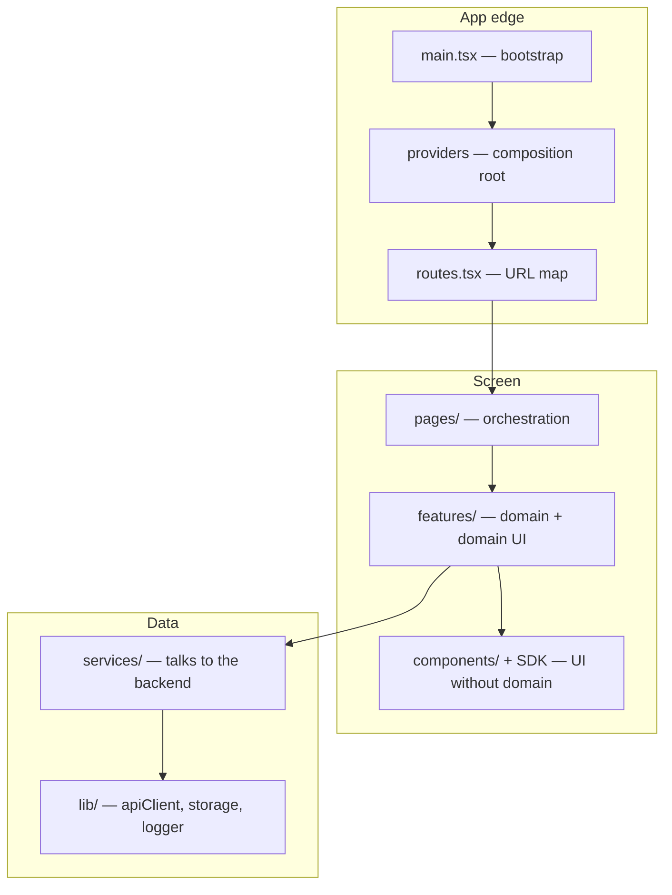

# Frontend app layers

Backends have a layering everyone recognizes: router → controller → service →
repository. Frontends have the same problem and almost never the same care — the
result is the component that validates a document number, builds the URL, calls
`fetch`, handles the error, formats a date and renders a table. Six reasons to
change in one file.

This page defines the layers of a Tempest app and the **one rule** that makes them
worth anything.

## The six layers



| #   | Layer          | Responsibility                                                            | Never does                                     |
| --- | -------------- | ------------------------------------------------------------------------- | ---------------------------------------------- |
| 1   | **Bootstrap**  | `createRoot`, import the CSS, mount `<App />`                              | logic of any kind                              |
| 2   | **Providers**  | Compose global context (query, theme, i18n, auth, flags, telemetry)       | know about any feature                         |
| 3   | **Routes**     | Map URL → page, guards, code splitting                                    | fetch data                                     |
| 4   | **Pages**      | Read URL params, compose features, define screen layout                   | business rules, `fetch`, formatting            |
| 5   | **Features**   | One domain: its components, hooks, types and services                     | import another feature's internals             |
| 6   | **UI**         | Render props, emit events, accessibility, styling                         | know what an "order" is                        |
| 7   | **Services**   | Call the endpoint, validate the response, return a domain type            | touch React                                    |
| 8   | **Infra**      | `apiClient`, storage, logger, telemetry — the "how", not the "what"       | know a domain resource name                    |

!!! note "Eight rows, six layers"
    Bootstrap/providers/routes are the **edge** — code that exists once in the app.
    The layers you edit every day are pages, features, UI and services.

## The one-way arrow rule

> **A layer only imports layers below it. Never the other way around.**

That's the whole thing. Without this rule, "layer" is just a folder name.

=== "✅ Right"

    ```tsx
    // features/orders/OrderList.tsx
    import { DataTable } from "tempest-react-sdk";

    import { useOrders } from "./use-orders";
    ```

    The feature imports UI (below) and its own hook. Arrow points down.

=== "❌ Wrong"

    ```tsx
    // components/StatusBadge.tsx
    import { useOrders } from "@/features/orders/use-orders";
    ```

    UI importing a feature. Now `StatusBadge` only works where orders exist, you
    can't reuse it for invoices, and testing it requires a server.

Practical consequences of honoring the arrow:

- **Testing is cheap.** A service tests with `fetch` mocked, no React. UI tests
  with props, no server.
- **Moving code is cheap.** A domain-free UI component moves up into the SDK
  without a rewrite.
- **Deleting a feature is cheap.** Deleting `features/orders/` leaves no hole in
  `components/`.

!!! danger "The import that breaks a layer is the start of every tangle"
    No app rots all at once. It rots with one "just this one" import that nobody
    removes. Treat a wrong-layer import as an **error**, not a style detail — that
    is what `tempest lint` and code review are for.

## What each layer looks like, in code

A complete example: the orders screen. Eight files, none over 40 lines.

### 1. Infra — the HTTP client exists once

```ts
// src/lib/api.ts
import { createApiClient } from "tempest-react-sdk";

import { useAuth } from "@/stores/auth";

/**
 * Single HTTP client for the app. Every service goes through it, so bearer
 * token, request id and 401 handling are configured in exactly one place.
 */
export const api = createApiClient({
  baseURL: import.meta.env.VITE_API_URL,
  getToken: () => useAuth.getState().token,
  onUnauthorized: () => useAuth.getState().logout(),
});
```

### 2. Service — talks to the backend, returns a domain type

```ts
// src/features/orders/orders.service.ts
import { parseResponse } from "tempest-react-sdk";

import { api } from "@/lib/api";

import { orderListSchema, orderSchema } from "./orders.schema";
import type { Order } from "./orders.schema";

/**
 * Read the paginated order list. The raw payload is validated against the
 * schema, so every consumer downstream can trust the shape.
 */
export async function listOrders(page: number): Promise<Order[]> {
  const raw = await api.get<unknown>("/orders", { params: { page } });
  return parseResponse(orderListSchema, raw, "listOrders");
}

/** Advance an order to the paid state. */
export async function payOrder(id: string): Promise<Order> {
  const raw = await api.post<unknown>(`/orders/${id}/pay`);
  return parseResponse(orderSchema, raw, "payOrder");
}
```

### 3. Feature hook — glues the service to React

```ts
// src/features/orders/use-orders.ts
import { useQuery } from "@tanstack/react-query";
import { createQueryKeys } from "tempest-react-sdk";

import { listOrders } from "./orders.service";

export const orderKeys = createQueryKeys("orders", {
  list: (page: number) => ["list", page] as const,
  detail: (id: string) => ["detail", id] as const,
});

/** Order list for a page, cached by TanStack Query. */
export function useOrders(page: number) {
  return useQuery({
    queryKey: orderKeys.list(page),
    queryFn: () => listOrders(page),
  });
}
```

### 4. Feature component — knows orders, doesn't know HTTP

```tsx
// src/features/orders/OrderTable.tsx
import { Badge, Button, DataTable, type DataTableColumn } from "tempest-react-sdk";

import type { Order } from "./orders.schema";

interface OrderTableProps {
  orders: Order[];
  onPay: (id: string) => void;
}

/**
 * Presentational table for orders. Receives data, emits intent — no fetching,
 * no mutation, no knowledge of where the rows came from.
 */
export function OrderTable({ orders, onPay }: OrderTableProps) {
  const columns: DataTableColumn<Order>[] = [
    { key: "code", header: "Code", sortable: true },
    { key: "status", header: "Status", render: (o) => <Badge>{o.status}</Badge> },
    {
      key: "id",
      header: "",
      align: "right",
      render: (o) => (
        <Button size="sm" onClick={() => onPay(o.id)}>
          Pay
        </Button>
      ),
    },
  ];

  return <DataTable data={orders} columns={columns} rowKey={(o) => o.id} searchable />;
}
```

!!! note "`key` is `keyof T` — on purpose"
    The actions column reuses `key: "id"` because the type forces you to point at
    a real row field. That closes the door on the phantom column
    (`key: "actions"`) that breaks silently when the field is renamed — it is
    [typing enforcing the design](typing.md).

### 5. Page — orchestrates, doesn't implement

```tsx
// src/pages/Orders.tsx
import { Page, Spinner, useSearchParams } from "tempest-react-sdk";

import { OrderTable } from "@/features/orders/OrderTable";
import { useOrders } from "@/features/orders/use-orders";
import { usePayOrder } from "@/features/orders/use-pay-order";

/** Orders screen: reads the page from the URL and wires the feature together. */
export function Orders() {
  const [params] = useSearchParams();
  const page = Number(params.get("page") ?? 1);

  const { data = [], isLoading } = useOrders(page);
  const { mutate: pay } = usePayOrder();

  return (
    <Page title="Orders">
      {isLoading ? <Spinner /> : <OrderTable orders={data} onPay={pay} />}
    </Page>
  );
}
```

Notice what the page does **not** have: no API URL, no `useState` of remote data,
no formatting, no rules. It reads the URL, calls the feature and positions things.
That is the complexity ceiling of a well-designed page.

## Allowed-imports table

Paste this into code review:

| From ↓ / May import →    | Infra | Services | UI  | Features | Pages | Routes |
| ------------------------ | ----- | -------- | --- | -------- | ----- | ------ |
| **Infra** (`lib/`)       | ✅    | ❌       | ❌  | ❌       | ❌    | ❌     |
| **Services**             | ✅    | ⚠️        | ❌  | ❌       | ❌    | ❌     |
| **UI** (`components/`)   | ❌    | ❌       | ✅  | ❌       | ❌    | ❌     |
| **Features**             | ✅    | ✅       | ✅  | ⚠️        | ❌    | ❌     |
| **Pages**                | ⚠️     | ❌       | ✅  | ✅       | ❌    | ❌     |
| **Routes / Providers**   | ✅    | ❌       | ✅  | ⚠️        | ✅    | ✅     |

- ✅ free.
- ⚠️ with judgement: a service may compose another service; a feature imports
  another feature **only through its `index.ts`**; a page may read infra for global
  things (logger, flags).
- ❌ is an error. No "temporary" exception.

!!! tip "UI imports nothing from the app — not even `lib/`"
    A component in `components/` that imports `@/lib/api` stopped being UI. If it
    needs data, it receives it as a prop. That rigor is what later turns the
    component into a candidate to move up into the SDK.

## Where the SDK fits

You don't implement layers 1–3 and 8 by hand:

| Layer     | Use                                                                              |
| --------- | -------------------------------------------------------------------------------- |
| Providers | [`<AppProviders>`](../app-providers.md)                                          |
| Routes    | [`defineRoutes` + `<AppRouter>` + `<RouteGuard>`](../routing.md)                  |
| Services  | [`createApiClient` + `parseResponse`](../http.md)                                 |
| Plain CRUD | [`createDataProvider` + `useList`/`useOne`/`useCreate`](../data-provider.md)     |
| UI        | [Components catalogue](../components.md)                                         |
| Infra     | [Logger](../logger.md), [Telemetry](../telemetry.md), [Feature Flags](../feature-flags.md) |

And [`create-tempest-app`](../scaffold.md) already generates the app with `lib/`,
`stores/`, `layouts/`, `pages/` and `routes.tsx` in place.

!!! info "CRUD with no rules? Skip the service"
    When the resource is predictable REST with no transformation at all, the
    [Data Provider](../data-provider.md) replaces the service+hook pair. Writing a
    service that only forwards is a [pass-through](anti-patterns.md#passthrough) —
    indirection with no logic.

## Recap

- Eight roles, six layers you edit: **page → feature → UI** on one side,
  **service → infra** on the other.
- The **one-way arrow rule** is what turns a folder name into architecture.
- A page orchestrates and nothing else; UI knows no domain; a service knows no
  React.
- A wrong-layer import is a **review error**, not a detail.
- The SDK ships the edge (providers/routes), services (HTTP) and UI — you keep the
  boundaries.

Next: [Folder structure](folders.md) — where each of these layers lives on disk.
