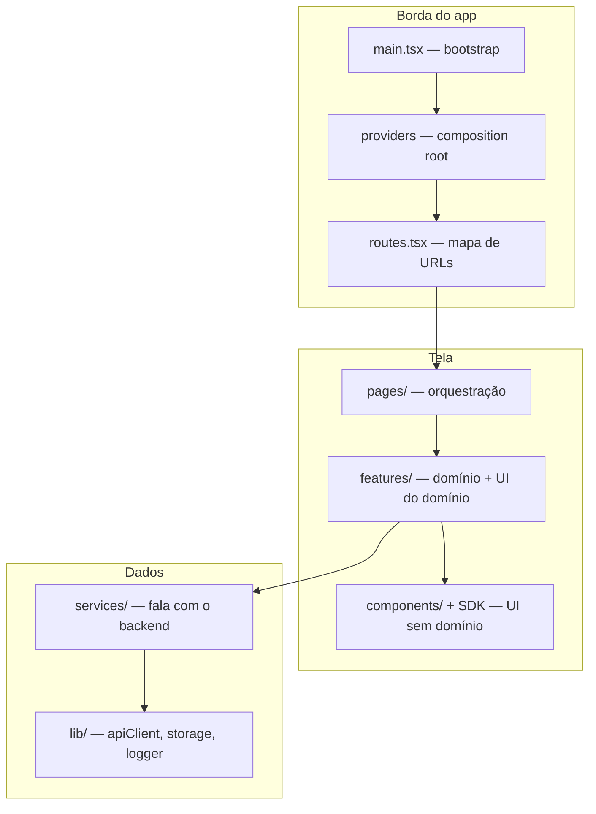

# Camadas de um app frontend

Backend tem um desenho de camadas que todo mundo reconhece: router → controller →
service → repository. Frontend tem o mesmo problema e quase nunca o mesmo
cuidado — o resultado é o componente que valida CPF, monta a URL, faz `fetch`,
trata erro, formata data e renderiza tabela. Seis motivos de mudança num arquivo.

Esta página define as camadas de um app Tempest e a **única regra** que faz elas
valerem algo.

## As seis camadas



| #   | Camada         | Responsabilidade                                                                | Nunca faz                                        |
| --- | -------------- | ------------------------------------------------------------------------------- | ------------------------------------------------ |
| 1   | **Bootstrap**  | `createRoot`, importar o CSS, montar `<App />`                                   | lógica de qualquer tipo                          |
| 2   | **Providers**  | Compor contexto global (query, tema, i18n, auth, flags, telemetria)             | conhecer feature nenhuma                         |
| 3   | **Rotas**      | Mapear URL → página, guardas, code splitting                                    | buscar dados                                     |
| 4   | **Páginas**    | Ler params da URL, compor features, definir layout da tela                      | regra de negócio, `fetch`, formatação            |
| 5   | **Features**   | Um domínio: seus componentes, hooks, tipos e serviços                           | importar outra feature por dentro                |
| 6   | **UI**         | Renderizar props, emitir eventos, acessibilidade, estilo                        | saber o que é um "pedido"                        |
| 7   | **Serviços**   | Chamar endpoint, validar resposta, devolver tipo do domínio                     | tocar em React                                   |
| 8   | **Infra**      | `apiClient`, storage, logger, telemetria — o "como", não o "o quê"              | saber nome de recurso do domínio                 |

!!! note "Oito linhas, seis camadas"
    Bootstrap/providers/rotas são a **borda** — código que existe uma vez no app.
    As camadas que você edita todo dia são páginas, features, UI, serviços.

## A regra da seta única

> **Uma camada só importa camadas abaixo dela. Nunca ao contrário.**

Isso é a coisa toda. Sem essa regra, "camada" é só um nome de pasta.

=== "✅ Certo"

    ```tsx
    // features/orders/OrderList.tsx
    import { DataTable } from "tempest-react-sdk";

    import { useOrders } from "./use-orders";
    ```

    Feature importa UI (abaixo) e o próprio hook. Seta pra baixo.

=== "❌ Errado"

    ```tsx
    // components/StatusBadge.tsx
    import { useOrders } from "@/features/orders/use-orders";
    ```

    UI importando feature. Agora `StatusBadge` só funciona onde existe pedido,
    não dá pra reusar em faturas, e o teste dele precisa de servidor.

Consequências práticas de respeitar a seta:

- **Testar é barato.** Serviço testa com `fetch` mockado, sem React. UI testa com
  props, sem servidor.
- **Mover código é barato.** Um componente de UI sem domínio sobe pro SDK sem
  reescrita.
- **Apagar feature é barato.** Deletar `features/orders/` não deixa buraco em
  `components/`.

!!! danger "O import que fura a camada é o começo de todo emaranhado"
    Nenhum app apodrece de uma vez. Apodrece com um import "só esse aqui" que
    ninguém remove. Trate import de camada errada como **erro**, não como
    detalhe de estilo — o `tempest lint` e a revisão existem pra isso.

## Como cada camada fica, em código

Um exemplo completo: a tela de pedidos. Oito arquivos, nenhum com mais de 40
linhas.

### 1. Infra — o cliente HTTP existe uma vez

```ts
// src/lib/api.ts
import { createApiClient } from "tempest-react-sdk";

import { useAuth } from "@/stores/auth";

/**
 * Single HTTP client for the app. Every service goes through it, so bearer
 * token, request id and 401 handling are configured in exactly one place.
 */
export const api = createApiClient({
  baseURL: import.meta.env.VITE_API_URL,
  getToken: () => useAuth.getState().token,
  onUnauthorized: () => useAuth.getState().logout(),
});
```

### 2. Serviço — fala com o backend e devolve tipo do domínio

```ts
// src/features/orders/orders.service.ts
import { parseResponse } from "tempest-react-sdk";

import { api } from "@/lib/api";

import { orderListSchema, orderSchema } from "./orders.schema";
import type { Order } from "./orders.schema";

/**
 * Read the paginated order list. The raw payload is validated against the
 * schema, so every consumer downstream can trust the shape.
 */
export async function listOrders(page: number): Promise<Order[]> {
  const raw = await api.get<unknown>("/orders", { params: { page } });
  return parseResponse(orderListSchema, raw, "listOrders");
}

/** Advance an order to the paid state. */
export async function payOrder(id: string): Promise<Order> {
  const raw = await api.post<unknown>(`/orders/${id}/pay`);
  return parseResponse(orderSchema, raw, "payOrder");
}
```

### 3. Hook da feature — cola serviço com React

```ts
// src/features/orders/use-orders.ts
import { useQuery } from "@tanstack/react-query";
import { createQueryKeys } from "tempest-react-sdk";

import { listOrders } from "./orders.service";

export const orderKeys = createQueryKeys("orders", {
  list: (page: number) => ["list", page] as const,
  detail: (id: string) => ["detail", id] as const,
});

/** Order list for a page, cached by TanStack Query. */
export function useOrders(page: number) {
  return useQuery({
    queryKey: orderKeys.list(page),
    queryFn: () => listOrders(page),
  });
}
```

### 4. Componente da feature — sabe o que é pedido, não sabe HTTP

```tsx
// src/features/orders/OrderTable.tsx
import { Badge, Button, DataTable, type DataTableColumn } from "tempest-react-sdk";

import type { Order } from "./orders.schema";

interface OrderTableProps {
  orders: Order[];
  onPay: (id: string) => void;
}

/**
 * Presentational table for orders. Receives data, emits intent — no fetching,
 * no mutation, no knowledge of where the rows came from.
 */
export function OrderTable({ orders, onPay }: OrderTableProps) {
  const columns: DataTableColumn<Order>[] = [
    { key: "code", header: "Código", sortable: true },
    { key: "status", header: "Status", render: (o) => <Badge>{o.status}</Badge> },
    {
      key: "id",
      header: "",
      align: "right",
      render: (o) => (
        <Button size="sm" onClick={() => onPay(o.id)}>
          Pagar
        </Button>
      ),
    },
  ];

  return <DataTable data={orders} columns={columns} rowKey={(o) => o.id} searchable />;
}
```

!!! note "`key` é `keyof T` — de propósito"
    A coluna de ações reusa `key: "id"` porque o tipo obriga a apontar pra um
    campo real da linha. Isso impede a coluna fantasma (`key: "actions"`) que
    quebra silenciosamente quando o campo muda de nome — é
    [tipagem cobrando o desenho](typing.md).

### 5. Página — orquestra, não implementa

```tsx
// src/pages/Orders.tsx
import { Page, Spinner, useSearchParams } from "tempest-react-sdk";

import { OrderTable } from "@/features/orders/OrderTable";
import { useOrders } from "@/features/orders/use-orders";
import { usePayOrder } from "@/features/orders/use-pay-order";

/** Orders screen: reads the page from the URL and wires the feature together. */
export function Orders() {
  const [params] = useSearchParams();
  const page = Number(params.get("page") ?? 1);

  const { data = [], isLoading } = useOrders(page);
  const { mutate: pay } = usePayOrder();

  return (
    <Page title="Pedidos">
      {isLoading ? <Spinner /> : <OrderTable orders={data} onPay={pay} />}
    </Page>
  );
}
```

Repare no que a página **não** tem: nenhuma URL de API, nenhum `useState` de
dado remoto, nenhuma formatação, nenhuma regra. Ela lê a URL, chama a feature e
posiciona. É o teto de complexidade de uma página bem desenhada.

## Tabela de importações permitidas

Cole isso na revisão de código:

| De ↓ / Pode importar →   | Infra | Serviços | UI  | Features | Páginas | Rotas |
| ------------------------ | ----- | -------- | --- | -------- | ------- | ----- |
| **Infra** (`lib/`)       | ✅    | ❌       | ❌  | ❌       | ❌      | ❌    |
| **Serviços**             | ✅    | ⚠️        | ❌  | ❌       | ❌      | ❌    |
| **UI** (`components/`)   | ❌    | ❌       | ✅  | ❌       | ❌      | ❌    |
| **Features**             | ✅    | ✅       | ✅  | ⚠️        | ❌      | ❌    |
| **Páginas**              | ⚠️     | ❌       | ✅  | ✅       | ❌      | ❌    |
| **Rotas / Providers**    | ✅    | ❌       | ✅  | ⚠️        | ✅      | ✅    |

- ✅ livre.
- ⚠️ com critério: serviço pode compor outro serviço; feature importa outra
  feature **só pelo `index.ts` dela**; página pode ler infra pra coisas globais
  (logger, flags).
- ❌ é erro. Sem exceção "temporária".

!!! tip "UI não importa nada do app — nem `lib/`"
    Um componente de `components/` que importe `@/lib/api` deixou de ser UI. Se
    ele precisa de dado, ele recebe por prop. É esse rigor que faz o componente
    virar candidato a subir pro SDK depois.

## Onde o SDK entra

Você não implementa as camadas 1–3 e 8 na mão:

| Camada    | Use                                                                              |
| --------- | -------------------------------------------------------------------------------- |
| Providers | [`<AppProviders>`](../app-providers.md)                                          |
| Rotas     | [`defineRoutes` + `<AppRouter>` + `<RouteGuard>`](../routing.md)                  |
| Serviços  | [`createApiClient` + `parseResponse`](../http.md)                                 |
| CRUD puro | [`createDataProvider` + `useList`/`useOne`/`useCreate`](../data-provider.md)      |
| UI        | [Catálogo de componentes](../components.md)                                      |
| Infra     | [Logger](../logger.md), [Telemetry](../telemetry.md), [Feature Flags](../feature-flags.md) |

E o [`create-tempest-app`](../scaffold.md) já gera o app com `lib/`, `stores/`,
`layouts/`, `pages/` e `routes.tsx` no lugar.

!!! info "CRUD sem regra? Pule o serviço"
    Quando o recurso é REST previsível e não tem transformação nenhuma, o
    [Data Provider](../data-provider.md) substitui o par serviço+hook. Escrever
    um serviço que só repassa é um [pass-through](anti-patterns.md#passthrough) —
    indireção sem lógica.

## Recap

- Oito papéis, seis camadas que você edita: **página → feature → UI** de um lado,
  **serviço → infra** do outro.
- A **regra da seta única** é o que transforma nome de pasta em arquitetura.
- Página orquestra e nada mais; UI não conhece domínio; serviço não conhece React.
- Import de camada errada é **erro de revisão**, não detalhe.
- O SDK entrega borda (providers/rotas), serviços (HTTP) e UI — você mantém as
  fronteiras.

Próxima: [Estrutura de pastas](folders.md) — onde cada uma dessas camadas mora no
disco.
