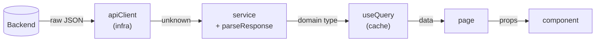
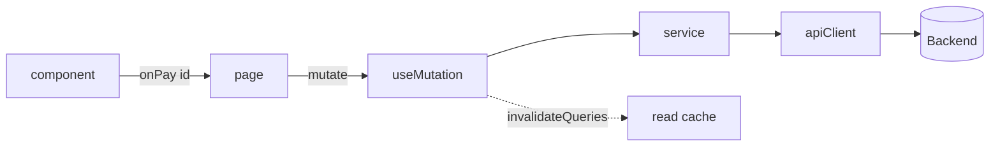

# Data flow

Every screen is the same question: **how does server data reach the pixel, and how
does user intent get back to the server.** If every screen answers that its own
way, the app has N architectures.

This page fixes **one** path, in both directions.

## The read path



Five stops, each with exactly one job:

| Stop           | Input             | Output              | Job                                         |
| -------------- | ----------------- | ------------------- | ------------------------------------------- |
| `apiClient`    | path + params     | `unknown`           | URL, headers, bearer, 401, request id       |
| `service`      | `unknown`         | domain type         | **validate** and map DTO → domain           |
| `useQuery`     | function + key    | `data`/`error`      | cache, dedupe, revalidation, loading        |
| page           | `data`            | props               | orchestrate, read the URL                   |
| component      | props             | DOM                 | render, emit events                         |

!!! danger "The one rule with no exception"
    **A component does not call `fetch`, `axios`, or `apiClient`.** Not even "just
    this once". A component that fetches is untestable without a server, unreusable
    in another context, and invisible to the cache.

### `unknown` in, narrow type out

`apiClient` returns `unknown` on purpose:

```ts
const raw = await api.get<unknown>("/orders", { params: { page } });
return parseResponse(orderListSchema, raw, "listOrders");
```

Why not `api.get<Order[]>` directly? Because `get<Order[]>` is **your promise**,
not a check. If the backend renames `total_amount` to `amount`, TypeScript stays
happy and the app breaks in production, on a `.toFixed()` of `undefined`, three
screens later.

`parseResponse` turns that into an error **at the edge**, with context:

```text
[listOrders] invalid response: total_amount — Required
```

!!! tip "Validate at the edge, trust the inside"
    That's the whole point. One validation at the boundary buys you the right to
    write the rest of the app without `if (order?.total_amount != null)` on every
    line. Without it, defensive checks leak into every component. See
    [Strong typing](typing.md).

### A DTO and a domain type are not the same thing

The backend speaks `snake_case`, sends dates as ISO strings, sends money as cents.
None of that needs to leak into the app:

```ts
// src/features/orders/orders.schema.ts
import { z } from "zod";

/** Wire format, exactly as the backend sends it. */
const orderDtoSchema = z.object({
  id: z.string().uuid(),
  code: z.string(),
  status: z.enum(["pending", "paid", "shipped", "delivered", "cancelled"]),
  total_cents: z.number().int(),
  created_at: z.string().datetime(),
});

/**
 * Domain shape used everywhere inside the app: camelCase, real Date, money in
 * a single unit. The transform is the only place that knows the wire format.
 */
export const orderSchema = orderDtoSchema.transform((dto) => ({
  id: dto.id,
  code: dto.code,
  status: dto.status,
  totalCents: dto.total_cents,
  createdAt: new Date(dto.created_at),
}));

export const orderListSchema = z.array(orderSchema);

export type Order = z.infer<typeof orderSchema>;
export type OrderStatus = Order["status"];
```

Concrete wins:

- `createdAt` is already a `Date` — no component calls `new Date(...)`.
- `snake_case` dies in the schema; the app is `camelCase` throughout.
- Changing a backend field means editing **one** file.

!!! warning "Don't transform what you don't need to"
    If the DTO is already the shape you want, don't invent a `transform` just to
    have a layer. Mapping without purpose is [ceremony](anti-patterns.md#cerimonia),
    and ceremony is cost without return.

## The write path



The component does **not** decide what happens — it announces intent
(`onPay(id)`). The mutation hook knows the effect:

```ts
// src/features/orders/use-pay-order.ts
import { useMutation, useQueryClient } from "@tanstack/react-query";
import { useToast } from "tempest-react-sdk";

import { payOrder } from "./orders.service";
import { orderKeys } from "./use-orders";

/**
 * Pay an order and refresh every cached order query. Invalidating `all`
 * (instead of a single page key) is intentional: paying changes counters and
 * list ordering, so any cached page may now be stale.
 */
export function usePayOrder() {
  const queryClient = useQueryClient();
  const toast = useToast();

  return useMutation({
    mutationFn: payOrder,
    onSuccess: () => {
      queryClient.invalidateQueries({ queryKey: orderKeys.all });
      toast.success("Order paid.");
    },
  });
}
```

`orderKeys.all` comes for free from [`createQueryKeys`](../query.md) — it is the
broadest key of the domain.

!!! tip "A hand-built key is a bug waiting to happen"
    `["orders", "list", page]` written in the query and `["order", "list", page]`
    written in the invalidation is not a compile error — it's a screen that never
    updates. Centralizing in `createQueryKeys` closes that door.

## Handle errors once, not on every screen

The HTTP client throws `TempestApiError` with `status`, `detail`, `code` and
`requestId`. Three levels of handling, and each error lands in exactly one:

| Level          | Where                                           | Handles                                      |
| -------------- | ----------------------------------------------- | -------------------------------------------- |
| **Global**     | `createApiClient({ onUnauthorized })`           | 401 → logout/refresh                         |
| **Feature**    | `onError` of `useMutation`                      | business rules (`code === "STOCK_EMPTY"`)    |
| **Screen**     | `<ErrorState>` / `isError` from `useQuery`      | "it didn't work, try again"                  |

```ts
import { isApiError } from "tempest-react-sdk";

onError: (error: unknown) => {
  if (isApiError(error) && error.code === "STOCK_EMPTY") {
    toast.error("No stock for that order.");
    return;
  }
  throw error;
},
```

The trailing `throw error` is not sloppiness: an error the feature can't handle
rises to the [ErrorBoundary](../error-boundary.md) instead of becoming a generic
`toast` that hides the problem.

!!! danger "An empty `catch {}` is the worst line of code there is"
    A silent catch trades a visible error for silently wrong behaviour. If you
    don't know what to do with the error, **don't catch it** — let the
    [ErrorBoundary](../error-boundary.md) and the [logger](../logger.md) do their
    job.

## Shortcut: CRUD without a service

Predictable REST resource, no transformation and no rules? The
[Data Provider](../data-provider.md) already *is* the service:

```tsx
import { useList } from "tempest-react-sdk";

const { data, isLoading } = useList<Customer>("customers", {
  pagination: { page: 1, pageSize: 20 },
  sort: { field: "name", order: "asc" },
});
```

Writing a `customers.service.ts` that only forwards those arguments is a
[pass-through](anti-patterns.md#passthrough). Write the service when **one** of
three things exists: validation with a transform, endpoint composition, or a
business rule.

## Offline: same mutation, with an outbox

In a PWA the write may happen without network. The design doesn't change — the
hook does:

```ts
import { useOfflineMutation } from "tempest-react-sdk";

import { orderKeys } from "./use-orders";
import { ordersSync } from "./orders.sync";
import type { Order } from "./orders.schema";

/** Pay an order even offline: the write goes to the outbox and syncs later. */
export function usePayOrderOffline(page: number) {
  return useOfflineMutation<string, Order[], { paid: true }>({
    sync: ordersSync,
    queryKey: orderKeys.list(page),
    toEntry: (id) => ({ op: "update", recordId: id, payload: { paid: true } }),
    applyOptimistic: (current = [], id) =>
      current.map((o) => (o.id === id ? { ...o, status: "paid" } : o)),
  });
}
```

The mutation stays in the feature, the UI still only emits intent. Details in
[PWA & Offline-First](../pwa.md) and [Offline Sync](../offline-sync.md).

## Recap

- Read: `apiClient` → `service` (+`parseResponse`) → `useQuery` → page → UI.
- Write: UI emits **intent** → feature mutation → service → invalidation.
- `unknown` in, domain type out. Validating at the **edge** pays for the rest of
  the app.
- DTO ≠ domain: `snake_case`, ISO and cents die in the schema.
- Errors have three levels, each with an owner. Never an empty `catch {}`.
- Trivial CRUD: use the [Data Provider](../data-provider.md) and write no service.

Next: [Where each state lives](state.md).
