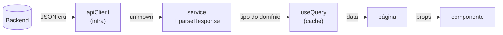
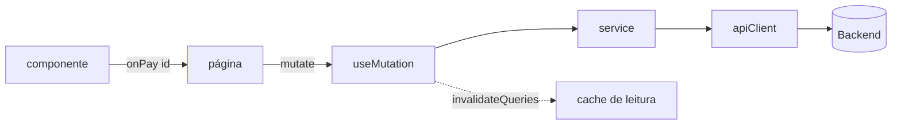

# Fluxo de dados

Toda tela é a mesma pergunta: **como o dado do servidor chega no pixel, e como a
intenção do usuário volta pro servidor.** Se cada tela responde isso do seu jeito,
o app tem N arquiteturas.

Esta página fixa **um** caminho, nos dois sentidos.

## O caminho de leitura



Cinco paradas, e cada uma tem exatamente um trabalho:

| Parada         | Entrada           | Saída               | Trabalho                                    |
| -------------- | ----------------- | ------------------- | ------------------------------------------- |
| `apiClient`    | path + params     | `unknown`           | URL, headers, bearer, 401, request id       |
| `service`      | `unknown`         | tipo do domínio     | **validar** e mapear DTO → domínio          |
| `useQuery`     | função + key      | `data`/`error`      | cache, dedupe, revalidação, loading         |
| página         | `data`            | props               | orquestrar, ler URL                         |
| componente     | props             | DOM                 | renderizar, emitir eventos                  |

!!! danger "A única regra que não tem exceção"
    **Componente não chama `fetch`, `axios`, nem `apiClient`.** Nem "só nesse
    caso". Um componente que busca dado é intestável sem servidor, irreusável em
    outro contexto e invisível pro cache.

### `unknown` na entrada, tipo estreito na saída

O `apiClient` devolve `unknown` de propósito:

```ts
const raw = await api.get<unknown>("/orders", { params: { page } });
return parseResponse(orderListSchema, raw, "listOrders");
```

Por que não `api.get<Order[]>` direto? Porque `get<Order[]>` é uma **promessa
sua**, não uma verificação. Se o backend renomear `total_amount` pra `amount`, o
TypeScript continua feliz e o app quebra em produção, num `.toFixed()` de
`undefined`, três telas depois.

O `parseResponse` transforma isso num erro **na borda**, com contexto:

```text
[listOrders] resposta inválida: total_amount — Required
```

!!! tip "Valide na borda, confie no miolo"
    Esse é o ponto todo. Uma validação na fronteira compra o direito de escrever
    o resto do app sem `if (order?.total_amount != null)` em cada linha. Sem ela,
    a checagem defensiva vaza pra dentro de cada componente. Veja
    [Tipagem forte](typing.md).

### DTO e tipo do domínio não são a mesma coisa

Backend fala `snake_case`, manda data como string ISO, manda dinheiro como
centavos. Nada disso precisa vazar pra dentro do app:

```ts
// src/features/orders/orders.schema.ts
import { z } from "zod";

/** Wire format, exactly as the backend sends it. */
const orderDtoSchema = z.object({
  id: z.string().uuid(),
  code: z.string(),
  status: z.enum(["pending", "paid", "shipped", "delivered", "cancelled"]),
  total_cents: z.number().int(),
  created_at: z.string().datetime(),
});

/**
 * Domain shape used everywhere inside the app: camelCase, real Date, money in
 * a single unit. The transform is the only place that knows the wire format.
 */
export const orderSchema = orderDtoSchema.transform((dto) => ({
  id: dto.id,
  code: dto.code,
  status: dto.status,
  totalCents: dto.total_cents,
  createdAt: new Date(dto.created_at),
}));

export const orderListSchema = z.array(orderSchema);

export type Order = z.infer<typeof orderSchema>;
export type OrderStatus = Order["status"];
```

Ganhos concretos:

- `createdAt` já é `Date` — nenhum componente faz `new Date(...)`.
- `snake_case` morre no schema; o app é `camelCase` inteiro.
- Trocar o backend de campo é editar **um** arquivo.

!!! warning "Não transforme o que você não precisa"
    Se o DTO já está no formato que você quer, não invente `transform` só pra ter
    uma camada. Mapeamento sem propósito é [cerimônia](anti-patterns.md#cerimonia),
    e cerimônia é custo sem retorno.

## O caminho de escrita



O componente **não** decide o que acontece — ele avisa a intenção (`onPay(id)`).
Quem sabe o efeito é o hook de mutation:

```ts
// src/features/orders/use-pay-order.ts
import { useMutation, useQueryClient } from "@tanstack/react-query";
import { useToast } from "tempest-react-sdk";

import { payOrder } from "./orders.service";
import { orderKeys } from "./use-orders";

/**
 * Pay an order and refresh every cached order query. Invalidating `all`
 * (instead of a single page key) is intentional: paying changes counters and
 * list ordering, so any cached page may now be stale.
 */
export function usePayOrder() {
  const queryClient = useQueryClient();
  const toast = useToast();

  return useMutation({
    mutationFn: payOrder,
    onSuccess: () => {
      queryClient.invalidateQueries({ queryKey: orderKeys.all });
      toast.success("Pedido pago.");
    },
  });
}
```

O `orderKeys.all` vem de graça no
[`createQueryKeys`](../query.md) — é a key mais ampla do domínio.

!!! tip "Key montada à mão é bug esperando"
    `["orders", "list", page]` escrito na query e `["order", "list", page]`
    escrito na invalidação não dão erro de compilação — dão uma tela que não
    atualiza. Centralizar em `createQueryKeys` fecha essa porta.

## Tratando erro uma vez, não em toda tela

O cliente HTTP joga `TempestApiError` com `status`, `detail`, `code` e
`requestId`. Três níveis de tratamento, e cada erro cai em um só:

| Nível          | Onde                                            | Trata                                        |
| -------------- | ----------------------------------------------- | -------------------------------------------- |
| **Global**     | `createApiClient({ onUnauthorized })`           | 401 → logout/refresh                         |
| **Da feature** | `onError` do `useMutation`                      | regra de negócio (`code === "STOCK_EMPTY"`)  |
| **Da tela**    | `<ErrorState>` / `isError` do `useQuery`        | "não deu, tente de novo"                     |

```ts
import { isApiError } from "tempest-react-sdk";

onError: (error: unknown) => {
  if (isApiError(error) && error.code === "STOCK_EMPTY") {
    toast.error("Sem estoque para esse pedido.");
    return;
  }
  throw error;
},
```

O `throw error` no final não é descuido: erro que a feature não sabe tratar sobe
pro [ErrorBoundary](../error-boundary.md) em vez de virar um `toast` genérico que
esconde o problema.

!!! danger "`catch {}` vazio é a pior linha de código que existe"
    Um catch silencioso troca um erro visível por um comportamento errado
    silencioso. Se você não sabe o que fazer com o erro, **não capture** — deixe
    o [ErrorBoundary](../error-boundary.md) e o [logger](../logger.md) fazerem o
    trabalho.

## Atalho: CRUD sem serviço

Recurso REST previsível, sem transformação nem regra? O
[Data Provider](../data-provider.md) já é o serviço:

```tsx
import { useList } from "tempest-react-sdk";

const { data, isLoading } = useList<Customer>("customers", {
  pagination: { page: 1, pageSize: 20 },
  sort: { field: "name", order: "asc" },
});
```

Escrever um `customers.service.ts` que só repassa esses argumentos é
[pass-through](anti-patterns.md#passthrough). Escreva o serviço quando existir
**alguma** das três coisas: validação com transform, composição de endpoints, ou
regra de negócio.

## Offline: a mesma mutation, com outbox

Em app PWA a escrita pode acontecer sem rede. Não muda o desenho — muda o hook:

```ts
import { useOfflineMutation } from "tempest-react-sdk";

import { orderKeys } from "./use-orders";
import { ordersSync } from "./orders.sync";
import type { Order } from "./orders.schema";

/** Pay an order even offline: the write goes to the outbox and syncs later. */
export function usePayOrderOffline(page: number) {
  return useOfflineMutation<string, Order[], { paid: true }>({
    sync: ordersSync,
    queryKey: orderKeys.list(page),
    toEntry: (id) => ({ op: "update", recordId: id, payload: { paid: true } }),
    applyOptimistic: (current = [], id) =>
      current.map((o) => (o.id === id ? { ...o, status: "paid" } : o)),
  });
}
```

A mutation continua na feature, a UI continua só emitindo intenção. Detalhes em
[PWA & Offline-First](../pwa.md) e [Offline Sync](../offline-sync.md).

## Recap

- Leitura: `apiClient` → `service` (+`parseResponse`) → `useQuery` → página → UI.
- Escrita: UI emite **intenção** → mutation na feature → serviço → invalidação.
- `unknown` entra, tipo do domínio sai. Validar na **borda** paga o resto do app.
- DTO ≠ domínio: `snake_case`, ISO e centavos morrem no schema.
- Erro tem três níveis, cada um com um dono. `catch {}` vazio nunca.
- CRUD trivial: use o [Data Provider](../data-provider.md) e não escreva serviço.

Próxima: [Onde mora cada estado](state.md).
