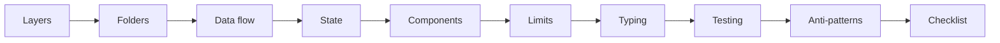

# Frontend Software Design

The SDK gives you the **pieces**. This section teaches you how to **arrange**
them.

Every React app breaks for predictable reasons: the component that was small
became a 900-line file, the one `fetch` became eighteen scattered ones, the state
that was one `useState` became six sources of truth that disagree with each other.
None of that is a missing library — it is missing **design**.

!!! tip "You don't need to know everything before you start"
    Every page here is short and assumes only the previous ones. Start at the
    first, apply it to your app, come back for the next. Nothing here requires
    refactoring everything at once.

## The problem, in one sentence

> Every frontend app grows. What decides whether it stays pleasant or becomes
> unbearable is **how many things you must hold in your head to change one line**.

Software design is the work of keeping that number low. The techniques are always
the same three:

1. **Separate** what changes for different reasons (layers).
2. **Limit** the size of each piece (hard limits).
3. **Let the compiler enforce** what you don't want to review by hand (typing).

## The four questions

When you open a file and don't know whether that code belongs there, it's always
one of these four:

| Question                            | Where the answer lives                       |
| ----------------------------------- | -------------------------------------------- |
| **Which layer does this live in?**  | [Frontend app layers](architecture.md)       |
| **Which file/folder does it go in?** | [Folder structure](folders.md)              |
| **Who is allowed to talk to the backend?** | [Data flow](data-flow.md)             |
| **Where should this state live?**   | [Where each state lives](state.md)           |

And when the file already exists and you must decide whether it's good:

| Question                              | Where the answer lives                    |
| ------------------------------------- | ----------------------------------------- |
| **Is this component too big?**        | [Hard limits](limits.md)                  |
| **How do I split it without prop soup?** | [Thinking in components](components.md) |
| **How does the type prevent the bug?** | [Strong typing](typing.md)               |
| **What do I test here?**              | [Testing strategy](testing.md)            |

## The recommended path

**System design** (the first four) answers _where things live_. **Writing the
code** (the middle three) answers _how each piece is written_. **Sustaining it**
(the last three) answers _how this is still true six months from now_.

## Everything, in one table

If you read only one thing in this section, read this table. All the rest is its
justification.

| Rule                                                            | Why                                                              | Page                            |
| --------------------------------------------------------------- | ---------------------------------------------------------------- | ------------------------------- |
| Component `.tsx` file: **≤ 150 lines**                          | Above that nobody reads the whole file before editing it          | [Limits](limits.md)             |
| Custom hook: **≤ 100 lines**, one responsibility                | A big hook is a service in disguise                               | [Limits](limits.md)             |
| Props on a component: **≤ 7**                                   | More than that means two components in one                        | [Components](components.md)     |
| **Zero `any`**. `unknown` at the edge, narrow type after        | `any` turns the compiler off exactly where you need it most       | [Typing](typing.md)             |
| Every network response goes through a **zod schema**            | Backends change without warning; the edge is the only place to check | [Data flow](data-flow.md)    |
| A component **never** calls `fetch` directly                    | Couples UI to transport and kills the test                        | [Data flow](data-flow.md)       |
| Server data lives in **TanStack Query**, not in `useState`      | Cache, revalidation and loading for free, no manual syncing       | [State](state.md)               |
| Filter/pagination/tab live in the **URL**                       | Shareable link, working back button                               | [State](state.md)               |
| A lower layer **never imports** an upper layer                  | The one-way arrow is what makes code testable and movable         | [Layers](architecture.md)       |
| One folder per **feature**, not per file type                   | You edit features, not "all the hooks in the app"                 | [Folders](folders.md)           |

!!! warning "A rule isn't dogma — it's a default"
    Every limit here has a documented escape hatch on its own page. Going past 150
    lines in a table file with 30 columns can be the right call. What is **not**
    acceptable is going past it without noticing.

## How this connects to the SDK

`tempest-react-sdk` already implements most of the infrastructure this design
asks for. You don't build the layers from scratch:

| Layer               | What the SDK already ships                                                                  |
| ------------------- | ------------------------------------------------------------------------------------------- |
| Bootstrap/providers | [`<AppProviders>`](../app-providers.md) — ErrorBoundary → Query → Theme → i18n in one block |
| Routes              | [`defineRoutes`, `<AppRouter>`, `<RouteGuard>`](../routing.md)                                |
| Services/HTTP       | [`createApiClient`, `parseResponse`](../http.md), [`createDataProvider`](../data-provider.md) |
| Server state        | [`QueryProvider`, `createQueryKeys`, `usePaginatedQuery`](../query.md)                        |
| Client state        | [`createStore`, `createSelectors`](../state.md)                                               |
| Forms               | [`useZodForm`, `<FormField>`](../forms.md)                                                    |
| UI                  | [117 components](../components.md) with `--tempest-*` tokens                                  |
| Tooling             | [`tempest doctor` / `lint` / `fix`](../cli.md)                                                 |

## Recap

- Design exists to keep the **number of things in your head** per change low.
- Three levers: **separate** by reason to change, **limit** size, **type** so the
  compiler enforces it.
- The rules table above is the contract; each page explains the why and the escape
  hatch.
- The SDK already implements the layers — your job is to **not break** the
  boundaries.

Next page: [Frontend app layers](architecture.md) 🚀
