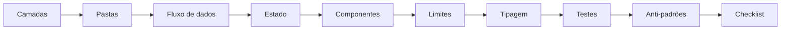

# Design de Software Frontend

O SDK te dá as **peças**. Esta seção ensina a **arrumar** as peças.

Um app React quebra por motivos previsíveis: o componente que era pequeno virou
um arquivo de 900 linhas, o `fetch` que era um só virou dezoito espalhados, o
estado que era um `useState` virou seis fontes de verdade que discordam entre si.
Nada disso é falta de biblioteca — é falta de **desenho**.

!!! tip "Você não precisa saber tudo antes de começar"
    Cada página aqui é curta e assume só as anteriores. Comece na primeira,
    aplique no seu app, volte pra próxima. Nada aqui exige refatorar tudo de uma
    vez.

## O problema, em uma frase

> Todo app frontend cresce. O que decide se ele fica agradável ou insuportável é
> **quantas coisas você precisa ter na cabeça pra mudar uma linha**.

Design de software é o trabalho de manter esse número baixo. As técnicas são
sempre as mesmas três:

1. **Separar** o que muda por motivos diferentes (camadas).
2. **Limitar** o tamanho de cada peça (limites objetivos).
3. **Deixar o compilador cobrar** o que você não quer revisar à mão (tipagem).

## As quatro perguntas

Quando você abre um arquivo e não sabe se aquele código deveria estar ali, é
sempre uma dessas quatro:

| Pergunta                          | Onde a resposta mora                                       |
| --------------------------------- | ---------------------------------------------------------- |
| **Em que camada isso vive?**      | [Camadas de um app frontend](architecture.md)              |
| **Em que arquivo/pasta isso vai?** | [Estrutura de pastas](folders.md)                          |
| **Quem sabe falar com o backend?** | [Fluxo de dados](data-flow.md)                             |
| **Onde esse estado deveria morar?** | [Onde mora cada estado](state.md)                          |

E quando o arquivo já existe e você precisa decidir se ele está bom:

| Pergunta                            | Onde a resposta mora                       |
| ----------------------------------- | ------------------------------------------ |
| **Esse componente está grande demais?** | [Limites objetivos](limits.md)         |
| **Como quebro sem virar sopa de props?** | [Pensando em componentes](components.md) |
| **Como o tipo impede o bug?**       | [Tipagem forte](typing.md)                 |
| **O que eu testo disso?**           | [Estratégia de testes](testing.md)         |

## O caminho recomendado

**Desenho do sistema** (as quatro primeiras) responde _onde as coisas moram_.
**Escrevendo o código** (as três do meio) responde _como cada peça é escrita_.
**Sustentando** (as três últimas) responde _como isso continua verdade em seis
meses_.

## O resumo de tudo, numa tabela

Se você só ler uma coisa desta seção, leia esta tabela. Todo o resto é a
justificativa dela.

| Regra                                                               | Por quê                                                        | Página                          |
| ------------------------------------------------------------------- | -------------------------------------------------------------- | ------------------------------- |
| Arquivo `.tsx` de componente: **≤ 150 linhas**                      | Acima disso ninguém lê o arquivo inteiro antes de editar        | [Limites](limits.md)            |
| Hook customizado: **≤ 100 linhas**, uma responsabilidade            | Hook grande é serviço disfarçado                                | [Limites](limits.md)            |
| Props de um componente: **≤ 7**                                     | Mais que isso é sinal de dois componentes num só                | [Componentes](components.md)    |
| **Zero `any`**. `unknown` na borda, tipo estreito depois            | `any` desliga o compilador exatamente onde você mais precisa    | [Tipagem](typing.md)            |
| Toda resposta de rede passa por **schema zod**                      | Backend muda sem avisar; a borda é o único lugar de validar     | [Fluxo de dados](data-flow.md)  |
| Componente **nunca** chama `fetch` direto                           | Amarra UI a transporte e mata o teste                           | [Fluxo de dados](data-flow.md)  |
| Dado de servidor vive no **TanStack Query**, não em `useState`      | Cache, revalidação e loading de graça, sem sincronizar à mão    | [Estado](state.md)              |
| Filtro/paginação/aba vivem na **URL**                               | Link compartilhável, botão voltar funcionando                   | [Estado](state.md)              |
| Camada de baixo **não importa** camada de cima                      | A seta única é o que permite testar e mover código              | [Camadas](architecture.md)      |
| Uma pasta por **feature**, não por tipo de arquivo                  | Você edita features, não "todos os hooks do app"                | [Pastas](folders.md)            |

!!! warning "Regra não é dogma — é default"
    Cada limite aqui tem uma saída de emergência documentada na página dele.
    Passar de 150 linhas num arquivo de tabela com 30 colunas pode ser a escolha
    certa. O que **não** é aceitável é passar sem perceber.

## Como isso se conecta ao SDK

O `tempest-react-sdk` já implementa a maior parte da infraestrutura que este
desenho pede. Você não constrói as camadas do zero:

| Camada             | O que o SDK já entrega                                                                     |
| ------------------ | ------------------------------------------------------------------------------------------ |
| Bootstrap/providers | [`<AppProviders>`](../app-providers.md) — ErrorBoundary → Query → Theme → i18n num bloco  |
| Rotas              | [`defineRoutes`, `<AppRouter>`, `<RouteGuard>`](../routing.md)                              |
| Serviços/HTTP      | [`createApiClient`, `parseResponse`](../http.md), [`createDataProvider`](../data-provider.md) |
| Estado de servidor | [`QueryProvider`, `createQueryKeys`, `usePaginatedQuery`](../query.md)                       |
| Estado de cliente  | [`createStore`, `createSelectors`](../state.md)                                              |
| Formulários        | [`useZodForm`, `<FormField>`](../forms.md)                                                   |
| UI                 | [117 componentes](../components.md) com tokens `--tempest-*`                                 |
| Ferramenta         | [`tempest doctor` / `lint` / `fix`](../cli.md)                                                |

## Recap

- Design existe pra manter baixo o **número de coisas na cabeça** por mudança.
- Três alavancas: **separar** por motivo de mudança, **limitar** tamanho, **tipar**
  pra o compilador cobrar.
- A tabela de regras acima é o contrato; cada página explica o porquê e a saída
  de emergência.
- O SDK já implementa as camadas — seu trabalho é **não furar** as fronteiras.

Próxima página: [Camadas de um app frontend](architecture.md) 🚀
