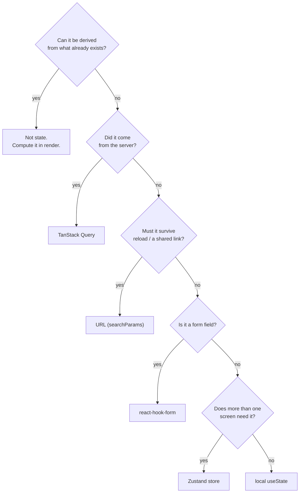

# Where each state lives

Almost every hard frontend bug is the same thing: **two sources of truth for the
same data**. The list came from the server and also lives in a `useState`; the
filter is in the URL and also in a store; the total is a field and also a sum. One
of the two always goes stale.

The cure isn't a better library. It's deciding, for each piece of state, **one**
place where it lives.

## Five places, five questions



| Kind of state          | Lives in                              | Example                          |
| ---------------------- | ------------------------------------- | -------------------------------- |
| **Derived**            | nothing — compute it                  | total, `isValid`, count, label   |
| **Server**             | [TanStack Query](../query.md)          | order list, profile              |
| **Navigation**         | URL (`useSearchParams`)               | page, filter, tab, search term   |
| **Form**               | [`useZodForm`](../forms.md)            | fields, errors, `isSubmitting`   |
| **Global client**      | [`createStore`](../state.md)           | session, theme, cart, preference |
| **Local UI**           | `useState`                            | modal open, hover, accordion     |
| **Persisted offline**  | [`createOfflineStore`](../offline.md)  | outbox, Dexie cache              |

## 1. Derived is not state {#derived}

The most common mistake, and the cheapest to fix:

=== "❌ Wrong"

    ```tsx
    const [orders, setOrders] = useState<Order[]>([]);
    const [total, setTotal] = useState(0);

    useEffect(() => {
      setTotal(orders.reduce((sum, o) => sum + o.totalCents, 0));
    }, [orders]);
    ```

    Two sources, a syncing `useEffect`, and a render window where `total` is wrong.

=== "✅ Right"

    ```tsx
    const [orders, setOrders] = useState<Order[]>([]);
    const total = orders.reduce((sum, o) => sum + o.totalCents, 0);
    ```

    One source. Impossible to diverge.

!!! tip "A `useEffect` that only calls `setState` is almost always derived state"
    Search your app for that pattern — it's the best effort-to-payoff find there
    is. And no, you don't need `useMemo` for this: memoize when you **measure** the
    computation to be expensive, not by reflex.

## 2. Server data does not live in `useState`

=== "❌ Wrong"

    ```tsx
    const [orders, setOrders] = useState<Order[]>([]);
    const [isLoading, setIsLoading] = useState(true);
    const [error, setError] = useState<Error | null>(null);

    useEffect(() => {
      let alive = true;
      listOrders(page)
        .then((data) => alive && setOrders(data))
        .catch((e) => alive && setError(e))
        .finally(() => alive && setIsLoading(false));
      return () => {
        alive = false;
      };
    }, [page]);
    ```

=== "✅ Right"

    ```tsx
    const { data: orders = [], isLoading, error } = useOrders(page);
    ```

The first has 3 states to keep in sync, an `alive` flag to avoid setState after
unmount, zero cache, zero dedupe across components, zero revalidation when you come
back to the tab. The second has all of it — because **server state is cache**, and
cache is a solved problem.

!!! info "What Query already does for you"
    Dedupe of simultaneous requests, `staleTime`, refetch on focus/reconnect, retry,
    optimistic mutations, invalidation by key, offline persistence. Each of those is
    a bug you don't write. See [Query](../query.md).

## 3. Navigation state lives in the URL

Filter, page, sorting, active tab, search term: if the user might want to **send
the link to someone**, the state belongs to the URL.

```tsx
import { useSearchParams } from "tempest-react-sdk";

/**
 * Orders screen. Page and status live in the query string, so the browser back
 * button, refresh and a shared link all restore the same view.
 */
export function Orders() {
  const [params, setParams] = useSearchParams();

  const page = Number(params.get("page") ?? 1);
  const status = params.get("status") ?? "all";

  const setStatus = (next: string) => {
    setParams({ status: next, page: "1" });
  };

  const { data = [], isLoading } = useOrders({ page, status });
  // …
}
```

Notice: no `useState`. No `useEffect` syncing URL with state. The URL **is** the
state.

!!! warning "Mirroring the URL into a `useState` is the classic mistake"
    `const [page, setPage] = useState(Number(params.get("page")))` creates the
    second source of truth immediately: the back button changes the URL and doesn't
    change the `useState`. Read from the URL on every render — it's cheap and always
    correct.

## 4. Forms have their own owner

A field controlled by `useState` means `onChange` re-rendering the whole screen on
every keystroke, hand-written validation, and errors out of sync:

```tsx
import { FormField, Input, useZodForm } from "tempest-react-sdk";
import { z } from "zod";

const schema = z.object({
  name: z.string().min(3, "At least 3 characters"),
  email: z.string().email("Invalid email"),
});

/** Customer form: one schema drives types, validation and error messages. */
export function CustomerForm({ onSave }: { onSave: (v: z.infer<typeof schema>) => void }) {
  const form = useZodForm(schema);

  return (
    <form onSubmit={form.handleSubmit(onSave)}>
      <FormField name="name" label="Name" control={form.control}>
        <Input />
      </FormField>
      <FormField name="email" label="Email" control={form.control}>
        <Input type="email" />
      </FormField>
      <button type="submit" disabled={form.formState.isSubmitting}>
        Save
      </button>
    </form>
  );
}
```

One schema produces **three** things: the TypeScript type, the runtime validation
and the error message. Details in [Forms (zod)](../forms.md).

## 5. Global client state: a store, and only what's needed

A store is for state that does **not** come from the server and that **several**
screens need: session, theme, cart, preferences, a multi-step wizard.

```ts
// src/stores/cart.ts
import { createSelectors, createStore } from "tempest-react-sdk";

interface CartState {
  items: string[];
  add: (id: string) => void;
  clear: () => void;
}

/**
 * Cart slice. Only `items` is persisted — the actions are recreated on load,
 * so writing them to storage would just bloat the payload.
 */
export const useCart = createSelectors(
  createStore<CartState>(
    (set) => ({
      items: [],
      add: (id) => set((s) => ({ items: [...s.items, id] })),
      clear: () => set({ items: [] }),
    }),
    { persist: { name: "cart", partialize: (s) => ({ items: s.items }) } },
  ),
);
```

`createSelectors` generates `useCart.use.items()` — the component subscribes to
**one field** instead of the whole store, and doesn't re-render when another field
changes.

!!! danger "A store is not a server cache"
    Putting the order list in a Zustand store re-implements by hand everything Query
    already does — without invalidation, revalidation or dedupe. The symptom is
    always the same: the screen shows stale data after a POST.

## 6. Local UI state: `useState`, guilt-free

Modal open, hovered item, expanded accordion, carousel index. None of that needs a
library:

```tsx
const [isOpen, setIsOpen] = useState(false);
```

If only **one** component and its direct children need it, `useState` is the right
answer. Lifting it into a global store is free coupling.

## The 10-second test

Look at a `useState` in your app and ask, in this order:

1. Can I **compute** this? → delete it.
2. Did it come from the **network**? → Query.
3. Does it make sense in the **link**? → URL.
4. Is it a **field**? → form.
5. Does **another screen** need it? → store.
6. None of the above? → leave it where it is. It's right.

## Recap

- A state bug is almost always **two sources of truth**.
- Derived is not state: compute in render, don't sync with `useEffect`.
- Server → **Query**. Navigation → **URL**. Field → **form**. Shared → **store**.
  Only here → **`useState`**.
- `createSelectors` makes a component subscribe to one field, not the whole store.
- A store never replaces a server cache.

Next: [Thinking in components](components.md).
