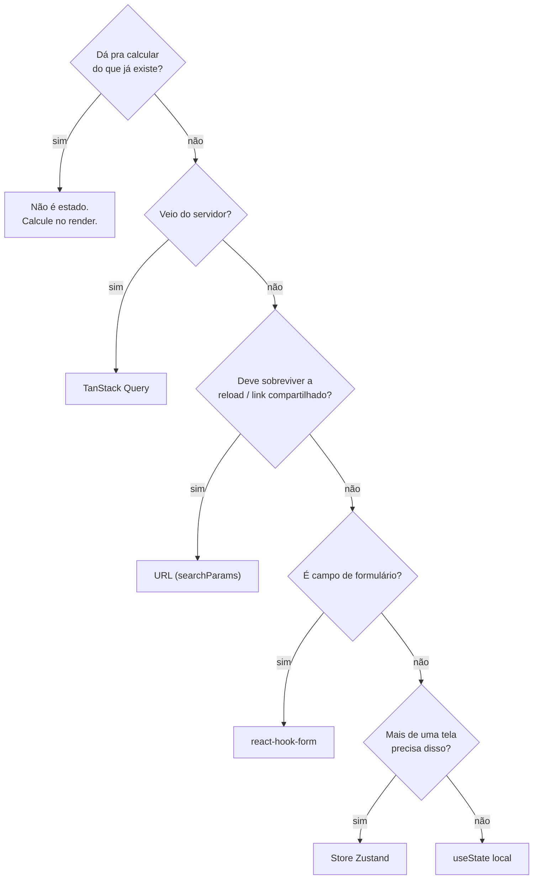

# Onde mora cada estado

Quase todo bug difícil de app frontend é a mesma coisa: **duas fontes de verdade
pro mesmo dado**. A lista veio do servidor e também está num `useState`; o filtro
está na URL e também num store; o total é campo e também é soma. Uma das duas
sempre fica velha.

A cura não é uma biblioteca melhor. É decidir, pra cada pedaço de estado, **um**
lugar onde ele mora.

## Cinco lugares, cinco perguntas



| Tipo de estado             | Mora em                              | Exemplo                             |
| -------------------------- | ------------------------------------ | ----------------------------------- |
| **Derivado**               | nada — calcule                       | total, `isValid`, contagem, label   |
| **De servidor**            | [TanStack Query](../query.md)         | lista de pedidos, perfil            |
| **De navegação**           | URL (`useSearchParams`)              | página, filtro, aba, busca          |
| **De formulário**          | [`useZodForm`](../forms.md)           | campos, erros, `isSubmitting`       |
| **Global de cliente**      | [`createStore`](../state.md)          | sessão, tema, carrinho, preferência |
| **Local de UI**            | `useState`                           | modal aberto, hover, acordeão       |
| **Offline persistido**     | [`createOfflineStore`](../offline.md) | outbox, cache Dexie                 |

## 1. Derivado não é estado {#derived}

O erro mais comum e o mais barato de corrigir:

=== "❌ Errado"

    ```tsx
    const [orders, setOrders] = useState<Order[]>([]);
    const [total, setTotal] = useState(0);

    useEffect(() => {
      setTotal(orders.reduce((sum, o) => sum + o.totalCents, 0));
    }, [orders]);
    ```

    Duas fontes, um `useEffect` de sincronização e uma janela de render em que
    `total` está errado.

=== "✅ Certo"

    ```tsx
    const [orders, setOrders] = useState<Order[]>([]);
    const total = orders.reduce((sum, o) => sum + o.totalCents, 0);
    ```

    Uma fonte. Impossível divergir.

!!! tip "`useEffect` que só chama `setState` é quase sempre estado derivado"
    Procure por esse padrão no seu app — é o achado com melhor relação
    esforço/ganho que existe. E não, você não precisa de `useMemo` pra isso:
    memoize quando **medir** que o cálculo é caro, não por reflexo.

## 2. Dado de servidor não vive em `useState`

=== "❌ Errado"

    ```tsx
    const [orders, setOrders] = useState<Order[]>([]);
    const [isLoading, setIsLoading] = useState(true);
    const [error, setError] = useState<Error | null>(null);

    useEffect(() => {
      let alive = true;
      listOrders(page)
        .then((data) => alive && setOrders(data))
        .catch((e) => alive && setError(e))
        .finally(() => alive && setIsLoading(false));
      return () => {
        alive = false;
      };
    }, [page]);
    ```

=== "✅ Certo"

    ```tsx
    const { data: orders = [], isLoading, error } = useOrders(page);
    ```

O primeiro tem 3 estados pra manter em sincronia, uma flag `alive` pra evitar
setState depois do unmount, zero cache, zero dedupe entre componentes, zero
revalidação ao voltar pra aba. O segundo tem tudo isso — porque **estado de
servidor é cache**, e cache é um problema resolvido.

!!! info "Foco no que a Query já faz por você"
    Dedupe de requests simultâneos, `staleTime`, refetch em foco/reconexão,
    retry, mutation otimista, invalidação por key, persistência offline. Cada uma
    dessas linhas é um bug que você não escreve. Veja [Query](../query.md).

## 3. Estado de navegação mora na URL

Filtro, página, ordenação, aba ativa, termo de busca: se o usuário puder querer
**mandar o link pra alguém**, o estado é da URL.

```tsx
import { useSearchParams } from "tempest-react-sdk";

/**
 * Orders screen. Page and status live in the query string, so the browser back
 * button, refresh and a shared link all restore the same view.
 */
export function Orders() {
  const [params, setParams] = useSearchParams();

  const page = Number(params.get("page") ?? 1);
  const status = params.get("status") ?? "all";

  const setStatus = (next: string) => {
    setParams({ status: next, page: "1" });
  };

  const { data = [], isLoading } = useOrders({ page, status });
  // …
}
```

Repare: nenhum `useState`. Nenhum `useEffect` sincronizando URL com estado. A URL
**é** o estado.

!!! warning "Duplicar a URL num `useState` é o clássico"
    `const [page, setPage] = useState(Number(params.get("page")))` cria a segunda
    fonte de verdade na hora: o botão voltar muda a URL e não muda o `useState`.
    Leia da URL a cada render — é barato e sempre correto.

## 4. Formulário tem dono próprio

Campo controlado por `useState` é `onChange` re-renderizando a tela inteira a cada
tecla, validação escrita à mão e erro fora de sincronia:

```tsx
import { FormField, Input, useZodForm } from "tempest-react-sdk";
import { z } from "zod";

const schema = z.object({
  name: z.string().min(3, "Mínimo 3 caracteres"),
  email: z.string().email("E-mail inválido"),
});

/** Customer form: one schema drives types, validation and error messages. */
export function CustomerForm({ onSave }: { onSave: (v: z.infer<typeof schema>) => void }) {
  const form = useZodForm(schema);

  return (
    <form onSubmit={form.handleSubmit(onSave)}>
      <FormField name="name" label="Nome" control={form.control}>
        <Input />
      </FormField>
      <FormField name="email" label="E-mail" control={form.control}>
        <Input type="email" />
      </FormField>
      <button type="submit" disabled={form.formState.isSubmitting}>
        Salvar
      </button>
    </form>
  );
}
```

Um schema gera **três** coisas: o tipo TypeScript, a validação em runtime e a
mensagem de erro. Detalhes em [Forms (zod)](../forms.md).

## 5. Global de cliente: store, e só o necessário

Store é pra estado que **não** vem do servidor e **várias** telas precisam:
sessão, tema, carrinho, preferências, wizard multi-etapa.

```ts
// src/stores/cart.ts
import { createSelectors, createStore } from "tempest-react-sdk";

interface CartState {
  items: string[];
  add: (id: string) => void;
  clear: () => void;
}

/**
 * Cart slice. Only `items` is persisted — the actions are recreated on load,
 * so writing them to storage would just bloat the payload.
 */
export const useCart = createSelectors(
  createStore<CartState>(
    (set) => ({
      items: [],
      add: (id) => set((s) => ({ items: [...s.items, id] })),
      clear: () => set({ items: [] }),
    }),
    { persist: { name: "cart", partialize: (s) => ({ items: s.items }) } },
  ),
);
```

O `createSelectors` gera `useCart.use.items()` — o componente assina **um campo**
em vez do store inteiro, e não re-renderiza quando outro campo muda.

!!! danger "Store não é cache de servidor"
    Colocar a lista de pedidos num Zustand store recria à mão tudo que a Query já
    faz — e sem invalidação, sem revalidação, sem dedupe. O sintoma é sempre o
    mesmo: a tela mostra dado velho depois de um POST.

## 6. Local de UI: `useState` sem culpa

Modal aberto, item em hover, acordeão expandido, índice do carrossel. Nada disso
precisa de biblioteca:

```tsx
const [isOpen, setIsOpen] = useState(false);
```

Se só **um** componente e seus filhos diretos precisam, `useState` é a resposta
certa. Subir isso pra store global é acoplamento gratuito.

## O teste dos 10 segundos

Olhe um `useState` do seu app e pergunte, nessa ordem:

1. Consigo **calcular** isso? → apague.
2. Isso **veio da rede**? → Query.
3. Faz sentido no **link**? → URL.
4. É **campo**? → form.
5. **Outra tela** precisa? → store.
6. Nenhuma? → fica onde está. Está certo.

## Recap

- Bug de estado é quase sempre **duas fontes de verdade**.
- Derivado não é estado: calcule no render, não sincronize com `useEffect`.
- Servidor → **Query**. Navegação → **URL**. Campo → **form**. Compartilhado →
  **store**. Só aqui → **`useState`**.
- `createSelectors` faz o componente assinar um campo, não o store inteiro.
- Store nunca substitui cache de servidor.

Próxima: [Pensando em componentes](components.md).
