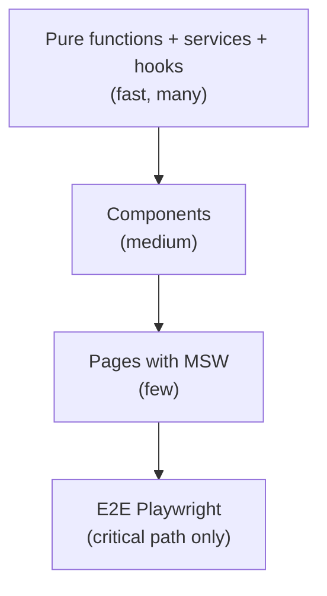

# Testing strategy

Frontend testing has a trap of its own: it's easy to write many tests that protect
nothing. They verify that the component renders the text the component renders, break
on every refactor, and pass even when the app is broken.

The question that separates a good test from a bad one is always the same: **which bug
would this test have caught?** If there's no answer, delete it.

## What to test in each layer

The [layers](architecture.md) determine the kind of test. It isn't the same technique
everywhere:

| Layer         | Technique                        | Verifies                                      | Quantity   |
| ------------- | -------------------------------- | --------------------------------------------- | ---------- |
| Pure function | unit test                         | input → output, edges included                | many       |
| Service       | unit test with `fetch` mocked     | builds the request, validates, maps errors    | many       |
| Hook          | `renderHook`                      | state transitions, effects, cleanup           | many       |
| UI component  | `render` + `screen` by **role**   | what the user sees and can do                 | medium     |
| Page          | render with providers + MSW       | the screen wires the pieces together          | few        |
| Flow          | Playwright                        | the critical path end to end                  | very few   |



!!! tip "Cheap tests first"
    A pure-function test runs in milliseconds and is never flaky. An E2E runs in
    seconds and breaks on timing. Push each verification to the cheapest level that
    can prove it — and it's the layered architecture that gives you that option.

## Tooling: what the SDK uses

```bash
npm test              # vitest watch
npm run test:run      # one pass
npm run test:coverage
npm run typecheck     # tsc -b --noEmit (includes the tests)
```

Stack: **Vitest** + **@testing-library/react** + **jsdom**, with
`fake-indexeddb/auto` in setup so Dexie works under Node. The
[scaffold template](../scaffold.md) already ships this.

Numbers from this repository, as a reference for what's sustainable: **3283 tests
across 414 files, ~29 s**. The coverage floors that gate CI:

| Metric     | Floor |
| ---------- | ----- |
| lines      | 98%   |
| statements | 97%   |
| functions  | 96%   |
| branches   | 94%   |

!!! warning "Coverage is a floor, not a goal"
    100% coverage with weak assertions protects less than 80% with assertions that
    check behaviour. The floor exists to prevent code that was **never exercised
    once** — it does not measure test quality.

## Components: query by role, not by class

The rule that decides whether the test survives a refactor:

=== "✅ Right"

    ```tsx
    it("fires onPay when Pay is clicked", async () => {
      const onPay = vi.fn();
      const user = userEvent.setup();

      render(<OrderTable orders={[order]} onPay={onPay} />);
      await user.click(screen.getByRole("button", { name: "Pay" }));

      expect(onPay).toHaveBeenCalledWith(order.id);
    });
    ```

=== "❌ Wrong"

    ```tsx
    it("renders the table", () => {
      const { container } = render(<OrderTable orders={[order]} onPay={vi.fn()} />);
      expect(container.querySelector(".tempest_table_3f9a")).toBeTruthy();
    });
    ```

The first test fails when behaviour changes. The second fails when the **CSS**
changes — and passes even if the button stops working. It's worse than no test,
because it gives false confidence.

Query preference order:

1. `getByRole` (with `name`) — what the user and the screen reader see.
2. `getByLabelText` — form fields.
3. `getByText` — visible content.
4. `getByTestId` — last resort, when there is neither a role nor stable text.

!!! info "Querying by role tests accessibility for free"
    If `getByRole("button", { name: "Pay" })` doesn't find it, it's because you used a
    `<div onClick>` or forgot the accessible name. The test warns you about a real a11y
    problem without you writing an a11y test.

## Services: mock `fetch`, not the service

```ts
import { describe, expect, it, vi } from "vitest";

import { listOrders } from "./orders.service";

describe("listOrders", () => {
  it("validates the response and turns createdAt into a Date", async () => {
    vi.stubGlobal(
      "fetch",
      vi.fn().mockResolvedValue(
        new Response(
          JSON.stringify([
            {
              id: "3f2a…",
              code: "ORD-1",
              status: "paid",
              total_cents: 1990,
              created_at: "2026-07-28T12:00:00Z",
            },
          ]),
          { status: 200, headers: { "Content-Type": "application/json" } },
        ),
      ),
    );

    const orders = await listOrders(1);

    expect(orders[0].createdAt).toBeInstanceOf(Date);
    expect(orders[0].totalCents).toBe(1990);
  });

  it("rejects a payload that doesn't match the schema", async () => {
    vi.stubGlobal(
      "fetch",
      vi.fn().mockResolvedValue(new Response(JSON.stringify([{ id: 1 }]), { status: 200 })),
    );

    await expect(listOrders(1)).rejects.toThrow();
  });
});
```

The second test is what justifies `parseResponse` existing at all. Without it, the
schema is decoration.

## Pages: MSW with `createMockHandlers`

A page test verifies that the pieces fit together — it doesn't repeat what the
component test already covered:

```ts
import { createMockHandlers } from "tempest-react-sdk/testing";

export const orderHandlers = createMockHandlers([
  { method: "GET", path: "/orders", body: [{ id: "1", code: "ORD-1", status: "paid" }] },
  { method: "POST", path: "/orders/1/pay", status: 200, body: { id: "1", status: "paid" } },
  { method: "GET", path: "/orders/999", status: 404, body: { detail: "Not found" } },
]);
```

One handler per scenario, including the error one — the error screen is the one nobody
tests and the one users see most. Details in [Testing helpers](../testing.md).

## Hooks: `renderHook` without a DOM

```ts
import { renderHook } from "@testing-library/react";
import { act } from "react";

it("toggles row selection", () => {
  const { result } = renderHook(() => useOrderTable([order]));

  act(() => result.current.toggle(order.id));
  expect(result.current.selected.has(order.id)).toBe(true);

  act(() => result.current.toggle(order.id));
  expect(result.current.selected.has(order.id)).toBe(false);
});
```

That's why [extracting logic into a hook](components.md#logic-to-hook) pays off: you
test the rule without mounting a table, without looking for a button, without waiting
for a render.

## What **not** to test

| Don't test                                   | Because                                            |
| -------------------------------------------- | -------------------------------------------------- |
| That an SDK component works                  | it already has 3283 tests                          |
| CSS class, DOM structure, big snapshot       | breaks on refactor, catches no bug                 |
| Internal implementation (`useState` called)  | you tested the code, not the behaviour             |
| Trivial getter/setter                        | no bug is possible there                           |
| That `zod` validates                         | that's the library; test **your schema** with a bad payload |

!!! danger "A big snapshot is debt disguised as coverage"
    A 400-line `toMatchSnapshot()` ends up updated with `-u` without anyone reading the
    diff. It stops being a test and becomes noise in the PR. Snapshots are worth it for
    small, stable output (a formatted string, a config object).

## Accessibility and pixels

Two things a jsdom test does **not** catch:

- **Colour contrast.** `axe` disables the `color-contrast` rule under jsdom because
  there is no paint. That bug only shows up in a real browser — it happened twice in
  this repository with a text token over a tinted surface.
- **Layout.** jsdom doesn't compute layout: `offsetParent` is always `null`, height is
  always 0.

That's why CI has a Playwright smoke over the [gallery](../gallery.md) on top of the
jsdom `axe` sweep. For your app: a visual change is validated in a browser, not in an
`expect`.

## Recap

- Every test answers "**which bug would this catch?**". No answer, delete it.
- The layer determines the technique: function/service/hook unit tests (many) →
  component (medium) → page with MSW (few) → E2E (very few).
- Query by **role**, never by CSS class — and get a11y verification for free.
- A service test mocks `fetch`, **including an invalid payload**, not just the happy
  path.
- Coverage is a floor (98/97/96/94 here), not a goal.
- Contrast and layout can only be validated in a **real browser**.

Next: [Anti-patterns](anti-patterns.md).
