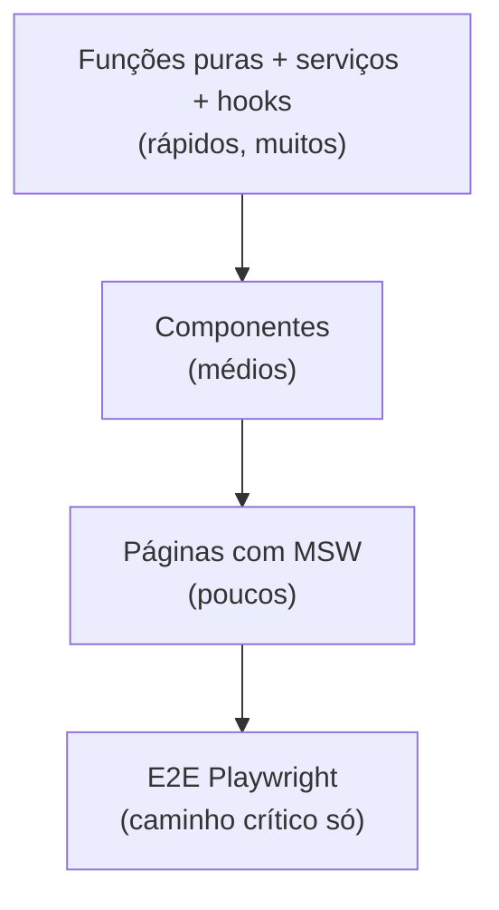

# Estratégia de testes

Teste de frontend tem uma armadilha própria: é fácil escrever muitos testes que
não protegem nada. Eles verificam que o componente renderiza o texto que o
componente renderiza, quebram a cada refatoração e passam mesmo quando o app está
quebrado.

A pergunta que separa teste bom de teste ruim é sempre a mesma: **que bug esse
teste teria pegado?** Se não tem resposta, apague.

## O que testar em cada camada

As [camadas](architecture.md) definem o tipo de teste. Não é a mesma técnica em
todas:

| Camada        | Técnica                          | O que verifica                                | Quantidade |
| ------------- | -------------------------------- | --------------------------------------------- | ---------- |
| Função pura   | teste unitário                    | entrada → saída, incluindo borda              | muitos     |
| Serviço       | unitário com `fetch` mockado      | monta request, valida resposta, mapeia erro   | muitos     |
| Hook          | `renderHook`                      | transição de estado, efeito, cleanup          | muitos     |
| Componente UI | `render` + `screen` por **papel** | o que o usuário vê e consegue fazer           | médio      |
| Página        | render com provider + MSW         | a tela junta as peças                         | poucos     |
| Fluxo         | Playwright                        | o caminho crítico ponta a ponta               | pouquíssimos |



!!! tip "Teste barato primeiro"
    Um teste de função pura roda em milissegundos e nunca fica instável. Um E2E
    roda em segundos e quebra por timing. Empurre a verificação pro nível mais
    barato que consegue provar a coisa — e é a arquitetura em camadas que dá essa
    opção.

## Ferramenta: o que o SDK usa

```bash
npm test              # vitest watch
npm run test:run      # uma passada
npm run test:coverage
npm run typecheck     # tsc -b --noEmit (inclui os testes)
```

Stack: **Vitest** + **@testing-library/react** + **jsdom**, com
`fake-indexeddb/auto` no setup pra Dexie funcionar em Node. O
[template do scaffold](../scaffold.md) já vem com isso.

Números deste repositório, como referência do que é sustentável: **3283 testes em
414 arquivos, ~29 s**. Os pisos de cobertura que gateiam o CI:

| Métrica    | Piso |
| ---------- | ---- |
| lines      | 98%  |
| statements | 97%  |
| functions  | 96%  |
| branches   | 94%  |

!!! warning "Cobertura é piso, não meta"
    100% de cobertura com asserts fracos protege menos que 80% com asserts que
    checam comportamento. O piso serve pra impedir código **não exercitado
    nenhuma vez** — ele não mede qualidade de teste.

## Componente: consulte por papel, não por classe

A regra que decide se o teste vai sobreviver a uma refatoração:

=== "✅ Certo"

    ```tsx
    it("dispara onPay ao clicar em Pagar", async () => {
      const onPay = vi.fn();
      const user = userEvent.setup();

      render(<OrderTable orders={[order]} onPay={onPay} />);
      await user.click(screen.getByRole("button", { name: "Pagar" }));

      expect(onPay).toHaveBeenCalledWith(order.id);
    });
    ```

=== "❌ Errado"

    ```tsx
    it("renderiza a tabela", () => {
      const { container } = render(<OrderTable orders={[order]} onPay={vi.fn()} />);
      expect(container.querySelector(".tempest_table_3f9a")).toBeTruthy();
    });
    ```

O primeiro teste falha quando o comportamento muda. O segundo falha quando o
**CSS** muda — e passa mesmo se o botão parar de funcionar. Ele é pior que
nenhum teste, porque dá confiança falsa.

Ordem de preferência de consulta:

1. `getByRole` (com `name`) — é o que o usuário e o leitor de tela veem.
2. `getByLabelText` — campos de formulário.
3. `getByText` — conteúdo visível.
4. `getByTestId` — último recurso, quando não existe papel nem texto estável.

!!! info "Consultar por papel testa acessibilidade de graça"
    Se `getByRole("button", { name: "Pagar" })` não acha, é porque você usou
    `<div onClick>` ou esqueceu o nome acessível. O teste te avisa de um problema
    real de a11y sem você escrever um teste de a11y.

## Serviço: mocke `fetch`, não o serviço

```ts
import { describe, expect, it, vi } from "vitest";

import { listOrders } from "./orders.service";

describe("listOrders", () => {
  it("valida a resposta e converte createdAt em Date", async () => {
    vi.stubGlobal(
      "fetch",
      vi.fn().mockResolvedValue(
        new Response(
          JSON.stringify([
            {
              id: "3f2a…",
              code: "PED-1",
              status: "paid",
              total_cents: 1990,
              created_at: "2026-07-28T12:00:00Z",
            },
          ]),
          { status: 200, headers: { "Content-Type": "application/json" } },
        ),
      ),
    );

    const orders = await listOrders(1);

    expect(orders[0].createdAt).toBeInstanceOf(Date);
    expect(orders[0].totalCents).toBe(1990);
  });

  it("rejeita payload fora do schema", async () => {
    vi.stubGlobal(
      "fetch",
      vi.fn().mockResolvedValue(new Response(JSON.stringify([{ id: 1 }]), { status: 200 })),
    );

    await expect(listOrders(1)).rejects.toThrow();
  });
});
```

O segundo teste é o que justifica o `parseResponse` existir. Sem ele, o schema é
decoração.

## Página: MSW com `createMockHandlers`

Teste de página verifica que as peças se encaixam — não repete o que o teste do
componente já cobriu:

```ts
import { createMockHandlers } from "tempest-react-sdk/testing";

export const orderHandlers = createMockHandlers([
  { method: "GET", path: "/orders", body: [{ id: "1", code: "PED-1", status: "paid" }] },
  { method: "POST", path: "/orders/1/pay", status: 200, body: { id: "1", status: "paid" } },
  { method: "GET", path: "/orders/999", status: 404, body: { detail: "Not found" } },
]);
```

Um handler por cenário, incluindo o de erro — a tela de erro é a que ninguém testa
e a que o usuário mais vê. Detalhes em [Testing helpers](../testing.md).

## Hook: `renderHook` sem DOM

```ts
import { renderHook } from "@testing-library/react";
import { act } from "react";

it("alterna a seleção de uma linha", () => {
  const { result } = renderHook(() => useOrderTable([order]));

  act(() => result.current.toggle(order.id));
  expect(result.current.selected.has(order.id)).toBe(true);

  act(() => result.current.toggle(order.id));
  expect(result.current.selected.has(order.id)).toBe(false);
});
```

É por isso que [extrair lógica pra hook](components.md#logic-to-hook)
compensa: você testa a regra sem montar tabela, sem procurar botão, sem esperar
render.

## O que **não** testar

| Não teste                                    | Porque                                            |
| -------------------------------------------- | ------------------------------------------------- |
| Que o componente do SDK funciona             | ele já tem 3283 testes                            |
| Classe CSS, estrutura de DOM, snapshot grande | quebra em refatoração, não pega bug               |
| Implementação interna (`useState` chamado)   | você testou o código, não o comportamento         |
| Getter/setter trivial                        | não existe bug possível ali                       |
| Que `zod` valida                             | é a lib; teste **o seu schema** com payload errado |

!!! danger "Snapshot grande é dívida disfarçada de cobertura"
    Um `toMatchSnapshot()` de 400 linhas passa a ser atualizado com `-u` sem
    ninguém ler o diff. Ele deixa de ser teste e vira ruído no PR. Snapshot vale
    pra saída pequena e estável (uma string formatada, um objeto de config).

## Acessibilidade e pixel

Duas coisas que teste em jsdom **não** pega:

- **Contraste de cor.** O `axe` desliga a regra `color-contrast` em jsdom porque
  não há paint. Esse bug só aparece em browser real — aconteceu duas vezes neste
  repositório com token de texto sobre superfície tingida.
- **Layout.** jsdom não calcula layout: `offsetParent` é sempre `null`, altura é
  sempre 0.

Por isso o CI tem um smoke Playwright no [gallery](../gallery.md) além do sweep
`axe` em jsdom. Para o seu app: mudança visual se valida em browser, não em
`expect`.

## Recap

- Todo teste responde "**que bug isso pegaria?**". Sem resposta, apague.
- Camada define técnica: função/serviço/hook unitário (muitos) → componente
  (médio) → página com MSW (poucos) → E2E (pouquíssimos).
- Consulte por **papel**, nunca por classe CSS — e ganhe verificação de a11y de
  graça.
- Serviço testa com `fetch` mockado, **incluindo payload inválido**.
- Cobertura é piso (98/97/96/94 aqui), não meta.
- Contraste e layout só se validam em **browser real**.

Próxima: [Anti-padrões](anti-patterns.md).
