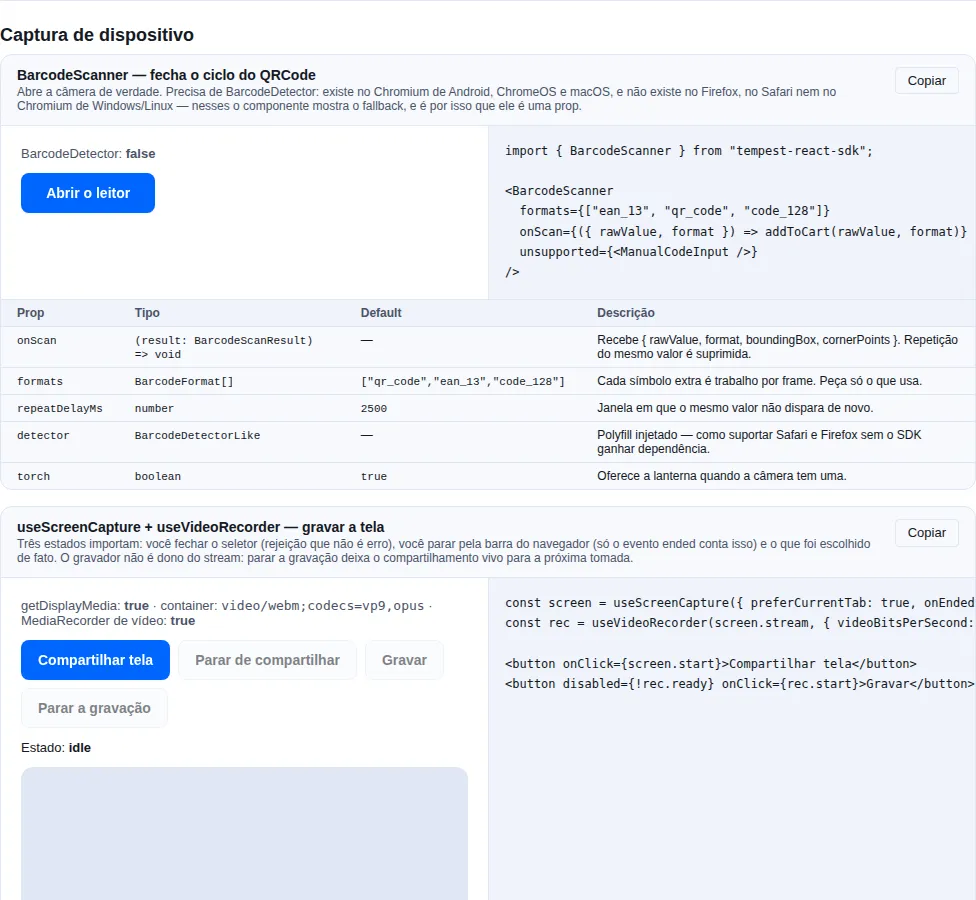

# Device capture

Four browser APIs that cost no dependency at all: the **camera reading codes**
(`BarcodeScanner`, `useBarcodeScanner`), **recorded video** (`useVideoRecorder`), the
**shared screen** (`useScreenCapture`) and **speech turned into text**
(`useSpeechRecognition`).

The whole slice measures **5.40 KB brotli** — and every one of those four things is an API
the browser already has, not a library the SDK bundled.

!!! tip "If you only want to read a barcode, jump to [Reading codes](#reading-codes-start-with-the-component)"
    The rest of the page is video, screen and speech, plus the lower layer of each.

!!! info "**Audio** capture lives on another page"
    Microphone, voice recording, level meter and WAV are in [Audio](./audio.md). The two
    pages share the same recording engine and the same error taxonomy — what changes is the
    device.

<!-- gallery:device-capture -->
[](gallery.md)

*Section `device-capture` of the [gallery](gallery.md) — run it locally to interact.*
<!-- /gallery -->

## Reading codes: start with the component

The SDK already had [`QRCode`](./components/utility.md), which **only encodes**.
`BarcodeScanner` closes the loop:

```tsx
import { BarcodeScanner } from "tempest-react-sdk";

export function ProductScanner({ onProduct }: { onProduct: (gtin: string) => void }) {
  return (
    <BarcodeScanner
      formats={["ean_13", "qr_code", "code_128"]}
      onScan={({ rawValue, format }) => {
        if (format === "ean_13") onProduct(rawValue);
      }}
      footer={<small>Point the camera at the barcode on the package.</small>}
      unsupported={<TypeCodeField onSubmit={onProduct} />}
    />
  );
}
```

What you get without writing anything:

| You did | The component does |
| --- | --- |
| nothing | Fixed-ratio viewport, corner brackets and a scanning indicator |
| nothing | A detect loop that **never overlaps** — it never queues a read on top of the last one |
| nothing | Suppresses the same code repeating; a **different** value fires immediately |
| nothing | The torch, when the camera has one |
| nothing | A classified camera error, with a retry button |
| `unsupported` | Where there is no decoder, shows your fallback instead of a black rectangle |

!!! danger "Mounting the scanner opens the camera — mount it when the user asks"
    `useCameraStream` acquires on mount, so rendering the scanner **is** firing the prompt.
    A prompt the user did not provoke is the most reliable way to earn a **permanent
    block** — after which `getUserMedia` rejects without ever asking again, which also
    burns the *next* feature that needs the camera. The pattern is a button that reveals
    it:

    ```tsx
    const [scanning, setScanning] = useState(false);

    return scanning ? (
      <BarcodeScanner onScan={accept} />
    ) : (
      <Button onClick={() => setScanning(true)}>Scan a code</Button>
    );
    ```

### `BarcodeDetector` does not exist in half the browsers

This is the part that decides the design of your screen, so it is here and not in a
footnote:

| Engine | Has `BarcodeDetector`? |
| --- | --- |
| Chromium on Android and ChromeOS | **yes** |
| Chromium on macOS | usually yes |
| Chromium on Windows and Linux | **no** |
| Firefox (any OS) | **no** |
| Any browser on iOS (all are WebKit underneath, Chrome included) | **no** |

The SDK bundles **no decoder at all**, and that is a choice rather than a gap: a QR reader
is Reed–Solomon error correction plus perspective correction plus a finder-pattern search,
and the honest options were a WASM build **every** consumer of this SDK would pay for, or
nothing. So what exists is the seam:

```tsx
import { BarcodeDetector } from "barcode-detector/pure"; // or your zxing-wasm wrapper
import { BarcodeScanner } from "tempest-react-sdk";

<BarcodeScanner
  detector={new BarcodeDetector({ formats: ["qr_code", "ean_13"] })}
  onScan={accept}
/>;
```

Anything with a `detect(source)` resolving to `{ rawValue }` will do — that is all the
`BarcodeDetectorLike` interface asks, and it is what the SDK's own tests exercise with a
real decoder.

!!! check "You need no decoder at all for the most common case"
    On operations screens (load checking, POS, inventory) the target is an Android phone,
    where the API exists. `unsupported` covers the office desktop with a text field — which
    tends to be what a keyboard-driven operator prefers anyway.

### Props

| Prop | Type | Default | What it does |
| --- | --- | --- | --- |
| `onScan` | `(result: BarcodeScanResult) => void` | — | Every accepted read. |
| `formats` | `BarcodeFormat[]` | `DEFAULT_BARCODE_FORMATS` = `["qr_code","ean_13","code_128"]` | Every extra symbology is work per frame. `ALL_BARCODE_FORMATS` carries the whole domain, for building a picker. |
| `paused` | `boolean` | `false` | Stops looking **without** releasing the camera. |
| `detector` | `BarcodeDetectorLike` | — | Injected polyfill. |
| `intervalMs` | `number` | `200` | How often a frame is examined. |
| `repeatDelayMs` | `number` | `2500` | Window in which the same value does not fire again. |
| `torch` | `boolean` | `true` | Offers the torch when the camera has one. |
| `aspectRatio` | `number` | `4 / 3` | Viewport ratio. |
| `locale` | `"pt-BR" \| "en"` | `"pt-BR"` | Labels. |
| `footer` · `unsupported` | `ReactNode` | — | Instruction and fallback. |
| `onError` | `(error: unknown) => void` | — | A frame the engine refused (routine). |

`BarcodeScanResult = { rawValue, format, boundingBox, cornerPoints }` — `boundingBox` is
`null` and `cornerPoints` is `[]` when the engine reports no geometry.

### The formats that matter here

Three carry the weight in Brazil: **`ean_13`** is the barcode on every packaged product,
**`qr_code`** is what a Pix "copia e cola" payload travels in, and **`code_128`** is the
label on a shipment. The default is exactly those three.

!!! warning "Asking for a format the engine does not have makes the constructor throw"
    `NotSupportedError`, which reads like a bug in your code. The format list belongs to the
    **platform** decoder, not to the browser, so two Chromium builds on two operating
    systems answer differently. The hook handles that by asking for the intersection — and
    you can look first:

    ```tsx
    import { getSupportedBarcodeFormats } from "tempest-react-sdk";

    const formats = await getSupportedBarcodeFormats(); // [] where there is no decoder
    ```

### Repeat suppression is not a detail

A symbol stays in frame for as long as the user holds the camera there. Without
suppression, the same code fires five times a second — and wired to "add to cart" that is a
bug the customer pays for. `repeatDelayMs` (2.5 s by default) is the window in which **the
same** value is ignored; a different value never is.

If your screen opens a confirmation after a read, set `paused` while it is open — it stops
looking without releasing the camera, so closing the confirmation costs no second
permission round-trip.

### Torch

```tsx
import { useTorch } from "tempest-react-sdk";

const torch = useTorch(stream);
{torch.supported && <button onClick={() => void torch.toggle()}>Torch</button>}
```

!!! info "The torch is not a device — it is a constraint on a live track"
    There is nothing to control before a camera stream exists, and it disappears when that
    stream is released. That is why `supported` can only be answered afterwards: the same
    code is `true` on an Android rear camera and `false` on the front one of the same
    phone. Where neither `getCapabilities()` nor `getSettings()` mentions `torch`, the hook
    reports `false` instead of offering a button that silently does nothing.

### Building it yourself: `useBarcodeScanner`

```tsx
import { useBarcodeScanner } from "tempest-react-sdk";

export function OwnScanner() {
  const scanner = useBarcodeScanner({
    formats: ["ean_13"],
    onScan: ({ rawValue }) => console.log(rawValue),
  });

  if (!scanner.supported) return <p>This browser cannot decode codes.</p>;

  return (
    <>
      <video ref={scanner.videoRef} muted playsInline style={{ width: "100%" }} />
      <p>{scanner.scanning ? "Looking…" : scanner.status}</p>
      {scanner.error && <p role="alert">{scanner.error.message}</p>}
    </>
  );
}
```

The loop re-arms itself **after** each `detect()` settles rather than on a `setInterval`:
decoding sometimes takes longer than the interval, and an interval would queue calls faster
than the engine drains them until the tab is unusable.

## Recording video

`useVideoRecorder` is `useAudioRecorder` with a video track and `videoBitsPerSecond` — the
clock that **subtracts paused time**, the `stop()` that resolves with every chunk in hand
and the container negotiation are the same, because it is the same engine.

```tsx
import { useScreenCapture, useVideoRecorder } from "tempest-react-sdk";

export function ScreenRecorder() {
  const screen = useScreenCapture({ preferCurrentTab: true });
  const rec = useVideoRecorder(screen.stream, {
    maxDurationMs: 120_000,
    videoBitsPerSecond: 2_500_000,
    onRecorded: ({ blob, durationMs }) => send(blob, durationMs),
  });

  return (
    <>
      <button onClick={screen.start}>Share screen</button>
      <button disabled={!rec.ready} onClick={rec.start}>Record</button>
      <button disabled={rec.status !== "recording"} onClick={() => void rec.stop()}>
        Stop
      </button>
      <span>{(rec.durationMs / 1000).toFixed(1)} s</span>
    </>
  );
}
```

`ready` stays `false` until there is a stream, so the whole UI can render disabled while
the user has not picked a screen yet.

!!! warning "The container that comes out is not the one you asked for"
    `VideoRecording.mimeType` is what the browser **reported**, not what was negotiated: we
    hand over `video/webm;codecs=vp9,opus` and Chromium answers `video/webm;codecs=vp9`
    when there is no audio. Use the value that came back to name the file and to set the
    upload's `Content-Type`. The preference order is VP9 → VP8 → WebM → MP4/H.264 (the last
    one exists for Safari, which produces nothing else).

!!! danger "Video fills memory an order of magnitude faster than audio"
    A minute of 1080p at 2.5 Mbps is roughly **19 MB** sitting in memory until `stop()`. On
    any capture that could run past a few minutes, use `timesliceMs` and send the pieces
    away:

    ```tsx
    useVideoRecorder(stream, {
      timesliceMs: 5_000,
      onChunk: (chunk) => void upload(chunk),
    });
    ```

    Chunks are **not** independently playable: only the set forms a valid file.

!!! info "There is no level meter here, and that is deliberate"
    Metering a screen share means opening an `AudioContext` over a stream that usually has
    no audio track at all, and browsers cap live contexts (Chrome allows about 6). If you
    record a camera **and** want a level, run
    [`createLevelMeter`](./audio.en.md#recording-level) on the same stream.

The recorder does **not** own the stream: stopping the recording leaves the share alive,
because a support flow usually records, stops, lets the person look and records again.

## Sharing the screen

```tsx
import { useScreenCapture } from "tempest-react-sdk";

export function ShareButton() {
  const screen = useScreenCapture({
    preferCurrentTab: true,
    audio: true,
    onCancelled: () => setHint("You closed the picker — nothing was shared."),
    onEnded: () => saveAndClose(),
  });

  return (
    <>
      <button onClick={screen.start} disabled={screen.status === "sharing"}>
        Share screen
      </button>
      {screen.status === "sharing" && (
        <p>
          Sharing {screen.surface} · audio: {screen.hasAudio ? "yes" : "no"}
        </p>
      )}
      {screen.error && <p role="alert">{screen.error.message}</p>}
    </>
  );
}
```

Three states decide whether this feels right, and two of them are easy to miss:

| State | What happened | What the hook does |
| --- | --- | --- |
| **Picker dismissed** | the user changed their mind | back to `idle`, `error` stays `null`, calls `onCancelled` |
| **Stopped from the browser bar** | nothing in your UI was clicked | clears the stream, back to `idle`, calls `onEnded` |
| **Sharing** | they picked something | `surface` says what, `hasAudio` says whether audio came along |

!!! danger "The `ended` event is the only signal that the user stopped sharing"
    Chrome shows its own bar with "Stop sharing". When that is used, **no promise rejects**
    and nothing in your UI was clicked — the only notice is the video track's `ended`
    event. Without that listener the app keeps showing "recording" over a stream that is
    already dead. The hook listens and clears; you only need `onEnded` if you have
    something to save.

!!! warning "A dismissed picker is not an error — and there is no separate exception for it"
    Closing the picker produces the same `NotAllowedError` as a policy block, and some
    builds report `AbortError`. The hook treats both as a **cancellation**, because a
    display-capture prompt is **always** user-initiated — nothing can open it behind their
    back — so the overwhelmingly likely cause is "I changed my mind", and a red toast for
    that punishes them for using the picker. The raw rejection goes to `onCancelled` if you
    need to tell a system-level block apart (macOS screen-recording permission).

### Picker hints

| Option | Effect |
| --- | --- |
| `displaySurface` | `"monitor"`, `"window"` or `"browser"` (a tab) first in the list |
| `preferCurrentTab` | puts **this** tab on top — right for "record what you are seeing" |
| `selfBrowserSurface: "exclude"` | avoids the hall-of-mirrors capture |
| `surfaceSwitching: "include"` | lets the user switch surface mid-share, without a new prompt |
| `systemAudio` | system audio when a whole screen is shared |
| `audio: true` | asks for the tab's audio |

!!! warning "Every one of those is a hint, never a guarantee"
    The user can pick something else, Firefox ignores the hints, and display audio only
    exists for a **tab** in Chromium (Safari has none at all). That is why the hook returns
    `surface` and `hasAudio`: read what happened, not what you asked for.

## Speech → text

```tsx
import { useSpeechRecognition } from "tempest-react-sdk";

export function DictationField({ onText }: { onText: (text: string) => void }) {
  const speech = useSpeechRecognition({
    lang: "pt-BR",
    continuous: true,
    onFinal: (text) => onText(text),
  });

  if (!speech.supported) return null;

  return (
    <>
      <button onClick={speech.listening ? speech.stop : speech.start}>
        {speech.listening ? "Stop" : "Dictate"}
      </button>
      <p>
        {speech.transcript}
        <em>{speech.interim}</em>
      </p>
      {speech.error && <p role="alert">{speech.error.message}</p>}
    </>
  );
}
```

!!! danger "Recognition is not local: Chromium sends the audio to a Google server"
    Nothing about the API says so, there is no setting that changes it, and it happens on
    **every** `start()`. Anything the user says while a session is open leaves the device.
    Do not put this on a field taking clinical notes, credentials or a client's financial
    detail without telling them first — and if the data cannot leave your infrastructure,
    this API is the wrong tool and a self-hosted model is the right one. Putting the notice
    in the interface, next to the button, is the minimum.

### Interim and final

`transcript` accumulates the phrases the engine has **settled** on; `interim` is the guess
it is still revising and is replaced wholesale on every event. Rendering
`transcript + interim` gives the live-caption effect; rendering `transcript` alone gives
the committed text.

| Option | Default | What it does |
| --- | --- | --- |
| `lang` | `"pt-BR"` | BCP-47 tag. |
| `continuous` | `false` | Keeps going after the first phrase settles. |
| `interimResults` | `true` | Publishes the running guess. |
| `maxAlternatives` | `1` | How many readings per phrase to ask for. |
| `onResult` · `onFinal` · `onError` · `onEnd` | — | Every update, only settled text, classified failure, end of session. |
| `factory` | — | Build the recogniser yourself — another engine, or a stub in a test. |

### Classified errors

| `kind` | Cause | What the UI should do |
| --- | --- | --- |
| `unsupported` | Firefox and every non-Chromium engine | hide the button |
| `not-allowed` | microphone denied (includes `service-not-allowed`) | point at site settings |
| `no-speech` | nobody spoke | **routine** — not a failure to report |
| `audio-capture` | no microphone on the device | say so |
| `network` | the recognition service did not answer | offer typing |
| `aborted` | cancelled | routine |
| `language-not-supported` | the service does not speak that language | fall back to `pt-BR` or `en-US` |

!!! info "There is no auto-restart, deliberately"
    Even with `continuous: true` the engine ends the session by itself after a stretch of
    silence — that is a server timeout, not a bug. A restart loop is how an app ends up
    holding the microphone forever and, in Chromium, streaming audio to a third party
    forever. Show that listening stopped and let the person press again.

### Dictating into `AIChat`

`AIChat` does **not** know about speech recognition, and it will not: that would make every
consumer of the component pay for an API that streams audio to a third party. What exists
is `composerRef` — the button you put inside the composer writes into the field:

```tsx
import { useRef } from "react";
import {
  AIChat,
  Button,
  useSpeechRecognition,
  type AIChatComposerHandle,
} from "tempest-react-sdk";

export function ChatWithDictation({ messages, onSend }: ChatProps) {
  const composer = useRef<AIChatComposerHandle>(null);
  const speech = useSpeechRecognition({
    continuous: true,
    onFinal: (text) =>
      composer.current?.setValue(`${composer.current.getValue()} ${text}`.trim()),
  });

  return (
    <AIChat
      messages={messages}
      onSend={onSend}
      composerRef={composer}
      composerActions={
        <Button
          size="sm"
          variant={speech.listening ? "primary" : "soft"}
          disabled={!speech.supported}
          onClick={speech.listening ? speech.stop : speech.start}
        >
          {speech.listening ? "Listening…" : "Dictate"}
        </Button>
      }
      composerFooter={<small>Dictated audio leaves the device.</small>}
    />
  );
}
```

!!! tip "`getValue()` is what makes anything **additive** possible"
    The composer is uncontrolled on purpose (one keystroke per render of the whole
    transcript would be expensive), so without reading the draft the only way to **append**
    — a dictated phrase, a picked slash-command, a pasted citation — would be to shadow the
    whole value in app state and hope the two never drift.

## Recap

- `BarcodeScanner` — the complete reader: viewport, brackets, torch, repeat suppression,
  classified error. Mounting opens the camera, so mount it when the user asks.
- `BarcodeDetector` is Chromium-only. The SDK bundles no decoder; `unsupported` covers who
  has none, and `detector` takes a polyfill.
- `useBarcodeScanner` — the decoding half, over `useCameraStream`; a non-overlapping loop,
  `formats` resolved by intersecting with the engine.
- `useTorch` — the torch is a live-track constraint, not a device; `supported` only means
  anything after the stream.
- `useVideoRecorder` — the same engine as audio: a clock that subtracts paused time, a
  `stop()` with every chunk, a negotiated container. Use `timesliceMs` for a long capture.
- `useScreenCapture` — a dismissed picker is a cancellation (not an error); `ended` is the
  **only** signal that the user stopped; `surface`/`hasAudio` say what actually happened.
- `useSpeechRecognition` — interim vs final, classified errors, no auto-restart. **The
  audio leaves the device in Chromium.**
- `AIChat` + `composerRef` — dictation without the component knowing the speech API.

## See also

- [Audio](./audio.en.md) — microphone, voice recording, WAV, output routing
- [Utility components](./components/utility.en.md) — `QRCode`, which encodes
- [Vision (ONNX)](./vision.en.md) — the `useCameraStream` this module reuses
