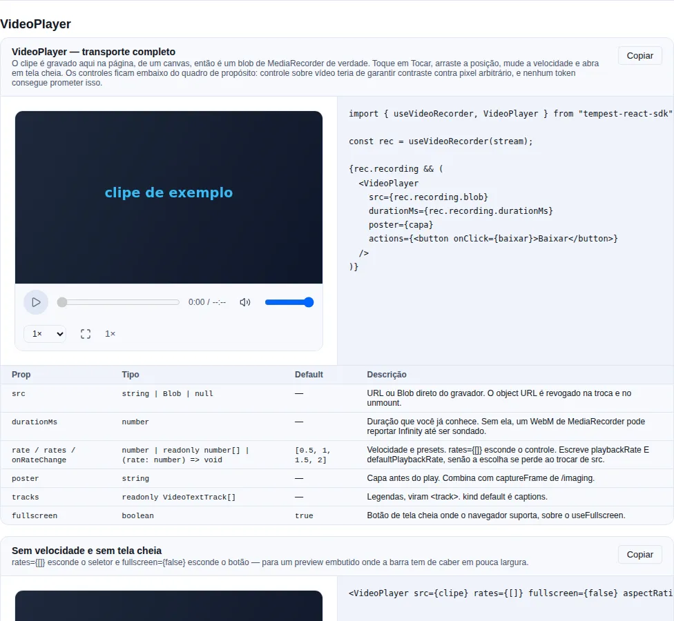

# Captura de dispositivo

Quatro APIs do navegador que não custam dependência nenhuma: a **câmera lendo códigos**
(`BarcodeScanner`, `useBarcodeScanner`), **vídeo gravado** (`useVideoRecorder`), a **tela
compartilhada** (`useScreenCapture`) e **fala virando texto** (`useSpeechRecognition`).

A fatia inteira mede **5,40 KB brotli** — e cada uma dessas quatro coisas é uma API que o
navegador já tem, não uma biblioteca que o SDK embarcou.

!!! tip "Se você só quer ler um código de barras, pule para [Ler códigos](#ler-codigos-comece-pelo-componente)"
    O resto da página é vídeo, tela e fala, e a camada de baixo de cada uma.

!!! info "A captura de **áudio** mora em outra página"
    Microfone, gravação de voz, medidor de nível e WAV estão em [Áudio](./audio.md). As
    duas páginas compartilham o mesmo motor de gravação e a mesma taxonomia de erro — o
    que muda é o dispositivo.

<!-- gallery:device-capture -->
[](gallery.md)

*Seção `device-capture` da [gallery](gallery.md) — rode localmente para interagir.*
<!-- /gallery -->

<!-- gallery:video-player -->
[](gallery.md)

*Seção `video-player` da [gallery](gallery.md) — rode localmente para interagir.*
<!-- /gallery -->

## Ler códigos: comece pelo componente

O SDK já tinha o [`QRCode`](./components/utility.md), que **só codifica**. O
`BarcodeScanner` fecha o ciclo:

```tsx
import { BarcodeScanner } from "tempest-react-sdk";

export function LeitorDeProdutos({ onProduto }: { onProduto: (gtin: string) => void }) {
  return (
    <BarcodeScanner
      formats={["ean_13", "qr_code", "code_128"]}
      onScan={({ rawValue, format }) => {
        if (format === "ean_13") onProduto(rawValue);
      }}
      footer={<small>Aponte para o código de barras da embalagem.</small>}
      unsupported={<CampoDigitarCodigo onSubmit={onProduto} />}
    />
  );
}
```

O que você ganha sem escrever nada:

| Você fez | O componente faz |
| --- | --- |
| nada | Visor de proporção fixa, cantos de mira e um indicador de varredura |
| nada | Loop de detecção que **não se sobrepõe** — nunca enfileira uma leitura sobre a anterior |
| nada | Suprime a repetição do mesmo código; um valor **diferente** passa na hora |
| nada | Lanterna, quando a câmera tem uma |
| nada | Erro de câmera classificado, com um botão de tentar de novo |
| `unsupported` | Onde não há decodificador, mostra o seu caminho alternativo em vez de uma tela preta |

!!! danger "Montar o leitor abre a câmera — monte só quando o usuário pedir"
    O `useCameraStream` adquire no mount, então renderizar o scanner **é** disparar o
    prompt. Um prompt que o usuário não provocou é a forma mais confiável de ganhar um
    **Block permanente** — e depois disso o `getUserMedia` rejeita sem nunca mais
    perguntar, o que também queima a *próxima* feature que precisar da câmera. O padrão é
    um botão que revela o leitor:

    ```tsx
    const [lendo, setLendo] = useState(false);

    return lendo ? (
      <BarcodeScanner onScan={aceitar} />
    ) : (
      <Button onClick={() => setLendo(true)}>Ler código</Button>
    );
    ```

### `BarcodeDetector` não existe em metade dos navegadores

Essa é a parte que decide o desenho da sua tela, então está aqui e não numa nota de pé:

| Motor | Tem `BarcodeDetector`? |
| --- | --- |
| Chromium no Android e ChromeOS | **sim** |
| Chromium no macOS | em geral sim |
| Chromium no Windows e Linux | **não** |
| Firefox (qualquer sistema) | **não** |
| Qualquer navegador no iOS (todos são WebKit por baixo, Chrome incluído) | **não** |

O SDK **não embarca decodificador nenhum**, e isso é uma escolha, não uma lacuna: um
leitor de QR é correção de erro Reed–Solomon mais correção de perspectiva mais busca de
padrão de localização, e as opções honestas eram um build WASM que **todo** consumidor
deste SDK carregaria, ou nada. Então o que existe é a costura:

```tsx
import { BarcodeDetector } from "barcode-detector/pure"; // ou seu wrapper de zxing-wasm
import { BarcodeScanner } from "tempest-react-sdk";

<BarcodeScanner
  detector={new BarcodeDetector({ formats: ["qr_code", "ean_13"] })}
  onScan={aceitar}
/>;
```

Qualquer objeto com um `detect(source)` que resolva com `{ rawValue }` serve — é o que a
interface `BarcodeDetectorLike` diz, e é o que os testes do SDK exercitam com um
decodificador de verdade.

!!! check "Você não precisa de decodificador nenhum para o caso mais comum"
    Em telas de operação (conferência de carga, PDV, inventário) o alvo é um celular
    Android, onde a API existe. `unsupported` cobre o desktop do escritório com um campo
    de digitar — que costuma ser o que o operador prefere de teclado, aliás.

### Props

| Prop | Tipo | Default | O que faz |
| --- | --- | --- | --- |
| `onScan` | `(result: BarcodeScanResult) => void` | — | Cada leitura aceita. |
| `formats` | `BarcodeFormat[]` | `DEFAULT_BARCODE_FORMATS` = `["qr_code","ean_13","code_128"]` | Cada símbolo extra é trabalho por frame. `ALL_BARCODE_FORMATS` traz o domínio inteiro, para montar um seletor. |
| `paused` | `boolean` | `false` | Para de procurar **sem** soltar a câmera. |
| `detector` | `BarcodeDetectorLike` | — | Polyfill injetado. |
| `intervalMs` | `number` | `200` | Frequência com que um frame é examinado. |
| `repeatDelayMs` | `number` | `2500` | Janela em que o mesmo valor não dispara de novo. |
| `torch` | `boolean` | `true` | Oferece a lanterna quando a câmera tem uma. |
| `aspectRatio` | `number` | `4 / 3` | Proporção do visor. |
| `locale` | `"pt-BR" \| "en"` | `"pt-BR"` | Rótulos. |
| `footer` · `unsupported` | `ReactNode` | — | Instrução e caminho alternativo. |
| `onError` | `(error: unknown) => void` | — | Frame que o motor recusou (rotineiro). |

`BarcodeScanResult = { rawValue, format, boundingBox, cornerPoints }` — `boundingBox` é
`null` e `cornerPoints` é `[]` quando o motor não reporta geometria.

### Os formatos que importam aqui

Três carregam o peso no Brasil: **`ean_13`** é o código de barras de todo produto
embalado, **`qr_code`** é onde viaja um "copia e cola" do Pix, e **`code_128`** é a
etiqueta de uma remessa. O default é exatamente esses três.

!!! warning "Pedir um formato que o motor não tem faz o construtor lançar"
    `NotSupportedError`, que parece bug no seu código. A lista de formatos é do
    decodificador **da plataforma**, não do navegador, então dois Chromium em dois
    sistemas respondem diferente. O hook resolve isso pedindo a interseção — e você pode
    olhar antes:

    ```tsx
    import { getSupportedBarcodeFormats } from "tempest-react-sdk";

    const formatos = await getSupportedBarcodeFormats(); // [] onde não há decodificador
    ```

### Supressão de repetição não é detalhe

Um símbolo fica em quadro enquanto o usuário mantém a câmera ali. Sem supressão, o mesmo
código dispara cinco vezes por segundo — e ligado em "adicionar ao carrinho" isso é um bug
que o cliente paga. `repeatDelayMs` (2,5 s por padrão) é a janela em que **o mesmo** valor
é ignorado; um valor diferente nunca é.

Se a sua tela abre uma confirmação depois da leitura, use `paused` enquanto ela estiver
aberta — para de procurar sem soltar a câmera, então fechar a confirmação não custa outro
round-trip de permissão.

### Lanterna

```tsx
import { useTorch } from "tempest-react-sdk";

const torch = useTorch(stream);
{torch.supported && <button onClick={() => void torch.toggle()}>Lanterna</button>}
```

!!! info "A lanterna não é um dispositivo — é uma constraint numa track viva"
    Não há o que controlar antes de existir stream de câmera, e ela desaparece quando o
    stream é liberado. É por isso que `supported` só pode ser respondido depois: o mesmo
    código dá `true` na câmera traseira de um Android e `false` na frontal do mesmo
    aparelho. Onde nem `getCapabilities()` nem `getSettings()` mencionam `torch`, o hook
    diz `false` em vez de oferecer um botão que não faz nada.

### Montando você mesmo: `useBarcodeScanner`

```tsx
import { useBarcodeScanner } from "tempest-react-sdk";

export function LeitorProprio() {
  const scanner = useBarcodeScanner({
    formats: ["ean_13"],
    onScan: ({ rawValue }) => console.log(rawValue),
  });

  if (!scanner.supported) return <p>Este navegador não decodifica códigos.</p>;

  return (
    <>
      <video ref={scanner.videoRef} muted playsInline style={{ width: "100%" }} />
      <p>{scanner.scanning ? "Procurando…" : scanner.status}</p>
      {scanner.error && <p role="alert">{scanner.error.message}</p>}
    </>
  );
}
```

O loop se re-agenda **depois** que cada `detect()` resolve, não num `setInterval`:
decodificar às vezes leva mais que o intervalo, e um intervalo enfileiraria chamadas mais
rápido do que o motor as drena até a aba travar.

## Gravar vídeo

`useVideoRecorder` é o `useAudioRecorder` com uma track de vídeo e `videoBitsPerSecond` —
o relógio que **desconta pausa**, o `stop()` que resolve com todos os chunks na mão e a
negociação de container são os mesmos, porque são o mesmo motor.

```tsx
import { useScreenCapture, useVideoRecorder } from "tempest-react-sdk";

export function GravadorDeTela() {
  const screen = useScreenCapture({ preferCurrentTab: true });
  const rec = useVideoRecorder(screen.stream, {
    maxDurationMs: 120_000,
    videoBitsPerSecond: 2_500_000,
    onRecorded: ({ blob, durationMs }) => enviar(blob, durationMs),
  });

  return (
    <>
      <button onClick={screen.start}>Compartilhar tela</button>
      <button disabled={!rec.ready} onClick={rec.start}>Gravar</button>
      <button disabled={rec.status !== "recording"} onClick={() => void rec.stop()}>
        Parar
      </button>
      <span>{(rec.durationMs / 1000).toFixed(1)} s</span>
    </>
  );
}
```

`ready` fica `false` até existir stream, então a UI inteira pode ser renderizada
desabilitada enquanto o usuário ainda não escolheu a tela.

!!! warning "O container que sai não é o que você pediu"
    `VideoRecording.mimeType` é o que o navegador **reportou**, não o que foi negociado:
    entregamos `video/webm;codecs=vp9,opus` e o Chromium responde `video/webm;codecs=vp9`
    quando não há áudio. Use o valor que voltou para nomear o arquivo e para o
    `Content-Type` do upload. A ordem de preferência é VP9 → VP8 → WebM → MP4/H.264 (o
    último existe para o Safari, que não produz outra coisa).

!!! danger "Vídeo enche a memória uma ordem de magnitude mais rápido que áudio"
    Um minuto de 1080p a 2,5 Mbps é cerca de **19 MB** parados na memória até o `stop()`.
    Em qualquer captura que possa passar de alguns minutos, use `timesliceMs` e mande os
    pedaços embora:

    ```tsx
    useVideoRecorder(stream, {
      timesliceMs: 5_000,
      onChunk: (chunk) => void upload(chunk),
    });
    ```

    Os chunks **não** são tocáveis isoladamente: só o conjunto forma um arquivo válido.

!!! info "Não há medidor de nível aqui, e é de propósito"
    Medir nível num compartilhamento de tela significa abrir um `AudioContext` sobre um
    stream que quase sempre não tem track de áudio, e navegadores limitam contextos vivos
    (o Chrome permite ~6). Se você grava uma câmera **e** quer nível, rode o
    [`createLevelMeter`](./audio.md#nivel-de-gravacao) no mesmo stream.

O gravador **não** é dono do stream: parar a gravação deixa o compartilhamento vivo, porque
um fluxo de suporte normalmente grava, para, deixa a pessoa olhar e grava de novo.

### Tocar o que foi gravado: `VideoPlayer`

O par do `AudioPlayer` para vídeo. Aceita o `Blob` direto, sem upload no meio:

```tsx
import { useScreenCapture, useVideoRecorder, VideoPlayer } from "tempest-react-sdk";

export function GravarERever() {
  const screen = useScreenCapture();
  const rec = useVideoRecorder(screen.stream);

  return (
    <>
      <button onClick={screen.start}>Compartilhar tela</button>
      <button disabled={!rec.ready} onClick={rec.start}>Gravar</button>
      <button onClick={() => void rec.stop()}>Parar</button>

      {rec.recording && (
        <VideoPlayer src={rec.recording.blob} durationMs={rec.recording.durationMs} />
      )}
    </>
  );
}
```

Transporte completo: play/pause, barra de posição, tempos, mudo + volume,
**velocidade** e tela cheia. `playsInline` já vem ligado.

| Prop | O que faz |
| --- | --- |
| `src` | URL ou `Blob`/`File`. O object URL é revogado na troca e no unmount |
| `durationMs` | Duração que você já conhece — passe sempre que tiver |
| `rate` / `rates` / `onRateChange` | Velocidade e os presets. `rates={[]}` esconde o controle |
| `shiftPitch` | Deixa o pitch subir com a velocidade. Padrão `false` |
| `poster` | Capa. Combina com o [`captureFrame`](./imaging.md) |
| `tracks` | Legendas, viram `<track>` |
| `aspectRatio` | Forma do quadro antes do vídeo reportar a dele. Padrão `16 / 9` |
| `fullscreen` | Botão de tela cheia onde o navegador suporta. Padrão `true` |
| `muted` / `autoPlay` / `loop` | Como no elemento |
| `actions` | Slot no fim da barra — baixar, apagar |

Os presets default saem exportados como `DEFAULT_PLAYBACK_RATES` (`[0.5, 1, 1.5, 2]`), para uma tela de ajustes mostrar a lista em vez de repeti-la.

!!! danger "A velocidade reseta ao trocar de `src` se você escrever só `playbackRate`"
    O algoritmo de load do elemento copia `defaultPlaybackRate` **em cima** de
    `playbackRate`. Um player que guarda "2×" em estado e escreve só o segundo
    perde a escolha do usuário em todo clipe novo — sem erro, sem log. O
    `VideoPlayer` escreve **os dois**.

    Se você montar o seu no lugar deste, é a linha que não pode faltar. E não
    espere um teste em jsdom pegar: lá os dois valores são independentes e não
    existe algoritmo de load, então a regressão fica invisível.

!!! note "Fora de uma faixa útil o navegador pode desligar o áudio"
    A spec permite ao navegador silenciar quando `playbackRate` sai de uma faixa
    razoável, e o limite **varia**. Os presets default (0,5× a 2×) ficam dentro
    de todos os que medimos; se você oferecer 4× ou 0,1×, teste com áudio no
    navegador alvo antes de prometer ao usuário.

!!! info "Os controles ficam **embaixo** do quadro, não sobre ele"
    Controle desenhado sobre vídeo tem de garantir contraste contra pixel
    arbitrário, e nenhum token `--tempest-*` promete isso: todo token de texto
    daqui é resolvido contra uma superfície conhecida, e os dois defeitos de
    contraste que este SDK entregou foram token de texto usado sobre superfície
    onde ele nunca foi checado. Uma barra com superfície própria herda o tema e
    é legível por construção.

    Se você quer o look de cinema, posicione a sua chrome sobre o quadro — o que
    ships é o que está certo nos dois temas.

## Compartilhar a tela

```tsx
import { useScreenCapture } from "tempest-react-sdk";

export function BotaoDeCompartilhar() {
  const screen = useScreenCapture({
    preferCurrentTab: true,
    audio: true,
    onCancelled: () => setDica("Você fechou o seletor — nada foi compartilhado."),
    onEnded: () => salvarEFechar(),
  });

  return (
    <>
      <button onClick={screen.start} disabled={screen.status === "sharing"}>
        Compartilhar tela
      </button>
      {screen.status === "sharing" && (
        <p>
          Compartilhando {screen.surface} · áudio: {screen.hasAudio ? "sim" : "não"}
        </p>
      )}
      {screen.error && <p role="alert">{screen.error.message}</p>}
    </>
  );
}
```

Três estados decidem se isso parece certo, e dois deles são fáceis de perder:

| Estado | O que aconteceu | O que o hook faz |
| --- | --- | --- |
| **Seletor fechado** | o usuário desistiu | volta para `idle`, `error` fica `null`, chama `onCancelled` |
| **Parou pela barra do navegador** | nada na sua UI foi clicado | limpa o stream, volta para `idle`, chama `onEnded` |
| **Compartilhando** | escolheu algo | `surface` diz o quê, `hasAudio` diz se veio áudio |

!!! danger "O evento `ended` é o único sinal de que o usuário parou de compartilhar"
    O Chrome mostra uma barra própria com "Parar compartilhamento". Quando ela é usada,
    **nenhuma promise rejeita** e nada na sua UI foi clicado — o único aviso é o evento
    `ended` da track de vídeo. Sem esse listener, o app fica exibindo "gravando" sobre um
    stream que já morreu. O hook escuta e limpa; você só precisa do `onEnded` se tiver algo
    a salvar.

!!! warning "Seletor fechado não é erro — e não existe exceção própria para ele"
    Fechar o seletor produz o mesmo `NotAllowedError` que um bloqueio por política, e
    algumas versões reportam `AbortError`. O hook trata os dois como **cancelamento**,
    porque um prompt de captura de tela é **sempre** iniciado pelo usuário — nada consegue
    abri-lo por trás — então a causa esmagadoramente provável é "mudei de ideia", e um
    toast vermelho para isso pune quem usou o seletor. A rejeição crua vai para
    `onCancelled`, se você precisar distinguir um bloqueio de sistema (permissão de
    gravação de tela do macOS).

### Dicas para o seletor

| Opção | Efeito |
| --- | --- |
| `displaySurface` | `"monitor"`, `"window"` ou `"browser"` (uma aba) primeiro na lista |
| `preferCurrentTab` | põe **esta** aba no topo — o certo para "grave o que você está vendo" |
| `selfBrowserSurface: "exclude"` | evita a captura em espelho infinito |
| `surfaceSwitching: "include"` | deixa trocar de superfície no meio, sem novo prompt |
| `systemAudio` | áudio do sistema quando a tela inteira é compartilhada |
| `audio: true` | pede o áudio da aba |

!!! warning "Tudo aí é dica, nunca garantia"
    O usuário pode escolher outra coisa, o Firefox ignora as dicas e o áudio de exibição só
    existe para **aba** no Chromium (o Safari não tem nenhum). Por isso o hook devolve
    `surface` e `hasAudio`: leia o que aconteceu, não o que você pediu.

## Fala → texto

```tsx
import { useSpeechRecognition } from "tempest-react-sdk";

export function CampoDitado({ onTexto }: { onTexto: (texto: string) => void }) {
  const speech = useSpeechRecognition({
    lang: "pt-BR",
    continuous: true,
    onFinal: (texto) => onTexto(texto),
  });

  if (!speech.supported) return null;

  return (
    <>
      <button onClick={speech.listening ? speech.stop : speech.start}>
        {speech.listening ? "Parar" : "Ditar"}
      </button>
      <p>
        {speech.transcript}
        <em>{speech.interim}</em>
      </p>
      {speech.error && <p role="alert">{speech.error.message}</p>}
    </>
  );
}
```

!!! danger "O reconhecimento não é local: o Chromium manda o áudio para um servidor do Google"
    Nada na API diz isso, não existe configuração que mude, e acontece a **cada**
    `start()`. Tudo o que o usuário falar enquanto a sessão está aberta sai do aparelho.
    Não coloque isso num campo de anotação clínica, de credencial ou de dado financeiro de
    cliente sem avisar antes — e se o dado não pode sair da sua infraestrutura, esta API é a
    ferramenta errada e um modelo self-hosted é a certa. Colocar o aviso na interface, ao
    lado do botão, é o mínimo.

### Interim e final

`transcript` acumula as frases que o motor **fechou**; `interim` é o palpite que ele ainda
está revisando e é substituído inteiro a cada evento. Renderizar `transcript + interim` dá
o efeito de legenda ao vivo; renderizar só `transcript` dá o texto confirmado.

| Opção | Default | O que faz |
| --- | --- | --- |
| `lang` | `"pt-BR"` | Tag BCP-47. |
| `continuous` | `false` | Continua depois da primeira frase fechar. |
| `interimResults` | `true` | Publica o palpite em andamento. |
| `maxAlternatives` | `1` | Quantas leituras por frase pedir. |
| `onResult` · `onFinal` · `onError` · `onEnd` | — | Cada atualização, só o texto fechado, falha classificada, fim da sessão. |
| `factory` | — | Construa o reconhecedor você mesmo — outro motor, ou um stub em teste. |

### Erros classificados

| `kind` | Causa | O que a UI deve fazer |
| --- | --- | --- |
| `unsupported` | Firefox e todo motor não-Chromium | esconda o botão |
| `not-allowed` | microfone negado (inclui `service-not-allowed`) | instrução para as configurações do site |
| `no-speech` | ninguém falou | **rotineiro** — não é falha para reportar |
| `audio-capture` | nenhum microfone no aparelho | diga isso |
| `network` | o serviço de reconhecimento não respondeu | ofereça digitar |
| `aborted` | cancelado | rotineiro |
| `language-not-supported` | o serviço não fala esse idioma | caia para `pt-BR` ou `en-US` |

!!! info "Não existe auto-restart, de propósito"
    Mesmo com `continuous: true` o motor encerra a sessão sozinho depois de um trecho de
    silêncio — é timeout do servidor, não bug. Um loop de reinício é como um app acaba
    segurando o microfone para sempre e, no Chromium, transmitindo áudio para terceiros
    para sempre. Mostre que parou de ouvir e deixe a pessoa apertar de novo.

### Ditando no `AIChat`

O `AIChat` **não** conhece o reconhecimento de fala, e não vai conhecer: isso faria todo
consumidor do componente pagar por uma API que manda áudio para terceiros. O que existe é o
`composerRef` — o botão que você põe dentro do composer escreve no campo:

```tsx
import { useRef } from "react";
import {
  AIChat,
  Button,
  useSpeechRecognition,
  type AIChatComposerHandle,
} from "tempest-react-sdk";

export function ChatComDitado({ messages, onSend }: ChatProps) {
  const composer = useRef<AIChatComposerHandle>(null);
  const speech = useSpeechRecognition({
    continuous: true,
    onFinal: (texto) =>
      composer.current?.setValue(`${composer.current.getValue()} ${texto}`.trim()),
  });

  return (
    <AIChat
      messages={messages}
      onSend={onSend}
      composerRef={composer}
      composerActions={
        <Button
          size="sm"
          variant={speech.listening ? "primary" : "soft"}
          disabled={!speech.supported}
          onClick={speech.listening ? speech.stop : speech.start}
        >
          {speech.listening ? "Ouvindo…" : "Ditar"}
        </Button>
      }
      composerFooter={<small>O áudio ditado sai do dispositivo.</small>}
    />
  );
}
```

!!! tip "`getValue()` é o que torna qualquer coisa **aditiva** possível"
    O composer é não-controlado de propósito (uma tecla por render do transcrito inteiro
    seria caro), então sem ler o rascunho a única forma de **acrescentar** — uma frase
    ditada, um comando de barra, uma citação colada — seria espelhar o valor inteiro no
    estado do app e torcer para os dois não divergirem.

## Recap

- `BarcodeScanner` — leitor completo: visor, mira, lanterna, supressão de repetição, erro
  classificado. Montar abre a câmera, então monte quando o usuário pedir.
- `BarcodeDetector` é Chromium-only. O SDK não embarca decodificador; `unsupported` cobre
  quem não tem, e `detector` aceita um polyfill.
- `useBarcodeScanner` — a metade de decodificação, sobre `useCameraStream`; loop que não se
  sobrepõe, `formats` resolvidos pela interseção com o motor.
- `useTorch` — a lanterna é constraint de track viva, não dispositivo; `supported` só vale
  depois do stream.
- `useVideoRecorder` — mesmo motor do áudio: relógio que desconta pausa, `stop()` com todos
  os chunks, container negociado. Use `timesliceMs` para captura longa.
- `useScreenCapture` — seletor fechado é cancelamento (não erro); `ended` é o **único**
  sinal de que o usuário parou; `surface`/`hasAudio` dizem o que aconteceu de fato.
- `useSpeechRecognition` — interim vs final, erros classificados, sem auto-restart. **O
  áudio sai do dispositivo no Chromium.**
- `AIChat` + `composerRef` — ditado sem o componente conhecer a API de fala.

## Veja também

- [Áudio](./audio.md) — microfone, gravação de voz, WAV, saída de som
- [Componentes utilitários](./components/utility.md) — o `QRCode`, que codifica
- [Vision (ONNX)](./vision.md) — o `useCameraStream` que este módulo reaproveita
