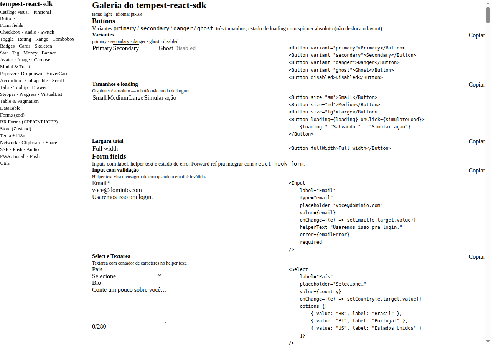
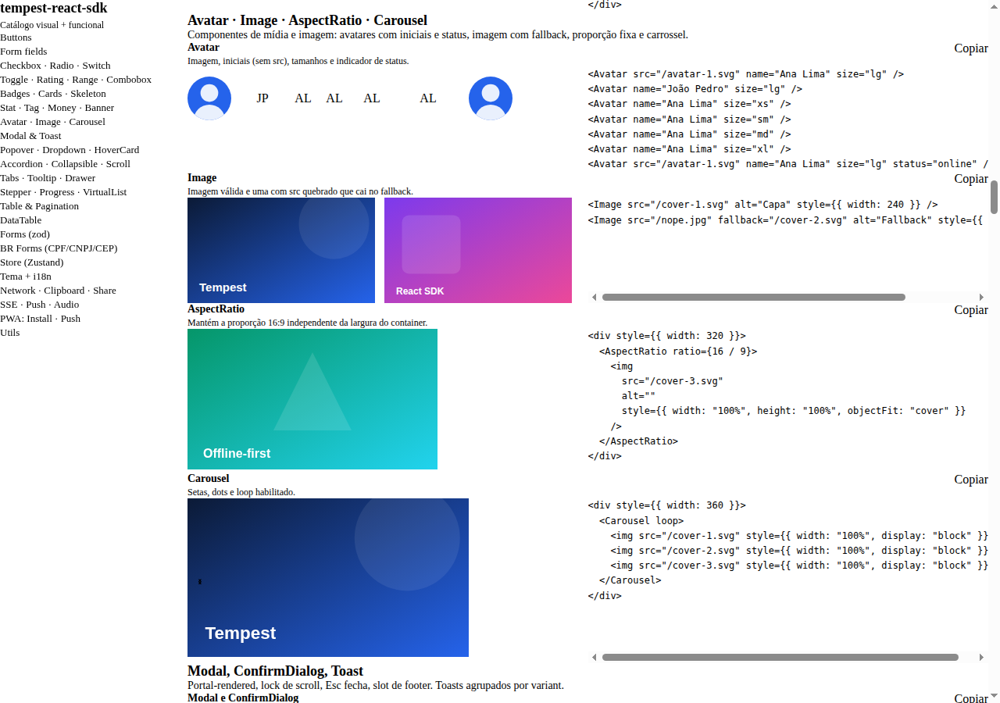
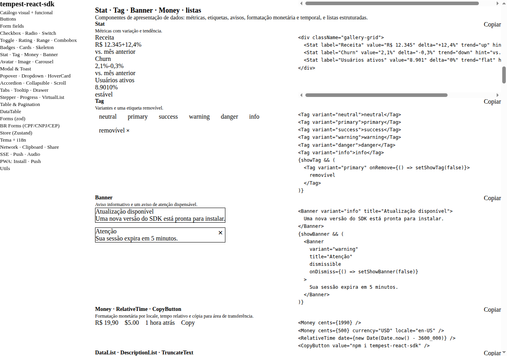
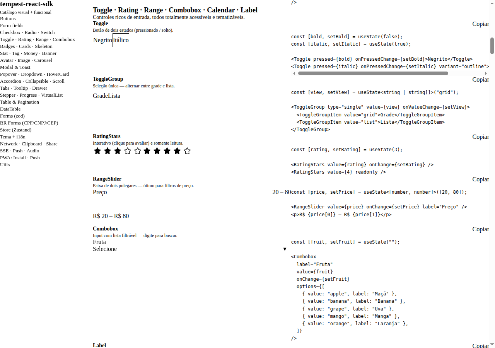
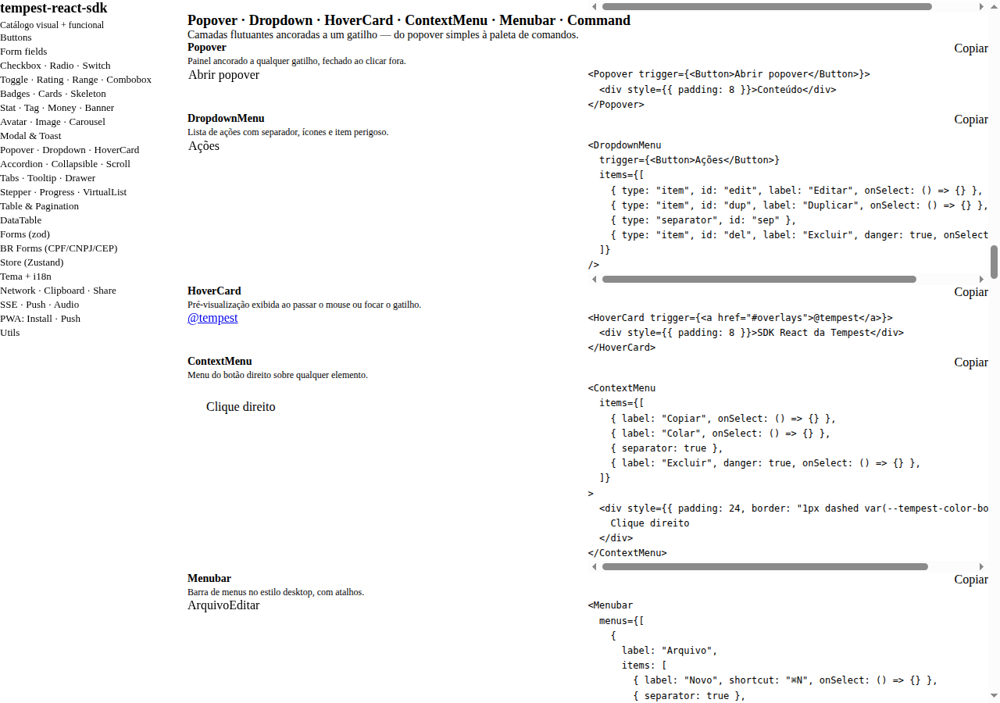
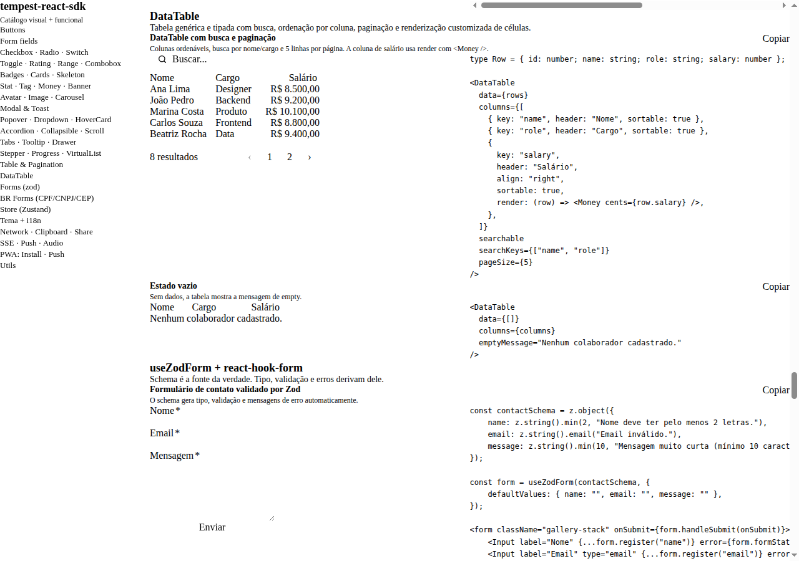
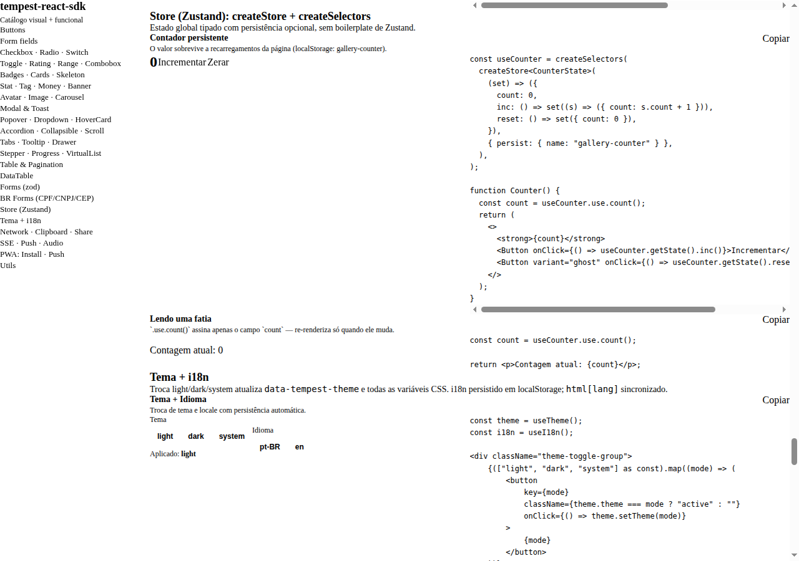
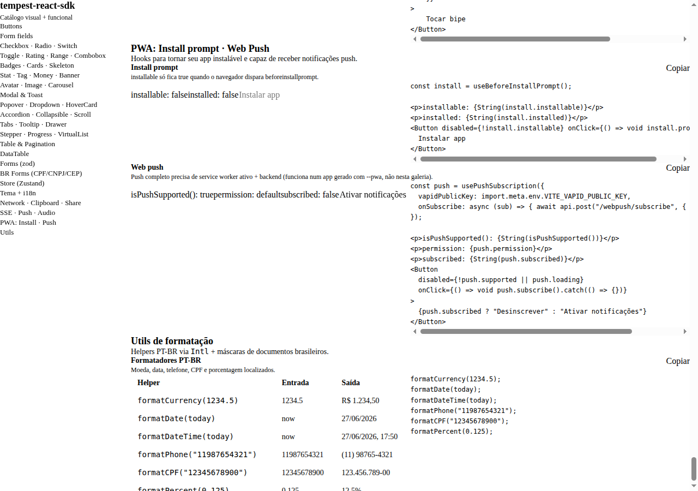

# Gallery — visual + functional catalogue

An interactive demo of every SDK component and feature. Runs as a Vite + React
app in [`examples/gallery`](https://github.com/mauriciobenjamin700/tempest-react-sdk/blob/main/examples/gallery).

## What is the gallery?

The gallery is a **real** Vite + React app that consumes the SDK exactly the way
a production app would — via an `npm install` pointing at `file:../..`. It stands
in for Storybook: each section mounts components with varied props, exercises
hooks live (SSE, toast, pagination) and acts as a visual test bench whenever you
touch styles or layout. If a component looks right in the gallery, it looks right
in consumer apps.

## How to run

```bash
# repo root
npm install
npm run build           # generates the SDK's dist/

cd examples/gallery
npm install
npm run dev             # http://127.0.0.1:5173
```

`tempest-react-sdk` is consumed via `file:../..` — any rebuild from the root
shows up in the gallery after a reload.

!!! tip "Run the root `npm run dev` in parallel"
    The gallery serves the SDK's `dist/`. To see SDK changes instantly, keep an
    `npm run dev` (vite build --watch) running at the root in one tab and the
    gallery's `npm run dev` in another — each rebuild reloads the page.

!!! note "Validate UI at both breakpoints"
    The gallery is where you check responsiveness: resize to ≤ 430px (mobile) and
    ≥ 1024px (desktop) before calling a visual change done. Stack/Grid/Modal/
    Drawer/Table all have responsive behavior here.

## Sections

Each section is a file under [`examples/gallery/src/sections/`](https://github.com/mauriciobenjamin700/tempest-react-sdk/tree/main/examples/gallery/src/sections) and every example is wrapped by the [`<Example>`](https://github.com/mauriciobenjamin700/tempest-react-sdk/blob/main/examples/gallery/src/Example.tsx) helper (demo + code + copy button).

| #   | Section                                | Components / Features                                                             |
| --- | -------------------------------------- | -------------------------------------------------------------------------------- |
| 1   | Buttons                                | `Button` (variants, sizes, loading, fullWidth)                                   |
| 2   | Form fields                            | `Input`, `Select`, `Textarea`, `SearchBar`                                        |
| 3   | Checkbox · Radio · Switch              | `Checkbox`, `RadioGroup`, `Switch`                                                |
| 4   | Toggle · Rating · Range · Combobox     | `Toggle`, `ToggleGroup`, `RatingStars`, `RangeSlider`, `Combobox`, `Label`       |
| 5   | Feedback                               | `Badge`, `Card`, `Spinner`, `Skeleton`                                            |
| 6   | Stat · Tag · Money · Banner            | `Stat`, `Tag`, `Banner`, `Money`, `RelativeTime`, `TruncateText`, `DataList`, `DescriptionList`, `CopyButton` |
| 7   | Avatar · Image · Carousel              | `Avatar`, `Image` (fallback), `AspectRatio`, `Carousel`                          |
| 8   | Modal & Toast                          | `Modal`, `ConfirmDialog`, `ToastProvider`, `useToast`                            |
| 9   | Overlays                               | `Popover`, `DropdownMenu`, `HoverCard`, `ContextMenu`, `Menubar`, `Command` (⌘K) |
| 10  | Disclosure                             | `Accordion`, `Collapsible`, `ScrollArea`                                          |
| 11  | Navigation                             | `Breadcrumbs`, `Tabs`, `Tooltip`, `Drawer`                                        |
| 12  | Stepper · Progress · VirtualList       | `Stepper`, `Progress`, `ChipInput`, `FileUpload`, `VirtualList`                   |
| 13  | Table & Pagination                     | `Table`, `Pagination`, `EmptyState`, `ErrorState`, `usePagination`               |
| 14  | DataTable                              | `DataTable` (client-side search, sort, pagination)                               |
| 15  | Forms (zod)                            | `useZodForm`, `zodResolver`                                                       |
| 16  | BR Forms                               | `CPFInput`, `CNPJInput`, `PhoneInput`, `MoneyInput`, `CEPInput`, `useViaCEP`     |
| 17  | Store (Zustand)                        | `createStore`, `createSelectors` (persisted counter)                             |
| 18  | Theme + i18n                           | `ThemeProvider`, `useTheme`, `I18nProvider`, `useI18n`                           |
| 19  | Network · Clipboard · Share            | `useOnline`, `useClipboard`, `share`, `useKeyboardShortcut`, `useIntersectionObserver` |
| 20  | SSE · Push · Audio                     | `useEventStream` (live SSE), `isPushSupported`, `playAudio`                      |
| 21  | PWA: Install · Push                    | `useBeforeInstallPrompt`, `usePushSubscription`, `isPushSupported`               |
| 22  | Utils                                  | `formatCurrency`, `formatDate`, `formatPhone`, `formatCPF`, `formatPercent`      |

## Variant matrix

### Button

| Prop      | Values                                       |
| --------- | -------------------------------------------- |
| `variant` | `primary` · `secondary` · `danger` · `ghost` |
| `size`    | `sm` · `md` · `lg`                           |
| Flags     | `loading`, `fullWidth`, `disabled`           |
| Slots     | `leftIcon`, `rightIcon`                      |

### Badge

| `variant` | Typical use          |
| --------- | -------------------- |
| `neutral` | Generic tag          |
| `success` | Paid, active, online |
| `warning` | Pending, degraded    |
| `danger`  | Failure, blocked     |
| `info`    | In review, beta      |

### Modal

| Prop   | Values                                             |
| ------ | -------------------------------------------------- |
| `size` | `sm` · `md` · `lg` · `xl`                          |
| Flags  | `closeOnBackdrop`, `closeOnEsc`, `hideCloseButton` |
| Slots  | `title`, `children` (body), `footer`               |

### Toast (via `useToast`)

| Method                                                  | Variant |
| ------------------------------------------------------- | ------- |
| `toast.success(text)`                                   | success |
| `toast.error(text)`                                     | error   |
| `toast.warning(text)`                                   | warning |
| `toast.info(text)`                                      | info    |
| `toast.show({ title, description, variant, duration })` | custom  |

### Table

| Column (`TableColumn<T>`) | Description                     |
| ------------------------- | ------------------------------- |
| `key`                     | unique identifier               |
| `header`                  | header label                    |
| `render(row, i)`          | custom cell; default `row[key]` |
| `align`                   | `left` · `right` · `center`     |
| `width`                   | string or number                |

### Spinner / Skeleton

| Spinner `size`     | Skeleton `variant`         |
| ------------------ | -------------------------- |
| `sm` · `md` · `lg` | `rect` · `text` · `circle` |

### Theme modes

| Mode     | Behavior                                                |
| -------- | ------------------------------------------------------- |
| `light`  | forces light, ignores OS                                |
| `dark`   | forces dark, ignores OS                                 |
| `system` | listens to `prefers-color-scheme`, updates in real time |

## Screenshots

Every example sits **next to its source code** (with a "Copy" button), so the
gallery doubles as a copy-paste reference. Captures of the running app:

### Overview



### Avatar · Image · AspectRatio · Carousel



### Stat · Tag · Banner · Money · lists



### Toggle · Rating · Range · Combobox · Calendar



### Popover · Dropdown · HoverCard · ContextMenu · Menubar · Command



### DataTable



### Store (Zustand): createStore + createSelectors



### PWA: install prompt + web push



## Recap

- The gallery is a real Vite + React app that consumes the SDK via `file:../..` —
  it plays the role of Storybook.
- Run it with `npm run build` at the root, then `npm run dev` in
  `examples/gallery` (port `5173`).
- 22 sections cover components, overlays, media/images, advanced inputs,
  DataTable, store, theme/i18n, live integrations, PWA and utils — each example
  with copy-paste code next to it.
- Use it to validate UI at the mobile and desktop breakpoints before closing out
  a visual change.

## See also

- [Gallery app README](https://github.com/mauriciobenjamin700/tempest-react-sdk/blob/main/examples/gallery/README.md)
- [Architecture](./architecture.md)
- [Components](./components.md)
