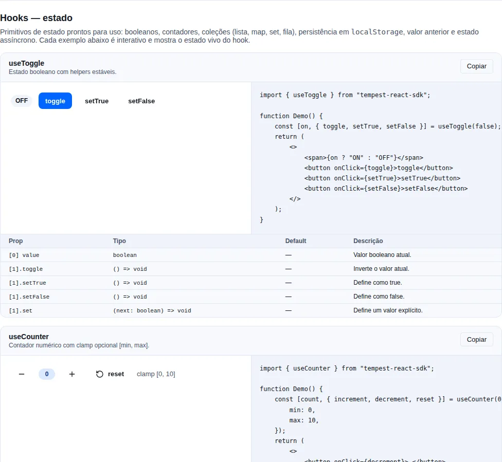
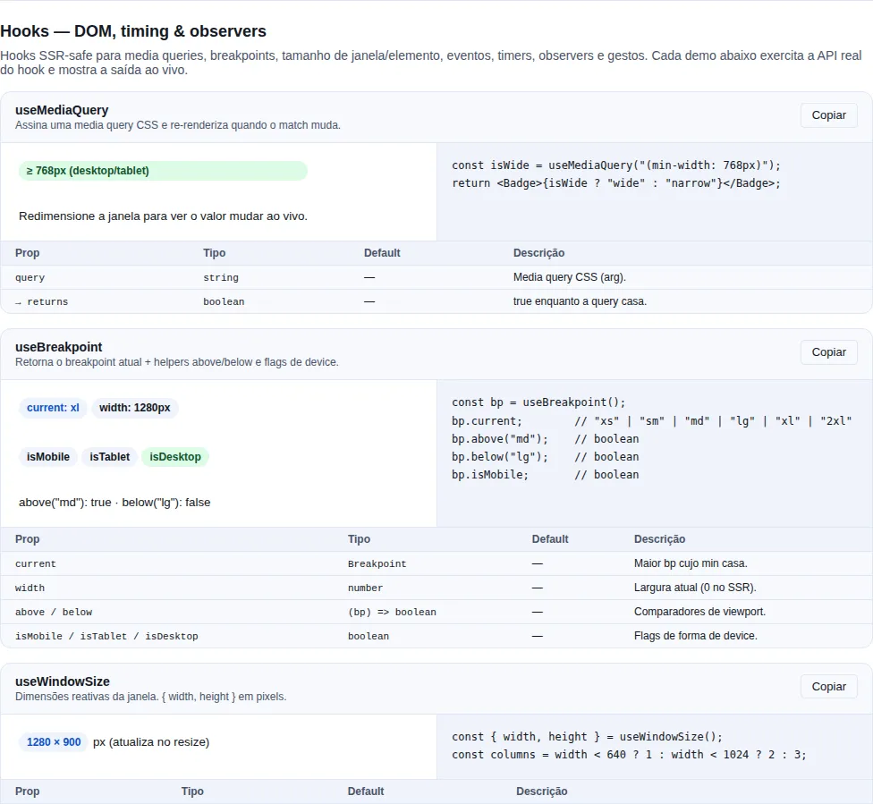

# Hooks utilitários

Toda app React reescreve os mesmos wrappers: "debounce esse input", "fecha o menu
no Escape", "guarda o tema no localStorage", "re-renderiza quando a janela muda de
tamanho". São pequenos, mas cada um tem uma armadilha — limpeza de listener, segurança
sem `window`, array de dependências. O SDK empacota esses padrões em hooks
granulares, testados e independentes — importe só o que precisar.

!!! note "Safe fora do browser ≠ suporte a SSR"
    Vários hooks abaixo aparecem como *safe* fora do browser: eles checam
    `typeof window === "undefined"` e devolvem um default em vez de explodir. Isso
    existe para testes em Node, contexto de service worker e plugins de build —
    **não** é promessa de render no servidor. O SDK é client-only por decisão
    (veja [Arquitetura](./architecture.md#escopo-so-client-side)).

!!! info "Cada hook é uma peça isolada"
    Nenhum hook depende de outro nem de provider. `import { useDebounce } from "tempest-react-sdk"`
    e pronto — o bundler tree-shake o resto. Eles agrupam só por _propósito_ aqui na
    doc, não por acoplamento.

<!-- gallery:hooks-state -->
[](gallery.md)

*Seção `hooks-state` da [gallery](gallery.md) — rode localmente para interagir.*
<!-- /gallery -->

<!-- gallery:hooks-dom -->
[](gallery.md)

*Seção `hooks-dom` da [gallery](gallery.md) — rode localmente para interagir.*
<!-- /gallery -->

## Catálogo por propósito

### DOM / viewport

| Hook                                              | O que faz                                                                                                    |
| ------------------------------------------------- | ------------------------------------------------------------------------------------------------------------ |
| `useMediaQuery(query)`                            | Subscreve `matchMedia` e re-renderiza ao mudar.                                                              |
| `useBreakpoint()`                                 | `{ current, width, above, below, isMobile, isTablet, isDesktop }` — breakpoint reativo (xs/sm/md/lg/xl/2xl). |
| `useWindowSize()`                                 | `{ width, height }` da janela, reativo.                                                                      |
| `useEventListener(name, handler, target?, opts?)` | Wrap genérico safe sem `window`. `target` default = `window`. Aceita ref ou `EventTarget` direto.                     |
| `useOnline(opts?)`                                | `navigator.onLine` reativo; `{ pingUrl, intervalMs, timeoutMs }` adiciona probe de reachability real (capta captive portal / link morto). |
| `useDocumentVisibility()`                         | `document.visibilityState` reativo.                                                                          |
| `useIntersectionObserver(ref, opts?)`             | `IntersectionObserverEntry` ou `null`.                                                                       |
| `useResizeObserver(ref)`                          | `{ width, height }` da referência.                                                                           |
| `useScrollOverflow(ref, axis?)`                    | `true` enquanto o conteúdo transborda a caixa — use pra dar ponto de tabulação a um contêiner de rolagem só quando há o que rolar. |
| `useScrollLock(active)`                           | Lock de `body.overflow`.                                                                                     |
| `useFocusTrap(ref, active)`                       | Confina Tab dentro do container.                                                                             |
| `useHover(ref)` / `useLongPress(handler, opts?)`  | Gestos de ponteiro (hover reativo / long-press).                                                             |
| `useBeforeInstallPrompt()`                        | PWA install prompt diferido (`installable`, `installed`, `isStandalone`, `prompt()`).                        |
| `useServiceWorkerUpdate({ url })`                 | Registra o SW e expõe `{ updateAvailable, applyUpdate, registration }` — fluxo de update com consentimento (par de `<UpdatePrompt>`). Veja [PWA](./pwa.md). |
| `useStorageEstimate({ pollMs? })`                 | `{ usage, quota, ratio, persisted, requestPersist, refresh }` — quota do Storage API + `persist()`. Pares puros: `estimateStorage`, `requestPersistentStorage`. |
| `useIdle(timeout?)`                               | True quando usuário ocioso por `timeout` ms.                                                                 |
| `useFullscreen(ref?)`                             | `{ isFullscreen, supported, enter, exit, toggle }` — modo imersivo com estado dirigido por `fullscreenchange`, então `Esc` e o botão do próprio browser atualizam a UI. Par puro: `isFullscreenSupported`. |
| `usePushToTalk({ code, onDown, onUp })`           | Segure para transmitir. `blur` solta (alt-tab não entrega o `keyup`), auto-repeat é ignorado e campo de texto ganha. Pares: `pushToTalkKeyLabel`, `PUSH_TO_TALK_KEYS`.                                    |
| `useGeolocation(opts?)`                           | Position + erro + loading.                                                                                   |
| `useClickOutside(handler)`                        | Retorna um ref; chama `handler` em `mousedown`/`touchstart` fora do elemento. safe sem `window`.                      |
| `useDocumentTitle(title)`                         | Seta `document.title` enquanto montado, restaurando o anterior no unmount. safe sem `window`.                         |
| `useFavicon(href)`                                | Troca o favicon via `<link rel="icon">` (cria o elemento se faltar). safe sem `window`.                               |
| `useAnnounce()`                                   | Devolve `announce(mensagem, politeness?)` — fala pro leitor de tela por uma região viva compartilhada. Pares puros: `announce`, `clearAnnouncer`. |

### Entrada / interação

| Hook                                            | O que faz                                                  |
| ----------------------------------------------- | ---------------------------------------------------------- |
| `useDebounce(value, delay?)`                    | Retorna o valor estabilizado após `delay` ms sem mudanças. |
| `useThrottle(value, interval?)`                 | Limita atualizações a no máximo uma por `interval` ms.     |
| `useClipboard(opts?)`                           | `{ copied, copy, reset }` com TTL configurável.            |
| `useKeyboardShortcut(shortcut, handler, opts?)` | Atalho global; aceita `mod` (Ctrl/Cmd).                    |

### Estado

| Hook                                              | O que faz                                                                                                       |
| ------------------------------------------------- | --------------------------------------------------------------------------------------------------------------- |
| `usePagination(initialPage?, initialSize?)`       | `{ page, size, setPage, setSize, reset }`.                                                                      |
| `useClientFilter(items, search, keysOrPredicate)` | Filtro client-side por keys ou predicado (memoizado). Os itens são objetos (`T extends Record<string, unknown>`). |
| `useLocalStorage<T>(key, default)`                | State persistido em localStorage + sincronizado cross-tab via `storage` event. safe sem `window`.                        |
| `useToggle(initial?)`                             | `[value, { toggle, setTrue, setFalse, set }]` — açúcar pra boolean state.                                       |
| `useAsync<T>(fn, deps?, { immediate? })`          | Track `idle/pending/success/error`. `{ status, data, error, run, reset }`. Distinto de React Query (sem cache). |
| `usePrevious(value)`                              | Valor anterior do render passado.                                                                               |
| `useDisclosure(initial?)`                         | `[opened, { open, close, toggle }]` — handlers estáveis para modais/drawers/popovers.                          |
| `useCounter(initial?, { min, max })`              | `[count, { increment, decrement, set, reset }]` — contador numérico com clamp opcional.                        |
| `useListState<T>(initial?)`                       | `[list, handlers]` com `append`/`prepend`/`insert`/`remove`/`reorder`/`setItem`/`setState`/`apply`/`clear`.     |
| `useMap<K, V>(initial?)`                          | `{ map, set, delete, clear, get, has, size }` — `Map` reativo (nova referência a cada mutação).                 |
| `useSet<T>(initial?)`                             | `{ set, add, delete, clear, has, toggle, size }` — `Set` reativo (nova referência a cada mutação).              |
| `useQueue<T>({ initialValues, limit })`           | `{ queue, add, update, cleanQueue, size }` — fila FIFO com `limit` e buffer de overflow.                        |
| `useIsFirstRender()`                              | `true` no primeiro render do componente, `false` depois.                                                        |
| `useObjectUrl(blob)`                              | Cria `URL.createObjectURL(blob)` e o revoga no unmount / quando o blob muda; `null` pra entrada nula.           |

### Timers

| Hook                                                | O que faz                                                                                                    |
| --------------------------------------------------- | ------------------------------------------------------------------------------------------------------------ |
| `useInterval(callback, delay)`                       | `setInterval` declarativo; `delay = null` pausa.                                                              |
| `useTimeout(callback, delay)`                        | `setTimeout` declarativo; `delay = null` cancela.                                                             |
| `useCountdown(durationMs, startedAt, { tickMs })`    | Tempo restante de uma janela, recalculado do relógio a cada tick. Trava em `0` e para o interval.             |
| `useTypewriter(text, speedMs)`                       | `{ displayedText, isComplete, skip }` — revela o texto letra a letra. `speedMs <= 0` renderiza tudo de uma vez. |

### Performance

| Hook                     | O que faz                                                        |
| ------------------------ | ---------------------------------------------------------------- |
| `useStableCallback(fn)`  | Ref estável que chama o callback atual.                          |
| `useLatestRef(value)`    | Ref estável cujo `current` é sempre o último `value` recebido.    |
| `useDeepMemo(value)`     | Memoização com igualdade estrutural.                             |

!!! tip "safe sem `window` por padrão"
    Os hooks que tocam APIs do browser (`useMediaQuery`, `useBreakpoint`,
    `useWindowSize`, `useOnline`, `useDocumentVisibility`, `useLocalStorage`,
    `useEventListener`) checam `typeof window === "undefined"` e retornam um default
    seguro no servidor, hidratando o valor real **após o mount**. Por isso o primeiro
    render no client pode mostrar o default (ex.: `width: 0`) por um instante.

## Exemplos

### Offline-aware badge

```tsx
import { useOnline, Badge } from "tempest-react-sdk";

function NetworkPill() {
  const online = useOnline();
  return <Badge variant={online ? "success" : "danger"}>{online ? "online" : "offline"}</Badge>;
}
```

### Atalho global — `useKeyboardShortcut`

```tsx
import { useState } from "react";
import { useKeyboardShortcut } from "tempest-react-sdk";

function CommandPalette() {
  const [open, setOpen] = useState(false);
  useKeyboardShortcut({ key: "k", mod: true }, () => setOpen(true));
  return open ? <div role="dialog">Command palette…</div> : null;
}
```

`mod: true` aceita Ctrl ou Cmd, simplificando cross-OS.

!!! note "Não dispara dentro de inputs"
    Por default (`ignoreInput: true`) o atalho é ignorado quando o foco está num
    `<input>`, `<textarea>`, `<select>` ou `[contenteditable]` — pra não roubar o
    "k" que o usuário está digitando. Passe `{ ignoreInput: false }` se quiser o
    contrário.

### Busca com debounce — `useDebounce`

```tsx
import { useEffect, useState } from "react";
import { useDebounce } from "tempest-react-sdk";

function SearchBox() {
  const [text, setText] = useState("");
  const debounced = useDebounce(text, 400);

  useEffect(() => {
    if (debounced) fetch(`/api/search?q=${encodeURIComponent(debounced)}`);
  }, [debounced]);

  return <input value={text} onChange={(e) => setText(e.target.value)} placeholder="Buscar…" />;
}
```

`useDebounce` adia o _valor_; o `useEffect` só dispara quando ele estabiliza.

### Lazy load via IntersectionObserver

```tsx
import { useRef } from "react";
import { useIntersectionObserver } from "tempest-react-sdk";

function LazyChart() {
  const ref = useRef<HTMLDivElement>(null);
  const entry = useIntersectionObserver(ref, { once: true });
  return <div ref={ref}>{entry?.isIntersecting && <HeavyChart />}</div>;
}
```

### Copy-to-clipboard com feedback — `useClipboard`

```tsx
import { useClipboard, Button } from "tempest-react-sdk";

function CopyButton() {
  const { copied, copy } = useClipboard({ resetAfter: 2000 });
  return (
    <Button onClick={() => copy("npm install tempest-react-sdk")}>
      {copied ? "Copiado!" : "Copiar"}
    </Button>
  );
}
```

### Responsive — `useBreakpoint`

```tsx
import { useBreakpoint } from "tempest-react-sdk";

function Hero() {
  const bp = useBreakpoint();
  return <h1 style={{ fontSize: bp.isMobile ? 24 : 48 }}>Bem-vindo</h1>;
}
```

`bp.above("lg")` / `bp.below("md")` cobrem comparações arbitrárias além dos atalhos
`isMobile` / `isTablet` / `isDesktop`.

Os limites são os do `BREAKPOINTS`, exportado para quando o mesmo corte precisa
existir fora do React — numa media query montada em JS, num teste, num cálculo
de layout:

```ts
import { BREAKPOINTS } from "tempest-react-sdk";

BREAKPOINTS; // { xs: 480, sm: 640, md: 768, lg: 1024, xl: 1280, "2xl": 1536 }
window.matchMedia(`(min-width: ${BREAKPOINTS.lg}px)`);
```

### Persisted state — `useLocalStorage`

```tsx
import { useLocalStorage } from "tempest-react-sdk";

function ThemeToggle() {
  const [theme, setTheme] = useLocalStorage<"light" | "dark">("theme", "light");
  return <button onClick={() => setTheme(theme === "light" ? "dark" : "light")}>{theme}</button>;
}
```

Multi-tab: outras abas recebem update via `window.addEventListener("storage", ...)` interno.

!!! warning "A `key` deve ser estável e única"
    `useLocalStorage` usa a `key` como dependência interna. Não a monte inline com
    valores que mudam (`` `user-${id}` `` muda toda vez que `id` muda e troca o slot
    de armazenamento). E como a key é global no domínio, escolha um nome com prefixo
    pra não colidir com outra feature.

### Async — `useAsync`

```tsx
import { useAsync, Spinner, ErrorState } from "tempest-react-sdk";

interface User {
  id: string;
  name: string;
}

function UserPanel({ id }: { id: string }) {
  const { status, data, error, run } = useAsync<User>(
    () => fetch(`/api/users/${id}`).then((r) => r.json()),
    [id],
    { immediate: true },
  );

  if (status === "pending") return <Spinner />;
  if (status === "error") return <ErrorState description={String(error)} onRetry={run} />;
  return <p>{data?.name}</p>;
}
```

!!! tip "useAsync vs React Query"
    `useAsync` é o primitivo de uma chamada só, sem cache e sem dependências extras —
    ideal pra ações pontuais (submit, "carregar mais"). Pra dados de servidor com
    cache, dedup e revalidação, use [React Query](./query.md). `useAsync` descarta
    resultados de runs obsoletos, então trocar `id` rápido não causa race.

### Global listener — `useEventListener`

```tsx
import { useState } from "react";
import { useEventListener } from "tempest-react-sdk";

function ScrollWatcher() {
  const [scrolled, setScrolled] = useState(false);
  useEventListener("scroll", () => setScrolled(window.scrollY > 100), undefined, {
    passive: true,
  });
  return <header data-scrolled={scrolled}>…</header>;
}
```

### Focus trap em Modal custom

```tsx
import { useRef } from "react";
import { useFocusTrap, useScrollLock } from "tempest-react-sdk";

function CustomModal({ open }: { open: boolean }) {
  const ref = useRef<HTMLDivElement>(null);
  useFocusTrap(ref, open);
  useScrollLock(open);
  return open ? (
    <div ref={ref} role="dialog" aria-modal="true">
      …
    </div>
  ) : null;
}
```

!!! note "Acessibilidade do focus trap"
    `useFocusTrap` confina o Tab dentro do container, mas não substitui o resto do
    contrato de diálogo: marque `role="dialog"` + `aria-modal="true"`, devolva o foco
    ao gatilho ao fechar e trate o Escape. O componente `Modal` do SDK já faz tudo
    isso — só recorra a este hook em overlays caseiros.

### Falar com o leitor de tela — `useAnnounce`

Algo aconteceu que quem vê a tela percebe e quem usa leitor de tela não: um filtro
reduziu a lista, uma linha salvou, uma cópia deu certo. `useAnnounce` devolve uma
função estável que anuncia isso.

```tsx
import { useAnnounce, useClientFilter } from "tempest-react-sdk";
import { useEffect, useState } from "react";

interface Produto extends Record<string, unknown> {
  id: string;
  nome: string;
}

export function ListaFiltrada({ items }: { items: Produto[] }) {
  const [termo, setTermo] = useState("");
  const visiveis = useClientFilter(items, termo, ["nome"]);
  const announce = useAnnounce();

  useEffect(() => {
    announce(`${visiveis.length} resultados`);
  }, [visiveis.length, announce]);

  return (
    <>
      <input value={termo} onChange={(e) => setTermo(e.target.value)} aria-label="Buscar" />
      <ul>
        {visiveis.map((item) => (
          <li key={item.id}>{item.nome}</li>
        ))}
      </ul>
    </>
  );
}
```

`announce(mensagem)` é polido por padrão; `announce(mensagem, "assertive")` interrompe
o que estiver sendo lido — reserve pra erro que exige ação.

!!! info "Duas regiões, uma polida e uma assertiva — de propósito"
    Politeness é propriedade **da região**, lida quando a tecnologia assistiva a
    registra. Trocar `aria-live` depois é honrado por alguns leitores, ignorado por
    outros e às vezes perde o anúncio. Duas regiões que nunca mudam é a única versão
    que se comporta igual em todo lugar. E são **compartilhadas**: várias regiões vivas
    mutando ao mesmo tempo é como anúncio se perde ou sai duplicado.

!!! warning "A mesma string duas vezes normalmente não anuncia de novo"
    O leitor anuncia quando o **conteúdo muda** — escrever o mesmo texto não é
    mudança, então "Item removido" duas vezes seguidas é lido uma. Em vez de mexer no
    texto, cada chamada troca o **elemento filho** da região: a mutação é real mesmo
    com a string idêntica, e o leitor ouve exatamente a sua mensagem, sem caractere de
    padding pendurado.

!!! danger "Nunca embrulhe texto em streaming numa região viva"
    Uma região viva sobre texto que cresce token a token faz o leitor recomeçar a
    resposta inteira a cada token. Anuncie as **bordas** — "gerando resposta",
    "resposta concluída" — e deixe a transcrição num `role="log"` comum, lido no ritmo
    da pessoa. É o que o `AIChat` faz.

E o que **não** mandar pro announce: conteúdo que já está na tela dentro de uma região
com papel — um `SyncStatusBadge` (`role="status"`), um toast, um erro de campo ligado
ao input. Anunciar de novo lê duas vezes.

Fora do React, `announce(mensagem, politeness?)` é a mesma função e cria a região no
primeiro uso. `clearAnnouncer()` remove as regiões — serve pra teardown de teste e pra
micro-frontend saindo de uma página que não é dele.

### Toggle — `useToggle`

```tsx
import { useToggle } from "tempest-react-sdk";

function Disclosure() {
  const [open, { toggle, setTrue }] = useToggle(false);
  return (
    <>
      <button onClick={toggle}>{open ? "Fechar" : "Abrir"}</button>
      <button onClick={setTrue}>Forçar aberto</button>
      {open && <p>Conteúdo</p>}
    </>
  );
}
```

!!! warning "O segundo elemento é um objeto, não funções soltas"
    `useToggle` retorna `[value, { toggle, setTrue, setFalse, set }]`. Desestruture o
    objeto (`const [on, { toggle }] = useToggle()`) — não `const [on, toggle] = ...`,
    que daria o objeto inteiro em `toggle`.

### Performance — `useStableCallback`

```tsx
import { useEffect } from "react";
import { useStableCallback } from "tempest-react-sdk";

function Tracker({ onSelect }: { onSelect: (id: string) => void }) {
  const stable = useStableCallback(onSelect);
  // `stable` tem ref constante; o effect não re-dispara quando onSelect muda.
  useEffect(() => bindSomething(stable), [stable]);
  return null;
}
```

!!! tip "Cuidado com o array de dependências"
    Passe `useStableCallback` para effects/listeners que você **não** quer re-rodar
    quando o callback muda de identidade. Já valores derivados (`useDebounce`,
    `useAsync` com `deps`) devem entrar nas deps normalmente — omiti-los gera bugs de
    valor obsoleto. Regra geral: confie no `eslint-plugin-react-hooks`.

### Valor fresco dentro de um effect que roda uma vez — `useLatestRef`

Um effect montado uma única vez — um interval, uma subscription, um listener — fica preso ao render que criou o closure. Listar o valor nas dependências desmonta e remonta o effect a cada mudança; omitir congela o valor. `useLatestRef` é a terceira saída:

```tsx
import { useEffect } from "react";
import { useLatestRef } from "tempest-react-sdk";

function Poller({ options }: { options: PollOptions }) {
  const optionsRef = useLatestRef(options);

  useEffect(() => {
    const id = setInterval(() => poll(optionsRef.current), 5_000);
    return () => clearInterval(id);
  }, [optionsRef]); // o interval sobrevive a toda mudança de options — e lê a última

  return null;
}
```

!!! note "`useLatestRef` ou `useStableCallback`?"
    Se o valor é uma **função que você quer chamar**, use `useStableCallback`: ele devolve algo chamável com identidade estável, sem obrigar cada call site a passar por `.current`. `useLatestRef` é para todo o resto — objetos de config, state, props.

### Cooldown — `useCountdown`

```tsx
import { useCountdown } from "tempest-react-sdk";

function ResendButton({ lastSentAt }: { lastSentAt: number }) {
  const remaining = useCountdown(60_000, lastSentAt);

  return (
    <button disabled={remaining > 0}>
      {remaining > 0 ? `Reenviar em ${Math.ceil(remaining / 1000)}s` : "Reenviar código"}
    </button>
  );
}
```

O hook é escrito em cima de um **timestamp**, não de um contador que decrementa. O restante é recalculado de `Date.now()` a cada tick, então aba em background throttlada, frame lento ou `setInterval` que derrapa não fazem a contagem discordar do relógio — e remontar o componente retoma no valor certo em vez de reiniciar. O interval para ao chegar em zero, em vez de continuar rodando atrás de um clamp.

Passe `{ tickMs: 50 }` quando o valor alimenta uma barra de progresso; o padrão de `1000` serve pro rótulo "tente de novo em Ns".

### Texto revelado letra a letra — `useTypewriter`

```tsx
import { useMediaQuery, useTypewriter } from "tempest-react-sdk";

function Dialogue({ line }: { line: string }) {
  const reduced = useMediaQuery("(prefers-reduced-motion: reduce)");
  const { displayedText, isComplete, skip } = useTypewriter(line, reduced ? 0 : 30);

  return <p onClick={skip}>{displayedText}{isComplete ? "" : "▌"}</p>;
}
```

Trocar `text` reinicia a revelação. O reset acontece **durante o render**, não num effect, então a string nova nunca pisca inteira por um frame antes da animação assumir.

!!! warning "Sempre dê saída ao leitor"
    Uma animação que não pode ser pulada é imposto sobre quem relê ou lê rápido. Ligue `skip` a um clique ou tecla — e trate `prefers-reduced-motion` passando `speedMs = 0`, que renderiza tudo de uma vez sem ramo condicional no componente.

### Disclosure — `useDisclosure`

```tsx
import { useDisclosure, Modal, Button } from "tempest-react-sdk";

function EditPanel() {
  const [opened, { open, close }] = useDisclosure(false);
  return (
    <>
      <Button onClick={open}>Editar</Button>
      <Modal open={opened} onClose={close} title="Editar perfil">
        …
      </Modal>
    </>
  );
}
```

Os handlers (`open`/`close`/`toggle`) têm referência estável entre renders — diferente de `useToggle`, é o atalho certo para overlays.

### Contador com clamp — `useCounter`

```tsx
import { useCounter, Button } from "tempest-react-sdk";

function Quantity() {
  const [count, { increment, decrement, reset }] = useCounter(1, { min: 1, max: 10 });
  return (
    <>
      <Button onClick={decrement}>−</Button>
      <span>{count}</span>
      <Button onClick={increment}>+</Button>
      <Button onClick={reset}>Resetar</Button>
    </>
  );
}
```

`useCounter(initial, { min, max })` clampa o valor — `increment`/`decrement`/`set` respeitam os limites.

### Lista como estado — `useListState`

```tsx
import { useListState, Button } from "tempest-react-sdk";

function TodoList() {
  const [items, handlers] = useListState<string>(["Comprar pão"]);
  return (
    <>
      <Button onClick={() => handlers.append("Novo item")}>Adicionar</Button>
      <ul>
        {items.map((item, i) => (
          <li key={i} onClick={() => handlers.remove(i)}>
            {item}
          </li>
        ))}
      </ul>
    </>
  );
}
```

Handlers imutáveis: `append`/`prepend`/`insert`/`remove`/`reorder`/`setItem`/`setState`/`apply`/`clear`. Use `handlers.reorder({ from, to })` para drag-and-drop.

### Map e Set reativos — `useMap` / `useSet`

```tsx
import { useMap, useSet } from "tempest-react-sdk";

function SelectionTracker() {
  const selected = useSet<string>();
  const meta = useMap<string, number>();

  return (
    <button
      onClick={() => {
        selected.toggle("a");
        meta.set("clicks", (meta.get("clicks") ?? 0) + 1);
      }}
    >
      {selected.size} selecionados · {meta.get("clicks") ?? 0} cliques
    </button>
  );
}
```

`useMap` retorna `{ map, set, delete, clear, get, has, size }` e `useSet` retorna `{ set, add, delete, clear, has, toggle, size }` — cada mutação gera uma nova referência e re-renderiza.

### Fila FIFO — `useQueue`

```tsx
import { useQueue, Button } from "tempest-react-sdk";

function Notifications() {
  const { queue, add, cleanQueue, size } = useQueue<string>({ limit: 3 });
  return (
    <>
      <Button onClick={() => add(`msg ${Date.now()}`)}>Enfileirar</Button>
      <Button onClick={cleanQueue}>Limpar visíveis ({size})</Button>
      <ul>
        {queue.map((msg, i) => (
          <li key={i}>{msg}</li>
        ))}
      </ul>
    </>
  );
}
```

`useQueue({ initialValues, limit })` mantém até `limit` itens visíveis em `queue`; o excedente fica num buffer e entra conforme `cleanQueue` libera espaço.

### Fechar ao clicar fora — `useClickOutside`

```tsx
import { useState } from "react";
import { useClickOutside } from "tempest-react-sdk";

function Menu() {
  const [open, setOpen] = useState(false);
  const ref = useClickOutside<HTMLDivElement>(() => setOpen(false));
  return open ? (
    <div ref={ref} role="menu">
      …
    </div>
  ) : null;
}
```

`useClickOutside(handler)` devolve um ref; o `handler` dispara em `mousedown`/`touchstart` fora do elemento.

### Título e favicon — `useDocumentTitle` / `useFavicon`

```tsx
import { useDocumentTitle, useFavicon } from "tempest-react-sdk";

function InboxPage({ unread }: { unread: number }) {
  useDocumentTitle(unread > 0 ? `(${unread}) Caixa de entrada` : "Caixa de entrada");
  useFavicon(unread > 0 ? "/favicon-alert.ico" : "/favicon.ico");
  return <main>…</main>;
}
```

Ambos são safe sem `window`; `useDocumentTitle` restaura o título anterior no unmount.

### Primeiro render — `useIsFirstRender`

```tsx
import { useEffect } from "react";
import { useIsFirstRender } from "tempest-react-sdk";

function Analytics({ query }: { query: string }) {
  const first = useIsFirstRender();
  useEffect(() => {
    if (!first) track("search-refined", { query });
  }, [query, first]);
  return null;
}
```

Retorna `true` apenas na primeira renderização — útil para pular efeitos de montagem.

### Modo imersivo — `useFullscreen`

Tela cheia é o caso em que guardar o estado na sua própria função **sempre** mente. `Esc`, o botão de sair do próprio browser e o F11 apertado durante uma sessão da API saem de tela cheia sem passar pelo seu `exit()` — e o `useState` que você virou no clique continua dizendo "Sair da tela cheia" com a página já de volta ao normal.

`useFullscreen` lê o evento `fullscreenchange` (mais a variante `webkitfullscreenchange`, que o Safari ainda é o único a disparar). O estado vem de lá, nunca do retorno da chamada:

```tsx
import { useRef, useState } from "react";
import { Alert, Button, useFullscreen } from "tempest-react-sdk";

export function PalcoImersivo() {
  const stage = useRef<HTMLDivElement>(null);
  const { isFullscreen, supported, toggle } = useFullscreen(stage);
  const [recusado, setRecusado] = useState(false);

  return (
    <div ref={stage} style={{ background: "black" }}>
      <video src="/aula.mp4" controls />

      {recusado ? <Alert variant="warning">O navegador recusou a tela cheia.</Alert> : null}

      {supported ? (
        <Button
          onClick={() => {
            setRecusado(false);
            toggle().catch(() => setRecusado(true));
          }}
        >
          {isFullscreen ? "Sair da tela cheia" : "Tela cheia"}
        </Button>
      ) : null}
    </div>
  );
}
```

Três coisas acontecem aí:

- **`isFullscreen`** é a identidade entre o seu elemento e o que o browser está apresentando. Sair por `Esc` derruba a flag sem você fazer nada; um `<video>` dentro do seu palco que entra em tela cheia sozinho **não** conta, porque quem está sendo pintado não é o seu elemento.
- **`supported`** vem de `isFullscreenSupported()` — a mesma função exportada solta, para checar fora de um componente. Ela é `false` em duas situações que só se distinguem lendo o flag: a API não existe (WebKit antigo, iOS fora de `<video>`) **e** a API existe mas está desligada, que é o caso de um `<iframe>` sem `allowfullscreen`. Esconder o botão é melhor que renderizar um que não faz nada.
- **`toggle()` é assíncrono e pode rejeitar.** A rejeição é repassada de propósito, então trate-a — sem o `.catch()` ela vira unhandled rejection no console.

Sem `ref`, o alvo é a página inteira (`document.documentElement`); `enter()` e `exit()` existem separados para quando o botão não é um toggle.

!!! warning "Só dentro de um gesto do usuário"
    `requestFullscreen` só é aceito a partir de um clique, toque ou tecla. Chamar `enter()` num `useEffect` de montagem rejeita com `TypeError` em todo browser moderno — e é por isso que a rejeição chega até você em vez de ser engolida: um botão que não fez nada precisa dizer o motivo.

!!! note "F11 é outra coisa"
    A tela cheia do próprio browser (F11) **não** passa pela Fullscreen API: `document.fullscreenElement` continua `null` e nenhum evento dispara, então `isFullscreen` fica `false` durante uma sessão de F11. O caminho contrário vale: F11 apertado durante uma tela cheia da API **sai** dela e dispara o evento, que é justamente o caso que o hook cobre.

!!! tip "Overlay em tela cheia já funciona sozinho"
    Você não precisa deste hook para `<Modal>`, `<Drawer>` ou toast: o `<Portal>` do SDK segue o elemento em tela cheia por conta própria — inclusive movendo um diálogo já aberto quando a tela cheia começa. Veja [Tela cheia](./components/overlay.md#tela-cheia).

### Push-to-talk — `usePushToTalk`

Segurar uma tecla para transmitir parece `keydown`/`keyup` e não é. Três coisas dão errado, e as três aparecem só em uso real:

```tsx
import { usePushToTalk, pushToTalkKeyLabel, PUSH_TO_TALK_KEYS } from "tempest-react-sdk";

export function BarraDeVoz({ track }: { track: MediaStreamTrack }) {
  const [tecla, setTecla] = useState("Space");

  usePushToTalk({
    code: tecla,
    onDown: () => (track.enabled = true),
    onUp: () => (track.enabled = false),
  });

  return (
    <p>
      Segure <kbd>{pushToTalkKeyLabel(tecla)}</kbd> para falar.
    </p>
  );
}
```

- **`blur` solta**, e isso não é caso de borda: alt-tab com a tecla segurada significa que o browser **nunca** vê o `keyup`, e o microfone fica aberto enquanto a pessoa olha outra janela — exatamente o que push-to-talk existe para evitar. Desmontar solta pelo mesmo motivo.
- **Auto-repeat é ignorado** (`event.repeat`), senão a tecla segurada dispara `onDown` na taxa de repetição do teclado.
- **Campo de texto ganha.** Com o foco num `<input>`, `<textarea>`, `<select>` ou `contenteditable`, a tecla passa direto: sem isso, espaço como PTT significa não conseguir escrever espaço no chat, porque o handler deu `preventDefault`.

`PUSH_TO_TALK_KEYS` é a lista para um seletor de configuração, `DEFAULT_PUSH_TO_TALK_KEY` (`"Space"`) o valor com que semear a preferência antes de a pessoa escolher, e `pushToTalkKeyLabel(code)` o rótulo — `KeyboardEvent.code` cru não se mostra a usuário.

!!! note "`code`, não `key`"
    A ligação é por `KeyboardEvent.code`, que é a tecla **física**: num teclado ABNT2 o `key` da posição da crase não é o que um layout US reporta, enquanto `Backquote` é a mesma tecla em todos.

!!! tip "`enabled: false` para desligar sem desmontar"
    Alternar entre microfone aberto e push-to-talk é `enabled`. Desligar **solta primeiro**, então virar a chave com a tecla apertada não deixa `onUp` sem disparar.

## PWA & gestos de ponteiro

### Prompt de instalação com fallback — `useInstallPrompt`

`useBeforeInstallPrompt` (acima) só captura o evento `beforeinstallprompt` do Chromium. Mas metade dos seus usuários está no iOS Safari (que nunca dispara o evento) ou num fork Chromium do Android que removeu a API. `useInstallPrompt` resolve **qual estratégia** oferecer, num único `method`:

```tsx
import { useInstallPrompt } from "tempest-react-sdk";

function InstallButton() {
  const { method, install, openInChromeIntent } = useInstallPrompt();

  if (method === "native")
    return <button onClick={install}>Instalar app</button>;
  if (method === "ios")
    return <p>Toque em Compartilhar → Adicionar à Tela de Início</p>;
  if (method === "manual")
    return openInChromeIntent ? (
      <a href={openInChromeIntent}>Abrir no Chrome para instalar</a>
    ) : (
      <p>Use o menu do navegador → Instalar app</p>
    );
  return null; // "none" — já instalado ou runtime sem suporte
}
```

O `method` é resolvido assim:

- `"native"` → o evento `beforeinstallprompt` chegou; chame `install()` para disparar o prompt nativo.
- `"ios"` → iOS/iPadOS Safari; mostre as instruções de "Adicionar à Tela de Início".
- `"manual"` → fork Chromium sem a API, **ou** nenhum evento chegou dentro de `manualFallbackDelayMs` (3s por padrão); mostre instruções genéricas de menu.
- `"none"` → já rodando como PWA instalado (display-mode standalone) ou o cooldown de recusa está ativo.

Quando o usuário recusa, o hook grava um timestamp no `localStorage` e esconde a CTA por `declineCooldownMs` (7 dias por padrão). Tudo é plugável e safe sem `window`:

| Opção                   | Padrão                        | O que faz                                             |
| ----------------------- | ----------------------------- | ----------------------------------------------------- |
| `declineStorageKey`     | `"tempest:install-declined-at"` | Chave do `localStorage` para o timestamp de recusa. |
| `declineCooldownMs`     | `604800000` (7 dias)          | Por quanto tempo a CTA some após recusar.             |
| `manualFallbackDelayMs` | `3000`                        | Espera por `beforeinstallprompt` antes de cair em `"manual"`. |

!!! info "Helpers de ambiente exportados à parte"
    As funções puras por trás do hook também são exportadas — úteis sozinhas: `isIOS()`, `isAndroid()`, `isAndroidWithoutPromptApi()` (Mi/UC/Opera Mini/Huawei/KaiOS), `isStandalone()` e `buildOpenInChromeIntent()` (monta uma URL `intent://` que reabre a página no Chrome do Android, com fallback pra Play Store). O tipo `BeforeInstallPromptEvent` também vem do SDK.

### Long-press que devolve handlers — `useLongPressHandlers`

O `useLongPress(ref, fn)` (na tabela **DOM / viewport** acima) anexa listeners de ponteiro a um `ref`. Quando você prefere **espalhar handlers** direto num elemento e ainda suprimir o clique que segue o long-press, use `useLongPressHandlers`:

```tsx
import { useLongPressHandlers } from "tempest-react-sdk";

function AnimalCard({ id }: { id: string }) {
  const longPress = useLongPressHandlers(() => enterSelectionMode(id), {
    delayMs: 500,
  });

  return (
    <button
      {...longPress}
      onClick={() => {
        if (longPress.wasLongPress()) return; // segura o clique pós-hold
        openDetails(id);
      }}
    >
      Animal {id}
    </button>
  );
}

declare function enterSelectionMode(id: string): void;
declare function openDetails(id: string): void;
```

Dispara `onLongPress` uma vez após `delayMs` (mouse ou toque), cancela ao soltar/mover, e liga o `contextmenu` para o botão direito no desktop abrir o modo de seleção igual ao long-press do Android. `wasLongPress()` diz se a última interação foi um long-press — use no `onClick` pra não navegar duas vezes. Passe `{ disabled: true }` para deixar os handlers inertes.

### Reordenar por arrastar — `useSortable`

Arrastar para reordenar, com **caminho de teclado de igual peso**. O hook cuida só da interação: ele nunca mexe nos seus dados. `onReorder` dispara **uma vez** por movimento confirmado e você aplica, normalmente com `moveItem`.

```tsx
import { moveItem, useSortable } from "tempest-react-sdk";
import { useState } from "react";

export function PrioridadeDoBacklog() {
  const [itens, setItens] = useState(["Corrigir login", "Exportar CSV", "Modo escuro"]);

  const sortable = useSortable({
    itemCount: itens.length,
    roleDescription: "Item reordenável",
    onReorder: ({ from, to }) => setItens((atual) => moveItem(atual, from, to)),
  });

  return (
    <ul {...sortable.getListProps()} aria-label="Prioridade" ref={sortable.setContainer}>
      {itens.map((item, index) => (
        <li
          key={item}
          {...sortable.getItemProps(index)}
          className={index === sortable.overIndex ? "destaque" : undefined}
        >
          {item}
        </li>
      ))}
    </ul>
  );
}
```

| Campo | Tipo | O que é |
| --- | --- | --- |
| `activeIndex` | `number \| null` | Índice sendo arrastado, ou `null` em repouso |
| `overIndex` | `number \| null` | Onde ele cairia se soltasse agora — use pra desenhar o indicador |
| `getItemProps(index)` | props | Espalhe em cada item (pointer, teclado, `role="option"`, `tabIndex`) |
| `getListProps()` | props | Espalhe no container (`role="listbox"`) |
| `setContainer` | callback ref | Aponte pro container: é ali que o hit-test procura os itens |
| `cancel()` | `() => void` | Aborta o arrasto sem reordenar |

**Teclado**: `Espaço` pega o item · setas movem · `Espaço`/`Enter` soltam · `Escape` cancela.

!!! warning "Reorder que só funciona arrastando exclui quem usa teclado"
    É onde a maioria das implementações de drag-and-drop falha. Aqui o caminho de teclado não é um extra: é o mesmo estado (`activeIndex`/`overIndex`), a mesma confirmação e o mesmo `onReorder`. `role="listbox"` + `role="option"` + `aria-roledescription` são o que faz o leitor de tela anunciar que a lista é reordenável.

!!! info "Um `onReorder` por movimento, não por frame"
    O hook **não** chama `onReorder` durante o arrasto. Se chamasse, uma lista controlada re-renderizaria a cada `pointermove` — e os índices mudariam debaixo do próprio arrasto. Você desenha o preview com `overIndex`; a mutação acontece uma vez, no soltar.

!!! tip "Alturas diferentes funcionam"
    O hit-test lê os rects vivos dos filhos `[data-sortable-index]` em vez de supor altura fixa de linha. Mudar `itemCount` no meio de um arrasto **cancela** ele: a lista não tem mais os índices em que o arrasto se baseava, e confirmar moveria a linha errada.

## Resumo

- Hooks granulares, independentes e tree-shakáveis — importe só o que usar.
- Os que tocam o browser são **safe sem `window`**: retornam um default no servidor e hidratam após o mount.
- `useToggle` devolve `[value, { toggle, setTrue, setFalse, set }]` — o segundo item é um objeto.
- `useDisclosure`/`useCounter`/`useListState` retornam uma tupla `[estado, handlers]`; `useMap`/`useSet`/`useQueue` retornam um objeto único.
- `useAsync` é o primitivo sem cache; para dados de servidor com cache use React Query.
- Atenção aos arrays de dependência: `useStableCallback` para fugir de re-runs, deps explícitas no resto.

## Veja também

- [Componentes](./components.md) — `<Show>` / `<Hide>` usam `useBreakpoint` por baixo
- [Theme](./theme.md) — `useMediaQuery` pra responsivo programático
- [Query](./query.md) — React Query quando precisar de cache de servidor
- [Forms](./forms.md) — `useDebounce` em campos de busca, `useAsync` no submit
