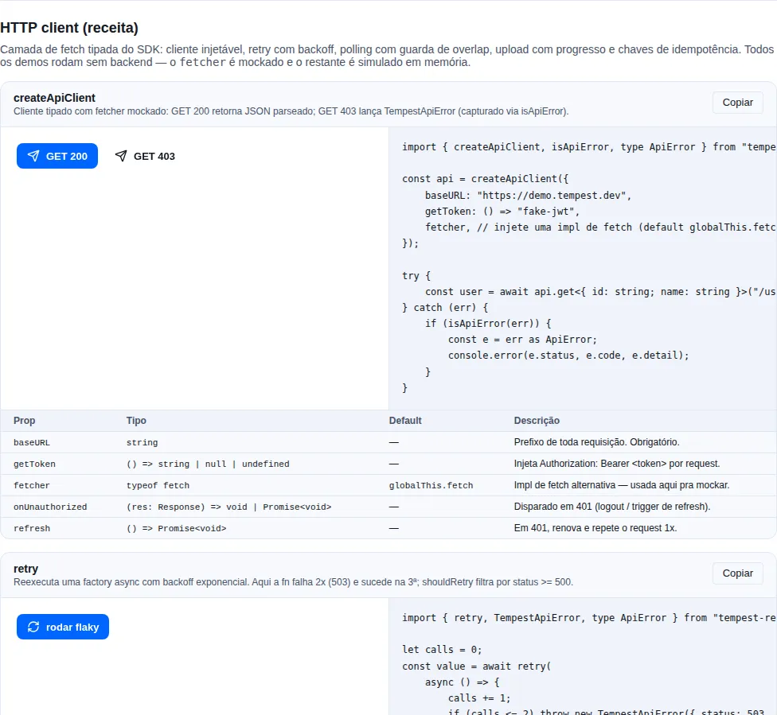

# HTTP

Camada de fetch tipada com tratamento de 401 + refresh, parse JSON automático e upload com progresso. Inspirada no `RequestHandler` do alofans-frontend, mas factory-based pra cada app instanciar o seu próprio cliente.

!!! info "Por que um factory em vez de um singleton global?"
    Cada app tem seu próprio `baseURL`, sua forma de guardar o token e sua estratégia de logout. Um factory deixa você criar o cliente uma vez, injetar essas dependências, e exportar uma instância pronta — sem `import` de estado global espalhado pelo código.

<!-- gallery:recipe-http -->
[](gallery.md)

*Seção `recipe-http` da [gallery](gallery.md) — rode localmente para interagir.*
<!-- /gallery -->

## Quando usar

- Toda chamada HTTP do app passa por `createApiClient`.
- Pra validar a resposta contra um schema, combine com `parseResponse`.
- Pra upload com barra de progresso, use `uploadWithProgress`.
- Pra retentar operações instáveis, use `retry`; pra acompanhar um job, `usePoll`.

> Diagrama editável: [request-flow.drawio](./diagrams/request-flow.drawio) (abra no [draw.io](https://app.diagrams.net)).

## `createApiClient`

Crie o cliente uma vez (ex.: `src/services/api.ts`) e exporte:

```ts
import { createApiClient } from "tempest-react-sdk";
import { useAuthStore } from "./auth-store";
import { AuthService } from "./auth-service";

export const api = createApiClient({
  baseURL: import.meta.env.VITE_API_URL,
  getToken: () => useAuthStore.getState().token,
  onUnauthorized: () => useAuthStore.getState().logout(),
  refresh: async () => {
    await AuthService.refresh(); // refresh seta novo token no store
  },
  withCredentials: true,
  headers: { "X-Client": "web" },
});
```

Opções (todas exceto `baseURL` são opcionais):

- `baseURL` — prefixo de toda requisição. **Obrigatório.** Pode carregar caminho (`https://api.exemplo.com/api`) e pode ser relativo (`"/api"`, resolvido contra a origem atual). Ver [Base URL e prefixo](#base-url-e-prefixo).
- `prefix` — segmento sob o qual toda requisição fica aninhada, tipo `"/api"`. Ver [Base URL e prefixo](#base-url-e-prefixo).
- `getToken()` — chamado a cada request; retornar string injeta `Authorization: Bearer <token>`.
- `onUnauthorized(response)` — disparado sempre que a requisição termina sem autorização: 401 sem `refresh`, `refresh()` que rejeitou, ou repetição que voltou 401 de novo. Use pra deslogar.
- `refresh()` — quando presente e o request der 401, o cliente aguarda `refresh()` e repete a requisição **uma vez**.
- `retry` — `true` ou `RetryOptions`. **Desligado por default.** Ver [Retentativa embutida](#retentativa-embutida).
- `logger` — para onde o cliente reporta cada requisição que terminou. **Desligado por default.** Ver [Log de requisição](#log-de-requisicao).
- `withCredentials` — envia cookies em cross-origin (default `false`).
- `headers` — headers default mesclados em toda request.
- `fetcher` — implementação de `fetch` alternativa (default `globalThis.fetch`) — útil em testes.

Métodos: `get`, `post`, `put`, `patch`, `delete`, `upload`, `request`. Cada um aceita `RequestOptions` (`body`, `params`, e qualquer campo de `RequestInit` exceto `body`):

```ts
// GET com query params (serializados automaticamente)
const users = await api.get<User[]>("/users", {
  params: { page: 1, size: 20, active: true },
});

// POST com body JSON
const created = await api.post<User>("/users", {
  body: { name: "Ana", email: "ana@x.com" },
});

// DELETE
await api.delete<void>(`/users/${id}`);
```

Comportamento:

- `Content-Type: application/json` automático (exceto `FormData`).
- `Authorization: Bearer <token>` quando `getToken()` retorna string.
- Em 401 com `refresh` configurado: aguarda `refresh()`, repete o request 1x. Se falhar, chama `onUnauthorized` e lança `ApiError`.
- Em 401 sem `refresh`: chama `onUnauthorized` e lança `ApiError`.
- 204 retorna `undefined`.
- `Content-Type: application/json` na resposta → `JSON.parse`. Caso contrário, retorna texto cru.

!!! warning "`refresh` só repete uma vez"
    Se o `refresh()` rodar mas o retry ainda devolver 401, o cliente desiste, chama `onUnauthorized` e lança. Isso evita loop infinito de refresh quando a sessão realmente expirou.

    **Esse segundo 401 é o caso que importa.** Um `refresh()` que resolve não prova que a sessão está viva: o backend pode devolver um token que ele mesmo recusa — refresh token revogado, permissão retirada, corrida entre abas. Sem `onUnauthorized` aí, o app ficaria com um store dizendo "autenticado" enquanto toda requisição dá 401, e o usuário veria um erro genérico sem caminho de volta pro login.

!!! warning "`onUnauthorized` não deveria fazer requisição"
    O trabalho do hook é **local**: limpar store, storage e cache. `POST /auth/logout` pertence ao logout explícito do usuário, quando o token ainda vale — chamar de dentro do `onUnauthorized` é mandar a requisição com o token que o backend acabou de recusar, e ela volta 401/422.

    **O erro do hook não vaza mais.** O cliente aguarda o `onUnauthorized` e captura o que ele lançar, então quem chamou continua recebendo o `ApiError` da requisição original — antes da v0.48.0 o throw do hook tomava o lugar do 401, e o console mostrava dois erros onde havia um, o segundo sem relação com a requisição que falhou. Com um `logger` configurado, a falha do hook sai como `warn` em vez de desaparecer.

## Base URL e prefixo

Um serviço FastAPI da Tempest quase nunca fica na raiz do host: ele é montado sob um `root_path`, tipicamente `/api`. Você diz isso ao cliente de duas formas equivalentes — escrevendo o caminho no `baseURL`, ou passando `prefix`:

```ts
// as duas chegam em https://api.exemplo.com/api/auth/login
createApiClient({ baseURL: "https://api.exemplo.com/api" });
createApiClient({ baseURL: "https://api.exemplo.com", prefix: "/api" });

await api.post("/auth/login", { body: credentials });
```

!!! tip "Quando preferir `prefix`"
    Quando a variável de ambiente é usada por mais coisa que o cliente HTTP — um endpoint SSE, um host de mídia, um link que você mostra na tela. Deixe `VITE_API_URL` sendo a origem pura e ponha o prefixo só no cliente; nada mais precisa saber dele.

A barra inicial no caminho da chamada é indiferente — `"/auth/login"` e `"auth/login"` chegam no mesmo lugar:

```ts
const api = createApiClient({ baseURL: "https://api.exemplo.com", prefix: "/api" });

await api.get("/orders"); // https://api.exemplo.com/api/orders
await api.get("orders"); //  https://api.exemplo.com/api/orders
```

!!! warning "Isso mudou na v0.45.0"
    Até a v0.44.0 o cliente resolvia o caminho com `new URL(path, baseURL)`. Pela spec de URL, um caminho iniciado por `/` é absoluto **contra a origem**, então ele descartava em silêncio o caminho do `baseURL`: um cliente em `https://api.exemplo.com/api` pedindo `"/auth/login"` batia em `https://api.exemplo.com/auth/login` e tomava 404 em toda requisição, sem nada na config parecendo errado. O único jeito de acertar era escrever todo caminho sem a barra inicial.

    Se o seu app fez isso — caminhos relativos por causa do bug —, nada quebra: eles continuam resolvendo igual. Você pode voltar a escrever `/auth/login` quando quiser.

O prefixo é aplicado **no máximo uma vez**. Um caminho que já começa com ele passa direto, então dá pra migrar as chamadas aos poucos:

```ts
const api = createApiClient({ baseURL: "https://api.exemplo.com", prefix: "/api" });

await api.get("/api/orders"); // https://api.exemplo.com/api/orders — não vira /api/api
await api.get("/api-keys"); //  https://api.exemplo.com/api/api-keys — comparação por segmento
```

Duas escapadas úteis:

- **Caminho absoluto vence tudo.** `api.get("https://cdn.exemplo.com/arquivo")` ignora `baseURL` e `prefix` — é assim que se alcança um segundo host (upload assinado, CDN) sem criar um segundo cliente.
- **`baseURL` relativo** (`"/api"`) resolve contra a origem atual, que é a forma certa atrás do proxy do dev server ou de um reverse proxy servindo app e API do mesmo host. Fora do browser (sem `location`) isso lança um `TypeError` dizendo qual config corrigir, em vez de um `Invalid base URL` genérico.

Para montar a mesma URL fora do cliente — um `EventSource` de SSE, um `` — o helper é exportado:

```ts
import { buildApiUrl } from "tempest-react-sdk";

const stream = new EventSource(
  buildApiUrl(import.meta.env.VITE_API_URL, "/sse/events", {
    prefix: "/api",
    params: { access_token: token },
  }),
);
```

## Log de requisição

O cliente não escreve em console nenhum por conta própria. Passe um `logger` e cada tentativa que termina vira uma linha:

```ts
import { createApiClient, createLogger } from "tempest-react-sdk";

const log = createLogger({ level: import.meta.env.DEV ? "debug" : "warn" });

export const api = createApiClient({
  baseURL: import.meta.env.VITE_API_URL,
  logger: log.child("http"),
});

await api.get("/orders");
// [http] GET /orders → 200  { requestId: "8f2c…", status: 200, ms: 143 }
```

O que sai:

| Evento | Nível | Linha |
| --- | --- | --- |
| Resposta abaixo de 400 | `debug` | `GET /orders → 200` |
| Resposta 400 ou acima | `warn` | `GET /admin → 403` |
| Requisição que não teve resposta | `warn` | `GET /orders → no response` (contexto carrega o `error`) |
| `onUnauthorized` disparando | `warn` | `unauthorized — calling onUnauthorized` |
| `onUnauthorized` lançando | `warn` | `onUnauthorized threw — keeping the original response error` (contexto com o `error`) |

O contexto de cada linha traz `requestId`, `status` e o `ms` decorrido. É **uma linha por tentativa**, então a repetição depois do `refresh` e cada retry aparecem — é assim que se lê "401, renovou, 200" no log.

!!! info "É `logger`, não `debug: true`"
    Uma flag booleana daria um botão só para o SDK inteiro: ou tudo ou nada, sempre no `console`, e as strings ficariam no bundle mesmo desligada. Com `logger` o **nível** mora no logger (`createLogger({ level })`), o **destino** mora no sink (console em dev, Sentry em produção, array no teste) e o **escopo** mora no namespace — `log.child("http")` separa dois clientes no mesmo app.

    Qualquer objeto com `debug` e `warn` serve (o tipo exportado é `ApiClientLogger`), então não precisa ser o logger do SDK.

!!! warning "O que o log nunca carrega"
    Body, header e query string ficam de fora, de propósito: o `Authorization` é bearer token, o body do login é senha, e um `access_token` em query param acabaria escrito no sink junto. O que é logado é o método, o caminho como o call site escreveu, e os números.

    Se você precisa do payload para depurar, envolva o `fetcher` no seu app — aí a decisão de logar segredo é sua, explícita, e não vai para produção por descuido.

## Retentativa embutida

`retry` liga a repetição automática dentro do próprio cliente, com o mesmo backoff exponencial do helper `retry()`:

```ts
const api = createApiClient({
  baseURL: import.meta.env.VITE_API_URL,
  retry: true, // política embutida
});

const users = await api.get<User[]>("/users"); // repete sozinho se der 503
```

**Vem desligado**, e ligar não é obrigatório: sem `retry`, o cliente falha na primeira tentativa, exatamente como antes.

A política embutida é conservadora de propósito:

| Repete | Não repete |
| ------ | ---------- |
| `GET`, `HEAD`, `OPTIONS` | `POST`, `PUT`, `PATCH`, `DELETE` |
| Falha de rede (status `0`), `408`, `425`, `429`, qualquer `5xx` | `400`, `401`, `403`, `404`, `422` — qualquer outro `4xx` |

!!! danger "Escrita nunca repete sozinha"
    Um `POST` repetido pode cobrar duas vezes, criar dois pedidos, disparar dois webhooks. `PUT` e `DELETE` são idempotentes no papel, mas um backend que registra ou fatura por chamada ainda vê duas — por isso ficam de fora também.

    Para repetir uma escrita, torne-a idempotente com [`generateIdempotencyKey`](#generateidempotencykey) e passe seu próprio `shouldRetry`:

    ```ts
    const key = generateIdempotencyKey(); // uma vez, fora do loop

    const api = createApiClient({
      baseURL,
      headers: { "Idempotency-Key": key },
      retry: { shouldRetry: (error) => isApiError(error) && error.status >= 500 },
    });
    ```

    Um `shouldRetry` seu **substitui a política inteira**, checagem de método incluída — é esse o ponto de escape.

Repetir um `400` ou um `403` não conserta payload errado nem permissão que o usuário não tem: só gasta o tempo dele pra mostrar o mesmo erro. Por isso o corte é por status, não "qualquer erro".

Detalhes que valem saber:

- A retentativa envolve a requisição **inteira**, refresh incluído. Uma tentativa que gasta o ciclo de 401 → refresh → repetição conta como uma tentativa só.
- Cada tentativa carrega o seu próprio `X-Request-ID`, então o backend consegue distinguir as tentativas nos logs.
- `Retry-After` (em `429`/`503`) é respeitado e sobrepõe o backoff daquela tentativa.
## Timeout e cancelamento

O cliente abandona uma requisição depois de **15 s** por default, e depois de **5 min** quando o body é `FormData`.

```ts
const api = createApiClient({
  baseURL: import.meta.env.VITE_API_URL,
  timeout: 15_000, // default
  uploadTimeout: 300_000, // default, aplicado quando o body é FormData
});

// Override por chamada, para o endpoint que não cabe em nenhum dos dois.
const report = await api.get("/relatorio-pesado", { timeout: 60_000 });

// `null` desliga — para stream ou long poll.
const stream = await api.get("/eventos", { timeout: null });
```

!!! danger "Antes disso não havia timeout nenhum"
    Uma conexão TCP que morre sem FIN **não devolve erro**: o browser segura a
    requisição por minutos, ou para sempre. Sem piso, o sintoma é spinner eterno
    exatamente na rede ruim que um SDK offline-first existe para sobreviver.

!!! tip "Por que upload tem timeout próprio"
    Upload binário não é uma requisição lenta, é outro tipo de requisição. Um
    timeout único obriga a escolher entre curto o bastante para proteger uma
    chamada normal e longo o bastante para terminar um arquivo — e 15 s corta o
    upload no meio do body, que o servidor precisa então interpretar como payload
    truncado.

    A detecção é o body ser `FormData`, o mesmo teste que já decide o
    `Content-Type`.

### Timeout vira `status: 0`, abort continua abort

Timeout chega como `ApiError` com `status: 0` — a mesma forma que o cliente já usava para "não chegou ao servidor". Isso não é detalhe de implementação, é o que faz a política de retry replicar um timeout **sem caso especial**: `isRetriableStatus(0)` é `true`.

Já um `abort` que **você** pediu propaga como `DOMException`, e portanto nunca é retentado — o `shouldRetry` embutido exige `TempestApiError`.

```ts
const controller = new AbortController();
const pending = api.get("/lento", { signal: controller.signal });
controller.abort(); // rejeita com DOMException, sem retentar
```

!!! check "`signal` sempre funcionou — só não estava documentado"
    `RequestOptions` estende `Omit<RequestInit, "body">`, então `signal` era aceito
    e repassado ao `fetch` desde sempre. Ninguém tinha como descobrir: não
    aparecia na interface e não estava em nenhuma doc. Agora está declarado
    explicitamente, o que para o compilador é redundante e para quem lê não é.

    O caso que isso resolve é o react-query: passe o `signal` que a `queryFn`
    recebe e a requisição é cancelada em unmount e em refetch.

    ```tsx
    useQuery({
      queryKey: ["pedidos"],
      queryFn: ({ signal }) => api.get("/pedidos", { signal }),
    });
    ```

- Precisa de retentativa em uma chamada específica, não no cliente todo? O helper [`retry`](#retry-backoff-exponencial) continua ali, e agora usa a **mesma** classificação de status.

## `parseResponse`

Valida payload com zod. Em um **build de desenvolvimento**, mostra exatamente qual campo divergiu (contract drift) e o payload cru que chegou. Em **qualquer outro build**, uma mensagem genérica — a estrutura interna e o corpo da resposta não vazam pra tela do usuário nem pro seu error tracker.

```ts
import { parseResponse } from "tempest-react-sdk";
import { z } from "zod";
import { api } from "./api";

const userSchema = z.object({ id: z.string(), name: z.string() });

const raw = await api.get<unknown>("/users/me");
const user = parseResponse(userSchema, raw, "GET /users/me");
// user: { id: string; name: string } — tipado a partir do schema
```

!!! tip "O 3º argumento é o contexto"
    Passe sempre um label como `"GET /users/me"`. Ele aparece na mensagem de erro de dev e torna trivial localizar qual endpoint quebrou o contrato.

!!! danger "Em um app **Vite**, o relatório só liga se você disser"
    O SDK detecta o build lendo `process.env.NODE_ENV`. Webpack, Rspack e Parcel substituem essa expressão por um literal enquanto compilam o **seu** app, então lá funciona sozinho. O Vite **não substitui nenhuma das duas metades**, e num bundle de browser o identificador `process` nem existe: a leitura lança, o SDK responde `false`, e o relatório fica inalcançável — inclusive sob `vite dev`.

    Uma linha no bootstrap resolve:

    ```ts
    import { setDevBuild } from "tempest-react-sdk";

    setDevBuild(import.meta.env.DEV);
    ```

    Isso vale para **todo** diagnóstico de desenvolvimento do SDK, não só o `parseResponse`: o aviso de ícone que recebeu `name` e `slug` juntos, a falha de shard, o `QueryClient` estrangeiro e o frame JSON também estavam mudos no Vite.

!!! note "Por que o SDK não lê `import.meta.env.DEV` sozinho"
    Porque o Vite substituiria essa expressão ao compilar **o pacote**, e o artefato publicado carregaria a constante `false` para sempre — cada guarda atrás dela viraria código morto que o dev server do seu app não consegue mais ligar. Só o seu app é compilado no instante em que a resposta é conhecível, então só ele pode fornecê-la. É por isso que o sinal é um parâmetro, e não uma detecção mais esperta.

    O default é `false` de propósito: o relatório embute `JSON.stringify(raw)`, o corpo inteiro da resposta. Chutar para o lado errado vazaria payload numa string de erro de produção — silêncio é o default seguro.

!!! warning "A detecção automática compara com `production`, não com `development`"
    A checagem é `NODE_ENV !== "production"`, não uma lista de nomes conhecidos de dev. Um build de staging ou de QA que esquece de definir `NODE_ENV=production` cai no lado de desenvolvimento — e aí a mensagem de erro carrega `JSON.stringify(raw)`, o corpo inteiro da resposta. Se esse build fala com dados reais, defina `NODE_ENV=production` nele.

## `uploadWithProgress`

`fetch` não reporta upload progress no navegador — esse helper usa `XMLHttpRequest` por baixo, mantendo o mesmo contrato de erro do `createApiClient` (lança `ApiError`).

```tsx
import { useState } from "react";
import { uploadWithProgress } from "tempest-react-sdk";
import { useAuthStore } from "./auth-store";

export function AvatarUpload() {
  const [progress, setProgress] = useState(0);

  async function handleFile(file: File) {
    const formData = new FormData();
    formData.append("file", file);
    const controller = new AbortController();

    const result = await uploadWithProgress<{ url: string }>({
      url: `${import.meta.env.VITE_API_URL}/uploads`,
      method: "POST",
      body: formData,
      getToken: () => useAuthStore.getState().token,
      onProgress: ({ fraction }) => fraction !== null && setProgress(Math.round(fraction * 100)),
      signal: controller.signal,
    });

    console.log("URL final:", result.url);
  }

  return (
    <label>
      <input type="file" onChange={(e) => e.target.files?.[0] && handleFile(e.target.files[0])} />
      <progress value={progress} max={100} />
    </label>
  );
}
```

`onProgress` recebe `{ loaded, total, fraction, lengthComputable }`. `fraction` é `null` quando o tamanho total é desconhecido. Abortar via `signal` rejeita com `DOMException("Aborted")`.

## `retry` — backoff exponencial

Reexecuta uma factory async com delays crescentes (`initialDelay` dobrando a cada tentativa, limitado por `maxDelay`):

```ts
import { retry } from "tempest-react-sdk";
import { api } from "./api";
import type { ApiError } from "tempest-react-sdk";

const data = await retry(() => api.get("/flaky-endpoint"), {
  retries: 5,
  initialDelay: 300,
  maxDelay: 10_000,
  // Não retentar erros de cliente (4xx) — só falhas transitórias
  shouldRetry: (error) => (error as ApiError).status >= 500,
  onRetry: ({ attempt, delay }) => console.warn(`Tentativa ${attempt} em ${delay}ms`),
});
```

!!! note "O default já evita retentar o que não vai melhorar"
    Você **não precisa** escrever o `shouldRetry` do exemplo acima. Sem ele, o
    default replica qualquer erro que não tenha forma de erro de API — falha de
    transporte não tem status pra julgar — e, para os que têm, só os status que
    `isRetriableStatus` aceita: falha de rede (`0`), `408`, `425`, `429` e qualquer
    `5xx`. Um 403 ou 422 falha de primeira.

!!! tip "`isRetriableStatus` — a política, reutilizável"
    A lista é exportada, então um `shouldRetry` seu estende a política em vez de
    reescrevê-la:

    ```ts
    import { isApiError, isRetriableStatus, retry } from "tempest-react-sdk";

    const data = await retry(() => api.post("/import", { body }), {
      shouldRetry: (error) =>
        isApiError(error) &&
        (isRetriableStatus(error.status) || error.code === "IMPORT_LOCKED"),
    });
    ```

    Ela é a **única** dona dessa decisão: o cliente, o default das queries e este
    helper leem daqui. Eram três listas, e a das queries estava sem o `425` — o
    mesmo `425 Too Early` era retentado por um caminho e não pelo outro.

## `usePoll` — polling com guarda de overlap

Chama uma factory async num intervalo fixo, pulando ticks enquanto a chamada anterior não terminou. Ideal pra acompanhar o status de um job:

```tsx
import { usePoll } from "tempest-react-sdk";
import { api } from "./api";

interface Job {
  id: string;
  status: "pending" | "done" | "failed";
}

export function JobStatus({ jobId }: { jobId: string }) {
  const { data, loading, error, stop } = usePoll<Job>(() => api.get<Job>(`/jobs/${jobId}`), {
    interval: 3000,
    stopWhen: (job) => job.status !== "pending",
    onError: (err) => console.error(err),
  });

  if (loading && !data) return <p>Verificando…</p>;
  if (error) return <p>Erro ao consultar job.</p>;
  return (
    <div>
      Status: {data?.status}
      <button onClick={stop}>Parar</button>
    </div>
  );
}
```

`usePoll` também devolve `start()` pra retomar manualmente, e aceita `disabled` pra pausar sem desmontar.

## `generateIdempotencyKey`

Gera um UUID v4 pra usar no header `Idempotency-Key`. Mande o **mesmo** valor em retries de uma operação que não pode rodar duas vezes (cobrança, criação de pedido):

```ts
import { generateIdempotencyKey } from "tempest-react-sdk";
import { api } from "./api";

const key = generateIdempotencyKey();

await api.post("/orders", {
  body: { items },
  headers: { "Idempotency-Key": key },
});
```

!!! warning "Gere a key uma vez por operação, não por tentativa"
    Se você gerar uma key nova a cada retry, o servidor trata cada chamada como nova e a proteção some. Crie a key **antes** do loop de retry e reutilize.

## Erros

`ApiError = { status, detail, body }`. Sempre lance — não retorne resultado falsy. UIs podem reagir por `status`:

```ts
import type { ApiError } from "tempest-react-sdk";
import { api } from "./api";

try {
  await api.get("/users/me");
} catch (err) {
  const error = err as ApiError;
  if (error.status === 403) toast.error("Sem permissão");
  else toast.error(error.detail);
}
```

!!! info "`error.fields` — o campo culpado, venha ele em lista ou em chave"
    Um erro de validação **do FastAPI cru** chega como `detail: [{ loc, msg, type }]`, e o cliente monta duas coisas dessa lista:

    - **`error.fields`** — `{ email: "Field required", "items.0.price": "Input should be greater than 0" }`, indexado pelo caminho do campo, que é o que um formulário precisa. O prefixo de `loc` que só nomeia a parte da requisição (`body`, `query`, `path`, `header`, `cookie`) é descartado. Campo repetido mantém a primeira mensagem — input mostra um erro por vez.
    - **`error.detail`** — a mesma coisa achatada numa linha, para log. Carrega caminho de campo e a redação do validador; é texto de desenvolvedor.

    Um backend em cima do [`tempest-fastapi-sdk`](https://mauriciobenjamin700.github.io/tempest-fastapi-sdk/) manda essa lista só enquanto não assume o handler. Assumindo, ele nomeia o campo numa **chave** ao lado da mensagem — e o `fields` também lê essas, nesta ordem:

    | Onde o campo vem | Exemplo de corpo | Quem manda |
    | --- | --- | --- |
    | `detail[].loc` | `{ "detail": [{ "loc": ["body", "email"], "msg": "Field required" }] }` | FastAPI cru (`RequestValidationError` sem handler próprio) |
    | `detail.field` | `{ "detail": { "detail": "Cidade não encontrada…", "field": "city" } }` | `AppException` / `ValidationException` com dict de mensagem |
    | `field` | `{ "detail": "Value error, … for field 'phone' in 'body'", "field": "phone" }` | handler de `RequestValidationError` que achata a lista |
    | `details.field` | `{ "detail": "Coluna inválida", "details": { "field": "criado_em" } }` | saco de contexto do `AppException` |

    Quando o campo vem por chave, o valor em `fields` é **a mesma frase** que está em `error.detail` — o backend mandou uma mensagem só, e ela agora sabe a qual input pertence. A lista ganha de todas as chaves; `details` responde por último, porque é um saco de contexto genérico e o `field` dele pode ser sobre algo que nem existe na tela (uma coluna de ordenação, por exemplo).

    ```ts
    import { isApiError } from "tempest-react-sdk";

    try {
      await api.post("/users", { body: form });
    } catch (err) {
      if (isApiError(err) && err.fields) {
        for (const [field, message] of Object.entries(err.fields)) {
          setError(field, { message });
        }
      }
      toast.error(describeApiError(err, "Não foi possível salvar"));
    }
    ```

    Sem `fields` isso exigia varrer `error.body` com um cast — parsear de volta a linha que o próprio SDK montou.

!!! warning "Não jogue o `detail` de um 422 na tela"
    `"items.0.price: Input should be greater than 0"` numa interface em pt-BR é meia frase em inglês nomeando estrutura interna. É por isso que o `describeApiError` **não** repassa o `detail` quando `fields` está preenchido: ele devolve a frase de validação ("Confira os campos destacados e tente de novo.", traduzível por `tempest.error.validation`), e as mensagens por campo ficam onde servem — nos inputs.

    **Com uma exceção: a rejeição que nomeia um único campo e cuja mensagem é o próprio `detail`.** Aí o `detail` vai para a tela. Não é um palpite sobre o texto — é identidade: o SDK preenche uma entrada única a partir do `detail` só para o envelope achatado de um backend `tempest-fastapi-sdk`, onde o servidor escreveu **uma frase pronta sobre um campo** ("CPF ou CNPJ inválido"). A string mostrada é exatamente a que já está em `error.fields`, então nada é inventado e nada se perde.

    A linha montada pelo FastAPI nunca chega nesse ramo: ela vem da **lista** `detail`, e as entradas de `fields` ali são as mensagens por issue, não o `detail`.

    Para forçar a frase fixa mesmo nesse caso, `useDetail: false`. Passar `validation` **não** desliga a exceção, de propósito — o `useDescribeApiError` sempre passa `validation` (traduzida ou no default), então tratá-la como override faria o ramo nunca rodar em componente nenhum.

### Do erro tipado para a frase na tela — `describeApiError`

O `try/catch` acima escreve a frase à mão, e todo app escreve o mesmo funil — errando sempre no mesmo lugar: a requisição que **não chegou** ao servidor tem `status === 0`, e sem tratamento ela vira "erro 0" na tela.

```ts
import { describeApiError } from "tempest-react-sdk";

try {
  await api.get("/pedidos");
} catch (error) {
  toast.error(describeApiError(error, "Não foi possível carregar os pedidos"));
}
```

A ordem do funil:

1. **`codes[error.code]`** — a frase que **você** escreveu pra aquele caso do backend. Ganha de todo o resto: nada que o funil deduz bate uma frase escrita por quem conhecia o contrato e a tela.
2. **Requisição que não chegou** — `status === 0`, ou um erro qualquer com o browser se declarando offline → frase de offline.
3. **Erro que nomeia campos** — `error.fields` preenchido → frase de validação, **não** o `detail`. É o 422 do FastAPI, cujo `detail` é técnico. A exceção é a rejeição que nomeia **um único** campo cuja mensagem é o próprio `detail`: ali o `detail` é devolvido, porque é a mesma string que `fields` carrega. As mensagens por campo continuam em `fields` nos dois casos.
4. **`detail` do backend** — o texto mais específico disponível, e já escrito para uma pessoa.
5. **`fallback`**, com `(HTTP <status>)` anexado quando há status — o print no chamado de suporte carrega o único dado que o dev precisa.

### `codes` — o `switch` que todo app reescrevia

O cliente já entrega o `code` do backend no `ApiError`, mas sem um lugar pra ele cada app escreve o mesmo `switch` pra virar frase no idioma dele:

```ts
import { describeApiError } from "tempest-react-sdk";

try {
  await api.post("/services/1/candidates", { body: payload });
} catch (error) {
  toast.error(
    describeApiError(error, "Não foi possível se candidatar", {
      codes: {
        SERVICE_FULL: "Este serviço atingiu o limite de vagas.",
        CANDIDATE_ALREADY_EXISTS: "Você já se candidatou a este serviço.",
      },
    }),
  );
}
```

Código que o catálogo não conhece simplesmente segue o funil. Sem `codes`, nada muda.

!!! tip "`useDetail: false` quando o `detail` é pra desenvolvedor"
    Alguns backends escrevem o `detail` pro log, não pra tela — ou ele ecoa interno. Com `useDetail: false` o passo 4 é pulado e o resultado é sempre uma frase sua, a de offline, a de validação, ou o `fallback` com `(HTTP <status>)`. As frases de offline e validação continuam valendo: elas são do SDK, não do backend.

    É também o jeito de recusar a sentença de campo único descrita acima: com `useDetail: false`, uma rejeição de campo único volta a mostrar a frase de validação.

!!! check "A cauda `for field '…' in '…'` é aparada"
    Um backend `tempest-fastapi-sdk` achata o erro de campo em `"CPF ou CNPJ inválido for field 'cpf_cnpj' in 'body'"` — frase pronta na sua língua com uma oração em inglês colada no fim. Ela não traz nada de novo: os mesmos dois valores chegam como `field` e `location`, que é de onde `error.fields` os lê. O SDK apara a cauda ao montar o `ApiError`, então `detail` e `fields` já vêm limpos.

    O aparo só dispara quando a cauda nomeia **o campo que o envelope resolveu**. Uma cauda que nomeia outro campo é outro formato, ou uma frase que genuinamente se lê assim — nos dois casos, texto que o SDK não tem como atribuir e por isso não apaga.

Duas superfícies, mesmo funil:

| | Quando usar |
| --- | --- |
| `describeApiError(error, fallback, options?)` | Função pura. Roda em interceptor, logger, qualquer lugar fora da árvore React. |
| `useDescribeApiError()` | Hook. Resolve a frase fixa pelo `I18nProvider` ativo; devolve `(error, fallback, options?) => string`, com as mesmas opções da função pura. |

```tsx
import { useDescribeApiError } from "tempest-react-sdk";

const describe = useDescribeApiError();
const { mutate } = useMutation({
  mutationFn: salvar,
  onError: (error) => toast.error(describe(error, "Não foi possível salvar")),
});
```

!!! info "O hook não duplica o funil — ele só entrega as strings"
    `useDescribeApiError` chama a função pura. Existir nos dois formatos é sobre **onde** o código roda: contexto React não é alcançável de um interceptor, e passar tradução na mão em todo componente é o que o hook evita.

!!! check "Funciona sem `I18nProvider`, e sem a chave no catálogo"
    i18n é opt-in no SDK. Sem provider, ou com um catálogo que nunca definiu `tempest.error.offline`, a frase cai no default em pt-BR — em vez de estourar ou de imprimir a chave crua na cara do usuário (que é o que `t` devolve quando não encontra).

!!! note "As constantes que acompanham"
    `DEFAULT_API_ERROR_STRINGS` traz as frases pt-BR usadas quando nada mais responde
    (`offline` e `validation`) — útil pra escrever as suas a partir delas.
    `API_ERROR_OFFLINE_KEY` (`"tempest.error.offline"`) e
    `API_ERROR_VALIDATION_KEY` (`"tempest.error.validation"`) são as chaves que o hook
    procura no catálogo; defina-as no seu `messages` para traduzir cada frase.

!!! warning "`detail` sintético não vence o seu `fallback`"
    Quando a resposta não traz corpo, `buildApiError` sintetiza `Erro <status>`. `describeApiError` reconhece esse texto e prefere o seu `fallback` — "Erro 500" diz estritamente menos que "Não foi possível carregar os pedidos".

## Recap

- `createApiClient({ baseURL, getToken, onUnauthorized, refresh, ... })` cria um cliente tipado; instancie uma vez e exporte.
- `baseURL` pode carregar caminho (`https://host/api`) ou ser relativo (`"/api"`), e `prefix: "/api"` diz a mesma coisa deixando a env var como origem pura. A barra inicial na chamada é indiferente; o prefixo nunca é aplicado duas vezes. `buildApiUrl` monta a mesma URL fora do cliente.
- 401 com `refresh` → tenta renovar e repete 1x. `onUnauthorized` dispara em todo desfecho sem autorização — sem refresh, refresh que rejeitou, ou repetição que voltou 401.
- `retry: true` liga a retentativa dentro do cliente: só método idempotente, só falha de rede/`408`/`425`/`429`/`5xx`. Escrita nunca repete sozinha.
- `logger` é opt-in e o client não escreve em console sem ele: uma linha por tentativa (`debug` abaixo de 400, `warn` de 400 pra cima) com `requestId`, `status` e `ms`, nunca body/header/query.
- `parseResponse(schema, raw, context)` valida o payload com zod e aponta o campo divergente em um build de desenvolvimento; em qualquer outro build, só a frase genérica. Em app **Vite**, chame `setDevBuild(import.meta.env.DEV)` uma vez no bootstrap — sem isso o SDK não tem como saber, e o relatório fica mudo.
- `uploadWithProgress` usa XHR pra reportar progresso byte a byte; para arquivo grande, `createResumableUpload` divide em chunks e retoma — veja [Upload resumível](./resumable-upload.md).
- `retry` (backoff exponencial + `shouldRetry`) e `usePoll` (intervalo com guarda de overlap) cobrem operações instáveis e acompanhamento de jobs.
- `generateIdempotencyKey` — gere uma vez por operação, reutilize nos retries.
- `describeApiError(error, fallback)` (puro) e `useDescribeApiError()` (com i18n) transformam o erro tipado na frase da tela, tratando `status === 0` como offline em vez de "erro 0" e o erro com **vários** campos como frase de validação em vez do `detail`. A rejeição de **um** campo cuja mensagem é o próprio `detail` mostra o `detail` — é a frase que o servidor escreveu para aquele campo. `useDetail: false` recusa.
- `error.fields` indexa as mensagens por campo — da lista do 422 do FastAPI ou das chaves `detail.field` / `field` / `details.field` que um backend `tempest-fastapi-sdk` manda. É o que vai direto pro `setError` do formulário.

## Veja também

- [Auth + Guard](./auth.md)
- [Passkeys](./passkeys.md) — login sem senha em cima do mesmo client
- [Upload resumível (tus)](./resumable-upload.md) — quando uma request só não basta
- [Logger](./logger.md) — o `logger` que o client aceita
- [Query](./query.md) — alimenta as `queryFn`
- [SSE](./sse.md) — usa `withCredentials` igual ao client
- Diagrama: [request-flow.drawio](./diagrams/request-flow.drawio)
