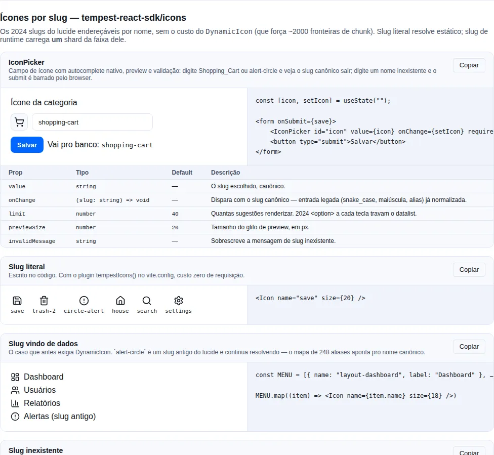

# Ícones por slug

Todo componente do SDK que aceita ícone aceita um `ReactNode`:

```tsx
import { Button } from "tempest-react-sdk";
import { Save } from "lucide-react";

<Button leftIcon={<Save size={18} />}>Salvar</Button>;
```

Isso resolve o caso em que **você sabe o ícone na hora de escrever o código**. Mas
às vezes o nome do ícone chega pronto: um menu que a API devolve, um cadastro no
CMS, uma tabela de configuração. Aí não há o que importar — só existe a string
`"layout-dashboard"`.

É pra isso que existe o subpath `tempest-react-sdk/icons`. 🚀

<!-- gallery:icons -->
[](gallery.md)

*Seção `icons` da [gallery](gallery.md) — rode localmente para interagir.*
<!-- /gallery -->

## O caminho mais curto

```tsx
import { Icon } from "tempest-react-sdk/icons";

export function Toolbar() {
    return (
        <div>
            <Icon name="save" size={18} />
            <Icon name="trash-2" size={18} />
        </div>
    );
}
```

Pronto — sem provider, sem configuração. Os **2065 slugs** do lucide funcionam
assim, incluindo nome que só existe em runtime:

```tsx
<Icon name={row.iconSlug} />
```

!!! info "Slug é kebab-case, não PascalCase"
    O nome é o do lucide em kebab-case: `"circle-alert"`, não `"CircleAlert"`.
    `"trash-2"`, não `"Trash2"`. Em dev, um nome errado sai no console com essa
    dica.

## Não instale `lucide-react` você mesmo

O `lucide-react` é **dependência direta do SDK** — instalar ele no seu app é o que
cria problema, não o que resolve.

```bash
npm uninstall lucide-react
```

!!! danger "Duas cópias de lucide = bytes duplicados e tabela de slug quebrada"
    Se o seu `package.json` declara `lucide-react` numa faixa diferente da do SDK,
    o gerenciador instala **duas cópias físicas**. Dois efeitos, e o segundo é o
    grave:

    1. **Bytes duplicados** no bundle — o app importa da cópia dele, o SDK da
       cópia dele, e nenhuma das duas é tree-shaken pela outra.
    2. **Skew de versão**: as tabelas de slug do `/icons` são **geradas** contra a
       versão que o SDK declara (`^1.31.0`). Uma segunda cópia mais antiga pode não
       ter exports que as tabelas referenciam, e aí o erro aparece no build do app
       como `X is not exported by lucide-react` — apontando pra dentro do SDK, o
       que torna a causa difícil de achar.

    A regra: **uma cópia só**, a que o SDK trouxe.

!!! info "Se você importa componentes do lucide direto"
    Usando só `<Icon name="…" />`, não precisa declarar lucide em lugar nenhum.

    Se você também escreve `import { Save } from "lucide-react"` no seu código, o
    que acontece depende do gerenciador:

    - **npm / yarn** — hoisting deixa a cópia do SDK visível na raiz do seu
      `node_modules`, então o import resolve sem você declarar nada. É o caminho
      recomendado.
    - **pnpm** (isolamento estrito) — o app não vê dependência que não declarou,
      então você **precisa** declarar. Nesse caso use **a mesma faixa do SDK**
      (`"lucide-react": "^1.31.0"`) pra continuar existindo uma cópia só.

!!! tip "Confirme que sobrou uma"
    ```bash
    npm ls lucide-react
    ```
    Mais de uma linha na saída (ou uma cópia aninhada em
    `node_modules/tempest-react-sdk/node_modules/`) significa duas instâncias —
    rode `npm dedupe`, e se persistir, remova a declaração do seu `package.json`.

## Por que não `DynamicIcon` do lucide

O `lucide-react` traz um `DynamicIcon` que parece resolver o mesmo problema. Ele
tem um custo que inviabiliza o uso:

!!! danger "`DynamicIcon` gera ~2000 fronteiras de chunk"
    O mapa que ele usa (`dynamicIconImports`) é um módulo de **116 KB** com uma
    chamada `import()` para **cada** um dos 2065 ícones. Qualquer bundler que veja
    esse módulo é obrigado a criar um chunk por ícone: no build de produção isso
    vira ~2065 arquivos minúsculos, e em desenvolvimento vira uma enxurrada de
    requisições no navegador.

    Além disso ele resolve o ícone **depois** da renderização (num `useEffect`), então
    o primeiro quadro nunca tem ícone e o layout pula. E um nome inexistente faz
    `throw`, derrubando a árvore React — justamente no caso em que o nome vem de
    fora.

O `<Icon>` do SDK troca isso por **um chunk por faixa de 40 ícones**. Renderizar
130 ícones diferentes pede algumas requisições, não 130:

```console
GET .../icons/generated/shard-09.js   200
GET .../icons/generated/shard-21.js   200
GET .../icons/generated/shard-36.js   200
… uma por faixa tocada, no máximo 46
```

O maior shard pesa **4,92 KB brotli**, a mediana **4,31 KB** e o menor **1,57 KB**.
O runtime do `<Icon>`, sem shard nenhum, custa **~0,1 KB brotli**.

!!! info "Por que faixa e não letra inicial"
    A primeira letra é a pior chave de particionamento possível, porque os nomes do
    lucide são fortemente enviesados: `c` tem 284 slugs e `q` tem 4. Desenhar **um**
    ícone de categoria que começasse com `c` baixava 284 ícones — 19,10 KB brotli
    para um glifo de meio KB, fator de desperdício de ~130x.

    As faixas são contíguas e ordenadas, então o SDK acha o shard dono de um slug com
    uma **busca binária** sobre 46 limites — em vez de embarcar o mapa de 2065
    entradas slug→chunk que faz o `dynamicIconImports` do próprio lucide custar 120 KB
    no chunk principal.

## Catálogo fechado: `registerIcons`

Painel administrativo costuma ter vinte ícones e nenhum a mais. Para esse caso não
precisa de plugin nem de provider — registre uma vez no entrypoint:

```tsx
// src/main.tsx
import { createRoot } from "react-dom/client";
import { registerIcons } from "tempest-react-sdk/icons";
import { House, Save, Settings, Trash2, Users } from "lucide-react";
import { App } from "@/App";

registerIcons({
    house: House,
    save: Save,
    settings: Settings,
    "trash-2": Trash2,
    users: Users,
});

createRoot(document.getElementById("root")!).render(<App />);
```

Pronto: qualquer `<Icon name="save" />` na árvore resolve **no primeiro frame, sem
requisição**. Os imports são estáticos, então o bundler mantém exatamente esses
cinco ícones e joga o resto fora.

!!! tip "Serve também para arte própria"
    A chave não precisa ser um slug do lucide. `registerIcons({ "minha-marca": Marca })`
    faz `<Icon name="minha-marca" />` funcionar — mesmo call site, mesmo default de
    `size`, sem `if` no componente.

!!! info "Slug depreciado entra pelo nome canônico"
    `registerIcons({ "alert-circle": AlertCircle })` grava sob `circle-alert`, então
    as duas grafias resolvem. É o mesmo mapa de alias que o `<Icon>` usa.

`registerIcons` é acumulativo e idempotente: chame de quantos módulos quiser, e
registrar o mesmo par duas vezes não custa render. Registrar **depois** de a árvore
já ter renderizado também funciona — todo `<Icon>` montado no fallback é avisado e
re-renderiza.

### Já tem o componente na mão? Passe direto

```tsx
import { Icon } from "tempest-react-sdk/icons";
import { Wrench } from "lucide-react";

<Icon icon={Wrench} />
```

Sem lookup, sem registro, sem shard. Existe para a tela que mistura ícone literal
com ícone vindo de dados poder usar **um** componente nos dois casos — e assim os
defaults de `size`/`strokeWidth` do `IconProvider` valerem para os dois. `name` e
`icon` são mutuamente exclusivos: passar os dois é erro de tipo.

### Quando ainda vale o `IconProvider`

Depois do `registerIcons`, sobra para o provider o que é **escopo de árvore**:

- default de `size` / `strokeWidth` para uma subárvore;
- um registro que precisa **ganhar** do global só ali (tema alternativo, preview de
  ícone dentro de um modal).

A precedência é: registro do provider → registro global (`registerIcons` e shards já
baixados) → busca do shard.

## Custo zero de requisição para os slugs que você escreveu

Um `<Icon name="save" />` escrito no código não precisa de shard nenhum: o slug é
conhecido em tempo de build. O plugin `tempestIcons()` varre o seu source, acha
esses nomes e gera um registro com imports estáticos comuns.

### 1. Ligue o plugin

Se você usa `createViteConfig`, **já está ligado** — o plugin entra por default:

```ts
// vite.config.ts
import { createViteConfig } from "tempest-react-sdk/vite";

export default createViteConfig();
```

Config manual? Adicione o plugin:

```ts
// vite.config.ts
import { defineConfig } from "vite";
import react from "@vitejs/plugin-react";
import { tempestIcons } from "tempest-react-sdk/vite";

export default defineConfig({
    plugins: [react(), tempestIcons()],
});
```

### 2. Passe o registro pro provider

```tsx
// src/main.tsx
import { createRoot } from "react-dom/client";
import { IconProvider } from "tempest-react-sdk/icons";
import { staticIcons } from "tempest-react-sdk/icons/virtual";
import { App } from "@/App";

createRoot(document.getElementById("root")!).render(
    <IconProvider registry={staticIcons} size={18}>
        <App />
    </IconProvider>,
);
```

!!! info "Não precisa declarar tipo nenhum"
    `tempest-react-sdk/icons/virtual` é um módulo **de verdade** do pacote: os tipos
    vêm pelo `exports`, e ele resolve mesmo **sem** o plugin — para um registro
    vazio. É o que faz o mesmo arquivo carregar no vitest sem o plugin, no `tsx`, num
    Storybook com builder próprio ou em qualquer script Node que importe a árvore da
    app. Antes disso, `import { staticIcons } from "virtual:tempest-icons"` fora de um
    build Vite com o plugin não deixava **um ícone** faltando: derrubava o módulo
    inteiro.

!!! warning "A grafia antiga continua funcionando"
    `import { staticIcons } from "virtual:tempest-icons"` segue resolvendo quando o
    plugin está instalado, e o `/// <reference types="tempest-react-sdk/icons/virtual" />`
    que você já tem no `vite-env.d.ts` continua válido — pode apagar, não precisa.
    Só não use essa grafia em código novo: ela é a que não resolve fora do Vite.

Feito isso, todo slug literal do seu código resolve **no primeiro frame, sem
requisição extra**. Slug de runtime continua caindo no shard — o comportamento não
muda, só fica mais barato onde dá.

!!! tip "O provider também guarda os defaults"
    `size` e `strokeWidth` no `IconProvider` valem pra toda a subárvore, então você
    para de repetir `size={18}` em cada chamada. Prop explícita no `<Icon>` sempre
    ganha do default.

## `icon_code` do banco chega sujo — e renderiza

Todo backend que grava ícone grava sujo. `snake_case` de formulário antigo, espaço
e maiúscula de valor digitado à mão, e slug que o lucide depreciou desde então. O
`<Icon>` limpa antes de procurar, então os três casos renderizam:

```tsx
<Icon name="shopping_cart" />   {/* → shopping-cart */}
<Icon name="  Save " />         {/* → save */}
<Icon name="alert-circle" />    {/* → circle-alert (alias) */}
<Icon name=" Alert_Circle " />  {/* → circle-alert (os três de uma vez) */}
```

A normalização é: `trim` → minúsculas → `_` vira `-` → `resolveIconAlias`. Nessa
ordem, e é a mesma função que você pode chamar sozinho:

```tsx
import { normalizeIconName } from "tempest-react-sdk/icons";

normalizeIconName(" Alert_Circle ");  // "circle-alert"
```

Exporta sozinho porque o **formulário precisa dela antes de submeter**, não só para
renderizar: você grava o slug canônico no banco em vez de guardar a sujeira e
limpar em toda leitura.

!!! warning "Normalizar não é validar"
    `normalizeIconName` devolve a grafia canônica, não a garantia de que o ícone
    existe: `normalizeIconName("Not_An_Icon")` é `"not-an-icon"`. Quem decide o que
    fazer com um nome desconhecido é você — `isIconName` responde, e o `<Icon>`
    renderiza o `fallback`.

!!! tip "Lookup estrito quando você quer ver o erro"
    `normalize={false}` desliga a limpeza para aquele call site. Serve para quando
    uma grafia inesperada **deve** aparecer como ícone faltando em vez de ser
    consertada em silêncio.

O aviso de dev cita o nome **como foi escrito**, não o normalizado: quem lê o
console é quem digitou, e `name="CircleAlert"` é bem mais útil ali do que o
`"circlealert"` que aquilo normaliza.

## Nome que não existe

Nunca lança. Sem `fallback`, não renderiza nada:

```tsx
<Icon name="nao-existe" />
```

Com `fallback`, renderiza o que você mandar — inclusive um placeholder do mesmo
tamanho, pra o layout não pular enquanto o shard está no ar:

```tsx
<Icon
    name={row.iconSlug}
    size={20}
    fallback={<span style={{ width: 20, height: 20 }} />}
/>
```

Em **desenvolvimento** sai um `console.warn` uma vez por slug, e só quando o nome é
realmente inexistente — nunca enquanto um ícone válido está carregando.

!!! warning "Valide na borda, não no componente"
    Se o nome vem de fora, decida o fallback **uma vez**, onde o dado entra:

    ```tsx
    import { isIconName } from "tempest-react-sdk/icons";

    const slug = isIconName(row.icon) ? row.icon : "circle-help";
    ```

    `isIconName` importa a lista completa de slugs (~7 KB brotli). O `<Icon>` **não**
    importa essa lista — só pague por ela onde precisa validar ou listar.

## Slug antigo continua funcionando

O lucide renomeou vários ícones (`alert-circle` → `circle-alert`,
`alert-triangle` → `triangle-alert`) e mantém os 258 nomes antigos como alias. O
SDK carrega esse mapa, então um slug gravado no banco há dois anos ainda renderiza:

```tsx
<Icon name="alert-circle" />  {/* renderiza circle-alert */}
```

O alias resolve pro nome canônico **antes** de escolher o shard, então
`alert-circle` puxa o shard `c`, não o `a`.

## Quando o shard não chega

Slug de runtime baixa um chunk, chunk tem hash no nome, e o hash muda a cada
deploy. Isso monta um cenário rotineiro em SPA de aba longa:

1. o usuário abre o app, e o shard daquela faixa ainda não foi baixado;
2. sai um deploy, e os assets antigos somem do CDN;
3. o usuário navega pra uma tela que precisa daquele ícone;
4. o `import()` rejeita — 404.

O SDK trata isso em três partes:

**Retry curto.** Duas tentativas extras, 100 ms e 400 ms, porque a falha que
retry conserta é a transitória: conexão instável, edge de CDN atrasado. Se uma
delas passar, o ícone aparece e ninguém fica sabendo.

**Falha de carga não é nome errado.** `iconStatus` ganhou um quarto estado:

```tsx
iconStatus("save");  // "ready" | "loading" | "missing" | "error"
```

`"missing"` só sai quando isso é de fato sabível — o shard **chegou** e o slug não
estava nele. Shard que falhou responde `"error"`, e por isso o `<Icon>` para de
avisar "no such lucide icon" sobre um nome perfeitamente válido. O estado também
não é permanente: um render posterior tenta de novo, respeitando um cooldown de
10 s para um chunk realmente morto não virar laço de requisição.

**Sinal para o observability.** Retry não conserta 404 de deploy; o que conserta é
o app saber:

```tsx
import { subscribeToIconErrors } from "tempest-react-sdk/icons";

subscribeToIconErrors(({ shard, slug, attempts, error }) => {
    Sentry.captureException(error, { tags: { iconShard: shard, slug, attempts } });
    promptReloadForStaleChunks();
});
```

Chame uma vez no entrypoint. O callback roda uma vez por shard que desistiu, com
o shard, o slug que pediu, quantas tentativas houve e a última rejeição.

!!! tip "Sem ninguém assinando, dev avisa no console"
    Falha silenciosa foi justamente o problema — então em build de desenvolvimento
    sai um `console.warn` por shard, dizendo que a causa mais comum é deploy que
    rotacionou nome de chunk com a aba aberta. Assinou? O console fica quieto, e o
    relato é seu.

## Aquecendo os shards

Antes de abrir um menu grande ou um seletor de ícone, dá pra carregar os shards
enquanto o usuário ainda está indo com o mouse:

```tsx
import { preloadIcons } from "tempest-react-sdk/icons";

<button onMouseEnter={() => void preloadIcons(MENU.map((i) => i.name))}>Menu</button>;
```

Depois disso os ícones aparecem no primeiro frame, sem passar pelo `fallback`.

## Sem Vite? Use o CLI

O plugin é a forma mais confortável, mas não é a única. O CLI gera o mesmo
registro como um arquivo de verdade, que você versiona:

```bash
npx tempest gen icons --out src/icons.generated.ts
```

```console
→ scanning src

✓ 37 icon(s) from 42 file(s) → src/icons.generated.ts

Wire it up:
  import { IconProvider } from "tempest-react-sdk/icons";
  import { icons } from "@/icons.generated";
  <IconProvider registry={icons}>…</IconProvider>
```

Re-rode depois de adicionar ícones novos. Um slug que o scan não vê (nome montado
por concatenação, por exemplo) continua funcionando pelo shard — só não ganha o
caminho estático.

## Seletor de ícone pronto

Todo painel que deixa alguém escolher um ícone reescrevia a mesma tela: filtrar a
lista, cortar em N sugestões, montar o `<datalist>` e barrar o submit quando o
slug não existe. Esse último passo é o que importa — sem ele o valor inválido
chega no banco e só aparece como ícone faltando em toda tela que rende aquele
registro.

```tsx
import { useState } from "react";
import { IconPicker } from "tempest-react-sdk/icons";

export function CategoryForm({ onSave }: { onSave: (icon: string) => void }) {
    const [icon, setIcon] = useState("");

    return (
        <form
            onSubmit={(event) => {
                event.preventDefault();
                onSave(icon);
            }}
        >
            <label htmlFor="icon">Ícone</label>
            <IconPicker id="icon" value={icon} onChange={setIcon} required />
            <button type="submit">Salvar</button>
        </form>
    );
}
```

O que você ganha:

- **autocomplete nativo** sobre os 2065 slugs, via `<datalist>` — teclado, leitor de
  tela e o comportamento mobile vêm da plataforma;
- **preview** do ícone escolhido ao lado do campo;
- **validação no form nativo**: o input carrega `setCustomValidity`, então um
  `<form>` comum se recusa a submeter e o browser aponta pro campo;
- **entrada legada aceita, slug canônico emitido** — digitou `Shopping_Cart`, o
  `onChange` recebe `shopping-cart`; digitou `alert-circle`, recebe `circle-alert`.

!!! tip "Sugestões são cortadas por default"
    `limit` é **40**. Montar 2065 `<option>` a cada tecla travava o datalist — é o
    motivo da prop existir, em vez de um default "mostra tudo".

!!! warning "Usa react-hook-form ou zod? A regra é exportada"
    Não duplique a validação — é assim que as duas divergem:

    ```tsx
    import { validateIconName } from "tempest-react-sdk/icons";

    // react-hook-form
    register("icon", { validate: (value) => validateIconName(value) ?? true });

    // zod
    z.string().refine((value) => !validateIconName(value), {
        message: "Ícone inexistente",
    });
    ```

    Vazio **passa** em `validateIconName`: "não escolheu ícone" é pergunta do
    `required`, não erro de grafia — juntar as duas tornaria o campo impossível de
    limpar.

!!! info "Custa a lista inteira, e só aqui"
    O `IconPicker` importa `iconNames` (~7 KB brotli), porque um seletor precisa da
    lista. O `<Icon>` **não** — veja [O que cada import
    custa](#o-que-cada-import-custa). E o estilo vem do `styles.css` do SDK, como
    todo componente.

### Prefere montar o seu?

A lista é pública e ordenada:

```tsx
import { useMemo, useState } from "react";
import { Icon, iconNames } from "tempest-react-sdk/icons";

export function OwnPicker({ onPick }: { onPick: (slug: string) => void }) {
    const [query, setQuery] = useState("");
    const matches = useMemo(
        () => iconNames.filter((name) => name.includes(query.trim().toLowerCase())),
        [query],
    );

    return (
        <div>
            <input value={query} onChange={(e) => setQuery(e.target.value)} />
            <p>
                {matches.length} de {iconNames.length}
            </p>
            {matches.slice(0, 120).map((name) => (
                <button key={name} onClick={() => onPick(name)} title={name}>
                    <Icon name={name} size={20} />
                </button>
            ))}
        </div>
    );
}
```

Veja rodando na [gallery](./gallery.md), seção **Ícones por slug**.

## Lista completa, para consultar fora do app

O backend que grava o slug — o seed de categorias, a tabela do admin, a
validação do Pydantic — não consegue importar `iconNames`. Para esses casos a
lista sai publicada junto com esta documentação, gerada pelo mesmo script que
gera as tabelas do SDK, então ela nunca fica atrasada em relação ao que o
`<Icon>` aceita:

| Arquivo                                     | O que tem                                                    |
| ------------------------------------------- | ------------------------------------------------------------ |
| [`icon-slugs.txt`](assets/icon-slugs.txt)   | Os 1807 slugs **canônicos**, um por linha                     |
| [`icon-slugs.csv`](assets/icon-slugs.csv)   | Os 2065 slugs com `status` (`canonical`/`deprecated`) e o canônico correspondente |

Use o `.txt` para o que **valida escrita** — é a lista do que pode ser gravado
hoje. Use o `.csv` para o que **lê dado antigo**: a coluna `canonical` diz para
onde cada nome depreciado resolve, que é a mesma resolução que o `<Icon>` faz em
runtime.

!!! tip "Validando no backend Python"
    ```python
    from pathlib import Path

    ICON_SLUGS: frozenset[str] = frozenset(
        Path("icon-slugs.txt").read_text().split()
    )

    if category.icon_code not in ICON_SLUGS:
        raise ValueError(f"{category.icon_code!r} is not a lucide icon slug")
    ```

!!! warning "Vocabulário: é lucide, não Material Symbols"
    Se o seu seed veio de um app Android/Flutter, os códigos são Material Symbols
    em `snake_case` (`format_paint`, `electrical_services`) e **nenhum** deles é
    um slug lucide. Pior: um punhado colide por acidente (`settings`, `code`,
    `key`, `lock`, `shield`, `tv`) e renderiza certo em ~10% das linhas, o que
    faz o problema parecer "sumiram alguns ícones". Converta o vocabulário antes
    de gravar — ou use a ponte da próxima seção, se não puder mexer no seed.

## Backend que grava Material Symbols

A saída mais limpa é o backend passar a gravar slug lucide direto: um vocabulário
só, ponta a ponta, e nada para traduzir. Quando isso não é possível — o seed é
antigo, tem um app Flutter lendo o mesmo banco, ou você herdou os dados — o SDK
oferece a ponte:

```tsx
import { Icon, fromMaterialSymbol } from "tempest-react-sdk/icons";

export function CategoryTile({ category }: { category: Category }) {
    return (
        <li>
            <Icon name={fromMaterialSymbol(category.icon_code)} size={20} />
            <span>{category.name}</span>
        </li>
    );
}
```

`fromMaterialSymbol` **nunca** devolve `undefined`. Um código que a tabela não
conhece cai num glifo neutro (`circle-question-mark`), porque uma categoria criada
no admin com um código novo ainda tem que desenhar alguma coisa em vez de abrir
buraco no grid. Passe o segundo argumento quando o seu domínio tiver um padrão
melhor:

```tsx
<Icon name={fromMaterialSymbol(category.icon_code, "folder")} size={20} />
```

### A tabela é uma semente, não o vocabulário inteiro

Material Symbols publica ~6100 nomes e quase nenhum vai aparecer num `icon_code`
nosso. `materialToLucide` tem hoje **261 pares** — o lote de ofícios com que
começou, mais a **cabeça do ranking de popularidade publicado pelo próprio Google**
(`fonts.google.com/metadata/icons`), que é uso medido e não chute sobre quais nomes
um seed vai conter. E **cresce sob demanda**, com cada par escrito à mão — mapa
gerado por heurística de nome erra feio, a começar por `build`, que em Material
Symbols é uma chave inglesa e não tem nada a ver com construção.

!!! info "Quando dois lotes discordaram do mesmo código"
    Seis chaves apareceram nos dois lotes com destinos diferentes. O critério de
    desempate foi **preferir o mapeamento que mantém dois nomes distintos do
    Material Symbols distintos no lucide**:

    | Código | Ficou | Porque |
    | --- | --- | --- |
    | `error` | `circle-alert` | `cancel` já é `circle-x` |
    | `payments` | `banknote` | `account_balance_wallet` já é `wallet` |
    | `receipt_long` | `receipt-text` | `receipt` já é `receipt` |
    | `construction` | `construction` | `engineering` já é `hard-hat` |
    | `today` / `event` | `calendar` / `calendar-days` | separa os nomes genéricos de calendário do datado |

O lado lucide de **todo** par é conferido por teste contra a lista real de slugs,
então par apontando para nome que o lucide não envia — ou que ele já depreciou —
reprova a suíte em vez de chegar no seu grid. O que teste nenhum confere é se o
ícone escolhido é a **metáfora** certa: é por isso que os pares entram à mão.

| Material Symbol                                | lucide                   | Observação                              |
| ---------------------------------------------- | ------------------------ | --------------------------------------- |
| `build`, `handyman`, `hardware`                | `wrench`                 | Aproximação — três para um              |
| `carpenter`                                    | `hammer`                 |                                         |
| `format_paint`                                 | `paint-roller`           |                                         |
| `electrical_services`                          | `plug-zap`               |                                         |
| `plumbing`                                     | `shower-head`            | Aproximação — lucide não tem cano       |
| `roofing`                                      | `house`                  | Aproximação — mesmo glifo de `home`     |
| `construction`                                 | `hard-hat`               |                                         |
| `cleaning_services`                            | `spray-can`              | Aproximação — a atividade, não o objeto |
| `iron`                                         | `shirt`                  | Aproximação — lucide não tem ferro      |
| `local_laundry_service`                        | `washing-machine`        |                                         |
| `dentistry`                                    | `face-slightly-smiling`  | Aproximação — lucide não tem dente      |
| `medical_services`                             | `stethoscope`            |                                         |
| `vaccines`                                     | `syringe`                |                                         |
| `content_cut`                                  | `scissors`               | Barbearia, no vocabulário de seed       |
| `spa`                                          | `flower-2`               |                                         |
| `local_florist`                                | `flower`                 |                                         |
| `yard`                                         | `trees`                  |                                         |
| `grass`                                        | `sprout`                 |                                         |
| `pest_control`                                 | `bug`                    |                                         |
| `pedal_bike`, `two_wheeler`, `delivery_dining` | `bike`                   | Aproximação — três para um              |
| `car_repair`, `directions_car`                 | `car`                    | Aproximação — lucide não tem carro+chave |
| `local_taxi`                                   | `car-taxi-front`         |                                         |
| `local_shipping`                               | `truck`                  |                                         |
| `local_gas_station`                            | `fuel`                   |                                         |
| `group`, `groups`                              | `users`                  | Aproximação — dois para um              |
| `store`, `storefront`                          | `store`                  | Aproximação — dois para um              |
| `home`                                         | `house`                  |                                         |
| `person`                                       | `user`                   |                                         |
| `payments`                                     | `banknote`               |                                         |
| `account_balance`                              | `landmark`               |                                         |
| `savings`                                      | `piggy-bank`             |                                         |
| `receipt_long`                                 | `receipt`                |                                         |
| `dashboard`                                    | `layout-dashboard`       |                                         |
| `bar_chart`, `pie_chart`                       | `chart-column`, `chart-pie` |                                      |
| `description`                                  | `file-text`              |                                         |
| `event`, `today`, `schedule`                   | `calendar`, `calendar-days`, `clock` |                             |
| `location_on`                                  | `map-pin`                |                                         |
| `chat`, `forum`                                | `message-circle`, `messages-square` |                              |
| `campaign`                                     | `megaphone`              |                                         |
| `support_agent`                                | `headset`                |                                         |
| `notifications`                                | `bell`                   |                                         |
| `favorite`                                     | `heart`                  |                                         |
| `visibility`                                   | `eye`                    |                                         |
| `edit`, `delete`                               | `pencil`, `trash-2`      |                                         |
| `help`, `info`, `warning`, `error`             | `circle-question-mark`, `info`, `triangle-alert`, `circle-x` |      |
| `verified`                                     | `badge-check`            |                                         |
| `security`                                     | `shield-check`           |                                         |
| `history`                                      | `rotate-ccw-clock`       |                                         |
| `sync`                                         | `refresh-cw`             |                                         |
| `translate`                                    | `languages`              |                                         |
| `balance`                                      | `scale`                  |                                         |
| `computer`                                     | `monitor`                |                                         |
| `photo_camera`, `videocam`, `music_note`       | `camera`, `video`, `music` |                                       |
| `school`, `work`                               | `graduation-cap`, `briefcase` |                                    |
| `child_care`, `pets`                           | `baby`, `paw-print`      |                                         |
| `restaurant`, `local_cafe`, `local_bar`        | `utensils`, `coffee`, `wine` |                                     |
| `fitness_center`                               | `dumbbell`               |                                         |
| `hotel`, `flight`                              | `bed-double`, `plane`    |                                         |
| `soap`                                         | `soap-dispenser-droplet` |                                         |
| `kitchen`, `chair`, `door_front`               | `refrigerator`, `armchair`, `door-open` |                          |
| `water_drop`, `bolt`, `ac_unit`                | `droplet`, `zap`, `snowflake` |                                    |
| `settings`, `code`, `key`, `lock`, `shield`, `brush`, `tv`, `smartphone`, `mic`, `palette`, `router`, `gavel`, `warehouse`, `search`, `store`, `map`, `mail`, `phone`, `menu`, `check`, `star`, `folder`, `image`, `cloud`, `wifi`, `bluetooth`, `laptop`, `cake`, `info`, `upload`, `download` | (o mesmo nome) | Colidem por acidente |

!!! info "Por que as colisões estão na tabela"
    Esses 31 já renderizam hoje, porque o nome bate nos dois vocabulários. Se
    ficassem de fora, `fromMaterialSymbol` os mandaria para o fallback e a ponte
    seria uma **regressão** justamente para os códigos que funcionavam.

!!! warning "Passe a tabela no `include` do plugin"
    Slug resolvido em runtime puxa o shard da faixa dele. Um catálogo com ~130
    categorias espalha por dezenas de faixas, então o ganho de DX vira dezenas de
    requisições se você não avisar o build:

    ```ts
    import { defineConfig } from "vite";
    import { tempestIcons } from "tempest-react-sdk/vite";
    import { materialToLucide } from "tempest-react-sdk/icons";

    export default defineConfig({
        plugins: [tempestIcons({ include: Object.values(materialToLucide) })],
    });
    ```

!!! tip "Faltou um código?"
    Abra uma issue com os `icon_code` que o seu seed usa. Cada par entra escrito
    à mão e um teste trava a tabela inteira contra a lista real de slugs, então
    uma entrada apontando para ícone inexistente reprova a suíte em vez de
    chegar no seu grid.

## Referência

| Export               | O que faz                                                              |
| -------------------- | ---------------------------------------------------------------------- |
| `Icon`               | Renderiza por slug (`name`) ou por componente (`icon`), + `size`, `strokeWidth`, `fallback` e props de SVG |
| `registerIcons`      | Registra slug → componente global, sem provider e sem plugin            |
| `staticIcons`        | O registro que o plugin gera, em `tempest-react-sdk/icons/virtual`       |
| `IconProvider`       | Registro estático + defaults de `size`/`strokeWidth`                    |
| `createIconRegistry` | Monta um registro a partir de componentes lucide importados             |
| `useIcon`            | Resolve um slug pro componente (o que o `Icon` usa por dentro)          |
| `preloadIcons`       | Aquece os shards de uma lista de slugs                                  |
| `iconStatus`         | `"ready"` / `"loading"` / `"missing"` / `"error"` para um slug           |
| `subscribeToIconErrors` | Assina falha de carga de shard (Sentry, reload de chunk stale)        |
| `IconLoadError`      | O payload da falha: `shard`, `slug`, `attempts`, `error`                 |
| `peekIcon`           | Lê do cache sem disparar carregamento                                   |
| `loadIcon`           | Carrega o shard de um slug                                              |
| `resolveIconAlias`   | Slug depreciado → slug canônico                                        |
| `isIconName`         | Type guard contra a lista real (importa a lista)                        |
| `normalizeIconName`  | `icon_code` sujo → slug canônico (trim, lower, `_`→`-`, alias)          |
| `IconPicker`         | Campo de ícone: autocomplete + preview + validação nativa               |
| `validateIconName`   | A regra de validação do picker, para react-hook-form/zod                |
| `DEFAULT_ICON_PICKER_MESSAGE` | A mensagem default de slug inexistente                         |
| `fromMaterialSymbol` | Código Material Symbols → slug lucide, sempre devolvendo um             |
| `materialToLucide`   | A tabela de pares, para passar no `include` do plugin                   |
| `MATERIAL_SYMBOL_FALLBACK` | O glifo neutro que um código desconhecido usa                    |
| `iconNames`          | Os 2065 slugs, ordenados (~7 KB brotli)                                 |
| `iconAliases`        | Os 258 pares alias → canônico                                          |
| `IconName`           | União de tipo com todos os slugs (só tipo, custo zero)                  |

### O que cada import custa

Medido com `esbuild --bundle --minify` + brotli, `react` e `lucide-react` externos —
ou seja, o que o **SDK** adiciona ao seu bundle:

| Você importa           | Brotli   | Puxa a lista de 2065 slugs? |
| ---------------------- | -------- | --------------------------- |
| `{ Icon }`             | ~2,5 KB  | **Não**                     |
| `{ resolveIconAlias }` | 2,05 KB  | Não                         |
| `{ normalizeIconName }`| 2,07 KB  | Não                         |
| `{ isIconName }`       | 7,33 KB  | Sim (é o que ela consulta)  |
| `{ iconNames }`        | 7,29 KB  | Sim                         |

!!! info "Não existe subpath `/icons/catalog` — e não precisa"
    A separação entre runtime e catálogo **já acontece**, por tree-shaking: nenhum
    módulo do caminho do `<Icon>` importa a lista, então o bundler simplesmente não
    a inclui. Um subpath separado moveria o mesmo código de lugar, quebraria o
    import de quem usa `iconNames` hoje e economizaria **zero byte**.

    O que ficou no lugar disso é um **guard**: o `postbuild`
    (`scripts/check-dist-guards.mjs`) percorre o grafo de imports estáticos do
    `dist` a partir do `Icon.js` e falha o build se a lista aparecer ali. Com
    `preserveModules`, os imports estáticos de um módulo **são** as dependências
    reais dele, então isso é uma resposta exata, não uma estimativa. Um
    `import { iconNames }` de conveniência dentro do `use-icon` custaria ~6 KB a
    todo app que renderiza um ícone, e nada no source pareceria errado.

    O que **é** eager no caminho do `<Icon>` é a tabela de 258 aliases (~2 KB): ela
    tem que resolver **antes** de escolher o shard, então não dá pra adiar sem uma
    segunda ida à rede para todo slug antigo. 2 KB é o preço de um `icon_code`
    gravado há dois anos continuar renderizando.

### Custos medidos

| O que                                            | Brotli    |
| ------------------------------------------------ | --------- |
| Runtime do `<Icon>`, antes de qualquer shard     | ~0,1 KB   |
| Menor shard (7 ícones), sob demanda              | 1,57 KB   |
| Shard mediano (40 ícones), sob demanda           | 4,31 KB   |
| Maior shard (40 ícones), sob demanda             | 4,92 KB   |
| Maior shard **antes** do rebalanceamento (`s`)   | 19,10 KB  |
| `{ iconNames }` — a lista dos 2065 slugs         | 7,29 KB   |
| Runtime + os 46 shards juntos (teto absoluto)    | 137,3 KB  |

!!! info "Como isso foi medido"
    Os shards e a lista saem do `size-limit` **com o `lucide-react` dentro da
    medição** — é o que a rede realmente transfere, já que um shard só
    re-exporta os ícones. Medir o arquivo emitido sozinho daria ~2 KB por shard
    e seria uma mentira confortável. O runtime é o brotli dos quatro módulos
    que carregam antes do primeiro ícone (`Icon`, `shard-cache`, `use-icon`,
    `icon-context`), que não puxam lucide nenhum.

    Reproduza com `npm run build` seguido de `npx size-limit`, cujas entradas de
    ícone estão em `.size-limit.json`.

## Recap

- `<Icon name="save" />` resolve qualquer um dos **2065 slugs** do lucide, sem
  configuração.
- Slug **literal** vira import estático via `tempestIcons()` (ligado por default no
  `createViteConfig`) → **zero requisição extra**.
- Catálogo fechado? `registerIcons({ save: Save })` no entrypoint dá o mesmo caminho
  estático **sem plugin e sem provider**. Já tem o componente? `<Icon icon={Save} />`.
- `tempest-react-sdk/icons/virtual` é módulo real: resolve **sem** o plugin (registro
  vazio), então vitest, `tsx` e Storybook carregam o mesmo arquivo.
- Slug de **runtime** carrega **um shard da faixa dele** — faixas de 40 ícones
  achadas por busca binária, no máximo 4,92 KB brotli por requisição.
- Nome inexistente renderiza `fallback` (nada, por default) e **nunca lança**;
  `console.warn` só em dev.
- Shard que não chega ganha **2 retries curtos**, responde `iconStatus` `"error"`
  (não `"missing"`) e é reportado por `subscribeToIconErrors` — deploy que rotaciona
  chunk deixou de virar fallback permanente e silencioso.
- Os 258 **aliases** antigos do lucide continuam resolvendo.
- `icon_code` do banco renderiza sujo: `shopping_cart`, `" Save"` e alias antigo são
  normalizados antes do lookup. `normalize={false}` para lookup estrito, e
  `normalizeIconName` sozinho para validar no formulário.
- `<IconPicker value onChange />` é o campo pronto: autocomplete nativo, preview e
  `setCustomValidity` para o form recusar slug inexistente. `validateIconName` para
  react-hook-form/zod.
- `iconNames` fica **fora** do custo do `<Icon>` — importe só se for listar ou
  validar.
- **Não declare `lucide-react` no seu app**: ele já vem com o SDK, e uma segunda
  cópia duplica bytes e pode não ter os exports que as tabelas de slug geradas
  referenciam.
- Veja também: [Vite & alias](./vite-config.md) · [CLI tempest](./cli.md) ·
  [Componentes](./components.md)
