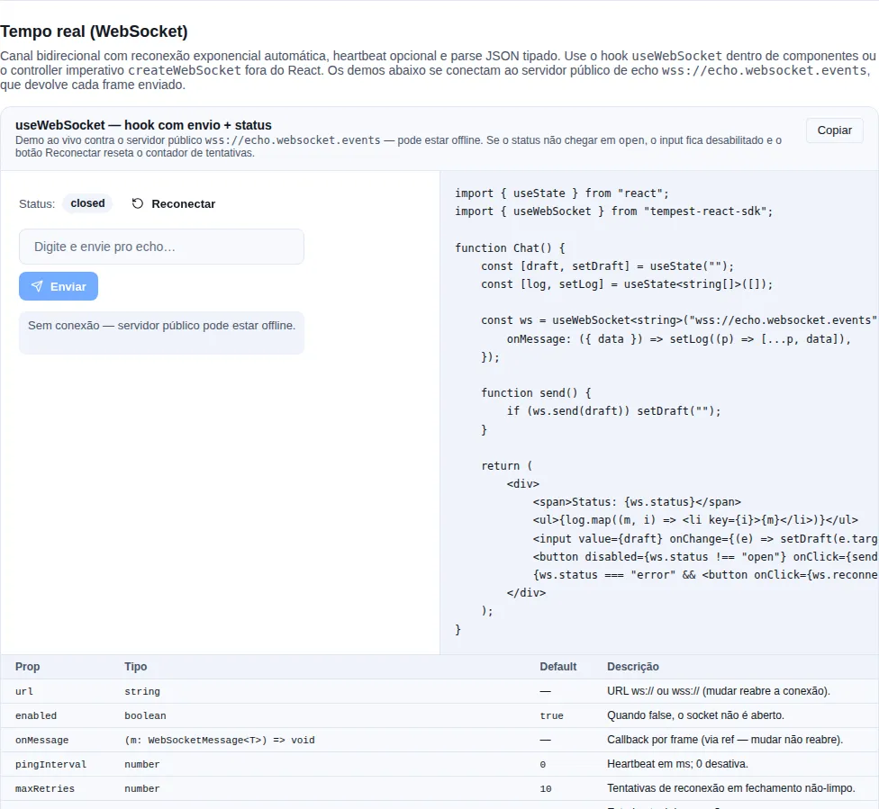

# Server-Sent Events

Wrapper sobre `EventSource` com reconnect exponencial, heartbeat opt-in e parsing JSON. Caso de uso original: stream de notificações (`NEW-ALO`, `PAYMENT-SUCCESS`, etc.) do alofans-frontend.

!!! info "SSE vs WebSocket — qual escolher?"
    SSE é unidirecional (servidor → cliente), roda sobre HTTP comum, reconecta sozinho e autentica por cookie sem cerimônia. Se o cliente **não precisa enviar** mensagens, SSE é mais simples e barato. Pra tráfego bidirecional (chat, colaboração), use [WebSocket](./websocket.md).

<!-- gallery:recipe-realtime -->
[](gallery.md)

*Seção `recipe-realtime` da [gallery](gallery.md) — rode localmente para interagir.*
<!-- /gallery -->

## Quando usar

- Push unilateral servidor → cliente, sem necessidade de envio do cliente.
- Reconexão automática barata.
- Autenticação por cookie (`withCredentials: true`).

## API imperativa — `createEventStream`

Use fora de React (services, inicialização) quando você gerencia o ciclo de vida na mão:

```ts
import { createEventStream } from "tempest-react-sdk";

interface StreamEvent {
  type: "NOTIFY" | "PAYMENT-SUCCESS";
  message: string;
}

const stream = createEventStream<StreamEvent>(
  `${import.meta.env.VITE_API_URL}/notifications/stream`,
  {
    withCredentials: true,
    namedEvents: ["notification", "payment"],
    heartbeatEvents: ["ping"],
    maxRetries: 10,
    onOpen: () => console.log("SSE aberto"),
    onMessage: ({ event, data, id }) => {
      if (event === "payment") handlePayment(data);
      else addNotification(data);
    },
    onStatusChange: (status) => console.log("SSE", status),
    onError: (err) => console.error(err),
  },
);

// Mais tarde, ao desmontar / deslogar:
stream.close();

// Forçar reconexão imediata (zera o contador de tentativas):
stream.reconnect();

// Ler o status atual:
console.log(stream.status);
```

Cada `onMessage` recebe `{ event, data, id, raw }`: `event` é o nome do evento SSE (default `"message"`), `data` já vem JSON-parsed (com fallback pra string crua), `id` é o `lastEventId` do servidor e `raw` é o `MessageEvent` original.

### Reconexão e heartbeat

```text
Backoff: 1s → 2s → 4s → 8s → ... (limitado em 30s), até maxRetries (default 10)
```

- A cada erro o stream fecha, agenda reconexão com backoff exponencial e emite status `"closed"`. Ao reabrir com sucesso, o contador zera.
- Esgotadas as `maxRetries`, o status vira `"error"` e o stream para de tentar.
- Eventos listados em `heartbeatEvents` (default `["ping"]`) **não** disparam `onMessage` — só mantêm o socket vivo.

!!! tip "Configure os `heartbeatEvents` conforme seu backend"
    Se o servidor envia keep-alives sob outro nome de evento (ex.: `"keepalive"`), liste-o em `heartbeatEvents` pra não poluir o `onMessage` com pings.

## Hook — `useEventStream`

Dentro de componentes, o hook amarra o ciclo de vida do stream ao componente — abre na montagem, fecha no unmount:

```tsx
import { useEventStream } from "tempest-react-sdk";

interface Notification {
  id: string;
  message: string;
}

export function NotificationListener({ user }: { user: { id: string } | null }) {
  const { status, lastMessage, reconnect } = useEventStream<Notification>(
    `${import.meta.env.VITE_API_URL}/notifications/stream`,
    {
      enabled: !!user, // só conecta quando o usuário existe
      withCredentials: true,
      onMessage: ({ data }) => addToInbox(data),
    },
  );

  return (
    <div>
      <span>Stream: {status}</span>
      {status === "error" && <button onClick={reconnect}>Reconectar</button>}
      {lastMessage && <p>Última: {lastMessage.data.message}</p>}
    </div>
  );
}
```

- `enabled: false` desconecta o stream (use enquanto espera o `user` carregar).
- Mudar a URL re-abre a conexão; mudar o `onMessage` **não** (callback via ref interna — sem reconexões à toa).
- `lastMessage` guarda a última mensagem recebida (heartbeats não contam).
- Cleanup automático no unmount.

!!! warning "`error` significa que esgotou as tentativas"
    Quando o status chega em `"error"`, o stream desistiu sozinho. Ofereça um botão chamando `reconnect()` (que zera o contador) em vez de esperar uma reconexão automática que não vem mais.

## Frame que não é JSON

Por padrão os dois transportes fazem `JSON.parse` do frame. Quando o parse falha —
o servidor devolveu HTML de erro, um `ping` em texto puro, um proxy injetou algo —
o SDK entrega a **string crua anunciada como o seu tipo**. É o comportamento
histórico e ele continua, porque mudá-lo quebraria quem depende dele; o que mudou
é que ele parou de ser silencioso.

```tsx
import { createEventStream } from "tempest-react-sdk";

interface Evento {
    id: string;
    tipo: string;
}

const socket = createEventStream<Evento>("https://api.exemplo.com/eventos", {
    onParseError: (erro, raw) => {
        console.error("frame ilegível, descartado:", raw.slice(0, 120), erro);
    },
    onMessage: ({ data }) => {
        console.log(data.id);
    },
});
```

Com `onParseError` registrado, o frame quebrado **não chega** em `onMessage` — quem
pediu para ouvir a falha não pediu para também receber o frame. Sem ele, o frame é
entregue como antes e um build de desenvolvimento avisa **uma vez** por transporte
no console.

!!! warning "Por que o padrão antigo é uma armadilha"
    `data` tipado como `Evento` sendo na verdade uma `string` não explode no
    parse — explode no primeiro `data.id`, longe dali, sem nada apontando para o
    frame que causou. O aviso e o `onParseError` existem para o erro aparecer onde
    ele acontece.

!!! tip "`parser` continua mandando"
    Passar `parser` desliga tudo isso: o resultado dele é entregue, porque
    decodificar texto, binário em base64 ou um protocolo próprio é justamente o
    propósito da opção. `onParseError` só entra em cena quando não há `parser`. A
    única coisa que ainda olha o resultado do `parser` é o
    [`schema`](#validar-o-frame-com-schema), quando você passa os dois.

## Validar o frame com `schema`

O tipo genérico (`createEventStream<Evento>`) é uma **promessa sobre o servidor
que o TypeScript não tem como cumprir**: ele apaga em runtime. Um frame sem o
campo `message` chega em `onMessage` anunciado como `Evento`, com
`message: undefined`, e o app grava isso no IndexedDB e renderiza uma
notificação vazia — sem nenhum erro no caminho.

Passe `schema` e validar deixa de ser trabalho do app:

```tsx
import { useEventStream } from "tempest-react-sdk";
import { z } from "zod";

const notificacaoSchema = z.object({
    id: z.string(),
    message: z.string(),
});

type Notificacao = z.infer<typeof notificacaoSchema>;

export function Notificacoes() {
    const { status } = useEventStream<Notificacao>("https://api.exemplo.com/notificacoes/stream", {
        namedEvents: ["notification"],
        schema: notificacaoSchema,
        onValidationError: (issues, raw) => {
            console.warn("frame fora do contrato, descartado:", issues, raw.slice(0, 120));
        },
        onMessage: ({ data }) => {
            console.log(data.message);
        },
    });

    return <p>Stream: {status}</p>;
}
```

O que a opção garante:

- **sem `schema`, nada muda** — o caminho de hoje continua igual, fallback e aviso inclusive;
- **o frame que não casa não é entregue**, a mesma regra que o `onParseError` já segue, e `onValidationError` recebe os `issues` (`path` pontilhado + `message`) mais o texto cru;
- **o valor entregue é a saída do schema**, então `z.coerce`, `.default()` e `.transform()` valem;
- **`parser` decodifica primeiro**, e o `schema` valida o que ele devolveu;
- **frame vazio é frame inválido**: `JSON.parse("")` lança, e com `schema` o texto cru vai para o schema, que o recusa — em vez de chegar como string vazia anunciada como o seu tipo.

!!! tip "zod, valibot, arktype — e o SDK não depende de nenhum"
    O `schema` aceita qualquer coisa com [Standard Schema](https://standardschema.dev)
    (`~standard`, que zod >= 3.24, valibot e arktype implementam) ou com
    `.safeParse` — a assinatura que todo usuário de zod já conhece, e que cobre
    o zod 3.23 anterior ao `~standard`. Nenhuma dessas libs entra como
    dependência: a validação é chamada pela interface.

!!! warning "A validação tem de ser síncrona"
    O frame é decodificado dentro do handler de `message` e entregue de lá, então
    não há onde `await`: um schema assíncrono entregaria os frames na ordem em que
    as validações resolvessem. Esse caso é **reportado** em `onValidationError`,
    não aguardado. Use `z.object(...)`, não `.refine(async ...)`.

!!! info "Declare o schema fora do componente"
    O `schema` é lido quando o stream abre. Um schema construído inline é um objeto
    novo a cada render — declare no módulo (ou memoize), e o que vale é o que existia
    na última abertura.

!!! check "Sinal que não depende do bundler"
    O aviso único de `onParseError` passa por `isDevBuild()`, que lê
    `process.env.NODE_ENV` — ou seja, depende de o bundler do app substituir essa
    expressão. O `onValidationError` é do app: ele dispara em qualquer build, e é
    dele que sai a métrica de "o backend mudou o contrato" sem depender de
    console de desenvolvimento.

## Status

`"idle" | "connecting" | "open" | "closed" | "error"`:

- `idle` — ainda não conectou (ou `enabled: false`).
- `connecting` — handshake em andamento.
- `open` — conectado e recebendo.
- `closed` — fechado, possivelmente aguardando reconexão.
- `error` — esgotou `maxRetries`, não tenta mais.

## Recap

- `createEventStream(url, options)` abre um SSE com reconnect exponencial; o controller expõe `close`, `reconnect` e `status`.
- `useEventStream(url, options)` é o wrapper React: amarra o ciclo de vida ao componente, expõe `status`/`lastMessage`/`reconnect` e respeita `enabled`.
- Heartbeats (default `["ping"]`) mantêm o socket vivo sem disparar `onMessage`.
- `schema` valida cada frame antes de entregar: o que não casa não chega em `onMessage`, e `onValidationError` diz por quê.
- Status `"error"` = esgotou tentativas; ofereça `reconnect()` ao usuário.

## Veja também

- [WebSocket](./websocket.md) — quando o cliente também precisa enviar
- [Offline](./offline.md) — persistir histórico recebido por SSE
- [Audio](./audio.md) — tocar um som ao receber certos eventos
- [HTTP](./http.md)
