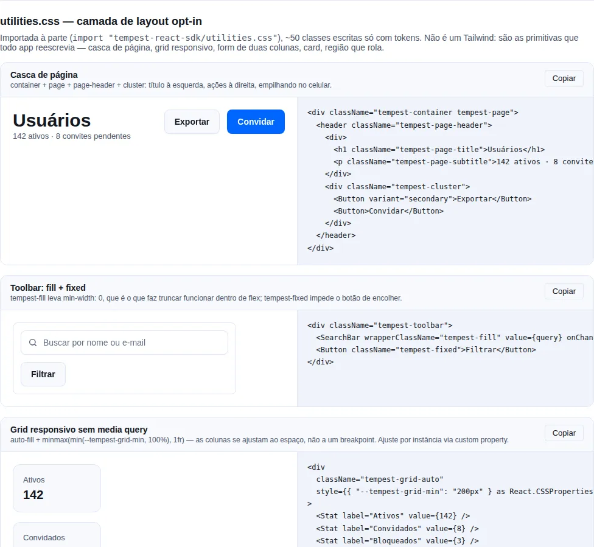

# Estilos & Design Tokens

O SDK expõe um conjunto de CSS Custom Properties (`--tempest-*`) que controlam toda a aparência dos componentes. Apps consumidores customizam o tema sobrescrevendo esses tokens — **não é necessário tocar em CSS Modules**.

```tsx
import "tempest-react-sdk/styles.css";
```

Pronto. Tudo o que está abaixo já está disponível na sua aplicação.

!!! tip "Sobrescreva tokens no `:root`"
    A única forma de tematizar é redefinir os tokens `--tempest-*` no seu próprio
    CSS. Coloque os overrides num `:root` (ou numa subárvore para escopo parcial)
    **depois** do import — nunca edite os CSS Modules do SDK.

!!! warning "Tokens são API pública"
    Os nomes `--tempest-*` fazem parte do contrato semver do SDK. Veja a
    [política de versionamento](#politica-de-versionamento-de-tokens) no fim da
    página antes de depender de um token específico.

<!-- gallery:utilities-css -->
[](gallery.md)

*Seção `utilities-css` da [gallery](gallery.md) — rode localmente para interagir.*
<!-- /gallery -->

## Sumário

- [Cor](#cor)
  - [Brand — primary tints](#brand-primary-tints)
  - [Neutros — gray scale](#neutros-gray-scale)
  - [Status — triplets (fg/bg/border/solid)](#status-triplets-fgbgbordersolid)
  - [Data viz — cores de série](#data-viz-cores-de-serie)
  - [Gerando a paleta com `createTheme`](#gerando-a-paleta-com-createtheme)
- [Tipografia](#tipografia)
- [Espaçamento](#espacamento)
- [Radius](#radius)
- [Elevação (shadow)](#elevacao-shadow)
- [Motion](#motion)
- [Focus ring](#focus-ring)
- [Z-index](#z-index)
- [Densidade — `data-tempest-density`](#densidade-data-tempest-density)
- [Tema dark — `data-tempest-theme`](#tema-dark-data-tempest-theme)
- [Componentes — variants disponíveis](#componentes-variants-disponiveis)
- [Camada utilitária opt-in — `utilities.css`](#camada-utilitaria-opt-in-utilitiescss)

---

## Importar menos CSS

`tempest-react-sdk/styles.css` traz os ~150 componentes. O JavaScript que você
importa é tree-shaken; **o CSS não** — então um app que usa treze componentes
baixa os outros cento e quarenta.

Para pagar só pelo que monta, importe a fundação e as folhas que quiser:

```ts
import "tempest-react-sdk/styles/core.css";
import "tempest-react-sdk/styles/Button.css";
import "tempest-react-sdk/styles/Modal.css";
```

Medido num app Vite real, os mesmos doze componentes montados dos dois jeitos:

| Import | raw | gzip |
| --- | --- | --- |
| `styles.css` | 236,71 kB | 35,38 kB |
| `core.css` + 7 grupos | 155,43 kB | 23,38 kB |
| `core.css` + 12 componentes | **38,94 kB** | **7,70 kB** |

!!! danger "`core.css` não é opcional"
    Ele carrega reset, tokens, tipografia, motion, densidade, responsividade e
    impressão — **nenhuma** folha de componente repete isso. Importar
    `Button.css` sem `core.css` dá um botão sem cor, sem espaçamento e sem fonte.

### Três granularidades

| Entrada | O que traz | Quando |
| --- | --- | --- |
| `styles.css` | tudo | uma linha só, e o peso não incomoda |
| `styles/core.css` | fundação, zero componente | sempre, com qualquer das outras |
| `styles/<Grupo>.css` | uma família inteira | você usa boa parte dela |
| `styles/<Componente>.css` | um componente | você quer o mínimo |

Grupos disponíveis: `actions`, `advanced`, `br`, `chat`, `data`, `editor`,
`feedback`, `forms`, `geo`, `icons`, `identity`, `layout`, `media`,
`navigation`, `overlay`, `utility`. O nome do arquivo de componente é o nome do
componente — `styles/DataTable.css`, `styles/Slider.css`.

!!! tip "Um componente por arquivo, com um caminho público só"
    O `exports` do pacote publica isso como **um** padrão de subpath
    (`"./styles/*.css"`), não como 125 entradas. Granularidade fina sem 125
    caminhos presos por semver.

!!! note "A divisão é exata, não uma poda"
    Cada classe é hasheada por módulo CSS (`tempest_[local]_[hash]`), e cada
    `dist/**/*.module.js` carrega o caminho de origem junto dos nomes que aquele
    módulo declara — atribuir uma regra a um componente é consulta, não palpite.
    O build **falha** se alguma regra nomear classes de dois módulos, que é o que
    tornaria a divisão um palpite.

## Cor

### Brand — primary tints

Scale `50` (mais claro) → `900` (mais escuro). Use `--tempest-primary` como cor canônica de ação.

```css
--tempest-primary-50: #eef4ff;
--tempest-primary-100: #d9e6ff;
--tempest-primary-500: #0066ff; /* === --tempest-primary */
--tempest-primary-700: #003d99;
--tempest-primary-900: #001f4d;
```

Aliases:

- `--tempest-primary` = primary-500
- `--tempest-primary-hover` = primary-600 no claro, primary-**600** no escuro (a rampa do escuro é invertida, então 600 é mais **claro** que 500)
- `--tempest-primary-active` = primary-700
- `--tempest-primary-soft` = primary-50 (fundo tinted para soft buttons/badges)
- `--tempest-primary-foreground` = `#ffffff` no claro, `#1f0606` no escuro (cor do texto **sobre** a primary)
- `--tempest-primary-on-soft` = primary-600 no claro, primary-700 no escuro (cor do texto/ícone **sobre** `--tempest-primary-soft`)

### Texto sobre preenchimento saturado: `*-on-solid`

- `--tempest-danger-on-solid` · `--tempest-info-on-solid` = `#ffffff` no claro, `#1f0606` no escuro
- `--tempest-success-on-solid` · `--tempest-warning-on-solid` = `#1f0606` nos **dois** temas

!!! danger "`#ffffff` sobre preenchimento de status não é seguro, e nunca foi"
    Medido contra os preenchimentos do **tema claro**, o default: branco sobre
    `--tempest-success-solid` dá **3,30:1** e sobre `--tempest-warning-solid`
    **3,19:1**. Verde médio e âmbar simplesmente não carregam texto branco — todo
    design system que os embarca põe texto escuro em cima. No tema escuro, onde os
    preenchimentos são mais claros, **todos** falham: `primary` 3,68:1, `danger`
    3,76:1, `info` 3,68:1, `success` 2,28:1, `warning` 2,15:1.

    Por isso a cor do texto é um token por status em vez de um `#ffffff` cravado. A
    tinta escura é um quase-preto puxado pro próprio matiz (`#1f0606`), não preto
    puro — lê como parte da amostra, não como um buraco nela.

!!! info "No escuro, `hover` e `active` vão pro **claro**"
    A escala de primary é invertida no tema escuro (300 é o passo mais escuro, 900 o
    mais claro), então pegar 400/300 no hover fazia o botão **escurecer** sob o
    ponteiro — o gesto do tema claro aplicado numa superfície escura. Também fazia o
    preenchimento fugir do próprio texto: nenhum foreground único passava 4,5:1
    contra `#3b82f6`, `#2563eb` e `#1a4399` ao mesmo tempo. Subir a rampa resolve os
    dois.

!!! check "Um teste segura isso"
    `src/styles/contrast.test.ts` calcula a razão de **cada** par (texto, fundo) que
    o SDK renderiza, direto do `colors.css`, nos dois temas. Se você redefinir a
    paleta e um par cair abaixo de 4,5:1, o teste falha — em vez de o problema
    aparecer no produto de alguém. O `axe` do jsdom **não** pega isso: ele desliga
    `color-contrast` porque não há paint.

!!! warning "Texto sobre `primary-soft` usa `primary-on-soft`, não `primary`"
    `--tempest-primary` sobre `--tempest-primary-soft` dá **4,38:1** no tema claro e
    **4,28:1** no escuro — o
    WCAG AA pede 4.5:1 pra texto. Por isso existe o `--tempest-primary-on-soft`
    (~6:1). Se você redefinir a paleta, redefina os dois: trocar só o
    `--tempest-primary` deixa os estados selecionados (Toggle, ToggleGroup,
    ListTile, Stepper, NavigationRail, FileUpload) fora de conformidade.

Para trocar a brand inteira:

```css
:root {
  --tempest-primary-500: #7c3aed; /* roxo */
  --tempest-primary-600: #6d28d9;
  --tempest-primary-700: #5b21b6;
  --tempest-primary-soft: #ede9fe;
}
```

### Neutros — gray scale

```css
--tempest-gray-50: #f8f9fb;
--tempest-gray-500: #667085;
--tempest-gray-900: #101828;
```

Aliases semânticos:

| Token                     | Uso                                  |
| ------------------------- | ------------------------------------ |
| `--tempest-bg`            | Background canvas                    |
| `--tempest-surface`       | Cards, headers, footers              |
| `--tempest-surface-2`     | Surface elevada (chip, button hover) |
| `--tempest-surface-3`     | Surface mais elevada                 |
| `--tempest-border`        | Borda padrão                         |
| `--tempest-border-strong` | Borda com mais contraste             |
| `--tempest-text`          | Texto principal                      |
| `--tempest-text-muted`    | Texto secundário                     |
| `--tempest-text-subtle`   | Texto terciário (placeholders)       |

### Status — triplets (fg/bg/border/solid)

Cada status (`success`, `warning`, `danger`, `info`) expõe 4 cores:

```css
--tempest-success-fg:     /* texto sobre bg soft */ --tempest-success-bg: /* fundo soft tinted */
  --tempest-success-border: /* borda outline */ --tempest-success-solid: /* fill solid */;
```

Atalhos:

- `--tempest-success` — cor principal (igual a `success` solid escuro no light, mais clara no dark).
- `--tempest-danger-hover` — variação para hover em danger solid.

Componentes que aceitam `appearance="soft|solid|outline"` (Badge, Alert, etc.) escolhem automaticamente a combinação certa.

### Data viz — cores de série

Oito cores categóricas em ordem cíclica, mais o cromado do gráfico:

| Token                        | Uso                                                   |
| ---------------------------- | ----------------------------------------------------- |
| `--tempest-chart-1` … `-8`   | Cores de série, aplicadas por índice (ciclam)          |
| `--tempest-chart-grid`       | Linhas de grid                                         |
| `--tempest-chart-axis`       | Linhas e rótulos de eixo                               |

As oito são espaçadas por **matiz** — são categóricas, não um ramp. Para escala sequencial ou divergente, use `--tempest-primary-*`.

O módulo `tempest-react-sdk/charts` lê esses tokens em runtime e re-resolve quando o tema vira, então sobrescrevê-los muda os gráficos sem tocar em prop nenhuma:

```css
:root {
  --tempest-chart-1: #0f766e;
  --tempest-chart-2: #f97316;
}
```

!!! warning "Não passe `var()` como cor de série"
    O recharts aplica cor como atributo de apresentação do SVG, e `var()` não é resolvido ali. É por isso que o SDK lê o token via `getComputedStyle` e entrega cor literal. Detalhes em [Charts › Cores e tema](charts.md#cores-e-tema).

### Gerando a paleta com `createTheme`

Escrever os ~30 valores de uma marca na mão (dez degraus × claro/escuro + aliases) é trabalhoso e fácil de errar no dark, onde o ramp **inverte**. `createTheme` deriva tudo de uma cor, em OKLCH:

```tsx
import { applyTheme, createTheme } from "tempest-react-sdk";

applyTheme(createTheme({ primary: "#7c3aed", radius: "lg" }));
```

Isso emite os mesmos tokens desta página — é açúcar sobre a API de token, não um segundo sistema de tema. Guia completo em [Tema › `createTheme`](theme.md#createtheme-a-marca-inteira-a-partir-de-uma-cor).

---


### Cores de sintaxe (`--tempest-code-*`)

`CodeBlock` pinta com dez tokens próprios: `comment` · `punctuation` · `string` · `number` · `keyword` · `literal` · `function` · `tag` · `attribute` · `property`.

!!! danger "Não reaproveite a rampa de chart pra texto"
    É tentador — as oito cores de série já existem e já são validadas. Mas elas são validadas pro piso de **marca**: 3:1, que é o que a WCAG pede pra um elemento gráfico. Cor de sintaxe é **texto**, e texto precisa de **4,5:1**. Medindo a rampa como texto no browser, uma palavra-chave em `--tempest-chart-1` deu **3,47:1** na superfície escura e uma string em `--tempest-chart-3` deu **2,03:1** na clara. As duas passam como marca e reprovam como texto.

Cada token de código foi resolvido em OKLCH: fixa a matiz, e busca a claridade mais alta (no dark, a mais baixa) que ainda passa AA contra **os dois fundos** em que o token pode cair — a superfície do bloco e a linha marcada, depois que o realce de 10% do primary compõe sobre ela. Resolver só contra a superfície não basta: o realce move o chão, e uma palavra-chave chegou a medir 4,17:1 em cima dele.

`src/styles/colors.contrast.test.ts` lê o `colors.css` e reafere cada token nos dois modos contra os dois fundos. Se você sobrescrever esses tokens no seu app, refaça essa conta.

## Tipografia

### Famílias

```css
--tempest-font-sans:    /* system stack */ --tempest-font-mono: /* monospace stack */
  --tempest-font-display: /* === sans, override pra heading */;
```

### Tamanhos

| Token                 | Pixels |
| --------------------- | ------ |
| `--tempest-text-2xs`  | 10px   |
| `--tempest-text-xs`   | 12px   |
| `--tempest-text-sm`   | 13px   |
| `--tempest-text-base` | 14px   |
| `--tempest-text-md`   | 15px   |
| `--tempest-text-lg`   | 16px   |
| `--tempest-text-xl`   | 18px   |
| `--tempest-text-2xl`  | 20px   |
| `--tempest-text-3xl`  | 24px   |
| `--tempest-text-4xl`  | 30px   |
| `--tempest-text-5xl`  | 36px   |
| `--tempest-text-6xl`  | 48px   |

### Line heights

`--tempest-leading-none|tight|snug|normal|relaxed|loose` (1.0 → 1.9).

### Pesos

`--tempest-weight-regular|medium|semibold|bold|extrabold` (400 → 800).

### Letter spacing

`--tempest-tracking-tight|normal|wide|wider|widest`.

---

## Espaçamento

Base 4px. Vai de 0 até 24 (96px).

```css
--tempest-space-0: 0 --tempest-space-1: 4px --tempest-space-2: 8px --tempest-space-3: 12px
  --tempest-space-4: 16px --tempest-space-5: 20px --tempest-space-6: 24px --tempest-space-7: 28px
  --tempest-space-8: 32px --tempest-space-10: 40px --tempest-space-12: 48px --tempest-space-16: 64px
  --tempest-space-20: 80px --tempest-space-24: 96px;
```

---

## Radius

```css
--tempest-radius-xs: 2px --tempest-radius-sm: 4px --tempest-radius-md: 8px /* controls padrão */
  --tempest-radius-lg: 12px /* cards padrão */ --tempest-radius-xl: 16px /* modais */
  --tempest-radius-2xl: 24px --tempest-radius-full: 9999px;
```

---

## Elevação (shadow)

```css
--tempest-shadow-xs:    /* hairline, controls em rest */ --tempest-shadow-sm: /* card padrão */
  --tempest-shadow-md: /* hover card, dropdown */ --tempest-shadow-lg: /* drawer, popover */
  --tempest-shadow-xl: /* modal */ --tempest-shadow-inner: /* tracks, inputs sunken */;
```

Shadows são automaticamente mais escuros no tema dark.

---

## Motion

### Duração

```css
--tempest-duration-instant: 0ms --tempest-duration-fast: 120ms /* hover, focus */
  --tempest-duration-base: 180ms /* enter/leave padrão */ --tempest-duration-slow: 280ms
  /* drawer, modal */ --tempest-duration-slower: 420ms;
```

### Easing

```css
--tempest-ease-linear
--tempest-ease-in
--tempest-ease-out
--tempest-ease-in-out
--tempest-ease-emphasized  /* enter animations */
--tempest-ease-bounce
```

### Composite shortcuts

```css
--tempest-transition-color:      /* color + bg + border, fast */ --tempest-transition-shadow:
  /* box-shadow, base */
  --tempest-transition-transform: /* transform, fast */
  --tempest-transition-base: /* tudo acima + opacity */;
```

### Reduced motion

`@media (prefers-reduced-motion: reduce)` zera todas as durações de tokens automaticamente. Componentes que usam keyframes pesados (modal, drawer, toast, tooltip, skeleton) também detectam e desabilitam animações específicas.

---

## O reset e o seu markup

`styles.css` traz um reset moderno, e uma das regras dele alcança elementos que
o SDK não desenha:

```css
img, svg, video, canvas, audio, iframe, embed, object {
    display: block;
    max-width: 100%;
}
```

Deixar mídia em bloco evita o espaço fantasma abaixo de uma imagem inline, que é
o motivo de a regra existir em todo reset moderno. Mas um `<button>` do
user-agent centraliza o conteúdo com `text-align: center`, e `text-align` só
alcança caixa inline — então um ícone sozinho num botão **seu** encostaria na
borda esquerda.

O SDK ships o contrapeso junto:

```css
:where(button, a, label, summary) > svg:only-child {
    margin-inline: auto;
}
```

!!! tip "Especificidade zero, de propósito"
    `:where()` não soma especificidade, então **qualquer** regra sua ganha desta
    sem `!important`. Centralizado é o default; outro alinhamento é uma
    declaração normal:

    ```css
    .toolbar button > svg { margin-inline: 0; }
    ```

!!! note "Só vale para ícone sozinho"
    `:only-child` mantém a regra restrita ao botão só-de-ícone. Ícone ao lado de
    rótulo já vive num flex seu, onde `margin: auto` empurraria o texto — esse
    caso continua com o alinhamento que você deu.

## Focus ring

```css
--tempest-focus-ring-color: rgba(0, 102, 255, 0.35) --tempest-focus-ring-width: 3px
  --tempest-focus-ring-offset: 2px;
```

`:focus-visible` global aplicado em `reset.css`. Componentes interactive (Button, Card interactive, Tabs, Pagination, etc.) reaplicam o ring com tokens.

Para customizar o ring por subárvore (ex: tema marca branca):

```css
.my-app {
  --tempest-focus-ring-color: rgba(124, 58, 237, 0.4);
}
```

---

## Z-index

```css
--tempest-z-base: 0 --tempest-z-raised: 10 --tempest-z-dropdown: 1000 --tempest-z-sticky: 1020
  --tempest-z-overlay: 1050 --tempest-z-modal: 1100 --tempest-z-popover: 1150
  --tempest-z-toast: 1200 --tempest-z-tooltip: 1300;
```

---

## Densidade — `data-tempest-density`

Atributo aplicado em qualquer elemento (geralmente `<html>` ou `<body>`) ajusta altura, padding, font-size e radius de todos os controles na subárvore.

```html
<html data-tempest-density="compact"></html>
```

Valores: `compact` | `comfortable` (padrão) | `spacious`.

Tokens controlados:

```css
--tempest-control-height-xs..xl
--tempest-control-padding-xs..xl
--tempest-control-font-xs..xl
--tempest-control-radius
--tempest-control-gap
```

Button, Input, Select, Textarea já lêem desses tokens — basta trocar o atributo no root e tudo redimensiona junto.

---

## Tema dark — `data-tempest-theme`

```html
<html data-tempest-theme="dark"></html>
```

Atributo aplicado em qualquer elemento ativa o tema escuro só naquela subárvore. Tokens de cor (primary scale, neutrals, status, focus ring, shadow) são todos sobrescritos.

Use junto com `<ThemeProvider>` (`tempest-react-sdk/theme`) para persistência + flash prevention.

!!! warning "Use `data-tempest-theme=\"dark\"`, não `class=\"dark\"`"
    O dark mode do SDK liga pelo atributo `data-tempest-theme`, nunca por uma
    classe `dark`. Isso permite escopar o tema escuro a uma subárvore específica
    em vez do documento inteiro — algo que a convenção de classe não faz.

---

## Componentes — variants disponíveis

### Button

```tsx
<Button variant="primary | secondary | danger | success | ghost | soft | outline | link" />
<Button size="xs | sm | md | lg | xl" />
<Button iconOnly aria-label="..." />
<Button pill />
<Button loading />
```

### Badge

```tsx
<Badge
  variant="neutral | primary | success | warning | danger | info"
  appearance="soft | solid | outline"
  size="sm | md | lg"
  shape="pill | square"
  dot
/>
```

### Alert

```tsx
<Alert variant="neutral | info | success | warning | danger"
       appearance="soft | solid | outline"
       title="..."
       description="..."
       icon={<Icon />}
       onClose={() => ...} />
```

### Card

```tsx
<Card elevation="flat | default | raised | elevated"
      interactive
      title="..."
      actions={...}
      footer={...} />
```

### Input

```tsx
<Input size="sm | md | lg" />
```

### Spinner

```tsx
<Spinner size="xs | sm | md | lg | xl" />
```

### Divider

```tsx
<Divider
  orientation="horizontal | vertical"
  variant="solid | dashed"
  label="OR"
  align="start | center | end"
/>
```

### Kbd

```tsx
<Kbd size="sm | md | lg">Ctrl</Kbd>
```

---

## Importando tokens em CSS-in-JS

!!! note "O prefixo `tempest_` evita colisão"
    As classes geradas pelos CSS Modules saem prefixadas com `tempest_`, então
    nunca colidem com o CSS do seu app nem com Tailwind/Stitches/Linaria rodando
    lado a lado. Você só interage com os tokens `--tempest-*` — não precisa
    conhecer os nomes de classe.

!!! warning "CSS Modules é a única estratégia de estilo do SDK"
    Os componentes são estilizados por CSS Modules + tokens `--tempest-*`, e ponto.
    Não existe modo "headless" nem hook de classe (`data-tempest-classname`) para
    Tailwind/Stitches/Linaria assumirem a estilização — e isso não está no
    backlog. Manter dois caminhos de estilo dobraria a superfície de cada
    componente e diluiria os tokens.

    O que você **pode** fazer: rodar seu utilitário favorito lado a lado no resto
    do app, ler os tokens do SDK com `var(--tempest-*)` e customizar o SDK
    sobrescrevendo os tokens no `:root`.

Como os tokens são CSS Custom Properties, qualquer solução (`styled-components`, `emotion`, `vanilla-extract`, Tailwind arbitrary values) lê com `var(--tempest-*)`:

```ts
import styled from "styled-components";

const Card = styled.div`
  background: var(--tempest-bg);
  border: 1px solid var(--tempest-border);
  border-radius: var(--tempest-radius-lg);
  padding: var(--tempest-space-5);
  box-shadow: var(--tempest-shadow-sm);
`;
```

Tailwind via `theme.extend.colors`:

```js
// tailwind.config.js
module.exports = {
  theme: {
    extend: {
      colors: {
        tempest: {
          primary: "var(--tempest-primary)",
          bg: "var(--tempest-bg)",
          border: "var(--tempest-border)",
        },
      },
    },
  },
};
```

---

## Camada utilitária opt-in — `utilities.css`

Os componentes são estilizados por CSS Modules, o que resolve o **dentro** deles. O que sobrava pro app era o **em volta**: casca de página, form de duas colunas, linha de ações, card, região que rola na horizontal. Todo app reescrevia esse CSS.

`utilities.css` é essa camada, escrita só com tokens `--tempest-*` — então ela acompanha o tema, incluindo o que sai do `createTheme` e o modo escuro.

```ts
// src/main.tsx
import "tempest-react-sdk/styles.css";
import "tempest-react-sdk/utilities.css"; // opt-in
```

!!! info "Por que opt-in e não dentro do `styles.css`"
    São ~50 nomes de classe **globais**. Um app que já tem o próprio sistema de layout não deve pagar por eles, e injetar classe global em página alheia sem pedir é falta de educação. Custo se você optar: **1.13 KB brotli**.

!!! warning "Isto não é um Tailwind, e não vira"
    A camada tem um punhado de primitivas de layout — não existe (nem entra no backlog) `p-4 mt-2 text-sm bg-blue-500` para cada valor possível. A [decisão consolidada](https://github.com/mauriciobenjamin700/tempest-react-sdk/blob/main/CLAUDE.md) segue valendo: **CSS Modules + tokens é a estratégia de estilo dos componentes**. Isso aqui é ferramenta pro código do *app*, não um segundo caminho de estilizar o SDK.

### Layout

| Classe                    | O que faz                                                                | Ajuste                                             |
| ------------------------- | ------------------------------------------------------------------------ | -------------------------------------------------- |
| `.tempest-container`      | Centraliza, limita a largura, aplica gutter respeitando a safe area       | `--tempest-container-width`, `--tempest-container-gutter` |
| `.tempest-stack`          | Fluxo vertical com um gap só                                             | `--tempest-stack-gap`                              |
| `.tempest-cluster`        | Grupo horizontal que **quebra linha** em vez de estourar                  | `--tempest-cluster-gap`                            |
| `.tempest-row`            | Grupo horizontal que não quebra (toolbar, campos inline)                  | `--tempest-row-gap`                                |
| `.tempest-center`         | Centraliza o filho nos dois eixos                                        | —                                                  |
| `.tempest-spread`         | Empurra primeiro e último filho pras pontas (título ↔ ações)              | `--tempest-row-gap`                                |
| `.tempest-grid-auto`      | Grid de cards responsivo **sem media query** (`auto-fill` + `minmax`)     | `--tempest-grid-min`, `--tempest-grid-gap`         |
| `.tempest-sidebar-layout` | Sidebar + conteúdo; vira uma coluna abaixo de 768px                      | `--tempest-sidebar-width`, `--tempest-sidebar-gap` |
| `.tempest-form-grid`      | Form de 2 colunas que colapsa abaixo de 640px                            | `--tempest-form-columns`, `--tempest-form-gap`     |
| `.tempest-form-span`      | Campo que ocupa a linha inteira do grid de form                          | —                                                  |
| `.tempest-fill`           | Ocupa o espaço restante do flex (com `min-width: 0`, então truncar funciona) | —                                               |
| `.tempest-fixed`          | Nunca encolhe abaixo do conteúdo (botão de ícone ao lado de campo)        | —                                                  |

### Espaçamento, texto, superfície, scroll

| Grupo         | Classes                                                                                      |
| ------------- | -------------------------------------------------------------------------------------------- |
| Gap           | `.tempest-gap-{0,1,2,3,4,5,6,8,10,12}`                                                       |
| Padding       | `.tempest-pad-{0,2,3,4,6,8}`, `.tempest-pad-block`, `.tempest-pad-inline`                     |
| Texto         | `.tempest-truncate`, `.tempest-clamp-{2,3,4}`, `.tempest-text-{muted,subtle}`, `.tempest-text-{xs,sm,base,lg,xl,2xl}`, `.tempest-weight-{medium,semibold,bold}`, `.tempest-numeric` |
| Superfície    | `.tempest-card`, `.tempest-panel`, `.tempest-inset`, `.tempest-divider`                       |
| Scroll        | `.tempest-scroll-x`, `.tempest-scroll-y`                                                      |
| Mídia         | `.tempest-aspect-video`, `.tempest-aspect-square`                                             |
| Diversos      | `.tempest-visually-hidden`, `.tempest-no-select`, `.tempest-busy`                             |

!!! tip "`.tempest-numeric` existe por um motivo específico"
    `font-variant-numeric: tabular-nums` impede que uma coluna de números **dance** quando o valor muda (dígitos proporcionais têm larguras diferentes). Use em tabela de valores, contador ao vivo e `Stat`.

!!! tip "`.tempest-scroll-x` em volta de tabela larga"
    Sem ele, uma tabela larga faz a **página** rolar na horizontal — que é o defeito de layout mais comum em mobile. Com ele, a rolagem fica contida na região.

### Página inteira, montada

```tsx
export function UsersPage() {
  return (
    <div className="tempest-container tempest-page">
      <header className="tempest-page-header">
        <div>
          <h1 className="tempest-page-title">Usuários</h1>
          <p className="tempest-page-subtitle">142 ativos · 8 convites pendentes</p>
        </div>
        <div className="tempest-cluster">
          <Button variant="secondary">Exportar</Button>
          <Button>Convidar</Button>
        </div>
      </header>

      <div className="tempest-toolbar tempest-toolbar-sticky">
        <SearchBar className="tempest-fill" placeholder="Buscar por nome ou e-mail" />
        <Select className="tempest-fixed" options={papeis} />
      </div>

      <div className="tempest-card tempest-scroll-x">
        <DataTable data={usuarios} columns={colunas} />
      </div>

      <div className="tempest-grid-auto" style={{ "--tempest-grid-min": "220px" } as React.CSSProperties}>
        <Stat label="Ativos" value={142} />
        <Stat label="Convidados" value={8} />
        <Stat label="Bloqueados" value={3} />
      </div>
    </div>
  );
}
```

Note o `style={{ "--tempest-grid-min": "220px" }}`: os hooks locais são custom properties, então dá pra ajustar **por instância** sem escrever CSS nem criar variante de classe.

### Dashboard de widgets

A camada tem uma fatia própria pra isso, e o que a torna diferente de um grid comum é
que as colunas reagem à largura do **contêiner**, não do viewport.

```tsx
import "tempest-react-sdk/utilities.css";

export function OperacaoPage() {
  return (
    <div className="tempest-container tempest-page">
      <header className="tempest-page-header">
        <div>
          <h1 className="tempest-page-title">Operação</h1>
          <p className="tempest-page-subtitle">Últimos 30 dias</p>
        </div>
        <Badge variant="success">no ar</Badge>
      </header>

      {/* Fileira de tiles: cabe quantos couberem, sem span nenhum */}
      <div className="tempest-stat-row">
        <div className="tempest-widget-frame">
          <span className="tempest-text-muted tempest-text-xs">Pedidos</span>
          <strong className="tempest-text-2xl tempest-numeric">1.284</strong>
        </div>
        {/* … */}
      </div>

      {/* Grid de 12 colunas com spans por container query */}
      <div className="tempest-dashboard">
        <section className="tempest-widget tempest-widget-two-thirds">
          <div className="tempest-widget-frame">
            <div className="tempest-widget-header">
              <h2 className="tempest-widget-title">Vendas por dia</h2>
              <span className="tempest-text-subtle tempest-text-xs">12 dias</span>
            </div>
            <div className="tempest-widget-body">
              <Sparkline data={vendas} width={320} height={72} label="Vendas por dia" />
            </div>
          </div>
        </section>

        <section className="tempest-widget tempest-widget-third">{/* … */}</section>
        <section className="tempest-widget tempest-widget-half">{/* … */}</section>
        <section className="tempest-widget tempest-widget-half">{/* … */}</section>
      </div>
    </div>
  );
}
```

| Classe | O que faz |
| --- | --- |
| `.tempest-dashboard` | grid de 12 colunas **e** container de tamanho (`container-type: inline-size`) |
| `.tempest-widget` | largura total por default — o estado em que um widget passa a maior parte da vida |
| `.tempest-widget-half` · `-third` · `-quarter` · `-two-thirds` | spans que abrem em **40rem e 64rem de contêiner** |
| `.tempest-widget-tall` | `grid-row: span 2` — gráfico ao lado de uma pilha de tiles |
| `.tempest-stat-row` | fileira de tiles com `auto-fit`, sem span. Ajuste com `--tempest-stat-min` |
| `.tempest-widget-frame` · `-header` · `-title` · `-body` | a moldura do widget |

Hooks: `--tempest-dashboard-columns` (12), `--tempest-dashboard-gap`, `--tempest-widget-padding`, `--tempest-stat-min`.

!!! check "As colunas são do contêiner, não do viewport — e isso é o ponto"
    Medido no browser, com **viewport de 1360px**: o mesmo dashboard dentro de um painel de 440px renderiza em **coluna única**; com 660px, o `-third` e o `-half` vão pra mesma linha (`span 6`); com 1060px, `-two-thirds` fica em `span 8` ao lado do `-third` em `span 4`, e as duas metades dividem a linha seguinte.

    Media query daria o span de desktop pro painel de 440px, e cada widget viraria uma coluna de texto amassado. É o mesmo motivo pelo qual o `Masonry` observa o contêiner.

!!! warning "`width: 100%` no `.tempest-page` não é decoração"
    Solto dentro de um flex **row** — painel de preview, split view — um contêiner de página é um flex item e dimensiona pelo conteúdo: o dashboard colapsou pra ~200px enquanto o pai tinha 500. Só o browser mostra isso; em fluxo normal a declaração não muda nada. Achado exatamente assim, montando esta receita na gallery.

!!! info "`min-height: 0` no `-body` é o que deixa um gráfico caber"
    Filho de grid tem `min-height: auto` por default, então um canvas que reporta altura intrínseca grande empurra a linha em vez de caber nela — e o dashboard ganha uma barra de rolagem que ninguém pediu.

!!! tip "Widget redimensionável pelo usuário é outra coisa"
    Arrastar a borda de um widget briga com a grade: os tracks vêm do grid, e uma largura em pixel vinda do drag não pode conviver com isso. Se você precisa disso, use o [`Resizable`](./components/advanced-layout.md#resizable) numa área livre, ou guarde o span escolhido por widget e aplique a classe correspondente — que é a versão que sobrevive a um reload e cabe na URL.

### Form de duas colunas

```tsx
<Form className="tempest-form-grid" onSubmit={form.handleSubmit(onSubmit)}>
  <FormField name="nome" label="Nome" required><Input /></FormField>
  <FormField name="email" label="E-mail" required><Input type="email" /></FormField>
  <FormField name="cpf" label="CPF"><CPFInput /></FormField>
  <FormField name="telefone" label="Telefone"><PhoneInput /></FormField>

  <FormField name="observacoes" label="Observações" className="tempest-form-span">
    <Textarea rows={4} />
  </FormField>

  <FormActions align="end" className="tempest-form-span">
    <Button type="submit">Salvar</Button>
  </FormActions>
</Form>
```

Uma coluna no celular, duas a partir de 640px, e `.tempest-form-span` para o que ocupa a linha inteira.

---

## Responsive — mobile / tablet / desktop

### Breakpoints

| Token              | Pixels | Device esperado |
| ------------------ | ------ | --------------- |
| `--tempest-bp-xs`  | 480px  | Phones pequenos |
| `--tempest-bp-sm`  | 640px  | Phones large    |
| `--tempest-bp-md`  | 768px  | Tablets         |
| `--tempest-bp-lg`  | 1024px | Laptops         |
| `--tempest-bp-xl`  | 1280px | Desktop padrão  |
| `--tempest-bp-2xl` | 1536px | Ultrawide       |

Convenção `useBreakpoint()` / `<Show>` / `<Hide>`:

- **mobile** = `< md` (`< 768px`)
- **tablet** = `md..lg-1` (`768..1023px`)
- **desktop** = `>= lg` (`>= 1024px`)

### `useBreakpoint()` hook

```tsx
import { useBreakpoint } from "tempest-react-sdk";

const bp = useBreakpoint();
bp.current; // "xs" | "sm" | "md" | "lg" | "xl" | "2xl"
bp.width; // pixels (0 no SSR)
bp.above("md"); // boolean
bp.below("lg"); // boolean
bp.isMobile; // < md
bp.isTablet; // md..lg-1
bp.isDesktop; // >= lg
```

SSR-safe — no servidor retorna `xs` / `width: 0`, atualiza no mount.

### `<Show>` / `<Hide>` components

```tsx
<Show above="md">Desktop nav</Show>
<Show below="md">Mobile menu</Show>
<Show only="xl">Wide-only banner</Show>
<Show only={["md", "lg"]}>Tablet + laptop</Show>

<Hide above="lg">Hide on desktop</Hide>
```

### Utility classes (CSS-only, sem JS)

```html
<div class="tempest-hide-mobile">desktop apenas</div>
<div class="tempest-show-only-mobile">mobile apenas</div>
<div class="tempest-hide-tablet">esconde em tablets</div>
<div class="tempest-show-only-touch">touch devices apenas</div>
<div class="tempest-hide-print">não imprimir</div>
```

### Componentes responsive — props

#### `<Container>` — padding responsivo automático

`space-4` mobile / `space-6` tablet / `space-8` desktop.

#### `<Stack>` / `<Grid>` — props aceitam objeto

```tsx
<Stack direction={{ mobile: "vertical", desktop: "horizontal" }} gap={{ mobile: 2, desktop: 4 }} />

<Grid columns={{ mobile: 1, tablet: 2, desktop: 3 }} gap={4} />
```

#### `<Modal>` — fullscreen / fullscreenOnMobile / 2xl / 3xl

```tsx
<Modal size="2xl" />                  // 1280px
<Modal size="3xl" />                  // 1440px
<Modal fullscreen />                  // fill viewport
<Modal fullscreenOnMobile />          // auto-fullscreen < 640px
```

Padding interno e radius já reduzem abaixo de 640px.

#### `<Drawer>` — mobilePlacement + showHandle

```tsx
// desktop: right drawer; mobile: bottom-sheet
<Drawer placement="right" mobilePlacement="bottom" showHandle />
```

#### `<Table>` — priority + stackOnMobile

```tsx
<Table
  stackOnMobile
  columns={[
    { key: "name", header: "Nome" }, // sempre visível
    { key: "email", header: "E-mail", priority: "tablet" }, // some < 768px
    { key: "role", header: "Cargo", priority: "desktop" }, // some < 1024px
  ]}
  data={users}
/>
```

#### `<ToastProvider>` — position

```tsx
<ToastProvider position="top-right" />        // padrão
<ToastProvider position="bottom-center" />    // mobile-friendly default
```

Em telas `< 480px`, container estica `left: 0; right: 0` automaticamente.

### Touch targets

- `data-tempest-density="touch"` — força altura mínima 44px em todos os controles.
- `@media (pointer: coarse)` aplica auto-bump no `xs`/`sm`/`md` quando o usuário está em dispositivo touch (a menos que `density="compact"` explícito).
- `Button iconOnly` size `xs`/`sm` ganha hit-slop invisível de 8px em todos os lados em pointer coarse.

### Safe-area (iOS notch / Android gestures)

Tokens disponíveis:

```css
--tempest-safe-area-top
--tempest-safe-area-right
--tempest-safe-area-bottom
--tempest-safe-area-left
```

Toast, Modal overlay padding e Drawer já consomem automaticamente. Lembre-se de incluir no HTML:

```html
<meta name="viewport" content="width=device-width, initial-scale=1, viewport-fit=cover" />
```

### Dynamic viewport (iOS Safari address bar bug)

Modal e Drawer usam `dvh` com fallback `vh`. Apps que precisam de altura cheia podem fazer o mesmo:

```css
.app {
  min-height: 100vh;
  min-height: 100dvh;
}
```

### Fluid type

Para headings que escalam com viewport:

```css
.hero-title {
  font-size: var(--tempest-text-fluid-5xl); /* clamp(32px, 24px + 4vw, 72px) */
}
```

Tokens: `--tempest-text-fluid-sm|base|lg|xl|2xl|3xl|4xl|5xl|6xl`.

### Hover-only effects

Efeitos `transform` / `box-shadow` em hover (Card interactive lift, Button elevation) ficam atrás de `@media (hover: hover) and (pointer: fine)` — não disparam em tap mobile.

### Print

Tudo embutido em `print.css`:

- Modal, Drawer, Toast, Tooltip ocultos.
- Background grayscale, cards `page-break-inside: avoid`.
- Links recebem `(href)` ao lado.

Classe `tempest-hide-print` para esconder elementos próprios.

---

## Política de versionamento de tokens

Tokens são **API pública**. Mudanças quebram apps consumidores. Política:

- **Adições** (novos tokens) — bump minor.
- **Renames / removals** — bump major. Tokens antigos ficam como alias deprecated por pelo menos 1 minor antes de remoção.
- **Mudanças de valor** que afetam aparência visivelmente (cor primária, radius padrão, font stack) — bump minor + nota no changelog.

---

## Resumo

- Importe `tempest-react-sdk/styles.css` uma vez; tematize sobrescrevendo tokens
  `--tempest-*` no `:root` (ou numa subárvore).
- Dark mode liga por `data-tempest-theme="dark"`; densidade por
  `data-tempest-density` — ambos escopáveis a qualquer subárvore.
- As classes de CSS Module saem prefixadas com `tempest_`, sem colisão com o CSS
  do app nem com Tailwind/Stitches/Linaria.
- Tokens são **API pública** sob semver — adições bumpam minor, renames/removals
  bumpam major.
