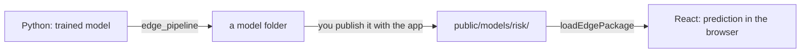

# Tabular (scikit-learn in the browser)

A scikit-learn model answering **in the browser** — no inference server, and
the user's data never leaves the device. The `tempest-react-sdk/tabular`
subpath runs the `.onnx` file that
[`tempest-fastapi-sdk`](https://mauriciobenjamin700.github.io/tempest-fastapi-sdk/en/recipes/modelops/)
exports: same file, same contract, on the client instead of on a device.

```tsx
import { TabularPredictor } from "tempest-react-sdk/tabular";

const predictor = await TabularPredictor.create("/models/classifier.onnx");
const { labels, probabilities } = await predictor.predict([[5.1, 3.5, 1.4, 0.2]]);

console.log(labels[0], probabilities[0]);
```

```text
0 [0.6662, 0.1061, 0.2277]
```

## First things first: where the model comes from

This module **trains nothing**. It runs a model that was already trained —
in Python, by your data team — and exported to a format a browser can read.

The whole path has two halves:



**Half 1 — Python, once per model version** (runs as is; the dataset ships
with scikit-learn):

```python
from sklearn.datasets import load_iris
from sklearn.ensemble import RandomForestClassifier

from tempest_fastapi_sdk.modelops import edge_pipeline

data = load_iris()
model = RandomForestClassifier(n_estimators=20, max_depth=4, random_state=0)
model.fit(data.data, data.target)

edge_pipeline(
    model,
    data.data,
    "public/models/flowers",    # inside your React app
    name="flowers",
    labels=data.target,
    feature_names=list(data.feature_names),
    compact=True,               # the version that needs no runtime
)
```

That writes a **folder**, not a file:

```text
public/models/flowers/
├── flowers.onnx       the model as ONNX
├── flowers.tmc        the same model, compact format
├── baseline.json      reference for the training data
└── manifest.json      what is in here
```

**Half 2 — React, in the browser.** If the package carries the compact
form (`compact=True` above), there is **nothing to install** beyond the SDK
itself:

```tsx
import { loadEdgePackage } from "tempest-react-sdk/tabular";

const pkg = await loadEdgePackage("/models/flowers/");

console.log(pkg.featureNames);
// ["sepal length (cm)", "sepal width (cm)", "petal length (cm)", "petal width (cm)"]

const { labels, probabilities } = await pkg.predictor.predict([[5.1, 3.5, 1.4, 0.2]]);
console.log(labels[0], probabilities[0]);
```

!!! tip "The column order travels with it"
    `pkg.featureNames` tells you which order the values go in. Use it to
    build the row from your form — a model fed the right numbers **in the
    wrong order** answers confidently and wrongly, and no runtime check
    catches that.

!!! info "I only have a loose `.onnx`, no folder"
    That works too — `TabularPredictor.create("/models/classifier.onnx")`.
    You lose what the manifest carries (column order, class names, version),
    and you now need `onnxruntime-web`.

## Three routes, you choose

Running scikit-learn in the browser has a cost, and it is not the model.
Measured:

| | Size |
| --- | --- |
| `onnxruntime-web` runtime (`.wasm`) | **25.6 MB** — 6.0 MB gzipped |
| A 12-tree forest as ONNX | 20 KB |
| The same in compact format | 9.6 KB |
| The compact reader (SDK code) | **1.49 KB** brotli |

The model is noise. **The runtime is the bill.** Hence three routes, and
which one is right depends on what your app already loads.

### A — No runtime (`CompactPredictor`)

```python
# Python, at build time
package = edge_pipeline(model, X_train, "dist/risk", labels=y_train, compact=True)
```

```tsx
import { loadEdgePackage } from "tempest-react-sdk/tabular";

const pkg = await loadEdgePackage("/models/risk/");
console.log(pkg.runtime); // "compact"
```

No WebAssembly, no `onnxruntime-web`, no peer dependency. A linear model is
a dot product; a tree is a chain of comparisons — that fits in 1.49 KB of
JavaScript (measured, brotli).

**Covers** linear models (logistic, linear, ridge, SGD, linear SVC), trees,
forests, extra-trees, their regressors, and `StandardScaler`/`MinMaxScaler`
inside a Pipeline.
**Does not cover** gradient boosting, MLPs, or any transform that is not
`(x - offset) / scale` — and it **refuses to export** rather than
approximate.

!!! check "Verified against scikit-learn, not against my idea of the format"
    The exporter compares the written file with the estimator's own
    predictions and **refuses to write** when they disagree. On the browser
    side, tests run against fixtures generated by Python alongside
    scikit-learn's outputs — 7 families, identical labels and probabilities
    matching to 5 decimals.

    The file is **data, never code**: no generated JavaScript, no `eval`,
    nothing a strict CSP forbids.

!!! check "Works with `onnxruntime-web` not installed at all"
    Verified by packing the SDK and installing it into an empty project with
    no peer: the barrel imports, `CompactPredictor` predicts, and it matches
    scikit-learn. Asking for the ONNX route there fails with an error naming
    `npm install onnxruntime-web` and pointing at the compact alternative.

    This broke in 0.33.0 — the assets module imported the runtime at the top,
    so an app that only wanted route A had to install 25.6 MB of wasm anyway.
    Fixed in 0.33.1: the runtime is behind a dynamic `import()`, reached only
    when an ONNX model is loaded. A guard test pins it.

### B — Minimal runtime (`.ort` plus your own build)

```tsx
import { configureOrtAssets, TabularPredictor } from "tempest-react-sdk/tabular";

configureOrtAssets("/ort-minimal/");
const predictor = await TabularPredictor.create("/models/classifier.ort");
```

`tempest-fastapi-sdk`'s `export_onnx_to_ort` writes the `.ort` **and** the
`required_operators.config`, which is what lets you compile an ONNX Runtime
containing only your model's operators. Point `configureOrtAssets` at that
build.

!!! warning "`.ort` on its own does not save anything — it grows"
    Measured: 526 B of ONNX becomes **2,360 B** of `.ort`; a 266 KB forest
    becomes 650 KB. `.ort` is a loading format, not a compression one.

    What shrinks is the **custom-compiled runtime**, and that costs building
    ORT from source (Docker, hours) and maintaining that build. The stock
    bundle reads `.ort` fine — tested — so the route can be prepared before
    the build exists.

### C — Stock ONNX (`TabularPredictor`)

```tsx
const pkg = await loadEdgePackage("/models/risk/", { runtime: "onnx" });
```

The usual path. **Zero marginal cost if the app already loads
`onnxruntime-web`** — for instance because it uses
`tempest-react-sdk/vision`. Then the runtime is already paid for and ONNX
covers every estimator.

### Measured in the browser, against the built `dist`

Chromium, the same 10-tree forest served through both routes, with the wasm
served locally — that is, **no network latency**, the floor:

| | Compact | ONNX |
| --- | --- | --- |
| Load until it can answer | **6.0 ms** | 579.6 ms |
| Predict (batch of 3 rows) | **0.0035 ms** | 0.0575 ms |
| `.wasm` downloaded | **none** | 25.6 MB |

Loading is 97x faster and predicting 16x — the reader allocates no tensors
and never crosses the WebAssembly boundary, which at this model size is the
entire cost.

The `e2e/tabular.spec.ts` suite proves all three in a real Chromium: that the
compact route **fetches no `.wasm` at all** (reading the page's own resource
timeline), that it answers exactly as scikit-learn across 7 families, and
that it keeps answering with `fetch` taken away.

### How to decide

| Situation | Route |
| --- | --- |
| PWA with only a tabular model | **A** — 6 MB gzipped less |
| App already runs vision/ONNX | **C** — zero marginal cost, full coverage |
| Needs gradient boosting, MLP, a complex pipeline | **C** |
| Needs broad coverage **and** a small binary | **B** |
| Model changes weekly and the team only ships `.pkl` | Any — the pipeline is the same |

!!! tip "The choice does not leak into your code"
    Both routes return the same object: `predict(rows)` with `labels`,
    `probabilities`, `numRows` and `ms` — **including the label's type**
    (`0`, not `"0"`, where scikit-learn used an integer). Switching routes
    is changing an option, not rewriting the screen.

    ```tsx
    const pkg = await loadEdgePackage("/models/risk/", { runtime: "auto" });
    ```

    `"auto"` takes the compact form when the package has one, and ONNX when
    it does not. Asking for `"compact"` on a package that carries none is an
    error saying so — rather than silently downloading 25 MB of WebAssembly.

## When this is worth it

| Worth it | Not worth it |
| --- | --- |
| A score that must appear while the user types | A model that changes hourly |
| Sensitive data that should not leave the device | A large (deep learning) model |
| An app that has to work without a network | A prediction needing data only the server has |

Measured in Chromium: **0.2 ms** for a 3-row batch on a logistic regression,
about 0.05 ms per row on a 10-tree forest. The win is not compute — it is the
network round trip that stops existing.

!!! tip "What you save is the trip, not the computation"
    Measured on the server side with `tempest-fastapi-sdk`: a single-row
    prediction costs **0.0075 ms of inference inside 1.22 ms of HTTP** —
    160x more transport than model, and that with an in-process client, no
    network at all.

    In the browser that 1.22 ms simply does not exist: the same prediction
    lands in about 0.05 ms, locally. So the criteria in the table above are
    about **model freshness and size**, not about compute speed — the speed
    you already won by removing the network.

## In a React component

The hook owns what every component gets wrong the same way: the async load,
cancellation when the component unmounts mid-flight, and releasing the
session.

```tsx
import { useState } from "react";
import { useTabularPredictor } from "tempest-react-sdk/tabular";

function RiskWidget() {
  const { predict, isReady, error } = useTabularPredictor("/models/risk-v3.onnx");
  const [score, setScore] = useState<number | null>(null);

  async function onScore(features: number[]) {
    const { probabilities } = await predict([features]);
    setScore(probabilities[0]?.[1] ?? null);
  }

  if (error) return <p>Model unavailable: {error.message}</p>;

  return (
    <button disabled={!isReady} onClick={() => onScore([1, 2, 3, 4])}>
      {isReady ? "Score" : "Loading model..."}
    </button>
  );
}
```

!!! tip "Version the filename"
    `classifier-v3.onnx`, not `classifier.onnx`. A browser cache has no way
    to know the content changed, and a stale model served from cache is the
    kind of bug nobody connects to last week's deploy. With a package
    (`loadEdgePackage`) this is already handled: the manifest's `version` is
    derived from the content.

!!! danger "Exporting with raw `skl2onnx` breaks in the browser"
    Measured: skl2onnx's default leaves **ZipMap** enabled, which makes the
    probability output a *sequence of maps*. ONNX Runtime Web refuses
    non-tensor values — `Reading data from non-tensor typed value is not
    supported` — and the prediction dies at runtime, not at build time.

    Use `export_sklearn_to_onnx` (or `edge_pipeline`), which disables
    ZipMap. If the `.onnx` came from somewhere else, this module detects the
    case and the error tells you what to do instead of repeating the
    runtime's message.

## Edge package: the manifest that comes from Python

On the Python side, `edge_pipeline` publishes a **directory**, not a file:

```text
dist/risk/
├── risk.onnx          the graph
├── risk.onnx.gz       the same, at ~10% of the size
├── baseline.json      drift reference
└── manifest.json      the contract
```

Serve that directory as static assets and the browser reads the same
contract:

```tsx
import { loadEdgePackage } from "tempest-react-sdk/tabular";

const pkg = await loadEdgePackage("/models/risk/");

console.log(pkg.featureNames); // ["age", "income", "tenure", "score"]
console.log(pkg.classes);      // ["0", "1", "2"]

const { probabilities } = await pkg.predictor.predict([[41, 5200, 3, 0.82]]);
console.log(pkg.explain(probabilities[0]!));
```

```text
[{ name: "2", score: 0.7484 }, { name: "0", score: 0.1564 }, { name: "1", score: 0.0952 }]
```

!!! danger "The column order is the field that saves you"
    A model fed the right features **in the wrong order** answers
    confidently and wrongly. No runtime check catches it — the tensor has
    the right width, the numbers are plausible, and the answer is garbage.

    `featureNames` comes from training, recorded by `edge_pipeline`. Use it
    to build the row from your form, instead of trusting that the `<form>`
    order still matches the `DataFrame` from six months ago.

!!! info "A model that started life as a `.pkl`"
    If the package was produced by `edge_pipeline_from_pickle`, the manifest
    carries `source` — the name, SHA-256 and the scikit-learn version that
    converted it:

    ```tsx
    const manifest = await fetchEdgeManifest("/models/risk/");
    console.log(manifest.source?.file, manifest.source?.sha256.slice(0, 12));
    ```

    The `.pkl` itself does **not** travel to the browser, and that is not a
    limitation: a pickle is a Python program, not data. What travels is the
    ONNX plus a stamp naming the file that produced it — enough to trace a
    model running in a tab back to the pipeline, six months later.

### Check the version without downloading the model

```tsx
import { fetchEdgeManifest } from "tempest-react-sdk/tabular";

const manifest = await fetchEdgeManifest("/models/risk/");
if (manifest.version !== localStorage.getItem("risk-version")) {
  // a new model was published — worth downloading
}
```

The manifest is a few hundred bytes. Its `version` is derived from the
content, so republishing identical bytes does **not** look like a new
version.

!!! info "Compatibility is explicit"
    `schema_version` is checked. A package written by an SDK newer than this
    reader understands is **refused**, with instructions to upgrade —
    reading it anyway would risk misreading precisely the column-order
    field. Unknown fields, by contrast, are ignored: a compatible addition
    breaks nothing.

## Installation

`onnxruntime-web` is an **optional peer dependency**: only users of this
subpath install it.

```bash
npm install onnxruntime-web
```

!!! danger "Import the default entry, never `onnxruntime-web/webgpu`"
    Measured in Chromium: the WebGPU build loads a WebAssembly binary
    **without the `ai.onnx.ml` domain**, and the session never even opens —
    `No Op registered for TreeEnsembleClassifier`.

    scikit-learn models are made of those operators
    (`TreeEnsembleClassifier`, `LinearClassifier`, `Scaler`), so there is no
    speed to chase on the GPU: the `wasm` backend is the only one that
    implements them, and it is this module's default. When the error does
    happen it becomes an `UnsupportedGraphError` naming the import to change.

## Actually offline

**Two** things have to be on the device, and forgetting the second one is
the classic mistake.

### The model

Cached in Cache Storage on the first visit:

```tsx
import { fetchModelBytes, isModelCached } from "tempest-react-sdk/tabular";

const bytes = await fetchModelBytes("/models/classifier-v3.onnx");
const predictor = await TabularPredictor.create(bytes);

console.log(await isModelCached("/models/classifier-v3.onnx")); // true
```

Cache-first, not network-first: a model file is immutable for a given
version, so revalidating on every load spends a round trip to learn nothing.
Publish a new version under a new URL (or pass `revalidate: true`).

The hook does this for you when the source is a URL — `cache: false` opts
out.

### The runtime

```tsx
import { configureOrtAssets, ortAssetUrls } from "tempest-react-sdk/tabular";

configureOrtAssets("/ort/");
```

!!! warning "ONNX Runtime Web does not embed its WebAssembly — not even in the `.bundle` builds"
    Measured: serving the app without the `.wasm` files alongside it, session
    creation fails with `Aborted(both async and sync fetching of the wasm
    failed)` — a message that never names the missing file. In Chromium the
    file requested was `ort-wasm-simd-threaded.jsep.wasm`.

    Copy the binaries from `node_modules/onnxruntime-web/dist/` into your
    public directory at build time, and precache them:

    ```ts
    import { installPrecache } from "tempest-react-sdk/sw";
    import { ortAssetUrls } from "tempest-react-sdk/tabular";

    installPrecache([...ortAssetUrls("/ort/"), "/index.html"]);
    ```

    Which binary is fetched depends on the browser's threading and SIMD
    support, so an app that must work everywhere ships all of them —
    `ORT_WASM_ASSETS` has the list.

## Details the module handles for you

!!! info "int64 labels arrive as `bigint`"
    ONNX Runtime Web returns the label tensor as a `BigInt64Array`. A caller
    comparing `label === 1` silently gets `false`, and `JSON.stringify`
    throws. The module converts to `number` — a class index never approaches
    `Number.MAX_SAFE_INTEGER`.

!!! info "Which output is which"
    A classifier returns `label` + `probabilities`; a regressor returns a
    single `variable`. Indexing by position works until the day you ship the
    other kind. `predictor.info` says what was loaded:

    ```ts
    console.log(predictor.info);
    // { inputName: "input", numFeatures: 4, isClassifier: true, ... }
    ```

!!! info "A row of the wrong width fails before the runtime"
    A `FeatureShapeError` naming the expectation (`the model expects 4
    features per row, got 2`) instead of an opaque WebAssembly error. Ragged
    batches too — the error says **which row**.

## Errors

They all extend `TabularError`, so the whole family can be caught at once.
`name` is a literal string: minifiers rename classes, and a real build
reported `error.name === "t"` before that was fixed.

| Error | When |
| --- | --- |
| `UnsupportedGraphError` | Runtime without the `ai.onnx.ml` operators (WebGPU build) |
| `ModelLoadError` | The bytes did not become a session |
| `ModelFetchError` | Offline with nothing cached — a deployment problem, not a model problem |
| `FeatureShapeError` | Empty, ragged, or wrong-width batch |
| `InferenceError` | It ran but the output is unreadable (ZipMap export) |

## API

| Symbol | What it is |
| --- | --- |
| `TabularPredictor.create(source, options?)` | Loads a model (URL or bytes) |
| `predictor.predict(rows)` | Predicts a batch; returns `labels`, `probabilities`, `ms` |
| `predictor.info` | Input, feature count, outputs, providers in use |
| `predictor.dispose()` | Releases the session |
| `useTabularPredictor(source, options?)` | Hook with `status`/`isReady`/`predict`/`reload` |
| `loadEdgePackage(directoryUrl, options?)` | Loads a package published by `edge_pipeline` |
| `fetchEdgeManifest(directoryUrl)` | The manifest alone — version, columns, classes |
| `fetchModelBytes(url, options?)` | Bytes from cache, network as fallback |
| `isModelCached(url)` / `cacheModelBytes` / `clearModelCache` | Cache management |
| `configureOrtAssets(basePath)` / `ortAssetUrls(basePath)` / `ORT_WASM_ASSETS` | Runtime assets |
| `DEFAULT_TABULAR_PROVIDERS` | `["wasm"]`, for the reason above |

## Recap

- Export with `export_sklearn_to_onnx` — a ZipMap export does not run in a browser.
- Import `onnxruntime-web`, **not** the `/webgpu` subpath.
- Serve the `.onnx` as a versioned asset; the cache handles the rest.
- Copy and precache the `.wasm` files, or "offline" only works online.
- Use the hook in a component; the class directly in a worker or outside React.
