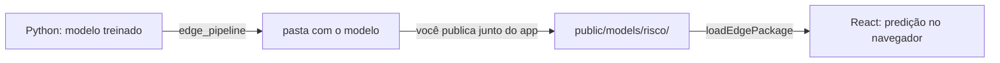

# Tabular (scikit-learn no navegador)

Modelo de scikit-learn respondendo **no navegador**, sem servidor de
inferência e sem enviar os dados do usuário pra lugar nenhum. O subpath
`tempest-react-sdk/tabular` roda o `.onnx` que o
[`tempest-fastapi-sdk`](https://mauriciobenjamin700.github.io/tempest-fastapi-sdk/recipes/modelops/)
exporta — mesmo arquivo, mesmo contrato, no cliente em vez de num
dispositivo.

```tsx
import { TabularPredictor } from "tempest-react-sdk/tabular";

const predictor = await TabularPredictor.create("/models/classifier.onnx");
const { labels, probabilities } = await predictor.predict([[5.1, 3.5, 1.4, 0.2]]);

console.log(labels[0], probabilities[0]);
```

```text
0 [0.6662, 0.1061, 0.2277]
```

## Antes de tudo: de onde vem o modelo

Este módulo **não treina** nada. Ele executa um modelo que já foi treinado —
em Python, pela sua equipe de dados — e exportado para um formato que o
navegador consegue ler.

O caminho inteiro tem duas metades:



**Metade 1 — Python, uma vez por versão do modelo** (roda como está, o
dataset vem no scikit-learn):

```python
from sklearn.datasets import load_iris
from sklearn.ensemble import RandomForestClassifier

from tempest_fastapi_sdk.modelops import edge_pipeline

data = load_iris()
model = RandomForestClassifier(n_estimators=20, max_depth=4, random_state=0)
model.fit(data.data, data.target)

edge_pipeline(
    model,
    data.data,
    "public/models/flores",     # dentro do seu app React
    name="flores",
    labels=data.target,
    feature_names=list(data.feature_names),
    compact=True,               # a versão que dispensa runtime
)
```

Isso escreve uma **pasta**, não um arquivo:

```text
public/models/flores/
├── flores.onnx        o modelo em ONNX
├── flores.tmc         o mesmo modelo, formato compacto
├── baseline.json      referência dos dados de treino
└── manifest.json      o que tem aí dentro
```

**Metade 2 — React, no navegador.** Se o pacote tem a versão compacta
(`compact=True` acima), **não há nada a instalar** além do próprio SDK:

```tsx
import { loadEdgePackage } from "tempest-react-sdk/tabular";

const pkg = await loadEdgePackage("/models/flores/");

console.log(pkg.featureNames);
// ["sepal length (cm)", "sepal width (cm)", "petal length (cm)", "petal width (cm)"]

const { labels, probabilities } = await pkg.predictor.predict([[5.1, 3.5, 1.4, 0.2]]);
console.log(labels[0], probabilities[0]);
```

!!! tip "A ordem das colunas vem junto"
    `pkg.featureNames` diz em que ordem os valores têm que entrar. Use isso
    para montar a linha a partir do seu formulário — modelo alimentado com
    os números certos **na ordem errada** responde com confiança e errado, e
    não existe checagem em runtime que pegue.

!!! info "Só tenho um `.onnx` solto, sem pasta"
    Funciona também — `TabularPredictor.create("/models/classifier.onnx")`.
    Você perde o que o manifesto carrega (ordem das colunas, nomes das
    classes, versão), e passa a precisar do `onnxruntime-web`.

## Três rotas, você escolhe

Rodar sklearn no navegador tem um custo que não é o modelo. Medido:

| | Tamanho |
| --- | --- |
| Runtime `onnxruntime-web` (`.wasm`) | **25,6 MB** — 6,0 MB gzipped |
| Floresta de 12 árvores em ONNX | 20 KB |
| A mesma em formato compacto | 9,6 KB |
| O leitor compacto (código do SDK) | **1,49 KB** brotli |

O modelo é ruído. **O runtime é a conta.** Daí existirem três caminhos, e o
certo depender do que o seu app já carrega.

### A — Sem runtime (`CompactPredictor`)

```python
# Python, no build
package = edge_pipeline(model, X_train, "dist/risk", labels=y_train, compact=True)
```

```tsx
import { loadEdgePackage } from "tempest-react-sdk/tabular";

const pkg = await loadEdgePackage("/models/risk/");
console.log(pkg.runtime); // "compact"
```

Sem WebAssembly, sem `onnxruntime-web`, sem peer dependency. Modelo linear é
produto escalar; árvore é comparação encadeada — isso cabe em 1,49 KB de
JavaScript (medido, brotli).

**Cobre** linear (logística, linear, ridge, SGD, SVC linear), árvore,
floresta, extra-trees, regressores dos mesmos, e `StandardScaler`/
`MinMaxScaler` dentro de Pipeline.
**Não cobre** gradient boosting, MLP, ou qualquer transformação que não seja
`(x - offset) / escala` — e **recusa exportar** em vez de aproximar.

!!! check "Verificado contra o scikit-learn, não contra a minha ideia do formato"
    O exportador compara o arquivo escrito com as predições do próprio
    estimador e **se recusa a gravar** se discordarem. Do lado do navegador,
    os testes rodam contra fixtures geradas pelo Python junto das saídas do
    scikit-learn — 7 famílias, rótulos idênticos e probabilidades batendo em
    5 casas.

    O arquivo é **dado, nunca código**: nada de JavaScript gerado, nada de
    `eval`, nada que uma CSP estrita proíba.

!!! check "Sem `onnxruntime-web` instalado, mesmo assim funciona"
    Verificado empacotando o SDK e instalando num projeto vazio, sem o peer:
    o barril importa, `CompactPredictor` prediz e bate com o scikit-learn.
    Pedir a rota ONNX ali dá erro nomeando o `npm install onnxruntime-web` e
    a alternativa compacta.

    Isso quebrou na v0.33.0 — o módulo de assets importava o runtime no topo,
    então quem só queria a rota A precisava instalar 25,6 MB de wasm assim
    mesmo. Corrigido na v0.33.1: o runtime entra por `import()` dinâmico, só
    quando um modelo ONNX é carregado. Tem guard de teste travando isso.

### B — Runtime mínimo (`.ort` + build próprio)

```tsx
import { configureOrtAssets, TabularPredictor } from "tempest-react-sdk/tabular";

configureOrtAssets("/ort-minimal/");
const predictor = await TabularPredictor.create("/models/classifier.ort");
```

O `export_onnx_to_ort` do `tempest-fastapi-sdk` gera o `.ort` **e** o
`required_operators.config`, que é o que permite compilar um ONNX Runtime só
com os operadores do seu modelo. Aponte `configureOrtAssets` para esse build.

!!! warning "O `.ort` sozinho não economiza — ele aumenta"
    Medido: 526 B de ONNX viram **2.360 B** de `.ort`; uma floresta de 266 KB
    vira 650 KB. O `.ort` é formato de carregamento, não de compressão.

    Quem encolhe é o **runtime compilado sob medida**, e isso custa
    compilar o ORT do zero (Docker, horas) e manter esse build. O bundle
    padrão lê `.ort` normalmente — testado — então dá para preparar a rota
    antes de ter o build.

### C — ONNX padrão (`TabularPredictor`)

```tsx
const pkg = await loadEdgePackage("/models/risk/", { runtime: "onnx" });
```

O caminho de sempre. **Custo marginal zero se o app já carrega
`onnxruntime-web`** — por exemplo se usa `tempest-react-sdk/vision`. Aí o
runtime já foi pago e o ONNX cobre qualquer estimador.

### Medido no navegador, com o `dist` construído

Chromium, mesma floresta de 10 árvores servida nas duas rotas, wasm servido
localmente (ou seja, **sem latência de rede** — o piso):

| | Compacta | ONNX |
| --- | --- | --- |
| Carga até poder responder | **6,0 ms** | 579,6 ms |
| Predição (lote de 3 linhas) | **0,0035 ms** | 0,0575 ms |
| `.wasm` baixado | **nenhum** | 25,6 MB |

A carga é 97x mais rápida, e a predição 16x — o leitor não aloca tensor nem
atravessa a fronteira do WebAssembly, que nesse tamanho de modelo é o custo
inteiro.

A suíte `e2e/tabular.spec.ts` prova as três coisas em Chromium de verdade:
que a rota compacta **não busca nenhum `.wasm`** (lendo a timeline de recursos
da própria página), que ela responde igual ao scikit-learn nas 7 famílias, e
que continua respondendo com o `fetch` derrubado.

### Como decidir

| Situação | Rota |
| --- | --- |
| PWA só com modelo tabular | **A** — 6 MB gzipped a menos |
| App já roda visão/ONNX | **C** — custo marginal zero, cobertura total |
| Precisa de gradient boosting, MLP, pipeline complexo | **C** |
| Precisa de cobertura ampla **e** binário pequeno | **B** |
| Modelo muda toda semana e o time só publica `.pkl` | Qualquer uma — a esteira é a mesma |

!!! tip "A escolha não vaza para o seu código"
    As duas rotas devolvem o mesmo objeto: `predict(rows)` com `labels`,
    `probabilities`, `numRows` e `ms` — **inclusive o tipo do rótulo**
    (`0`, não `"0"`, quando o scikit-learn usou inteiro). Trocar de rota é
    mudar uma opção, não reescrever a tela.

    ```tsx
    const pkg = await loadEdgePackage("/models/risk/", { runtime: "auto" });
    ```

    `"auto"` pega a compacta quando o pacote tem, e ONNX quando não tem.
    Pedir `"compact"` num pacote que não a carrega dá erro dizendo isso —
    em vez de baixar 25 MB de WebAssembly em silêncio.

## Quando isso vale a pena

| Vale | Não vale |
| --- | --- |
| Score que precisa aparecer enquanto o usuário digita | Modelo que muda de hora em hora |
| Dado sensível que não deve sair do dispositivo | Modelo grande (deep learning pesado) |
| App que precisa funcionar sem rede | Predição que exige dados que só o servidor tem |

Latência medida no Chromium: **0,2 ms** para um lote de 3 linhas numa
regressão logística; ~0,05 ms por linha numa floresta de 10 árvores. A conta
não é sobre computação — é sobre a viagem de rede que deixa de existir.

!!! tip "O que você economiza é a viagem, não o cálculo"
    Medido no lado do servidor com o `tempest-fastapi-sdk`: uma predição de
    uma linha custa **0,0075 ms de inferência dentro de 1,22 ms de HTTP** —
    160x mais transporte que modelo, e isso com cliente em processo, sem
    rede.

    No navegador esse 1,22 ms simplesmente não existe: a mesma predição sai
    em ~0,05 ms, local. Por isso o critério da tabela acima é sobre
    **frescor do modelo e tamanho**, não sobre velocidade de cálculo — a
    velocidade você já ganhou tirando a rede do caminho.

## Num componente React

O hook cuida do que todo componente erra igual: carregamento assíncrono,
cancelamento quando o componente desmonta antes de terminar, e liberação da
sessão.

```tsx
import { useState } from "react";
import { useTabularPredictor } from "tempest-react-sdk/tabular";

function RiskWidget() {
  const { predict, isReady, error } = useTabularPredictor("/models/risk-v3.onnx");
  const [score, setScore] = useState<number | null>(null);

  async function onScore(features: number[]) {
    const { probabilities } = await predict([features]);
    setScore(probabilities[0]?.[1] ?? null);
  }

  if (error) return <p>Modelo indisponível: {error.message}</p>;

  return (
    <button disabled={!isReady} onClick={() => onScore([1, 2, 3, 4])}>
      {isReady ? "Calcular score" : "Carregando modelo..."}
    </button>
  );
}
```

!!! tip "Versione o nome do arquivo"
    `classifier-v3.onnx`, não `classifier.onnx`. O cache do navegador não
    tem como saber que o conteúdo mudou, e um modelo velho servido do cache
    é o tipo de bug que ninguém liga ao deploy da semana passada. Com o
    pacote (`loadEdgePackage`) isso vem resolvido: a `version` do manifesto
    é derivada do conteúdo.

!!! danger "Exportar com `skl2onnx` na mão quebra no navegador"
    Medido: o default do `skl2onnx` deixa o **ZipMap** ligado, e a saída de
    probabilidade vira uma *sequência de mapas*. O ONNX Runtime Web recusa
    valores que não são tensor — `Reading data from non-tensor typed value is
    not supported` — e a predição morre em runtime, não no build.

    Use `export_sklearn_to_onnx` (ou `edge_pipeline`), que desliga o ZipMap.
    Se o `.onnx` veio de outra origem, o módulo detecta e o erro diz o que
    fazer em vez de repetir a mensagem do runtime.

## Pacote de borda: o manifesto que vem do Python

Do lado do Python, `edge_pipeline` publica um **diretório**, não um arquivo:

```text
dist/risk/
├── risk.onnx          o grafo
├── risk.onnx.gz       o mesmo, ~10% do tamanho
├── baseline.json      referência de deriva
└── manifest.json      o contrato
```

Sirva esse diretório como asset estático e o navegador lê o mesmo contrato:

```tsx
import { loadEdgePackage } from "tempest-react-sdk/tabular";

const pkg = await loadEdgePackage("/models/risk/");

console.log(pkg.featureNames); // ["age", "income", "tenure", "score"]
console.log(pkg.classes);      // ["0", "1", "2"]

const { probabilities } = await pkg.predictor.predict([[41, 5200, 3, 0.82]]);
console.log(pkg.explain(probabilities[0]!));
```

```text
[{ name: "2", score: 0.7484 }, { name: "0", score: 0.1564 }, { name: "1", score: 0.0952 }]
```

!!! danger "A ordem das colunas é o campo que salva você"
    Modelo alimentado com as features certas **na ordem errada** responde com
    confiança e errado. Não existe checagem em runtime que pegue isso — o
    tensor tem a largura certa, os números são plausíveis, e a resposta é
    lixo.

    `featureNames` vem do treino, gravado pelo `edge_pipeline`. Use-o para
    montar a linha a partir do seu formulário, em vez de confiar que a ordem
    do `<form>` bate com a do `DataFrame` de seis meses atrás.

!!! info "Modelo que nasceu de um `.pkl`"
    Se o pacote foi gerado por `edge_pipeline_from_pickle`, o manifesto traz
    `source` — nome, SHA-256 e a versão do scikit-learn que converteu:

    ```tsx
    const manifest = await fetchEdgeManifest("/models/risk/");
    console.log(manifest.source?.file, manifest.source?.sha256.slice(0, 12));
    ```

    O `.pkl` **não** viaja para o navegador, e não é limitação: pickle é
    programa Python, não dado. O que viaja é o ONNX mais o carimbo de qual
    arquivo o produziu — o suficiente para rastrear um modelo rodando numa
    aba de volta até a esteira, seis meses depois.

### Checar versão sem baixar o modelo

```tsx
import { fetchEdgeManifest } from "tempest-react-sdk/tabular";

const manifest = await fetchEdgeManifest("/models/risk/");
if (manifest.version !== localStorage.getItem("risk-version")) {
  // modelo novo publicado — vale baixar
}
```

O manifesto tem algumas centenas de bytes. A `version` é derivada do
conteúdo, então republicar os mesmos bytes **não** parece versão nova.

!!! info "Compatibilidade é explícita"
    O `schema_version` é conferido. Pacote escrito por um SDK mais novo do
    que este leitor entende é **recusado**, com a instrução de atualizar —
    ler assim mesmo arriscaria interpretar errado justamente o campo de
    ordem das colunas. Campos desconhecidos, ao contrário, são ignorados: um
    acréscimo compatível não quebra nada.

## Instalação

`onnxruntime-web` é **peer dependency opcional**: só quem usa esse subpath
instala.

```bash
npm install onnxruntime-web
```

!!! danger "Importe o pacote padrão, nunca `onnxruntime-web/webgpu`"
    Medido no Chromium: o build WebGPU carrega um binário WebAssembly **sem o
    domínio `ai.onnx.ml`**, e a sessão nem chega a abrir —
    `No Op registered for TreeEnsembleClassifier`.

    Modelos de scikit-learn são feitos desses operadores
    (`TreeEnsembleClassifier`, `LinearClassifier`, `Scaler`), então não há
    velocidade sobrando pra buscar na GPU: o backend `wasm` é o único que os
    implementa, e é o default do módulo. Quando o erro acontece, ele vira
    `UnsupportedGraphError` com a instrução de trocar o import.

## Offline de verdade

São **duas** coisas que precisam estar no dispositivo, e esquecer a segunda é
o erro clássico.

### O modelo

Fica em Cache Storage na primeira visita:

```tsx
import { fetchModelBytes, isModelCached } from "tempest-react-sdk/tabular";

const bytes = await fetchModelBytes("/models/classifier-v3.onnx");
const predictor = await TabularPredictor.create(bytes);

console.log(await isModelCached("/models/classifier-v3.onnx")); // true
```

Cache-first, não network-first: um arquivo de modelo é imutável para uma dada
versão, então revalidar a cada carga gasta uma ida à rede pra não aprender
nada. Publique versão nova sob URL nova (ou passe `revalidate: true`).

O hook faz isso sozinho quando a fonte é uma URL — `cache: false` desliga.

### O runtime

```tsx
import { configureOrtAssets, ortAssetUrls } from "tempest-react-sdk/tabular";

configureOrtAssets("/ort/");
```

!!! warning "O ONNX Runtime Web não embute o WebAssembly — nem nos builds `.bundle`"
    Medido: servindo o app sem os `.wasm` ao lado, a criação da sessão falha
    com `Aborted(both async and sync fetching of the wasm failed)` — uma
    mensagem que não diz qual arquivo faltou. No Chromium o arquivo buscado
    foi `ort-wasm-simd-threaded.jsep.wasm`.

    Copie os binários de `node_modules/onnxruntime-web/dist/` para o seu
    diretório público no build, e precache junto:

    ```ts
    import { installPrecache } from "tempest-react-sdk/sw";
    import { ortAssetUrls } from "tempest-react-sdk/tabular";

    installPrecache([...ortAssetUrls("/ort/"), "/index.html"]);
    ```

    Qual binário é buscado depende do suporte a threads e SIMD do navegador,
    então um app que precisa funcionar em todo lugar leva todos —
    `ORT_WASM_ASSETS` tem a lista.

## Detalhes que o módulo resolve por você

!!! info "Rótulo int64 chega como `bigint`"
    O ONNX Runtime Web devolve o tensor de rótulo como `BigInt64Array`. Quem
    compara `label === 1` recebe `false` em silêncio, e `JSON.stringify`
    lança. O módulo converte para `number` — índice de classe nunca chega
    perto de `Number.MAX_SAFE_INTEGER`.

!!! info "Qual saída é qual"
    Classificador devolve `label` + `probabilities`; regressor devolve um
    único `variable`. Indexar por posição funciona até o dia em que você
    publica o outro tipo. `predictor.info` diz o que foi carregado:

    ```ts
    console.log(predictor.info);
    // { inputName: "input", numFeatures: 4, isClassifier: true, ... }
    ```

!!! info "Linha de largura errada falha antes do runtime"
    `FeatureShapeError` nomeando a expectativa (`o modelo espera 4 features
    por linha, recebeu 2`), em vez de um erro opaco vindo do WebAssembly.
    Lote irregular também: o erro diz **qual linha**.

## Erros

Todos herdam de `TabularError`, então dá pra pegar a família inteira. O
`name` é literal — o minificador renomeia classes, e um build real reportava
`error.name === "t"` antes disso ser corrigido.

| Erro | Quando |
| --- | --- |
| `UnsupportedGraphError` | Runtime sem os operadores `ai.onnx.ml` (build WebGPU) |
| `ModelLoadError` | Bytes não viraram sessão |
| `ModelFetchError` | Offline e nada em cache — problema de deploy, não de modelo |
| `FeatureShapeError` | Lote vazio, irregular ou da largura errada |
| `InferenceError` | Rodou mas a saída não é legível (export com ZipMap) |

## API

| Símbolo | O que é |
| --- | --- |
| `TabularPredictor.create(source, options?)` | Carrega um modelo (URL ou bytes) |
| `predictor.predict(rows)` | Prediz um lote; devolve `labels`, `probabilities`, `ms` |
| `predictor.info` | Entrada, nº de features, saídas, providers em uso |
| `predictor.dispose()` | Libera a sessão |
| `useTabularPredictor(source, options?)` | Hook com `status`/`isReady`/`predict`/`reload` |
| `loadEdgePackage(directoryUrl, options?)` | Carrega um pacote publicado pelo `edge_pipeline` |
| `fetchEdgeManifest(directoryUrl)` | Só o manifesto — versão, colunas, classes |
| `fetchModelBytes(url, options?)` | Bytes do cache, com rede como fallback |
| `isModelCached(url)` / `cacheModelBytes` / `clearModelCache` | Gestão do cache |
| `configureOrtAssets(basePath)` / `ortAssetUrls(basePath)` / `ORT_WASM_ASSETS` | Assets do runtime |
| `DEFAULT_TABULAR_PROVIDERS` | `["wasm"]`, pelo motivo acima |

## Recapitulando

- Exporte com `export_sklearn_to_onnx` — ZipMap ligado não roda no navegador.
- Importe `onnxruntime-web`, **não** o subpath `/webgpu`.
- Sirva o `.onnx` como asset versionado; o cache cuida do resto.
- Copie e precache os `.wasm`, senão "offline" só funciona online.
- Use o hook em componente; a classe direto em worker ou fora do React.
