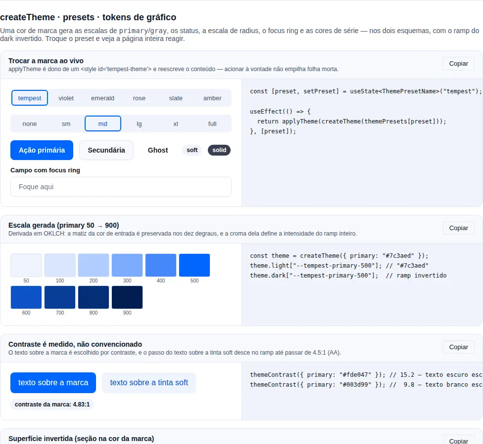

# Tema (dark / light)

`ThemeProvider` decide o tema efetivo e escreve `data-tempest-theme="dark"` (ou `"light"`) em `<html>`. Os tokens CSS `--tempest-*` reagem a esse atributo, então **trocar o tema é trocar um atributo** — nenhum componente precisa saber que o tema mudou. Veja os tokens em [`src/styles/colors.css`](https://github.com/mauriciobenjamin700/tempest-react-sdk/blob/main/src/styles/colors.css).

!!! info "Por que um atributo, e não `class=\"dark\"`?"
    Usar `data-tempest-theme` (em vez da convenção `class="dark"`) evita colisão com classes do app e permite escopo parcial: você pode aplicar um tema diferente em uma subárvore (preview, portal, docs) sem afetar o resto da página. É a única forma de tema suportada pelo SDK.

## Setup

Envolva a árvore com `ThemeProvider`. O modo padrão é `"system"`, que segue a preferência do sistema operacional:

```tsx
import { StrictMode } from "react";
import { createRoot } from "react-dom/client";
import { ThemeProvider } from "tempest-react-sdk";
import "tempest-react-sdk/styles.css";
import { App } from "./App";

createRoot(document.getElementById("root")!).render(
  <StrictMode>
    <ThemeProvider defaultTheme="system">
      <App />
    </ThemeProvider>
  </StrictMode>,
);
```

Modos disponíveis: `"light"`, `"dark"`, `"system"`. Em `"system"`, o provider escuta `prefers-color-scheme` e reage a mudanças do SO em tempo real. A escolha do usuário é persistida em `localStorage["tempest-theme"]` (desative com `storageKey={null}`).

## Toggle de tema

`useTheme()` lê e muta o tema. Um botão completo de alternância:

```tsx
import { useTheme } from "tempest-react-sdk";

export function ThemeToggle() {
  const { theme, resolvedTheme, setTheme, toggle } = useTheme();

  return (
    <div>
      <button onClick={toggle}>{resolvedTheme === "dark" ? "🌙 Escuro" : "☀️ Claro"}</button>

      {/* ou controle os três modos explicitamente */}
      <select value={theme} onChange={(event) => setTheme(event.target.value as typeof theme)}>
        <option value="light">Claro</option>
        <option value="dark">Escuro</option>
        <option value="system">Sistema</option>
      </select>
    </div>
  );
}
```

O que cada campo significa:

- `theme`: a **preferência crua** do usuário — `"light"`, `"dark"` ou `"system"`.
- `resolvedTheme`: o tema **efetivamente aplicado** — sempre `"light"` ou `"dark"` (nunca `"system"`).
- `setTheme(next)`: grava a preferência (e persiste).
- `toggle()`: inverte o `resolvedTheme`. Em modo `"system"`, alterna para o oposto do que está aplicado.

!!! tip "Use `resolvedTheme` para renderizar, `theme` para o seletor"
    Quando precisar decidir qual ícone/imagem mostrar, leia `resolvedTheme` (é sempre concreto). Reserve `theme` para refletir a escolha no seletor de três opções.

## No-flash (evitar o flash do tema errado)

Há um problema clássico: o HTML pinta antes do React montar, então por um instante o usuário vê o tema padrão antes de o `ThemeProvider` corrigir. A solução é um script síncrono inline no `<head>`, **antes de qualquer CSS**, que aplica o atributo na primeira pintura.

`themeInitScript()` devolve exatamente esse trecho. Em um `index.html` Vite:

```html
<!doctype html>
<html lang="pt-BR">
  <head>
    <meta charset="UTF-8" />
    <!-- Aplica data-tempest-theme antes de pintar. Cole a saída de themeInitScript() aqui. -->
    <script>
      (function () {
        try {
          var key = "tempest-theme";
          var def = "system";
          var stored = localStorage.getItem(key);
          var mode = stored || def;
          var resolved =
            mode === "dark" || mode === "light"
              ? mode
              : matchMedia("(prefers-color-scheme: dark)").matches
                ? "dark"
                : "light";
          document.documentElement.setAttribute("data-tempest-theme", resolved);
        } catch (e) {}
      })();
    </script>
  </head>
  <body>
    <div id="root"></div>
    <script type="module" src="/src/main.tsx"></script>
  </body>
</html>
```

Se você renderiza o HTML por SSR/React (Next, Remix, etc.), injete via `dangerouslySetInnerHTML` para manter a string gerada em sincronia com o SDK:

```tsx
import { themeInitScript } from "tempest-react-sdk";

export function Head() {
  return <script dangerouslySetInnerHTML={{ __html: themeInitScript() }} />;
}
```

!!! warning "O script precisa ser síncrono e vir cedo"
    Não use `defer`, `async` nem mova o script para o fim do `<body>` — ele tem que rodar antes da primeira pintura, senão o flash volta. `getInitialTheme()` expõe a mesma lógica de resolução para quando você quiser o tema calculado em JS sem injetar o script.

## Customizando tokens

Os tokens `--tempest-*` são a única API de tema. Sobrescreva-os em qualquer ponto da cascata — um para o tema claro, outro dentro do seletor de tema escuro:

```css
:root {
  --tempest-primary: #ff3366;
  --tempest-radius-md: 6px;
}

[data-tempest-theme="dark"] {
  --tempest-primary: #ff6688;
}
```

!!! note "Tokens são API pública"
    Como apps dependem desses nomes, mudar/remover um token é breaking change — por isso eles seguem o versionamento semântico do SDK.

## `createTheme` — a marca inteira a partir de uma cor

Sobrescrever token por token funciona pra um ajuste pontual. Pra **trocar a marca**, são ~30 valores só de `primary` (dez degraus × claro/escuro, mais os aliases de hover/active/soft) — e é fácil errar a inversão do ramp no dark. `createTheme` gera tudo:

```tsx
import { applyTheme, createTheme } from "tempest-react-sdk";

const theme = createTheme({ primary: "#7c3aed" });

applyTheme(theme);
```

Pronto: os 132 componentes passam a usar a marca nova, no claro e no escuro.

### O que ele gera

```ts
const theme = createTheme({
  primary: "#7c3aed",          // escala 50→900 + hover/active/soft/foreground/focus-ring
  gray: "#6b7280",             // superfícies, bordas e texto
  success: "#16a34a",          // cada status vira -fg / -bg / -border / -solid
  danger: "#dc2626",
  chart: ["#7c3aed", "#0ea5e9", "#22c55e"],  // --tempest-chart-1..N + -count (ver Charts)
  radius: "lg",                // "none" | "sm" | "md" | "lg" | "xl" | "full"
});

theme.light; // { "--tempest-primary-500": "#7c3aed", … } — a sua cor, exata
theme.dark;  // idem, com o ramp invertido
theme.css;   // ":root { … }\n\n[data-tempest-theme=\"dark\"] { … }"
```

Só as famílias que você passa são geradas — o resto continua vindo do `colors.css` do SDK. Um tema é um **patch**, não um fork da paleta.

!!! danger "O anel de foco não é derivado por transparência — e por que isso importa"
    O `--tempest-focus-ring-color` de um tema gerado é **opaco**, e o degrau da
    rampa é **medido**, não fixo: o gerador começa no `500` e sobe a rampa até o
    anel alcançar os 3:1 que a WCAG 2.2 SC 1.4.11 pede **sobre as quatro
    superfícies** (`--tempest-bg`, `--tempest-surface`, `-2`, `-3`), nos dois
    esquemas.

    Um anel tinto não tem contraste próprio — ele tem o contraste do que estiver
    embaixo. Medido em doze marcas contra as quatro superfícies nos dois temas
    (96 pares):

    | anel | pares acima de 3:1 |
    | --- | --- |
    | `500` com alfa 0.35 (o default até a 0.63.0) | 3 de 96 |
    | `500` opaco | 58 de 96 |
    | degrau escolhido por medição | **96 de 96** |

    Opaco sozinho não resolve, e é isso que o degrau medido cobre: o roxo
    `#8100D7` passa a 7,20:1 no claro e reprova a **1,91:1 no escuro**, e um
    amarelo reprova a 1,43:1 no claro. Quando a marca já alcança o piso no `500`,
    o anel é a sua cor exata — a caminhada é fallback, não recolorização.

    `focusRingAlpha` continua existindo para quem quer um anel translúcido sobre
    um fundo que controla; abaixo de `1` ele emite um aviso em build de
    desenvolvimento.

!!! danger "O indicador de estado selecionado é derivado junto — e nunca aceita alfa"
    `createTheme` também emite `--tempest-selected-indicator`, pelo mesmo método:
    sobe a rampa da marca até a tinta alcançar 3:1 contra as quatro superfícies,
    nos dois esquemas. É a tinta com que `SegmentedControl`, `Command`,
    `DropdownMenu` e `ContextMenu` marcam o item ativo.

    Ele é token próprio, e não um apelido do anel, por dois motivos. Foco e
    seleção são estados diferentes — um app pode querer cores diferentes. E
    `focusRingAlpha` **não chega até ele**: anel translúcido sobre um fundo que
    você controla é escolha legítima; indicador de estado translúcido é o defeito
    que o token encerra.

    Detalhe e medição — inclusive por que `--tempest-primary-soft` (1,03:1 a
    1,61:1 contra `--tempest-bg` em doze marcas) não serve — em
    [Estado selecionado](styles.md#estado-selecionado).

!!! check "O degrau `500` é exatamente a cor que você passou"
    A escala é **ancorada** no `500`: a lightness da sua marca vira o ponto fixo e
    as duas metades do ramp são reescaladas em volta dela. Sem isso o `500` era
    forçado na lightness alvo da curva e `#7c3aed` voltava como `#9161fe` — mesma
    matiz, mesma croma, **re-clareado**. Parece bom isolado e está errado de todo
    jeito: a única cor que o designer entregou é justamente a que os botões
    precisam ter. Marca muito clara (amarelo) ou muito escura (navy) simplesmente
    ganha um trecho mais curto do lado apertado, e o ramp continua monótono.

!!! info "Por que OKLCH e não HSL"
    A escala é derivada em OKLCH porque lightness em HSL **não é perceptual**: um amarelo e um azul com o mesmo `L` em HSL têm brilho visivelmente diferente, e é exatamente isso que faz uma paleta gerada parecer "quebrada" em algumas cores. Em OKLCH o degrau `500` de qualquer marca ocupa o mesmo lugar visual.

!!! tip "O passo de texto sobre a tinta soft é medido, não convencionado"
    `--tempest-primary-on-soft` não é fixo no `600`: o SDK **mede** o contraste contra a tinta `50` e desce no ramp até passar de 4.5:1 (AA para texto). Isso não é preciosismo — o azul padrão só alcança 4.37:1 no `500` sobre a própria tinta, e um emerald gerado para em 4.41:1 no `600`. Os dois reprovariam AA por um fio.

### Presets prontos

```tsx
import { applyTheme, createTheme, themePresets } from "tempest-react-sdk";

applyTheme(createTheme(themePresets.violet));

// ou partindo de um e ajustando
applyTheme(createTheme({ ...themePresets.emerald, radius: "full" }));
```

Presets disponíveis: `tempest` (o default do SDK), `violet`, `emerald`, `rose`, `slate`, `amber`. Cada um é um objeto de opções — dado, não CSS —, então dá pra guardar o nome escolhido em `localStorage` e resolver com `getThemePreset(name)` (que devolve `undefined` para nome inválido em vez de explodir no boot).

### Trocando de tema em runtime

```tsx
import { applyTheme, createTheme, getThemePreset } from "tempest-react-sdk";
import { useEffect, useState } from "react";

export function BrandPicker() {
  const [brand, setBrand] = useState(() => localStorage.getItem("brand") ?? "tempest");

  useEffect(() => {
    const preset = getThemePreset(brand);
    if (!preset) return;
    localStorage.setItem("brand", brand);
    return applyTheme(createTheme(preset));
  }, [brand]);

  return (
    <select value={brand} onChange={(event) => setBrand(event.target.value)}>
      {["tempest", "violet", "emerald", "rose", "slate", "amber"].map((name) => (
        <option key={name} value={name}>{name}</option>
      ))}
    </select>
  );
}
```

`applyTheme` é **idempotente**: ele é dono de um `<style id="tempest-theme">` e reescreve o conteúdo, então um seletor de marca pode ser acionado à vontade sem empilhar folhas mortas no `<head>`. O retorno é o disposer (usado como cleanup do effect acima).

!!! tip "Tema escopado numa subárvore"
    Passe `selector`/`darkSelector` no `createTheme` e `id`/`target` no `applyTheme` pra pintar só um pedaço da tela — útil pra preview de marca:

    ```tsx
    applyTheme(
      createTheme({ primary: "#e11d48", selector: ".preview", darkSelector: '.preview[data-tempest-theme="dark"]' }),
      { id: "preview-theme" },
    );
    ```

### Sem JS: cole o CSS gerado

`theme.css` é texto. Se você prefere um tema estático (zero JS no caminho crítico), gere uma vez e cole no CSS global do app:

```bash
node -e "import('tempest-react-sdk').then(({ createTheme }) => console.log(createTheme({ primary: '#7c3aed' }).css))" > src/brand.css
```

### Auditando o contraste da sua marca

```ts
import { contrastRatio, createColorScale, themeContrast } from "tempest-react-sdk";

themeContrast({ primary: "#fde047" }); // 15.2 — texto escuro foi escolhido automaticamente

const scale = createColorScale("#7c3aed");
contrastRatio(scale[500], "#ffffff");  // asserte no seu teste, se a marca é requisito
```

`--tempest-primary-foreground` (e `--tempest-text-on-primary`) é escolhido por contraste medido entre branco e o cinza escuro — hardcodar branco produziria botões ilegíveis em marcas claras (amarelo, lima, ciano).

### As conversões de cor, avulsas

O `createTheme` faz o trabalho todo, mas as conversões que ele usa por dentro
são exportadas para quando você precisa de uma só — clarear um badge, gerar um
overlay, comparar duas cores no seu próprio teste:

```ts
import { hexToOklch, hexToRgb, hexToRgbaString, oklchToHex } from "tempest-react-sdk";

const { l, c, h } = hexToOklch("#7c3aed"); // luminosidade, croma, matiz
oklchToHex({ l: l + 0.1, c, h }); // 10% mais claro, mesma matiz e saturação

hexToRgbaString("#7c3aed", 0.12); // "rgb(124 58 237 / 0.12)" — overlay/hover
hexToRgb("#7c3aed"); // { r, g, b } em 0–1, para cálculo próprio
rgbToHex({ r: 0.49, g: 0.23, b: 0.93 }); // de volta para "#7c3aed"
```

Duas outras vêm do lado do contraste, e são as que o `createTheme` usa para
escolher um foreground legível em vez de fixar branco:

```ts
import { readableForeground, relativeLuminance } from "tempest-react-sdk";

relativeLuminance("#fde047"); // 0.83 — luminância relativa WCAG, a entrada do contrastRatio
readableForeground("#fde047"); // o foreground escuro: branco nesse amarelo é ilegível
```

!!! info "Por que OKLCH e não HSL"
    Clarear em HSL muda a cor percebida: `hsl(240 100% 50%)` e
    `hsl(60 100% 50%)` têm a mesma "luminosidade" declarada e brilhos
    completamente diferentes aos olhos. OKLCH é perceptualmente uniforme, então
    `l + 0.1` clareia o mesmo tanto em qualquer matiz — é por isso que a escala
    do `createTheme` sai regular em vez de embolar nos amarelos.
    `oklchToHex` ainda reduz o croma até a cor caber no gamut sRGB, em vez de
    devolver um hex recortado.

## Superfície invertida (seção na cor da marca)

Hero, faixa de chamada, rodapé: uma seção pintada na cor da marca dentro de uma
página clara. Os componentes **dentro** dela precisam inverter — botão primário
claro com texto na cor da marca, texto claro, um anel de foco que se separe do
fundo. Sobrescrever meia dúzia de tokens à mão deixa o resto da paleta com os
valores da página, e é aí que a seção quebra.

A superfície é **opt-in** — a maioria dos apps nunca pinta uma seção na marca,
então ninguém paga por ela sem pedir. Carregue a folha uma vez e coloque
`tone="inverse"` no `Section` (ou o atributo `data-tempest-tone="inverse"` em
qualquer elemento):

```tsx
import "tempest-react-sdk/styles/inverse.css";
import { Button, Section, SectionHeader } from "tempest-react-sdk";

export function FinalCta() {
    return (
        <Section tone="inverse" style={{ padding: 48 }}>
            <SectionHeader
                eyebrow="Pronto?"
                title="Comece agora"
                description="Sem cartão de crédito, cancele quando quiser."
            />
            <Button>Criar conta</Button>
            <Button variant="outline">Falar com vendas</Button>
        </Section>
    );
}
```

Pronto: o fundo vira a marca, o `Button` primário vira claro com texto na
cor da marca, o `outline` e o `ghost` ficam claros, o anel de foco, o `Input`, o
`Card`, o `Badge` e os textos `muted`/`subtle` passam a valer contra o fundo
invertido. 🚀



### O que muda dentro da seção

O bloco `[data-tempest-tone="inverse"]` redefine **todo token de cor** que os
componentes leem — 96 deles: superfícies, bordas, os três níveis de texto, a cor
de ação e seus estados, `soft`, foco, indicador de seleção, a rampa
`primary-50…900` (que `Tag` e `Sidebar` usam crus), os quatro status, as cores
de gráfico e de sintaxe, as sombras. A lista não é de memória: o teste lê
`colors.css` e reprova se surgir token de cor sem valor na superfície invertida.

Ficam de fora, de propósito, a rampa `gray-*` e o `--tempest-neutral-on-solid`
— o par do `Badge`/`Alert` neutro sólido. A rampa cinza é fixa entre os temas
(o bloco escuro também não a sobrescreve), e o par continua o que a página mediu.

Uma regra `:where([data-tempest-tone="inverse"])` pinta o fundo e a cor do texto
no próprio elemento, com especificidade zero: o atributo sozinho já é uma seção
completa, e um `background` que você puser no mesmo elemento vence sem briga.

### Contraste medido, não escolhido

Cada valor é derivado da marca e **medido** contra o fundo onde vai ficar, como
o resto do `createTheme`. Medido em 14 marcas (as doze do teste do anel de foco
mais dois navies):

| par | piso | pior caso |
| --- | --- | --- |
| texto sobre as quatro superfícies e o brilho | 7:1 | ≥ 7 em todas |
| texto `muted` sobre as quatro superfícies e o brilho | 4,5:1 | ≥ 4,5 em todas |
| texto `subtle` sobre `bg`, `surface` e o brilho | 4,5:1 | ≥ 4,5 em todas |
| anel de foco e indicador de seleção | 3:1 | ≥ 3 em todas |
| rótulo do botão primário em repouso, hover e active | 4,5:1 | ≥ 4,5 em todas |

O **brilho** é o fundo levantado 0,1 em lightness OKLCH na direção do texto: uma
seção raramente é uma cor chapada. A landing que abriu o #409 põe um gradiente
radial de `#1f3f8f` a 55% sobre o navy `#03184b`, e o texto `subtle` medido só
contra o fundo chapado caía para 3,64:1 ali. Medindo o brilho junto, o mesmo
token sai a 5,01:1 sobre ele.

Medido no browser (Chromium, gallery buildada, 04/10/2026, 390 e 1280 px, tema
da página claro e escuro — números idênticos nos quatro):

| marca | fundo | título | `muted` | `subtle` | anel | botão primário |
| --- | --- | --- | --- | --- | --- | --- |
| SDK (`#0066ff`) | `#042e75` | 12,71 | 9,60 | 7,28 | 6,95 | 12,71 |
| landing (`#03184b`) | `#03184b` | 16,99 | 10,62 | 6,63 | 6,31 | 16,99 |

### O fundo é a sua marca — quando ela aguenta

O fundo é o `500` da sua marca sempre que ele carrega o esquema. Quando não
carrega, o gerador desce (ou sobe) a rampa um degrau por vez até carregar:
branco sobre o `#0066ff` mede 4,83:1, o que mal passa AA para o título e não
deixa espaço para `muted` e `subtle` passarem também. Por isso a superfície do
azul padrão do SDK é o `800` (`#042e75`), enquanto um navy fica no `500`.

| marca | degrau do fundo |
| --- | --- |
| `#03184b`, `#1e2a5a`, `#111111`, `#FFD400`, `#a3e635`, `#fafafa` | `500` — a própria marca |
| `#8100D7`, `#4f46e5` | `700` |
| `#0066ff`, `#dc2626`, `#ec4899`, `#f97316` | `800` |
| `#22d3ee` | `400` · `#14b8a6` `300` |

A direção do texto segue o fundo: marca escura ganha texto branco, marca clara
(amarelo, lima) ganha texto escuro — a mesma escolha que o `createTheme` faz para
`--tempest-primary-foreground`. O `color-scheme` da seção acompanha, então
scrollbar, autofill e o popup de um `<select>` nativo seguem o fundo, não a
página.

!!! info "Superfícies mais fundas, não mais claras"
    Na página, uma superfície elevada caminha na direção do texto (cinza sobre
    branco, cinza mais claro sobre preto). Sobre uma marca de tom médio isso gasta
    exatamente o contraste de que o texto precisa. Na superfície invertida, o
    `Card` dentro de uma faixa navy é um navy mais fundo, e dentro de uma faixa
    amarela um amarelo mais pálido: toda superfície carrega o texto pelo menos
    tão bem quanto o fundo.

!!! info "Valores sólidos, não alfa sobre branco"
    `rgb(255 255 255 / 0.1)` parece seguir qualquer fundo, e é por isso mesmo
    que não tem contraste próprio — tem o contraste do que estiver embaixo. É o
    defeito que o anel de foco translúcido tinha. Os tokens da superfície
    invertida são sólidos e medidos; a tolerância a variação de fundo vem do
    brilho medido acima, não do alfa.

### Tema escuro

A superfície invertida é **a mesma no claro e no escuro**: os valores são cores
literais, não referências à rampa da página. Uma faixa na cor da marca é a marca
nos dois temas — e uma marca sem variante escura (o caso comum de landing) não
precisa decidir nada.

### Sem o import

A folha `styles/inverse.css` fica fora do `colors.css`, do `tokens.css` **e** do
`styles.css`: são 96 declarações que a maioria dos apps não usa (medido, elas
levavam a base `tokens.css` + `scoped.css` de 3,05 para 3,44 kB brotli para
todo mundo). Uma regra só para toda forma de importar o SDK: a superfície existe
quando essa folha — ou um tema gerado com `inverse`, abaixo — está carregada.

Sem nenhum dos dois, o atributo não casa com nada e a seção fica com os tokens
da página: legível, só não invertida. Medido no browser, um `Section
tone="inverse"` sem a folha mostra o título a 17,75:1 e a descrição a 7,69:1 no
tema claro (17,51 e 9,11 no escuro) — é uma seção comum.

### Sua marca, com `createTheme`

A folha traz a superfície do azul do SDK. Para a sua marca, passe o gerador ao
`createTheme` — não precisa da folha:

```tsx
import { applyTheme, createInverseSurface, createTheme } from "tempest-react-sdk";

const theme = createTheme({ primary: "#03184b", inverse: createInverseSurface });

theme.inverse?.["--tempest-bg"]; // "#03184b" — a sua marca é o fundo
applyTheme(theme);
```

!!! info "Por que o gerador, e não `inverse: true`"
    Com uma flag, o `createTheme` teria de importar o gerador, e todo app que
    gera um tema o carregaria. Medido com `npx size-limit`: `{ createTheme }`
    sozinho é 3,35 kB brotli, e com o gerador dentro era 4,86 kB. Passando a
    função, só quem a importa paga.

Status e cores de gráfico que o tema nomeia (`danger`, `chart`…) entram na
superfície invertida também. Para escopar a outro seletor, use
`inverseSelector`. Sem `inverse`, o tema sai como sempre — dois blocos, e
`theme.inverse` ausente.

!!! warning "CSS estático colado"
    Se você cola a saída do `createTheme` num `.css` (veja
    [Sem JS](#sem-js-cole-o-css-gerado)), gere com `inverse: createInverseSurface`
    para o arquivo trazer o bloco da sua marca.

### Recap

- `<Section tone="inverse">` ou `data-tempest-tone="inverse"` em qualquer
  elemento: fundo na marca, todo token de cor invertido.
- Texto ≥ 7:1, `muted` e `subtle` ≥ 4,5:1, anel ≥ 3:1 — medidos também sobre um
  brilho 0,1 mais claro que o fundo.
- O fundo é o `500` quando ele aguenta; senão o degrau mais próximo que aguenta.
- Igual no tema claro e no escuro.
- Opt-in: `import "tempest-react-sdk/styles/inverse.css"` para o azul do SDK, ou
  `createTheme({ primary, inverse: createInverseSurface })` para a sua marca.
  Sem nenhum, a seção fica com os tokens da página.

## Integração com o CSS do app + `theme-color`

Os componentes do SDK leem `data-tempest-theme`. Se o **CSS próprio do seu app** já chaveia o tema em outro atributo (ex.: `[data-theme="dark"]`), você não precisa de um effect de sincronização — passe um array em `attribute` e o provider escreve o tema resolvido em **todos**:

```tsx
<ThemeProvider attribute={["data-tempest-theme", "data-theme"]}>
  <App />
</ThemeProvider>
```

Para sincronizar a barra do navegador / status bar do PWA, passe `themeColor` — o provider atualiza `<meta name="theme-color">` com a cor do tema resolvido (a meta tag precisa existir no `<head>`):

```tsx
<ThemeProvider themeColor={{ light: "#1f7a3f", dark: "#0f1411" }}>
  <App />
</ThemeProvider>
```

!!! tip "Por que isso existe"
    Antes, apps que misturavam CSS próprio + componentes do SDK escreviam um hook só pra espelhar o tema em `data-theme` e atualizar a meta tag. `attribute` (array) + `themeColor` cobrem os dois casos no próprio provider.

## Escopo parcial

Passe `target` para aplicar o tema em uma subárvore específica em vez de `<html>` — útil para um preview ou portal que precisa de tema independente:

```tsx
<ThemeProvider target={() => document.getElementById("preview")} defaultTheme="dark">
  <Preview />
</ThemeProvider>
```

## Recap

- `ThemeProvider` escreve `data-tempest-theme` no `<html>` (ou no elemento de `target`); os tokens `--tempest-*` reagem sozinhos.
- Modos: `"light"`, `"dark"`, `"system"` — o último segue `prefers-color-scheme` ao vivo. A escolha persiste em `localStorage["tempest-theme"]`.
- `useTheme()` dá `theme` (preferência crua), `resolvedTheme` (sempre `light`/`dark`), `setTheme` e `toggle`.
- Inline o `themeInitScript()` **síncrono no `<head>`, antes do CSS**, para eliminar o flash do tema errado.
- Customize o visual sobrescrevendo os tokens `--tempest-*`; use `target` para tema em subárvore.

## Veja também

- [Componentes](./components.md) — todos consomem os tokens
- [Estilos](./styles.md) — catálogo completo dos tokens `--tempest-*`
- [App Providers](./app-providers.md) — montar o tema junto com Query e i18n
