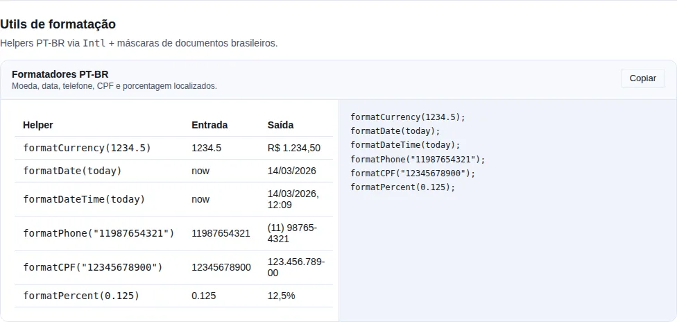

# Utilities

A collection of pure, React-free functions for the tedious everyday chores — grouping lists, merging objects, debouncing callbacks, formatting bytes. Everything is imported straight from `tempest-react-sdk` and runs in any JS environment (browser, Node, worker).

```ts
import { groupBy, pick, debounce, formatBytes } from "tempest-react-sdk";
```

!!! tip "Tree-shaking"
    Every function is an independent named export. Import only what you use — your app's bundler drops the rest.

---

<!-- gallery:utils -->
[](gallery.md)

*Section `utils` of the [gallery](gallery.md) — run it locally to interact.*
<!-- /gallery -->

## Arrays

Collection helpers that **never mutate** the input — they always return a new array (or object).

| Function                   | Signature                                                   | What it does                                                  |
| -------------------------- | ----------------------------------------------------------- | ------------------------------------------------------------- |
| `groupBy(items, key)`      | `<T, K>(items: T[], key: (item: T) => K) => Record<K, T[]>` | Groups items into buckets keyed by the result of `key`.       |
| `uniqueBy(items, key)`     | `<T>(items: T[], key: (item: T) => unknown) => T[]`         | Removes duplicates, keeping the first occurrence of each key. |
| `chunk(items, size)`       | `<T>(items: T[], size: number) => T[][]`                    | Splits the list into chunks of at most `size` items.          |
| `range(start, end, step?)` | `(start: number, end: number, step?: number) => number[]`   | Builds a numeric range `[start, end)` with step `step` (1).   |

```ts
import { groupBy, uniqueBy, chunk, range } from "tempest-react-sdk";

groupBy([1, 2, 3, 4], (n) => (n % 2 === 0 ? "even" : "odd"));
// { odd: [1, 3], even: [2, 4] }

uniqueBy(
  [
    { id: 1, v: "a" },
    { id: 1, v: "b" },
    { id: 2, v: "c" },
  ],
  (u) => u.id,
);
// [{ id: 1, v: "a" }, { id: 2, v: "c" }]

chunk([1, 2, 3, 4, 5], 2); // [[1, 2], [3, 4], [5]]

range(0, 5); // [0, 1, 2, 3, 4]
range(0, 10, 2); // [0, 2, 4, 6, 8]
range(5, 0, -1); // [5, 4, 3, 2, 1]
```

!!! warning "`chunk` requires `size >= 1`"
    Calling `chunk(items, 0)` throws `RangeError`. `range` with a wrong-direction (or `0`) step returns `[]` instead of throwing.

---

## Objects

Immutable copies and recursive merge. None of these functions mutate the input.

| Function                 | Signature                                                 | What it does                                                    |
| ------------------------ | --------------------------------------------------------- | --------------------------------------------------------------- |
| `pick(obj, keys)`        | `<T, K extends keyof T>(obj: T, keys: K[]) => Pick<T, K>` | New object with only the requested keys (missing keys skipped). |
| `omit(obj, keys)`        | `<T, K extends keyof T>(obj: T, keys: K[]) => Omit<T, K>` | New object without the listed keys.                             |
| `deepMerge(target, src)` | `<T>(target: T, source: Partial<T>) => T`                 | Recursive merge of plain objects; arrays/instances replace.     |
| `isEmpty(value)`         | `(value: unknown) => boolean`                             | `true` for `null`, `""`, `[]`, `{}`, empty `Map`/`Set`.         |

```ts
import { pick, omit, deepMerge, isEmpty } from "tempest-react-sdk";

pick({ id: 1, name: "Ana", age: 30 }, ["id", "name"]);
// { id: 1, name: "Ana" }

omit({ id: 1, name: "Ana", age: 30 }, ["age"]);
// { id: 1, name: "Ana" }

interface Settings {
  a: number;
  nested: { x: number; y: number; z?: number };
}

const base: Settings = { a: 1, nested: { x: 1, y: 2 } };

deepMerge(base, { nested: { x: 1, y: 20, z: 30 } });
// { a: 1, nested: { x: 1, y: 20, z: 30 } }

isEmpty(0); // false — numbers are never "empty"
isEmpty(false); // false
isEmpty(""); // true
```

!!! info "`deepMerge` does not merge arrays"
    Arrays and non-plain values (dates, class instances, primitives) **replace** the whole `target` value — there is no element-by-element merge. `deepMerge({ tags: ["a", "b"] }, { tags: ["c"] })` yields `{ tags: ["c"] }`.

---

## Type guards

Safe type narrowing. They pair nicely with `Array.prototype.filter` and exhaustive `switch` statements.

| Function                       | Signature                                              | What it does                                                 |
| ------------------------------ | ------------------------------------------------------ | ------------------------------------------------------------ |
| `isDefined(value)`             | `<T>(value: T \| null \| undefined) => value is T`     | `true` when the value is neither `null` nor `undefined`.     |
| `isString(value)`              | `(value: unknown) => value is string`                  | `true` for a string primitive.                               |
| `isNumber(value)`              | `(value: unknown) => value is number`                  | `true` for a number, **excluding** `NaN`.                    |
| `isPlainObject(value)`         | `(value: unknown) => value is Record<string, unknown>` | `true` only for an object literal (not array/date/instance). |
| `assertNever(value, message?)` | `(value: never, message?: string) => never`            | Always throws — marks unreachable code paths.                |

```ts
import { isDefined, isNumber, assertNever } from "tempest-react-sdk";

const xs: (number | null)[] = [1, null, 2];
const clean: number[] = xs.filter(isDefined); // [1, 2] — type already narrowed

isNumber(NaN); // false
isNumber("42"); // false

type Shape = "circle" | "square";
function area(shape: Shape): number {
  switch (shape) {
    case "circle":
      return 1;
    case "square":
      return 2;
    default:
      return assertNever(shape); // compile error if a case is forgotten
  }
}
```

!!! tip "`assertNever` is an exhaustiveness check"
    Use it in the `default` branch of a `switch`. If you add a new union member and forget to handle it, TypeScript complains at compile time — and the runtime fails loudly if something slips through.

---

## Functions

Execution-control wrappers. `debounce` and `throttle` expose `.cancel()`.

| Function             | Signature                                                                      | What it does                                                         |
| -------------------- | ------------------------------------------------------------------------------ | -------------------------------------------------------------------- |
| `debounce(fn, wait)` | `<A>(fn: (...a: A) => void, wait: number) => ((...a: A) => void) & { cancel }` | Delays `fn` until `wait` ms with no new calls (trailing-edge).       |
| `throttle(fn, wait)` | `<A>(fn: (...a: A) => void, wait: number) => ((...a: A) => void) & { cancel }` | Runs at most once per `wait` ms (leading + trailing edge).           |
| `once(fn)`           | `<A, R>(fn: (...a: A) => R) => (...a: A) => R`                                 | Runs `fn` only on the first call; afterwards returns the cache.      |
| `memoizeOne(fn)`     | `<A, R>(fn: (...a: A) => R) => (...a: A) => R`                                 | Memoizes only the most recent call (args compared with `Object.is`). |

```ts
import { debounce, throttle, once, memoizeOne } from "tempest-react-sdk";

const save = debounce((q: string) => search(q), 300);
save("a");
save("ab");
save("abc"); // only "abc" runs after 300ms
save.cancel(); // cancels the pending call

const onScroll = throttle(() => render(), 200);
window.addEventListener("scroll", onScroll);

const init = once(() => expensiveSetup());
init(); // runs
init(); // returns the same result, no re-run

const select = memoizeOne((a: number, b: number) => a + b);
select(1, 2); // computes 3
select(1, 2); // cached 3
select(2, 2); // recomputes 4
```

!!! note "`memoizeOne` remembers only the last call"
    Unlike an LRU cache — any different argument list recomputes and replaces the cache. Ideal for selectors derived from props.

---

## Promises

| Function                         | Signature                                                              | What it does                                                    |
| -------------------------------- | ---------------------------------------------------------------------- | --------------------------------------------------------------- |
| `sleep(ms)`                      | `(ms: number) => Promise<void>`                                        | Resolves after `ms` milliseconds.                               |
| `withTimeout(promise, ms, msg?)` | `<T>(promise: Promise<T>, ms: number, message?: string) => Promise<T>` | Races `promise` against a timeout; rejects with `TimeoutError`. |

```ts
import { sleep, withTimeout } from "tempest-react-sdk";

await sleep(500); // pauses for half a second

try {
  await withTimeout(fetch("/slow"), 3000, "request too slow");
} catch (error) {
  // error.name === "TimeoutError" when the 3s elapsed
}
```

---

## IDs

| Function            | Signature                     | What it does                                                         |
| ------------------- | ----------------------------- | -------------------------------------------------------------------- |
| `randomId(prefix?)` | `(prefix?: string) => string` | Collision-resistant id (uses `crypto.randomUUID()` with a fallback). |

```ts
import { randomId } from "tempest-react-sdk";

randomId(); // "9f1c2b3a-..." (uuid) or "lq3f8k-4a9z1" (fallback)
randomId("user"); // "user-9f1c2b3a-..."
```

!!! tip "Great for UI keys"
    Use it for client-generated lists when there is no stable id from the server. For persisted ids, prefer the real backend id.

---

## Strings

| Function                          | Signature                                                      | What it does                                            |
| --------------------------------- | -------------------------------------------------------------- | ------------------------------------------------------- |
| `capitalize(value)`               | `(value: string) => string`                                    | Uppercases only the first character.                    |
| `camelCase(value)`                | `(value: string) => string`                                    | Converts to `camelCase`.                                |
| `kebabCase(value)`                | `(value: string) => string`                                    | Converts to `kebab-case` (also splits `camelCase`).     |
| `pluralize(count, singular, pl?)` | `(count: number, singular: string, plural?: string) => string` | Picks singular/plural by count (returns the word only). |

```ts
import { capitalize, camelCase, kebabCase, pluralize } from "tempest-react-sdk";

capitalize("hello world"); // "Hello world"

camelCase("foo-bar_baz"); // "fooBarBaz"
camelCase("API response"); // "apiResponse"

kebabCase("helloWorld"); // "hello-world"
kebabCase("APIResponse"); // "api-response"

pluralize(1, "item"); // "item"
pluralize(3, "item"); // "items"
pluralize(2, "person", "people"); // "people"
```

!!! note "Pre-existing — `slugify` and `truncate`"
    Already in the strings module: `slugify(input)` builds a URL-safe slug (`"São Paulo / Centro"` → `"sao-paulo-centro"`), and `truncate(input, max, suffix?)` cuts text to `max` characters appending `…` (or the given `suffix`).

---

## Numbers

| Function                           | Signature                                      | What it does                                               |
| ---------------------------------- | ---------------------------------------------- | ---------------------------------------------------------- |
| `formatBytes(bytes, decimals?)`    | `(bytes: number, decimals?: number) => string` | Human-readable size in B/KB/MB/GB/TB (base 1024).          |
| `formatCompactNumber(value, loc?)` | `(value: number, locale?: string) => string`   | Compact notation (`1.2K`, `3.4M`) via `Intl.NumberFormat`. |
| `percentOf(part, total)`           | `(part: number, total: number) => number`      | 0–100 percentage, with a zero base returning `0`.          |

```ts
import { formatBytes, formatCompactNumber, clamp } from "tempest-react-sdk";

formatBytes(0); // "0 B"
formatBytes(1536); // "1.5 KB"
formatBytes(1536, 2); // "1.50 KB"

formatCompactNumber(1234); // "1.2K"
formatCompactNumber(5600000); // "5.6M"
formatCompactNumber(1234, "pt-BR"); // "1,2 mil"
```

!!! note "Pre-existing — `clamp`"
    `clamp(value, min, max)` pins a number to the `[min, max]` range (and tolerates `min > max`, swapping the bounds). `clamp(120, 0, 100)` → `100`.

!!! danger "`percentOf` exists because of `NaN%`, not because of the division"
    `(active / total) * 100` with `total === 0` produces `NaN`, and `NaN%` on an empty panel is the most common way a dashboard announces that it has no data yet. `percentOf(5, 0)` is `0`; non-finite inputs are `0` too.
    It does **not** cap at 100 — 150% of a target is real data somebody wants to see.
    Mind the pairing: `formatPercent` takes a **fraction** (0–1), so it reads `formatPercent(percentOf(a, b) / 100)`.

---

## Dates for `<input type="date">` — `formatDateForInput`

`formatDate` produces `dd/MM/yyyy`, which an `<input type="date">` rejects — it insists on `yyyy-MM-dd`. Every form with a date rewrites that slice, and rewrites it wrong.

```ts
import { formatDateForInput } from "tempest-react-sdk";

formatDateForInput(new Date(2026, 4, 16)); // "2026-05-16"
formatDateForInput("2026-05-16"); // "2026-05-16"
formatDateForInput("not a date"); // "" — the input reads it as "no value"
```

!!! danger "`toISOString().slice(0, 10)` gets the day wrong, and only in the evening"
    It is everyone's reflex, and `toISOString` converts to UTC first: in UTC-3, anything after 21:00 reports the **next** day. The form opens on the wrong date only for people working at night, which is the worst kind of bug to reproduce. `formatDateForInput` builds the date from **local** parts.

!!! warning "A `yyyy-MM-dd` string comes back untouched — load-bearing, not a shortcut"
    `new Date("2026-05-16")` is **UTC** midnight, which in UTC-3 is the 15th at 21:00. Without that bypass, handing the input the exact value the backend sent would move it back a day.

---

## Dates and times for `<input type="datetime-local">` — `formatDateTimeForInput`

The sibling of the one above, for the field that stores **when**, not just **which day**. The trap is identical — and here it costs the hour as well as the date.

```ts
import { formatDateTimeForInput } from "tempest-react-sdk";

formatDateTimeForInput(new Date(2026, 4, 16, 14, 30)); // "2026-05-16T14:30"
formatDateTimeForInput("2026-05-16T14:30"); // "2026-05-16T14:30"
formatDateTimeForInput("2026-05-16T14:30:45"); // "2026-05-16T14:30" — seconds dropped
formatDateTimeForInput("not a date"); // "" — the input reads it as "no value"
```

An appointment coming back from the backend as a zoned ISO string fills the field without drifting:

```tsx
import { formatDateTimeForInput } from "tempest-react-sdk";

interface Appointment {
    id: string;
    /** ISO 8601 with an offset, the way the backend serialises it. */
    startsAt: string;
}

export function AppointmentForm({ appointment }: { appointment: Appointment }) {
    return (
        <form method="post">
            <label htmlFor="startsAt">Start</label>
            <input
                id="startsAt"
                name="startsAt"
                type="datetime-local"
                defaultValue={formatDateTimeForInput(appointment.startsAt)}
            />
            <button type="submit">Save</button>
        </form>
    );
}
```

!!! danger "`toISOString().slice(0, 16)` gets the date **and** the hour wrong"
    Same cause as the sibling, bigger blast radius: a 22:00 slot in UTC-3 becomes `2026-05-17T01:00` — the form opens on the next day, in the small hours. `formatDateTimeForInput` builds every part from **local** time.

!!! warning "A **zoned** string does not come back untouched, on purpose"
    `"2026-05-16T14:30"` (naive) is returned as-is. `"2026-05-16T14:30:00Z"` is **not** — it is a different instant from the one it looks like, so it is converted to the local calendar the field has to show. Only the exact `yyyy-MM-ddTHH:mm` shape takes the shortcut.

!!! tip "Seconds are dropped, and that keeps the value honest"
    A `datetime-local` steps by the minute unless the app sets `step`. A `:ss` the field cannot represent would be discarded on the first edit anyway — truncating here makes the rendered value and the submitted value the same.

---

## Spreadsheets `.xlsx` — `writeXlsx`

Exporting data as CSV feels simple until an accent turns into `é` in Excel. `writeXlsx(headers, rows)` builds a single-sheet Office Open XML (`.xlsx`) workbook straight in memory — UTF-8 end to end, so accents survive Excel/LibreOffice/Google Sheets without the CSV BOM fragility. The only dependency is `fflate` (used to deflate the package), already bundled in the SDK.

```ts
import { writeXlsx } from "tempest-react-sdk";

const bytes = writeXlsx(
  ["Name", "Score", "Note"],
  [
    ["Ada", 99, "approved"],
    ["Alan", 87, null], // null becomes an empty cell
  ],
);

const blob = new Blob([bytes], {
  type: "application/vnd.openxmlformats-officedocument.spreadsheetml.sheet",
});
```

- `headers: string[]` — the first (header) row.
- `rows: (string | number | null)[][]` — each value becomes a cell: `number` uses the native `"n"` type (recognised as a number by the spreadsheet app), `null` (or `""`) becomes an empty cell, everything else is an inline string.
- Returns the file bytes as a `Uint8Array`.

The XML is deliberately lean: inline strings (no shared-string table), no styles, no merges. It's a **generic** writer — map your domain records to `headers`/`rows` in your application layer.

!!! tip "From bytes to the user"
    Pair it with [`shareOrDownloadBlob`](./share.en.md#export-a-file-shareordownloadblob): `writeXlsx` → `new Blob([...])` → `shareOrDownloadBlob(blob, "data.xlsx")` opens the native sheet on mobile and downloads on desktop.

---

## CSV — `toCsv` and `downloadCsv`

`.xlsx` is the right format for someone who will **open** the spreadsheet. CSV is the right format for someone who will **import** the file into another system — and it is what nearly every admin panel ends up writing by hand, getting the same two things wrong every time: a name with a comma splits the row, and a name with a quote breaks the very quoting that was supposed to protect it.

```ts
import { toCsv, downloadCsv, type CsvColumn } from "tempest-react-sdk";

const COLUMNS: CsvColumn<User>[] = [
  { key: "name", header: "Name" },
  { key: "email", header: "E-mail" },
  { key: "plan", header: "Plan", csv: (u) => u.plan?.label ?? "" },
];

const text = toCsv(users, COLUMNS); // ready-made string
await downloadCsv(users, COLUMNS, "users.csv"); // hand it to the user
```

| Signature | What it does |
| --- | --- |
| `toCsv(rows, columns, options?)` | Returns the whole file as a `string`. |
| `downloadCsv(rows, columns, fileName?, options?)` | Builds the `text/csv;charset=utf-8` blob and passes it to `shareOrDownloadBlob`. |
| `CsvColumn<T>` | `{ key, header, csv? }` |
| `CsvOptions` | `{ delimiter?: "," \| ";", bom?: boolean }` — defaults `","` and `true`. |

!!! danger "A `DataTable` column does **not** work as-is once it has `render`"
    `DataTableColumn.render` returns a `ReactNode`. Exporting that writes `[object Object]` in exactly the column that holds a badge, a link or a formatted date — the table's most important one. A column **without** `render` is structurally compatible and can be reused; with `render`, give it the `csv` accessor.

!!! check "RFC 4180 escaping, plus the BOM Excel pt-BR insists on"
    A field containing the delimiter, a quote or a line break becomes a quoted field, and each inner quote is doubled. Rows terminate with `\r\n`. The BOM is on by default because without it Excel on a pt-BR install reads UTF-8 as Latin-1 and every accent turns into mojibake.

!!! tip "`;` is the right delimiter in a pt-BR locale"
    Where the decimal separator is the comma, Excel opens a comma-separated CSV **in a single column**. `{ delimiter: ";" }` fixes it — and the escaping follows, quoting the field that contains `;` instead of the one that contains `,`.

!!! info "`0` and `false` are exported; `null` and `undefined` become empty fields"
    Empty means absent, not falsy. Treating `0` as empty is how a report starts under-reporting every row that legitimately holds a zero. A `Date` is written as ISO, which any system re-imports without guessing a format.

!!! note "An empty list still writes the header, not an empty file"
    Whoever opens it needs to see which columns they asked for. A zero-byte file looks like a failed export.

---

## Compressed storage — `compressedStorage`

`localStorage` gives you roughly **5 MB per origin** and bills **two bytes per character**. An offline-first app that stores real state — a game save, a long draft, a catalogue cache — hits that ceiling sooner than you would guess, and the symptom is a `QuotaExceededError` in the middle of a write, not a warning.

`compressedStorage` is the same typed wrapper as `storage`, except it gzips what it writes:

```ts
import { compressedStorage } from "tempest-react-sdk";

compressedStorage.set("save", { level: 12, inventory: items });

const save = compressedStorage.get("save", null);
```

- `get<T>(key, fallback)` — decompresses and parses. A missing, unreadable or corrupt key returns `fallback`; it never throws.
- `set<T>(key, value)` — compresses and writes.
- `remove(key)` — deletes the key.

!!! tip "Both are the same implementation, through `createJsonStorage`"
    `storage` and `compressedStorage` are the **same** function underneath —
    `createJsonStorage(codec)` — so their surfaces cannot drift. Through v0.44.0
    the compressed one was a hand-written copy of the same guards and had **no
    `remove`**, while its own docstring promised the two were interchangeable at
    the call site. Anybody who followed that promise broke on the first `remove`.

    A custom codec takes the same path:

    ```ts
    import { createJsonStorage } from "tempest-react-sdk";

    // A store that encrypts before writing.
    const secrets = createJsonStorage({
      serialize: (value) => encrypt(JSON.stringify(value)),
      deserialize: (raw) => JSON.parse(decrypt(raw)),
    });
    ```

    If the codec **throws**, the value is written as plain JSON rather than
    dropped: a larger record still loads, an absent one does not. Only a value not
    even JSON can represent (a cycle) loses the write.

### The format is self-describing

Every value written carries a `~tgz1:` prefix. That solves the annoying part of turning compression on for a key that already exists: a read without the marker falls through to a plain `JSON.parse`, so **data already stored stays readable**. No migration, no orphaned save.

The same path covers a degraded write: if compression fails, the value is stored as plain JSON rather than dropped — a bigger record still loads, an absent one does not.

!!! note "Why base64 rather than packing into UTF-16"
    Base64 costs a third more characters than the raw compressed bytes, and `localStorage` still bills two bytes per character on top of that. Packing the bytes straight into UTF-16 code units would be denser, but lone surrogates survive neither every storage implementation nor a JSON round-trip — and a save that decodes to garbage is far worse than one that is bigger. Even with that slack, a typical JSON document lands well under a third of its original size.

### With `useLocalStorage`

For React state, pass the codec instead of using the imperative API — you get the hook's cross-tab sync and SSR guard for free:

```ts
import { compressedStorageCodec, useLocalStorage } from "tempest-react-sdk";

const [save, setSave] = useLocalStorage("save", EMPTY_SAVE, compressedStorageCodec);
```

`compressToString` / `decompressFromString` are exported standalone too, for when the destination is not `localStorage` (a backup `POST`, an `IndexedDB` record).

!!! warning "Not for everything"
    Compression costs CPU on both ends. For a theme preference or a boolean flag, use plain `storage` — the gain is zero and the cost is not. `compressedStorage` starts paying off at payloads in the tens of KB.

---

## Recap

- Import any helper straight from `tempest-react-sdk` — they are all named, pure, tree-shakable exports.
- **Spreadsheets**: `writeXlsx(headers, rows)` builds a single-sheet UTF-8 `.xlsx` as a `Uint8Array` (no CSV BOM drama).
- **CSV**: `toCsv(rows, columns)` writes the file with RFC 4180 escaping and a BOM; `downloadCsv(...)` hands it straight to the user.
- **Dates and percentages**: `formatDateForInput` gives the `yyyy-MM-dd` an `<input type="date">` insists on and `formatDateTimeForInput` gives the `yyyy-MM-ddTHH:mm` an `<input type="datetime-local">` wants (both from local parts, without the UTC shift); `percentOf` returns `0` instead of `NaN` when the base is zero.
- **Compressed storage**: `compressedStorage.get/set` gzips what it writes; the self-describing format (`~tgz1:`) reads older values with no migration. In React, `useLocalStorage(key, def, compressedStorageCodec)`.
- **Arrays/Objects**: `groupBy`, `uniqueBy`, `chunk`, `range`, `pick`, `omit`, `deepMerge`, `isEmpty` — always immutable; `deepMerge` replaces arrays instead of merging them.
- **Guards**: `isDefined`, `isString`, `isNumber`, `isPlainObject`, `assertNever` — safe narrowing + `switch` exhaustiveness.
- **Functions**: `debounce`/`throttle` (with `.cancel()`), `once`, `memoizeOne` to control execution.
- **Promises/IDs/Strings/Numbers**: `sleep`, `withTimeout`, `randomId`, `capitalize`/`camelCase`/`kebabCase`/`pluralize`, `formatBytes`/`formatCompactNumber`.

## See also

- [Utility hooks](./hooks.md) — `useDebounce` is the React flavor of `debounce`.
- [Utility & headless](./components/utility.md) — components that wrap some of these helpers (`Money`, `RelativeTime`).
