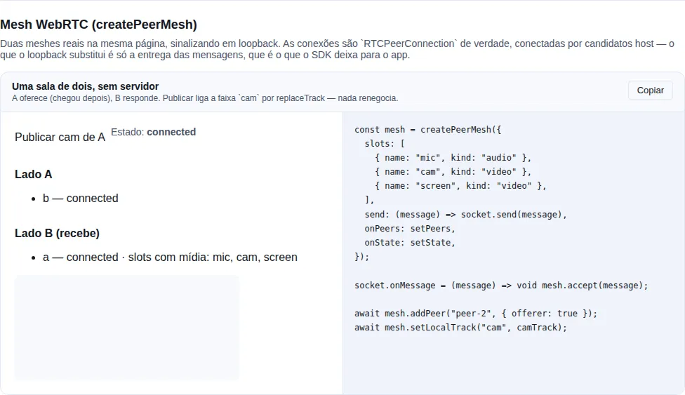

# WebRTC

Áudio sobre WebRTC sai **mono e estreito por padrão**, e o único lugar onde isso se corrige é o SDP. Este módulo traz a máquina de mexer nele — parsing, merge e fallback — mais o cap de envio, que é a outra metade do par que costuma confundir.

!!! info "Quando você precisa disto?"
    Se a chamada é só voz e o padrão do browser já serve, você não precisa. O momento em que isto vira necessário é o áudio de **tela compartilhada**: música e vídeo herdam o perfil de fala — mono, ~32 kbps, FEC ligado, DTX gateando as passagens quietas — e é exatamente por isso que áudio de tela numa chamada soa como telefone. Nenhuma API de alto nível deixa mudar isso.

<!-- gallery:peer-mesh -->
[](gallery.md)

*Seção `peer-mesh` da [gallery](gallery.md) — rode localmente para interagir.*
<!-- /gallery -->

## O problema, em uma linha

`RTCPeerConnection` não expõe knob de codec. O perfil do Opus vive numa linha `a=fmtp:` do SDP, e mexer nela é editar texto — com uma cauda longa de armadilhas de protocolo (RFC 7587), não de gosto.

## `tuneOpus` — perfil por m-line de áudio

```ts
import { tuneOpus } from "tempest-react-sdk";

const offer = await pc.createOffer();

const tuned = tuneOpus(offer.sdp!, {
  // por índice de m-line de áudio (0 = a primeira), ou por mid
  0: { maxAverageBitrate: 48_000, stereo: false, fec: true, dtx: true },
  1: { maxAverageBitrate: 192_000, stereo: true, fec: false, dtx: false },
});

await pc.setLocalDescription({ ...offer, sdp: tuned });
```

Um perfil só, aplicado a todas as m-lines de áudio, é a forma curta:

```ts
const tuned = tuneOpus(offer.sdp!, { stereo: true, dtx: false });
```

| Campo | Vira | Para quê |
| --- | --- | --- |
| `maxAverageBitrate` | `maxaveragebitrate` | teto que pedimos ao encoder **remoto** |
| `maxPlaybackRate` | `maxplaybackrate` | maior taxa que vale decodificar |
| `stereo` | `stereo` **e** `sprop-stereo` | dois canais nas duas direções |
| `fec` | `useinbandfec` | reconstrói pacote perdido — salva fala, borra música |
| `dtx` | `usedtx` | para de transmitir no silêncio — errado para música |
| `cbr` | `cbr` | bitrate constante |
| `extra` | o que você escrever | escape hatch para chave não modelada |

!!! danger "Sem tabela de presets, de propósito"
    Quais valores usar é decisão sua: voz numa mesh não quer o mesmo que áudio de sistema. Preset é justamente o tipo de coisa que não deve morar dentro de dependência — o que mora aqui é o parsing, o merge e o fallback, que é onde está a cauda longa.

### As armadilhas que isto resolve

Errar qualquer uma degrada **em silêncio**: ninguém vê exceção, o áudio só fica pior.

!!! warning "`stereo` e `sprop-stereo` apontam para lados opostos"
    `stereo=1` pede que o **remoto** mande dois canais; `sprop-stereo=1` anuncia que **nós** vamos mandar. Setar só um deixa o link assimétrico — o motivo recorrente de "pedi estéreo e veio mono". O campo `stereo` escreve os dois.

!!! warning "O `fmtp` já existe e não pode ser sobrescrito"
    O browser emite `a=fmtp:111 minptime=10;useinbandfec=1`. Trocar a linha inteira descarta o `minptime` — uma decisão de packetization que ninguém quis mudar. O merge é por chave: o que você não nomeia, fica.

!!! warning "O payload type varia, e pode haver mais de um"
    O número sai do `a=rtpmap:(\d+) opus/48000`, nunca de um `111` fixo. Todos os payloads Opus do bloco são ajustados.

!!! warning "Pode não haver `fmtp` nenhum"
    Aí a linha é **inserida** logo depois do `rtpmap`. "O parâmetro não existe" e "o parâmetro está vazio" são o mesmo pedido do ponto de vista de quem chama.

!!! warning "Só as m-lines de áudio"
    Com vários slots (mic + áudio de sistema em transceivers separados), cada um quer um perfil diferente — e a contagem de índice ignora blocos de vídeo, então uma m-line de vídeo no meio não desloca nada.

## `setTunedLocalDescription` — o fallback que salva a chamada

```ts
import { setTunedLocalDescription } from "tempest-react-sdk";

const applied = await setTunedLocalDescription(pc, await pc.createOffer(), profiles);
if (applied === "original") logger.warn("o browser recusou o perfil Opus");
```

O Chrome vem apertando o que `setLocalDescription` aceita de SDP editado, e não há como saber de antemão. Sem fallback para o SDP original, **a chamada morre em vez de perder o perfil** — que é a troca errada por uma margem larga: áudio pior é melhor que nenhum áudio.

O retorno diz qual dos dois entrou, porque `"original"` significa que o perfil silenciosamente não se aplicou — coisa que vale telemetria.

## `setSenderBitrate` — a outra metade do par

```ts
import { setSenderBitrate } from "tempest-react-sdk";

const sender = pc.getSenders().find((s) => s.track?.kind === "audio");
if (sender) await setSenderBitrate(sender, 48_000);
```

!!! tip "`fmtp` é o que queremos **receber**; `setParameters` limita o que **enviamos**"
    Os dois são necessários, e numa topologia **mesh** o segundo é o que importa: o uplink carrega uma cópia do stream por participante, então é ele que satura primeiro.

Duas coisas fazem disto uma função em vez de duas linhas no seu código: `setParameters` só aceita **o mesmo objeto** que `getParameters` devolveu (um objeto novo é recusado), e um sender que ainda não negociou reporta **nenhum** encoding — escrever em `encodings[0]` sem checar lança exatamente na chamada que tenta fixar o cap antes da primeira offer. `null` levanta o cap; o retorno é `false` quando o browser recusa, e aí a chamada continua sem cap em vez de quebrar.

## Medindo o link: `createLinkStatsSampler` e `useLinkStats`

O badge que toda chamada mostra — `1,2 Mbps · 42 ms · 1080p60` — não vem pronto de lugar nenhum. `getStats()` devolve dezenas de entradas com contadores **cumulativos**, e transformar isso em três números é onde cada app reescreve os mesmos dois erros.

### Em React

```ts
import { useLinkStats } from "tempest-react-sdk";

function LinkBadge({ pc }: { pc: RTCPeerConnection | null }) {
  const stats = useLinkStats(pc);

  if (!stats) return <span>medindo…</span>;

  return (
    <span>
      {stats.kbps} kbps · {stats.rttMs ?? "—"} ms · {stats.width}×{stats.height}
      {stats.fps > 0 ? `@${stats.fps}` : ""}
    </span>
  );
}
```

Amostra a cada 2 s, **só** enquanto `connectionState === "connected"`, e para de amostrar quando a aba vai para segundo plano.

### Fora do React

```ts
import { createLinkStatsSampler } from "tempest-react-sdk";

const sampler = createLinkStatsSampler();

setInterval(async () => {
  const stats = await sampler.sample(pc);
  badge.textContent = `${stats.kbps} kbps`;
}, 2000);
```

!!! warning "Um sampler por conexão"
    A taxa é um **delta**, então o sampler guarda a leitura anterior. Compartilhar um sampler entre peers subtrai o contador de uma conexão do de outra e reporta bobagem. Uma mesh de 5 pessoas tem 4 samplers.

Já tem o relatório em mãos? `sampler.read(report)` faz a redução sem buscar de novo — útil quando o mesmo `getStats()` alimenta mais de uma coisa.

### De badge a sinal de controle

Os três campos acima descrevem **o que foi enviado**. Para *decidir* qualidade em vez de só mostrá-la, faltam dois que descrevem **o que o caminho aguenta** — e são a única classe de informação que responde antes de a imagem quebrar:

| Campo | O que responde |
| --- | --- |
| `availableKbps` | banda de subida que o transporte estima, em kbps, ou `null` |
| `limitedBy` | o que o encoder diz estar segurando a imagem, ou `null` |
| `relayed` | se o link está passando por um TURN |

```ts
const stats = useLinkStats(pc);

if (stats?.limitedBy === "bandwidth" && stats.availableKbps !== null) {
  aplicarTeto(Math.round(stats.availableKbps * 0.8));
}
```

!!! danger "`kbps` não distingue cap honrado de cap se afogando"
    Chamada de duas pessoas com upload doméstico de ~1 Mb/s recebendo o teto cheio de 2500 kbps de tela: `kbps` reporta **2500** — o cap sendo obedecido enquanto a fila atrás dele cresce, e a imagem congela. Nada em `kbps`, `width`, `height` ou `fps` separa "saudável a 2,5 Mb/s" de "capado a 2,5 Mb/s e afogando". `availableKbps` separa.

!!! warning "`null` não é `0`, e tratar como zero derruba toda chamada"
    `availableKbps` vem `null` enquanto não houver estimativa — o que é a maior parte dos primeiros segundos de **toda** chamada, e permanente em engine que não publica uma. `0` é indistinguível de "o caminho morreu". Um consumidor que leia ausência como zero baixa a qualidade no começo de cada chamada.

!!! note "Reagir a banda numa máquina limitada por CPU compra imagem pior e nenhum alívio"
    `limitedBy` é o veredito do encoder, e é o que separa `"bandwidth"` de `"cpu"`. Quando senders discordam, `"bandwidth"` ganha, porque é o único motivo que um teto menor responde. O `"none"` da spec volta como `null`: nenhum consumidor deveria precisar saber que uma das strings verdadeiras significa "nada".

`relayed` é a conta do VPS numa mesh self-hosted: o stream relayed sobe e desce pela máquina de quem hospeda, e quem escolheu 4K não é quem paga. É resolvido **só** do par que o browser nomeia, nunca de um par meramente `succeeded` — adivinhar a rota por um par que não carrega nada reportaria um custo que ninguém está pagando.

Os três também saem avulsos, no mesmo formato do `readRoundTripMs`:

```ts
import { readAvailableOutgoingKbps, readQualityLimitation, readRelayed } from "tempest-react-sdk";

const report = await pc.getStats();
const headroom = readAvailableOutgoingKbps(report);
const limite = readQualityLimitation(report);
const viaTurn = readRelayed(report);
```

!!! tip "Uma caminhada, não quatro"
    Se você vai ler mais de um, use o sampler: `sampler.read(report)` percorre o relatório **uma vez** e resolve o par selecionado **uma vez**. Chamar os quatro leitores avulsos no mesmo relatório o percorre quatro vezes, por link, a cada tick — numa mesh de oito a 2 s isso é o trabalho recorrente mais caro da chamada, no aparelho menos capaz de pagá-lo.

### A cadeia do par selecionado

`readRoundTripMs`, `availableKbps` e `relayed` dependem todos da mesma pergunta: **qual par está carregando o link?** A resposta tem três degraus, nesta ordem:

1. `transport.selectedCandidatePairId` — o que a spec define;
2. o `candidate-pair` marcado com `selected: true` — fora da spec, e existe porque engine que não preenche nenhum dos dois não parece existir, enquanto engine que preenche só a flag existe;
3. o primeiro par `succeeded` — um palpite.

O degrau 3 é aceito para RTT e para banda, porque perder a leitura é pior que uma leitura ocasionalmente otimista. **Não** é aceito para `relayed`, pelo motivo acima.

!!! info "O degrau 2 não foi medido em Firefox"
    A conclusão de que o Firefox marca o par escolhido com `selected: true` em vez de preencher `transport.selectedCandidatePairId` vem de leitura de código de terceiros, **não de medição nossa**. A cadeia está certa por spec de qualquer forma — o degrau 1 continua sendo o primeiro —, mas se você depende desse comportamento específico, meça no seu alvo antes de tratar como fato.

### Os dois erros que isto evita

**1. RTT lido do par errado.** Uma conexão mantém vários pares de candidatos vivos ao mesmo tempo — host, server-reflexive, relayed — e só **um** carrega tráfego. Pegar o primeiro `candidate-pair` com `state: "succeeded"` faz o número saltar entre caminhos que não estão sendo percorridos: 8 ms do par host ocioso alternando com 180 ms do TURN que está trabalhando.

O correto é o par que o `transport` nomeia em `selectedCandidatePairId`. `readRoundTripMs` faz isso, e é exportado sozinho porque é útil fora do sampler:

```ts
import { readRoundTripMs } from "tempest-react-sdk";

const rttMs = readRoundTripMs(await pc.getStats());
```

**2. Vazão derivada sem delta.** `bytesSent` é cumulativo desde que a conexão abriu. Dividir pelo tempo de sessão dá a média histórica — um número que só desce e nunca mostra o que está acontecendo agora. A taxa é `(bytes − bytesAnterior) × 8 ÷ 1000 ÷ segundos`, e guardar o "anterior" é exatamente a parte que cada cópia refaz.

### O que o sampler soma, e por quê

| Campo | Vem de |
| --- | --- |
| `kbps` | soma de **todos** os senders que casam com `kind` |
| `width` / `height` / `fps` | o stream de **maior área**, não o último reportado |
| `rttMs` | o par de candidatos selecionado pelo transporte |

Um peer publicando câmera e tela ao mesmo tempo ocupa **um** uplink com as duas — e o uplink é o que acaba. Por isso a soma. A resolução vem do maior porque é ele que domina essa banda e é nele que quem assiste está olhando.

O padrão é contar só vídeo. `kind: "all"` inclui áudio quando o número precisa ser o custo real da conexão:

```ts
const sampler = createLinkStatsSampler({ kind: "all" });
```

### Pausa, retomada e `reset()`

```ts
const stats = useLinkStats(pc, {
  intervalMs: 2000,       // getStats percorre todo o relatório; 2 s não é preguiça
  pauseWhenHidden: true,  // default
  kind: "video",          // default
});
```

Voltar de segundo plano chama `reset()` antes da próxima amostra. Sem isso, o primeiro sample depois de cinco minutos de aba oculta divide cinco minutos de bytes por cinco minutos e reporta a média de um período que ninguém perguntou. Chame `sampler.reset()` na mão pelo mesmo motivo depois de um **ICE restart** ou uma reconexão.

`reset()` limpa o baseline, não a tela: a próxima leitura volta com `kbps: 0` e mantém a resolução e o RTT que já estavam à mostra, para o badge não piscar.

!!! tip "A última leitura sobrevive à pausa"
    `useLinkStats` mantém o valor anterior enquanto está pausado, em vez de voltar a `null`. Um badge que apaga toda vez que a aba perde o foco é lido como conexão caída.

### O que isto **não** mede

Escrito aqui de propósito: cada item é uma pergunta que o relatório responde e este módulo não, para você saber onde procurar em vez de descobrir que o número estava mentindo.

- **O que você recebe.** Só há `outbound-rtp` aqui. "O vídeo do outro está travando" é `inbound-rtp` (`bytesReceived`, `framesDecoded`, `packetsLost`), e a leitura tem forma diferente o bastante para não caber na mesma redução — ela responde sobre o **encoder do outro**, não sobre o seu uplink.
- **Por que a taxa caiu.** `qualityLimitationReason` (`"bandwidth"`, `"cpu"`, `"none"`) está no mesmo `outbound-rtp` e distingue "a rede apertou" de "esta máquina não dá conta" — que levam a ações opostas. Leia direto do relatório quando precisar.
- **Perda e jitter.** `packetsLost` e `jitter` existem, mas são interpretados contra o total enviado no mesmo intervalo; um contador cru de perdidos é um número sem denominador.
- **A cadência, quando a aba está oculta.** Com `pauseWhenHidden: false` o timer continua, mas o browser afoga timers em segundo plano (Chrome vai para ≥ 1 min). Nenhuma API contorna isso — a amostragem simplesmente fica mais espaçada, e o delta continua correto porque é derivado do tempo medido, não do intervalo pedido.
- **Comportamento de browser real.** Os testes deste módulo rodam em jsdom, que não tem WebRTC nenhum: eles provam a **redução** contra relatórios sintéticos, não a conexão. A forma do relatório foi conferida à parte, no Chromium, com dois `RTCPeerConnection` em loopback carregando um canvas 640×360@30 — o mesmo relatório traz `kind` **e** `mediaType`, `frameWidth`/`frameHeight`/`framesPerSecond` vêm preenchidos, `transport.selectedCandidatePairId` existe, e a primeira amostra vem a `0` kbps antes de estabilizar em ~350 kbps. Ainda assim, confirme na sua topologia antes de confiar num painel em produção: relay TURN, simulcast e mobile mudam o que aparece.

!!! note "`rttMs: 0` não é `rttMs: null`"
    Zero é uma leitura — foi o que o loopback local mediu. `null` significa que **nenhum** par reportou timing ainda, o que é o estado normal enquanto a conexão assenta. Uma UI que trata os dois igual mostra "0 ms" para uma chamada que ainda não conectou.

### Quando o browser não colabora

O módulo já cobre o que varia entre engines, e vale saber que varia:

| Situação | O que acontece |
| --- | --- |
| Browser não preenche `selectedCandidatePairId` | cai para o primeiro par `succeeded` com timing |
| Browser reporta `mediaType` em vez de `kind` (Chrome antigo) | os dois são lidos |
| `framesPerSecond` ausente | `fps: 0`, e a última leitura boa é mantida |
| Contador reinicia (ICE restart) | delta negativo vira `0` e o baseline se refaz |
| Simulcast (várias camadas no mesmo track) | as camadas somam; a resolução vem da maior |

## `createPeerMesh` — a sala inteira, N↔N

As peças acima cuidam de **um** link. `createPeerMesh` cuida da sala: uma `RTCPeerConnection` por participante, com as faixas de mídia negociadas de uma vez.

```ts
import { createPeerMesh } from "tempest-react-sdk";

const mesh = createPeerMesh({
  slots: [
    { name: "mic", kind: "audio" },
    { name: "cam", kind: "video" },
    { name: "screen", kind: "video" },
  ],
  send: (message) => socket.send(message),
  onPeers: setPeers,
  onState: setState,
});

socket.onMessage = (message) => void mesh.accept(message);

await mesh.addPeer("peer-2", { offerer: true });
await mesh.setLocalTrack("mic", micTrack);
```

**O protocolo de sinalização continua seu.** O SDK produz e aceita três formatos (`offer`, `answer`, `ice`) e não sabe nada sobre sala, identidade ou entrega — quem implementa o servidor é você. O que ele traz é a parte que é igual em toda mesh e está errada na maioria delas.

### As seis armadilhas, e por que cada uma é muda

| Armadilha | Sintoma |
| --- | --- |
| Answerer pré-alocando transceiver | Câmera do outro aparece no tile de tela, ou o track some |
| Rotear por posição em vez de `mid` | O mesmo, de forma intermitente |
| Candidato ICE antes da descrição remota | Conexão fica em `checking` até estourar |
| Renegociar a cada toggle | Com N peers, N−1 rodadas de offer/answer cada vez que alguém desmuta |
| Glare | Os dois lados oferecem, e a negociação se anula |
| Dividir uplink sem piso | Todo mundo recebe um borrão que atualiza uma vez por segundo |

Nenhuma delas levanta erro em lugar nenhum — é por isso que cada uma virou um teste nomeado.

!!! warning "O lado que responde não pode pré-alocar"
    Aplicar uma oferta remota cria **um transceiver por m-line, em ordem de m-line**, e o browser **não reusa** os que o answerer criou antes. Pré-alocar deixa transceivers mortos na frente dos vivos, e a busca por slot passa a apontar para a mídia errada. Por isso `addPeer(id, { offerer: false })` aloca **nada**: os slots aparecem quando a oferta chega, e são adotados em ordem de `mid`.

!!! info "`mid` é a única identidade de slot que vale nos dois lados"
    O track não carrega nada que distinga câmera de tela. O offerer aloca as m-lines na ordem que você declarou em `slots`, então o `mid` é o ordinal e os dois lados leem o mesmo. Posição em `getTransceivers()` **discorda** — quem responde acrescenta os negociados depois dos que já tinha — e por isso é só fallback.

### Quem oferece é decidido por ordem de chegada

```ts
// o servidor anuncia joins em ordem total
socket.on("peer-joined", (peer) => mesh.addPeer(peer.id, { offerer: false }));
socket.on("welcome", ({ peers }) => {
  for (const peer of peers) void mesh.addPeer(peer.id, { offerer: true });
});
```

Quem **chega depois** oferece; quem já estava só responde. Exatamente um lado de cada link oferece, então não há glare — sem a dança de rollback do perfect negotiation, e sem depender de o browser implementar `setLocalDescription()` sem argumento.

### Ligar e desligar mídia não renegocia

```ts
await mesh.setLocalTrack("mic", micTrack); // desmutou
await mesh.setLocalTrack("mic", null); // mutou
```

Os slots são negociados **antes de qualquer track existir**, então publicar é um `replaceTrack` num transceiver que já existe: nenhuma m-line é acrescentada e nada renegocia. É essa propriedade que faz a mesh sobreviver — com N peers, uma renegociação por toggle são N−1 rodadas simultâneas de offer/answer toda vez que alguém desmuta.

### Medindo a sala: `stats`

A mesh sabe quantos links existem e quando um vai embora, então ela é o lugar certo para amostrar. `stats` liga um único timer que ela mesma gerencia:

```ts
const mesh = createPeerMesh({
  slots,
  send: (message) => socket.send(message),
  stats: {
    intervalMs: 2000,
    onStats: (peerId, stats) => atualizarBadge(peerId, stats),
  },
});
```

O mesmo valor cai em `MeshPeer.stats`, então quem já lê a lista de peers não escreve callback nenhum:

```tsx
{mesh.peers.map((peer) => (
  <li key={peer.peerId}>
    {peer.peerId} — {peer.stats?.kbps ?? "—"} kbps · {peer.stats?.rttMs ?? "—"} ms
    {peer.stats?.relayed ? " · via TURN" : ""}
  </li>
))}
```

!!! warning "Um sampler por conexão — é a regra que a versão à mão erra"
    A taxa é um **delta**, então o sampler guarda a leitura anterior. Compartilhar um entre peers subtrai o contador de uma conexão do de outra e reporta bobagem. A mesh mantém um sampler por link e o descarta junto com o link, que é a parte que um laço escrito à mão esquece quando alguém sai da sala.

!!! note "Só links `connected` são amostrados"
    Link ainda juntando candidatos não tem tráfego para medir, e perguntar de todo jeito gasta um `getStats()` para descobrir isso — por link, a cada tick. Sala vazia não tem timer nenhum, que é onde a chamada fica enquanto a primeira pessoa está adiantada.

!!! tip "Medir faz o `onPeers` disparar no intervalo"
    É o que se quer para um badge, e vale saber para qualquer coisa que faça trabalho de verdade nesse handler.

### A conexão que a mesh não modela: `getConnection`

`MeshPeer.connection` é o **estado**, que é o que uma view precisa. `getConnection(peerId)` é o **objeto**, que é o que uma medição precisa:

```ts
const pc = mesh.getConnection("peer-1");
if (pc) {
  const canal = pc.createDataChannel("chat");
}
```

É a escotilha de escape para tudo que a mesh não modela — `getSenders()`, um `RTCDataChannel`, um ajuste de encoding para o qual o shape de `quality` não tem campo. Uma mesh que guardasse a conexão para si transformaria adotar a mesh em perder uma feature.

Para o caso comum, que é medir, prefira `stats` acima: ele já resolve a regra do sampler por conexão.

### O Opus continua seu: `setLocalDescription`

A mesh é quem cria toda oferta e toda resposta, então sem um ponto de entrada aqui não sobraria lugar para o `setTunedLocalDescription` — e uma chamada que adotasse a mesh **perderia em silêncio** o bitrate e o layout de canais que já tinha negociado. Por isso a aplicação da descrição local é um parâmetro:

```ts
import { createPeerMesh, setTunedLocalDescription } from "tempest-react-sdk";

const mesh = createPeerMesh({
  slots: [
    { name: "mic", kind: "audio" },
    { name: "cam", kind: "video" },
    { name: "screen", kind: "video" },
    { name: "screen-audio", kind: "audio" },
  ],
  send: (message) => socket.send(message),
  setLocalDescription: (connection, description) =>
    setTunedLocalDescription(connection, description, {
      0: { maxAverageBitrate: 48_000, stereo: false, fec: true, dtx: true },
      1: { maxAverageBitrate: 192_000, stereo: true, fec: false, dtx: false },
    }),
});
```

Vale para a oferta **e** para a resposta, porque as duas metades do handshake carregam as linhas de áudio.

!!! info "Por que a chave por posição de m-line é legítima aqui"
    É o mesmo motivo que faz o roteamento por `mid` funcionar: a lista de `slots` fixa a ordem, então o primeiro slot de áudio é sempre a primeira m-line de áudio. Fora de uma mesh com ordem declarada, chavear perfil por posição é frágil — aqui a ordem é o próprio protocolo.

!!! tip "O que é enviado é o que foi aplicado"
    Depois do gancho, a mesh lê o SDP de volta de `connection.localDescription` em vez de mandar o que o browser criou. Assim, quando o `setTunedLocalDescription` cai no fallback — o browser recusou a edição — o peer recebe a descrição que de fato vale na conexão, e não a versão que ninguém aplicou.

Omitir o parâmetro usa `connection.setLocalDescription(description)`, que é o comportamento sem tuning.

### A sala divide o uplink, e a divisão tem piso

```ts
await mesh.applyQuality({
  video: { cam: 1200, screen: 3000 },
  audio: { mic: 32000 },
  uplinkBudgetKbps: 6000,
  minVideoKbps: 300,
  degradationPreference: "maintain-framerate",
  fluidFloorKbps: 900,
});
```

Cada peer envia **uma cópia de tudo por participante**, então um cap confortável em 1↔1 satura um uplink doméstico com quatro pessoas. Três regras:

- **Áudio fica fora da divisão.** É uma ordem de grandeza mais barato e é a parte da chamada que precisa sobreviver.
- **`minVideoKbps` é o piso.** Dividir sem piso acaba alocando dezenas de kbps por stream — todo mundo perde a imagem em vez de o excedente ceder.
- **`maintain-framerate` é sobreposto abaixo de `fluidFloorKbps`.** Quem pediu fluidez pediu imagem boa em movimento, não o número 60: com pouca banda, segurar a taxa divide cada quadro pela metade e o resultado é pior que os 30 fps que substituiu.
- **Slot sem cap é o caso mais generoso, não o ausente.** `null` num slot de vídeo significa sem teto, e é exatamente onde a fluidez deve valer. Um slot sem cap ao lado de uma câmera modesta mantém `maintain-framerate` — ler o `null` como "não informado" e então decidir pela câmera é a resposta ao contrário.
- **`degradationAnchor` nomeia o slot sobre o qual a escolha era.** Sem ele decide o **maior** cap entre os slots de vídeo, o que está certo quando os slots são intercambiáveis e errado quando não são: quem escolheu fluidez estava pensando na tela — código, planilha, vídeo a 60 fps — e numa chamada com só a câmera ligada essa escolha passa a ser decidida por um stream sobre o qual ela nunca foi.

```ts
await mesh.applyQuality({
  video: { cam: 1200, screen: 3000 },
  degradationPreference: "maintain-framerate",
  degradationAnchor: "screen",   // a câmera não decide pela tela
  fluidFloorKbps: 900,
});
```

Slot que os caps não mencionam mantém a preferência: nada foi dito sobre a coisa em questão, e uma câmera modesta ao lado não é uma resposta.

`scaleForRoom(quality, peers)` e `resolveDegradation(asked, effective)` são as duas funções puras por trás disso, exportadas porque o app precisa da **mesma** divisão antes de capturar: escolher 4K para uma sala de quatro é capturar quatro vezes mais pixels do que há bits para enviar, e o resultado é pior que a resolução menor. Derive o tamanho da captura do orçamento dividido, não do que a pessoa escolheu.

`applyQuality` guarda **o que foi pedido**, não o que foi aplicado, então uma sala que esvazia volta sozinha à qualidade original — inclusive quando um peer cai, porque `removePeer` reaplica.

!!! tip "Estado agregado inclui \"sozinho na sala\""
    `onState("connected", "alone")` é o estado legítimo de quem chegou primeiro. Um badge que só olha "algum link conectado?" reporta falha enquanto ninguém mais entrou.

## Recap

- `tuneOpus(sdp, profiles)` reescreve as m-lines de **áudio**: merge por chave, todos os payloads Opus, insere `fmtp` ausente, ignora vídeo.
- `stereo` escreve `stereo` **e** `sprop-stereo` — setar um só é o motivo clássico de "veio mono".
- Perfil por índice de m-line de áudio ou por `mid`; um perfil solto vale para todas.
- Sem presets embutidos: os valores são decisão do consumidor.
- `setTunedLocalDescription` tenta o SDP editado e cai para o original — perder o perfil é muito mais barato que perder a chamada.
- `setSenderBitrate` limita o **envio**, que é o que satura o uplink numa mesh.
- `useLinkStats(pc)` dá `kbps`, resolução, fps e RTT com pausa em aba oculta; `createLinkStatsSampler()` faz o mesmo fora do React, **um por conexão**.
- `readRoundTripMs(report)` lê o par de candidatos **selecionado**, não o primeiro `succeeded` — é a diferença entre 42 ms e um número que pula.
- Taxa é delta: `reset()` depois de ICE restart, reconexão ou pausa longa.

## Veja também

- [Áudio](./audio.md) — `createAudioBus` para ganho acima de 100% e roteamento de saída
- [WebSocket](./websocket.md) — o canal de signaling
